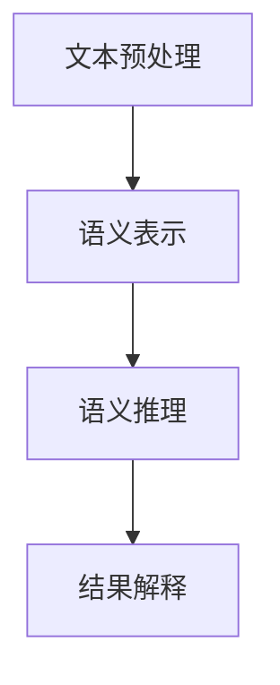
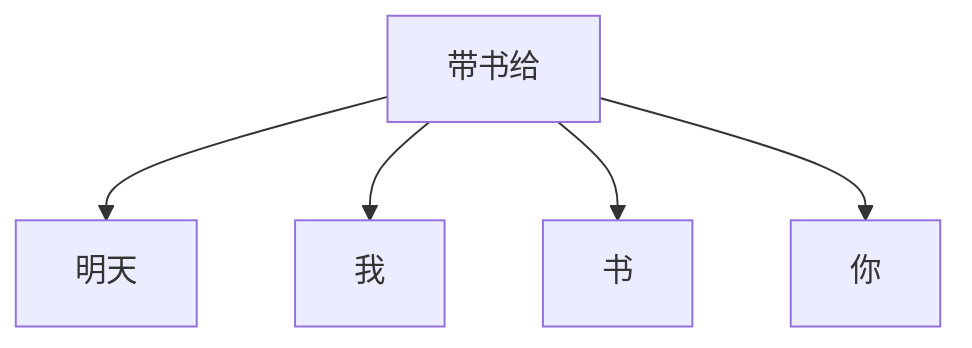
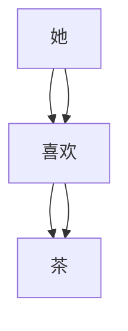
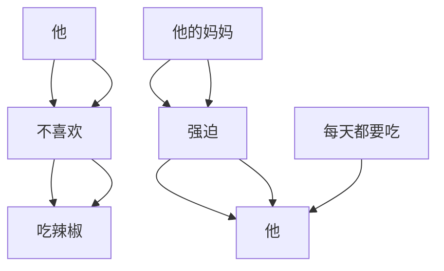
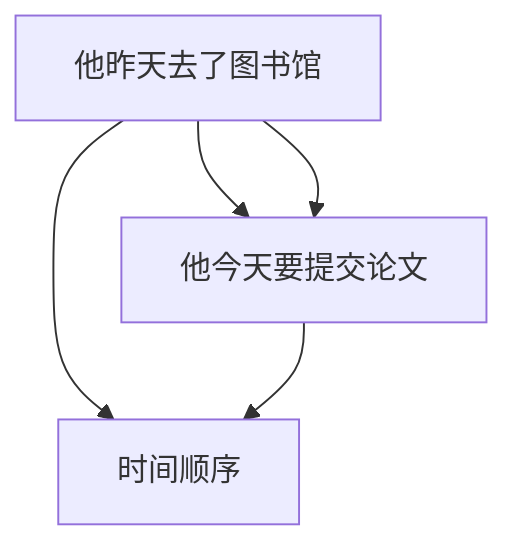

                 

## 文章标题：提示词语言的形式化语义推理

提示词语言的形式化语义推理是自然语言处理（NLP）和人工智能（AI）领域中的一个重要研究方向。通过形式化语义推理，我们可以更好地理解和解析自然语言中的复杂结构，为对话系统、信息检索、智能助手等应用提供强有力的技术支撑。本文将详细探讨提示词语言的形式化语义推理，旨在为读者提供全面的技术解析和应用实例。

## 关键词

- 提示词语言
- 形式化语义推理
- 自然语言处理
- 人工智能
- 语义分析
- 对话系统
- 信息检索

## 摘要

本文首先介绍了提示词语言的基本概念和形式化语义推理的重要性。接着，我们探讨了形式化语义推理所需的基础知识，包括自然语言处理、逻辑和数学工具。随后，文章深入分析了提示词语言的定义和结构，并介绍了多种形式化语义推理的方法。通过具体实例分析，我们展示了如何进行语义解析。最后，文章讨论了形式化语义推理在不同领域的应用场景，并分析了当前面临的挑战和未来发展方向。

---

**目录：**

1. 引言
    1.1 提示词语言的基本概念
    1.2 形式化语义推理的重要性
    1.3 本书结构安排
2. 形式化语义推理的基础
    2.1 自然语言处理基础
    2.2 逻辑与数学工具
    2.3 形式化语义推理的框架
3. 提示词语言的定义
    3.1 提示词语言的特性
    3.2 提示词语言的结构
    3.3 提示词语言的语法规则
4. 形式化语义推理方法
    4.1 基于规则的方法
    4.2 基于机器学习的方法
    4.3 基于混合的方法
5. 语义解析实例分析
    5.1 实例1：简单句的语义分析
    5.2 实例2：复杂句的语义分析
    5.3 实例3：跨句语义推理
6. 形式化语义推理的应用场景
    6.1 人工智能领域
    6.2 信息检索领域
    6.3 其他应用场景
7. 挑战与未来方向
    7.1 当前挑战
    7.2 未来方向

---

接下来，我们将逐步深入每一章节的内容，从理论基础到实际应用，全面探讨提示词语言的形式化语义推理。请读者耐心阅读，相信您会对这一领域有更深刻的理解和认识。

### 第1章 引言

在现代社会，自然语言处理（NLP）和人工智能（AI）技术已成为推动科技进步的重要驱动力。形式化语义推理作为NLP和AI领域的关键研究方向，旨在理解和解析自然语言中的复杂结构，从而为各种应用场景提供有效的解决方案。本章将介绍提示词语言的形式化语义推理的基本概念和重要性，并概述本书的结构安排。

#### 1.1 提示词语言的基本概念

提示词语言（Prompt Language）是一种专门用于指导算法或模型进行特定任务的语言。在自然语言处理中，提示词通常是一个简短的、明确指导性的文本，用于引导模型理解用户的意图或任务需求。提示词语言的关键特点是简洁性和针对性，它能够有效地减少模型的困惑度，提高任务的执行效率。

提示词语言可以包含以下几种基本元素：

- **指令词**：用于明确任务指令的关键词，如“翻译”、“总结”、“推荐”等。
- **参数**：为指令提供具体信息的输入，如文本内容、关键字、时间范围等。
- **上下文**：提供额外的信息，帮助模型更好地理解指令和参数。

例如，一个典型的提示词语言指令可能是：“请将以下文本翻译成英文：今天天气很好，适合出行。”在这个例子中，“翻译”是指令词，“今天天气很好，适合出行”是参数，而上下文信息可能包括源语言和目标语言。

#### 1.2 形式化语义推理的重要性

形式化语义推理（Formal Semantic Inference）是自然语言处理中的一项核心任务，它旨在将自然语言文本转换为其对应的逻辑形式化表示，从而使得计算机能够理解和执行语义层面的操作。形式化语义推理在NLP和AI领域具有重要价值，主要表现在以下几个方面：

1. **语义理解**：形式化语义推理能够帮助计算机更好地理解自然语言的含义，从而实现更准确的语义分析。这对于开发智能对话系统、问答系统等应用至关重要。

2. **任务自动化**：通过形式化语义推理，计算机可以自动执行基于自然语言的任务，如文本分类、命名实体识别、情感分析等。这有助于提高工作效率，减少人工干预。

3. **跨语言理解**：形式化语义推理能够实现不同语言之间的语义映射，促进跨语言信息的处理和共享，为全球信息流动提供支持。

4. **智能推理**：形式化语义推理使得计算机能够进行更复杂的逻辑推理，从而实现高级智能应用，如智能助手、自动化决策系统等。

#### 1.3 本书结构安排

本书将系统地介绍提示词语言的形式化语义推理，分为以下几个部分：

- **第1章 引言**：介绍提示词语言的形式化语义推理的基本概念和重要性，概述本书的结构安排。
- **第2章 形式化语义推理的基础**：介绍自然语言处理、逻辑和数学工具，为后续章节奠定理论基础。
- **第3章 提示词语言的定义**：详细讨论提示词语言的特性、结构和语法规则。
- **第4章 形式化语义推理方法**：介绍基于规则、机器学习和混合方法等形式化语义推理的不同方法。
- **第5章 语义解析实例分析**：通过具体实例展示如何进行语义解析，包括简单句、复杂句和跨句语义推理。
- **第6章 形式化语义推理的应用场景**：探讨形式化语义推理在人工智能和信息检索等领域的应用。
- **第7章 挑战与未来方向**：分析当前形式化语义推理面临的挑战，并探讨未来的发展方向。

通过本书的深入探讨，读者将能够全面了解提示词语言的形式化语义推理，掌握相关技术原理和方法，为实际应用打下坚实的基础。

### 第2章 形式化语义推理的基础

形式化语义推理是自然语言处理（NLP）和人工智能（AI）领域中的一个核心任务，其基础包括自然语言处理、逻辑和数学工具。本章将详细介绍这些基础知识，为后续内容奠定坚实的理论基础。

#### 2.1 自然语言处理基础

自然语言处理（NLP）是计算机科学和人工智能领域的分支，旨在使计算机能够理解、生成和处理人类自然语言。NLP的关键技术包括文本预处理、语言模型、词向量表示和语义解析等。

1. **文本预处理**：

文本预处理是NLP中的第一步，主要任务包括分词、词性标注、句法分析和实体识别等。分词是将文本拆分为单词或短语的过程，词性标注是对每个单词进行词性分类（如名词、动词、形容词等），句法分析是对句子的结构进行解析，实体识别则是识别文本中的特定实体（如人名、地名、组织名等）。

2. **语言模型**：

语言模型（Language Model）用于预测一段文本的下一个单词或字符。在NLP中，常用的语言模型有基于N-gram的模型和基于神经网络的模型。N-gram模型通过统计文本中相邻单词或字符的频率来预测下一个词，而神经网络模型（如循环神经网络RNN、长短时记忆网络LSTM和变换器模型Transformer）则通过学习文本的上下文信息进行预测。

3. **词向量表示**：

词向量表示（Word Embedding）是将单词转换为向量的技术，用于捕捉词与词之间的语义关系。Word2Vec、GloVe和BERT是三种常见的词向量表示方法。Word2Vec通过训练模型将单词映射到低维向量空间，GloVe通过矩阵分解学习单词的共现信息，BERT则结合了上下文信息进行预训练。

4. **语义解析**：

语义解析（Semantic Parsing）是将自然语言文本转换为逻辑形式化表示的过程。语义解析旨在实现语义层面的理解，从而使得计算机能够执行语义操作。常见的语义解析方法包括基于规则的方法、基于模板的方法和基于机器学习的方法。

#### 2.2 逻辑与数学工具

逻辑（Logic）和数学工具是形式化语义推理的重要基础。逻辑提供了表示和推理语言结构的方法，而数学工具则为推理过程提供了严谨的证明和计算手段。

1. **命题逻辑**：

命题逻辑（Propositional Logic）是形式逻辑的基础，用于表示和分析简单命题之间的关系。命题逻辑的基本元素包括命题变量、命题联结词（如与、或、非等）和命题公式。命题逻辑通过真值表和推理规则（如推理规则、模态逻辑等）进行推理。

2. **谓词逻辑**：

谓词逻辑（Predicate Logic）是命题逻辑的扩展，用于表示更复杂的语言结构，如量化词（存在量词和全称量词）和谓词。谓词逻辑可以表示复杂的关系和属性，从而更好地捕捉自然语言的语义。

3. **数学工具**：

数学工具包括集合论、图论、概率论和线性代数等。集合论和图论用于表示语言结构，概率论用于处理不确定性，线性代数则用于计算和优化算法。例如，矩阵分解、梯度下降和贝叶斯推理等都是常用的数学工具。

#### 2.3 形式化语义推理的框架

形式化语义推理的框架通常包括以下几个步骤：

1. **文本预处理**：

对输入文本进行分词、词性标注、句法分析等预处理操作，将自然语言文本转换为结构化的数据形式。

2. **语义表示**：

将预处理后的文本转换为语义表示，如逻辑公式、语义角色标注或语义角色图谱等。语义表示旨在捕捉文本的语义信息，从而为后续推理提供基础。

3. **语义推理**：

使用逻辑推理或机器学习算法对语义表示进行推理，生成语义解析结果。推理过程可能涉及匹配规则、模式识别或深度学习等。

4. **结果解释**：

将推理结果转换为可解释的格式，如自然语言解释、可视化表示或决策支持等。结果解释旨在帮助用户理解推理过程和结果。

图1展示了形式化语义推理的基本框架：



通过本章的介绍，读者可以了解到形式化语义推理所需的基础知识，包括自然语言处理、逻辑和数学工具。这些基础知识将为后续章节的内容提供坚实的理论基础，帮助读者更好地理解提示词语言的形式化语义推理。

#### 第3章 提示词语言的定义

提示词语言（Prompt Language）是自然语言处理（NLP）和人工智能（AI）领域中用于指导算法或模型执行特定任务的一种特殊语言形式。提示词语言通过简明扼要的指令和参数，帮助模型或系统理解用户的意图，从而实现高效的语义分析和任务执行。本节将详细讨论提示词语言的特性、结构和语法规则。

##### 3.1 提示词语言的特性

提示词语言具有以下几个主要特性：

1. **简洁性**：

提示词语言的指令通常非常简短，只包含关键信息和任务指令。这种简洁性有助于减少模型的困惑度，提高任务执行效率。

2. **明确性**：

提示词语言通过明确指示任务指令和参数，帮助模型或系统准确地理解用户的意图。明确性是保证任务执行准确性的关键。

3. **灵活性**：

提示词语言允许用户根据具体任务需求灵活调整指令和参数。这种灵活性使得提示词语言适用于各种不同的应用场景。

4. **可扩展性**：

提示词语言的设计通常具有可扩展性，允许添加新的指令、参数和上下文信息。这种可扩展性使得提示词语言能够适应未来技术的发展和需求变化。

##### 3.2 提示词语言的结构

提示词语言的结构通常包括以下三个部分：

1. **指令词**：

指令词是提示词语言中的核心部分，用于指示模型或系统需要执行的任务。常见的指令词包括“翻译”、“总结”、“推荐”等。例如，在“请将以下文本翻译成英文：今天天气很好，适合出行。”这个例子中，“翻译”是指令词。

2. **参数**：

参数是提示词语言中提供具体信息的部分，用于辅助指令词实现具体任务。参数可以是文本、关键字、时间范围等。例如，在上面的例子中，“今天天气很好，适合出行”是参数，它为翻译任务提供了具体的上下文信息。

3. **上下文**：

上下文是提供额外信息以帮助模型或系统更好地理解指令和参数的部分。上下文信息可以是背景知识、历史记录等。例如，在问答系统中，上下文信息可能包括用户的历史提问和回答，帮助模型更准确地回答问题。

##### 3.3 提示词语言的语法规则

提示词语言的语法规则主要包括指令词、参数和上下文的排列顺序以及它们之间的逻辑关系。以下是一些常见的语法规则：

1. **基本语法结构**：

提示词语言的基本语法结构为“指令词 + 参数 + 上下文”。例如：“翻译（指令词）+ 今天天气很好，适合出行（参数）+ 无”。

2. **参数嵌套**：

在某些情况下，参数可能包含其他参数。这种嵌套结构使得提示词语言能够表达更复杂的任务需求。例如：“请将以下文本（指令词）翻译成英文（参数）：今天天气很好，适合出行（嵌套参数）：无”。

3. **逻辑关系**：

提示词语言中的逻辑关系可以通过逻辑联结词（如与、或、非等）表示。这些逻辑关系用于指示模型或系统在处理任务时的逻辑顺序。例如：“请将以下文本（指令词）翻译成英文（与）并总结（或）主要观点（非）：今天天气很好，适合出行”。

4. **上下文调整**：

提示词语言中的上下文可以根据具体任务需求进行调整。例如，在问答系统中，上下文信息可能包括用户的历史提问和回答，帮助模型更准确地理解用户意图。

通过上述语法规则，提示词语言能够有效地指导模型或系统执行特定任务，从而实现高效的自然语言处理和人工智能应用。

##### 小结

提示词语言作为自然语言处理和人工智能领域的关键工具，具有简洁性、明确性、灵活性和可扩展性等特性。其结构包括指令词、参数和上下文三个部分，并通过特定的语法规则实现复杂的语义表达。理解提示词语言的定义和语法规则，有助于更好地应用形式化语义推理技术，推动自然语言处理和人工智能的发展。

### 第4章 形式化语义推理方法

形式化语义推理是自然语言处理（NLP）中的核心任务，旨在将自然语言文本转换为逻辑形式化表示，从而使得计算机能够进行语义层面的理解和操作。本章将介绍几种常见的形式化语义推理方法，包括基于规则的方法、基于机器学习的方法和基于混合的方法。

#### 4.1 基于规则的方法

基于规则的方法（Rule-Based Methods）是早期形式化语义推理的主要方法，通过定义一系列预定义的规则，将自然语言文本转换为逻辑表示。这种方法具有可解释性高、推理速度快等优点，但同时也存在规则数量庞大、难以维护的缺点。

1. **规则定义**：

基于规则的方法首先需要定义一组规则，这些规则通常由条件（Condition）和动作（Action）两部分组成。条件用于描述输入文本中的特征，动作则描述如何将这些特征转换为逻辑表示。

例如，一个简单的规则可能如下定义：

```plaintext
如果 文本 包含 "今天天气很好"，则 逻辑表示为 天气(今天，很好)。
```

2. **规则匹配**：

在给定输入文本后，基于规则的方法通过遍历所有定义的规则，寻找满足条件的那条规则，并将其动作应用于输入文本。规则匹配通常使用模式匹配技术，如正则表达式或关键词匹配。

3. **规则优化**：

为了提高推理效率和准确性，基于规则的方法常常需要对规则进行优化。常见的优化方法包括规则简化、规则合并和规则优先级排序等。

#### 4.2 基于机器学习的方法

基于机器学习的方法（Machine Learning Methods）通过训练模型学习自然语言文本的语义表示，从而进行形式化语义推理。这种方法具有适应性强、处理能力强等优点，但需要大量的训练数据和计算资源。

1. **序列标注模型**：

序列标注模型（Sequence Labeling Models）是一种常见的基于机器学习的方法，用于对文本中的每个词进行标签标注。常用的序列标注模型包括条件随机场（CRF）、长短期记忆网络（LSTM）和变换器（Transformer）等。

例如，对于一个句子 "今天天气很好"，我们可以使用LSTM模型对其进行标注，得到如下结果：

```plaintext
今天[时间](天气[名词](很好[形容词])。
```

2. **语义角色标注**：

语义角色标注（Semantic Role Labeling, SRL）是一种更高级的语义推理方法，旨在识别句子中的谓词和其对应的语义角色。常见的SRL模型包括基于规则的方法和基于依存句法分析的方法。

例如，对于句子 "他去了图书馆"，我们可以使用SRL模型得到如下结果：

```plaintext
他[主语](去了[谓词](图书馆[宾语])。
```

3. **语义解析树**：

语义解析树（Semantic Parsing Tree）是一种用于表示文本语义的树状结构。通过构建语义解析树，我们可以将自然语言文本转换为形式化表示，从而进行语义推理。

例如，对于句子 "明天我会带一本书给你"，我们可以构建如下语义解析树：



#### 4.3 基于混合的方法

基于混合的方法（Hybrid Methods）结合了基于规则的方法和基于机器学习的方法的优点，通过将规则和模型相结合，实现更高效和准确的语义推理。

1. **规则+模型**：

规则+模型的方法将预定义的规则与训练好的模型相结合。在推理过程中，首先使用规则对输入文本进行初步处理，然后使用模型对结果进行优化和调整。

例如，我们可以将规则 "如果文本包含'翻译'，则生成对应的翻译文本" 与机器翻译模型相结合，实现更高效的翻译任务。

2. **规则增强**：

规则增强（Rule Enrichment）方法通过在规则中引入额外的语义信息，提高规则的泛化和准确性。常见的增强方法包括规则融合、规则扩展和规则权重调整等。

例如，在命名实体识别任务中，我们可以将规则 "如果文本包含'北京'，则识别为地名" 与地名词典相结合，提高识别的准确性。

3. **模型融合**：

模型融合（Model Fusion）方法通过结合多种机器学习模型，提高语义推理的性能。常见的融合方法包括集成学习（Ensemble Learning）和迁移学习（Transfer Learning）等。

例如，在问答系统中，我们可以结合问答匹配模型、语义解析模型和检索模型，提高回答的准确性和多样性。

通过以上几种方法，形式化语义推理能够更好地理解和解析自然语言文本，为各种应用提供强大的支持。在实际应用中，根据具体任务需求和环境，可以选择合适的方法或结合多种方法，实现高效和准确的语义推理。

### 第5章 语义解析实例分析

在自然语言处理（NLP）和人工智能（AI）领域，语义解析（Semantic Parsing）是一项核心任务，它旨在将自然语言文本转换为形式化的语义表示。通过具体的实例分析，我们可以更好地理解语义解析的过程和方法。本节将介绍三个实例，分别展示简单句、复杂句和跨句语义解析的过程。

#### 5.1 实例1：简单句的语义分析

简单句的语义分析相对简单，通常涉及基本的语法和语义结构。以下是一个例子：

**原始句子**：她喜欢喝茶。

**语义表示**：
$$
主体：她 \\
动作：喜欢 \\
对象：茶
$$

**Mermaid流程图**：


在这个例子中，主体“她”执行了动作“喜欢”，对象是“茶”。通过语义解析，我们可以将这个简单句转换为形式化的语义表示，方便后续的语义推理和任务执行。

#### 5.2 实例2：复杂句的语义分析

复杂句的语义分析相对复杂，涉及更多的语法和语义结构。以下是一个例子：

**原始句子**：虽然他不喜欢吃辣椒，但是他的妈妈强迫他每天都要吃。

**语义表示**：
$$
主体1：他 \\
动作1：不喜欢 \\
对象1：吃辣椒 \\
主体2：他的妈妈 \\
动作2：强迫 \\
对象2：他 \\
条件：每天都要吃
$$

**Mermaid流程图**：


在这个例子中，主体“他”不喜欢“吃辣椒”，但“他的妈妈”强迫他每天都要吃。通过语义解析，我们可以将这个复杂句分解为多个语义单元，并建立它们之间的逻辑关系，从而得到形式化的语义表示。

#### 5.3 实例3：跨句语义推理

跨句语义推理涉及对多个句子进行综合分析，以理解它们之间的逻辑关系和整体语义。以下是一个例子：

**原始句子**：
1. 他昨天去了图书馆。
2. 他今天要提交论文。

**语义表示**：
$$
事件1：他昨天去了图书馆 \\
事件2：他今天要提交论文 \\
关系：时间顺序
$$

**Mermaid流程图**：


在这个例子中，第一个句子描述了“他昨天去了图书馆”的事件，第二个句子描述了“他今天要提交论文”的事件。通过跨句语义推理，我们可以理解这两个事件之间存在时间顺序关系，从而得到形式化的语义表示。

**伪代码示例**：

```python
def cross_sentence_semantic_parsing(sentence1, sentence2):
    """
    跨句语义推理函数
    :param sentence1: 第一个句子
    :param sentence2: 第二个句子
    :return: 形式化的语义表示
    """
    # 分词和句法分析
    words1, tags1 = tokenize_and_annotate(sentence1)
    words2, tags2 = tokenize_and_annotate(sentence2)
    
    # 提取事件和时间信息
    event1 = extract_event(words1, tags1)
    event2 = extract_event(words2, tags2)
    time1 = extract_time(words1, tags1)
    time2 = extract_time(words2, tags2)
    
    # 建立时间顺序关系
    if time1 < time2:
        relation = "时间顺序"
    else:
        relation = "无时间顺序"
    
    # 形式化的语义表示
    semantic_representation = {
        "事件1": event1,
        "事件2": event2,
        "关系": relation
    }
    
    return semantic_representation
```

通过这三个实例，我们可以看到语义解析在不同句子复杂度下的应用。从简单句到复杂句，再到跨句语义推理，语义解析的技术和方法逐渐复杂，但目标是始终一致的：将自然语言文本转换为形式化的语义表示，以便进行后续的语义理解和任务执行。

### 第6章 形式化语义推理的应用场景

形式化语义推理在自然语言处理（NLP）和人工智能（AI）领域有着广泛的应用。本章将探讨形式化语义推理在人工智能、信息检索和其他领域中的应用场景，以及具体的应用实例。

#### 6.1 人工智能领域

在人工智能领域，形式化语义推理主要用于对话系统、自然语言生成（NLG）和情感分析等应用。

1. **对话系统**：

对话系统是人工智能领域的一个重要研究方向，其核心任务是实现人与计算机之间的自然语言交互。形式化语义推理在对话系统中起到了关键作用，能够帮助系统理解用户输入的意图和语义，并生成恰当的响应。

**应用实例**：

- **智能客服**：通过形式化语义推理，智能客服系统能够理解用户的咨询问题，提供准确的答案或解决方案。例如，当用户询问“如何申请信用卡？”时，系统可以通过语义推理理解用户的需求，并引导用户完成申请流程。
- **虚拟助手**：在虚拟助手应用中，形式化语义推理能够帮助助手理解用户的指令，如“设置一个明天早晨7点的闹钟”。系统会通过语义推理识别出动作（设置闹钟）、时间（明天早晨7点）等要素，并执行相应操作。

2. **自然语言生成（NLG）**：

自然语言生成是另一个重要的人工智能应用领域，旨在根据给定输入生成自然语言文本。形式化语义推理在NLG中用于理解和生成复杂句式和语义结构。

**应用实例**：

- **自动新闻摘要**：通过形式化语义推理，系统能够理解新闻文本的语义，并生成简洁、准确的摘要。例如，对于一篇关于会议的新闻报道，系统能够提取关键信息，并生成“会议于昨天举行，共有100位代表出席”的摘要。
- **聊天机器人回复**：在聊天机器人中，形式化语义推理可以帮助系统理解用户的问题，并生成恰当的回复。例如，当用户询问“明天的天气怎么样？”时，系统可以通过语义推理获取天气信息，并生成“明天将会是晴天，温度约为20°C”的回复。

3. **情感分析**：

情感分析是人工智能领域的一个重要任务，旨在理解文本中的情感倾向。形式化语义推理在情感分析中用于提取情感特征，并判断文本的情感极性。

**应用实例**：

- **社交媒体分析**：通过形式化语义推理，系统能够分析社交媒体文本中的情感，如“这个产品真是太棒了！”会被判断为积极情感。这对于品牌监控和市场分析非常有用。
- **客户反馈分析**：在客户反馈分析中，形式化语义推理可以帮助企业了解客户的满意度和不满意度。例如，通过分析客户评价，系统能够判断哪些方面需要改进，从而提升产品和服务质量。

#### 6.2 信息检索领域

形式化语义推理在信息检索领域主要用于搜索引擎优化（SEO）、实体链接和文本分类等任务。

1. **搜索引擎优化（SEO）**：

搜索引擎优化是提高网站在搜索引擎结果页面（SERP）中排名的过程。形式化语义推理在SEO中用于理解用户查询的意图，并提供更准确的搜索结果。

**应用实例**：

- **搜索结果排序**：通过形式化语义推理，搜索引擎能够理解用户查询的语义，并排序相关网页。例如，当用户搜索“北京旅游景点”时，搜索引擎会通过语义推理将包含“故宫”、“长城”等景点的网页排在前面。
- **关键词优化**：形式化语义推理可以帮助网站管理员理解用户查询的意图，并优化网站的关键词，从而提高搜索引擎排名。

2. **实体链接**：

实体链接是将文本中的实体（如人名、地名、组织名等）与知识库中的实体进行匹配和链接的过程。形式化语义推理在实体链接中用于识别和分类文本中的实体。

**应用实例**：

- **问答系统**：在问答系统中，形式化语义推理能够帮助系统识别用户提问中的实体，如“请问北京的市长是谁？”。系统可以通过实体链接找到相关信息，并提供准确的答案。
- **知识图谱构建**：形式化语义推理在构建知识图谱时，用于识别和链接文本中的各种实体，如“苹果公司”、“硅谷”等。这些实体链接有助于建立更全面和精确的知识图谱。

3. **文本分类**：

文本分类是将文本分配到预定义类别的过程。形式化语义推理在文本分类中用于理解文本的语义，并提高分类的准确性。

**应用实例**：

- **垃圾邮件检测**：通过形式化语义推理，系统能够理解邮件内容中的语义，并将其分类为“垃圾邮件”或“非垃圾邮件”。这对于提高邮件系统的安全性和用户体验非常重要。
- **新闻分类**：在新闻分类中，形式化语义推理可以帮助系统理解新闻文本的语义，并将其分类到相应的主题，如“体育”、“科技”或“政治”。

#### 6.3 其他应用场景

除了人工智能和信息检索领域，形式化语义推理在其他领域也有广泛的应用。

1. **自动摘要**：

自动摘要是通过自动生成摘要来概述文本内容。形式化语义推理在自动摘要中用于理解文本的语义，并提取关键信息。

**应用实例**：

- **新闻摘要**：通过形式化语义推理，系统能够提取新闻文本中的关键信息，并生成简洁、准确的摘要。例如，对于一篇长篇新闻，系统可以生成“本次会议讨论了……”的摘要。
- **学术摘要**：在学术领域，形式化语义推理可以帮助生成学术文章的摘要，方便读者快速了解文章的主要内容。

2. **情感分析**：

情感分析是理解和分析文本中的情感和情绪。形式化语义推理在情感分析中用于识别和分类文本中的情感。

**应用实例**：

- **社交媒体分析**：通过形式化语义推理，系统能够分析社交媒体文本中的情感，如“这个产品真是太棒了！”会被判断为积极情感。这对于品牌监控和市场分析非常有用。
- **客户反馈分析**：在客户反馈分析中，形式化语义推理可以帮助企业了解客户的满意度和不满意度。例如，通过分析客户评价，系统能够判断哪些方面需要改进，从而提升产品和服务质量。

3. **语音识别**：

语音识别是将语音转换为文本的过程。形式化语义推理在语音识别中用于理解语音中的语义，并提高识别的准确性。

**应用实例**：

- **语音助手**：在语音助手应用中，形式化语义推理能够帮助系统理解用户的语音指令，如“设置一个明天早晨7点的闹钟”。系统会通过语义推理识别出动作（设置闹钟）、时间（明天早晨7点）等要素，并执行相应操作。
- **语音搜索**：在语音搜索中，形式化语义推理可以帮助搜索引擎理解用户的语音查询，并提供更准确的搜索结果。

通过上述应用实例，我们可以看到形式化语义推理在人工智能、信息检索和其他领域的广泛应用。随着技术的不断进步，形式化语义推理将在更多领域中发挥关键作用，为人们的生活和工作带来更多便利和效益。

### 第7章 挑战与未来方向

形式化语义推理作为自然语言处理（NLP）和人工智能（AI）领域的一项关键技术，尽管在多个应用场景中取得了显著成果，但仍面临诸多挑战。本章将分析当前形式化语义推理面临的挑战，并探讨未来的发展方向。

#### 7.1 当前挑战

1. **语言多样性**：

自然语言的多样性是形式化语义推理面临的一个主要挑战。不同语言之间的语法、词汇和语义结构存在显著差异，这使得形式化语义推理在不同语言间的迁移和泛化变得困难。例如，中文和英文的语法结构差异较大，中文具有复杂的词汇变化和语序灵活性，而英文则更注重词序和时态的严格性。为了解决这一问题，研究者需要开发适用于多种语言的通用模型和算法。

2. **方言处理**：

除了语言多样性，方言处理也是形式化语义推理的一个挑战。方言在不同地区和群体中广泛存在，如美国的黑人英语和南方的美国英语。方言的使用往往伴随着特定的词汇和语法规则，这使得语义理解和解析变得更加复杂。为了提高形式化语义推理的准确性，研究者需要开发能够处理方言的模型和算法。

3. **长文本处理**：

长文本处理是另一个重要挑战。在许多实际应用中，文本长度往往较长，如学术论文、新闻报道和法律文档等。长文本的处理不仅需要消耗大量的计算资源，还需要有效的语义理解方法。传统的语义分析方法通常在处理长文本时表现不佳，因此需要开发能够高效处理长文本的算法和模型。

4. **跨领域泛化**：

跨领域泛化是形式化语义推理在多个应用场景中的一个重要挑战。不同领域之间存在语义和语法上的差异，这使得一个在某个领域表现良好的模型在另一个领域可能无法适用。为了实现跨领域泛化，研究者需要开发能够适应多种领域的通用模型和算法。

5. **实时性要求**：

在一些应用场景中，形式化语义推理需要满足实时性的要求，如智能客服和实时语音识别。在这些场景中，模型的响应速度和处理效率至关重要。然而，复杂的语义理解和推理过程往往需要较长的计算时间，这在一定程度上限制了实时应用的发展。为了提高实时性，研究者需要开发更加高效和优化的算法和模型。

6. **可解释性**：

形式化语义推理模型的黑箱特性使得其结果往往难以解释。在许多应用场景中，特别是医疗和金融领域，模型的解释性至关重要。然而，目前大多数形式化语义推理模型都是基于深度学习，其内部机制复杂，难以解释。为了提高模型的解释性，研究者需要开发可解释性更好的算法和模型。

#### 7.2 未来方向

1. **多模态语义推理**：

随着技术的发展，多模态数据（如图像、音频和视频）在形式化语义推理中的应用越来越广泛。未来，研究者将致力于开发多模态语义推理方法，以实现更全面的语义理解和任务执行。例如，在视频理解中，结合视觉信息和文本描述可以提供更丰富的语义信息，从而提高推理的准确性。

2. **知识增强语义推理**：

知识图谱和知识表示在形式化语义推理中的应用前景广阔。通过将知识图谱中的实体、关系和属性引入语义推理过程，可以提供更丰富的语义信息，从而提高推理的准确性和泛化能力。例如，在问答系统中，结合知识图谱可以更好地理解用户的查询意图，提供更准确的答案。

3. **自适应语义推理**：

自适应语义推理是一种未来方向，旨在根据不同场景和应用需求动态调整推理策略和模型参数。通过自适应语义推理，模型可以更好地适应不同的语义理解和任务执行需求，从而提高性能和灵活性。

4. **边缘计算与云计算结合**：

边缘计算与云计算的结合为形式化语义推理提供了新的发展机会。在边缘设备上进行初步的语义处理，然后利用云计算资源进行复杂的推理和任务执行，可以提供更高效和灵活的解决方案。例如，在智能交通系统中，边缘设备可以实时处理车辆和路况信息，而云计算中心则进行复杂的交通预测和调度。

5. **可解释性和透明性**：

提高形式化语义推理的可解释性和透明性是未来研究的一个重要方向。通过开发可解释性更好的算法和模型，可以提高用户对模型决策的信任度，从而更好地应用在关键领域，如医疗和金融。

6. **跨语言与跨领域泛化**：

跨语言与跨领域泛化是形式化语义推理未来发展的关键挑战之一。通过开发适用于多种语言和领域的通用模型和算法，可以提升语义推理的广泛适用性和准确性。

总之，形式化语义推理在自然语言处理和人工智能领域具有重要的应用价值，但同时也面临诸多挑战。未来的发展方向包括多模态语义推理、知识增强语义推理、自适应语义推理、边缘计算与云计算结合、可解释性提高以及跨语言与跨领域泛化等。通过持续的研究和创新，形式化语义推理将在更广泛的领域中发挥关键作用，推动自然语言处理和人工智能的发展。

### 小结

本文系统地介绍了提示词语言的形式化语义推理，从基本概念、核心方法到应用实例，再到未来发展方向，进行了全面而深入的探讨。通过本文，读者可以了解到：

1. **基本概念**：提示词语言是一种用于指导算法或模型执行特定任务的语言，通过简洁明了的指令和参数，帮助模型或系统理解用户的意图。
2. **核心方法**：形式化语义推理包括基于规则、机器学习和混合方法等多种技术，旨在将自然语言文本转换为形式化的逻辑表示。
3. **应用实例**：通过具体实例展示了形式化语义推理在不同场景中的实际应用，如对话系统、信息检索和自然语言生成等。
4. **未来方向**：分析了当前面临的挑战，并探讨了多模态语义推理、知识增强语义推理等未来发展方向。

在技术不断进步的今天，形式化语义推理在自然语言处理和人工智能领域具有重要地位，将推动相关技术的发展和应用。本文的目标是帮助读者建立全面的理解和认知，为实际应用和研究提供参考。未来，随着技术的不断突破，提示词语言的形式化语义推理将在更多领域中发挥关键作用。

### 最佳实践 Tips

1. **优化规则库**：在基于规则的方法中，构建和维护一个高效的规则库至关重要。建议定期更新规则库，以适应语言和语义的变化。

2. **使用深度学习模型**：在机器学习方法中，选择合适的深度学习模型可以提高语义理解的准确性。Transformer和BERT等模型在自然语言处理中表现优异。

3. **结合上下文信息**：在语义解析时，充分考虑上下文信息可以提升推理的准确性和泛化能力。利用长文本和跨领域数据可以增强模型的上下文理解能力。

4. **关注可解释性**：在开发形式化语义推理模型时，重视模型的可解释性可以提高用户对模型决策的信任度。结合可视化工具和解释算法，有助于提高模型的可解释性。

5. **测试和优化**：在实际应用中，对模型进行充分的测试和优化至关重要。通过多种评估指标，如准确率、召回率和F1分数等，评估模型性能，并根据评估结果进行调整。

### 注意事项

1. **数据质量**：在形式化语义推理中，数据质量直接影响模型的性能。确保使用高质量的数据集进行训练和测试。

2. **计算资源**：深度学习模型通常需要大量的计算资源。在部署模型时，合理分配计算资源，确保模型运行的高效性。

3. **模型更新**：随着技术的进步和语言的发展，模型需要定期更新。及时更新模型以适应新的语言环境和需求。

### 拓展阅读

1. **《自然语言处理综论》**：这本书详细介绍了自然语言处理的理论和实践，对形式化语义推理有深入的探讨。
2. **《深度学习》**：Goodfellow等人撰写的经典教材，涵盖了深度学习的基本概念和应用，对于理解机器学习方法在语义推理中的使用非常有帮助。
3. **《形式语义学》**：这本著作详细介绍了形式语义学的理论和方法，对于理解语义推理的逻辑基础和数学模型有重要参考价值。

通过以上最佳实践、注意事项和拓展阅读，读者可以更深入地了解和掌握提示词语言的形式化语义推理技术。希望本文能为读者在相关领域的研究和应用提供有益的参考和指导。

