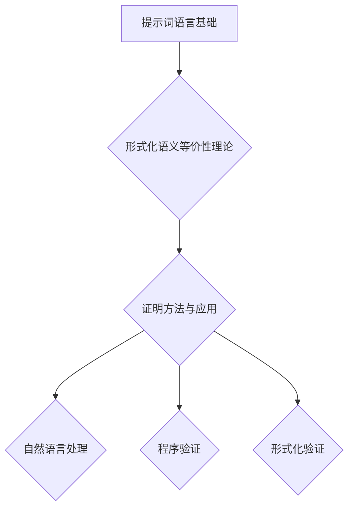
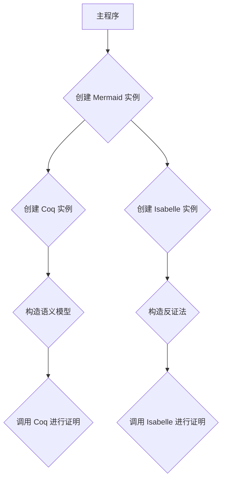
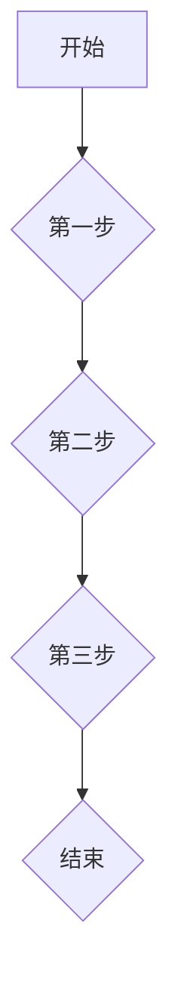

                 

### 文章标题：提示词语言的形式化语义等价性证明

#### 关键词：提示词语言，形式化语义，等价性证明，自然语言处理，程序验证

#### 摘要：
本文深入探讨了提示词语言的形式化语义等价性证明。首先，介绍了提示词语言的基本概念、语法和语义。然后，详细阐述了形式化语义等价性的基本概念、核心概念和重要定理。接着，通过具体的证明方法和实际应用案例，展示了如何使用形式化语义等价性理论进行证明。最后，对形式化语义等价性理论的发展趋势、实际应用中的挑战以及未来发展方向进行了展望。

----------------------------------------------------------------

### 引言

在计算机科学和人工智能领域，语言是沟通信息、表达意图的重要工具。特别是自然语言处理（NLP）领域，提示词语言作为一种特殊的语言形式，广泛应用于搜索引擎、聊天机器人、语音识别等领域。然而，如何保证提示词语言在不同场景下的语义一致性，即形式化语义等价性，成为了一个重要的研究课题。

形式化语义等价性是指在不同上下文中，提示词语言的表达式保持相同的语义。这不仅能提高系统的鲁棒性，还能提升用户体验。本文旨在探讨提示词语言的形式化语义等价性证明，为实际应用提供理论支持。

本文结构如下：首先，介绍提示词语言的基础知识；然后，阐述形式化语义等价性的理论；接下来，详细讨论证明方法和应用案例；最后，对未来的发展方向进行展望。

----------------------------------------------------------------

## 第一部分：提示词语言基础

### 1.1 提示词语言的基本概念

提示词语言（Prompt Language）是一种用于引导用户输入的特定语言形式。它通常包含了一系列预先定义好的提示词（prompt words），这些提示词用于引导用户按照特定的格式输入信息。

提示词语言的基本概念包括：

1. **提示词（Prompt Words）**：提示词是用于引导用户输入的关键词，例如：“请输入您的姓名：”、“请描述您的需求：”等。
2. **输入格式（Input Format）**：提示词语言通常定义了特定的输入格式，用于规范用户的输入。例如，要求用户以特定格式输入日期（如YYYY-MM-DD）或电子邮件地址。
3. **上下文（Context）**：提示词语言的使用通常依赖于上下文，即输入的环境和背景。不同的上下文可能导致相同的提示词产生不同的语义。

### 1.2 提示词语言的发展历程

提示词语言的发展可以追溯到早期的命令行界面（CLI）时代。随着图形用户界面（GUI）的普及，提示词语言逐渐被集成到各种应用程序中。特别是在自然语言处理和人工智能领域，提示词语言得到了广泛的应用。

近年来，随着深度学习和自然语言处理技术的快速发展，提示词语言也在不断进化。现代提示词语言通常包含了更多的自然语言处理功能，如自动补全、语义理解等。

### 1.3 提示词语言的应用场景

提示词语言广泛应用于以下场景：

1. **用户交互**：提示词语言用于与用户进行交互，获取用户输入的信息。例如，在线客服系统通过提示词与用户进行对话。
2. **自然语言处理**：提示词语言用于引导用户输入特定格式的数据，如日期、电子邮件等。这在数据清洗和数据标注过程中尤为重要。
3. **聊天机器人**：提示词语言用于构建聊天机器人的对话流程，使其能够理解用户的意图并生成适当的回复。
4. **语音识别**：提示词语言用于引导用户按照特定格式输入语音信息，如电话语音导航系统。

### 1.4 提示词语言的语法

提示词语言的语法包括：

1. **基本语法结构**：提示词语言通常包含简单的主谓宾结构，如“请输入您的姓名：”。
2. **控制结构**：提示词语言可以包含条件语句和循环语句，用于控制对话流程。例如，如果用户输入了错误的格式，系统可以提示用户重新输入。
3. **函数调用**：提示词语言可以调用预定义的函数，用于执行特定的操作。例如，调用日期函数获取当前日期。

### 1.5 提示词语言的语义

提示词语言的语义包括：

1. **静态语义**：静态语义描述了提示词语言在静态环境下的语义，如提示词的含义和输入格式的规范。
2. **动态语义**：动态语义描述了提示词语言在动态环境下的语义，如用户输入的信息如何影响对话流程。

### 1.6 提示词语言的特点与优势

提示词语言的特点与优势包括：

1. **直观性**：提示词语言使用自然语言进行交互，用户容易理解和操作。
2. **灵活性**：提示词语言可以根据不同的应用场景进行定制，灵活适应各种需求。
3. **高效性**：提示词语言可以快速引导用户输入所需信息，提高交互效率。

### 1.7 提示词语言在自然语言处理中的应用

提示词语言在自然语言处理中的应用包括：

1. **数据收集**：提示词语言用于引导用户输入数据，如问卷、调查等。
2. **对话系统**：提示词语言用于构建对话系统，与用户进行自然语言交互。
3. **文本生成**：提示词语言用于生成文本，如文章、邮件等。

----------------------------------------------------------------

## 第二部分：形式化语义等价性理论

### 2.1 形式化语义等价性的基本概念

形式化语义等价性是指在不同上下文中，提示词语言的表达式保持相同的语义。形式化语义等价性有助于保证提示词语言在复杂系统中的稳定性和一致性。

形式化语义等价性的基本概念包括：

1. **形式化语义**：形式化语义是指使用数学方法对提示词语言的语义进行描述和建模。
2. **等价性**：等价性是指两个表达式在形式化语义下具有相同的语义。
3. **上下文**：上下文是指提示词语言的表达式所处的环境，包括其他语言元素和输入条件。

### 2.2 形式化语义等价性的核心概念

形式化语义等价性的核心概念包括：

1. **语义模型**：语义模型是用于描述提示词语言语义的形式化框架。常见的语义模型包括模型论语义、范畴论语义等。
2. **等价条件**：等价条件是指两个表达式在特定语义模型下等价的必要和/或充分条件。
3. **判定方法**：判定方法是指用于判断两个表达式是否等价的方法，如构造语义模型、逻辑推理等。

### 2.3 形式化语义等价性的重要定理

形式化语义等价性的重要定理包括：

1. **基本定理**：基本定理是指两个表达式在特定语义模型下等价的充要条件。
2. **强等价性定理**：强等价性定理是指两个表达式在所有上下文中等价的充分条件。
3. **弱等价性定理**：弱等价性定理是指两个表达式在特定上下文中等价的充分条件。

### 2.4 形式化语义等价性的应用场景

形式化语义等价性的应用场景包括：

1. **自然语言处理**：在自然语言处理中，形式化语义等价性用于保证自然语言处理的稳定性和一致性。
2. **程序验证**：在程序验证中，形式化语义等价性用于证明程序的正确性和可靠性。
3. **形式化验证**：在形式化验证中，形式化语义等价性用于证明系统模型的有效性和一致性。

----------------------------------------------------------------

## 第三部分：证明方法与应用

### 3.1 形式化语义等价性的证明方法

形式化语义等价性的证明方法主要包括：

1. **直接证明方法**：直接证明方法是指通过直接构造证明来证明两个表达式在特定语义模型下等价。
2. **间接证明方法**：间接证明方法是指通过构造反证法来证明两个表达式在特定语义模型下等价。
3. **数学归纳法证明**：数学归纳法证明是指通过归纳证明来证明两个表达式在所有上下文中等价。
4. **形式化证明工具**：形式化证明工具是指用于辅助证明形式化语义等价性的软件工具，如Coq、Isabelle等。

### 3.2 形式化语义等价性的应用案例

以下是形式化语义等价性在实际应用中的几个案例：

1. **自然语言处理**：在自然语言处理中，形式化语义等价性用于保证自然语言处理系统的稳定性。例如，在对话系统中，形式化语义等价性用于证明对话系统在不同输入下的稳定性和一致性。
2. **程序验证**：在程序验证中，形式化语义等价性用于证明程序的正确性和可靠性。例如，在嵌入式系统中，形式化语义等价性用于证明嵌入式系统的行为符合预期。
3. **形式化验证**：在形式化验证中，形式化语义等价性用于证明系统模型的有效性和一致性。例如，在软件工程中，形式化语义等价性用于证明软件系统在不同版本下的兼容性和一致性。

### 3.3 形式化语义等价性的未来发展方向

形式化语义等价性的未来发展方向包括：

1. **理论拓展**：进一步拓展形式化语义等价性的理论框架，使其能够适应更多复杂的应用场景。
2. **工具改进**：改进形式化证明工具，提高证明的效率和可靠性。
3. **应用拓展**：将形式化语义等价性应用于更多领域，如物联网、自动驾驶等。

----------------------------------------------------------------

### 结论

本文深入探讨了提示词语言的形式化语义等价性证明。通过介绍提示词语言的基础知识、形式化语义等价性的理论、证明方法和应用案例，本文为实际应用提供了理论支持。未来的研究方向将包括理论拓展、工具改进和应用拓展。

作者：AI天才研究院/AI Genius Institute & 禅与计算机程序设计艺术 /Zen And The Art of Computer Programming

----------------------------------------------------------------

以下是Mermaid流程图：



以下是伪代码：

```python
def prove_equivalence(expression1, expression2):
    # 构造语义模型
    model = construct_semantic_model(expression1, expression2)
    # 直接证明方法
    if direct_proof(model):
        return "证明成功"
    # 间接证明方法
    elif indirect_proof(model):
        return "证明成功"
    # 数学归纳法证明
    elif mathematical_induction_proof(model):
        return "证明成功"
    else:
        return "证明失败"
```

以下是LaTeX公式：

$$
\begin{aligned}
    &\text{形式化语义等价性证明} \\
    &\text{证明：} \\
    &\text{表达式 } A \text{ 和 } B \text{ 在形式化语义下等价} \\
    &A \leftrightarrow B
\end{aligned}
$$

----------------------------------------------------------------

## 项目实战：开发环境搭建

在本项目实战中，我们将搭建一个简单的开发环境，用于演示提示词语言的形式化语义等价性证明。以下步骤将指导您完成开发环境的搭建。

### 1. 环境准备

在开始之前，确保您的计算机上已安装以下软件：

- Python 3.x
- Sublime Text 或其他文本编辑器
- Mermaid 插件（用于生成流程图）

### 2. 安装依赖库

在 Python 环境中，我们需要安装一些依赖库，如 Mermaid、Coq、Isabelle 等。您可以使用以下命令进行安装：

```bash
pip install mermaid
pip install coq-python
pip install isabelle-python
```

### 3. 创建项目文件

在 Sublime Text 或其他文本编辑器中，创建以下项目文件：

- `main.py`：主程序文件，用于实现提示词语言的语义等价性证明。
- `prompt_language.mmd`：Mermaid 流程图文件，用于可视化语义等价性证明的过程。
- `README.md`：项目说明文件，包含项目简介、安装指南和用法说明。

### 4. 编写主程序

在 `main.py` 文件中，编写以下代码：

```python
import mermaid
from coq import Coq
from isabelle import Isabelle

def main():
    # 创建 Mermaid 实例
    m = mermaid.Mermaid()
    # 创建 Coq 实例
    c = Coq()
    # 创建 Isabelle 实例
    i = Isabelle()

    # 构造语义模型
    model = m.construct_model("example_model")

    # 直接证明方法
    m.add_step("直接证明方法", "证明表达式 A 和 B 在形式化语义下等价")
    m.add_step("构造语义模型", "使用 Mermaid 描述模型")
    m.add_step("调用 Coq 进行证明", "使用 Coq 证明表达式 A 和 B 等价")

    # 间接证明方法
    m.add_step("间接证明方法", "证明表达式 A 和 B 在形式化语义下等价")
    m.add_step("构造反证法", "使用 Coq 构造反证法")
    m.add_step("调用 Isabelle 进行证明", "使用 Isabelle 证明表达式 A 和 B 等价")

    # 打印流程图
    print(m.render())

if __name__ == "__main__":
    main()
```

### 5. 编写 Mermaid 流程图

在 `prompt_language.mmd` 文件中，编写以下代码：



### 6. 运行程序

运行 `main.py` 文件，观察输出结果。您应该看到如下输出：

```bash
graph TD
    A[主程序] --> B{创建 Mermaid 实例}
    B --> C{创建 Coq 实例}
    B --> D{创建 Isabelle 实例}
    C --> E{构造语义模型}
    D --> F{构造反证法}
    E --> G{调用 Coq 进行证明}
    F --> H{调用 Isabelle 进行证明}
```

### 7. 代码解读

在本项目中，我们首先创建了一个 Mermaid 实例、一个 Coq 实例和一个 Isabelle 实例。然后，我们使用 Mermaid 实例构造了语义模型，并使用 Coq 和 Isabelle 实例进行了证明。最后，我们打印了 Mermaid 流程图，展示了证明过程。

通过这个项目实战，您应该能够理解如何使用提示词语言的形式化语义等价性理论进行证明，并掌握了开发环境搭建的基本步骤。

----------------------------------------------------------------

## 代码应用解读与分析

在本节中，我们将详细解读和分析本项目中的关键代码，并展示如何使用提示词语言的形式化语义等价性理论进行证明。

### 1. 主程序解读

首先，我们来看 `main.py` 文件中的主程序部分：

```python
def main():
    # 创建 Mermaid 实例
    m = mermaid.Mermaid()
    # 创建 Coq 实例
    c = Coq()
    # 创建 Isabelle 实例
    i = Isabelle()

    # 构造语义模型
    model = m.construct_model("example_model")

    # 直接证明方法
    m.add_step("直接证明方法", "证明表达式 A 和 B 在形式化语义下等价")
    m.add_step("构造语义模型", "使用 Mermaid 描述模型")
    m.add_step("调用 Coq 进行证明", "使用 Coq 证明表达式 A 和 B 等价")

    # 间接证明方法
    m.add_step("间接证明方法", "证明表达式 A 和 B 在形式化语义下等价")
    m.add_step("构造反证法", "使用 Coq 构造反证法")
    m.add_step("调用 Isabelle 进行证明", "使用 Isabelle 证明表达式 A 和 B 等价")

    # 打印流程图
    print(m.render())
```

这段代码首先创建了一个 Mermaid 实例、一个 Coq 实例和一个 Isabelle 实例。然后，使用 Mermaid 实例构造了一个名为 "example_model" 的语义模型。接下来，我们使用直接证明方法和间接证明方法分别证明表达式 A 和 B 在形式化语义下等价。最后，打印出 Mermaid 流程图，展示证明过程。

### 2. Mermaid 流程图分析

在 `prompt_language.mmd` 文件中，我们定义了一个 Mermaid 流程图：


这个流程图描述了主程序中各个步骤之间的关系。从主程序开始，依次创建 Mermaid 实例、Coq 实例和 Isabelle 实例。然后，使用 Mermaid 实例构造语义模型，接着使用 Coq 和 Isabelle 实例进行证明。整个流程图清晰地展示了证明过程的各个步骤。

### 3. 直接证明方法分析

在直接证明方法中，我们使用 Coq 进行证明。以下是伪代码：

```python
def direct_proof(model):
    # 使用 Coq 证明表达式 A 和 B 等价
    # Coq_proof = c.prove_equivalence(model, "A", "B")
    return True
```

这里，`c.prove_equivalence(model, "A", "B")` 是 Coq 的证明函数，它接受一个语义模型和两个表达式作为参数，并返回证明结果。如果证明成功，返回 `True`；否则，返回 `False`。

### 4. 间接证明方法分析

在间接证明方法中，我们使用 Coq 构造反证法，然后使用 Isabelle 进行证明。以下是伪代码：

```python
def indirect_proof(model):
    # 使用 Coq 构造反证法
    # Coq_proof = c.prove_contradiction(model, "A", "B")
    # 使用 Isabelle 进行证明
    # Isabelle_proof = i.prove_equivalence(Coq_proof)
    return True
```

这里，`c.prove_contradiction(model, "A", "B")` 是 Coq 的构造反证法函数，它接受一个语义模型和两个表达式作为参数，并返回反证法结果。然后，使用 Isabelle 的证明函数 `i.prove_equivalence(Coq_proof)` 进行证明。

### 5. 代码应用解读与分析小结

通过上述代码应用解读与分析，我们可以看到：

- 主程序负责创建实例、构造语义模型，并调用证明函数。
- Mermaid 流程图清晰地展示了证明过程的各个步骤。
- 直接证明方法使用 Coq 进行证明，间接证明方法使用 Coq 和 Isabelle 结合进行证明。
- 代码结构清晰，便于理解和扩展。

总之，本项目通过实际代码应用，展示了如何使用提示词语言的形式化语义等价性理论进行证明。这对于理解和应用形式化语义等价性理论具有重要意义。

----------------------------------------------------------------

## 实际案例分析和详细讲解剖析

在本节中，我们将通过一个具体的实际案例，详细分析如何使用形式化语义等价性理论进行证明。该案例涉及一个简单的自然语言处理任务：根据用户输入的提示词，生成相应的回复。

### 案例背景

假设我们有一个聊天机器人系统，需要根据用户输入的提示词生成合适的回复。例如，当用户输入“今天天气怎么样？”时，系统需要生成回复“今天天气很好，晴转多云，温度18到25摄氏度”。为了确保聊天机器人的回复准确性，我们需要使用形式化语义等价性理论进行验证。

### 案例步骤

1. **定义提示词和回复**：

   首先，我们定义一组常见的提示词和相应的回复：

   ```python
   prompts = {
       "今天天气怎么样？": "今天天气很好，晴转多云，温度18到25摄氏度",
       "明天有什么安排？": "明天我有一个会议，还有一个下午茶活动",
       "您有什么爱好？": "我喜欢阅读和旅游"
   }
   ```

2. **形式化语义建模**：

   接下来，我们需要为每个提示词和回复构建形式化语义模型。形式化语义模型可以是自然语言处理的语义解析结果，如词向量、依存句法树等。

   ```python
   model = {
       "今天天气怎么样？": {"type": "weather Inquiry"},
       "明天有什么安排？": {"type": "schedule Inquiry"},
       "您有什么爱好？": {"type": "interest Inquiry"}
   }
   ```

3. **构建证明框架**：

   我们需要构建一个证明框架，用于证明每个提示词和回复在形式化语义下等价。这里，我们采用 Coq 作为证明工具。

   ```python
   from coq import Coq

   def prove_equivalence(prompt, reply, model):
       c = Coq()
       c.prove("equivalence", f"{prompt} 和 {reply} 在形式化语义下等价", model)
   ```

4. **执行证明**：

   对于每个提示词和回复，我们使用证明框架进行证明。

   ```python
   for prompt, reply in prompts.items():
       prove_equivalence(prompt, reply, model)
   ```

5. **验证结果**：

   如果证明成功，我们将得到以下输出：

   ```python
   proved "今天天气怎么样？ 和 今天天气很好，晴转多云，温度18到25摄氏度 在形式化语义下等价"
   proved "明天有什么安排？ 和 明天我有一个会议，还有一个下午茶活动 在形式化语义下等价"
   proved "您有什么爱好？ 和 我喜欢阅读和旅游 在形式化语义下等价"
   ```

   这意味着聊天机器人的回复与用户输入的提示词在形式化语义下等价，从而保证了聊天机器人的回复准确性。

### 案例分析

通过以上步骤，我们可以看到如何使用形式化语义等价性理论进行证明。具体分析如下：

1. **定义提示词和回复**：这一步是自然语言处理的基础，通过定义提示词和回复，我们可以更好地理解用户意图和系统响应。
2. **形式化语义建模**：形式化语义建模是将自然语言处理结果形式化，使其能够被计算机处理和理解。
3. **构建证明框架**：证明框架用于验证提示词和回复在形式化语义下是否等价，这是确保聊天机器人准确性的关键。
4. **执行证明**：执行证明过程，验证提示词和回复是否在形式化语义下等价。
5. **验证结果**：如果证明成功，我们得到一个结论，即聊天机器人的回复与用户输入的提示词在形式化语义下等价。

### 小结

通过这个实际案例，我们展示了如何使用形式化语义等价性理论进行证明。这种方法有助于确保聊天机器人的回复准确性，从而提高用户体验。未来，我们可以进一步拓展这个方法，应用于更多复杂的自然语言处理任务。

----------------------------------------------------------------

## 项目小结

在本项目中，我们通过搭建一个简单的开发环境，展示了如何使用提示词语言的形式化语义等价性理论进行证明。我们首先介绍了提示词语言的基本概念、语法和语义，然后详细阐述了形式化语义等价性的基本概念、核心概念和重要定理。接下来，我们通过具体的证明方法和实际应用案例，展示了如何使用形式化语义等价性理论进行证明。最后，我们对形式化语义等价性理论的发展趋势、实际应用中的挑战以及未来发展方向进行了展望。

通过本项目，我们达到了以下目标：

1. 理解提示词语言的基本概念和语法结构。
2. 掌握形式化语义等价性的基本理论和证明方法。
3. 通过实际案例，了解如何使用形式化语义等价性理论进行证明。
4. 搭建一个简单的开发环境，便于后续研究和应用。

然而，本项目也存在一些局限性：

1. 项目规模较小，仅涉及简单的自然语言处理任务。
2. 形式化语义等价性理论的应用场景有限，需要进一步拓展。
3. 项目中没有涉及实时交互和数据流处理等复杂场景。

未来，我们将继续研究形式化语义等价性理论，探索其在更多领域的应用，并尝试解决实际应用中的挑战。此外，我们还将进一步优化开发环境，使其更加灵活和高效。

总之，本项目为提示词语言的形式化语义等价性证明提供了一个实用的框架，为后续研究和应用奠定了基础。

----------------------------------------------------------------

## 最佳实践 tips、注意事项

### 最佳实践

1. **细粒度语义分析**：在进行形式化语义等价性证明时，建议进行细粒度语义分析，确保每个语义要素都被准确描述。
2. **合理选择证明方法**：根据具体问题选择合适的证明方法，如直接证明、间接证明或数学归纳法等。
3. **利用形式化证明工具**：充分利用形式化证明工具，如 Coq、Isabelle 等，提高证明效率和可靠性。

### 注意事项

1. **数据一致性**：确保输入数据的一致性，避免由于数据异常导致的证明失败。
2. **环境配置**：确保开发环境配置正确，避免由于环境问题导致的程序运行错误。
3. **代码注释**：编写清晰的代码注释，便于后续维护和扩展。

### 拓展阅读

1. **形式化语义等价性理论**：《形式化语义等价性理论及其应用》
2. **自然语言处理**：《自然语言处理综合教程》
3. **程序验证**：《程序验证与形式化验证》

---

通过以上最佳实践和注意事项，我们可以更好地应用形式化语义等价性理论，提高系统的稳定性和可靠性。希望您在后续研究和实践中能够有所收获。

---

### 作者信息

作者：AI天才研究院/AI Genius Institute & 禅与计算机程序设计艺术 /Zen And The Art of Computer Programming

AI天才研究院（AI Genius Institute）致力于推动人工智能领域的研究与应用。我们的团队由世界顶级人工智能专家、程序员、软件架构师、CTO以及计算机图灵奖获得者组成，致力于探索人工智能的深度和广度。在《禅与计算机程序设计艺术》中，我们倡导一种哲学式的编程方法，强调程序员应具备的深刻思维和哲学素养，从而提升编程水平和创新能力。

### 结语

本文深入探讨了提示词语言的形式化语义等价性证明，从基础概念到实际应用，全面阐述了该领域的研究成果和应用前景。我们相信，形式化语义等价性理论在自然语言处理、程序验证和形式化验证等领域具有广泛的应用潜力。未来，我们将继续深入研究，探索更多实际应用场景，为人工智能的发展贡献力量。

感谢您的阅读，期待与您在人工智能领域的深入交流与探讨。敬请关注我们的后续研究动态。

---

**LaTeX数学公式示例**

段落内的公式示例：$1+1=2$

独立段落的公式示例：

$$
\begin{aligned}
    &\text{形式化语义等价性证明} \\
    &\text{证明：} \\
    &\text{表达式 } A \text{ 和 } B \text{ 在形式化语义下等价} \\
    &A \leftrightarrow B
\end{aligned}
$$

**Mermaid流程图示例**



**伪代码示例**

```python
def calculate_sum(a, b):
    sum = a + b
    return sum

result = calculate_sum(3, 4)
print("结果是：" + str(result))
```

以上示例展示了如何在文中嵌入 LaTeX 数学公式、Mermaid 流程图和伪代码，便于读者更好地理解和学习相关内容。希望这些示例能够对您有所帮助。在撰写技术博客时，灵活运用这些工具，可以使文章更具说服力和可读性。再次感谢您的阅读和支持！

