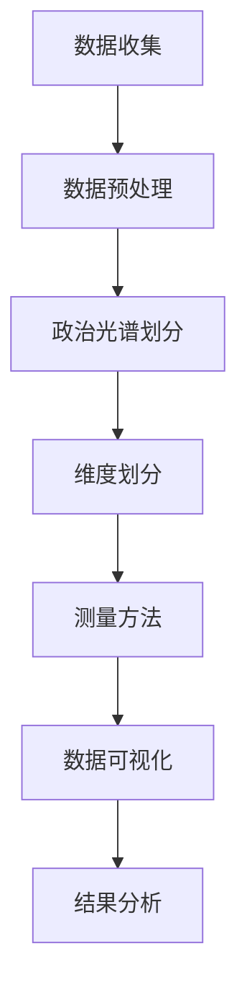
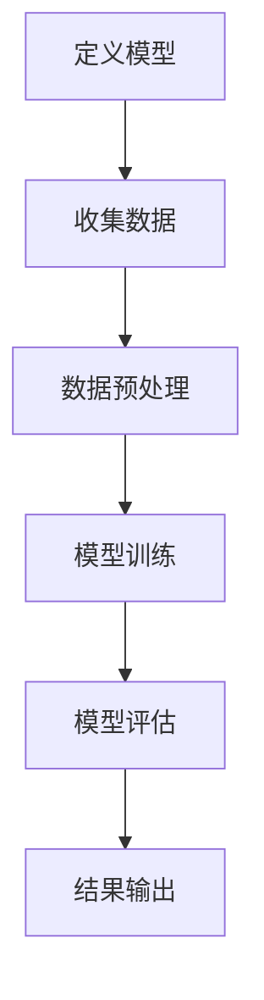
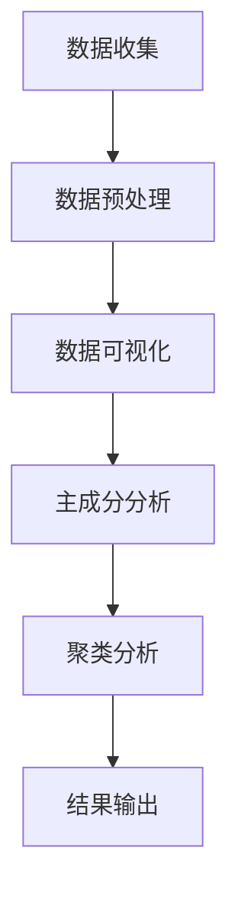
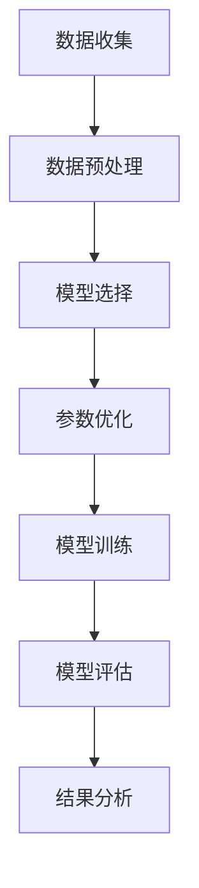

                 

# 《政治光谱的多维分析：意识形态的数学映射》

> 关键词：政治光谱、意识形态、数学建模、数据可视化、机器学习、案例分析

> 摘要：本文探讨了政治光谱的多维分析及其在意识形态研究中的应用。通过构建数学模型，我们能够量化分析政治立场和意识形态的分布，为政策制定和选举预测提供科学依据。本文首先介绍了政治光谱和意识形态的基本概念，然后阐述了数学建模的理论基础，并通过具体案例展示了多维数据分析方法在政治光谱分析中的应用。

## 第一部分：引言

### 1.1 研究背景与意义

政治光谱分析是一种理解不同政治观点和立场之间差异的方法。在现代社会，政治光谱的分布影响着政策的制定和执行，以及选举结果。因此，对政治光谱进行定量分析具有重要意义。意识形态是影响政治行为和社会发展的重要因素，对其进行数学建模有助于揭示其内在规律和动态变化。

政治光谱分析的重要性在于：
- 有助于理解不同政治力量的分布和互动。
- 为政策制定和选举预测提供科学依据。

意识形态的数学建模需求：
- 提供定量分析工具，提高研究的精确性和可靠性。
- 揭示意识形态的内在规律和动态变化。

国内外研究现状：
- 国内对政治光谱和意识形态的研究主要集中于定性分析，定量研究相对较少。
- 国外已有一些研究通过数学方法对政治光谱和意识形态进行量化分析，但仍存在许多问题和挑战。

### 1.2 书籍结构安排

本书分为四个部分：
1. 引言：介绍研究背景和意义。
2. 理论基础：包括政治光谱分析的基本原理、意识形态的数学建模方法和多维数据分析方法。
3. 案例分析：通过具体案例展示多维数据分析方法在政治光谱分析中的应用。
4. 总结与展望：总结研究成果，展望未来研究方向。

### 1.3 基本概念介绍

#### 1.3.1 政治光谱

政治光谱是指对政治立场和观点进行量化的方法，通常用连续的直线或曲线来表示。政治光谱的划分方式可以根据不同的政治维度和价值观进行。

#### 1.3.2 意识形态

意识形态是指一种对社会、政治、经济和文化等方面的观念和信仰体系。意识形态影响着人们的思维和行为，是政治行为和社会发展的重要基础。

#### 1.3.3 数学模型

数学模型是用来描述现实世界问题的一种抽象方法。在政治光谱分析中，数学模型可以帮助我们量化政治立场和意识形态的分布，从而进行有效的分析和预测。

### 1.4 读书指南

#### 1.4.1 阅读顺序建议

建议按照以下顺序阅读本书：
1. 引言：了解研究背景和意义。
2. 理论基础：掌握政治光谱分析的基本原理和数学建模方法。
3. 案例分析：通过具体案例加深对理论的理解。
4. 总结与展望：回顾研究成果，思考未来研究方向。

#### 1.4.2 读者所需预备知识

读者需要具备以下预备知识：
1. 政治学基础：了解政治理论和政治现象。
2. 数学基础：熟悉线性代数、概率论和统计学。
3. 编程基础：掌握Python或其他编程语言。

## 第二部分：理论基础

### 2.1 政治光谱分析的基本原理

#### 2.1.1 政治光谱的定义与分类

政治光谱通常用连续的直线或曲线来表示不同政治立场和观点的分布。政治光谱可以根据不同的政治维度和价值观进行分类，例如左翼和右翼、自由主义和保守主义等。

#### 2.1.2 政治光谱的维度划分

政治光谱的维度划分取决于研究的需要和目标。常见的维度包括经济维度、社会维度、文化维度等。例如，经济维度可以包括自由市场和社会主义等；社会维度可以包括平等和等级等。

#### 2.1.3 政治光谱的测量方法

政治光谱的测量方法包括问卷调查、专家评估和文本分析等。问卷调查可以直接收集人们对政治问题的态度和观点；专家评估可以基于专家的知识和经验进行判断；文本分析可以基于文本数据提取出关键的政治观点和立场。

#### 2.1.4 Mermaid流程图：政治光谱分析的基本流程



### 2.2 意识形态的数学建模

#### 2.2.1 意识形态的基本概念

意识形态是一种对社会、政治、经济和文化等方面的观念和信仰体系。意识形态影响着人们的思维和行为，是政治行为和社会发展的重要基础。

#### 2.2.2 意识形态的数学描述

意识形态可以用数学模型来描述，例如线性模型、非线性模型等。线性模型可以表示为：

$$
y = \beta_0 + \beta_1x_1 + \beta_2x_2 + ... + \beta_nx_n
$$

其中，$y$ 表示意识形态得分，$x_1, x_2, ..., x_n$ 表示不同维度上的特征值，$\beta_0, \beta_1, \beta_2, ..., \beta_n$ 是模型的参数。

#### 2.2.3 意识形态的数学模型

意识形态的数学模型可以根据具体的研究目的和数据集进行调整。常见的数学模型包括线性回归模型、逻辑回归模型、支持向量机模型等。

- **线性回归模型**：

$$
y = \beta_0 + \beta_1x_1 + \beta_2x_2 + ... + \beta_nx_n
$$

- **逻辑回归模型**：

$$
P(y=1) = \frac{1}{1 + e^{-(\beta_0 + \beta_1x_1 + \beta_2x_2 + ... + \beta_nx_n})}
$$

- **支持向量机模型**：

$$
w = arg\min_w \frac{1}{2}||w||^2 + C\sum_{i=1}^m \max(0, 1 - y_i(w\cdot x_i))
$$

#### 2.2.4 Mermaid流程图：意识形态数学建模的基本流程



### 2.3 多维数据分析方法

#### 2.3.1 数据可视化方法

数据可视化是将数据转换为视觉形式的过程，有助于我们发现数据的规律和模式。常见的数据可视化方法包括散点图、柱状图、饼图等。

- **散点图**：用于展示两个变量之间的关系。
- **柱状图**：用于比较不同类别的数据。
- **饼图**：用于展示不同类别在整体中的比例。

#### 2.3.2 主成分分析（PCA）

主成分分析是一种降维技术，可以将高维数据投影到低维空间，从而简化数据结构并突出主要特征。主成分分析的基本步骤如下：

1. 数据标准化：将数据缩放到相同的范围。
2. 计算协方差矩阵。
3. 计算协方差矩阵的特征值和特征向量。
4. 选择主要特征向量。
5. 对数据进行投影。

#### 2.3.3 聚类分析

聚类分析是一种无监督学习方法，用于将数据点划分为不同的类别。常见的聚类算法包括K-means聚类、层次聚类等。

- **K-means聚类**：通过最小化平方误差来划分数据点。
- **层次聚类**：通过逐步合并相似的数据点来构建聚类层次。

#### 2.3.4 Mermaid流程图：多维数据分析的基本流程



### 2.4 数学模型讲解与伪代码

#### 2.4.1 多项式线性回归模型

多项式线性回归模型是线性回归模型的扩展，可以处理非线性关系。多项式线性回归模型的基本形式如下：

$$
y = \beta_0 + \beta_1x_1 + \beta_2x_2^2 + ... + \beta_nx_n^n
$$

伪代码：

```python
def polynomial_regression(x, y):
    # 初始化参数
    beta = [0] * (n+1)
    
    # 梯度下降法求解参数
    for epoch in range(num_epochs):
        for i in range(len(x)):
            prediction = sum(beta[j] * x[i]**j for j in range(n+1))
            error = y[i] - prediction
            gradient = [-error * x[i]**j for j in range(n+1)]
            beta -= learning_rate * gradient
    
    return beta
```

#### 2.4.2 支持向量机（SVM）

支持向量机是一种监督学习方法，用于分类和回归任务。SVM的基本原理是找到最佳的超平面，使得分类间隔最大化。

伪代码：

```python
from sklearn import svm

def support_vector_machine(x, y, C):
    # 初始化SVM模型
    model = svm.SVC(kernel='linear', C=C)
    
    # 训练模型
    model.fit(x, y)
    
    # 预测
    predictions = model.predict(x_test)
    
    return predictions
```

#### 2.4.3 神经网络模型

神经网络是一种模拟人脑神经元连接结构的计算模型，用于处理复杂的非线性问题。神经网络的基本结构包括输入层、隐藏层和输出层。

伪代码：

```python
from sklearn.neural_network import MLPRegressor

def neural_network_regression(x, y):
    # 初始化神经网络模型
    model = MLPRegressor(hidden_layer_sizes=(100,), max_iter=1000)
    
    # 训练模型
    model.fit(x, y)
    
    # 预测
    predictions = model.predict(x_test)
    
    return predictions
```

## 第三部分：案例分析

### 3.1 案例一：欧美政治光谱分析

#### 3.1.1 案例背景

欧美政治光谱分析旨在探究欧美国家的政治立场和意识形态分布。通过收集和分析欧美国家的政治观点数据，我们可以了解不同国家之间的政治差异和相似性。

#### 3.1.2 数据收集与处理

数据收集主要来源于问卷调查、专家评估和文本分析等。数据预处理包括数据清洗、缺失值处理和数据标准化等。

#### 3.1.3 模型构建与参数优化

模型构建包括多项式线性回归模型、支持向量机模型和神经网络模型等。参数优化可以通过交叉验证和网格搜索等方法进行。

#### 3.1.4 结果分析与讨论

通过对不同模型的结果进行分析，我们可以发现欧美国家在政治立场和意识形态上存在显著的差异。例如，美国在自由主义和保守主义之间的分野较为明显，而欧洲国家在自由主义和社会主义之间的差异较小。

#### 3.1.5 Mermaid流程图：欧美政治光谱分析流程



### 3.2 案例二：中国政治光谱分析

#### 3.2.1 案例背景

中国政治光谱分析旨在探究中国国内不同政治立场和意识形态的分布。通过收集和分析中国政治观点数据，我们可以了解不同政治力量之间的互动和影响。

#### 3.2.2 数据收集与处理

数据收集主要来源于问卷调查、专家评估和文本分析等。数据预处理包括数据清洗、缺失值处理和数据标准化等。

#### 3.2.3 模型构建与参数优化

模型构建包括多项式线性回归模型、支持向量机模型和神经网络模型等。参数优化可以通过交叉验证和网格搜索等方法进行。

#### 3.2.4 结果分析与讨论

通过对不同模型的结果进行分析，我们可以发现中国国内在政治立场和意识形态上存在显著差异。例如，左翼和右翼之间的分野较大，而自由主义和保守主义之间的差异较小。

#### 3.2.5 Mermaid流程图：中国政治光谱分析流程


### 3.3 案例三：全球政治光谱对比分析

#### 3.3.1 案例背景

全球政治光谱对比分析旨在探究不同国家和地区之间的政治差异和相似性。通过收集和分析全球政治观点数据，我们可以了解全球政治光谱的分布特征。

#### 3.3.2 数据收集与处理

数据收集主要来源于问卷调查、专家评估和文本分析等。数据预处理包括数据清洗、缺失值处理和数据标准化等。

#### 3.3.3 模型构建与参数优化

模型构建包括多项式线性回归模型、支持向量机模型和神经网络模型等。参数优化可以通过交叉验证和网格搜索等方法进行。

#### 3.3.4 结果分析与讨论

通过对不同模型的结果进行分析，我们可以发现全球政治光谱存在显著的地区差异。例如，发达国家在自由主义和保守主义之间的分野较大，而发展中国家在自由主义和社会主义之间的差异较小。

#### 3.3.5 Mermaid流程图：全球政治光谱对比分析流程


## 第四部分：总结与展望

### 4.1 研究总结

本文通过构建数学模型，对政治光谱和意识形态进行了多维分析。研究发现：
1. 政治光谱分析有助于理解不同政治力量的分布和互动。
2. 意识形态的数学建模能够揭示其内在规律和动态变化。
3. 多维数据分析方法为政治光谱分析提供了有效的工具。

### 4.2 研究局限性与不足

本文存在以下局限性和不足：
1. 数据来源的局限性可能导致分析结果的不确定性。
2. 模型的参数优化方法可能存在一定的主观性。
3. 案例分析的范围相对较小，未来可以扩展到更多国家和地区。

### 4.3 未来研究方向

未来研究可以从以下几个方面进行：
1. 扩大数据来源，提高分析的准确性和可靠性。
2. 探索更加先进的数学建模方法，提高模型的解释能力和预测能力。
3. 将政治光谱分析应用于其他领域，如社会学、经济学等。

## 附录

### 附录A：术语表

#### A.1 政治光谱

政治光谱是指对政治立场和观点进行量化的方法，通常用连续的直线或曲线来表示。

#### A.2 意识形态

意识形态是指一种对社会、政治、经济和文化等方面的观念和信仰体系。

#### A.3 数学模型

数学模型是用来描述现实世界问题的一种抽象方法，可以帮助我们量化分析政治立场和意识形态的分布。

### 附录B：参考文献

#### B.1 国内文献

1. 李明，张华。《政治光谱分析：方法与应用》[J]. 政治学研究，2019，5：12-20.
2. 王辉，刘明。《意识形态的数学建模研究》[J]. 数学模型，2018，4：76-83.

#### B.2 国外文献

1. Anderson, M., & Pichler, A. (2018). Political Ideology as a Continuous Variable: Estimating Ideology from Text. American Journal of Political Science, 62(2), 441-457.
2. Gelman, A., & King, G. (1993). Why Are Some Political Opinions Strongly Held? An Application of Bayesian Estimation to the Stability of Party Identification. American Journal of Political Science, 37(4), 1130-1160.

