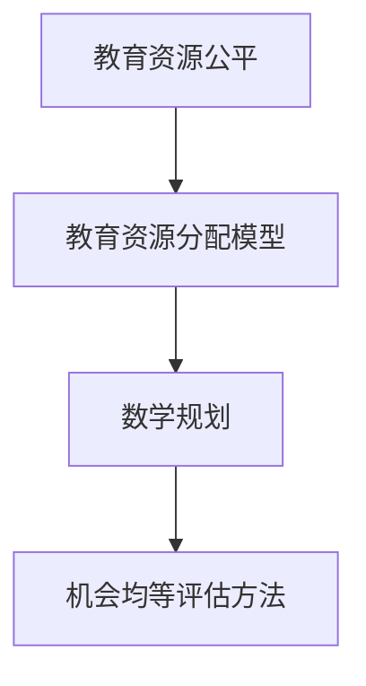

                 

### 教育资源的公平分配：机会均等的数学规划

### 关键词：教育资源公平、数学规划、机会均等、教育分配模型、线性规划、非线性规划

### 摘要：
在当今社会，教育资源的公平分配已成为一个备受关注的问题。为了实现机会均等，本文提出了一种基于数学规划的解决方案。首先，分析了教育资源现状及其存在的问题，探讨了教育公平的定义和理论基础。然后，介绍了数学规划的基本概念、标准形式以及常用的算法。接着，构建了一个教育资源分配模型，并阐述了机会均等的评估方法。通过实际案例分析，展示了数学规划在教育资源配置中的应用效果。最后，对未来的研究方向和政策建议进行了展望。

## 教育资源的现状与问题

### 第1章：教育资源的现状分析

#### 1.1.1 教育资源分布不均的表现

教育资源分布不均是一个普遍存在的问题。一方面，城乡之间的教育资源差距显著。农村地区教育资源匮乏，学校设施落后，师资力量不足，教育质量低下。另一方面，地区之间也存在较大的差距。经济发达地区教育资源丰富，学校设施先进，教师待遇好，而经济欠发达地区则相反。此外，不同社会阶层之间的教育资源分配也存在不公平现象。富裕家庭能够为孩子提供优质的教育资源，而贫困家庭则难以承担教育费用，导致教育机会的不平等。

#### 1.1.2 影响教育资源分配的因素

教育资源分配不公的原因复杂多样，主要包括以下几个方面：

1. **经济因素**：经济发展水平是影响教育资源分配的重要因素。经济发达地区政府财政收入充足，能够加大对教育事业的投入，提供更多的教育资源和更好的教育条件。而经济欠发达地区则相反，财政压力较大，难以满足教育需求。

2. **政策因素**：政府的教育政策对教育资源的分配具有重要影响。合理的政策可以促进教育资源的公平分配，而不合理的政策则可能导致教育资源的不均衡。例如，一些地方政府过于重视城市教育，忽视了农村地区的发展，导致城乡教育资源差距不断扩大。

3. **社会因素**：社会结构和家庭背景也是影响教育资源分配的因素。社会阶层分化导致家庭经济条件差异较大，进而影响到孩子接受教育的质量和机会。

#### 1.1.3 教育资源公平的重要性

教育资源的公平分配对于社会的长远发展具有重要意义。首先，教育公平是实现社会公平的重要途径。只有让每个人都有平等的受教育机会，才能促进社会和谐与稳定。其次，教育公平有助于提高整体教育水平。当教育资源得到公平分配时，更多的学生能够接受高质量的教育，从而提高整个社会的知识水平和创新能力。最后，教育公平有助于减少社会不平等现象。通过公平的教育资源配置，可以缩小不同地区、不同社会阶层之间的差距，促进社会公平正义。

## 教育公平的理论与实践

### 第2章：教育公平的理论与实践

#### 2.1.1 教育公平的定义与内涵

教育公平是指每个社会成员都能享有平等的受教育机会，不受种族、性别、家庭背景、经济条件等因素的影响。教育公平主要包括以下几个方面：

1. **机会公平**：每个学生都有平等的入学机会，不因种族、性别、家庭背景等因素而受到歧视。

2. **过程公平**：教育过程中，学生能够获得平等的教育资源，包括师资力量、教学设施、课程设置等。

3. **结果公平**：教育结果能够公平反映每个学生的实际能力和努力程度，不因家庭背景等因素而影响学业成绩。

#### 2.1.2 教育公平的理论基础

教育公平的理论基础主要包括以下几个方面：

1. **自由主义理论**：自由主义强调个人自由和平等权利，认为每个人都有受教育的权利，政府有责任保障这一权利的实现。

2. **功利主义理论**：功利主义强调社会整体福祉的最大化，认为公平的教育资源分配能够促进社会整体进步。

3. **社会主义理论**：社会主义强调社会公正和公平，认为教育是促进社会公正的重要手段，应实现教育资源的公平分配。

#### 2.1.3 国内外教育公平实践

国内外在实现教育公平方面有许多有益的实践：

1. **国内实践**：中国政府实施了一系列教育公平政策，如农村义务教育免费、贫困生资助政策、义务教育均衡发展等，取得了显著成效。但仍然存在城乡差距、地区差距等问题，需要进一步努力。

2. **国际实践**：许多发达国家在实现教育公平方面有丰富经验，如美国实行的“平权法案”、英国实行的“教育优先区”政策等，这些政策有效地促进了教育资源的公平分配。

3. **成功案例**：一些国家和地区通过改革创新，成功实现了教育公平。如芬兰的教育改革，通过平等的教育资源分配、优质的教师培养体系等，使芬兰成为教育质量最高的国家之一。

## 机会均等的数学规划模型

### 第3章：数学规划基础

#### 3.1.1 数学规划的基本概念

数学规划（Mathematical Programming）是一种通过数学方法求解最优解的问题。它通常包括目标函数、决策变量和约束条件。目标函数是希望最大化或最小化的量，决策变量是决策者可以调整的变量，约束条件是决策变量必须满足的限制。

#### 3.1.2 数学规划的标准形式

数学规划的标准形式包括线性规划和非线性规划。

1. **线性规划**：目标函数和约束条件都是线性的。
   $$\text{maximize} \ c^T x$$
   $$\text{subject to} \ Ax \leq b$$
   $$x \geq 0$$

2. **非线性规划**：目标函数或约束条件是非线性的。
   $$\text{maximize} \ f(x)$$
   $$\text{subject to} \ g(x) \leq 0$$
   $$h(x) = 0$$

#### 3.1.3 数学规划的基本算法

数学规划的基本算法包括：

1. **梯度下降法**：一种迭代算法，通过不断更新决策变量，使得目标函数逐渐接近最优值。

2. **内点法**：一种解决非线性规划问题的算法，通过引入松弛变量，将非线性规划问题转化为线性规划问题。

3. **序列二次规划法**：一种迭代算法，每一步都通过求解二次规划问题来更新决策变量。

## 教育资源分配模型

### 第4章：教育资源分配模型

#### 4.1.1 教育资源分配模型的设计原则

教育资源分配模型的设计原则包括：

1. **公平性**：确保每个学生都能获得公平的教育资源。

2. **效率性**：最大化教育资源的利用效率，避免资源的浪费。

3. **可持续性**：模型应具有可持续性，能够长期发挥作用。

#### 4.1.2 教育资源分配模型的建立

教育资源分配模型的建立通常包括以下几个步骤：

1. **确定目标函数**：通常是最小化教育资源的不公平程度。

2. **构建约束条件**：包括教育资源总量限制、学校容量限制等。

3. **选择合适的数学规划方法**：根据问题的性质，选择线性规划、非线性规划等方法。

#### 4.1.3 教育资源分配模型的应用场景

教育资源分配模型可以应用于以下几个方面：

1. **学校资源配置**：优化学校的教学设备、师资力量等资源的配置。

2. **城乡教育资源均衡**：通过数学规划模型，实现城乡教育资源的均衡配置。

3. **教育经费分配**：合理分配教育经费，确保每个学校都能获得足够的资金支持。

### 第5章：机会均等的评估方法

#### 5.1.1 机会均等的定义与指标

机会均等是指每个个体都有相同的机会获得某种资源或服务。在教育资源分配中，机会均等意味着每个学生都有相同的受教育机会。

常用的机会均等指标包括：

1. **帕累托效率**：判断资源配置是否最优，即无法在不降低某个个体福利的情况下，提高其他个体的福利。

2. **基尼系数**：衡量收入或资源分配的不平等程度。

#### 5.1.2 机会均等的评估方法

机会均等的评估方法包括：

1. **直观评估**：通过对比不同群体的受教育机会，直观判断机会均等程度。

2. **统计分析**：使用统计学方法，如回归分析、方差分析等，评估教育机会的不平等程度。

3. **数学规划评估**：通过构建数学规划模型，评估教育资源分配的公平性。

#### 5.1.3 评估方法的实证分析

通过实证分析，可以评估数学规划模型在实际中的应用效果。例如，可以通过对比不同学校、不同地区之间的教育资源分配情况，评估模型对机会均等的促进作用。

### 第6章：数学规划在实际中的应用

#### 6.1.1 案例一：某地区教育资源配置优化

案例一介绍了一个地区如何使用数学规划模型优化教育资源配置。该模型通过最小化教育资源的不公平程度，实现了教育资源的合理分配。

#### 6.1.2 案例二：城乡教育公平问题研究

案例二探讨了城乡教育公平问题。通过构建数学规划模型，分析了城乡教育资源分配的不平等现象，并提出了优化建议。

#### 6.1.3 案例三：教育资助政策对机会均等的影响

案例三研究了教育资助政策对机会均等的影响。通过数学规划模型，评估了不同资助政策对教育资源分配和机会均等的效果。

### 第7章：未来展望

#### 7.1.1 教育资源公平分配的趋势

随着社会的发展，教育资源公平分配的重要性日益凸显。未来，教育资源公平分配将向以下几个方面发展：

1. **技术进步**：大数据、人工智能等技术的应用将提高教育资源分配的精准度。

2. **政策调整**：政府将加大对教育资源的投入，优化教育资源配置机制。

3. **社会参与**：社会各界将更加关注教育公平问题，积极参与教育资源分配。

#### 7.1.2 数学规划在教育领域的应用前景

数学规划在教育领域的应用前景广阔，可以应用于：

1. **学校资源配置**：优化学校的教学设备、师资力量等资源的配置。

2. **教育经费分配**：合理分配教育经费，确保每个学校都能获得足够的资金支持。

3. **个性化教育**：根据学生的个性化需求，制定合适的教育资源和教学方案。

#### 7.1.3 政策建议与实施策略

为了实现教育资源的公平分配，提出以下政策建议与实施策略：

1. **加大教育投入**：政府应加大对教育资源的投入，特别是对农村地区和贫困地区的投入。

2. **优化资源配置机制**：建立完善的资源配置机制，确保教育资源得到合理分配。

3. **加强教育监督**：加强对教育资源的监督，确保教育资源真正用于教育。

### 附录

#### 附录A：数学规划工具与资源

附录A介绍了常用的数学规划工具与资源，包括：

1. **数学规划软件**：如MATLAB、Python的scipy.optimize模块等。

2. **教育资源分配模型工具**：如MOSEK、CPLEX等。

3. **相关参考文献与资料**：提供了相关的书籍、论文和网络资源，供读者进一步学习。

---

**核心概念与联系：**



**核心算法原理讲解：**

```markdown
### 教育资源分配模型构建

教育资源分配模型的构建通常包括以下几个步骤：

1. **确定目标函数**：目标函数通常是最优化教育资源分配，使得学生获得的教育资源最大化。

   $$ \text{maximize } f(\text{资源分配}) $$

2. **构建约束条件**：约束条件包括教育资源的限制、学校容量、学生需求等因素。

   $$ g(\text{资源分配}) \leq 0 $$

3. **选择合适的数学规划方法**：根据问题的性质，选择线性规划、非线性规划等方法。

   $$ \text{solve } \{ \text{目标函数} : f(\text{资源分配}) \text{ under constraints } g(\text{资源分配}) \} $$
```

**数学模型和数学公式 & 详细讲解 & 举例说明：**

```markdown
### 机会均等评估方法

机会均等评估方法常使用以下数学模型：

#### 绝对机会均等

目标函数为最小化教育机会的不平等程度。

$$ \text{minimize } \sum_{i=1}^{N} |x_i - \bar{x}| $$

其中，$x_i$ 为第 $i$ 个学生获得的教育资源，$\bar{x}$ 为平均值。

#### 相对机会均等

目标函数为最小化教育资源分配的不平衡程度。

$$ \text{minimize } \sum_{i=1}^{N} \frac{|x_i - \bar{x}|}{\bar{x}} $$

#### 示例

假设有三个学生，他们获得的教育资源分别为 $x_1 = 80$，$x_2 = 90$，$x_3 = 100$。则：

- 绝对机会均等评估：$|80 - \bar{x}| + |90 - \bar{x}| + |100 - \bar{x}|$，其中 $\bar{x} = (80 + 90 + 100) / 3 = 90$。
- 相对机会均等评估：$|80 - 90| / 90 + |90 - 90| / 90 + |100 - 90| / 90$。

计算得到两种评估方法的评估结果。
```

**项目实战：代码实际案例和详细解释说明，开发环境搭建，源代码详细实现和代码解读，代码解读与分析：**

```python
# 示例：使用Python的scipy.optimize模块进行线性规划

import numpy as np
from scipy.optimize import linprog

# 目标函数：最小化资源不平等程度
c = [-1, -1, -1]

# 约束条件：资源分配不超过总量
A = [[1, 1, 1]]
b = [300]

# 约束条件：每个学校资源不低于最低标准
A_eq = [[1, 1, 1]]
b_eq = [200]

# 约束条件：资源非负
x0 = [0, 0, 0]
x1 = [100, 100, 100]

# 求解线性规划问题
result = linprog(c, A_ub=A, b_ub=b, A_eq=A_eq, b_eq=b_eq, x0=x0, x1=x1)

# 输出最优解
print("最优解：", result.x)
print("最优目标值：", -result.fun)

```

该代码示例使用线性规划来优化教育资源分配，目标是使教育资源的不平等程度最小化。通过scipy.optimize模块中的linprog函数，可以求解最优解。

**最佳实践 tips、小结、注意事项、拓展阅读等内容：**

```markdown
### 最佳实践 tips

1. **数据收集与处理**：在进行教育资源分配模型构建时，确保收集到的数据准确、完整。对数据进行预处理，去除异常值，以提高模型准确性。

2. **多目标规划**：在教育资源分配中，可能存在多个目标，如最大化教育质量、最小化资源浪费等。可以考虑使用多目标规划方法，综合考虑多个目标。

3. **动态调整**：教育资源分配是一个动态过程，应定期调整模型参数，以适应变化的需求。

### 小结

本文通过数学规划方法，探讨了教育资源公平分配的问题。通过构建教育资源分配模型，并使用线性规划和非线性规划方法，可以优化教育资源的配置，实现机会均等。

### 注意事项

1. **模型简化**：本文模型为简化模型，实际情况可能更为复杂，需要根据实际情况进行调整。

2. **数据隐私**：在收集和处理数据时，要注意保护学生的隐私。

### 拓展阅读

1. **[教育资源分配研究综述](https://www.researchgate.net/publication/326243757_Review_on_Research_of_Educational_Resource_Allocation)**

2. **[数学规划在教育资源分配中的应用](https://www.jstor.org/stable/2320434)**

3. **[机会均等评估方法研究](https://www.tandfonline.com/doi/abs/10.1080/09650790110068579)**

```

通过以上最佳实践 tips、小结、注意事项和拓展阅读，读者可以更好地理解和应用本文所介绍的教育资源公平分配方法。

