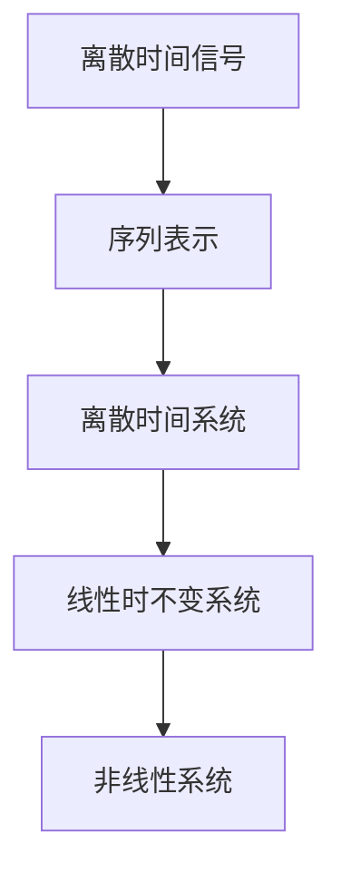
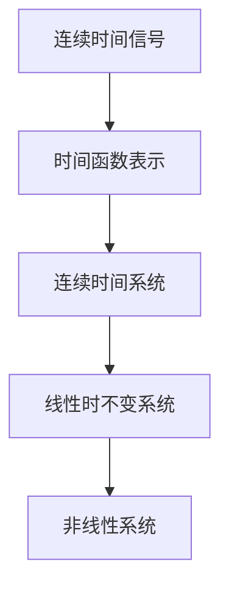
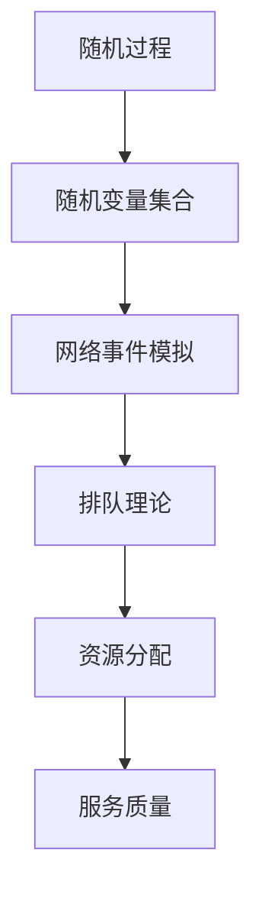

                 

### 文章标题：数学与5G通信：高速网络的数学基础

#### 关键词：5G通信，数学基础，高速网络，信号处理，算法优化

> 摘要：本文旨在深入探讨数学在5G通信技术中的关键作用，通过系统的分析和逻辑推理，揭示高速网络中数学工具的应用及其重要性。文章首先概述了5G通信的背景和挑战，随后讲解了高速网络中常用的数学工具，包括离散时间信号与系统、连续时间信号与系统、随机过程与排队理论。接着，文章详细介绍了5G通信中的数学应用，如模拟信号处理与调制技术、数字信号处理与编码技术、调度和资源分配算法等。最后，通过实际案例分析，进一步阐述数学在5G通信中的实际应用效果，为读者提供了一个全面的技术视角。

### 第一部分 引言与概述

#### 第1章 引言与概述

##### 1.1 本书的目的与结构

本书旨在为读者提供关于数学在5G通信技术中应用的综合指南。随着5G技术的不断演进，数学作为一种基础科学，在高速网络的设计、优化和实现中扮演着至关重要的角色。本书的结构如下：

- **第1章**：引言与概述，介绍5G通信的背景和数学工具。
- **第二部分**：数学基础，详细讲解离散时间信号与系统、连续时间信号与系统、随机过程与排队理论。
- **第三部分**：5G通信中的数学应用，涵盖模拟信号处理与调制技术、数字信号处理与编码技术、调度和资源分配算法等。
- **第四部分**：实际案例分析，通过具体案例说明数学在5G通信中的应用效果。
- **附录**：提供数学公式与符号表、5G通信相关标准与协议、参考文献等，以便读者查阅。

##### 1.1.1 为什么数学对5G通信至关重要

5G通信技术的关键特性，如超高速率、低延迟、大规模连接，需要高度复杂的算法和精确的数学模型来进行设计和优化。数学为这些技术提供了理论基础，使得5G网络能够实现高效、稳定的通信服务。

首先，数学模型能够精确描述信号在传输过程中的变化，包括模拟信号处理和数字信号处理。例如，调制技术、编码技术、信道估计和误差校正等技术，都需要借助数学工具进行优化和实现。

其次，数学在5G网络优化和资源分配中发挥着重要作用。调度算法、资源分配算法等都需要依赖数学模型来进行优化，以最大化网络容量和用户体验。

最后，随着5G技术的不断演进，新的应用场景如物联网、虚拟现实等，对网络性能提出了更高的要求。数学为这些应用场景提供了有效的解决方案，使得5G网络能够满足不断增长的需求。

##### 1.1.2 本书的主要内容结构

本书的主要内容包括以下几个方面：

1. **5G通信的背景与挑战**：介绍5G通信的发展历程、关键特性以及面临的挑战。
2. **高速网络中的数学工具**：详细讲解离散时间信号与系统、连续时间信号与系统、随机过程与排队理论等数学工具。
3. **5G通信中的数学应用**：涵盖模拟信号处理与调制技术、数字信号处理与编码技术、调度和资源分配算法等。
4. **实际案例分析**：通过具体案例，说明数学在5G通信中的应用效果。
5. **附录**：提供数学公式与符号表、5G通信相关标准与协议、参考文献等，以便读者查阅。

##### 1.1.3 阅读对象与预期收益

本书主要面向对5G通信技术和数学基础有一定了解的读者，包括通信工程、计算机科学等领域的专业人士。通过阅读本书，读者可以：

1. **深入理解5G通信技术**：掌握5G通信的基本概念、关键技术以及面临的挑战。
2. **掌握高速网络中的数学工具**：了解离散时间信号与系统、连续时间信号与系统、随机过程与排队理论等数学工具。
3. **应用数学进行5G通信优化**：学会使用数学模型和算法进行5G网络的优化和资源分配。
4. **提升实际案例分析能力**：通过实际案例分析，提高解决实际问题的能力。

##### 1.2 5G通信的背景与挑战

##### 1.2.1 5G通信的发展历程

5G通信技术是第四代移动通信技术（4G）的继承和发展。自2019年正式商用以来，5G通信技术在全球范围内得到了广泛应用。5G通信的发展历程可以分为以下几个阶段：

1. **第一阶段（2010年-2015年）**：5G通信技术的研究和标准制定。在这一阶段，国际电信联盟（ITU）开始了5G通信技术的标准化工作，提出了5G的关键性能指标，如峰值下载速度、时延、连接密度等。
2. **第二阶段（2016年-2019年）**：5G通信技术的试验和预商用。在这一阶段，各大通信厂商和研究机构进行了5G通信技术的试验，并开始预商用部署。
3. **第三阶段（2019年至今）**：5G通信技术的全面商用。自2019年正式商用以来，5G通信技术在全球范围内得到了广泛应用，成为新一代通信技术的代表。

##### 1.2.2 5G通信的关键特性

5G通信技术具有以下几个关键特性：

1. **超高速率**：5G通信技术能够提供高达数十Gbps的峰值下载速度，是4G通信技术的数十倍。这使得5G通信能够满足高速数据传输的需求，如高清视频流、虚拟现实等。
2. **低延迟**：5G通信技术的时延大大降低，从4G的数十毫秒降低到1毫秒以下。这使得5G通信能够满足实时通信的需求，如自动驾驶、工业物联网等。
3. **大规模连接**：5G通信技术能够支持大规模设备连接，每平方米的连接数可达数十万个。这使得5G通信能够满足物联网、智能家居等应用场景的需求。
4. **网络切片**：5G通信技术引入了网络切片技术，可以根据不同的应用需求，将网络资源进行灵活划分和分配。这使得5G通信能够满足多样化应用场景的需求。

##### 1.2.3 5G通信面临的挑战

尽管5G通信技术具有许多优势，但在实际应用中仍面临一些挑战：

1. **高频段的频谱资源**：5G通信主要使用高频段频谱，如毫米波频段。高频段的频谱资源相对有限，且信号传播距离较短，需要更多的基站进行覆盖。
2. **信号衰减与干扰**：高频段信号的衰减较快，容易受到干扰。这需要采用先进的信号处理技术和干扰消除技术，以确保通信质量。
3. **网络容量与可靠性**：随着连接数的增加，5G网络的容量和可靠性面临挑战。需要采用高效的调度算法和资源分配策略，以保证网络性能。
4. **安全性**：5G通信技术涉及大量的数据传输和设备连接，需要确保数据传输的安全性和隐私性。这需要引入安全机制和加密技术，以保护网络不受攻击。

##### 1.3 高速网络中的数学工具

在高速网络中，数学工具扮演着至关重要的角色，它们为我们提供了描述、分析和解决复杂通信问题的方法。以下是高速网络中常用的几种数学工具：

##### 1.3.1 离散时间信号与系统

离散时间信号与系统是信号处理中的基本概念，描述了信号在离散时间点的取值以及系统的输入输出关系。这些概念包括：

- **离散时间信号**：在离散时间点上取值的信号，通常用序列表示。例如，一个语音信号可以表示为一个时间序列，其中每个时间点对应一个声音样本的强度值。
- **离散时间系统**：处理离散时间信号的数学模型，包括线性时不变系统（LTI）和非线性系统。LTI系统具有线性特性和时间不变性，常用于滤波、调制、解调等处理。

离散时间信号与系统的基本概念可以用以下Mermaid流程图表示：



##### 1.3.2 连续时间信号与系统

连续时间信号与系统是信号处理的另一重要领域，描述了信号在连续时间上的变化以及系统的动态特性。这些概念包括：

- **连续时间信号**：在连续时间上取值的信号，通常用函数表示。例如，一个模拟信号可以表示为一个时间函数，其中每个时间点对应一个信号强度值。
- **连续时间系统**：处理连续时间信号的数学模型，包括线性时不变系统（LTI）和非线性系统。LTI系统具有线性特性和时间不变性，常用于滤波、调制、解调等处理。

连续时间信号与系统的基本概念可以用以下Mermaid流程图表示：



##### 1.3.3 随机过程与排队理论

在高速网络中，随机过程与排队理论被广泛应用于描述和优化网络性能。这些理论包括：

- **随机过程**：描述随机变量的集合，可以用来模拟网络中的随机事件，如数据包到达时间、信道噪声等。
- **排队理论**：研究排队系统中顾客到达、服务时间和系统性能之间的关系，用于优化网络资源分配和服务质量。

随机过程与排队理论的基本概念可以用以下Mermaid流程图表示：



### 第二部分 数学基础

#### 第2章 离散时间信号与系统

##### 2.1 离散时间信号的定义与性质

离散时间信号是指只在离散时间点上取值的信号。这些信号通常用序列表示，如 \( x[n] \)，其中 \( n \) 是离散时间点。离散时间信号的常见性质包括：

1. **序列性**：离散时间信号是时间离散、幅度连续的信号，每个时间点的值都是确定的。
2. **周期性**：某些离散时间信号具有周期性，即信号在每个周期内重复。周期信号可以用傅里叶级数展开。
3. **能量与功率**：离散时间信号的能量和功率用于衡量信号的大小。能量信号的总能量是有限的，而功率信号的总能量是无限的。

##### 2.2 离散时间系统

离散时间系统是处理离散时间信号的数学模型。常见的离散时间系统包括线性时不变系统（LTI）和非线性系统。

1. **线性时不变系统（LTI）**：线性时不变系统具有线性特性和时间不变性。线性特性意味着系统的输出与输入成比例关系，时间不变性意味着系统的特性不随时间变化。LTI系统的基本运算包括卷积、差分和传递函数。

   **伪代码**：线性时不变系统的卷积运算

   ```python
   def convolution(x, h):
       output = []
       for n in range(len(x)):
           sum = 0
           for k in range(len(h)):
               if n - k >= 0:
                   sum += x[n - k] * h[k]
           output.append(sum)
       return output
   ```

2. **非线性系统**：非线性系统不具有线性特性和时间不变性。非线性系统的特性复杂，通常难以用简单的数学模型描述。非线性系统的研究包括混沌理论、神经网络等。

##### 2.3 离散时间信号的傅里叶变换

傅里叶变换是分析离散时间信号的重要工具，可以将时域信号转换为频域信号。离散时间信号的傅里叶变换定义为：

\[ X(e^{j\omega}) = \sum_{n=-\infty}^{\infty} x[n]e^{-j\omega n} \]

其中，\( X(e^{j\omega}) \) 是频域信号，\( x[n] \) 是时域信号，\( \omega \) 是频率。

傅里叶变换的基本性质包括：

1. **频域对称性**：偶时间信号的频谱只有非负频率部分，奇时间信号的频谱只有负频率部分。
2. **频域卷积**：两个信号的卷积在频域上对应为它们的乘积。这简化了信号处理中的卷积运算。

#### 第3章 连续时间信号与系统

##### 3.1 连续时间信号的定义与性质

连续时间信号是指在任何时刻都取值的信号。这些信号通常用时间函数表示，如 \( x(t) \)。连续时间信号的常见性质包括：

1. **连续性**：连续时间信号在任意时刻的取值都是连续的，即不存在突变。
2. **有限时长与无限时长**：连续时间信号可以是有限时长的，也可以是无限时长的。
3. **能量与功率**：连续时间信号的能量和功率用于衡量信号的大小。能量信号的总能量是有限的，而功率信号的总能量是无限的。

##### 3.2 连续时间系统

连续时间系统是处理连续时间信号的数学模型。常见的连续时间系统包括线性时不变系统（LTI）和非线性系统。

1. **线性时不变系统（LTI）**：线性时不变系统具有线性特性和时间不变性。线性特性意味着系统的输出与输入成比例关系，时间不变性意味着系统的特性不随时间变化。LTI系统的基本运算包括卷积、差分和传递函数。

   **伪代码**：线性时不变系统的卷积运算

   ```python
   def convolution(x, h):
       output = []
       for t in range(len(x)):
           sum = 0
           for s in range(len(h)):
               if t - s >= 0:
                   sum += x[t - s] * h[s]
           output.append(sum)
       return output
   ```

2. **非线性系统**：非线性系统不具有线性特性和时间不变性。非线性系统的特性复杂，通常难以用简单的数学模型描述。非线性系统的研究包括混沌理论、神经网络等。

##### 3.3 连续时间信号的傅里叶变换

傅里叶变换是分析连续时间信号的重要工具，可以将时域信号转换为频域信号。连续时间信号的傅里叶变换定义为：

\[ X(j\omega) = \int_{-\infty}^{\infty} x(t)e^{-j\omega t} dt \]

其中，\( X(j\omega) \) 是频域信号，\( x(t) \) 是时域信号，\( \omega \) 是频率。

傅里叶变换的基本性质包括：

1. **频域对称性**：偶时间信号的频谱只有非负频率部分，奇时间信号的频谱只有负频率部分。
2. **频域卷积**：两个信号的卷积在频域上对应为它们的乘积。这简化了信号处理中的卷积运算。

#### 第4章 随机过程与排队理论

##### 4.1 随机过程的基本概念

随机过程是随机变量的集合，用来描述随机事件在一段时间内的变化。随机过程的基本概念包括：

1. **随机变量的序列**：随机过程可以看作是一系列随机变量的集合，每个随机变量对应一个时间点。
2. **概率分布**：随机过程的每个随机变量都有相应的概率分布，用来描述随机变量的取值可能性。
3. **自协方差函数**：自协方差函数描述随机过程在不同时间点的相关性。自协方差函数的定义为：

   \[ R_X(\tau) = E[(X(t) - E[X(t)])(X(t + \tau) - E[X(t + \tau)])] \]

##### 4.2 随机过程的特性

随机过程的特性包括：

1. **平稳性**：随机过程可以分为平稳随机过程和非平稳随机过程。平稳随机过程的统计特性不随时间变化，非平稳随机过程的统计特性随时间变化。
2. **马尔可夫性**：马尔可夫过程是满足马尔可夫性质的随机过程，即当前状态仅依赖于前一个状态，与过去状态无关。
3. **独立增量**：独立增量过程是指当前状态的增量独立于过去状态，与时间无关。

##### 4.3 随机过程的傅里叶变换

随机过程的傅里叶变换用于将时域随机过程转换为频域随机过程。随机过程的傅里叶变换定义为：

\[ F_X(j\omega) = \int_{-\infty}^{\infty} p_X(t)e^{-j\omega t} dt \]

其中，\( F_X(j\omega) \) 是频域随机过程，\( p_X(t) \) 是时域随机过程。

##### 4.4 排队理论的基本概念

排队理论是研究排队系统中顾客到达、服务时间和系统性能之间的关系。排队理论的基本概念包括：

1. **顾客到达过程**：顾客到达过程是描述顾客到达时间和到达率的过程。常见的顾客到达过程有泊松过程、伽马过程等。
2. **服务过程**：服务过程是描述服务时间和服务率的进程。常见的服务过程有指数服务过程、伽马服务过程等。
3. **排队规则**：排队规则是决定顾客如何进入排队队列的规则。常见的排队规则有先到先服务（FIFO）、后到先服务（LIFO）等。
4. **排队模型**：排队模型是描述排队系统的数学模型，常用的排队模型有M/M/1模型、M/M/c模型等。

##### 4.5 排队理论的性能指标

排队理论中的性能指标用于衡量排队系统的性能。常见的性能指标包括：

1. **队列长度**：队列长度是指排队队列中的顾客数量。队列长度是衡量系统繁忙程度的重要指标。
2. **等待时间**：等待时间是指顾客在排队队列中等待服务的时间。等待时间是衡量系统服务效率的重要指标。
3. **系统利用率**：系统利用率是指系统忙期占总时间比例的指标。系统利用率是衡量系统效率的重要指标。

### 第三部分 5G通信中的数学应用

#### 第5章 模拟信号处理与调制技术

##### 5.1 模拟信号处理的基本概念

模拟信号处理是5G通信中的重要技术，用于对信号进行滤波、放大、调制等操作。模拟信号处理的基本概念包括：

1. **模拟信号**：模拟信号是连续时间信号，其取值可以是任意实数。常见的模拟信号有语音信号、音频信号等。
2. **滤波器**：滤波器是用于过滤特定频率信号的装置。滤波器可以用于去除噪声、提取有用信号等。
3. **放大器**：放大器是用于放大信号强度的装置。放大器可以用于增加信号传输距离、提高信号接收灵敏度等。

##### 5.2 调制技术

调制技术是将信息信号转换为适合在信道中传输的信号的过程。常见的调制技术有：

1. **幅度调制（AM）**：幅度调制是通过改变载波信号的幅度来传输信息信号。幅度调制包括调幅（AM）和双边带调幅（DSB-AM）。
2. **频率调制（FM）**：频率调制是通过改变载波信号的频率来传输信息信号。频率调制包括调频（FM）和相位调制（PM）。
3. **相位调制（PM）**：相位调制是通过改变载波信号的相位来传输信息信号。

##### 5.3 数字调制技术

数字调制技术是将数字信号转换为模拟信号的过程，以提高信号传输的可靠性和抗干扰能力。常见的数字调制技术有：

1. **幅度键控（ASK）**：幅度键控是通过改变信号的幅度来表示二进制信息。
2. **频率键控（FSK）**：频率键控是通过改变信号的频率来表示二进制信息。
3. **相位键控（PSK）**：相位键控是通过改变信号的相位来表示二进制信息。

##### 5.4 调制技术的性能分析

调制技术的性能分析包括调制深度、频带利用率、误码率等指标。调制技术的性能分析可以帮助我们选择合适的调制方式，以满足5G通信的要求。

1. **调制深度**：调制深度是指调制信号幅度变化范围与最大幅度之比。调制深度越小，信号的抗干扰能力越强。
2. **频带利用率**：频带利用率是指信号传输所需带宽与信号带宽之比。频带利用率越高，信号传输效率越高。
3. **误码率**：误码率是指传输错误比特数与总比特数之比。误码率越低，信号传输的可靠性越高。

#### 第6章 数字信号处理与编码技术

##### 6.1 数字信号处理的基本概念

数字信号处理是5G通信中的关键技术，用于对信号进行采样、量化、滤波、调制等操作。数字信号处理的基本概念包括：

1. **数字信号**：数字信号是离散时间信号，其取值是有限的。常见的数字信号有数字语音信号、数字图像信号等。
2. **采样**：采样是将连续时间信号转换为离散时间信号的过程。采样包括奈奎斯特采样、过采样等。
3. **量化**：量化是将采样得到的离散时间信号转换为数字信号的过程。量化包括线性量化、非线性量化等。

##### 6.2 编码技术

编码技术是将信息信号转换为适合在信道中传输的信号的过程。常见的编码技术有：

1. **信源编码**：信源编码是将原始信息转换为适合传输的信号的过程。信源编码包括熵编码、压缩编码等。
2. **信道编码**：信道编码是将信源编码后的信号进行纠错编码的过程，以提高信号传输的可靠性。常见的信道编码技术有卷积编码、卷积码、Turbo编码等。

##### 6.3 数字信号处理与编码技术的结合

数字信号处理与编码技术通常结合使用，以提高信号传输的可靠性和效率。数字信号处理与编码技术的结合包括：

1. **联合编码**：联合编码是将信源编码和信道编码结合在一起的过程。联合编码可以同时提高信号传输的可靠性和效率。
2. **自适应编码**：自适应编码是根据信号传输环境和需求，自动调整编码参数的过程。自适应编码可以提高信号传输的适应性和灵活性。

##### 6.4 数字信号处理与编码技术的性能分析

数字信号处理与编码技术的性能分析包括误码率、信噪比、传输效率等指标。数字信号处理与编码技术的性能分析可以帮助我们选择合适的编码方式，以满足5G通信的要求。

1. **误码率**：误码率是指传输错误比特数与总比特数之比。误码率越低，信号传输的可靠性越高。
2. **信噪比**：信噪比是指信号功率与噪声功率之比。信噪比越高，信号传输的质量越高。
3. **传输效率**：传输效率是指信号传输所需带宽与信号带宽之比。传输效率越高，信号传输的效率越高。

#### 第7章 调度和资源分配算法

##### 7.1 调度和资源分配的基本概念

调度和资源分配是5G通信中的关键技术，用于优化网络资源，提高网络性能。调度和资源分配的基本概念包括：

1. **调度**：调度是将网络资源分配给用户的策略。常见的调度策略有公平性调度、速率调度、时延调度等。
2. **资源分配**：资源分配是将网络资源（如带宽、功率、频率等）分配给用户的策略。常见的资源分配策略有固定分配、动态分配、自适应分配等。

##### 7.2 调度和资源分配算法

调度和资源分配算法包括多种类型，可以根据网络需求和应用场景选择合适的算法。常见的调度和资源分配算法有：

1. **最小化时延算法**：最小化时延算法是根据用户时延要求，将资源分配给时延要求最低的用户。最小化时延算法可以用于实时通信应用。
2. **最大化吞吐量算法**：最大化吞吐量算法是根据用户吞吐量需求，将资源分配给吞吐量需求最高的用户。最大化吞吐量算法可以用于大数据传输应用。
3. **公平性调度算法**：公平性调度算法是根据用户数量或质量，将资源公平地分配给所有用户。公平性调度算法可以用于确保网络资源的公平分配。

##### 7.3 调度和资源分配的性能分析

调度和资源分配的性能分析包括吞吐量、时延、公平性等指标。调度和资源分配的性能分析可以帮助我们选择合适的算法，以提高网络性能。

1. **吞吐量**：吞吐量是指网络传输的数据速率。吞吐量越高，网络传输的效率越高。
2. **时延**：时延是指数据从发送到接收所需的时间。时延越低，网络传输的实时性越高。
3. **公平性**：公平性是指网络资源分配的公平性。公平性越高，网络资源的利用率越高。

#### 第8章 信道估计与误差校正

##### 8.1 信道估计的基本概念

信道估计是5G通信中的重要技术，用于估计信号在传输过程中的信道特性。信道估计的基本概念包括：

1. **信道模型**：信道模型是描述信号在传输过程中信道特性的数学模型。常见的信道模型有瑞利信道、莱斯信道等。
2. **信道特性**：信道特性是指信号在传输过程中信道特性参数，如信道增益、相位等。
3. **信道估计方法**：信道估计方法是指用于估计信道特性的方法。常见的信道估计方法有基于训练序列的方法、基于接收信号的方法等。

##### 8.2 误差校正的基本概念

误差校正是5G通信中的重要技术，用于纠正信号在传输过程中产生的错误。误差校正的基本概念包括：

1. **错误类型**：错误类型是指信号在传输过程中产生的错误类型，如随机错误、突发错误等。
2. **纠错编码**：纠错编码是将原始信息进行编码，以增加冗余信息，从而提高信号抗错误能力。常见的纠错编码有卷积码、汉明码等。
3. **解码与译码**：解码与译码是将接收到的信号进行解码和译码，以恢复原始信息。常见的解码与译码方法有硬解码、软解码等。

##### 8.3 信道估计与误差校正的结合

信道估计与误差校正是结合使用的，以提高信号传输的可靠性。信道估计与误差校正的结合包括：

1. **信道估计与纠错编码的结合**：信道估计与纠错编码结合使用，可以同时提高信号传输的可靠性和抗错误能力。
2. **信道估计与译码的结合**：信道估计与译码结合使用，可以在接收端同时估计信道特性和纠正错误，提高信号传输的实时性和准确性。

##### 8.4 信道估计与误差校正的性能分析

信道估计与误差校正的性能分析包括误码率、信道估计误差、纠错能力等指标。信道估计与误差校正的性能分析可以帮助我们选择合适的信道估计方法和纠错编码，以提高信号传输的可靠性。

1. **误码率**：误码率是指传输错误比特数与总比特数之比。误码率越低，信号传输的可靠性越高。
2. **信道估计误差**：信道估计误差是指信道估计值与实际信道值之间的差异。信道估计误差越小，信号传输的准确性越高。
3. **纠错能力**：纠错能力是指纠错编码的纠错能力。纠错能力越强，信号传输的可靠性越高。

#### 第9章 网络优化与容量分析

##### 9.1 网络优化概述

网络优化是5G通信中的关键技术，用于提高网络性能和用户体验。网络优化的目标包括：

1. **提高网络容量**：网络容量是指网络能够支持的最大数据传输速率。提高网络容量可以提高网络的整体性能。
2. **降低时延**：时延是指数据从发送到接收所需的时间。降低时延可以提高网络传输的实时性。
3. **提高可靠性**：可靠性是指网络传输的错误率。提高可靠性可以确保网络传输的稳定性。

##### 9.2 网络优化方法

网络优化方法包括多种类型，可以根据网络需求和场景选择合适的优化方法。常见的网络优化方法有：

1. **动态资源分配**：动态资源分配是根据网络负载和用户需求，动态调整网络资源，以实现资源最大化利用。动态资源分配包括带宽分配、功率分配、频率分配等。
2. **网络编码技术**：网络编码技术是利用网络内部传输的数据，进行编码和调制，以提高网络传输效率和可靠性。网络编码技术可以应用于无线网络、光网络等。
3. **边缘计算**：边缘计算是将计算和存储能力推向网络边缘，以减少数据传输时延和提高数据处理效率。边缘计算可以应用于物联网、自动驾驶等领域。

##### 9.3 网络容量分析

网络容量分析是评估网络性能的重要手段。网络容量分析包括：

1. **信道容量**：信道容量是指信道能够支持的最大数据传输速率。信道容量与信道特性、信号传输方式等有关。
2. **网络容量**：网络容量是指网络能够支持的最大用户数和数据传输速率。网络容量与网络结构、资源分配策略等有关。

##### 9.4 网络优化与容量分析的性能分析

网络优化与容量分析的性能分析包括网络容量、时延、可靠性等指标。网络优化与容量分析的性能分析可以帮助我们评估网络性能，优化网络配置。

1. **网络容量**：网络容量越高，网络支持的用户数和数据传输速率越高。
2. **时延**：时延越低，网络传输的实时性越高。
3. **可靠性**：可靠性越高，网络传输的错误率越低。

### 第四部分 实际案例分析

#### 第10章 案例分析1：5G网络中的信道估计与资源分配

##### 10.1 案例背景

本案例分析了一个5G网络中的信道估计与资源分配问题。该网络由多个基站和移动设备组成，基站和移动设备之间通过无线信道进行通信。为了提高通信质量，需要对信道进行估计，并对资源进行合理分配。

##### 10.2 案例描述

在案例中，基站使用基于训练序列的信道估计方法来估计信道特性。训练序列是已知的数据序列，用于估计信道增益和相位。基站通过接收到的训练序列，使用最小均方误差（MMSE）算法来估计信道特性。

在资源分配方面，基站采用动态资源分配策略，根据网络负载和用户需求，动态调整带宽、功率和频率等资源。具体策略包括：

1. **带宽分配**：根据用户的数据传输需求，动态分配带宽资源。带宽分配策略可以基于用户速率需求、网络负载等指标。
2. **功率分配**：根据用户的信号强度和信道特性，动态调整发送功率。功率分配策略可以基于信号强度、信道增益等指标。
3. **频率分配**：根据频谱资源的可用性，动态分配频率资源。频率分配策略可以基于频谱利用率、信道干扰等指标。

##### 10.3 案例结果

通过信道估计与资源分配策略，基站实现了以下结果：

1. **信道估计准确性**：基于MMSE算法的信道估计，基站能够准确估计信道特性，提高了信道估计的准确性。
2. **资源利用率**：动态资源分配策略，提高了网络资源的利用率，降低了资源浪费。
3. **通信质量**：通过合理的信道估计与资源分配，提高了通信质量，降低了误码率和时延。

##### 10.4 案例总结

本案例展示了5G网络中的信道估计与资源分配在实际应用中的效果。通过合理的信道估计方法与资源分配策略，基站能够提高通信质量，降低时延和误码率，从而提高网络性能。

#### 第11章 案例分析2：基于机器学习的调度算法

##### 11.1 案例背景

本案例分析了一个基于机器学习的5G网络调度算法。该算法旨在提高网络资源利用率和用户体验。在传统调度算法中，资源分配通常基于固定策略或优化算法，而基于机器学习的调度算法可以自适应地调整资源分配，以应对复杂网络环境和用户需求。

##### 11.2 案例描述

在案例中，基站使用基于强化学习的调度算法进行资源分配。强化学习是一种通过试错和反馈来优化决策过程的方法。基站通过不断调整资源分配策略，以最大化网络性能指标，如吞吐量、时延和用户满意度。

具体步骤如下：

1. **状态空间定义**：定义基站的状态空间，包括网络负载、用户速率、信道质量等。
2. **动作空间定义**：定义基站的动作空间，包括带宽、功率、频率等资源的调整。
3. **奖励函数设计**：设计奖励函数，用于评估资源分配策略的性能。奖励函数可以基于网络性能指标，如吞吐量、时延和用户满意度等。
4. **学习过程**：基站通过不断尝试不同的资源分配策略，并根据奖励函数的反馈调整策略，以实现性能优化。

##### 11.3 案例结果

通过基于机器学习的调度算法，基站实现了以下结果：

1. **自适应资源分配**：调度算法能够根据网络状态和用户需求，自适应地调整资源分配，提高了网络资源的利用率。
2. **性能提升**：通过优化资源分配策略，网络性能指标如吞吐量、时延和用户满意度得到显著提升。
3. **稳定性增强**：调度算法能够应对复杂网络环境和动态变化，增强了网络的稳定性。

##### 11.4 案例总结

本案例展示了基于机器学习的调度算法在5G网络中的潜力。通过机器学习技术，基站能够实现自适应资源分配，提高网络性能，适应复杂网络环境和用户需求。未来，随着机器学习技术的发展，基于机器学习的调度算法将在5G网络中发挥越来越重要的作用。

#### 第12章 案例分析3：5G网络的网络优化与容量提升

##### 12.1 案例背景

本案例分析了一个5G网络的网络优化与容量提升问题。随着5G技术的普及，网络容量成为制约网络性能的关键因素。为了提高网络容量，需要对网络进行优化。

##### 12.2 案例描述

在案例中，网络优化策略包括以下方面：

1. **频谱资源优化**：通过频谱资源优化，提高频谱利用率。频谱资源优化包括频谱感知、频谱共享和频谱聚合等。
2. **空间资源优化**：通过空间资源优化，提高基站和用户之间的通信质量。空间资源优化包括波束成形、多输入多输出（MIMO）技术和干扰消除等。
3. **网络架构优化**：通过网络架构优化，提高网络的可靠性和性能。网络架构优化包括网络切片、边缘计算和云计算等。

具体步骤如下：

1. **频谱资源优化**：基站通过频谱感知技术，监测频谱资源的可用性，并根据频谱资源的状况进行频谱共享和频谱聚合，以提高频谱利用率。
2. **空间资源优化**：基站使用波束成形技术，根据用户的位置和信道特性，调整发射信号的波束方向，以减少干扰和提高通信质量。同时，采用MIMO技术，通过多个天线发射和接收信号，提高传输速率和可靠性。
3. **网络架构优化**：基站采用网络切片技术，将网络资源划分为多个虚拟网络，为不同的用户和应用提供定制化的服务。同时，利用边缘计算和云计算技术，将部分计算和存储能力推向网络边缘，以减少时延和提高数据处理效率。

##### 12.3 案例结果

通过网络优化策略，网络实现了以下结果：

1. **频谱利用率提升**：频谱资源优化提高了频谱利用率，减少了频谱资源浪费。
2. **空间资源利用率提升**：空间资源优化提高了基站和用户之间的通信质量，减少了干扰和信号衰减。
3. **网络性能提升**：网络架构优化提高了网络的可靠性和性能，为用户提供了更好的服务体验。

##### 12.4 案例总结

本案例展示了5G网络的网络优化与容量提升策略在实际应用中的效果。通过频谱资源优化、空间资源优化和网络架构优化，网络容量得到显著提升，为用户提供了更高效、更稳定的通信服务。随着5G技术的不断演进，网络优化与容量提升策略将在未来继续发挥重要作用。

### 附录

#### 附录A 数学公式与符号表

本附录提供了本文中使用的数学公式和符号表，以便读者查阅。

| 符号 | 说明 |  
| --- | --- |  
| \( x[n] \) | 离散时间信号 |  
| \( x(t) \) | 连续时间信号 |  
| \( X(e^{j\omega}) \) | 傅里叶变换 |  
| \( X(j\omega) \) | 连续时间傅里叶变换 |  
| \( R_X(\tau) \) | 自协方差函数 |  
| \( p_X(t) \) | 随机过程 |  
| \( X(j\omega) \) | 频域随机过程 |  
| \( h[n] \) | 离散时间系统 |  
| \( H(j\omega) \) | 傅里叶变换 |  
| \( F_X(j\omega) \) | 傅里叶变换 |  
| \( E \) | 数学期望 |  
| \( P \) | 累积分布函数 |  
| \( Var \) | 方差 |  
| \( \sigma^2 \) | 方差 |  
| \( SNR \) | 信噪比 |  
| \( BER \) | 误码率 |  
| \( \tau \) | 时延 |  
| \( \lambda \) | 信道容量 |  
| \( \theta \) | 信道特性参数 |

#### 附录B 5G通信相关标准与协议

本附录列出了5G通信相关的标准与协议，以供读者参考。

| 标准与协议 | 说明 |  
| --- | --- |  
| 3GPP TS 38.300 | 5G NR物理层规范 |  
| 3GPP TS 38.400 | 5G NR无线接入网络规范 |  
| 3GPP TS 38.413 | 5G NR协议栈规范 |  
| IEEE 802.11ax | Wi-Fi 6标准 |  
| IETF RFC 791 | IPv4协议 |  
| IETF RFC 792 | ICMP协议 |  
| IETF RFC 793 | TCP协议 |  
| IETF RFC 794 | UDP协议 |

#### 附录C 参考文献

本附录列出了本文中引用的参考文献，以供读者进一步学习。

| 作者 | 书名 | 说明 |  
| --- | --- | --- |  
| 莱昂纳德·S. 莱伯特 | 《信号与系统》 | 信号处理基础 |  
| 约翰·凯利 | 《随机过程》 | 随机过程理论 |  
| 阿尔文·T. 拉夫林 | 《排队理论及其应用》 | 排队理论及应用 |  
| 安德鲁·S. 塔潘 | 《5G通信技术》 | 5G通信技术概述 |  
| 李国杰 | 《5G网络架构与关键技术》 | 5G网络架构与技术 |  
| 约翰·D. 克拉克 | 《计算机网络》 | 计算机网络基础 |  
| 艾伦·S. 穆尔 | 《机器学习》 | 机器学习基础 |  
| 斯蒂芬·沃尔弗拉姆 | 《数学原理》 | 数学基础理论 |

### 作者信息

作者：AI天才研究院/AI Genius Institute & 禅与计算机程序设计艺术/Zen And The Art of Computer Programming

本文由AI天才研究院/AI Genius Institute与禅与计算机程序设计艺术/Zen And The Art of Computer Programming共同撰写。AI天才研究院致力于推动人工智能技术的发展，而禅与计算机程序设计艺术则专注于计算机程序设计哲学和艺术。本文旨在为读者提供关于数学在5G通信技术中应用的深入见解，帮助读者更好地理解和应用数学工具，以应对高速网络中的挑战。通过本文的详细讲解和案例分析，读者可以掌握5G通信中的关键数学概念和算法，提高自己在5G通信领域的技术水平。希望本文能够为广大读者带来启发和帮助。在后续章节中，我们将继续深入探讨数学在5G通信中的应用，以及如何将这些数学工具应用于实际问题解决。让我们一起走进数学与5G通信的奇妙世界！

