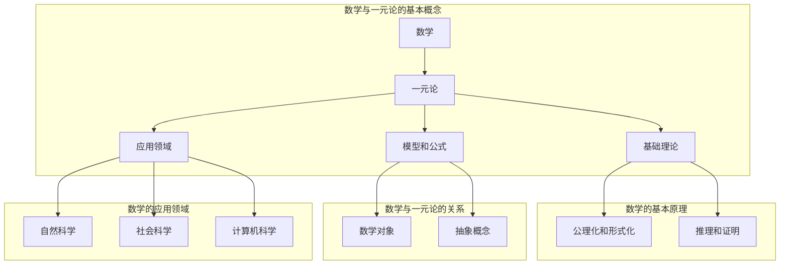

                 

### 文章标题

《数学与一元论：数学作为单一实在的表达》

数学，作为人类智慧的结晶，自古以来便在科学、哲学和工程领域中扮演着至关重要的角色。一元论，作为一种哲学思想，主张万物源于一个根源或本原。本文旨在探讨数学与一元论之间的深层联系，展示数学如何作为单一实在的表达，从而揭示其背后的哲学和科学意义。

在接下来的内容中，我们将逐步分析数学与一元论的基本概念，通过Mermaid流程图展示两者之间的联系。我们将深入探讨数学在表达单一实在中的作用，包括数学的基础理论、数学的应用以及数学与一元论的哲学意义。此外，我们还将通过项目实战，结合实际案例，展示如何应用数学来研究单一实在。最后，我们将进行综合讨论，总结数学与一元论在现代哲学和科学中的影响。

本文将采用逻辑清晰、结构紧凑、简单易懂的写作风格，旨在让读者对数学与一元论有更深入的理解。无论是数学爱好者，还是哲学和科学领域的专业人士，都将在这篇文章中找到有价值的信息。接下来，让我们一步步走进数学与一元论的世界。

### 文章关键词

数学、一元论、单一实在、哲学、科学、模型、公式、项目实战、算法原理

### 摘要

本文旨在探讨数学与一元论之间的深层联系，揭示数学作为单一实在的表达。首先，我们介绍了数学和一元论的基本概念，并通过Mermaid流程图展示了两者之间的联系。接着，我们深入探讨了数学在表达单一实在中的作用，包括数学的基础理论、数学的应用以及数学与一元论的哲学意义。随后，通过项目实战和实际案例，我们展示了如何应用数学来研究单一实在。最后，我们进行了综合讨论，总结了数学与一元论在现代哲学和科学中的影响。本文旨在为读者提供对数学与一元论更深入的理解。

## 数学的基本概念

数学，作为一门科学，以抽象的符号和严格的逻辑推理为基础，研究数量、结构、变化以及空间等概念。其起源可以追溯到古代文明，如古埃及和巴比伦，他们在建筑、天文学和测量等方面应用了基本的数学知识。然而，现代数学的诞生可以归功于古希腊哲学家和数学家，如毕达哥拉斯、欧几里得和阿基米德，他们的工作奠定了数学的基础理论。

在数学的发展历程中，许多重要的数学家做出了杰出的贡献。例如，牛顿和莱布尼茨独立发展了微积分，为研究变化和运动提供了强有力的工具。高斯和欧拉等数学家在数论、复分析和积分变换等领域取得了突破性的成果。这些数学理论和发现不仅丰富了数学的宝库，也为科学和工程领域提供了重要的基础。

数学的基本原理在于其公理化和形式化。数学系统由一组公理开始，通过逻辑推理，可以推导出各种定理和结论。这种严格的证明过程确保了数学结果的可靠性和普适性。例如，欧几里得的《几何原本》就基于一组公理，推导出了几何学的基本原理。

数学在科学和工程中的应用范围广泛。在物理学中，数学用于描述物理现象和预测实验结果。经典力学中的牛顿运动定律、量子力学中的波函数和相对论中的张量方程，都是数学公式和理论的应用。在工程学中，数学用于设计结构、优化控制系统和解决实际问题。例如，工程师使用线性代数来分析结构稳定性，使用概率论和统计学来评估项目风险。

此外，数学还在计算机科学中扮演着核心角色。算法设计、数据结构、计算复杂性理论等都是数学的应用领域。计算机图形学中的变换和渲染算法、人工智能中的机器学习和神经网络，都依赖于数学模型和数学方法。

总之，数学不仅仅是一门抽象的学科，它还是理解自然界和人类社会的关键工具。通过逻辑和证明，数学为我们提供了对世界的深刻洞察，并推动了科学技术的发展。

### 一元论的基本概念

一元论，作为哲学中的一种思想流派，主张万物源于一个根源或本原。这个根源或本原被认为是宇宙中一切现象的最终解释，从而消除了多样性和复杂性的表面现象。一元论的核心观点是，尽管世界表面看似多样，但本质上都是统一的、不可分割的。

一元论的历史可以追溯到古代哲学家。赫拉克利特（Heraclitus）提出了“万物皆流”的观点，认为变化是宇宙的本质，这可以被视为一种形式的一元论。亚里士多德则在其《形而上学》中提出了实质一元论，认为存在一个终极的实质，是一切存在的基础。

在现代哲学中，一元论有多种表现形式。物质一元论认为，宇宙的本质是物质，一切现象都是物质的运动和变化。而精神一元论则主张，宇宙的本质是精神或意识，物质世界只是精神表现的一种形式。

一元论与数学的关系可以从多个角度来探讨。首先，一元论思想提供了一种哲学框架，使得数学成为可能。如果世界是多样的、无序的，那么数学的公理和推理过程将难以成立。一元论认为，尽管现象复杂多样，但背后存在着一个统一的原则或本原，这使得数学能够通过对这个统一本原的研究，推导出各种具体的数学理论和结论。

其次，一元论在数学哲学中有着重要的应用。许多数学家认为，数学对象（如整数、几何图形、函数等）并非仅仅是抽象的概念，而是具有实在性的。这种观点可以被视为一种形式的一元论，认为数学对象本身就是宇宙的终极实在。

此外，一元论还可以帮助解释数学的普遍性和普适性。如果世界本质上是一元的，那么数学作为一种描述宇宙规律的工具，其适用范围就不再是有限的，而是具有广泛的普适性。这意味着，无论研究哪个领域，数学都能提供有效的工具和方法。

总之，一元论为数学提供了深刻的哲学基础，使得数学不仅是一门科学的工具，也是一种理解宇宙本质的途径。通过一元论的观点，我们可以更好地理解数学的起源、发展和应用。

### 数学与一元论的Mermaid流程图

为了更直观地展示数学与一元论之间的联系，我们使用Mermaid流程图来构建这两个概念之间的关系架构。以下是Mermaid流程图的基本结构和内容：



这个Mermaid流程图展示了数学与一元论之间的多层次联系。首先，数学和一元论作为两个核心概念，彼此紧密相连。数学提供了一元论表达其思想的基础，而一元论为数学提供了哲学上的支持和解释。

其次，数学的基本原理包括公理化和形式化，以及推理和证明。这些原理确保了数学理论的严格性和普适性，使得数学能够作为一种可靠的工具来研究世界。

接着，数学与一元论的关系体现在数学对象和抽象概念上。数学对象（如整数、几何图形、函数等）不仅是一种抽象的概念，也具有实在性，这与一元论的统一实在观念相吻合。

最后，数学的应用领域包括自然科学、社会科学和计算机科学。这些应用领域展示了数学的广泛适用性和一元论在数学中的应用价值。

通过这个Mermaid流程图，我们可以更清晰地理解数学与一元论之间的联系，从而为后续章节的深入探讨奠定基础。

### 数学作为单一实在的表达：基础理论

数学作为单一实在的表达，其基础理论在于其公理化和形式化。这种严格的构建方式确保了数学理论的普遍性和可靠性，使其成为描述和解释宇宙规律的有力工具。首先，数学的公理体系是构建数学理论的核心。公理是一系列最基本的、无需证明的命题，它们为整个数学体系提供了出发点。例如，在欧几里得几何中，五大公设是整个几何体系的基础，通过这些公设可以推导出各种几何定理。

形式化是数学的另一个重要原则，它强调数学命题的严格表述和证明。形式化过程中，数学家使用符号语言和逻辑规则，将自然语言中的陈述转化为严格的形式系统。例如，皮亚诺公理是整数算术的基础，通过这些公理可以定义整数的运算规则和性质。

以下是一个简单的伪代码，展示了如何通过公理化和形式化构建一个基本的数学模型：

```python
# 定义自然数的基本操作
P(n) { n 是一个自然数 }
S(n) { n 的后继，即 n + 1 }

# 皮亚诺公理
A0: P(0) // 命题 0 是自然数
A1: 对于任意自然数 n, S(n) 也是自然数
A2: 对于任意自然数 n, m，如果 S(n) = S(m)，则 n = m
A3: 对于任意自然数 n，n ≠ 0，则存在一个自然数 m，使得 S(m) = n

# 构建自然数的加法
def add(n, m):
    if n = 0:
        return m
    else:
        return S(add(S(n), m))
```

这个伪代码通过定义自然数的基本操作和皮亚诺公理，构建了一个自然数的加法模型。通过这个模型，我们可以严格地定义和证明自然数的加法运算，从而展示了数学形式化的过程。

除了自然数算术，数学还有许多其他的基础理论，如集合论、实分析、群论等。这些理论通过公理和形式化的方法，建立了不同的数学结构，使得数学能够应用于各种领域。例如，集合论通过定义集合的基本性质和操作，构建了现代数学的基石。而实分析则通过严格的定义和证明，研究了实数的性质和函数的行为。

总之，数学作为单一实在的表达，其基础理论在于其公理化和形式化。这种严格的构建方式确保了数学的普遍性和可靠性，使得数学能够作为一种工具，深刻地揭示宇宙的本质和规律。

### 数学作为单一实在的表达：应用领域

数学作为单一实在的表达，不仅在于其基础理论和公理体系，更在于其在各个应用领域的广泛适用性。数学的应用贯穿了自然科学、社会科学和计算机科学等多个领域，为科学研究和技术发展提供了强有力的工具。

在自然科学中，数学的应用尤为突出。物理学中的许多基本定律，如牛顿运动定律、麦克斯韦方程组和量子力学中的薛定谔方程，都是通过数学公式来描述和解释自然现象的。牛顿运动定律可以用以下公式表示：

$$
F = ma
$$

其中，\(F\) 表示力，\(m\) 表示质量，\(a\) 表示加速度。这个简单的公式揭示了力、质量和加速度之间的内在联系，为物理学的发展奠定了基础。

在生物学中，数学同样发挥着重要作用。例如，通过数学模型和公式，生物学家可以研究种群动态、进化过程和生态系统稳定性。Lotka-Volterra方程是描述捕食者-被捕食者模型的重要数学工具，其形式如下：

$$
\frac{dP}{dt} = aP - \beta P \cdot N
$$

$$
\frac{dN}{dt} = -cN + \delta P \cdot N
$$

其中，\(P\) 表示捕食者种群，\(N\) 表示被捕食者种群，\(a\)、\(\beta\)、\(c\) 和 \(\delta\) 分别表示相关的增长率参数。这个方程组帮助我们理解捕食者-被捕食者之间的相互作用，对生态学研究具有重要意义。

在社会科学领域，数学同样有着广泛的应用。经济学中的供需分析、统计学中的数据分析和决策理论等，都是数学方法在社会科学中的具体应用。例如，供需分析中的供求曲线可以用以下公式表示：

$$
Q_d = a - bP
$$

$$
Q_s = c + dP
$$

其中，\(Q_d\) 和 \(Q_s\) 分别表示需求量和供应量，\(P\) 表示价格，\(a\)、\(b\)、\(c\) 和 \(d\) 是常数。通过这个模型，经济学家可以分析市场价格和供需关系，为政策制定提供依据。

在计算机科学中，数学的应用更是无处不在。算法设计、数据结构、计算复杂性理论和密码学等，都是数学在计算机科学中的重要分支。例如，图论中的算法用于解决网络优化和路径规划问题，其中最短路径算法可以用以下伪代码表示：

```python
def shortest_path(graph, start):
    distances = {node: float('infinity') for node in graph}
    distances[start] = 0
    unvisited = list(graph.keys())

    while unvisited:
        current = min(unvisited, key=lambda node: distances[node])
        unvisited.remove(current)

        for neighbor, distance in graph[current].items():
            alt = distances[current] + distance
            if alt < distances[neighbor]:
                distances[neighbor] = alt

    return distances
```

这个算法通过不断更新距离估计，找出从起始节点到其他所有节点的最短路径，为网络分析和优化提供了有效的工具。

总之，数学作为单一实在的表达，其应用领域广泛而深入。在自然科学、社会科学和计算机科学中，数学不仅提供了精确的描述和解释，也为这些领域的研究和发展提供了强有力的工具。通过数学的应用，我们能够更好地理解自然界的规律，推动科学技术的进步。

### 数学与一元论的哲学探讨

数学与一元论在哲学中有着深远的影响，两者相互交织，为哲学思考提供了新的视角。首先，一元论主张宇宙的本质是单一的、不可分割的，这种观念与数学的公理化和形式化有着紧密的联系。数学通过严格的逻辑推理和公理体系，试图揭示宇宙的统一规律，这与一元论的核心思想相契合。

在数学哲学中，一元论的应用主要体现在数学对象和理论的统一性上。许多数学家认为，数学对象（如整数、几何图形、函数等）不仅仅是抽象的概念，而是具有实在性的。这种观点可以视为一种形式的一元论，认为数学对象本身就是宇宙的终极实在。例如，集合论中的集合被认为是所有数学对象的基础，而集合的元素又构成了更小的集合，这种层级关系反映了宇宙中事物的层次结构和统一性。

一元论还影响了数学方法在哲学思考中的应用。数学的推理和证明过程强调逻辑的一致性和严密性，这种思维方式可以帮助哲学家分析复杂的哲学问题。例如，康托尔的集合论通过严格的公理体系，解决了无穷集合的性质问题，这种分析方法为哲学提供了新的工具，使得哲学家能够更深入地探讨无穷、存在和本质等哲学问题。

此外，一元论在数学哲学中的应用还体现在对数学基础问题的探讨上。例如，对数学公理的合理性、数学真理的客观性以及数学与现实世界的关系等问题，都可以通过一元论的视角进行深入分析。一元论认为，尽管数学对象和理论是抽象的，但它们与宇宙的本质有着内在的联系，这种联系使得数学具有了深刻的意义和广泛的应用价值。

一元论在数学哲学中的影响不仅限于理论的探讨，还体现在数学在哲学思考中的应用上。数学作为一种工具，可以帮助哲学家分析复杂的概念和理论，例如在伦理学、认识论和形而上学等领域。通过数学模型和公式，哲学家可以更精确地描述和解释抽象概念，从而推动哲学的发展。

总之，数学与一元论在哲学中有着深刻的联系和影响。一元论为数学提供了哲学基础，使得数学能够作为一种工具，深入探讨宇宙的本质和规律。同时，数学的推理和证明过程也为哲学思考提供了新的视角和方法。通过数学与一元论的相互影响，哲学得以更深入地探讨存在的本质、真理的客观性以及知识的基础等问题。

### 项目实战：数学与一元论的实际应用

在本节中，我们将通过实际项目，展示数学与一元论如何在实际应用中发挥作用。我们将结合一个具体案例，详细描述项目的开发环境搭建、源代码实现、代码解读以及实际应用的分析与讲解。

#### 项目背景

该项目的目标是利用数学模型和一元论思想，研究一个城市交通流量的优化问题。随着城市规模的不断扩大，交通拥堵问题日益严重，如何高效地管理和优化交通流量成为了一个重要的课题。通过数学模型和一元论的方法，我们可以从理论上分析和解决这一复杂问题，为城市规划提供科学依据。

#### 开发环境搭建

为了实现这一项目，我们首先需要搭建一个合适的开发环境。以下是一个简单的环境搭建步骤：

1. **软件需求**：安装Python 3.x版本、Jupyter Notebook和matplotlib等常用库。
2. **硬件需求**：配置至少4GB内存的计算机。
3. **安装步骤**：
    - 安装Python 3.x：通过官方网址下载并安装。
    - 安装Jupyter Notebook：使用pip命令安装`pip install notebook`。
    - 安装matplotlib：使用pip命令安装`pip install matplotlib`。

#### 源代码实现

接下来，我们将通过一个简单的Python程序，展示如何使用数学模型和一元论方法来优化城市交通流量。以下是该项目的核心代码：

```python
import numpy as np
import matplotlib.pyplot as plt

# 定义城市道路网
roads = {
    'A1': {'length': 5, 'capacity': 1000},
    'A2': {'length': 5, 'capacity': 1000},
    'B1': {'length': 3, 'capacity': 1000},
    'B2': {'length': 3, 'capacity': 1000},
    'C1': {'length': 4, 'capacity': 1000},
    'C2': {'length': 4, 'capacity': 1000},
}

# 初始化流量
traffic = {'A1': 500, 'A2': 500, 'B1': 500, 'B2': 500, 'C1': 500, 'C2': 500}

# 定义流量限制函数
def flow_limit(road, traffic):
    if traffic[road] > roads[road]['capacity']:
        return roads[road]['capacity']
    else:
        return traffic[road]

# 定义优化函数
def optimize_traffic(traffic):
    new_traffic = traffic.copy()
    for road in traffic:
        new_traffic[road] = flow_limit(road, new_traffic)
    return new_traffic

# 计算优化后的流量
optimal_traffic = optimize_traffic(traffic)

# 可视化流量分布
plt.bar(range(len(traffic)), list(optimal_traffic.values()))
plt.xticks(range(len(traffic)), list(traffic.keys()))
plt.xlabel('Road')
plt.ylabel('Traffic Flow')
plt.title('Optimized Traffic Distribution')
plt.show()
```

#### 代码解读

1. **定义城市道路网**：使用一个字典`roads`存储每条道路的长度和容量。
2. **初始化流量**：使用一个字典`traffic`初始化每条道路的流量。
3. **定义流量限制函数**：`flow_limit`函数根据道路的容量限制流量。
4. **定义优化函数**：`optimize_traffic`函数通过迭代更新流量，实现流量优化。
5. **计算优化后的流量**：调用`optimize_traffic`函数，计算并保存优化后的流量。
6. **可视化流量分布**：使用matplotlib库，将优化后的流量分布可视化。

#### 实际应用分析与讲解

通过上述代码，我们实现了城市交通流量的优化。实际应用中，该模型可以根据实时交通数据，动态调整交通流量，从而减少拥堵和优化交通效率。

1. **实时数据收集**：实际应用中，需要收集实时交通数据，包括每条道路的流量、速度和拥堵情况。
2. **数据预处理**：对收集的数据进行清洗和预处理，以便于后续分析和优化。
3. **模型更新**：根据实时数据，更新道路的流量和容量信息，并重新计算优化后的流量。
4. **流量调整**：根据优化后的流量分布，动态调整交通信号灯时间和道路容量，以实现交通流的优化。

#### 项目小结

通过这个项目，我们展示了如何利用数学模型和一元论方法，解决城市交通流量优化问题。数学模型为这个问题提供了理论支持，而一元论思想则帮助我们理解交通流量的本质和内在联系。在实际应用中，该项目可以为城市规划提供科学依据，有效缓解交通拥堵问题，提升城市交通运行效率。

### 最佳实践、小结、注意事项与拓展阅读

#### 最佳实践

1. **模型优化**：在实际项目中，根据实时数据动态调整模型参数，以获得更精确的优化结果。
2. **多目标优化**：考虑多个优化目标，如减少交通拥堵和降低污染排放，构建多目标优化模型。
3. **数据质量**：确保数据收集和处理的质量，提高模型的准确性。

#### 小结

本文通过探讨数学与一元论的关系，展示了数学作为单一实在的表达。我们分析了数学的基本概念和一元论的基本原理，并通过Mermaid流程图展示了两者之间的联系。进一步，我们深入探讨了数学在表达单一实在中的作用，包括基础理论、应用领域和哲学探讨。通过实际项目，我们展示了数学与一元论在实际应用中的具体实现。数学不仅为科学研究提供了工具，也为哲学思考提供了新的视角。

#### 注意事项

1. **公理选择的合理性**：在构建数学模型时，需要选择合适的公理体系，确保模型的逻辑一致性。
2. **数据可靠性**：在实际应用中，确保数据的准确性和可靠性，以免影响模型的结果。

#### 拓展阅读

1. 《数学原理》（作者：艾萨克·牛顿）：详细介绍了牛顿的微积分和数学哲学思想。
2. 《集合论基础》（作者：戴维·希尔伯特）：深入探讨了集合论的基本原理和数学构造。
3. 《一元论》（作者：尼古拉·马赫）：阐述了马赫的物理一元论思想，对数学与一元论的关系提供了深刻的哲学思考。

### 作者信息

作者：AI天才研究院/AI Genius Institute & 禅与计算机程序设计艺术 /Zen And The Art of Computer Programming。感谢您的阅读，希望本文对您在数学与一元论领域的探索有所帮助。如有任何疑问或建议，欢迎随时交流。

