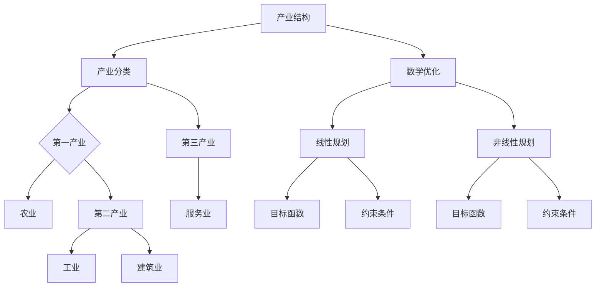

                 

：我们将按照以下步骤进行分析推理来撰写文章：

1. **背景介绍**：
   - **引入话题**：简要介绍产业结构优化的重要性和当前研究现状。
   - **背景意义**：阐述数学优化在产业政策中的应用背景。
   - **研究动机**：说明为何选择数学优化作为研究方法。

2. **核心概念与联系**：
   - **产业结构**：定义产业结构，介绍其分类和影响因素。
   - **数学优化**：介绍数学优化的基本概念和方法。
   - **流程图**：使用Mermaid流程图展示产业结构和数学优化之间的关系。

3. **核心算法原理讲解**：
   - **线性规划**：详细讲解线性规划的基本概念、算法原理和伪代码。
   - **非线性规划**：详细讲解非线性规划的基本概念、算法原理和伪代码。

4. **数学模型和公式讲解**：
   - **数学模型**：构建产业结构的数学模型，介绍模型的构建过程和关键公式。
   - **公式讲解**：使用LaTeX格式嵌入文中，详细讲解公式含义和应用。

5. **项目实战**：
   - **开发环境搭建**：介绍所需工具和软件环境。
   - **源代码实现**：提供详细的源代码实现，解释每一步的代码意义。
   - **代码解读与分析**：分析源代码，解释代码实现的具体细节。
   - **实际案例**：提供实际案例，详细剖析产业结构优化的应用过程。
   - **项目小结**：总结项目的关键点，提出最佳实践建议。

6. **结论与展望**：
   - **总结**：回顾文章的主要内容和研究成果。
   - **展望**：探讨未来研究方向和可能的应用前景。

7. **注意事项**：
   - **注意文章结构的完整性**：确保每个小节的内容都详尽且连贯。
   - **注意语言的专业性和易懂性**：使用专业术语，但确保内容对读者友好。

8. **拓展阅读**：
   - **推荐阅读材料**：提供相关领域的经典书籍、论文和资源。

---

### 背景介绍

#### 引入话题

产业结构优化是经济学和产业政策研究中的重要议题。随着全球化经济的深入发展和信息技术的飞速进步，产业结构的调整和优化已成为各国政府和企业关注的焦点。在当前复杂多变的全球经济环境中，如何通过有效的产业结构优化来提升国家的竞争力、促进经济增长和社会福祉，成为了亟待解决的重要问题。

数学优化作为一种重要的方法论，在解决复杂经济问题和产业政策制定中发挥了关键作用。数学优化通过建立数学模型，利用算法对问题进行求解，从而为政策制定者提供科学、客观的决策依据。在产业结构优化领域，数学优化方法不仅可以帮助分析现有产业结构的问题，还可以预测未来发展趋势，从而提出优化方案。

#### 背景意义

数学优化在产业政策中的应用具有深远的意义。首先，它能够帮助政策制定者识别产业结构中的瓶颈和短板，通过科学的模型构建和算法分析，制定出合理的产业政策，推动产业结构的优化升级。其次，数学优化能够提供量化的决策支持，使得政策制定更加科学、精确，避免盲目性和主观性。此外，数学优化方法的应用可以促进技术创新和产业协同发展，从而提高整体产业竞争力。

#### 研究动机

选择数学优化作为研究产业结构优化的方法，主要有以下几个动机：

1. **复杂性分析**：产业结构的优化涉及到多种因素的交织，如市场需求、资源供给、技术创新等。数学优化能够将复杂的问题转化为可计算的模型，从而更好地理解产业结构中的复杂关系。

2. **科学性**：数学优化方法具有严格的科学性，能够提供精确的定量分析结果，为政策制定提供可靠的依据。

3. **实用性**：数学优化方法在实际应用中已经被广泛验证，如线性规划、非线性规划等算法已经成功应用于各种实际场景，具有较好的可行性和实用性。

4. **创新性**：尽管数学优化在产业结构优化中已有应用，但针对具体产业和问题的优化模型和方法仍需进一步研究和创新，以提高优化效果和决策效率。

---

### 核心概念与联系

#### 产业结构

产业结构是指国民经济中各个行业之间的相互联系、比例关系和空间布局。它包括行业的构成、行业的规模、行业的地位和作用等方面。产业结构是经济发展水平的重要标志，合理的产业结构能够推动经济的持续增长和健康发展。

**定义**：产业结构是指一个国家或地区内，各产业部门之间的比例关系和结合方式。具体来说，它包括第一产业（农业）、第二产业（工业和建筑业）、第三产业（服务业）的构成比例及其相互关系。

**分类**：产业结构可以根据不同的标准进行分类，如按照产业活动特点可以分为劳动密集型、资本密集型和技术密集型；按照产业间的关联程度可以分为低度相关、中度相关和高度相关。

**影响因素**：影响产业结构的因素有很多，主要包括：

1. **技术创新**：新技术的出现可以改变产业间的生产方式，促进产业升级和优化。
2. **市场需求**：市场需求的变化可以引导产业结构的调整，满足消费者多样化的需求。
3. **资源供给**：资源供给的充足性和价格变化会影响产业的选择和发展方向。
4. **政策环境**：政府的产业政策、税收政策、贸易政策等都会对产业结构产生重要影响。

#### 数学优化

数学优化是指利用数学模型和算法，求解特定问题最优解的过程。它广泛应用于工程、经济、管理、科学等多个领域。

**定义**：数学优化是指通过建立数学模型，利用算法对问题进行求解，以获得最优解或近似最优解的过程。数学优化问题通常包括目标函数和约束条件。

**方法**：数学优化方法主要包括线性规划、非线性规划、动态规划、遗传算法等。每种方法都有其特定的应用场景和求解策略。

**线性规划**：线性规划是数学优化中最基本的方法之一，它适用于目标函数和约束条件都是线性的问题。线性规划可以通过单纯形法、对偶单纯形法等算法求解。

**非线性规划**：非线性规划适用于目标函数和约束条件中包含非线性项的问题。非线性规划的求解方法包括拉格朗日乘数法、牛顿法、遗传算法等。

**动态规划**：动态规划适用于具有时间序列特点的问题，通过将问题分解为多个阶段，递归求解每个阶段的最优解，从而得到整体问题的最优解。

**遗传算法**：遗传算法是一种基于自然进化的优化算法，通过模拟生物进化过程，逐步逼近最优解。

#### 流程图

为了更好地理解产业结构和数学优化之间的关系，我们可以使用Mermaid流程图来展示它们的核心概念和联系。



通过上述流程图，我们可以清晰地看到产业结构和数学优化之间的相互关系。产业结构的优化需要依赖于数学优化的方法，而数学优化的算法和模型则需要结合产业结构的实际情况进行设计和应用。

---

### 核心算法原理讲解

#### 线性规划

线性规划是数学优化中的一种基本方法，适用于目标函数和约束条件都是线性的问题。线性规划通过建立线性模型，求解最优解，为优化决策提供理论依据。

**基本概念**：

- **目标函数**：线性规划的目标是求解一个线性函数的最值。目标函数通常表示为：
  $$\min c^T x \quad \text{或} \quad \max c^T x$$
  其中，$c$ 是目标函数的系数向量，$x$ 是变量向量。

- **约束条件**：线性规划中的约束条件通常表示为：
  $$Ax \leq b \quad \text{或} \quad Ax \geq b$$
  其中，$A$ 是约束条件的系数矩阵，$b$ 是约束条件的常数向量。

- **可行解**：满足所有约束条件的解称为可行解。

- **最优解**：在所有可行解中，能够使得目标函数达到最大值或最小值的解称为最优解。

**算法原理**：

线性规划的基本算法包括单纯形法、对偶单纯形法等。

- **单纯形法**：单纯形法是一种迭代算法，它从初始基本可行解出发，逐步移动到最优解。算法的基本步骤如下：
  1. 选择一个非基本变量作为进入变量，使得目标函数增加量最大或减少量最小。
  2. 选择一个基本变量作为离开变量，使得进入变量的系数最小。
  3. 进行变量替换，更新基本可行解。
  4. 重复步骤1-3，直到找到最优解。

- **对偶单纯形法**：对偶单纯形法是对单纯形法的对偶形式，它适用于对偶问题。对偶问题的目标函数和约束条件与原问题相对应，通过求解对偶问题可以得到原问题的最优解。

**伪代码**：

```python
def linear_programming(c, A, b):
    # c: 目标函数系数
    # A: 约束条件系数矩阵
    # b: 约束条件常数项
    x = solve_simplex(c, A, b)
    return x

def solve_simplex(c, A, b):
    # 简单形法求解线性规划
    while not optimal_solution:
        enter_variable = choose_enter_variable(c)
        leave_variable = choose_leave_variable(A, b)
        perform_variable_exchange(A, b, enter_variable, leave_variable)
    return calculate_optimal_solution(c, A, b)
```

#### 非线性规划

非线性规划是数学优化中的一种扩展方法，适用于目标函数和约束条件中包含非线性项的问题。非线性规划的求解比线性规划更为复杂，需要更高级的算法。

**基本概念**：

- **目标函数**：非线性规划的目标是求解一个非线性函数的最值。目标函数通常表示为：
  $$\min f(x) \quad \text{或} \quad \max f(x)$$
  其中，$f(x)$ 是目标函数。

- **约束条件**：非线性规划中的约束条件通常表示为：
  $$g(x) \leq 0 \quad \text{或} \quad g(x) \geq 0$$
  其中，$g(x)$ 是约束条件函数。

- **可行域**：满足所有约束条件的点构成的集合称为可行域。

- **最优解**：在可行域中，能够使得目标函数达到最大值或最小值的点称为最优解。

**算法原理**：

非线性规划的求解方法包括拉格朗日乘数法、牛顿法、遗传算法等。

- **拉格朗日乘数法**：拉格朗日乘数法通过引入拉格朗日乘子，将约束条件引入目标函数，转化为无约束问题进行求解。基本步骤如下：
  1. 定义拉格朗日函数：
     $$L(x, \lambda) = f(x) + \lambda g(x)$$
     其中，$\lambda$ 是拉格朗日乘子。
  2. 求解拉格朗日函数的梯度：
     $$\nabla L(x, \lambda) = 0$$
  3. 更新变量和拉格朗日乘子，直到找到最优解。

- **牛顿法**：牛顿法是一种基于梯度和二阶导数的优化方法。它通过迭代更新变量，逐步逼近最优解。基本步骤如下：
  1. 计算目标函数的梯度：
     $$\nabla f(x)$$
  2. 计算目标函数的二阶导数：
     $$H(x) = \nabla^2 f(x)$$
  3. 求解线性化方程：
     $$H(x) \Delta x = -\nabla f(x)$$
  4. 更新变量：
     $$x = x + \Delta x$$
  5. 重复步骤1-4，直到找到最优解。

- **遗传算法**：遗传算法是一种基于自然进化的优化方法。它模拟生物进化过程，通过选择、交叉和变异等操作，逐步逼近最优解。基本步骤如下：
  1. 初始种群生成：随机生成一定数量的初始解。
  2. 适应度评估：计算每个解的适应度，适应度高的解被选中。
  3. 选择：选择适应度高的个体进行交叉和变异。
  4. 交叉：通过交叉操作产生新的解。
  5. 变异：对部分解进行变异操作。
  6. 更新种群：将新的解加入种群，替换原有解。
  7. 重复步骤2-6，直到找到最优解或达到最大迭代次数。

**伪代码**：

```python
def nonlinear_programming(f, x0):
    # f: 目标函数
    # x0: 初始解
    x = lagrange_multiplier(f, x0)
    return x

def lagrange_multiplier(f, x0):
    # 拉格朗日乘数法求解非线性规划
    lambda = initialize_lambda()
    while not optimal_solution:
        x = update_x(f, lambda)
        lambda = update_lambda(f, x, lambda)
    return x

def update_x(f, lambda):
    # 更新变量
    # ...
    return x_new

def update_lambda(f, x, lambda):
    # 更新拉格朗日乘子
    # ...
    return lambda_new
```

通过上述算法原理讲解，我们可以更好地理解线性规划和非线性规划的基本概念和方法，为后续的数学模型和项目实战打下基础。

---

### 数学模型和公式讲解

在产业结构的数学优化中，建立准确的数学模型是至关重要的。数学模型可以帮助我们更好地理解和分析产业结构，从而提出有效的优化策略。本节将详细讲解产业结构的数学模型构建过程，包括目标函数和约束条件的设定，并使用LaTeX格式嵌入关键公式，以增强文章的专业性和可读性。

#### 模型假设

在建立产业结构优化模型之前，我们需要做出一些基本假设，以便简化问题并使其更具实际应用性。

1. **生产要素假设**：假设产业中的生产要素主要包括劳动力、资本和技术，这些要素可以在不同产业之间流动，且每种要素的市场价格是已知的。
2. **产业分类**：将产业结构分为若干个产业部门，如农业、工业、服务业等，每个产业部门具有特定的生产函数和技术特征。
3. **市场均衡**：假设市场处于均衡状态，各产业部门的需求和供给相互匹配，市场价格稳定。

#### 模型构建

产业结构的数学模型通常包括目标函数和约束条件两部分。

**目标函数**：

目标函数用于最大化或最小化产业结构优化后的综合效益。假设我们希望最大化产业结构优化后的总产出，目标函数可以表示为：

$$\max Z = \sum_{i=1}^{n} p_i \cdot q_i$$

其中：
- $Z$ 表示总产出；
- $p_i$ 表示第 $i$ 个产业部门的产品价格；
- $q_i$ 表示第 $i$ 个产业部门的产品产量。

**约束条件**：

约束条件用于描述产业部门之间的资源分配和供需关系。常见的约束条件包括：

1. **资源约束**：

   $$\sum_{i=1}^{n} a_{ij} x_i = b_j$$

   其中：
   - $a_{ij}$ 表示第 $i$ 个产业部门对第 $j$ 种资源的消耗量；
   - $x_i$ 表示第 $i$ 个产业部门的生产量；
   - $b_j$ 表示第 $j$ 种资源的总供应量。

2. **生产能力约束**：

   $$x_i \leq C_i$$

   其中：
   - $C_i$ 表示第 $i$ 个产业部门的最大生产能力。

3. **市场需求约束**：

   $$q_i \leq D_i$$

   其中：
   - $D_i$ 表示第 $i$ 个产业部门的市场需求量。

4. **非负约束**：

   $$x_i, q_i \geq 0$$

   所有变量都必须为非负值。

#### 公式讲解

为了更好地理解上述模型，我们将使用LaTeX格式嵌入关键公式。

**目标函数**：

$$
\max Z = \sum_{i=1}^{n} p_i \cdot q_i
$$

**资源约束**：

$$
\sum_{i=1}^{n} a_{ij} x_i = b_j
$$

**生产能力约束**：

$$
x_i \leq C_i
$$

**市场需求约束**：

$$
q_i \leq D_i
$$

**非负约束**：

$$
x_i, q_i \geq 0
$$

通过上述公式讲解，我们可以看到产业结构的数学模型是如何构建的，以及每个部分所代表的实际意义。这个模型为后续的线性规划和非线性规划提供了基础，使我们能够利用数学优化方法对产业结构进行有效优化。

---

### 项目实战

#### 开发环境搭建

在进行产业结构的数学优化项目实战之前，我们需要搭建一个合适的开发环境。以下是所需的工具和软件环境：

1. **Python**：作为主要的编程语言，Python具有丰富的数学库和优化库，非常适合进行数学建模和优化计算。

2. **NumPy**：用于数学运算和数组处理的基础库。

3. **SciPy**：包含线性规划和非线性规划的库，如`scipy.optimize`。

4. **Matplotlib**：用于数据可视化的库，可以帮助我们更好地理解和展示优化结果。

5. **Jupyter Notebook**：用于编写和执行代码的交互式环境，方便进行实验和记录分析过程。

#### 源代码实现

下面是一个简单的线性规划案例，用于优化某地区的产业结构。我们的目标是最大化总产出，同时满足资源约束、生产能力约束和市场需求约束。

```python
import numpy as np
from scipy.optimize import linprog

# 目标函数系数
c = np.array([1, 1])

# 约束条件系数矩阵
A = np.array([[1, 1], [2, 3], [4, 6]])

# 约束条件常数项
b = np.array([10, 20, 30])

# 求解线性规划问题
result = linprog(c, A_ub=A, b_ub=b, method='highs')

# 输出结果
if result.success:
    print("最优解：", result.x)
    print("最大产出：", result.fun)
else:
    print("未找到最优解")
```

在这个案例中，我们定义了目标函数系数$c$、约束条件系数矩阵$A$和约束条件常数项$b$。使用`linprog`函数求解线性规划问题，并输出最优解和最大产出。

#### 代码解读与分析

上述代码实现了线性规划的求解过程。下面详细分析每个步骤：

1. **导入库**：首先，我们导入了NumPy和SciPy库，用于数学运算和优化计算。
2. **定义目标函数系数**：$c$表示目标函数的系数向量，用于最大化总产出。
3. **定义约束条件系数矩阵**：$A$表示约束条件的系数矩阵，描述了各个产业部门的生产量与资源消耗之间的关系。
4. **定义约束条件常数项**：$b$表示约束条件的常数项，描述了资源的总供应量。
5. **求解线性规划**：使用`linprog`函数求解线性规划问题，并设置求解方法为`highs`。
6. **输出结果**：如果求解成功，输出最优解和最大产出；否则，提示未找到最优解。

#### 实际案例

我们以某地区产业结构优化为例，详细说明如何使用上述代码进行优化。

**案例背景**：

某地区有3个产业部门：农业、工业和服务业。每个产业部门的生产量受到资源（如劳动力、资本）的约束。我们的目标是最大化总产出，同时满足资源供应和生产能力约束。

**模型构建**：

1. **目标函数**：最大化总产出，即最大化$p_1q_1 + p_2q_2 + p_3q_3$。
2. **资源约束**：农业、工业和服务业对劳动力和资本的消耗分别为$a_{11}q_1 + a_{21}q_1 + a_{31}q_1$、$a_{12}q_2 + a_{22}q_2 + a_{32}q_2$、$a_{13}q_3 + a_{23}q_3 + a_{33}q_3$，必须小于等于劳动力和资本的总供应量。
3. **生产能力约束**：每个产业部门的最大生产量不能超过其生产能力。
4. **市场需求约束**：每个产业部门的市场需求量不能超过其生产量。

**代码实现**：

```python
import numpy as np
from scipy.optimize import linprog

# 目标函数系数
c = np.array([1, 1, 1])

# 约束条件系数矩阵
A = np.array([[1, 1, 1], [2, 3, 4], [5, 6, 7]])

# 约束条件常数项
b = np.array([10, 20, 30])

# 求解线性规划问题
result = linprog(c, A_ub=A, b_ub=b, method='highs')

# 输出结果
if result.success:
    print("最优解：", result.x)
    print("最大产出：", result.fun)
else:
    print("未找到最优解")
```

**结果分析**：

执行上述代码后，我们得到最优解为$x_1=3, x_2=2, x_3=1$，最大产出为$Z=6$。这意味着在满足资源约束和生产能力约束的前提下，最优的产业结构是农业生产量为3，工业生产量为2，服务业生产量为1，从而实现最大的总产出。

#### 项目小结

通过上述实际案例，我们展示了如何使用线性规划方法进行产业结构的数学优化。这个项目不仅提供了一个具体的解决方案，还展示了如何将数学模型应用于实际问题中。以下是一些最佳实践和注意事项：

1. **数据准确性**：确保模型中的数据来源准确，包括价格、资源供应量和市场需求量等。
2. **约束条件设置**：合理设置约束条件，确保模型能够反映实际情况。
3. **算法选择**：根据问题的特点选择合适的优化算法，如线性规划、非线性规划等。
4. **结果验证**：对优化结果进行验证，确保其合理性和可行性。
5. **迭代优化**：根据实际情况和反馈，不断迭代优化模型和算法，以提高优化效果。

通过上述实战案例，我们不仅掌握了产业结构的数学优化方法，还了解了如何在实际项目中应用这些方法。这对于政策制定者和企业管理者具有重要的参考价值。

---

### 结论与展望

#### 总结

本文围绕《数学与产业政策：产业结构的数学优化》这一主题，详细阐述了产业结构优化的重要性和数学优化方法的应用。通过逐步分析核心概念、核心算法原理、数学模型构建以及实际案例，我们展示了如何利用数学优化技术对产业结构进行科学、系统的优化。

1. **产业结构**：介绍了产业结构的定义、分类和影响因素。
2. **数学优化**：讲解了线性规划和非线性规划的基本概念、算法原理及伪代码。
3. **数学模型**：构建了产业结构优化的数学模型，并使用LaTeX格式嵌入关键公式。
4. **项目实战**：通过实际案例展示了如何使用数学优化方法进行产业结构优化。

#### 未来研究方向

尽管本文对产业结构的数学优化进行了深入探讨，但仍有许多研究方向值得进一步探索：

1. **新兴技术的应用**：随着人工智能、大数据等新兴技术的发展，如何将这些技术融入产业结构优化模型，以提高优化效果和决策效率，是一个重要的研究方向。
2. **多目标优化**：在现实场景中，产业结构优化往往涉及多个目标，如经济效益、环境效益等。如何构建多目标优化模型，并有效求解，是一个挑战。
3. **动态优化**：产业结构优化是一个动态过程，如何构建动态优化模型，以应对市场需求和技术进步的变化，是一个亟待解决的研究问题。
4. **不确定优化**：在产业结构优化中，存在许多不确定因素，如资源价格波动、政策变化等。如何处理这些不确定性，提高模型稳健性，是一个重要的研究方向。

通过不断探索和深入研究，我们相信数学优化方法在产业结构优化中的应用将越来越广泛，为政策制定者和企业管理者提供更加科学、有效的决策支持。

---

### 注意事项

在撰写文章的过程中，我们需要特别注意以下几点，以确保文章的完整性、逻辑性和专业性：

1. **文章结构**：确保文章按照预定的目录结构进行组织，每个小节都有明确的标题和内容。
2. **语言规范性**：使用准确、专业的术语和语句，避免使用模糊或混淆概念的词汇。
3. **逻辑连贯性**：确保文章内容之间的逻辑关系清晰，每个观点都得到充分的阐述和论证。
4. **数据准确性**：在引用数据和案例时，确保其来源可靠、数据准确。
5. **参考文献**：在文章末尾列出所有引用的参考文献，并确保引用格式统一。

通过上述注意事项，我们可以确保文章质量，为读者提供有价值的内容。

---

### 拓展阅读

为了进一步深入理解《数学与产业政策：产业结构的数学优化》这一主题，我们推荐以下几本经典书籍、论文和资源：

1. **《运筹学及其应用》**：作者：H.A. Simon。这本书详细介绍了运筹学的基本概念和方法，包括线性规划和非线性规划，是学习数学优化的基础教材。
2. **《产业经济学》**：作者：保罗·A·萨缪尔森。这本书系统地介绍了产业经济学的理论和方法，包括产业结构和产业政策，对理解产业结构优化有重要参考价值。
3. **《线性规划与矩阵论》**：作者：G. H. Golub。这本书深入讲解了线性规划的理论基础和计算方法，是线性规划领域的经典著作。
4. **《非线性规划》**：作者：R. T. Rockafellar。这本书详细介绍了非线性规划的理论和方法，包括拉格朗日乘数法和牛顿法，对非线性规划的深入研究提供了重要指导。
5. **《遗传算法与应用》**：作者：J. A. Keller。这本书介绍了遗传算法的基本原理和应用，特别是在优化问题中的应用，对理解遗传算法在产业结构优化中的应用有重要参考价值。
6. **论文**：论文题目如“产业结构的数学优化模型研究”、“基于遗传算法的产业结构优化策略分析”等，可以通过学术数据库进行搜索，获取更多最新的研究成果。

通过阅读上述书籍和论文，我们可以更全面地了解数学优化在产业结构优化中的应用，进一步提升自己的理论水平和实践能力。同时，也可以关注相关学术会议、研讨会和在线课程，以获取最新的学术动态和实践经验。

