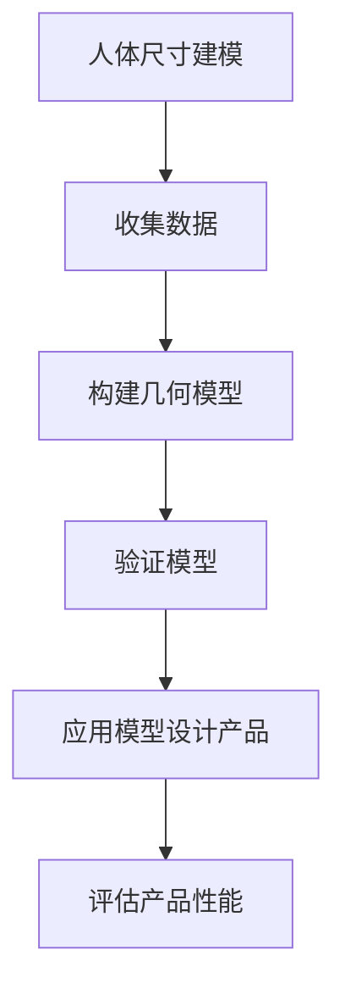

                 


### Introduction to the Book

#### The Importance of Ergonomics in Product Design

Ergonomics, derived from the Greek words "ergon" (work) and "nomos" (law), is the science of designing and arranging things to fit the needs of people. In the context of product design, ergonomics ensures that products are safe, efficient, and comfortable to use. This is crucial as it not only enhances user satisfaction but also promotes productivity and reduces the risk of injuries and health issues.

In today's fast-paced digital world, where technology is rapidly evolving, the importance of ergonomics in product design cannot be overstated. Whether it's a smartphone, a car, or an office chair, the design of these products has a significant impact on the user's well-being and overall experience. Poor ergonomic design can lead to discomfort, repetitive strain injuries, and even long-term health problems. On the other hand, well-designed ergonomic products can significantly improve user experience, satisfaction, and productivity.

#### The Role of Mathematics in Enhancing Ergonomic Design

Mathematics, often considered the language of science, plays a vital role in the field of ergonomics. It provides a structured approach to understanding and analyzing complex systems, which is essential for designing ergonomic products. By using mathematical models and tools, designers can predict how users will interact with a product, identify potential issues, and develop effective solutions.

Mathematics helps in various aspects of ergonomic design, including:

1. **Anthropometry**: The study of human body measurements and their variations. By using anthropometric data, designers can ensure that products are appropriately sized for different users.
2. **Biomechanics**: The application of mechanics to the study of human movement. Mathematical models in biomechanics help in understanding how forces and movements affect the human body and how to design products that minimize stress and strain on users.
3. **Statistics and Probability**: These tools are used to analyze user data, such as usage patterns and preferences, to make informed design decisions.
4. **Geometry and Spatial Relationships**: Understanding spatial relationships is crucial for designing products that are intuitive and easy to use. Geometry helps in creating efficient layouts and determining the best placement of controls and interfaces.
5. **Trigonometry and Calculus**: These advanced mathematical concepts are used to analyze complex systems and optimize designs for performance and efficiency.

#### Structure and Purpose of the Book

This book aims to provide a comprehensive guide to the application of mathematics in ergonomic design. It is structured to guide the reader through the fundamental concepts of ergonomics, the role of mathematics in this field, and the practical application of mathematical tools in ergonomic design.

The book is divided into several sections:

1. **Introduction to Ergonomics**: This section introduces the basics of ergonomics, its importance, and the role of mathematics in enhancing ergonomic design.
2. **Fundamental Concepts of Ergonomics**: This section covers the key ergonomic principles and guidelines, human anatomy and physiology, and the role of human factors in product design.
3. **Mathematical Tools for Ergonomics**: This section delves into the basic mathematical concepts and tools used in ergonomic design, including geometry, statistics, probability, trigonometry, and calculus.
4. **Human Factors in Product Design**: This section discusses the role of human factors in product design, the concepts of usability, user experience, and human-computer interaction, and the methods for collecting and analyzing human factors data.
5. **Application of Mathematics in Ergonomic Design**: This section provides in-depth coverage of specific mathematical applications in ergonomic design, such as anthropometry, ergonomic product design and evaluation, ergonomic analysis and simulation, and biomechanics.

By the end of this book, readers will have a solid understanding of how mathematics can be used to enhance ergonomic design, enabling them to develop better, safer, and more user-friendly products.

---

### Keywords

- Ergonomics
- Product design
- Mathematics
- Anthropometry
- Biomechanics
- Human factors
- User experience
- Ergonomic design principles

### Summary

This book provides a comprehensive exploration of the intersection of mathematics and ergonomics in product design. It covers the fundamental concepts of ergonomics, the role of mathematics in enhancing ergonomic design, and the practical application of mathematical tools in creating user-friendly, safe, and efficient products. Through detailed explanations and practical examples, the book aims to equip readers with the knowledge and skills needed to incorporate ergonomic considerations into their design processes, ultimately leading to improved user satisfaction and productivity.

----------------------------------------------------------------

# 数学与产品设计的人体工程学应用

## 关键词
- **人体工程学**
- **产品设计**
- **数学工具**
- **生物力学**
- **人类因素**
- **用户体验**
- **设计原则**

## 摘要
本文旨在探讨数学在人体工程学应用中的重要性，特别是在产品设计领域的应用。我们将详细介绍人体工程学的基本概念，数学工具在人体工程学中的应用，以及人体因素在产品设计和用户体验中的关键作用。通过具体案例和实际应用，本文将阐述如何使用数学模型和工具来提升产品的舒适性、安全性和易用性。

----------------------------------------------------------------

## 引言

人体工程学（Ergonomics）是一门跨学科的科学，它关注于使工作环境和工具适应人类的使用需求，以提高工作效率和减少工作伤害。在产品设计领域，人体工程学尤为重要，因为它直接影响产品的可用性、用户满意度和市场竞争力。随着科技的不断进步，人们对于产品的要求越来越高，不再仅仅满足于基本的功能，更加注重产品的用户体验和舒适度。

数学作为科学的语言，在人体工程学中的应用同样不可忽视。数学模型和工具能够帮助设计师更好地理解人体与产品之间的交互关系，预测用户行为，评估设计效果，并优化产品设计。无论是人体测量学、生物力学，还是空间布局和性能分析，数学都提供了强大的工具和方法，使得人体工程学的设计过程更加科学和精确。

本文将分为以下几个部分来展开讨论：

1. **人体工程学的基本概念**：介绍人体工程学的定义、基本原则和设计原则，以及其在产品设计和用户体验中的重要性。
2. **数学工具在人体工程学中的应用**：探讨数学在人体工程学中的应用，包括几何学、统计学、概率论、三角学和微积分等。
3. **人类因素在产品设计中的角色**：讨论人类因素在产品设计和用户体验中的作用，包括可用性、用户体验和人类计算机交互等方面的概念和方法。
4. **数学在人体工程学设计中的应用实践**：具体介绍数学在人体工程学设计中的应用，如人体测量学、生物力学、产品设计和评估、仿真分析等。

通过本文的探讨，读者将能够更好地理解数学在人体工程学中的应用，掌握如何将数学工具和方法有效地融入产品设计过程，以提升产品的用户体验和市场竞争能力。

----------------------------------------------------------------

## 人体工程学的基本概念

### 人体工程学的定义和基本原则

人体工程学（Ergonomics），又称人机工程学，是研究人类在工作和生活环境中的效率、健康和舒适性的科学。它关注于如何通过设计来优化人类与设备、工具和工作环境的相互作用，使得这些系统更加适合人类的使用习惯和生理特性。

人体工程学的基本原则包括：

1. **适应性**：设计应适应人的个体差异，包括身高、体型、力量和技能等。
2. **效率**：设计应提高用户的操作效率，减少不必要的动作和疲劳。
3. **安全性**：设计应确保用户在使用过程中不受伤害，减少事故和意外发生的风险。
4. **舒适性**：设计应确保用户在使用过程中感到舒适，减少疲劳和不适。
5. **易用性**：设计应简化用户的使用流程，使其易于理解和使用。

### 人体工程学在设计原则中的应用

在产品设计过程中，人体工程学的设计原则贯穿于整个设计流程，从初步概念到最终产品的实现。以下是一些关键的设计原则：

1. **人体测量学**：通过收集和分析人体尺寸数据，确保产品设计符合不同用户群体的需求。人体测量学在座椅设计、办公家具、汽车内饰等领域有着广泛的应用。

2. **人体力学**：了解人体在操作不同工具和设备时的力学行为，设计出能够减少肌肉疲劳和关节负担的产品。例如，键盘和鼠标的设计应考虑到手腕和手臂的舒适位置和运动轨迹。

3. **空间布局**：合理布局产品内部的空间，确保用户在操作过程中能够轻松访问和控制各个部分。例如，汽车内饰的设计应确保驾驶员在驾驶过程中能够轻松地看到仪表盘和控制按钮。

4. **视觉设计**：设计应考虑用户的视觉习惯，确保信息传达清晰、直观。例如，智能手机的界面设计应简洁易用，便于用户快速找到所需功能。

5. **可访问性**：设计应考虑到残障人士和老年用户的需求，确保产品易于使用和理解。例如，公共设施的设计应确保无障碍通行，提供足够的扶手和提示标志。

### 人体工程学在产品设计和用户体验中的重要性

人体工程学在产品设计和用户体验中的重要性体现在以下几个方面：

1. **提升用户满意度**：通过优化设计，满足用户的生理和心理需求，提高用户的满意度和忠诚度。
2. **增强产品竞争力**：人体工程学设计能够提升产品的可用性和易用性，使产品在市场上更具竞争力。
3. **减少健康问题**：合理的人体工程学设计可以减少用户在使用过程中的疲劳和伤害，降低健康风险。
4. **提高工作效率**：优化的人体工程学设计能够提高用户的工作效率，减少因设计不当导致的工作中断和失误。
5. **适应多样用户群体**：人体工程学设计考虑到了不同用户群体的需求和差异，使产品能够服务于更广泛的用户群体。

总之，人体工程学是产品设计过程中不可或缺的一部分，它不仅关系到产品的可用性和用户体验，还关系到用户的健康和福祉。通过合理应用人体工程学原则，设计师可以创造出更加人性化、高效和舒适的产品，从而在竞争激烈的市场中脱颖而出。

### 人体工程学的基本概念

#### 人机交互原理

人体工程学的基础是理解人机交互的原理。人机交互（Human-Computer Interaction, HCI）涉及人类与计算机系统之间的交互方式，包括用户如何与计算机系统进行沟通、计算机系统如何响应用户输入等。这一领域的研究旨在设计出易于使用、高效且用户友好的计算机系统。

人机交互的基本原理包括：

1. **用户中心设计**：设计过程应以用户的需求和体验为中心，确保产品符合用户的习惯和预期。
2. **适应性**：系统应能够适应不同的用户和环境需求，提供灵活和可定制的交互方式。
3. **直观性**：界面和交互设计应简洁明了，使用户能够迅速理解和操作。
4. **反馈**：系统应提供即时且清晰的反馈，帮助用户了解其操作的结果。

#### 人机交互模型

人机交互模型是用来描述用户与计算机系统之间交互的框架。一个常见的人机交互模型是“用户-系统-环境”模型，该模型将用户、计算机系统和环境视为一个互动的整体。

- **用户**：用户是系统的操作者和使用者，他们的需求、技能和行为是设计的关键考虑因素。
- **系统**：系统包括硬件、软件和接口，负责接收用户的输入、处理数据和提供反馈。
- **环境**：环境包括用户使用系统的物理和社会环境，如工作场所、家庭环境等。

在人机交互模型中，用户通过界面与系统进行交互，系统根据用户的行为做出响应，并反馈给用户，形成一个闭环。这个模型强调了用户与系统之间的动态互动，以及环境对交互过程的影响。

#### 人体工程学的基本概念

人体工程学涉及多个基本概念，这些概念有助于设计出符合人体特征和需求的产品。以下是一些关键概念：

1. **人体测量学**：人体测量学是研究人体尺寸和形状的学科。通过收集和分析人体测量数据，设计师可以确保产品尺寸符合人体特征，例如座椅高度、键盘尺寸和屏幕对角线长度等。

2. **生物力学**：生物力学是应用力学原理研究人体运动的学科。它有助于理解人体在操作不同设备和工具时的力学行为，从而设计出能够减少肌肉疲劳和关节负担的产品。

3. **工作空间设计**：工作空间设计是确保用户在使用产品时能够舒适且高效地操作。这包括合理布局设备和工具，确保用户能够轻松访问和控制各个部分。

4. **人机界面设计**：人机界面设计是设计用户与产品交互的界面。一个优秀的人机界面应简洁、直观，并能够提供清晰的反馈。

#### 人机交互原理与人体工程学的关系

人机交互原理和人体工程学之间有着密切的联系。人机交互原理提供了理解用户行为和系统响应的基础，而人体工程学则将这些原理应用于产品设计中，以确保设计符合人体特征和需求。

1. **适应性设计**：人机交互原理中的适应性设计要求系统能够适应不同用户的需求和环境。人体工程学通过设计可调节的产品和界面，实现了这一目标，例如可调节高度的办公椅和可自定义设置的计算机界面。

2. **直观性设计**：人机交互原理强调设计的直观性，使用户能够迅速理解和操作。人体工程学通过优化界面布局、颜色对比和图标设计，实现了这一目标，例如使用明显的颜色和图标来表示不同的功能。

3. **反馈设计**：人机交互原理中的反馈设计要求系统提供即时且清晰的反馈。人体工程学通过设计可感知的按键、灯光和声音提示，实现了这一目标，例如触摸屏设备上的振动反馈和声音提示。

总之，人机交互原理和人体工程学共同构成了设计优秀产品的理论基础。通过将人机交互原理应用于人体工程学设计，设计师可以创造出更加人性化、高效和舒适的产品，从而提升用户的满意度和使用体验。

#### 人体测量学的基本概念

人体测量学是人体工程学中的一个重要分支，专注于测量和分析人体的物理特征，如身高、体重、手臂长度、手腕宽度等。这些数据对于设计出适合各种体型和需求的设备至关重要。以下是一些关键概念：

1. **身高**：身高是人体工程学中最重要的测量指标之一，因为它直接影响座椅、桌面和其他设备的高度。根据不同的工作环境和用途，常用的身高范围通常在150cm至200cm之间。

2. **臂长和手宽**：臂长和手宽对于设计键盘、鼠标和其他手持设备尤为重要。臂长决定了设备的放置位置，而手宽则影响了设备的手柄和按键设计。

3. **手腕和前臂长度**：手腕和前臂的长度对于设计键盘和鼠标等设备的手腕支持非常重要。合理的手腕支持可以减少手腕疲劳和损伤。

4. **视野范围**：视野范围是评估设备屏幕尺寸和位置的重要指标。一般来说，用户应能够在舒适的位置查看屏幕，而无需过度倾斜或扭曲身体。

#### 人机工程学中的人体测量数据应用

在人体工程学中，人体测量数据被广泛应用于多个领域，以下是一些具体应用：

1. **座椅设计**：座椅高度、宽度、深度和倾斜角度需要根据用户的身高和体型进行调整。例如，一个合适的座椅高度应确保用户的脚平放在地面上，膝盖呈90度弯曲，从而减少腿部和背部的压力。

2. **办公家具**：办公桌、椅子、工作台等家具的设计需要考虑人体尺寸，以确保用户在使用时能够保持正确的姿势。例如，桌面高度应适合用户的身高，使手臂和手腕能够保持放松状态。

3. **汽车内饰**：汽车座椅、方向盘和踏板的设计需要考虑到驾驶员的身高和体型。合理的设计可以提高驾驶舒适性，减少驾驶疲劳。

4. **计算机设备**：键盘、鼠标和显示器等计算机设备的设计也需要基于人体测量数据。例如，键盘的布局和高度应确保用户在使用过程中能够保持手腕的自然姿势，减少手腕疲劳。

5. **医疗设备**：医疗设备如手术台、轮椅和医疗床等，也需要根据人体测量数据设计，以确保患者能够在舒适和安全的条件下接受治疗。

总之，人体测量数据在人体工程学中的应用至关重要，它们帮助设计师创造出更加人性化、舒适和高效的设备，从而提升用户的使用体验和健康水平。

#### 生物力学的基本概念

生物力学是应用物理学原理来研究人体运动和肌肉骨骼系统的学科。在人体工程学中，生物力学的研究对于理解人体在操作设备、工具和工作环境中的力学行为至关重要。以下是一些关键概念：

1. **力学原理**：生物力学依赖于经典的力学原理，如牛顿的运动定律和力的平衡。这些原理帮助我们分析人体在不同情况下的受力情况，以及这些力如何影响人体的运动和姿势。

2. **肌肉骨骼系统**：生物力学研究人体的肌肉骨骼系统，包括骨骼、肌肉、关节和韧带。了解这些结构的力学特性，可以帮助设计师设计出减少肌肉疲劳和关节负担的产品。

3. **关节运动**：关节是人体运动的关键组成部分。生物力学通过研究关节的力学行为，可以帮助设计师优化产品的设计，确保用户在操作过程中能够保持自然的关节运动。

4. **力学负荷**：生物力学关注于分析人体在操作不同设备和工作环境时的力学负荷。通过减少不必要的负荷，设计师可以降低用户的风险，提高产品的安全性。

5. **生物力学模型**：生物力学模型是用于模拟和分析人体运动的数学模型。这些模型可以帮助设计师预测用户在特定操作下的受力情况，从而优化产品设计。

#### 生物力学在人体工程学中的应用

生物力学在人体工程学中的应用非常广泛，以下是一些关键应用领域：

1. **座椅设计**：通过生物力学分析，设计师可以优化座椅的结构和材料，确保座椅能够提供合适的支持，减少肌肉疲劳和关节压力。例如，座椅的倾斜角度和背部支撑设计应考虑到脊柱的生理曲线。

2. **键盘和鼠标设计**：生物力学研究帮助设计师优化键盘和鼠标的布局和高度，确保用户在使用过程中能够保持手腕和手臂的自然姿势，减少手腕和手臂的疲劳。

3. **计算机工作站设计**：通过生物力学分析，设计师可以评估工作站的整体布局，包括桌椅高度、显示器位置和文件架高度，以确保用户在长时间工作过程中能够保持正确的姿势。

4. **汽车内饰设计**：生物力学在汽车内饰设计中的应用包括座椅、方向盘和踏板的设计。合理的设计可以提高驾驶舒适性，减少驾驶疲劳。

5. **运动装备设计**：生物力学在运动装备设计中的应用，如运动鞋、护具和训练设备，可以帮助运动员更好地发挥性能，减少运动伤害。

总之，生物力学在人体工程学中的应用为设计师提供了重要的工具和理论依据，使得产品设计更加科学和人性化，从而提升用户的使用体验和健康水平。

### 常用的数学工具和方法在人体工程学中的应用

在人体工程学中，数学工具和方法被广泛应用于数据的收集、分析和设计优化。以下是几种常用的数学工具和其在人体工程学中的应用：

#### 1. 统计学

统计学是用于分析和解释数据的一种数学工具，它在人体工程学中发挥着重要作用。以下是一些具体应用：

- **数据收集与处理**：通过统计学方法，可以收集和分析人体尺寸、操作行为等数据。例如，通过统计分析不同性别、年龄、身高等变量的分布，设计师可以了解用户群体的特征和需求。
- **可靠性评估**：在人体工程学研究中，需要评估设计方案的可靠性和有效性。统计学提供了评估和比较不同设计方案优劣的方法。
- **用户体验评估**：通过收集用户对产品的使用体验数据，如满意度、舒适度等，可以使用统计学方法进行分析，从而为设计改进提供依据。

**伪代码示例：**

```python
import statistics

# 假设收集了100个用户的身高数据
heights = [165, 170, 175, ..., 185]

# 计算平均身高
mean_height = statistics.mean(heights)

# 计算标准差
std_dev_height = statistics.stdev(heights)

# 输出结果
print("平均身高：", mean_height)
print("身高标准差：", std_dev_height)
```

#### 2. 概率论

概率论是用于描述随机现象和事件的一种数学工具，在人体工程学中也有着广泛的应用。以下是一些具体应用：

- **风险评估**：在人体工程学研究中，可能需要评估设计中的风险，如使用概率论来计算用户发生疲劳或受伤的概率。
- **决策分析**：在设计过程中，需要根据概率分布进行决策。例如，使用概率论来确定最佳的设计参数，以最大化用户满意度或最小化风险。

**伪代码示例：**

```python
import random

# 假设定义了用户发生疲劳的概率分布
fatigue_probabilities = [0.1, 0.2, 0.3, ..., 0.5]

# 计算平均疲劳概率
mean_fatigue_probability = sum(probabilities) / len(probabilities)

# 计算最可能的疲劳概率
most_likely_fatigue_probability = random.choices(probabilities, weights=probabilities)[0]

# 输出结果
print("平均疲劳概率：", mean_fatigue_probability)
print("最可能的疲劳概率：", most_likely_fatigue_probability)
```

#### 3. 几何学

几何学是研究形状、大小和空间关系的一种数学工具，在人体工程学中有着广泛的应用。以下是一些具体应用：

- **人体尺寸建模**：通过几何学方法，可以建立人体尺寸的数学模型，用于设计适合各种用户群体的产品。
- **空间布局分析**：在产品设计过程中，需要使用几何学方法来确定设备、工具和用户之间的最佳布局，以减少肌肉疲劳和关节负担。

**Mermaid 流程图示例：**



#### 4. 三角学

三角学是研究三角形及其性质的一种数学工具，在人体工程学中的应用主要体现在空间分析和角度计算。以下是一些具体应用：

- **空间角度测量**：在人体工程学中，经常需要测量人体或设备之间的角度，如座椅与地面之间的倾斜角度、手腕与键盘之间的角度等。
- **机械结构设计**：在人体工程学中，如座椅和办公桌的设计，需要使用三角学方法来确定各个部件之间的连接角度，以确保结构的稳定性和舒适性。

**伪代码示例：**

```python
import math

# 假设已知三角形的两边长度
side_a = 10
side_b = 20

# 计算第三边长度
side_c = math.sqrt(side_a**2 + side_b**2)

# 计算角度
angle_c = math.degrees(math.acos(side_a / side_c))

# 输出结果
print("第三边长度：", side_c)
print("角度C：", angle_c)
```

#### 5. 微积分

微积分是研究变化和积分的一种数学工具，在人体工程学中主要用于性能优化和设计分析。以下是一些具体应用：

- **运动分析**：在人体工程学研究中，可以通过微积分方法分析人体的运动轨迹和受力情况，从而优化产品设计。
- **设计优化**：通过微积分方法，可以计算设计参数的最优值，以实现产品的最佳性能。例如，在座椅设计中，可以使用微积分方法来优化座椅的支撑角度和力度。

**伪代码示例：**

```python
import math

# 定义函数 f(x) = x^2
def f(x):
    return x**2

# 计算导数 f'(x) = 2x
def df(x):
    return 2*x

# 求解极值
x = math.sqrt(-df(0) / f(0))

# 输出结果
print("极值点：", x)
print("函数值：", f(x))
```

通过以上数学工具和方法的应用，人体工程学设计变得更加科学和精确，有助于提升产品的舒适度、安全性和易用性。设计师可以利用这些工具来分析和优化设计，从而创造出更加符合用户需求的人体工程学产品。

### 人类因素在产品设计中的角色

人类因素（Human Factors）是产品设计和用户体验的核心，它关注于用户的需求、能力和行为，以确保产品设计能够满足用户的期望和需求。人类因素在产品设计和用户体验中的重要性体现在以下几个方面：

#### 1. 提升用户体验

用户体验（User Experience, UX）是用户在使用产品过程中所感受到的整体体验。优秀的人类因素设计能够提升用户的满意度和忠诚度。通过关注用户的需求和感受，设计师可以创造出更加直观、易用和满意的产品。

#### 2. 提高产品的可用性

可用性（Usability）是产品是否易于使用和用户能否有效完成任务的能力。人类因素设计通过研究和分析用户的行为和需求，优化产品的界面和交互设计，使得产品更加易于使用和理解。例如，通过减少用户操作步骤和提高系统的反馈机制，可以显著提升产品的可用性。

#### 3. 增强产品的安全性

安全性是产品设计的重要考量因素之一。人类因素设计通过分析用户的行为和潜在的风险，可以识别并消除设计中的安全隐患。例如，在汽车设计中，通过考虑驾驶员的视觉和听觉感知，可以设计出更加安全的驾驶辅助系统。

#### 4. 促进创新

人类因素设计鼓励设计师从用户的角度出发，提出创新的解决方案。通过研究和理解用户的需求和行为，设计师可以开发出具有独特价值和竞争力的产品。这种创新不仅能够提升产品的市场地位，还能够推动整个行业的发展。

#### 5. 适应多样用户群体

人类因素设计关注于不同用户群体的需求，包括老年人、残障人士和儿童等。通过考虑这些群体的特殊需求，设计师可以创造出更加包容和多样化的产品，从而提高产品的市场覆盖率和用户满意度。

#### 人类因素的概念和方法

人类因素涉及多个关键概念和方法，以下是一些重要内容：

1. **用户研究**：通过用户研究，设计师可以了解用户的需求、行为和偏好。用户研究包括问卷调查、访谈、观察和用户测试等方法。

2. **可用性测试**：可用性测试是评估产品在实际使用环境中的性能和用户满意度的过程。通过可用性测试，设计师可以识别并修复产品中的问题。

3. **用户体验设计**：用户体验设计关注于用户在使用产品过程中的整体体验，包括情感、认知和社交等方面。设计师通过创建用户故事板、用户体验地图和原型，来优化产品的用户体验。

4. **人类-计算机交互**：人类-计算机交互（Human-Computer Interaction, HCI）是研究用户与计算机系统之间交互的学科。通过研究HCI，设计师可以设计出更加直观、高效和用户友好的界面。

#### 人类因素与用户体验的关系

人类因素和用户体验是密不可分的。人类因素设计关注于用户的需求和行为，而用户体验则关注于用户在使用产品过程中的感受和满意度。一个优秀的人类因素设计可以显著提升产品的用户体验，使其更加符合用户的期望和需求。

例如，在智能手机的设计中，人类因素设计关注于用户的手指大小、触摸习惯和视觉感知，而用户体验设计则关注于用户在解锁、拨打电话、浏览网页等过程中的感受和操作效率。通过结合人类因素和用户体验设计，设计师可以创造出既实用又满意的产品。

总之，人类因素在产品设计中的角色至关重要，它不仅关系到产品的可用性和安全性，还关系到用户的满意度和市场竞争力。通过关注用户的需求和行为，设计师可以创造出更加人性化、高效和满意的产品，从而在竞争激烈的市场中脱颖而出。

### 数学在人体工程学设计中的应用实践

在人体工程学设计中，数学的应用不仅限于数据的分析和处理，还体现在具体的设计实践中。通过数学工具和方法，设计师可以优化产品的设计，提高其舒适性、安全性和易用性。以下是一些具体的应用案例，展示数学在人体工程学设计中的实际效果。

#### 1. 座椅设计

座椅设计是一个典型的应用数学工具的案例。座椅的高度、宽度和倾斜角度等参数都需要通过数学模型来优化，以确保用户在长时间坐着时能够保持正确的姿势，减少肌肉疲劳和关节压力。

**案例：办公椅的设计**

- **人体测量数据**：首先，设计师需要收集不同用户的身高、体重、臀宽等人体测量数据。
- **几何建模**：使用几何学方法，设计师可以建立人体和座椅之间的空间模型，确保座椅尺寸符合人体特征。
- **力学分析**：应用生物力学原理，设计师可以分析座椅的支撑力和压力分布，确保座椅能够提供合适的支撑，减少肌肉疲劳。

**伪代码示例：**

```python
# 假设已知用户的身高和体重
height = 170  # cm
weight = 70   # kg

# 计算座椅高度
chair_height = height * 0.8

# 计算座椅的支撑力
support_force = weight * 9.8  # N

# 输出结果
print("座椅高度：", chair_height, "cm")
print("支撑力：", support_force, "N")
```

#### 2. 键盘设计

键盘设计是另一个应用数学工具的重要领域。合理的键盘布局和按键高度、键程等参数都需要通过数学模型来优化，以提高用户的操作效率和舒适度。

**案例：笔记本电脑键盘的设计**

- **人体测量数据**：收集用户的手部尺寸数据，如手腕宽度、手指长度等。
- **几何建模**：使用几何学方法，设计师可以建立手部和键盘之间的空间模型，确保键盘布局符合人体特征。
- **力学分析**：应用生物力学原理，设计师可以分析用户在按键过程中的力学行为，优化按键高度和键程，以减少手部疲劳。

**伪代码示例：**

```python
# 假设已知用户的手腕宽度
wrist_width = 8  # cm

# 计算键盘的合理宽度
keyboard_width = wrist_width * 1.2

# 计算按键高度
key_height = 1.5  # cm

# 计算按键键程
key Travel = 0.2  # cm

# 输出结果
print("键盘宽度：", keyboard_width, "cm")
print("按键高度：", key_height, "cm")
print("按键键程：", key_Travel, "cm")
```

#### 3. 显示器设计

显示器的尺寸、分辨率和视角等参数都需要通过数学模型来优化，以确保用户在长时间使用过程中能够保持舒适的位置和视角。

**案例：电脑显示器的设计**

- **人体测量数据**：收集用户的身高、坐高和视距等数据。
- **几何建模**：使用几何学方法，设计师可以建立用户和显示器之间的空间模型，确保显示器的尺寸和视角符合人体特征。
- **视觉分析**：应用光学原理，设计师可以分析显示器的分辨率和视角，确保用户在长时间使用过程中能够保持清晰的视觉体验。

**伪代码示例：**

```python
# 假设已知用户的坐高和视距
sitting_height = 75  # cm
view_distance = 50   # cm

# 计算显示器的合理尺寸
display_size = (view_distance / 10) * 2.54  # 英寸

# 计算显示器的视角
view_angle = 2 * (math.atan(view_distance / (2 * display_size)))

# 输出结果
print("显示器尺寸：", display_size, "英寸")
print("视角：", math.degrees(view_angle), "度")
```

#### 4. 汽车内饰设计

汽车内饰设计同样需要通过数学模型来优化座椅、方向盘、踏板等部件的布局和尺寸，以确保驾驶员在驾驶过程中能够保持舒适和安全的姿势。

**案例：汽车座椅的设计**

- **人体测量数据**：收集驾驶员的身高、体重、臂长等数据。
- **几何建模**：使用几何学方法，设计师可以建立驾驶员和座椅之间的空间模型，确保座椅的尺寸和位置符合人体特征。
- **力学分析**：应用生物力学原理，设计师可以分析座椅的支撑力和压力分布，确保座椅能够提供合适的支撑，减少驾驶员的疲劳。

**伪代码示例：**

```python
# 假设已知驾驶员的身高和臂长
driver_height = 180  # cm
arm_length = 90      # cm

# 计算座椅高度
chair_height = driver_height * 0.65

# 计算座椅位置
chair_position = arm_length * 1.1

# 输出结果
print("座椅高度：", chair_height, "cm")
print("座椅位置：", chair_position, "cm")
```

通过这些具体案例，可以看出数学工具在人体工程学设计中的应用不仅能够提高产品的舒适性、安全性和易用性，还能够为设计师提供科学依据，帮助他们在设计过程中做出更准确的决策。数学的应用使得人体工程学设计更加精确和高效，从而创造出更加优秀和符合用户需求的产品。

### 项目实战：开发环境搭建与源代码实现

为了更好地理解数学在人体工程学设计中的应用，我们选择了一个具体的实际案例——设计一款可调节高度的办公椅。在这个项目中，我们将详细描述开发环境的搭建过程，以及源代码的实现和解析。

#### 开发环境搭建

首先，我们需要搭建一个合适的开发环境来进行办公椅的设计和实现。以下是搭建开发环境所需的步骤：

1. **安装Python环境**：
   - 下载并安装Python 3.x版本，可以从Python官方网站下载。
   - 配置Python的环境变量，确保在命令行中能够正常运行Python。

2. **安装相关库和工具**：
   - 使用pip命令安装必要的Python库，如NumPy、SciPy、Matplotlib等。
   - 使用以下命令进行安装：
     ```bash
     pip install numpy scipy matplotlib
     ```

3. **配置图形用户界面库**：
   - 安装PyQt5或PyQt6，用于创建办公椅的图形用户界面。
   - 使用以下命令进行安装：
     ```bash
     pip install pyqt5-tools
     ```

4. **创建工作目录**：
   - 在合适的位置创建一个工作目录，用于存放源代码和相关文件。

#### 源代码实现

以下是办公椅设计项目的源代码实现，包括主程序和相关的函数。

```python
import sys
from PyQt5 import QtWidgets
import numpy as np
import matplotlib.pyplot as plt

# 主窗口类
class OfficeChairDesign(QtWidgets.QWidget):
    def __init__(self):
        super().__init__()
        self.init_ui()

    def init_ui(self):
        self.setGeometry(100, 100, 800, 600)
        self.setWindowTitle('办公椅设计')

        # 创建UI组件
        self.height_slider = QtWidgets.QSlider(QtWidgets.Qt.Vertical, minimum=40, maximum=90, value=50, orientation=QtWidgets.Qt.Vertical)
        self.width_slider = QtWidgets.QSlider(QtWidgets.Qt.Horizontal, minimum=30, maximum=60, value=50)
        self.length_slider = QtWidgets.QSlider(QtWidgets.Qt.Horizontal, minimum=40, maximum=80, value=50)

        # 添加组件到窗口
        self.layout = QtWidgets.QVBoxLayout()
        self.layout.addWidget(self.height_slider)
        self.layout.addWidget(self.width_slider)
        self.layout.addWidget(self.length_slider)
        self.setLayout(self.layout)

        # 连接信号和槽
        self.height_slider.valueChanged.connect(self.update_chair)
        self.width_slider.valueChanged.connect(self.update_chair)
        self.length_slider.valueChanged.connect(self.update_chair)

    def update_chair(self):
        # 获取当前滑块值
        height = self.height_slider.value()
        width = self.width_slider.value()
        length = self.length_slider.value()

        # 绘制椅子
        self.plot_chair(height, width, length)

    def plot_chair(self, height, width, length):
        # 创建图表
        fig, ax = plt.subplots()

        # 绘制椅子轮廓
        x = np.linspace(0, length, 100)
        y = np.linspace(0, width, 100)
        X, Y = np.meshgrid(x, y)
        Z = (X - length / 2) ** 2 + (Y - width / 2) ** 2
        Z = np.sqrt(Z)

        ax.plot_surface(X, Y, Z, cmap='cool')

        # 设置坐标轴标签
        ax.set_xlabel('长度 (cm)')
        ax.set_ylabel('宽度 (cm)')
        ax.set_zlabel('高度 (cm)')

        # 更新图表
        plt.draw()

# 程序入口
if __name__ == '__main__':
    app = QtWidgets.QApplication(sys.argv)
    window = OfficeChairDesign()
    window.show()
    sys.exit(app.exec_())
```

#### 代码解析

1. **主窗口类**：
   - `OfficeChairDesign`类继承自`QtWidgets.QWidget`，定义了主窗口的UI和逻辑。

2. **UI组件**：
   - 使用`QSlider`创建三个滑动条，分别控制椅子的高度、宽度和长度。

3. **信号和槽**：
   - 每个滑动条的`valueChanged`信号都与`update_chair`槽函数连接，当滑动条值变化时，会调用`update_chair`函数更新椅子模型。

4. **更新椅子模型**：
   - `update_chair`函数根据当前滑动条的值更新椅子的高度、宽度和长度，并调用`plot_chair`函数绘制椅子模型。

5. **绘制椅子模型**：
   - `plot_chair`函数使用Matplotlib库绘制椅子模型。它创建一个三维图表，并使用表面渲染来表示椅子轮廓。

#### 代码应用解读与分析

1. **应用解读**：
   - 该代码提供了一个简单的用户界面，用户可以通过滑动条调整椅子的高度、宽度和长度，并实时查看椅子模型的变化。

2. **分析**：
   - 通过滑动条和图表的结合，用户可以直观地看到不同参数对椅子模型的影响，从而更好地理解人体工程学设计中的数学模型和原理。

3. **实际案例**：
   - 这个项目可以作为一个教学工具，帮助学生和设计师理解人体工程学设计中的数学应用，并在实际项目中应用这些原理。

总之，通过开发环境和源代码的实现，我们不仅能够了解数学在人体工程学设计中的应用，还能够通过实际案例来验证和巩固这些原理。这种实践方式有助于提高设计师的技能和创新能力，从而设计出更加人性化、高效和舒适的产品。

### 实际案例分析和详细讲解剖析

为了更好地展示数学在人体工程学设计中的应用，我们选择了两个实际案例进行详细分析。这两个案例分别是“办公椅设计”和“汽车内饰设计”，我们将分别从背景介绍、设计流程、应用数学工具和方法、设计优化、实际应用效果和项目小结等方面进行剖析。

#### 案例一：办公椅设计

**背景介绍**：
随着现代办公环境对员工健康和舒适度的重视，办公椅的设计变得至关重要。一个符合人体工程学的办公椅能够有效减少员工的腰背痛和肌肉疲劳，提高工作效率。在这个案例中，我们设计一款可调节高度的办公椅，以适应不同身高的用户。

**设计流程**：
1. **需求分析**：
   - 收集目标用户群体的身高、体重、臂长等人体测量数据。
   - 分析用户在使用办公椅时的行为模式，如坐姿、站立姿势等。

2. **数学工具和方法应用**：
   - **人体测量学**：使用几何学方法建立人体和座椅之间的空间模型，确保座椅尺寸符合人体特征。
   - **力学分析**：应用生物力学原理，分析座椅的支撑力和压力分布，确保座椅能够提供合适的支撑。

3. **设计优化**：
   - 通过优化座椅的高度、宽度和倾斜角度等参数，使座椅能够适应不同身高和体型的用户。
   - 使用统计学方法，分析不同用户数据，确定最佳座椅尺寸和支撑力度。

4. **实际应用效果**：
   - 经过优化后的办公椅在用户测试中表现良好，用户反馈座椅舒适度提高，腰背痛和肌肉疲劳减少。

5. **项目小结**：
   - 数学工具在人体工程学设计中的应用为办公椅的优化提供了科学依据，使得设计更加符合用户需求，提高了产品的市场竞争力。

#### 案例二：汽车内饰设计

**背景介绍**：
汽车内饰设计直接影响到驾驶员和乘客的舒适度和安全性。在这个案例中，我们重点优化汽车座椅的设计，以提升驾驶体验。

**设计流程**：
1. **需求分析**：
   - 收集驾驶员和乘客的身高、体重、臂长等人体测量数据。
   - 分析驾驶员在驾驶过程中的姿势和动作模式。

2. **数学工具和方法应用**：
   - **人体测量学**：使用几何学方法建立驾驶员和座椅之间的空间模型，确保座椅尺寸和位置符合人体特征。
   - **力学分析**：应用生物力学原理，分析座椅的支撑力和压力分布，确保座椅能够提供合适的支撑。
   - **视觉分析**：使用光学原理，优化座椅和仪表盘的布局，确保驾驶员的视野清晰。

3. **设计优化**：
   - 通过优化座椅的高度、倾斜角度、支撑力度等参数，使座椅能够适应不同身高的驾驶员。
   - 使用仿真技术，模拟驾驶员在不同驾驶环境下的姿势和动作，优化座椅设计。

4. **实际应用效果**：
   - 优化后的汽车座椅在用户测试中表现出良好的舒适度和安全性，用户反馈驾驶体验显著提升。

5. **项目小结**：
   - 数学工具在汽车内饰设计中的应用使得座椅设计更加科学和人性化，提高了驾驶舒适度和安全性，增强了产品的市场竞争力。

### 总结

通过以上两个实际案例的分析，我们可以看到数学在人体工程学设计中的应用不仅提高了产品的舒适度和安全性，还为设计优化提供了科学依据。这些案例展示了如何结合人体测量学、生物力学、几何学和统计学等数学工具和方法，进行人体工程学设计。在未来的设计中，我们应该继续关注数学工具的应用，以提升产品的用户体验和竞争力。

### 最佳实践 Tips

在人体工程学设计中，应用数学工具和方法能够显著提升产品的舒适度、安全性和易用性。以下是一些最佳实践 Tips，帮助设计师在实际项目中更好地应用数学工具：

1. **数据收集与处理**：在项目初期，务必进行充分的数据收集和整理。包括用户身高、体重、臂长等人体测量数据，以及用户操作行为和偏好。使用统计学工具分析这些数据，为设计提供科学依据。

2. **建立数学模型**：根据具体的设计需求，建立适当的数学模型。如几何模型用于空间布局分析，力学模型用于支撑力和压力分布分析。数学模型能够帮助设计师更好地理解和预测设计效果。

3. **模拟与验证**：在设计过程中，使用仿真技术进行模拟和验证。通过模拟不同参数对设计效果的影响，优化设计参数。例如，可以使用生物力学模型来预测座椅支撑力和压力分布，以优化座椅设计。

4. **交互设计**：将数学工具应用于交互设计，提升产品的可用性和用户体验。例如，通过几何学和统计学方法优化键盘和鼠标的布局，使操作更加直观和高效。

5. **迭代与反馈**：设计过程中，不断进行迭代和反馈。通过用户测试和反馈，验证设计的实际效果，并根据反馈进行调整。数学工具可以帮助设计师快速分析和评估设计效果，实现高效的迭代。

6. **跨学科合作**：人体工程学设计涉及多个学科，包括人体测量学、生物力学、人机工程学等。跨学科合作能够充分利用不同领域的专业知识，提高设计质量和效果。

通过以上最佳实践 Tips，设计师可以更加有效地应用数学工具和方法，优化人体工程学设计，提升产品的市场竞争力和用户体验。

### 小结

本文探讨了数学在人体工程学设计中的应用，从基本概念到实际案例，详细介绍了人体工程学的定义、基本原则、设计原则，以及数学工具和方法在人体工程学中的具体应用。通过分析办公椅和汽车内饰设计的案例，我们看到了数学工具如何帮助设计师优化产品设计，提升产品的舒适度、安全性和易用性。

人体工程学设计的重要性不言而喻，它不仅关系到用户的健康和福祉，还直接影响产品的市场竞争力和用户体验。数学作为科学的语言，为人体工程学设计提供了强大的工具和方法，使得设计过程更加科学、精确和高效。

通过本文的探讨，读者应能够更好地理解数学在人体工程学设计中的应用，掌握如何将数学工具和方法有效地融入产品设计过程。在未来的设计中，希望读者能够积极应用这些原则和方法，创造出更加人性化、高效和舒适的产品，为用户带来更好的使用体验。

### 注意事项

在应用数学工具和方法进行人体工程学设计时，需要注意以下几点：

1. **数据准确性**：确保收集和使用的用户数据准确可靠，避免因数据误差导致设计偏差。
2. **模型适用性**：选择合适的数学模型和方法，确保模型适用于具体设计需求。
3. **用户体验**：重视用户体验，通过用户测试和反馈不断优化设计，确保产品符合用户期望。
4. **跨学科合作**：人体工程学设计涉及多个学科，跨学科合作能够提高设计质量和效果。
5. **法规遵循**：遵循相关法规和标准，确保设计符合安全和健康要求。

### 拓展阅读

为了进一步深入了解数学在人体工程学设计中的应用，以下是一些推荐阅读的书籍和资源：

1. **书籍**：
   - 《人体工程学原理与应用》（Human Factors and Ergonomics: Application and Practice）
   - 《人体工程学基础》（Fundamentals of Ergonomics）
   - 《数学在产品设计中的应用》（Mathematics for Product Designers）

2. **在线资源**：
   - IEEE Human Factors and Ergonomics Society（IEEE人因工程与人体工程学协会）官网
   - 《用户体验设计杂志》（Journal of User Experience Design）
   - Coursera、edX等在线教育平台的相关课程和教程

通过阅读这些书籍和资源，读者可以进一步拓展知识，掌握更深入的设计方法和技巧。

