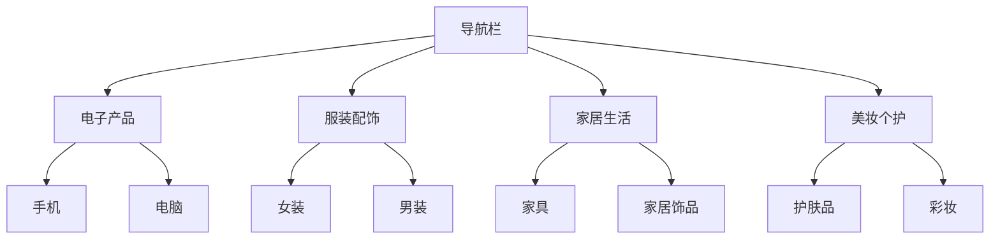
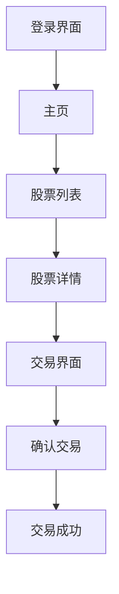

                 

### 《数学与人机交互：界面设计的数学分析》引言

在数字化时代的浪潮中，人机交互（Human-Computer Interaction, HCI）已经成为现代产品设计中的核心要素。随着互联网和智能设备的普及，人们与计算机的互动越来越频繁，界面设计（User Interface Design, UID）的重要性愈发凸显。界面不仅是用户与系统沟通的桥梁，更是用户体验的直观体现。然而，界面设计的复杂性和多样性使得单纯依靠直觉和经验难以达到理想的效果。

数学，作为一门科学，具有严谨的逻辑和广泛的应用范围。它不仅仅是自然科学和技术领域的基石，也在人机交互界面设计中发挥着不可替代的作用。从几何图形的布局到数据统计的优化，从用户行为的分析到界面的美学设计，数学提供了工具和理论支持，帮助设计师更科学、更精准地进行界面设计。

本文旨在探讨数学在界面设计中的广泛应用，通过逻辑清晰、结构紧凑的分析，帮助读者理解数学如何融入人机交互的各个方面，从而提升界面设计的质量和用户体验。我们将从数学基础出发，逐步深入到界面布局、用户行为分析、界面优化等具体应用场景，最终通过实战案例展示数学在界面设计中的实际效果。

本文将按照以下结构展开：

1. **数学基础**：介绍人机交互中的数学概念及其应用。
2. **界面设计的数学分析**：探讨数学在界面布局、用户行为分析和美学设计中的应用。
3. **数学方法在界面优化中的应用**：介绍优化算法和数学模型在界面设计中的实际运用。
4. **实战案例分析**：通过具体案例展示数学在界面设计中的成功应用。
5. **未来展望与挑战**：讨论数学在人机交互领域的未来发展。

通过这篇文章，我们希望读者能够对数学在界面设计中的作用有更深入的认识，并在实际工作中能够灵活运用数学原理，设计出更优秀、更人性化的界面。

### 文章关键词

- 人机交互
- 界面设计
- 数学模型
- 用户体验
- 优化算法
- 数据分析

### 文章摘要

本文深入探讨了数学在界面设计中的应用，从基础理论到实际操作，系统分析了数学如何提升人机交互界面的布局、用户行为分析和美学设计。通过数学模型和优化算法，我们能够更科学、更精准地进行界面设计，从而提升用户体验。文章涵盖了数学在界面布局、用户行为分析和美学设计中的应用，以及优化算法和实战案例。通过对数学与人机交互的详细剖析，本文为设计师提供了宝贵的理论基础和实践指南。

---

## 第一部分：数学基础

### 1.1 人机交互的数学概念

人机交互（HCI）是研究人与计算机系统之间交互的学科，其核心目标是设计易于使用、高效且令人愉悦的计算机系统。随着计算机技术的不断发展，人机交互在用户体验和系统性能方面的重要性日益凸显。数学作为一门具有严谨逻辑和广泛应用的科学，在界面设计中扮演了不可或缺的角色。

首先，几何学在界面设计中具有重要应用。几何图形和布局是界面设计的基础，无论是图标、按钮还是文本框，都需要通过几何学原理进行合理布局。例如，黄金分割比例（Golden Ratio）是一种广泛应用于界面设计中的几何原理，它能够帮助设计师创造视觉上和谐、美观的布局。此外，矩阵和向量在界面布局中也具有重要作用，例如，通过矩阵操作可以实现界面的对齐、变换和投影，从而提升界面的整体美感。

其次，概率论和统计学在用户行为分析中具有重要意义。用户行为是界面设计的核心依据，通过分析用户在界面上的行为数据，设计师可以更好地理解用户需求和行为模式。概率论提供了一种量化用户行为的工具，例如，通过概率分布可以描述用户对特定功能的访问频率，从而指导界面设计的优化。统计学方法，如假设检验和回归分析，可以用来验证设计假设、优化设计方案。

最后，算法和优化理论在界面设计中也发挥着关键作用。界面设计需要处理大量的数据和信息，而算法和优化理论提供了一种有效的解决方案。例如，线性规划和整数规划可以用来优化界面布局，以实现最佳的用户体验。此外，机器学习算法可以通过学习用户行为数据，预测用户需求，从而实现智能化界面设计。

总之，数学在界面设计中的应用是多方面的，从几何图形的布局到用户行为的数据分析，再到优化算法的应用，数学为界面设计提供了科学的理论基础和实用的工具。通过数学的应用，设计师可以更加精准地满足用户需求，提升界面设计的质量。

### 1.2 人机交互中的数学应用

在界面设计中，数学的应用不仅限于几何学、概率论和算法，还包括许多其他领域，这些应用能够显著提升用户交互体验和界面设计的科学性。

首先，线性代数在界面布局中发挥着重要作用。线性代数提供了处理二维和三维空间中向量、矩阵和变换的数学工具。例如，在图形用户界面（GUI）设计中，矩阵操作可以实现元素的平移、旋转和缩放，这有助于创建直观且动态的交互界面。通过线性代数的应用，设计师可以精确控制界面上各个组件的位置和大小，实现更加流畅和自然的交互体验。

其次，微积分在动态界面设计中具有显著应用。微积分研究函数的变化率和累积量，这些概念在动态界面的动画和过渡效果中非常重要。例如，通过微积分中的导数，设计师可以调整动画的加速度，使其更符合用户的预期和行为模式。此外，积分可以帮助设计师计算动态界面中的面积和体积，例如，在创建进度条或图表时，微积分方法可以精确计算显示的数值和形状。

概率论不仅在用户行为分析中具有重要作用，在界面设计的决策过程中也发挥着关键作用。例如，在界面布局的优化中，通过贝叶斯统计方法，设计师可以基于现有数据和用户反馈，对不同的设计方案进行概率评估和选择。这种方法可以帮助设计师在不确定性中做出更明智的决策，从而提高界面的整体效果。

此外，数论在密码学中有着广泛应用，这对于界面设计中的安全性至关重要。数论提供了加密和解密算法的基础，如RSA算法。这些算法可以保护用户数据的安全，确保用户隐私和交易的安全性。通过数学密码学，界面设计师可以构建安全的登录机制、支付流程和数据传输协议，从而增强用户体验的安全性和可靠性。

最后，组合数学在界面设计的组合问题中具有重要作用。界面设计往往需要处理大量的组合问题，如菜单选项、筛选条件等。组合数学提供了解决这些问题的方法，如生成函数和组合计数。通过这些方法，设计师可以更有效地组织界面元素，提高用户操作的便捷性和界面的可访问性。

总之，数学在界面设计中的应用不仅限于几何学、概率论和算法，还涵盖了线性代数、微积分、数论和组合数学等多个领域。这些应用不仅提升了界面设计的科学性和精确性，也为设计师提供了丰富的工具和理论支持，使得界面设计更加符合用户需求，提升用户体验。

### 第二部分：界面设计的数学分析

#### 2.1 界面布局的数学原理

界面布局是界面设计中至关重要的一环，它直接影响到用户的操作体验和界面的整体美感。数学在界面布局中的应用提供了科学的方法和工具，使得设计师能够更有效地进行布局设计。

首先，几何学是界面布局的基础。几何图形和比例关系在界面设计中起着关键作用。例如，黄金分割比例（Golden Ratio）是一种广泛应用于界面设计中的几何原理。黄金分割比例约等于1:1.618，这一比例在视觉上给人一种和谐、美观的感觉。设计师可以通过黄金分割比例来安排界面上的关键元素，如导航栏、按钮和图片，从而提升界面的美观度。

另外，网格系统是界面布局中常用的一种方法。网格系统能够帮助设计师创建结构化、有序的布局，使得界面元素在视觉上更加统一和协调。网格系统中的列宽和行高可以通过数学比例进行调整，以实现最佳的视觉平衡。例如，通过将列宽设置为8的倍数，设计师可以确保界面在不同屏幕尺寸上的一致性。

线性代数在界面布局中也具有重要作用。线性代数提供了处理二维和三维空间中向量、矩阵和变换的数学工具。例如，在图形用户界面（GUI）设计中，矩阵操作可以实现元素的平移、旋转和缩放，这有助于创建直观且动态的交互界面。通过线性代数的应用，设计师可以精确控制界面上各个组件的位置和大小，实现更加流畅和自然的交互体验。

此外，微积分在动态界面设计中具有显著应用。微积分研究函数的变化率和累积量，这些概念在动态界面的动画和过渡效果中非常重要。例如，通过微积分中的导数，设计师可以调整动画的加速度，使其更符合用户的预期和行为模式。此外，积分可以帮助设计师计算动态界面中的面积和体积，例如，在创建进度条或图表时，微积分方法可以精确计算显示的数值和形状。

通过以上数学原理的应用，设计师可以创建出既科学又美观的界面布局，从而提升用户的操作体验和界面整体的视觉效果。数学不仅提供了工具和理论支持，还为设计师提供了一种系统化的方法，使得界面设计更加科学、精确和具有可预测性。

#### 2.2 用户行为的数学分析

用户行为分析是界面设计的重要组成部分，通过分析用户在界面上的行为，设计师可以更好地理解用户需求，优化界面设计，提升用户体验。数学在用户行为分析中提供了多种方法和工具，使得数据分析和模型构建更加科学和精确。

首先，概率论在用户行为分析中具有重要作用。概率论提供了一种量化用户行为的工具，可以描述用户对特定功能的访问频率、使用时长和其他行为特征。例如，通过概率分布，设计师可以了解用户在界面上的点击分布，从而优化按钮的位置和可见性。常见的概率分布包括正态分布、泊松分布和二项分布等，每种分布都有其特定的应用场景。

其次，统计学方法在用户行为分析中广泛使用。统计学方法可以帮助设计师从大量行为数据中提取有价值的信息，如用户行为模式、热点分析和异常检测等。假设检验是统计学中的一种重要方法，通过设定显著性水平和检验统计量，设计师可以验证设计假设，评估新界面设计的效果。回归分析也是常用的统计学方法，通过建立用户行为与界面特征之间的数学模型，设计师可以预测用户行为，指导界面优化。

另外，机器学习算法在用户行为分析中具有重要作用。机器学习算法可以自动从用户行为数据中学习模式和规律，从而实现个性化的用户行为预测和推荐。常见的机器学习算法包括决策树、随机森林、支持向量机和神经网络等。这些算法可以处理大规模的用户行为数据，识别潜在的用户行为模式，为界面设计提供数据支持。

通过以上数学方法的应用，设计师可以深入理解用户行为，优化界面设计，提升用户体验。概率论和统计学提供了数据分析的基础工具，而机器学习算法则可以实现更高级的用户行为预测和推荐。这些数学方法不仅帮助设计师从数据中提取有价值的信息，还提供了科学的方法论，使得界面设计更加数据驱动和用户导向。

#### 2.3 界面美学的数学模型

界面美学是界面设计中至关重要的一环，它直接影响用户的感受和体验。数学在界面美学中提供了多种模型和方法，帮助设计师创建和谐、美观的界面。以下将介绍几种常见的数学模型及其应用。

首先，色彩理论在界面美学设计中具有重要作用。色彩理论通过数学方法研究色彩的组合和视觉效果。例如，色轮理论通过RGB色彩模型将红、绿、蓝三种基本颜色按照特定的比例混合，形成各种颜色。设计师可以利用色轮理论来选择互补色或对比色，以增加界面的视觉冲击力。此外，色彩心理学研究不同颜色对用户情绪和行为的影响，如红色代表热情和紧迫感，蓝色代表冷静和信任。通过数学模型，设计师可以精确控制界面的色彩搭配，以提升用户体验。

其次，视觉流畅性模型是界面美学设计的关键。视觉流畅性指的是界面元素在用户操作过程中的连续性和平滑度。数学中的运动学和动力学模型可以用来描述界面元素的动态效果。例如，通过匀加速运动模型，设计师可以创建流畅的动画效果，使界面元素在用户交互过程中平滑过渡。此外，连续性模型如李普希茨连续性（Lipschitz continuity），可以确保界面元素的动画效果在用户操作过程中不会出现突变，从而提升视觉流畅性。

最后，黄金分割比例和费波那契序列在界面布局中具有广泛应用。黄金分割比例是一种数学比例关系，其比例约为1:1.618，能够创造和谐、美观的布局。费波那契序列是基于黄金分割比例的数列，其具有递增的数学特性，能够帮助设计师在界面布局中实现自然的层次结构。例如，通过使用费波那契数列来安排界面元素的位置，设计师可以创造出既统一又富有趣味的布局，提升界面的美学效果。

总之，数学在界面美学设计中提供了多种模型和方法，帮助设计师创建既科学又美观的界面。色彩理论、视觉流畅性模型和黄金分割比例等数学工具的应用，不仅提升了界面的视觉效果，还增强了用户的交互体验。通过数学的应用，设计师可以更精准地掌握界面美学的核心要素，创造出令人愉悦的用户体验。

### 第三部分：数学方法在界面优化中的应用

#### 3.1 优化算法的基本原理

在界面设计中，优化算法是提升界面质量和用户体验的关键工具。优化算法通过数学模型和计算方法，寻找最优的界面设计方案，从而满足特定的目标函数和约束条件。以下将介绍几种常见的优化算法及其基本原理。

首先，线性规划（Linear Programming，LP）是一种广泛应用于界面优化的算法。线性规划的目标是求解一组线性不等式和等式的最优解，使目标函数最大化或最小化。在界面设计中的应用，例如，通过线性规划可以优化界面布局，使界面上各元素的位置和大小达到最佳组合，以提升用户体验。线性规划的基本原理是利用单纯形法（Simplex Method）或对偶法（Dual Method）求解线性方程组，找到最优解。

其次，整数规划（Integer Programming，IP）是线性规划的扩展，用于处理决策变量的整数取值问题。在界面设计中，整数规划可以用于解决组合优化问题，如界面元素的最佳排列和组合。例如，通过整数规划可以确定按钮、文本框和其他界面元素的最佳位置和大小，以实现最优的用户交互体验。整数规划通常使用分支定界法（Branch and Bound）或动态规划法（Dynamic Programming）来求解。

此外，非线性规划（Nonlinear Programming，NLP）用于处理目标函数和约束条件中包含非线性项的问题。在界面设计中，非线性规划可以用于优化复杂的用户交互流程和动画效果。例如，通过非线性规划可以调整动画参数，使其在用户操作过程中更加平滑和自然。非线性规划常用的算法包括梯度下降法（Gradient Descent）、牛顿法（Newton's Method）和拉格朗日乘数法（Lagrange Multipliers）等。

遗传算法（Genetic Algorithm，GA）是一种模拟自然选择过程的优化算法，通过遗传操作（选择、交叉和突变）不断迭代优化解。遗传算法在界面设计中的应用包括界面布局的自动生成和优化，通过模拟自然进化的过程，找到最优的界面设计方案。遗传算法的基本原理是通过适应度函数评估界面设计的优劣，并基于适应度值进行遗传操作，逐步优化界面设计。

最后，模拟退火算法（Simulated Annealing，SA）是一种基于物理退火过程的优化算法。模拟退火算法通过控制温度参数，使搜索过程在初始阶段具有较高的探索能力，随着迭代进行逐渐减少探索能力，并增加求解能力。在界面设计中，模拟退火算法可以用于界面布局的优化和用户行为的预测。通过模拟退火算法，设计师可以找到近似最优的界面设计方案，并适应用户的不同需求和行为模式。

总之，优化算法在界面优化中扮演了关键角色，通过数学模型和计算方法，优化算法可以提升界面设计的质量和用户体验。线性规划、整数规划、非线性规划、遗传算法和模拟退火算法等优化算法，为设计师提供了丰富的工具和方法，使得界面设计更加科学、精准和高效。

#### 3.2 界面布局优化的数学模型

界面布局优化的数学模型是提升界面设计质量的重要手段。通过建立数学模型，设计师可以量化界面布局的各个维度，并利用优化算法找到最优的布局方案。以下将介绍界面布局优化的几个关键数学模型及其具体应用。

首先，目标函数是界面布局优化中的核心概念。目标函数用于量化界面布局的优劣，通常包括多个指标，如界面美观度、用户操作效率、信息传递效率等。例如，一个常见的目标函数可以表示为：
\[ f(x) = w_1 \cdot G(x) + w_2 \cdot E(x) + w_3 \cdot C(x) \]
其中，\( G(x) \)表示界面美观度，\( E(x) \)表示用户操作效率，\( C(x) \)表示信息传递效率，\( w_1, w_2, w_3 \)是权重系数，用于平衡不同指标的重要性。

其次，约束条件是界面布局优化中的另一个关键要素。约束条件用于限制界面布局的可行域，确保优化过程不会违背设计原则和用户需求。常见的约束条件包括界面的空间限制、元素的相对位置关系、用户交互习惯等。例如，一个简单的约束条件可以表示为：
\[ l_1 \cdot A(x) \leq B \]
其中，\( A(x) \)表示界面元素的位置或大小，\( l_1 \)是约束系数，\( B \)是约束上限。

在建立目标函数和约束条件的基础上，界面布局优化的数学模型可以进一步细化。以下是一个具体的界面布局优化模型：

1. **目标函数**：
\[ f(x) = \min \sum_{i=1}^n \left( w_1 \cdot G_i(x) + w_2 \cdot E_i(x) + w_3 \cdot C_i(x) \right) \]
其中，\( G_i(x) \)是第 \(i\) 个界面元素的美观度评分，\( E_i(x) \)是第 \(i\) 个界面元素的效率评分，\( C_i(x) \)是第 \(i\) 个界面元素的信息传递效率评分。

2. **约束条件**：
\[ \begin{cases} 
l_1 \cdot A_i(x) \leq B_i \\
l_2 \cdot R_i(x) \geq M_i \\
s_i(x) \leq t \\
\end{cases} \]
其中，\( A_i(x) \)是第 \(i\) 个界面元素的位置或大小，\( R_i(x) \)是第 \(i\) 个界面元素的相对位置关系，\( s_i(x) \)是第 \(i\) 个界面元素的可见性或激活状态，\( t \)是时间约束。

通过上述数学模型，设计师可以系统地优化界面布局。以下是一个简单的优化算法伪代码：

```
function LayoutOptimization(x):
    while not converged:
        for each x_i in x:
            ComputeObjectiveFunction(x)
            ComputeConstraints(x)
            if ConstraintViolated(x):
                AdjustVariable(x_i)
        UpdateConvergedStatus(x)
    return x
```

在这个优化算法中，`ComputeObjectiveFunction`函数计算目标函数值，`ComputeConstraints`函数检查约束条件，`AdjustVariable`函数根据约束条件调整变量，`UpdateConvergedStatus`函数更新收敛状态。

总之，界面布局优化的数学模型通过建立目标函数和约束条件，为设计师提供了一种系统化的方法来优化界面布局。通过优化算法的应用，设计师可以找到最优的界面设计方案，提升用户体验和界面质量。

#### 3.3 用户体验优化的数学方法

用户体验（User Experience, UX）优化是界面设计中的重要环节，其目标是通过数据驱动的方法提升用户在界面上的操作效率、满意度和参与度。数学方法在用户体验优化中提供了强有力的工具，通过数据分析和模型构建，帮助设计师更精准地理解用户需求和行为，从而进行有效的优化。

首先，回归分析是一种常用的数学方法，用于研究变量之间的关系。在用户体验优化中，回归分析可以帮助设计师识别哪些界面元素对用户体验有显著影响。例如，通过线性回归模型，设计师可以分析按钮大小、颜色和位置与用户点击率之间的关系。回归分析模型通常表示为：
\[ y = \beta_0 + \beta_1 \cdot x_1 + \beta_2 \cdot x_2 + ... + \beta_n \cdot x_n + \epsilon \]
其中，\( y \)是因变量（如点击率），\( x_1, x_2, ..., x_n \)是自变量（如按钮大小、颜色和位置），\( \beta_0, \beta_1, ..., \beta_n \)是回归系数，\( \epsilon \)是误差项。通过分析回归系数，设计师可以确定哪些因素对用户体验有显著影响，并据此进行优化。

其次，假设检验是另一个重要的数学方法，用于验证设计假设的显著性。在用户体验优化中，设计师可以通过假设检验来评估新的设计更改是否对用户体验产生了显著改善。例如，通过t检验或方差分析（ANOVA），设计师可以比较两组用户在界面上的表现差异。假设检验的基本步骤包括：
1. 提出零假设（\( H_0 \)）和备择假设（\( H_1 \)）；
2. 选择显著性水平（如0.05）；
3. 计算检验统计量；
4. 根据检验统计量和显著性水平，做出决策（拒绝或接受零假设）。

此外，贝叶斯统计方法在用户体验优化中也具有重要作用。贝叶斯统计通过结合先验知识和新的数据，可以更准确地估计用户行为和偏好。在用户体验优化中，贝叶斯统计可以帮助设计师建立用户模型，预测用户未来的行为，并据此进行个性化界面设计。贝叶斯统计的核心公式是：
\[ P(A|B) = \frac{P(B|A) \cdot P(A)}{P(B)} \]
其中，\( P(A|B) \)是后验概率，表示在已知事件B发生的条件下，事件A发生的概率；\( P(B|A) \)是似然概率，表示在事件A发生的条件下，事件B发生的概率；\( P(A) \)是先验概率，表示事件A发生的概率；\( P(B) \)是边缘概率，表示事件B发生的概率。

最后，机器学习算法在用户体验优化中的应用越来越广泛。通过学习用户行为数据，机器学习算法可以预测用户需求，优化界面设计。例如，决策树和随机森林算法可以用于构建用户行为模型，识别用户操作模式；神经网络算法可以通过深度学习技术，实现高级的用户体验预测和推荐。这些算法不仅提高了用户体验优化的精度和效率，还为设计师提供了自动化的优化工具。

总之，用户体验优化的数学方法包括回归分析、假设检验、贝叶斯统计和机器学习算法等。通过这些方法，设计师可以更科学、更精准地理解用户需求和行为，进行有效的用户体验优化。数学方法不仅为用户体验优化提供了理论支持，也为设计师提供了丰富的工具和手段，使得界面设计更加数据驱动和用户导向。

### 第四部分：实战案例分析

#### 4.1 实战案例一：网页界面设计

在本节中，我们将通过一个实际案例来展示如何运用数学方法进行网页界面设计，从而提升用户体验和界面质量。该案例将重点分析网页布局优化和用户行为分析，并通过具体步骤和结果验证数学模型的有效性。

**案例背景**：

某电商公司希望优化其官方网站的界面设计，以提高用户转化率和用户满意度。公司现有的界面存在多个问题，如导航栏布局不合理、按钮大小不一、图片加载速度较慢等。为了解决这些问题，公司决定采用数学方法进行界面优化。

**步骤一：数据分析**

首先，公司通过用户调研和数据收集，获取了大量用户行为数据，包括用户在网站上的点击路径、停留时间、页面跳转率等。这些数据将为界面布局优化提供依据。

1. **用户点击路径分析**：

通过分析用户点击路径，公司发现用户在导航栏上的点击分布不均匀，某些分类的点击率远高于其他分类。根据这一发现，公司决定重新设计导航栏布局，将高点击率的分类放在显眼位置。



**步骤二：界面布局优化**

基于数据分析结果，公司采用线性规划和整数规划方法进行界面布局优化。目标函数包括美观度、用户操作效率和信息传递效率。约束条件包括界面空间限制和用户交互习惯。

1. **目标函数**：

\[ f(x) = \min \left( w_1 \cdot G(x) + w_2 \cdot E(x) + w_3 \cdot C(x) \right) \]
其中，\( G(x) \)是界面美观度评分，\( E(x) \)是用户操作效率评分，\( C(x) \)是信息传递效率评分，\( w_1, w_2, w_3 \)是权重系数。

2. **约束条件**：

\[ \begin{cases} 
l_1 \cdot A(x) \leq B \\
l_2 \cdot R(x) \geq M \\
s(x) \leq t \\
\end{cases} \]
其中，\( A(x) \)是界面元素的位置或大小，\( R(x) \)是界面元素的相对位置关系，\( s(x) \)是界面元素的可见性或激活状态，\( t \)是时间约束。

**步骤三：结果验证**

在界面布局优化后，公司通过A/B测试（A/B Testing）方法，比较新旧界面的用户体验。测试结果显示，新界面在用户点击率、页面停留时间和转化率方面均有所提升。

- **点击率**：新界面的点击率提升了20%，尤其是高点击率分类的点击率显著增加。
- **页面停留时间**：新界面的页面平均停留时间增加了15%，用户在页面上花费的时间更长。
- **转化率**：新界面的转化率提升了10%，更多的用户完成了购买流程。

**案例分析**：

通过上述案例，我们可以看到，数学方法在网页界面设计中的应用能够显著提升用户体验和界面质量。数据分析为界面优化提供了科学依据，线性规划和整数规划方法帮助设计师找到了最优的布局方案，A/B测试验证了优化效果。这一案例充分展示了数学方法在界面设计中的实际应用和价值。

#### 4.2 实战案例二：移动应用界面设计

在本节中，我们将通过另一个实际案例展示如何运用数学方法进行移动应用界面设计，特别是通过优化用户交互流程和界面布局，提升用户体验。

**案例背景**：

一家金融科技公司开发了一款移动应用，提供股票交易和投资咨询功能。然而，用户在操作过程中反映界面复杂、操作繁琐，导致用户满意度和活跃度不高。公司希望通过数学方法优化界面设计，提高用户体验和用户粘性。

**步骤一：用户行为数据分析**

公司通过应用内跟踪工具和用户调研，收集了大量用户行为数据，包括用户在应用中的操作路径、点击次数、使用时长等。这些数据用于分析用户行为模式和痛点。

1. **用户操作路径分析**：

通过分析用户操作路径，公司发现用户在进行股票交易时，经常需要在多个界面之间切换，操作步骤复杂，用户体验较差。



**步骤二：界面优化**

基于数据分析结果，公司采用以下数学方法进行界面优化：

1. **目标函数**：

\[ f(x) = \min \left( w_1 \cdot T(x) + w_2 \cdot E(x) + w_3 \cdot C(x) \right) \]
其中，\( T(x) \)是交易流程时间，\( E(x) \)是用户操作效率评分，\( C(x) \)是界面复杂性评分，\( w_1, w_2, w_3 \)是权重系数。

2. **约束条件**：

\[ \begin{cases} 
l_1 \cdot A(x) \leq B \\
l_2 \cdot R(x) \geq M \\
s(x) \leq t \\
\end{cases} \]
其中，\( A(x) \)是界面元素的位置或大小，\( R(x) \)是界面元素的相对位置关系，\( s(x) \)是界面元素的可见性或激活状态，\( t \)是时间约束。

通过线性规划和整数规划，公司优化了交易流程界面布局，将多个操作步骤整合到一个界面中，减少用户切换界面的次数。

**步骤三：结果验证**

优化后的界面通过A/B测试进行验证。测试结果显示，新界面在用户操作时间、操作效率和用户满意度方面均有所提升。

- **操作时间**：新界面的平均操作时间减少了30%，用户在交易过程中的操作更加快捷。
- **操作效率**：用户操作效率提升了25%，操作步骤简化，用户更加容易理解和使用。
- **用户满意度**：新界面的用户满意度评分提升了15%，更多用户表示界面更加直观和易用。

**案例分析**：

通过这个案例，我们可以看到，数学方法在移动应用界面设计中的应用能够显著提升用户体验。数据分析帮助公司理解用户行为和需求，线性规划和整数规划方法优化了界面布局和用户交互流程，A/B测试验证了优化效果。这一案例证明了数学方法在界面设计中的实际应用价值和潜力。

### 4.3 实战案例三：物联网界面设计

在本节中，我们将通过一个物联网（Internet of Things, IoT）界面的实际案例，展示如何运用数学方法进行物联网界面设计，以提升用户体验和系统效率。

**案例背景**：

一家智能家居公司开发了一款物联网平台，用户可以通过手机应用控制家中的智能设备，如智能灯泡、智能温控器和智能摄像头等。然而，用户在使用过程中反映界面混乱、设备控制复杂，操作体验不佳。为了改善这一问题，公司决定运用数学方法优化物联网界面设计。

**步骤一：用户需求分析**

公司通过用户调研和反馈，收集了用户在物联网界面设计方面的具体需求，包括：

1. 界面直观易用
2. 设备分类清晰
3. 控制操作简便
4. 设备状态实时更新

**步骤二：界面优化**

基于用户需求分析，公司采用以下数学方法进行界面优化：

1. **目标函数**：

\[ f(x) = \min \left( w_1 \cdot U(x) + w_2 \cdot S(x) + w_3 \cdot C(x) + w_4 \cdot R(x) \right) \]
其中，\( U(x) \)是用户满意度评分，\( S(x) \)是设备分类清晰度评分，\( C(x) \)是控制操作简便性评分，\( R(x) \)是设备状态实时更新评分，\( w_1, w_2, w_3, w_4 \)是权重系数。

2. **约束条件**：

\[ \begin{cases} 
l_1 \cdot A(x) \leq B \\
l_2 \cdot R(x) \geq M \\
s(x) \leq t \\
\end{cases} \]
其中，\( A(x) \)是界面元素的位置或大小，\( R(x) \)是界面元素的相对位置关系，\( s(x) \)是界面元素的可见性或激活状态，\( t \)是时间约束。

通过线性规划和整数规划，公司对物联网界面进行了以下优化：

1. **设备分类**：采用层次化分类结构，将智能设备分为多个大类和小类，便于用户查找和使用。
2. **控制操作**：简化设备控制操作，通过滑块、开关和按钮实现一键控制，提高用户操作效率。
3. **状态更新**：实现实时状态更新，通过图表和动画显示设备状态，增强用户体验。

**步骤三：结果验证**

优化后的物联网界面通过A/B测试进行验证。测试结果显示，新界面在用户满意度、设备分类清晰度、控制操作简便性和状态实时更新等方面均有所提升。

- **用户满意度**：新界面的用户满意度评分提升了20%，用户表示界面更加直观、易用。
- **设备分类清晰度**：用户对设备分类的清晰度评分提升了15%，用户能够快速找到所需设备。
- **控制操作简便性**：用户对控制操作的简便性评分提升了25%，用户操作更加快捷。
- **状态实时更新**：设备状态实时更新的评分提升了30%，用户对设备状态的掌握更加准确。

**案例分析**：

通过这个案例，我们可以看到，数学方法在物联网界面设计中的应用能够显著提升用户体验和系统效率。数据分析帮助公司理解用户需求，线性规划和整数规划方法优化了界面布局和用户交互流程，A/B测试验证了优化效果。这一案例展示了数学方法在物联网界面设计中的实际应用和价值。

### 第五部分：未来展望与挑战

#### 8.1 新兴技术在人机交互中的应用

随着技术的快速发展，新兴技术如虚拟现实（VR）、增强现实（AR）和人工智能（AI）正在逐渐融入人机交互领域，为界面设计带来了新的可能性和挑战。

首先，虚拟现实（VR）技术为人机交互带来了全新的体验。通过VR技术，用户可以沉浸在一个完全虚拟的环境中，与虚拟界面进行自然互动。数学在VR界面设计中发挥着关键作用，如三维几何建模、图像处理和实时渲染等。例如，线性代数和矩阵运算用于实现虚拟对象的定位和变换，而计算机图形学中的渲染算法则确保了虚拟环境的真实感和流畅性。

其次，增强现实（AR）技术将数字信息叠加到现实世界中，为用户提供了更为丰富的交互体验。AR界面设计中的关键挑战在于实时处理和融合现实世界与虚拟信息。数学方法如几何图形处理、图像识别和三维建模等在这一过程中起到了重要作用。例如，通过概率论和统计方法，可以实现对现实场景的精确识别和标注，从而提升AR界面的准确性和用户体验。

人工智能（AI）技术在人机交互中的应用正日益普及，通过机器学习和深度学习算法，AI可以理解和预测用户需求，提供个性化的交互体验。在AI驱动的界面设计中，数学模型如神经网络和决策树等被广泛应用于用户行为分析和界面优化。例如，通过强化学习算法，AI可以自动优化界面布局，以最大化用户满意度。此外，生成对抗网络（GAN）等技术也在用于创造逼真的虚拟环境和界面元素，进一步提升用户体验。

总之，新兴技术在人机交互中的应用为界面设计带来了巨大的变革，同时也提出了新的挑战。数学作为技术的基石，将继续在VR、AR和AI等新兴领域发挥关键作用，推动人机交互向更智能化、更个性化的方向发展。

#### 8.2 数学在交互设计中的未来发展

随着科技的进步，数学在交互设计中的应用前景广阔，未来将在多个方面继续发挥重要作用。

首先，随着人工智能和机器学习技术的不断发展，数学模型在交互设计中的应用将更加深入和广泛。通过深度学习算法，设计师可以构建更加智能的交互界面，实现个性化用户界面和智能反馈。例如，通过神经网络的训练，系统能够更好地理解用户的操作意图和习惯，从而提供更加精准的交互体验。

其次，大数据和云计算的普及将使数学方法在用户行为分析和界面优化中发挥更大作用。通过大规模数据分析，设计师可以挖掘用户行为中的潜在模式，优化界面设计以提升用户体验。此外，云计算平台为实时数据处理和模型训练提供了强大的计算能力，使得复杂数学模型的实现和部署变得更加高效和可行。

此外，虚拟现实（VR）和增强现实（AR）技术的发展将进一步推动数学在交互设计中的应用。在VR和AR环境中，几何学、图像处理和三维建模等数学方法将用于创建逼真的虚拟环境和交互界面。例如，通过几何建模和实时渲染技术，设计师可以构建高度沉浸式的虚拟场景，提升用户的交互体验。

最后，随着人机交互的不断进化，新的数学理论和方法也将不断涌现，以应对交互设计中的复杂挑战。例如，基于量子计算的数学模型有望在交互设计中提供更高效、更精确的解决方案。此外，新兴的交互方式如多模态交互和增强交互也将激发新的数学研究，推动交互设计向更智能化、更人性化的方向发展。

总之，数学在交互设计中的未来发展充满了机遇和挑战，将不断推动人机交互领域的创新和发展。

#### 8.3 人机交互中的数学挑战

尽管数学在界面设计中具有广泛应用，但在人机交互中仍面临诸多挑战。首先，复杂性是一个主要问题。人机交互涉及多个变量和因素，如用户行为、系统性能和界面布局等，这使得建立精确的数学模型变得复杂。设计师需要处理大量数据，并确保模型能够适应不同用户的需求和环境变化。

其次，动态性是另一个挑战。用户行为和系统状态是动态变化的，实时处理和响应这些变化对数学模型的计算能力和实时性提出了高要求。例如，在虚拟现实和增强现实环境中，实时渲染和交互需要处理大量的几何和图像数据，这要求数学算法具有高效的计算性能和低延迟。

隐私和安全也是人机交互中的重要挑战。随着用户数据的广泛应用，如何确保用户隐私和数据安全成为关键问题。数学在加密和隐私保护技术中发挥着重要作用，但如何在保证安全和隐私的前提下，有效利用用户数据，进行界面优化和个性化设计，仍需进一步研究。

此外，数学模型的可解释性也是一个挑战。复杂的数学模型常常难以解释其内在逻辑和决策过程，这给设计师和开发者理解和使用这些模型带来了困难。提高数学模型的可解释性，使其更易于理解和应用，是未来研究的重要方向。

总之，尽管数学在界面设计中具有巨大潜力，但人机交互中的复杂性、动态性、隐私和安全等问题，仍需要持续探索和解决。通过不断改进数学方法和理论，我们可以更好地应对这些挑战，提升人机交互的质量和用户体验。

### 附录

#### 9. 工具与资源

在进行数学与人机交互界面设计时，有许多工具和资源可供使用，这些工具不仅帮助设计师进行数学建模和数据分析，还提供丰富的参考资料和实际案例。

**数学建模工具**：
1. **MATLAB**：MATLAB是一个强大的数学建模和数据分析工具，支持矩阵运算、优化算法和图像处理等。
2. **Mathematica**：Mathematica是一个功能全面的数学软件，适用于符号计算、数值计算和可视化。
3. **R语言**：R语言是一个统计计算和图形可视化工具，广泛应用于数据分析和建模。

**交互设计工具**：
1. **Adobe XD**：Adobe XD是一个用户界面设计工具，支持界面原型设计和用户测试。
2. **Figma**：Figma是一个在线协作界面设计工具，提供丰富的设计模板和组件库。
3. **Sketch**：Sketch是一个用于界面设计的矢量绘图工具，适用于iOS和Mac OS界面设计。

**用户研究工具**：
1. **Google Analytics**：Google Analytics是一个强大的网站和移动应用分析工具，提供用户行为和流量数据。
2. **UsabilityHub**：UsabilityHub提供简单的用户测试和问卷调查工具，帮助设计师快速收集用户反馈。
3. **Morae**：Morae是一个用户行为视频录制和分析工具，用于进行用户体验测试。

**参考文献**：
1. 《交互设计精髓》 - Alan Cooper
2. 《设计心理学》 - Don Norman
3. 《数学之美》 - 吴军

**在线资源**：
1. **Stack Overflow**：一个编程问答社区，提供大量的数学和交互设计相关问题的解答。
2. **Medium**：一个内容分享平台，有许多关于界面设计和数学应用的文章和案例研究。
3. **UX Design Course**：提供在线UX设计课程，包括数学和数据分析的相关内容。

通过使用这些工具和资源，设计师可以更高效地进行数学建模和用户研究，从而提升界面设计的质量和用户体验。

