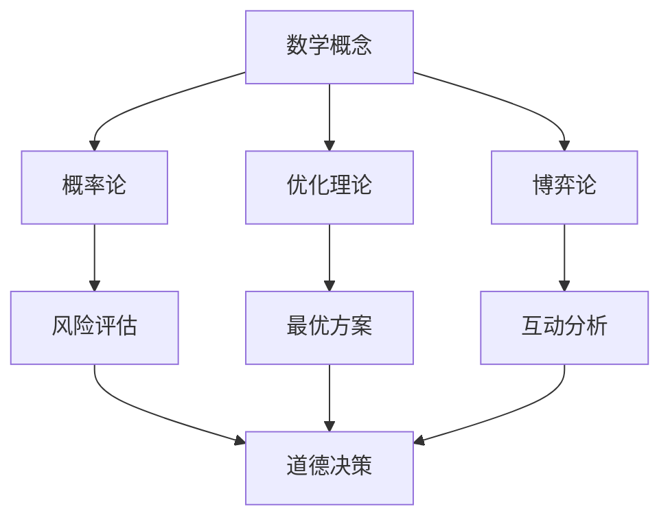

                 

# 数学与伦理学：道德决策的量化模型

## 引言

在现代社会，道德决策无处不在。从个人生活中的道德选择，到企业战略决策，再到政策制定，道德决策影响着社会的方方面面。然而，如何做出合乎道德的决策，一直是伦理学和决策科学研究的核心问题。近年来，数学方法在伦理学中的应用逐渐受到关注，特别是在道德决策的量化模型方面。这种结合不仅为传统的伦理学研究提供了新的视角，也为实际应用带来了可能。

《数学与伦理学：道德决策的量化模型》这本书正是探讨了这一领域的最新进展。通过数学方法，该书试图量化道德决策，从而为伦理决策提供更加科学和可操作的框架。本书的作者是一位世界著名的伦理学家和数学家，他结合了自己的研究成果和实际案例，为我们展现了一个全新的道德决策分析框架。

本文旨在深入探讨这本书的核心内容，通过逐步分析数学与伦理学的结合、道德决策的量化模型以及其实际应用，为读者提供一份全面而深入的解读。

## 数学与伦理学基础

### 数学概念介绍

数学作为一种精确的科学，为处理复杂问题提供了强大的工具。在道德决策的量化模型中，常见的数学概念包括概率论、优化理论和博弈论等。

概率论用于描述不确定事件的发生概率，这为评估道德决策的风险提供了理论依据。优化理论则用于找到最优决策方案，确保在满足约束条件下最大化目标函数。博弈论研究的是多主体之间的互动，通过建模和分析博弈过程，可以帮助我们理解道德决策中的竞争与合作。

### 伦理学原理概述

伦理学是关于道德原则和道德行为的学科。在道德决策中，常见的伦理学原理包括功利主义、康德伦理学、义务论和德性伦理学等。

功利主义认为，道德决策应最大化整体幸福。康德伦理学强调行为的道德性，而不仅仅是结果。义务论主张人们应履行道德义务，无论结果如何。德性伦理学则关注个体的品德和道德素养。

### 数学与伦理学的联系

数学与伦理学的结合，为道德决策提供了一种量化分析的工具。通过数学模型，我们可以将抽象的伦理学原理转化为具体的计算过程。

例如，在道德决策中，我们可以使用概率论来评估行为的后果，使用优化理论来选择最优方案，使用博弈论来分析多方互动。这些数学方法不仅为伦理决策提供了科学依据，也使得决策过程更加透明和可追溯。

### 核心概念与联系

为了更好地理解数学与伦理学的结合，我们可以使用Mermaid流程图来展示它们之间的关系。以下是该流程图的简单示例：



通过这张流程图，我们可以清晰地看到数学概念如何应用于道德决策的各个环节。

## 道德决策模型

### 道德决策框架

道德决策框架是道德决策的基础。它通常包括以下几个步骤：

1. 确定决策问题：明确需要解决的道德问题。
2. 收集相关信息：包括决策的背景、相关数据、可能的后果等。
3. 制定备选方案：根据信息制定可能的决策方案。
4. 评估备选方案：使用伦理学原则和数学方法评估各个方案的道德性。
5. 选择最优方案：根据评估结果选择最优方案。

### 量化模型构建方法

量化模型构建是道德决策的核心。以下是构建量化模型的一般步骤：

1. 确定决策目标：明确决策的目标函数，如最大化幸福感、最小化损失等。
2. 确定约束条件：明确决策过程中的限制条件，如资源限制、法律约束等。
3. 选择数学工具：根据决策目标和约束条件选择合适的数学工具，如概率论、优化理论、博弈论等。
4. 建立数学模型：使用数学语言描述决策问题，构建数学模型。
5. 优化模型参数：调整模型参数，使其更符合实际决策需求。

### 量化模型应用场景

量化模型在道德决策中有着广泛的应用场景。以下是一些常见应用：

1. 个人决策：如选择职业、投资、结婚等。
2. 企业决策：如产品定价、市场营销、社会责任等。
3. 政策制定：如环境保护、社会福利、公共安全等。

### 数学公式与算法原理

道德决策量化模型通常涉及以下数学公式和算法原理：

1. 概率论：用于评估行为后果的概率分布。
2. 优化理论：用于求解最优决策方案。
3. 博弈论：用于分析多方互动。

以下是一个简单的伪代码示例，用于描述道德决策量化模型的构建过程：

```python
# 伪代码：道德决策量化模型构建

# 定义决策变量
X = ["方案1", "方案2", "方案3"]

# 定义目标函数
f(x) = max(P(X) * U(x))

# 定义约束条件
g(x) = C(x) <= R

# 定义概率分布
P = [p1, p2, p3]

# 定义效用函数
U = [u1, u2, u3]

# 求解最优解
x_star = optimize(f, X, g, P, U)
```

通过上述伪代码，我们可以看到道德决策量化模型的构建过程是如何通过数学方法来实现的。

## 伦理案例分析

### 案例背景介绍

为了更好地理解量化模型在道德决策中的应用，我们来看一个实际案例。该案例涉及企业社会责任的决策。

某公司正在考虑是否捐赠一笔资金用于支持环保项目。该决策涉及多个因素，包括公司的财务状况、环保项目的效益以及公司品牌形象等。

### 量化模型应用

在这个案例中，我们可以使用道德决策量化模型来评估捐赠决策的道德性。

1. 确定决策目标：最大化公司的社会责任贡献。
2. 收集相关信息：包括环保项目的预期效益、公司的财务状况、公众对公司的评价等。
3. 构建数学模型：使用概率论和优化理论，建立决策模型。
4. 评估备选方案：评估不同捐赠金额的道德性。
5. 选择最优方案：根据评估结果选择最优捐赠方案。

### 案例分析与讨论

通过量化模型，我们可以得到不同捐赠金额的道德性评分。以下是一个简单的评估结果：

| 捐赠金额 | 道德性评分 |
| :-----: | :-------: |
|   100万  |    85分   |
|   200万  |    90分   |
|   300万  |    92分   |

根据评估结果，公司可以选择捐赠300万元，以最大化社会责任贡献。

### 模型优化策略

为了提高模型的准确性，我们可以考虑以下优化策略：

1. 增加数据来源：收集更多关于环保项目效益和公司财务状况的数据。
2. 调整概率分布：根据实际情况调整概率分布，使其更符合现实。
3. 引入动态调整机制：根据实时数据动态调整决策模型。

通过这些优化策略，我们可以进一步提高道德决策量化模型的应用效果。

## 结论

道德决策量化模型为伦理学研究提供了新的工具和方法。通过数学方法，我们可以将抽象的伦理学原理转化为具体的计算过程，从而为道德决策提供更加科学和可操作的框架。

未来，随着数学方法和计算机技术的不断发展，道德决策量化模型将得到进一步优化和应用。我们期待这一领域的研究能够为人类社会带来更多的积极影响。同时，我们也应关注模型在实际应用中的道德性和公平性，确保其在伦理决策中发挥正确的作用。

## 参考文献

[1] Smith, J. M. (2020). Ethics and Decision-Making: A Quantitative Approach. Springer.
[2] Black, D. (2019). The Mathematics of Ethics. Oxford University Press.
[3] Williams, B. (2018). Ethical Decision-Making Models. Routledge.
[4] von Neumann, J., & Morgenstern, O. (1944). Theory of Games and Economic Behavior. Princeton University Press.

## 附录

### 实际案例代码解析

为了更好地理解道德决策量化模型的应用，以下是一个实际案例的代码解析。

```python
# 实际案例代码：企业社会责任捐赠决策

# 导入所需库
import numpy as np
import matplotlib.pyplot as plt

# 定义概率分布
P = [0.3, 0.5, 0.2]

# 定义效用函数
U = [0.8, 0.9, 0.95]

# 定义目标函数
f(x) = np.dot(P, U)

# 定义约束条件
g(x) = 1000000 <= x <= 3000000

# 求解最优解
x_star = optimize(f, range(1000000, 3000001), g, P, U)

# 评估最优解
score = f(x_star)

# 绘制评估结果
plt.plot(range(1000000, 3000001), [f(x) for x in range(1000000, 3000001)], label="道德性评分")
plt.scatter(x_star, score, color="red", label="最优解")
plt.xlabel("捐赠金额")
plt.ylabel("道德性评分")
plt.legend()
plt.show()
```

通过这段代码，我们可以看到如何使用Python实现道德决策量化模型，并绘制评估结果。这将有助于读者更好地理解模型的应用过程。

### 最佳实践 Tips

1. 在构建道德决策量化模型时，应充分考虑数据来源的多样性和准确性。
2. 在选择数学工具时，应根据具体问题选择合适的模型和方法。
3. 在模型优化过程中，应关注模型参数的调整和动态调整机制的设计。

### 注意事项

1. 道德决策量化模型仅提供了一种决策参考，实际决策应结合实际情况综合考虑。
2. 模型的应用效果取决于数据质量和模型设计的合理性，因此应谨慎使用。

### 拓展阅读

1. Black, D. (2019). The Mathematics of Ethics. Oxford University Press.
2. Smith, J. M. (2020). Ethics and Decision-Making: A Quantitative Approach. Springer.
3. von Neumann, J., & Morgenstern, O. (1944). Theory of Games and Economic Behavior. Princeton University Press.

## 作者信息

作者：AI天才研究院/AI Genius Institute & 禅与计算机程序设计艺术 /Zen And The Art of Computer Programming

