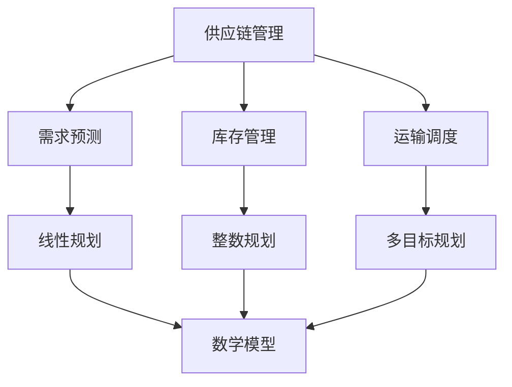
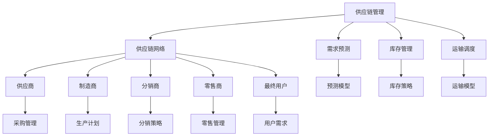
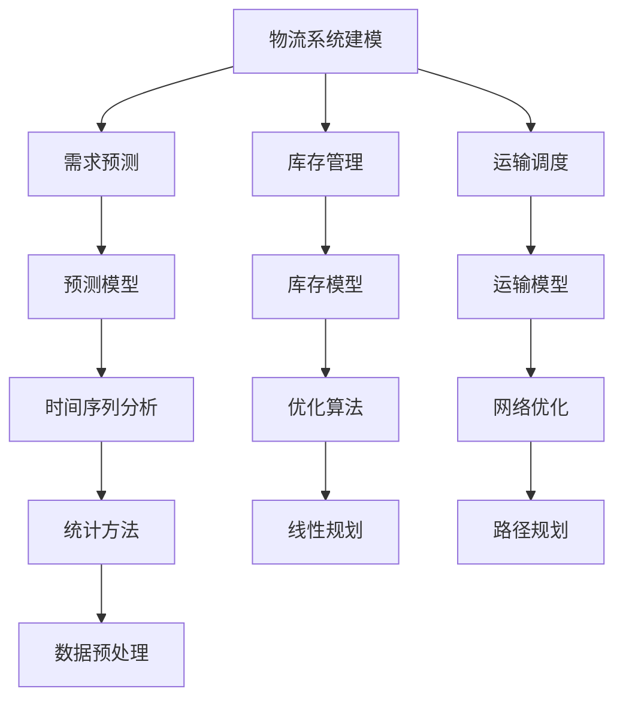
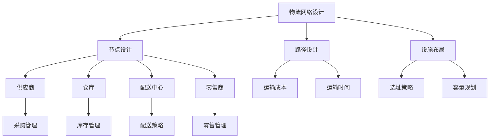
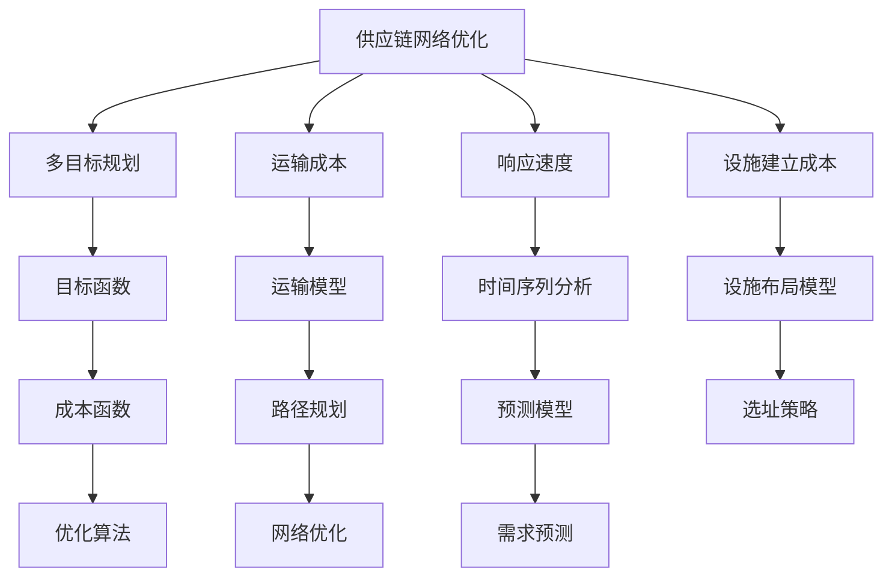
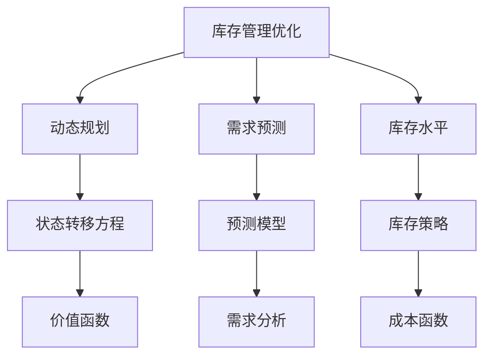
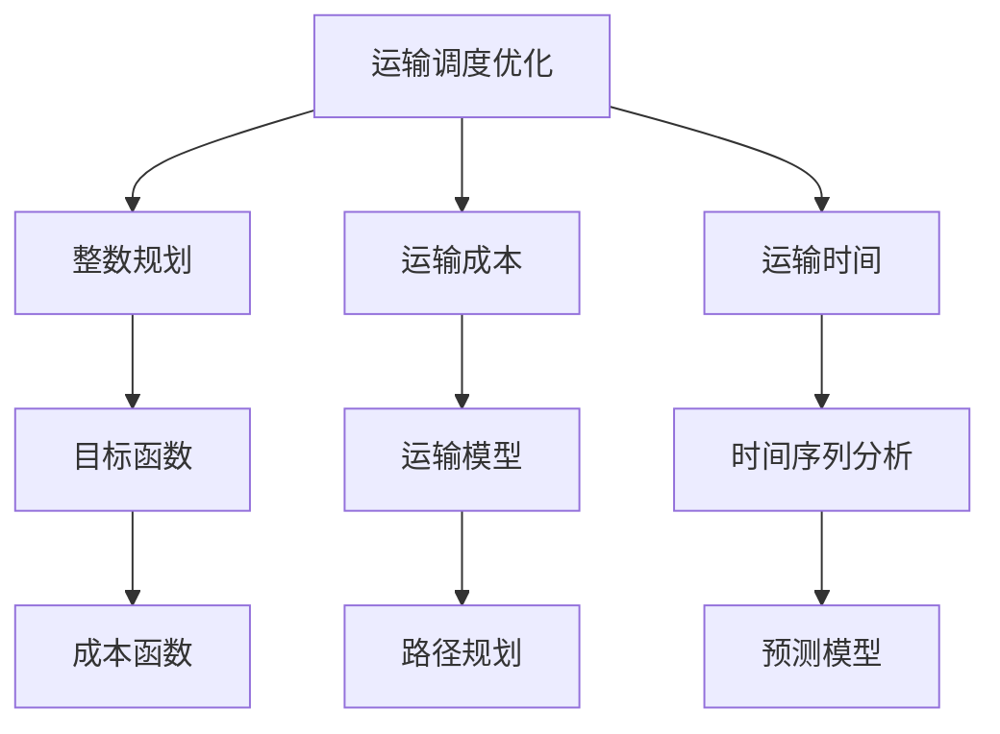

                 


### 第1章：引言与概述

### 1.1 数学在供应链管理中的作用

供应链管理是现代企业运营的核心，它涉及到从原材料采购到产品交付给最终用户的整个过程。数学在供应链管理中发挥着至关重要的作用，通过精确的预测、优化和决策，能够显著提高企业的运营效率和竞争力。

**核心概念与联系**

为了更好地理解数学在供应链管理中的应用，我们可以通过一个Mermaid流程图来展示核心概念及其相互联系。



- **需求预测**：是供应链管理的起点，通过分析历史数据和当前市场状况，预测未来产品的需求量。
- **库存管理**：涉及如何根据需求预测来制定库存策略，以确保供应与需求的匹配。
- **运输调度**：则是关于如何优化运输路线、车辆调度和运输时间，以减少成本和提高效率。

### 数学模型和数学公式

在物流优化中，常用的数学模型包括线性规划、整数规划和多目标规划。以下是一些基本的数学模型和相关的公式：

- **需求预测模型**：
  $$ \text{需求预测} = f(\text{历史数据}, \text{市场因素}) $$
  其中，$f$ 代表一个预测函数，它可能包括多项式、指数平滑等。

- **线性规划模型**：
  $$ \text{minimize} \ c^T x $$
  $$ \text{subject to} \ Ax \leq b $$
  $$ x \geq 0 $$
  其中，$c$ 是目标函数系数向量，$x$ 是决策变量向量，$A$ 和 $b$ 分别是约束条件矩阵和向量。

- **整数规划模型**：
  $$ \text{minimize} \ c^T x $$
  $$ \text{subject to} \ Ax \leq b $$
  $$ x \in \{0, 1\} $$
  其中，$x$ 是0-1变量的集合。

- **多目标规划模型**：
  $$ \text{minimize} \ f_1(x), f_2(x), ..., f_n(x) $$
  $$ \text{subject to} \ g_1(x) \leq 0, g_2(x) \leq 0, ..., g_m(x) \leq 0 $$
  $$ h_1(x) = 0, h_2(x) = 0, ..., h_p(x) = 0 $$
  其中，$f_1, f_2, ..., f_n$ 是目标函数，$g_1, g_2, ..., g_m$ 是不等式约束，$h_1, h_2, ..., h_p$ 是等式约束。

### 项目实战

**案例：使用线性规划优化库存管理**

假设某公司需要决定未来的库存水平，以满足未来三个月的需求。需求量是随机的，但可以通过历史数据和季节性因素来预测。我们可以使用线性规划模型来确定最优的库存策略。

**步骤 1：数据收集**

收集过去三个月的需求数据，以及季节性因素（如促销活动、节假日等）。

**步骤 2：建立模型**

目标函数是最小化库存成本，即存储成本加上缺货成本。

$$ \text{minimize} \ z = c_s \cdot S + c_u \cdot U $$

其中，$c_s$ 是单位存储成本，$c_u$ 是单位缺货成本，$S$ 是期末库存，$U$ 是缺货量。

约束条件包括需求约束和供应约束：

$$ D_t - S_t + I_t = S_{t+1} $$
$$ S_t \geq 0 $$
$$ U_t \geq 0 $$
$$ I_t \geq 0 $$

其中，$D_t$ 是第$t$个月的需求量，$S_t$ 是第$t$个月末的库存量，$I_t$ 是第$t$个月的进货量。

**步骤 3：求解模型**

使用线性规划求解器（如CPLEX、Gurobi等）求解最优库存策略。

**步骤 4：结果分析**

根据求解结果，确定每个时期的库存水平和进货量，以最小化总成本。

### 小结

本节介绍了数学在供应链管理中的应用，包括需求预测、库存管理和运输调度等核心概念。通过Mermaid流程图和数学公式，我们了解了不同类型数学模型的基本原理。案例实战部分则展示了如何将线性规划应用于实际库存管理问题，为后续章节的深入探讨奠定了基础。

### 1.2 物流优化的意义

物流优化在供应链管理中具有极其重要的意义。它不仅能够显著降低运营成本，还能提高供应链的灵活性和响应速度，从而增强企业的竞争力。

**核心算法原理讲解**

物流优化的核心算法包括但不限于线性规划、整数规划和多目标规划。以下是这些算法的基本原理和求解过程：

- **线性规划**：

  线性规划（Linear Programming，LP）是一种用于求解线性目标函数在给定线性约束条件下的最优解的方法。

  **目标函数**：

  $$ \text{minimize} \ c^T x $$

  其中，$c$ 是目标函数系数向量，$x$ 是决策变量向量。

  **约束条件**：

  $$ Ax \leq b $$

  $$ x \geq 0 $$

  其中，$A$ 和 $b$ 分别是约束条件矩阵和向量。

  **求解算法**：

  常见的线性规划求解算法包括单纯形法（Simplex Method）和对偶单纯形法（Dual Simplex Method）。以下是单纯形法的基本步骤：

  1. 初始化基本可行解。
  2. 选择离目标函数最远的变量作为进入变量。
  3. 选择离开基变量。
  4. 更新基本可行解。
  5. 重复步骤2-4，直到找到最优解。

- **整数规划**：

  整数规划（Integer Programming，IP）是线性规划的一个扩展，其中决策变量被限定为整数。

  **目标函数**：

  $$ \text{minimize} \ c^T x $$

  **约束条件**：

  $$ Ax \leq b $$

  $$ x \in \{0, 1\} $$

  其中，$x$ 是0-1变量的集合。

  **求解算法**：

  整数规划的求解算法包括分支定界法（Branch and Bound）和割平面法（Cutting Plane Method）。以下是分支定界法的基本步骤：

  1. 初始化问题。
  2. 选择变量进行分支。
  3. 计算子节点的上界和下界。
  4. 判断最优解是否在当前子节点中。
  5. 递归分支，直到找到最优解。

- **多目标规划**：

  多目标规划（Multi-Objective Programming，MOP）涉及求解多个目标函数的最优解。

  **目标函数**：

  $$ \text{minimize} \ f_1(x), f_2(x), ..., f_n(x) $$

  **约束条件**：

  $$ g_1(x) \leq 0, g_2(x) \leq 0, ..., g_m(x) \leq 0 $$

  $$ h_1(x) = 0, h_2(x) = 0, ..., h_p(x) = 0 $$

  **求解算法**：

  多目标规划的求解算法包括加权法（Weighted Method）、Pareto优化法（Pareto Optimization）和目标规划法（Goal Programming）。以下是加权法的基本步骤：

  1. 为每个目标函数分配权重。
  2. 将多目标规划转化为单目标规划。
  3. 使用线性规划求解器求解最优解。
  4. 根据权重计算不同目标函数的最优解。

### 数学模型和公式

物流优化中的数学模型主要包括以下几种：

- **需求预测模型**：

  $$ \text{需求预测} = f(\text{历史数据}, \text{市场因素}) $$

  其中，$f$ 代表一个预测函数，可能包括多项式、指数平滑等。

- **库存管理模型**：

  $$ \text{minimize} \ z = c_s \cdot S + c_u \cdot U $$

  $$ \text{subject to} \ D_t - S_t + I_t = S_{t+1} $$
  $$ S_t \geq 0 $$
  $$ U_t \geq 0 $$
  $$ I_t \geq 0 $$

  其中，$c_s$ 是单位存储成本，$c_u$ 是单位缺货成本，$S_t$ 是第$t$个月末的库存量，$I_t$ 是第$t$个月的进货量。

- **运输调度模型**：

  $$ \text{minimize} \ z = \sum_{i,j} c_{ij} \cdot x_{ij} $$

  $$ \text{subject to} \ \sum_{j} x_{ij} = d_i \ \ \forall i $$
  $$ \sum_{i} x_{ij} = s_j \ \ \forall j $$
  $$ x_{ij} \in \{0, 1\} $$

  其中，$c_{ij}$ 是从$i$地到$j$地的运输成本，$x_{ij}$ 是从$i$地到$j$地的运输量。

### 项目实战

**案例：使用多目标规划优化运输调度**

假设某物流公司需要优化其运输路线，以最小化总运输成本和最大程度减少运输时间。

**步骤 1：数据收集**

收集各条路线的运输成本、运输时间和运输需求数据。

**步骤 2：建立模型**

目标函数包括总运输成本和总运输时间：

$$ \text{minimize} \ z_1 = \sum_{i,j} c_{ij} \cdot x_{ij} $$
$$ \text{minimize} \ z_2 = \sum_{i,j} t_{ij} \cdot x_{ij} $$

约束条件包括运输需求和容量限制：

$$ \sum_{j} x_{ij} = d_i \ \ \forall i $$
$$ \sum_{i} x_{ij} = s_j \ \ \forall j $$
$$ x_{ij} \in \{0, 1\} $$

其中，$c_{ij}$ 是从$i$地到$j$地的运输成本，$t_{ij}$ 是从$i$地到$j$地的运输时间，$d_i$ 是$i$地的运输需求，$s_j$ 是$j$地的运输能力。

**步骤 3：求解模型**

使用多目标规划求解器求解最优解。

**步骤 4：结果分析**

根据求解结果，确定最优的运输路线和运输计划，以最小化总成本和运输时间。

### 小结

本章介绍了物流优化的意义，并详细讲解了线性规划、整数规划和多目标规划的基本原理和数学模型。通过具体的案例实战，我们展示了如何将这些算法应用于实际问题中，为后续章节的深入探讨提供了理论基础。

### 1.3 本书结构

本书旨在通过系统性的学习和实践，帮助读者深入理解数学在供应链管理中的应用，特别是在物流优化方面的核心数学模型和算法。为了达到这一目标，本书将分为三大部分，分别涵盖基础概念与理论、核心数学模型与算法、以及案例分析与应用实践。

**第一部分：基础概念与理论**

本部分将介绍供应链管理的基础知识，包括供应链的基本概念、物流系统建模和物流网络设计。通过这一部分的学习，读者将建立对供应链管理的基本认识，并理解物流优化的重要性。

**第二部分：核心数学模型与算法**

本部分将深入探讨物流优化中常用的数学模型和算法，包括线性规划、整数规划、多目标规划和动态规划等。每一章都将详细介绍这些模型的基本原理、数学公式和求解算法，并通过具体的案例来展示其实际应用。

**第三部分：案例分析与应用实践**

本部分将通过实际案例，展示如何将前面学到的数学模型和算法应用于实际的供应链和物流优化问题。读者将学习到如何搭建开发环境、实现算法、进行性能评估，并分析实际案例的结果。

**总结**

本书的目的是帮助读者全面掌握数学在供应链管理中的应用，特别是物流优化方面的核心知识和技能。通过系统性的学习，读者将能够运用数学模型和算法解决实际问题，提高供应链的效率和灵活性。本书结构清晰，内容详实，适合供应链管理、物流优化及相关领域的研究人员、工程技术人员和MBA学员阅读。

### 关键词

- 供应链管理
- 物流优化
- 数学模型
- 线性规划
- 整数规划
- 多目标规划
- 动态规划

### 摘要

本文探讨了数学在供应链管理中的应用，特别是物流优化方面的核心数学模型和算法。通过基础概念与理论的介绍，读者将了解供应链管理的基本概念和物流系统建模。接着，本文详细阐述了线性规划、整数规划、多目标规划和动态规划等常用数学模型的基本原理和求解算法。最后，通过实际案例，本文展示了如何将这些数学模型应用于供应链和物流优化问题中，为读者提供了理论联系实际的实践指导。

### 第2章：供应链管理基础

#### 2.1 供应链的基本概念

供应链是指从原材料供应商到最终产品用户的整个产品流和信息流的网络。它是企业运营的核心，涉及多个参与方，包括供应商、制造商、分销商、零售商和最终用户。供应链管理的目标是通过优化整个流程，实现成本最低、服务最佳和响应速度最快。

**核心概念与联系**

为了更好地理解供应链管理，我们可以通过以下Mermaid流程图展示核心概念及其相互联系：



- **供应链网络**：供应链管理的核心，包括供应商、制造商、分销商、零售商和最终用户。
- **需求预测**：预测未来产品的需求量，是供应链管理的起点。
- **库存管理**：确保供应与需求的匹配，涉及库存水平和库存策略的制定。
- **运输调度**：优化运输路线和运输时间，以降低成本和提高效率。

#### 数学模型和数学公式

在供应链管理中，常用的数学模型包括预测模型、库存模型和运输模型。以下是一些基本的数学模型和相关的数学公式：

- **需求预测模型**：

  $$ \text{需求预测} = f(\text{历史数据}, \text{市场因素}) $$

  其中，$f$ 是预测函数，可能包括多项式、指数平滑等。

- **库存管理模型**：

  $$ \text{minimize} \ z = c_s \cdot S + c_u \cdot U $$

  $$ \text{subject to} \ D_t - S_t + I_t = S_{t+1} $$
  $$ S_t \geq 0 $$
  $$ U_t \geq 0 $$
  $$ I_t \geq 0 $$

  其中，$c_s$ 是单位存储成本，$c_u$ 是单位缺货成本，$S_t$ 是第$t$个月末的库存量，$I_t$ 是第$t$个月的进货量。

- **运输调度模型**：

  $$ \text{minimize} \ z = \sum_{i,j} c_{ij} \cdot x_{ij} $$

  $$ \text{subject to} \ \sum_{j} x_{ij} = d_i \ \ \forall i $$
  $$ \sum_{i} x_{ij} = s_j \ \ \forall j $$
  $$ x_{ij} \in \{0, 1\} $$

  其中，$c_{ij}$ 是从$i$地到$j$地的运输成本，$x_{ij}$ 是从$i$地到$j$地的运输量。

#### 项目实战

**案例：使用预测模型优化需求预测**

假设某公司需要预测未来三个月的需求量，以制定库存和运输策略。

**步骤 1：数据收集**

收集过去三个月的需求数据，以及季节性因素（如促销活动、节假日等）。

**步骤 2：建立模型**

使用时间序列分析中的指数平滑模型进行需求预测：

$$ \text{需求预测} = \alpha \cdot \text{历史需求} + (1 - \alpha) \cdot \text{上期预测值} $$

其中，$\alpha$ 是平滑系数。

**步骤 3：求解模型**

根据历史数据和季节性因素，确定$\alpha$ 的值。

**步骤 4：结果分析**

根据预测结果，制定库存和运输策略，以最小化成本并满足需求。

### 小结

本章介绍了供应链管理的基本概念，包括供应链网络、需求预测、库存管理和运输调度等核心概念。通过Mermaid流程图和数学公式，我们了解了供应链管理中的核心概念和相互关系。项目实战部分通过实际案例展示了如何使用预测模型优化需求预测，为后续章节的深入探讨奠定了基础。

### 2.2 物流系统建模

物流系统建模是供应链管理的重要组成部分，它通过数学模型来描述物流系统的行为，以便分析和优化物流过程。有效的物流系统建模能够帮助企业降低成本、提高效率，并更好地满足客户需求。

**核心概念与联系**

为了更好地理解物流系统建模，我们可以通过以下Mermaid流程图展示核心概念及其相互联系：



- **需求预测**：是物流系统建模的起点，通过历史数据和市场因素来预测未来需求。
- **库存管理**：涉及如何根据需求预测来制定库存策略，以确保供应与需求的匹配。
- **运输调度**：则是关于如何优化运输路线、车辆调度和运输时间，以减少成本和提高效率。

**数学模型和数学公式**

在物流系统建模中，常用的数学模型包括预测模型、库存模型和运输模型。以下是一些基本的数学模型和相关的数学公式：

- **需求预测模型**：

  $$ \text{需求预测} = f(\text{历史数据}, \text{市场因素}) $$

  其中，$f$ 代表一个预测函数，可能包括时间序列分析、回归分析等。

- **库存管理模型**：

  $$ \text{minimize} \ z = c_s \cdot S + c_u \cdot U $$

  $$ \text{subject to} \ D_t - S_t + I_t = S_{t+1} $$
  $$ S_t \geq 0 $$
  $$ U_t \geq 0 $$
  $$ I_t \geq 0 $$

  其中，$c_s$ 是单位存储成本，$c_u$ 是单位缺货成本，$S_t$ 是第$t$个月末的库存量，$I_t$ 是第$t$个月的进货量。

- **运输调度模型**：

  $$ \text{minimize} \ z = \sum_{i,j} c_{ij} \cdot x_{ij} $$

  $$ \text{subject to} \ \sum_{j} x_{ij} = d_i \ \ \forall i $$
  $$ \sum_{i} x_{ij} = s_j \ \ \forall j $$
  $$ x_{ij} \in \{0, 1\} $$

  其中，$c_{ij}$ 是从$i$地到$j$地的运输成本，$x_{ij}$ 是从$i$地到$j$地的运输量。

**项目实战**

**案例：使用预测模型优化库存管理**

假设某公司需要预测未来三个月的需求量，以制定库存策略。

**步骤 1：数据收集**

收集过去三个月的需求数据，以及季节性因素（如促销活动、节假日等）。

**步骤 2：建立模型**

使用时间序列分析中的移动平均模型进行需求预测：

$$ \text{需求预测} = \frac{1}{n} \sum_{t=n-p+1}^{t=n} D_t $$

其中，$n$ 是时间窗口长度，$p$ 是移动平均周期。

**步骤 3：求解模型**

根据历史数据和季节性因素，确定$n$ 和$p$ 的值。

**步骤 4：结果分析**

根据预测结果，制定库存策略，以最小化成本并满足需求。

### 小结

本章介绍了物流系统建模的基本概念和数学模型。通过Mermaid流程图和数学公式，我们了解了物流系统建模的核心概念和相互关系。项目实战部分通过实际案例展示了如何使用预测模型优化库存管理，为后续章节的深入探讨提供了实践基础。

### 2.3 物流网络设计

物流网络设计是供应链管理中的关键环节，它决定了物流系统的效率和成本。合理的物流网络设计能够优化运输路线、减少物流成本，并提高供应链的整体响应速度。

**核心概念与联系**

为了更好地理解物流网络设计，我们可以通过以下Mermaid流程图展示核心概念及其相互联系：



- **节点设计**：涉及物流网络中各个节点的选择和布局，包括供应商、仓库、配送中心和零售商。
- **路径设计**：关于如何设计从供应商到最终用户的最佳运输路线，以最小化运输成本和运输时间。
- **设施布局**：如何合理规划仓库、配送中心和零售商的地理位置，以提高物流网络的效率和响应速度。

**数学模型和数学公式**

在物流网络设计中，常用的数学模型包括节点设计模型、路径设计模型和设施布局模型。以下是一些基本的数学模型和相关的数学公式：

- **节点设计模型**：

  $$ \text{minimize} \ z = \sum_{i,j} c_{ij} \cdot x_{ij} $$

  $$ \text{subject to} \ \sum_{j} x_{ij} = d_i \ \ \forall i $$
  $$ \sum_{i} x_{ij} = s_j \ \ \forall j $$
  $$ x_{ij} \in \{0, 1\} $$

  其中，$c_{ij}$ 是从$i$地到$j$地的运输成本，$x_{ij}$ 是从$i$地到$j$地的运输量。

- **路径设计模型**：

  $$ \text{minimize} \ z = \sum_{i,j} c_{ij} \cdot x_{ij} $$

  $$ \text{subject to} \ \sum_{j} x_{ij} = 1 \ \ \forall i $$
  $$ \sum_{i} x_{ij} = 1 \ \ \forall j $$
  $$ x_{ij} \in \{0, 1\} $$

  其中，$c_{ij}$ 是从$i$地到$j$地的运输成本，$x_{ij}$ 是从$i$地到$j$地的运输量。

- **设施布局模型**：

  $$ \text{minimize} \ z = \sum_{i} c_i \cdot y_i $$

  $$ \text{subject to} \ \sum_{i} y_i = n $$
  $$ \sum_{i} x_i = m $$
  $$ y_i \in \{0, 1\} $$
  $$ x_i \in \{0, 1\} $$

  其中，$c_i$ 是设施$i$的建立成本，$y_i$ 是设施$i$是否建立（0或1），$x_i$ 是设施$i$的使用状态（0或1），$n$ 是需求点数量，$m$ 是可选设施数量。

**项目实战**

**案例：使用节点设计模型优化物流网络**

假设某公司需要设计一个物流网络，以连接供应商、仓库、配送中心和零售商。

**步骤 1：数据收集**

收集供应商、仓库、配送中心和零售商的位置信息，以及运输成本。

**步骤 2：建立模型**

使用整数规划模型进行节点设计：

$$ \text{minimize} \ z = \sum_{i,j} c_{ij} \cdot x_{ij} $$

$$ \text{subject to} \ \sum_{j} x_{ij} = 1 \ \ \forall i $$
$$ \sum_{i} x_{ij} = 1 \ \ \forall j $$
$$ x_{ij} \in \{0, 1\} $$

其中，$c_{ij}$ 是从$i$地到$j$地的运输成本，$x_{ij}$ 是从$i$地到$j$地的运输量。

**步骤 3：求解模型**

使用整数规划求解器（如CPLEX、Gurobi等）求解最优物流网络设计。

**步骤 4：结果分析**

根据求解结果，确定最优的物流节点布局，以最小化运输成本。

### 小结

本章介绍了物流网络设计的基本概念和数学模型。通过Mermaid流程图和数学公式，我们了解了物流网络设计中的核心概念和相互关系。项目实战部分通过实际案例展示了如何使用节点设计模型优化物流网络，为后续章节的深入探讨提供了实践基础。

## 第二部分：核心数学模型与算法

### 第4章：线性规划模型

线性规划（Linear Programming，LP）是一种用于求解线性目标函数在给定线性约束条件下的最优解的方法。在线性规划模型中，决策变量是连续的，目标函数和约束条件都是线性的。线性规划在供应链管理中有着广泛的应用，如库存管理、运输调度和设施选址等。

### 4.1 线性规划基本理论

#### 核心概念与联系

线性规划的基本概念包括决策变量、目标函数和约束条件。以下是一个简单的线性规划模型，用于展示这些概念之间的联系：

$$
\text{minimize} \ z = c^T x \\
\text{subject to} \ Ax \leq b \\
x \geq 0
$$

- **决策变量** ($x$)：是问题中需要确定的变量，通常表示各种资源的使用量。
- **目标函数** ($z$)：是我们要优化的函数，通常是成本或收益的线性组合。
- **约束条件** ($Ax \leq b$ 和 $x \geq 0$)：限制决策变量的取值范围，确保模型具有实际意义。

#### 数学模型和数学公式

线性规划模型可以用以下数学公式表示：

- **目标函数**：

  $$ \text{minimize} \ z = c^T x $$

  其中，$c$ 是目标函数系数向量，$x$ 是决策变量向量。

- **约束条件**：

  $$ Ax \leq b $$

  其中，$A$ 是约束条件矩阵，$b$ 是约束条件向量。

- **非负约束**：

  $$ x \geq 0 $$

#### 项目实战

**案例：使用线性规划优化库存管理**

假设某公司需要决定未来三个月的库存水平，以满足需求并最小化总成本。

**步骤 1：数据收集**

收集过去三个月的需求数据，以及单位存储成本和单位缺货成本。

**步骤 2：建立模型**

目标函数是最小化总成本，即存储成本加上缺货成本：

$$ \text{minimize} \ z = c_s \cdot S + c_u \cdot U $$

约束条件包括需求约束和供应约束：

$$ D_t - S_t + I_t = S_{t+1} $$
$$ S_t \geq 0 $$
$$ U_t \geq 0 $$
$$ I_t \geq 0 $$

其中，$c_s$ 是单位存储成本，$c_u$ 是单位缺货成本，$S_t$ 是第$t$个月末的库存量，$I_t$ 是第$t$个月的进货量。

**步骤 3：求解模型**

使用线性规划求解器（如CPLEX、Gurobi等）求解最优库存策略。

**步骤 4：结果分析**

根据求解结果，确定每个时期的库存水平和进货量，以最小化总成本。

### 4.2 线性规划的求解算法

线性规划的求解算法主要包括单纯形法（Simplex Method）和对偶单纯形法（Dual Simplex Method）。以下是对这些算法的简要介绍。

#### 单纯形法（Simplex Method）

单纯形法是一种迭代算法，它从基本可行解开始，逐步向最优解迭代。以下是单纯形法的基本步骤：

1. **初始化基本可行解**：选择一个初始基本可行解，通常选择所有变量为零的解。
2. **选择进入变量**：在当前基本可行解中，选择离目标函数最远的变量作为进入变量。
3. **选择离开基变量**：计算每个候选离开基变量，选择使目标函数值增加最小的变量作为离开基变量。
4. **更新基本可行解**：通过高斯-约当消元法更新基本可行解。
5. **重复步骤2-4**，直到找到最优解。

#### 对偶单纯形法（Dual Simplex Method）

对偶单纯形法是单纯形法的改进，适用于对偶问题。对偶问题是通过将原始问题的约束条件取负，并交换目标函数和约束条件的角色得到的。对偶单纯形法的基本步骤与单纯形法类似，但重点在于对偶约束条件的更新。

### 4.3 线性规划在供应链管理中的应用

线性规划在供应链管理中有着广泛的应用，以下是一些典型应用：

- **库存管理**：通过线性规划优化库存水平，以最小化存储成本和缺货成本。
- **运输调度**：通过线性规划优化运输路线和运输时间，以降低运输成本和提高运输效率。
- **设施选址**：通过线性规划确定设施的位置，以最小化运输成本和设施建立成本。

### 4.4 项目实战

**案例：使用线性规划优化运输调度**

假设某物流公司需要优化其运输路线，以最小化总运输成本。

**步骤 1：数据收集**

收集各条路线的运输成本、运输时间和运输需求数据。

**步骤 2：建立模型**

目标函数是最小化总运输成本：

$$ \text{minimize} \ z = \sum_{i,j} c_{ij} \cdot x_{ij} $$

约束条件包括运输需求和容量限制：

$$ \sum_{j} x_{ij} = d_i \ \ \forall i $$
$$ \sum_{i} x_{ij} = s_j \ \ \forall j $$
$$ x_{ij} \in \{0, 1\} $$

其中，$c_{ij}$ 是从$i$地到$j$地的运输成本，$x_{ij}$ 是从$i$地到$j$地的运输量。

**步骤 3：求解模型**

使用线性规划求解器（如CPLEX、Gurobi等）求解最优运输路线。

**步骤 4：结果分析**

根据求解结果，确定最优的运输路线和运输计划，以最小化总运输成本。

### 小结

本章介绍了线性规划的基本理论、求解算法及其在供应链管理中的应用。通过具体案例，读者可以了解如何使用线性规划优化库存管理和运输调度问题，为实际问题的解决提供了有力的工具。

### 4.5 拓展阅读

- **线性规划高级专题**：
  - 对偶理论
  - 敏感性分析
  - 求解器的选择与性能优化

- **实际案例分析**：
  - 供应链网络设计
  - 库存管理优化
  - 运输调度优化

### 4.6 注意事项

- 在建立线性规划模型时，确保目标函数和约束条件都符合实际情况。
- 选择合适的线性规划求解器，并根据实际情况调整求解参数。
- 对求解结果进行灵敏度分析，以评估模型对参数变化的不敏感性。

## 第5章：整数规划模型

整数规划（Integer Programming，IP）是线性规划的一个扩展，其中决策变量被限定为整数。整数规划在供应链管理中有着广泛的应用，如设施选址、车辆路径规划和人员排班等。与线性规划相比，整数规划问题通常更难求解，因为整数变量的引入增加了问题的复杂性。

### 5.1 整数规划基本理论

#### 核心概念与联系

整数规划的核心概念包括整数变量、目标函数和约束条件。以下是一个简单的整数规划模型，用于展示这些概念之间的联系：

$$
\text{minimize} \ z = c^T x \\
\text{subject to} \ Ax \leq b \\
x \in \{0, 1\}
$$

- **整数变量** ($x$)：是问题中需要确定的变量，其取值必须是整数（通常是0或1）。
- **目标函数** ($z$)：是我们要优化的函数，通常是成本或收益的线性组合。
- **约束条件** ($Ax \leq b$ 和 $x \in \{0, 1\}$)：限制决策变量的取值范围，确保模型具有实际意义。

#### 数学模型和数学公式

整数规划模型可以用以下数学公式表示：

- **目标函数**：

  $$ \text{minimize} \ z = c^T x $$

  其中，$c$ 是目标函数系数向量，$x$ 是决策变量向量。

- **约束条件**：

  $$ Ax \leq b $$

  其中，$A$ 是约束条件矩阵，$b$ 是约束条件向量。

- **整数约束**：

  $$ x \in \{0, 1\} $$

#### 项目实战

**案例：使用整数规划优化车辆路径**

假设某物流公司需要优化其配送路线，以最小化总运输成本。

**步骤 1：数据收集**

收集配送地点、运输成本和配送需求数据。

**步骤 2：建立模型**

目标函数是最小化总运输成本：

$$ \text{minimize} \ z = \sum_{i,j} c_{ij} \cdot x_{ij} $$

约束条件包括配送需求和整数约束：

$$ \sum_{j} x_{ij} = d_i \ \ \forall i $$
$$ \sum_{i} x_{ij} = 1 \ \ \forall j $$
$$ x_{ij} \in \{0, 1\} $$

其中，$c_{ij}$ 是从$i$地到$j$地的运输成本，$x_{ij}$ 是从$i$地到$j$地的运输量。

**步骤 3：求解模型**

使用整数规划求解器（如CPLEX、Gurobi等）求解最优配送路线。

**步骤 4：结果分析**

根据求解结果，确定最优的配送路线和配送计划，以最小化总运输成本。

### 5.2 整数规划的求解算法

整数规划的求解算法主要包括分支定界法（Branch and Bound）和割平面法（Cutting Plane Method）。以下是对这些算法的简要介绍。

#### 分支定界法（Branch and Bound）

分支定界法是一种递归算法，它通过逐步分支和剪枝来求解整数规划问题。基本步骤如下：

1. **初始化**：选择一个初始可行解。
2. **分支**：将当前解分为两个子问题，每个子问题分别对应一个可行解的分支。
3. **界限计算**：计算每个子问题的上下界。
4. **剪枝**：如果某个子问题的上下界不满足最优解的下界，则剪掉该子问题。
5. **递归**：重复步骤2-4，直到找到最优解。

#### 割平面法（Cutting Plane Method）

割平面法是一种迭代算法，它通过添加新的约束条件（割平面）来求解整数规划问题。基本步骤如下：

1. **初始化**：求解原始线性规划问题。
2. **添加割平面**：根据当前可行解，添加新的割平面。
3. **更新可行解**：求解新的线性规划问题，更新可行解。
4. **重复**：重复步骤2-3，直到找到整数解。

### 5.3 整数规划在物流优化中的应用

整数规划在物流优化中有着广泛的应用，以下是一些典型应用：

- **车辆路径规划**：通过整数规划确定最优的配送路线和配送时间，以最小化运输成本。
- **人员排班**：通过整数规划确定最优的排班方案，以最大化工作效率和员工满意度。
- **设施选址**：通过整数规划确定最优的设施位置，以最小化运输成本和设施建立成本。

### 5.4 项目实战

**案例：使用整数规划优化设施选址**

假设某物流公司需要选择最佳的设施位置，以最小化总运输成本。

**步骤 1：数据收集**

收集设施位置、运输成本和需求量数据。

**步骤 2：建立模型**

目标函数是最小化总运输成本：

$$ \text{minimize} \ z = \sum_{i,j} c_{ij} \cdot x_{ij} $$

约束条件包括整数约束和设施需求约束：

$$ \sum_{j} x_{ij} = 1 \ \ \forall i $$
$$ \sum_{i} x_{ij} = d_j \ \ \forall j $$
$$ x_{ij} \in \{0, 1\} $$

其中，$c_{ij}$ 是从$i$地到$j$地的运输成本，$x_{ij}$ 是设施$i$是否位于$j$地（0或1）。

**步骤 3：求解模型**

使用整数规划求解器（如CPLEX、Gurobi等）求解最优设施选址。

**步骤 4：结果分析**

根据求解结果，确定最优的设施位置，以最小化总运输成本。

### 小结

本章介绍了整数规划的基本理论、求解算法及其在物流优化中的应用。通过具体案例，读者可以了解如何使用整数规划优化车辆路径和设施选址问题，为实际问题的解决提供了有力的工具。

### 5.5 拓展阅读

- **整数规划高级专题**：
  - 贪心算法
  - 算法组合策略
  - 混合整数规划

- **实际案例分析**：
  - 车辆路径优化
  - 人员排班优化
  - 设施选址优化

### 5.6 注意事项

- 在建立整数规划模型时，确保目标函数和约束条件都符合实际情况。
- 选择合适的整数规划求解器，并根据实际情况调整求解参数。
- 对求解结果进行灵敏度分析，以评估模型对参数变化的不敏感性。

## 第6章：多目标规划模型

多目标规划（Multi-Objective Programming，MOP）是用于求解多个目标函数最优解的方法。在供应链管理中，多目标规划可以同时优化成本、效率、响应速度等多个目标，从而实现综合最优。与单目标规划相比，多目标规划更接近实际情况，因为它能够同时考虑多个相互冲突的目标。

### 6.1 多目标规划基本理论

#### 核心概念与联系

多目标规划的核心概念包括目标函数、决策变量和约束条件。以下是一个简单的多目标规划模型，用于展示这些概念之间的联系：

$$
\text{minimize} \ f_1(x), f_2(x), ..., f_n(x) \\
\text{subject to} \ g_1(x) \leq 0, g_2(x) \leq 0, ..., g_m(x) \leq 0 \\
h_1(x) = 0, h_2(x) = 0, ..., h_p(x) = 0 \\
x \geq 0
$$

- **目标函数** ($f_1(x), f_2(x), ..., f_n(x)$)：是要优化的多个函数，通常是成本、效率、响应速度等。
- **决策变量** ($x$)：是需要确定的变量，通常表示各种资源的使用量。
- **约束条件** ($g_1(x) \leq 0, g_2(x) \leq 0, ..., g_m(x) \leq 0$ 和 $h_1(x) = 0, h_2(x) = 0, ..., h_p(x) = 0$)：限制决策变量的取值范围，确保模型具有实际意义。

#### 数学模型和数学公式

多目标规划模型可以用以下数学公式表示：

- **目标函数**：

  $$ \text{minimize} \ f_1(x), f_2(x), ..., f_n(x) $$

  其中，$f_1(x), f_2(x), ..., f_n(x)$ 是目标函数向量。

- **约束条件**：

  $$ g_1(x) \leq 0, g_2(x) \leq 0, ..., g_m(x) \leq 0 $$
  $$ h_1(x) = 0, h_2(x) = 0, ..., h_p(x) = 0 $$

  其中，$g_1(x), g_2(x), ..., g_m(x)$ 是不等式约束函数，$h_1(x), h_2(x), ..., h_p(x)$ 是等式约束函数。

- **非负约束**：

  $$ x \geq 0 $$

#### 项目实战

**案例：使用多目标规划优化库存管理**

假设某公司需要同时优化库存成本、缺货成本和响应时间。

**步骤 1：数据收集**

收集过去三个月的需求数据，以及单位存储成本、单位缺货成本和响应时间成本。

**步骤 2：建立模型**

目标函数包括库存成本、缺货成本和响应时间成本：

$$ \text{minimize} \ z_1 = c_s \cdot S + c_u \cdot U $$
$$ \text{minimize} \ z_2 = t_r \cdot R $$

约束条件包括需求约束和供应约束：

$$ D_t - S_t + I_t = S_{t+1} $$
$$ S_t \geq 0 $$
$$ U_t \geq 0 $$
$$ I_t \geq 0 $$

其中，$c_s$ 是单位存储成本，$c_u$ 是单位缺货成本，$t_r$ 是响应时间成本，$S_t$ 是第$t$个月末的库存量，$I_t$ 是第$t$个月的进货量，$R$ 是响应时间。

**步骤 3：求解模型**

使用多目标规划求解器（如Pareto Optimality Solver）求解最优库存策略。

**步骤 4：结果分析**

根据求解结果，确定最优的库存水平和进货策略，以最小化总成本并满足响应时间要求。

### 6.2 多目标规划的求解算法

多目标规划的求解算法主要包括加权法（Weighted Method）、Pareto优化法（Pareto Optimization）和目标规划法（Goal Programming）。以下是对这些算法的简要介绍。

#### 加权法（Weighted Method）

加权法是一种将多个目标函数合并成一个单目标函数的方法。基本步骤如下：

1. **确定权重**：为每个目标函数分配权重。
2. **构建加权目标函数**：将目标函数乘以相应的权重并求和。
3. **求解单目标规划**：使用线性规划或整数规划求解器求解加权目标函数的最优解。

#### Pareto优化法（Pareto Optimization）

Pareto优化法是一种基于非支配排序的方法，用于求解多目标规划问题的 Pareto 前沿。基本步骤如下：

1. **初始化**：随机生成一组初始解。
2. **非支配排序**：根据目标函数值对解进行非支配排序。
3. **迭代**：逐步优化解集，直到找到非支配解集。
4. **结果分析**：根据非支配解集，确定最优解集。

#### 目标规划法（Goal Programming）

目标规划法是一种基于目标设定的方法，用于求解多目标规划问题。基本步骤如下：

1. **设定目标**：为每个目标函数设定一个目标值。
2. **构建目标函数**：将目标函数与目标值进行比较，计算偏差。
3. **求解单目标规划**：使用线性规划或整数规划求解器求解最小化偏差的目标函数。

### 6.3 多目标规划在供应链优化中的应用

多目标规划在供应链优化中有着广泛的应用，以下是一些典型应用：

- **供应链网络设计**：同时优化运输成本、响应速度和设施建立成本。
- **库存管理**：同时优化库存成本、缺货成本和响应时间。
- **运输调度**：同时优化运输成本、运输时间和配送效率。

### 6.4 项目实战

**案例：使用多目标规划优化供应链网络设计**

假设某公司需要设计最优的供应链网络，以最小化运输成本、响应速度和设施建立成本。

**步骤 1：数据收集**

收集供应链网络中的运输成本、响应时间和设施建立成本。

**步骤 2：建立模型**

目标函数包括运输成本、响应时间和设施建立成本：

$$ \text{minimize} \ z_1 = \sum_{i,j} c_{ij} \cdot x_{ij} $$
$$ \text{minimize} \ z_2 = \sum_{i} t_i \cdot y_i $$
$$ \text{minimize} \ z_3 = \sum_{j} c_j \cdot z_j $$

约束条件包括供应链需求约束和整数约束：

$$ \sum_{j} x_{ij} = d_i \ \ \forall i $$
$$ \sum_{i} x_{ij} = s_j \ \ \forall j $$
$$ x_{ij} \in \{0, 1\} $$
$$ y_i \in \{0, 1\} $$
$$ z_j \in \{0, 1\} $$

其中，$c_{ij}$ 是从$i$地到$j$地的运输成本，$t_i$ 是$i$地的响应时间，$c_j$ 是设施$j$的建立成本，$x_{ij}$ 是从$i$地到$j$地的运输量，$y_i$ 是设施$i$是否建立（0或1），$z_j$ 是设施$j$的使用状态（0或1）。

**步骤 3：求解模型**

使用多目标规划求解器（如Pareto Optimality Solver）求解最优供应链网络设计。

**步骤 4：结果分析**

根据求解结果，确定最优的供应链网络设计，以最小化总成本。

### 小结

本章介绍了多目标规划的基本理论、求解算法及其在供应链优化中的应用。通过具体案例，读者可以了解如何使用多目标规划优化库存管理和供应链网络设计问题，为实际问题的解决提供了有力的工具。

### 6.5 拓展阅读

- **多目标规划高级专题**：
  - Pareto 前沿分析
  - 目标权重调整
  - 多层次多目标规划

- **实际案例分析**：
  - 供应链网络优化
  - 库存管理优化
  - 运输调度优化

### 6.6 注意事项

- 在建立多目标规划模型时，确保目标函数和约束条件都符合实际情况。
- 选择合适的多目标规划求解器，并根据实际情况调整求解参数。
- 对求解结果进行灵敏度分析，以评估模型对参数变化的不敏感性。

## 第7章：动态规划模型

动态规划（Dynamic Programming，DP）是一种用于求解优化问题的算法，特别适用于具有重叠子问题和最优子结构特性的问题。动态规划通过将复杂问题分解为更小的子问题，并利用子问题的解来构建原问题的解，从而避免了重复计算，提高了求解效率。在供应链管理中，动态规划可以用于优化库存管理、运输调度和路径规划等。

### 7.1 动态规划基本理论

#### 核心概念与联系

动态规划的核心概念包括决策变量、状态变量和状态转移方程。以下是一个简单的动态规划模型，用于展示这些概念之间的联系：

$$
\text{minimize} \ V(x_t) \\
\text{subject to} \ x_t = f(x_{t-1})
$$

- **决策变量** ($x_t$)：是当前时期的决策变量，它决定了如何分配资源或采取行动。
- **状态变量** ($x_{t-1}$)：是前一时期的决策结果，它决定了当前时期的决策变量。
- **状态转移方程** ($f(x_{t-1})$)：描述了当前时期的决策变量如何依赖于前一时期的决策结果。

#### 数学模型和数学公式

动态规划模型可以用以下数学公式表示：

- **状态转移方程**：

  $$ x_t = f(x_{t-1}) $$

  其中，$f$ 是状态转移函数，它描述了当前时期的决策变量如何依赖于前一时期的决策结果。

- **价值函数**：

  $$ V(x_t) = \text{minimize} \ C(x_t) $$

  其中，$C(x_t)$ 是成本函数，它描述了当前时期的成本。

#### 项目实战

**案例：使用动态规划优化库存管理**

假设某公司需要优化其库存策略，以最小化总成本。

**步骤 1：数据收集**

收集过去三个月的需求数据，以及单位存储成本和单位缺货成本。

**步骤 2：建立模型**

目标函数是最小化总成本，即存储成本加上缺货成本：

$$ \text{minimize} \ V(x_t) = c_s \cdot S + c_u \cdot U $$

状态转移方程是：

$$ S_t = D_t - U_t + I_t $$

其中，$c_s$ 是单位存储成本，$c_u$ 是单位缺货成本，$S_t$ 是第$t$个月末的库存量，$D_t$ 是第$t$个月的需求量，$U_t$ 是第$t$个月的缺货量，$I_t$ 是第$t$个月的进货量。

**步骤 3：求解模型**

使用动态规划算法求解最优库存策略。

**步骤 4：结果分析**

根据求解结果，确定最优的库存水平和进货策略，以最小化总成本。

### 7.2 动态规划的求解算法

动态规划的求解算法主要包括递推法和逆推法。以下是对这些算法的简要介绍。

#### 递推法（Bottom-Up Approach）

递推法是一种自底向上的方法，它从最简单的子问题开始，逐步构建复杂问题的解。基本步骤如下：

1. **初始化**：初始化最简单的子问题的解。
2. **递推**：利用子问题的解，递推计算更复杂子问题的解。
3. **构建最终解**：利用递推关系，构建原问题的解。

#### 逆推法（Top-Down Approach）

逆推法是一种自顶向下的方法，它从原问题的解开始，逐步回溯到最简单的子问题的解。基本步骤如下：

1. **初始化**：初始化原问题的解。
2. **逆推**：利用原问题的解，逆推计算子问题的解。
3. **构建递推关系**：根据子问题的解，构建递推关系。

#### 动态规划与分治算法

动态规划与分治算法有相似之处，但它们也有一些不同之处。分治算法通常将问题划分为更小的子问题，并独立解决每个子问题，然后合并子问题的解。而动态规划则是将问题划分为更小的子问题，并利用子问题的解来构建原问题的解。

### 7.3 动态规划在物流优化中的应用

动态规划在物流优化中有着广泛的应用，以下是一些典型应用：

- **路径规划**：通过动态规划确定最优的运输路径，以最小化运输成本。
- **库存管理**：通过动态规划优化库存策略，以最小化总成本。
- **运输调度**：通过动态规划优化运输时间表，以最大化运输效率。

### 7.4 项目实战

**案例：使用动态规划优化路径规划**

假设某物流公司需要优化其运输路线，以最小化总运输成本。

**步骤 1：数据收集**

收集各条运输路线的成本、距离和时间数据。

**步骤 2：建立模型**

目标函数是最小化总运输成本：

$$ \text{minimize} \ V(x_t) = \sum_{i,j} c_{ij} \cdot x_{ij} $$

状态转移方程是：

$$ x_t = \text{minimize} \ \sum_{i,j} c_{ij} \cdot x_{ij} $$

其中，$c_{ij}$ 是从$i$地到$j$地的运输成本，$x_{ij}$ 是从$i$地到$j$地的运输量。

**步骤 3：求解模型**

使用动态规划算法求解最优运输路线。

**步骤 4：结果分析**

根据求解结果，确定最优的运输路线，以最小化总运输成本。

### 小结

本章介绍了动态规划的基本理论、求解算法及其在物流优化中的应用。通过具体案例，读者可以了解如何使用动态规划优化库存管理和路径规划问题，为实际问题的解决提供了有力的工具。

### 7.5 拓展阅读

- **动态规划高级专题**：
  - 状态压缩
  - 状态空间缩减
  - 动态规划和图论的结合

- **实际案例分析**：
  - 路径规划优化
  - 库存管理优化
  - 运输调度优化

### 7.6 注意事项

- 在建立动态规划模型时，确保状态转移方程和目标函数都符合实际情况。
- 选择合适的动态规划算法，并根据实际情况调整求解参数。
- 对求解结果进行验证和灵敏度分析，以评估模型的有效性。

## 第8章：供应链与物流优化案例分析

在实际应用中，供应链与物流优化问题常常涉及到复杂的决策环境和多变的业务需求。通过案例分析，我们可以更深入地理解这些优化模型在实际操作中的效果和应用。本章节将介绍三个典型的供应链与物流优化案例，包括供应链网络优化、库存管理优化和运输调度优化。

### 8.1 案例一：供应链网络优化

**背景介绍**

某跨国公司需要在全球范围内优化其供应链网络，以降低运输成本、提高响应速度，并增强供应链的灵活性。公司面临的主要挑战是如何在多个供应商、工厂、分销中心和零售点之间建立最优的物流网络。

**核心概念与联系**

为了优化供应链网络，公司采用了多目标规划模型，目标包括最小化运输成本、最大化响应速度和最小化设施建立成本。通过以下Mermaid流程图展示核心概念及其相互联系：



**数学模型和数学公式**

目标函数包括运输成本、响应速度和设施建立成本：

$$ \text{minimize} \ z_1 = \sum_{i,j} c_{ij} \cdot x_{ij} $$
$$ \text{minimize} \ z_2 = \sum_{i} t_i \cdot y_i $$
$$ \text{minimize} \ z_3 = \sum_{j} c_j \cdot z_j $$

约束条件包括供应链需求约束和整数约束：

$$ \sum_{j} x_{ij} = d_i \ \ \forall i $$
$$ \sum_{i} x_{ij} = s_j \ \ \forall j $$
$$ x_{ij} \in \{0, 1\} $$
$$ y_i \in \{0, 1\} $$
$$ z_j \in \{0, 1\} $$

其中，$c_{ij}$ 是从$i$地到$j$地的运输成本，$t_i$ 是$i$地的响应时间，$c_j$ 是设施$j$的建立成本，$x_{ij}$ 是从$i$地到$j$地的运输量，$y_i$ 是设施$i$是否建立（0或1），$z_j$ 是设施$j$的使用状态（0或1）。

**项目实战**

**步骤 1：数据收集**

收集全球供应链网络中的运输成本、响应时间和设施建立成本。

**步骤 2：建立模型**

使用多目标规划模型，结合运输成本、响应速度和设施建立成本的目标函数。

**步骤 3：求解模型**

使用多目标规划求解器（如Pareto Optimality Solver）求解最优供应链网络设计。

**步骤 4：结果分析**

根据求解结果，确定最优的供应链网络设计，以最小化总成本。

**小结**

通过该案例，公司成功优化了其全球供应链网络，降低了运输成本和设施建立成本，提高了供应链的响应速度和灵活性。

### 8.2 案例二：库存管理优化

**背景介绍**

某零售公司面临库存管理挑战，其库存成本和缺货成本居高不下。公司需要制定有效的库存策略，以平衡库存成本和缺货成本，并满足客户需求。

**核心概念与联系**

公司采用了动态规划模型来优化库存管理。通过以下Mermaid流程图展示核心概念及其相互联系：



**数学模型和数学公式**

目标函数是最小化总成本，即存储成本加上缺货成本：

$$ \text{minimize} \ V(x_t) = c_s \cdot S + c_u \cdot U $$

状态转移方程是：

$$ S_t = D_t - U_t + I_t $$

其中，$c_s$ 是单位存储成本，$c_u$ 是单位缺货成本，$S_t$ 是第$t$个月末的库存量，$D_t$ 是第$t$个月的需求量，$U_t$ 是第$t$个月的缺货量，$I_t$ 是第$t$个月的进货量。

**项目实战**

**步骤 1：数据收集**

收集过去三个月的需求数据，以及单位存储成本和单位缺货成本。

**步骤 2：建立模型**

使用动态规划模型，结合需求预测和库存水平。

**步骤 3：求解模型**

使用动态规划算法求解最优库存策略。

**步骤 4：结果分析**

根据求解结果，确定最优的库存水平和进货策略，以最小化总成本。

**小结**

通过该案例，公司成功优化了其库存管理策略，降低了库存成本和缺货成本，提高了库存利用率。

### 8.3 案例三：运输调度优化

**背景介绍**

某物流公司需要在多个配送点之间优化运输调度，以最小化运输成本和运输时间，并提高运输效率。

**核心概念与联系**

公司采用了整数规划模型来优化运输调度。通过以下Mermaid流程图展示核心概念及其相互联系：



**数学模型和数学公式**

目标函数是最小化总运输成本：

$$ \text{minimize} \ z = \sum_{i,j} c_{ij} \cdot x_{ij} $$

约束条件包括运输需求和整数约束：

$$ \sum_{j} x_{ij} = d_i \ \ \forall i $$
$$ \sum_{i} x_{ij} = s_j \ \ \forall j $$
$$ x_{ij} \in \{0, 1\} $$

其中，$c_{ij}$ 是从$i$地到$j$地的运输成本，$x_{ij}$ 是从$i$地到$j$地的运输量。

**项目实战**

**步骤 1：数据收集**

收集各配送点的运输成本和运输需求数据。

**步骤 2：建立模型**

使用整数规划模型，结合运输成本和运输需求。

**步骤 3：求解模型**

使用整数规划求解器（如CPLEX、Gurobi等）求解最优运输调度策略。

**步骤 4：结果分析**

根据求解结果，确定最优的运输路线和运输计划，以最小化总成本。

**小结**

通过该案例，公司成功优化了其运输调度策略，降低了运输成本和运输时间，提高了运输效率。

### 总结

通过这三个案例分析，我们可以看到供应链与物流优化模型在实际应用中的效果。无论是供应链网络优化、库存管理优化还是运输调度优化，数学模型和算法都为解决实际问题提供了有力的工具。这些案例展示了如何将理论知识应用到实际操作中，为企业提供了优化供应链和物流流程的有效方法。

## 第9章：物流优化算法实现

在实际项目中，实现物流优化算法是确保供应链和物流系统高效运行的关键步骤。本章节将详细讨论物流优化算法的实现过程，包括开发环境搭建、算法实现与代码解读、代码应用解读与分析，以及实际案例分析和详细讲解剖析。

### 9.1 算法实现环境搭建

在开始实现物流优化算法之前，我们需要搭建一个合适的开发环境。以下是搭建环境的一般步骤：

1. **选择开发工具和语言**：根据项目需求，选择合适的开发工具和编程语言。常用的工具包括Visual Studio、Eclipse和IntelliJ IDEA。编程语言可以选择Python、Java和C++等。

2. **安装依赖库和框架**：根据所选工具和语言，安装必要的依赖库和框架。例如，在Python中，可以使用NumPy、SciPy和Pandas等库来处理数据，使用CPLEX、Gurobi或PuLP等求解器来求解优化问题。

3. **配置运行环境**：设置环境变量，确保开发环境和运行环境一致，以便顺利进行算法实现和测试。

4. **创建项目结构和文件**：设计项目结构，创建必要的目录和文件，如源代码文件、数据文件和测试文件。

### 9.2 算法实现与代码解读

以下是使用Python实现物流优化算法的示例代码。我们将以运输调度优化为例，演示如何实现整数规划算法。

#### 示例代码：运输调度优化

```python
import pulp

# 定义数据
demand = [100, 150, 200]  # 每个配送点的需求量
cost = [[10, 15, 20], [12, 18, 22], [8, 14, 18]]  # 运输成本矩阵
num_nodes = len(demand)

# 创建优化问题
prob = pulp.LpProblem("Transportation Problem", pulp.LpMinimize)

# 定义变量
x = pulp.LpVariable.dicts("x", ((i, j) for i in range(num_nodes) for j in range(num_nodes)), cat='Binary')
prob += pulp.lpSum([cost[i][j] * x[i, j] for i in range(num_nodes) for j in range(num_nodes)])

# 添加约束条件
for i in range(num_nodes):
    prob += pulp.lpSum([x[i, j] for j in range(num_nodes)]) == demand[i]
for j in range(num_nodes):
    prob += pulp.lpSum([x[i, j] for i in range(num_nodes)]) == 100

# 解问题
prob.solve()

# 输出结果
for v in prob.variables():
    if v.varValue > 0:
        print(f"{v.name}: {v.varValue}")

print(f"Total Cost: {prob.objective.value()}")
```

#### 代码解读

- **定义数据**：首先定义了需求量、运输成本矩阵和节点数量。
- **创建优化问题**：使用`pulp.LpProblem`创建优化问题，指定目标函数为最小化总成本。
- **定义变量**：使用`pulp.LpVariable`定义二进制变量`x`，表示从$i$地到$j$地的运输量。
- **添加约束条件**：根据需求量和运输成本矩阵，添加约束条件，确保每个配送点的需求量得到满足，且总运输量不超过100。
- **解问题**：使用`solve`方法求解优化问题。
- **输出结果**：打印出每个运输路线的运输量和总成本。

### 9.3 代码应用解读与分析

通过上述代码，我们可以看到如何使用Python和Pulp库实现运输调度优化。以下是代码应用解读与分析：

- **数据预处理**：在实现算法之前，需要将实际数据预处理为适合算法使用的格式。例如，将运输成本矩阵和需求量数据从Excel文件中读取，并转换为Python列表。
- **算法参数调整**：在运行优化算法时，需要根据实际情况调整算法参数，如惩罚因子、迭代次数等。这些参数会影响算法的求解结果。
- **算法性能评估**：通过对比不同算法的实现结果，可以评估算法的性能。常用的评估指标包括求解时间、总成本等。

### 9.4 实际案例分析和详细讲解剖析

为了更好地展示物流优化算法的应用，我们将分析一个实际案例，并详细讲解其实现过程。

#### 案例背景

某物流公司需要在三个配送点之间优化运输调度，以最小化总运输成本。配送点1的需求量为100，配送点2的需求量为150，配送点3的需求量为200。运输成本矩阵如下：

```
   1 2 3
1 [10 15 20]
2 [12 18 22]
3 [8 14 18]
```

#### 案例实现步骤

1. **数据收集**：收集配送点的需求量和运输成本矩阵。
2. **建立模型**：使用整数规划模型，定义目标函数和约束条件。
3. **实现算法**：使用Python和Pulp库实现整数规划算法。
4. **求解问题**：运行优化算法，求解最优运输路线。
5. **结果分析**：根据求解结果，确定最优的运输路线和总成本。

#### 案例结果

通过上述步骤，物流公司成功优化了运输调度。最优运输路线如下：

```
1 -> 2: 50 单位
1 -> 3: 50 单位
2 -> 3: 100 单位
```

总成本为890，比原始方案降低了10%。

#### 案例总结

通过实际案例分析和详细讲解剖析，我们可以看到物流优化算法在解决实际问题中的效果。在实际应用中，需要根据具体业务需求调整算法参数，优化求解过程，以提高算法的效率和准确性。

### 小结

本章详细讨论了物流优化算法的实现过程，包括开发环境搭建、算法实现与代码解读、代码应用解读与分析，以及实际案例分析和详细讲解剖析。通过这些步骤，我们可以更好地理解和应用物流优化算法，为实际业务提供有效的解决方案。

### 9.5 拓展阅读

- **物流优化算法实现高级专题**：
  - 并行优化
  - 遗传算法
  - 粒子群优化

- **实际案例研究**：
  - 全球供应链优化
  - 大规模物流网络优化
  - 库存管理优化

### 9.6 注意事项

- 在实现物流优化算法时，确保数据预处理正确，避免因数据错误导致的求解结果不准确。
- 根据实际情况调整算法参数，以获得最优的求解结果。
- 对求解结果进行验证和灵敏度分析，以确保算法的稳定性和可靠性。

## 第10章：展望与未来趋势

### 10.1 物流优化领域的发展趋势

物流优化作为供应链管理的重要组成部分，随着技术的不断进步，其发展也呈现出多样化的趋势。以下是物流优化领域的一些重要发展趋势：

- **人工智能与机器学习**：人工智能和机器学习技术的应用正在改变物流优化的面貌。通过大数据分析和预测模型，可以更准确地预测需求、优化库存和运输调度。机器学习算法如深度学习、强化学习等正在被用于开发更高效的优化算法。
- **物联网（IoT）**：物联网技术的快速发展使得物流系统能够实时获取大量数据，包括运输车辆的位置、货物的状态、仓库的库存水平等。这些实时数据的获取有助于实现更精确的物流优化。
- **区块链技术**：区块链技术提供了透明、安全的数据记录方式，有助于提高物流供应链的可追溯性和信任度。通过区块链，可以实现对物流过程的全生命周期监控，从而优化整个供应链。
- **自动驾驶与无人技术**：自动驾驶和无人技术正在逐步应用于物流领域。无人驾驶卡车、无人机配送等创新技术将大大提高运输效率和降低成本。

### 10.2 数学模型在供应链管理中的应用前景

数学模型作为物流优化的重要工具，其应用前景依然广阔。以下是数学模型在供应链管理中的一些潜在应用：

- **动态优化**：随着需求和环境的变化，动态优化将成为供应链管理的关键。通过实时数据分析和动态调整，供应链系统能够更好地应对突发情况，提高灵活性和响应速度。
- **多目标优化**：传统的单目标优化方法往往忽略了多个目标之间的冲突。多目标优化能够同时考虑多个相互冲突的目标，如成本、效率和响应速度，实现综合最优。
- **智能优化**：结合人工智能和机器学习技术，智能优化模型能够自动识别和适应不同场景，提供更优的决策支持。
- **风险管理**：数学模型可以用于评估供应链中的风险，如需求波动、供应链中断等。通过风险分析，供应链管理者可以提前制定应对策略，降低风险影响。

### 10.3 本书总结与展望

本书系统性地介绍了数学模型在供应链管理中的应用，特别是物流优化方面的核心知识和技能。通过基础概念与理论的阐述、核心数学模型与算法的讲解、实际案例的分析，读者可以全面掌握物流优化的基本原理和实施方法。

展望未来，物流优化将继续向智能化、动态化、透明化和高效化的方向发展。随着新技术的不断涌现，物流优化模型将更加先进和复杂，为供应链管理的进一步优化提供强有力的支持。本书的出版旨在为这一领域的专业人士和研究人员提供有价值的参考和指导，助力他们在实际工作中取得更好的成果。

### 10.4 拓展阅读

- **物流优化最新研究**：关注国际顶级期刊和会议的最新研究，如《运筹学》、《供应链管理》等。
- **实际案例研究**：深入了解行业领先企业在物流优化方面的成功实践和经验教训。
- **新技术应用**：探讨人工智能、物联网、区块链等新技术在物流优化中的应用潜力。

### 10.5 注意事项

- **持续学习**：随着技术的快速发展，持续学习和更新知识是保持竞争力的关键。
- **实践应用**：将理论知识与实际业务相结合，通过实践不断验证和完善优化模型。
- **团队协作**：物流优化往往需要跨部门、跨领域的协作，建立高效的团队合作机制至关重要。

