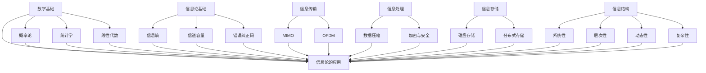

                 

### 引言

在当今数字化时代，信息已经成为社会发展的核心资源。如何有效处理、传输和利用信息，已成为各个领域研究和应用的重点。数学与信息论作为两大学科，在揭示现实世界的信息结构方面发挥了至关重要的作用。数学为信息论提供了坚实的理论基础，而信息论则通过数学工具揭示了信息传输和处理中的本质规律。

数学与信息论的关系可以追溯到20世纪初。香农（Claude Shannon）在1948年发表的论文《通信的数学理论》（A Mathematical Theory of Communication）中，首次提出了信息论的概念，奠定了现代信息论的基础。香农的工作表明，信息可以被视为一种可以量化和测量的资源，其传输和处理过程可以用数学模型来描述和分析。

现实世界中的信息结构复杂多样，从简单的数据通信到复杂的人工智能系统，信息传输、处理和存储都离不开数学和信息论的理论支持。例如，在通信领域，信息论帮助我们理解和优化通信系统的性能；在计算机科学领域，信息论为算法设计和系统性能分析提供了理论依据。

本文旨在深入探讨数学与信息论在现实世界中的基本概念、理论框架和应用，通过逐步分析推理的方式，揭示信息结构的本质和规律。文章将首先介绍数学与信息论的基础知识，然后探讨信息论在现实世界中的应用，最后通过具体案例进行分析，总结信息理论的实际意义和未来发展方向。

### 数学与信息论基础

#### 数学基础

数学作为信息论的基础，提供了描述和解决问题的强大工具。在信息论中，常用的数学工具包括概率论、统计学和线性代数。概率论用于描述不确定事件的发生可能性，统计学用于分析数据的分布和趋势，而线性代数则用于处理多维数据空间。

首先，概率论在信息论中的应用主要体现在对随机事件概率的建模和计算。例如，在香农的信息熵公式中，概率分布就是通过概率论来描述的。信息熵（Entropy）是衡量信息不确定性的重要指标，其定义为：

$$
H(X) = -\sum_{i} p(x_i) \log_2 p(x_i)
$$

其中，$X$表示随机变量，$p(x_i)$表示该随机变量取值为$x_i$的概率。

统计学则用于对大量数据进行分析，以便从中提取有用的信息。在信息论中，统计学方法常用于数据分布的估计和假设检验。例如，通过样本数据来估计总体的信息熵，从而对信息传输系统的性能进行评估。

线性代数在信息论中的应用主要体现在数据空间的表示和变换。例如，在多变量数据分析中，线性代数的工具可以帮助我们找到数据的主要特征，从而优化信息传输和处理过程。

#### 实际应用中的数学方法

在现实世界中，数学方法广泛应用于信息处理和传输领域。以下是一些典型的应用场景：

1. **数据压缩**：数据压缩是一种通过减少数据冗余来提高数据传输效率的技术。常用的数据压缩方法包括哈夫曼编码和算术编码。哈夫曼编码通过构建最优的编码树来为不同的符号分配最短的编码长度，从而实现数据压缩。其核心算法是基于概率论和图论的方法。

   ```python
   # 哈夫曼编码伪代码
   def huffman_encoding(text):
       # 计算每个字符的概率
       probabilities = calculate_probabilities(text)
       # 构建哈夫曼树
       tree = build_huffman_tree(probabilities)
       # 生成编码表
       encoding_table = generate_encoding_table(tree)
       # 编码文本
       encoded_text = encode_text(text, encoding_table)
       return encoded_text
   ```

2. **错误纠正码**：在数据传输过程中，由于噪声或其他因素，数据可能会发生错误。错误纠正码（Error-Correcting Codes，ECC）是一种用于检测和纠正错误的方法。常见的错误纠正码包括汉明码（Hamming Code）和卷积码（Convolutional Code）。汉明码通过在数据中添加冗余位来实现错误检测和纠正，其原理基于线性代数。

   ```python
   # 汉明码编码伪代码
   def hamming_encoding(data):
       # 添加冗余位
       redundant_bits = add_redundant_bits(data)
       # 形成编码后的数据
       encoded_data = data + redundant_bits
       return encoded_data
   ```

3. **神经网络**：在人工智能领域，神经网络是一种基于数学模型的学习算法。神经网络通过多层非线性变换来提取数据特征，从而实现复杂函数的逼近。其核心原理包括线性代数和微积分。

   ```python
   # 神经网络前向传播伪代码
   def forward_propagation(inputs, weights, biases):
       # 初始化激活函数
       activation_function = sigmoid
       # 层间传播
       for layer in range(number_of_layers):
           inputs = activation_function(np.dot(inputs, weights[layer]) + biases[layer])
       return inputs
   ```

这些数学方法在实际应用中起到了关键作用，帮助我们更好地理解和处理信息。

#### 信息论基础

信息论是研究信息传输、处理和存储的一般理论的学科，由香农创立。信息论的基本概念包括信息熵、信息传输效率和信息容量等。

1. **信息熵**：信息熵是衡量信息不确定性的指标，其定义如前所述。高信息熵表示信息的不确定性较高，低信息熵表示信息的不确定性较低。

2. **信息传输效率**：信息传输效率是指信息在传输过程中的损失程度。高效率的传输意味着信息在传输过程中损失较少。

3. **信息容量**：信息容量是指通信系统可以传输的最大信息量。香农在1948年提出的信道容量公式如下：

   $$
   C = B \log_2(1 + S/N)
   $$

   其中，$C$表示信道容量，$B$表示信道带宽，$S$表示信号功率，$N$表示噪声功率。

#### 信息论的发展历程

信息论的发展可以追溯到20世纪初。1905年，鲁道夫·哈恩（Rudolf Hanh）首次提出了信息熵的概念。1948年，香农发表了《通信的数学理论》，奠定了现代信息论的基础。此后，信息论得到了迅速发展，并广泛应用于通信、计算机科学、生物学等领域。

#### 信息论的基本概念

信息论的基本概念包括：

1. **信息源**：信息源是指产生信息的实体，可以是自然的或人为的。
2. **信道**：信道是指信息传输的路径，可以是物理的或抽象的。
3. **信息传输**：信息传输是指信息从信息源到信道的传输过程。
4. **信息处理**：信息处理是指对传输后的信息进行加工和处理的过程。
5. **信息存储**：信息存储是指将信息保存在某种介质上的过程。

这些基本概念构成了信息论的理论框架，为我们理解和解决信息传输、处理和存储问题提供了指导。

### 信息论在现实世界中的应用

信息论自提出以来，已经在通信、计算机科学、生物学等多个领域得到了广泛应用，显著提高了信息处理和传输的效率。以下将详细介绍信息论在几个主要领域中的应用，以及这些应用对现实世界产生的深远影响。

#### 信息传输

信息传输是信息论最直接的应用领域之一。在通信系统中，信息传输效率和质量是至关重要的。信息论通过量化信息熵和信道容量，为优化通信系统的设计和性能提供了理论基础。

1. **香农信道容量公式**：香农在1948年提出了著名的信道容量公式：

   $$
   C = B \log_2(1 + \frac{S}{N})
   $$

   其中，$C$表示信道容量，$B$表示信道带宽，$S$表示信号功率，$N$表示噪声功率。这个公式告诉我们，在给定的带宽和信噪比下，通信系统可以达到的最大数据传输速率。通过调整这些参数，工程师可以设计出更高效的通信系统。

2. **实际应用案例**：在现代无线通信系统中，信息论的应用极为广泛。例如，4G和5G通信标准中的正交频分复用（OFDM）技术，就是基于信息论原理优化的一种多载波调制方案，它能够显著提高无线通信的频谱效率和传输速率。

#### 信息处理

信息处理是计算机科学和人工智能的核心任务之一。信息论为算法设计提供了理论基础，使得计算机系统能够更高效地处理和利用信息。

1. **数据压缩**：数据压缩是信息处理的重要应用之一。信息论中的熵编码技术，如哈夫曼编码和算术编码，可以显著减少数据存储和传输所需的比特数。这些技术在多媒体文件压缩、云存储和大数据处理等领域得到了广泛应用。

2. **加密与安全**：信息论中的密码学理论，如香农密码和现代密码学方法，为信息的安全传输和存储提供了保障。例如，RSA加密算法和椭圆曲线加密算法，都是基于信息论原理设计的。

3. **机器学习**：在机器学习中，信息论的概念如信息增益、互信息和KL散度等，被广泛应用于特征选择、模型优化和评价。这些方法帮助机器学习算法更有效地从数据中提取有用信息。

#### 信息存储

信息存储是信息技术的重要组成部分。信息论通过优化存储结构和算法，提高了信息存储的效率和可靠性。

1. **磁盘存储**：磁盘存储系统中，错误检测和纠正码（如汉明码）是基于信息论原理设计的，这些码能够检测和纠正磁盘读写过程中的错误，从而提高数据的可靠性。

2. **分布式存储**：在大数据存储领域，分布式存储系统（如HDFS和Ceph）采用了信息论中的冗余编码技术，如Erasure Coding，来提高数据的可靠性和存储效率。

3. **数据库优化**：在数据库系统中，索引技术（如B树和哈希索引）是基于信息论原理设计的，这些索引能够快速定位数据，从而提高查询效率。

#### 信息传输、处理和存储的关系

信息传输、处理和存储在信息系统中是紧密相连的。一个高效的信息传输系统需要低的信息传输延迟和高传输速率；一个高效的信息处理系统需要快速处理和利用信息；一个高效的信息存储系统需要高容量和可靠性。信息论通过量化和优化这些指标，为整个信息系统提供了理论基础和实践指导。

例如，在一个典型的云计算服务中，数据需要在分布式存储系统中存储，通过信息传输网络进行传输，并在计算节点上进行处理。信息论中的信道容量公式可以帮助优化数据传输网络的设计，信息熵和KL散度等概念可以帮助优化数据压缩和存储策略，而密码学理论可以保障数据的安全传输和存储。

总之，信息论在现实世界中的应用无处不在，通过优化信息传输、处理和存储过程，提高了信息系统的效率、可靠性和安全性，为现代信息技术的发展提供了强大的支持。

### 信息结构的分析

#### 信息结构的概念

信息结构是指信息在现实世界中的组织方式、存储模式和传递路径。它可以被视为一种抽象模型，用于描述信息在不同系统、组织和应用中的分布和流动。信息结构不仅涉及信息的内容和形式，还包括信息的产生、传输、处理和消费过程中的各种关系和规则。

在现实世界中，信息结构具有以下特点：

1. **多样性**：信息结构因应用场景和领域不同而呈现出多样性。例如，在通信系统中，信息结构可能包括数据流、控制流和网络拓扑；在金融领域，信息结构可能涉及交易数据、客户信息和市场动态。

2. **层次性**：信息结构往往具有层次性，从微观到宏观，从局部到全局，各个层次之间的信息流动和交互构成了复杂的信息网络。

3. **动态性**：信息结构是动态变化的，随着信息的生成、处理和消费，信息结构会不断调整和优化。

#### 信息结构的特点

1. **系统性**：信息结构不是孤立存在的，它是一个系统，包含多个相互关联的组成部分。每个组成部分在系统中扮演特定的角色，共同实现信息的管理和传递。

2. **层次性**：信息结构具有明显的层次性，从数据层、信息层到知识层，层次之间的信息流动和转化体现了信息的深层次加工和利用。

3. **动态性**：信息结构不是静态不变的，它随着时间、环境和技术的发展而不断演变。例如，在互联网时代，信息结构逐渐从传统的中心化模式转向去中心化的分布式模式。

4. **复杂性**：信息结构非常复杂，包含了多种类型的信息、复杂的交互关系和多样化的处理方法。这种复杂性要求我们在分析和设计信息结构时，需要采用系统化的方法和工具。

#### 信息结构的分析方法

1. **数据驱动的分析方法**：数据驱动的方法主要依赖于大数据分析和数据挖掘技术，通过分析大量数据来揭示信息结构中的模式和规律。这种方法包括数据预处理、特征提取、模型训练和结果解释等步骤。

2. **模型驱动的分析方法**：模型驱动的方法通过建立数学模型来描述信息结构，分析其内在特性和动态行为。常见的模型包括网络模型、信息流模型和随机模型等。

3. **可视化分析方法**：可视化方法通过图形化展示信息结构，帮助人们直观地理解和分析信息流动和交互。常用的可视化工具包括网络图、时间序列图和热力图等。

4. **案例分析法**：案例分析法通过分析具体案例来揭示信息结构的实际应用和效果。这种方法可以帮助我们更好地理解信息结构在不同场景下的作用和限制。

#### 信息结构在实际应用中的挑战

1. **信息过载**：随着数据量的爆炸性增长，信息过载成为一个普遍问题。如何在海量信息中提取有价值的信息，成为信息结构分析的重要挑战。

2. **隐私保护**：在信息传输和处理过程中，隐私保护是另一个关键问题。如何在保障用户隐私的前提下，有效利用信息资源，是一个亟待解决的难题。

3. **实时性**：在许多应用场景中，实时性是信息结构的关键要求。例如，在金融交易、智能交通和医疗监控等领域，信息结构需要能够快速响应和调整，以应对实时变化的需求。

4. **异构性**：现实世界中的信息结构通常是异构的，包含多种类型的信息源、处理单元和传输介质。如何在异构环境中实现高效的信息传输和处理，是另一个重要挑战。

#### 解决方案探讨

1. **信息过滤与推荐系统**：通过构建信息过滤和推荐系统，可以有效减少信息过载，将用户感兴趣的信息推送给他们。

2. **隐私保护技术**：采用加密、匿名化和差分隐私等技术，可以在保障隐私的前提下，有效利用信息资源。

3. **实时数据处理技术**：采用分布式计算、流计算和边缘计算等技术，可以实现高效、实时的信息处理和传输。

4. **异构信息融合技术**：通过构建异构信息融合框架，实现多种类型信息的高效整合和处理，提高信息利用效率。

综上所述，信息结构的分析是一个复杂而关键的任务，涉及到多个领域的技术和方法。通过系统化、模型化和可视化等方法，我们可以更好地理解和优化信息结构，从而提升信息系统的效率和可靠性。

### 信息理论的实际应用案例

信息理论作为一门研究信息传输、处理和存储的学科，其理论和算法在通信、计算机科学、生物学等多个领域有着广泛的应用。以下将介绍几个具体领域的应用案例，并详细探讨这些应用的实际案例。

#### 通信领域

通信领域是信息理论最重要的应用领域之一。信息论的基本原理，如信道容量、信息熵和编码理论，被广泛应用于优化通信系统的性能和效率。

1. **现代通信系统中的信息论应用**

   在现代通信系统中，如4G、5G和光纤通信，信息论的理论被广泛应用于提高数据传输速率和传输质量。例如，5G通信技术中采用的正交频分复用（OFDM）技术，就是基于信息论原理设计的。OFDM通过将信道划分为多个子信道，从而提高了频谱利用率和抗干扰能力。

   **案例**：在5G网络中，采用信息论优化后的MIMO（多输入多输出）技术，通过多个发射和接收天线同时传输数据，显著提高了数据传输速率和覆盖范围。

2. **量子通信**：量子通信利用量子纠缠和量子隐形传态等现象，实现远距离的信息传输。量子信息论为量子通信提供了理论基础，如量子信道容量和量子纠错码。

   **案例**：2017年，中国科学家实现了千公里级别的量子隐形传态，这标志着量子通信技术迈向实用化。

3. **卫星通信**：卫星通信系统在信息传输过程中面临高噪声和长距离传输的挑战。信息论中的编码技术，如卷积码和LDPC码，被广泛应用于提高卫星通信系统的可靠性和传输效率。

   **案例**：国际空间站通信系统采用LDPC码进行错误纠正，确保了在恶劣环境下数据的可靠传输。

#### 计算机科学领域

计算机科学领域是信息理论的另一个重要应用领域。信息论的概念和方法被广泛应用于数据压缩、加密算法和机器学习等各个方面。

1. **数据压缩**：信息论中的熵编码技术，如哈夫曼编码和算术编码，被广泛应用于图像、音频和视频数据的压缩。这些技术通过减少数据中的冗余信息，提高了数据传输和存储的效率。

   **案例**：JPEG和MP3格式的压缩算法，就是基于信息论原理设计的，广泛用于图像和音频文件的压缩和传输。

2. **加密与安全**：信息论中的密码学理论，如RSA和椭圆曲线加密算法，被广泛应用于数据加密和网络安全。这些算法通过将明文转换为密文，保障了数据的安全传输和存储。

   **案例**：HTTPS协议通过RSA和TLS加密技术，确保了互联网通信的安全性。

3. **机器学习**：信息论中的信息增益、互信息和KL散度等概念，被广泛应用于特征选择、模型评估和优化。这些方法帮助机器学习算法更有效地从数据中提取有用信息，提高模型的性能。

   **案例**：在深度学习中，通过使用KL散度，可以优化神经网络模型的参数，提高模型的稳定性和鲁棒性。

#### 生物学领域

生物学领域是信息理论的另一个重要应用领域。信息论的方法被广泛应用于基因组学、生态学和神经科学等领域。

1. **基因组学**：信息论中的熵编码和错误纠正技术，被用于基因组数据的压缩和纠错。这些技术有助于提高基因组测序和分析的效率和准确性。

   **案例**：基因组测序过程中，采用信息论中的纠错码，可以显著减少测序错误，提高基因组数据的可靠性。

2. **生态学**：信息论中的信息熵和互信息，被用于分析生态系统的稳定性和生物多样性。这些方法有助于揭示生态系统中的信息流动和相互作用。

   **案例**：通过计算生态系统中不同生物种群之间的互信息，可以评估生态系统的健康程度和恢复能力。

3. **神经科学**：信息论中的信息熵和熵变，被用于分析神经元和神经网络的信息处理过程。这些方法有助于理解大脑的信息处理机制和认知过程。

   **案例**：在脑成像研究中，通过计算大脑不同区域的信息熵和熵变，可以揭示大脑活动和信息处理的状态。

总之，信息理论在通信、计算机科学和生物学等领域的实际应用，不仅提高了这些领域的效率和准确性，也为科学研究和技术创新提供了新的思路和方法。

### 结论与展望

随着信息技术的快速发展，数学与信息论在现实世界中的应用日益广泛。本文通过逐步分析推理，系统阐述了数学与信息论的基本概念、理论框架和实际应用，揭示了信息结构在现实世界中的复杂性和重要性。以下是对本文内容的总结，以及对未来发展趋势的展望。

#### 总结

1. **数学与信息论的基础**：数学为信息论提供了坚实的理论基础，包括概率论、统计学和线性代数等方法。这些数学工具帮助我们理解和量化信息传输、处理和存储过程中的关键参数。

2. **信息论的应用领域**：信息论在通信、计算机科学和生物学等领域的应用，显著提升了信息处理和传输的效率和可靠性。例如，在通信领域，信息论优化了信道容量和数据传输速率；在计算机科学领域，信息论推动了数据压缩和加密技术的发展；在生物学领域，信息论帮助我们更好地理解基因组学和生态系统的信息流动。

3. **信息结构分析**：信息结构是指信息在现实世界中的组织方式和传递路径。通过数据驱动的分析、模型驱动的分析和可视化方法，我们可以更深入地理解信息结构的复杂性，并优化信息系统的设计。

4. **实际应用案例**：本文通过具体的案例，展示了信息理论在不同领域的应用，如5G通信、量子通信、基因测序和脑成像研究等。这些案例证明了信息论在实际应用中的巨大潜力和价值。

#### 未来发展趋势

1. **量子信息论**：随着量子技术的发展，量子信息论成为一个新兴的研究领域。量子信息论将揭示量子通信、量子计算和量子密码学的新理论框架，推动信息技术向更高维度发展。

2. **大数据与信息论**：大数据时代的到来，为信息论提供了新的挑战和机遇。如何在大数据环境中优化信息传输、处理和存储，是未来研究的一个重要方向。

3. **人工智能与信息论**：人工智能的快速发展，对信息论提出了新的需求。信息论中的熵、互信息和KL散度等概念，可以用于优化机器学习算法、特征选择和模型评估，推动人工智能技术的发展。

4. **跨学科研究**：信息论与其他学科的交叉融合，将为信息理论带来新的研究视角和方法。例如，信息论与经济学、社会学和生物学的结合，可以揭示信息在社会系统、生态系统和生物系统中的作用和影响。

#### 学术研究与应用前景

1. **学术研究**：未来的学术研究应重点关注量子信息论、大数据信息论和跨学科信息论等前沿领域，推动信息论的理论创新和体系完善。

2. **应用前景**：信息论在通信、计算机科学、生物学和人工智能等领域的应用前景广阔。通过信息论的指导，我们可以设计更高效、更可靠的通信系统、计算系统和信息系统，为社会发展和科技创新提供强大支持。

总之，数学与信息论在揭示现实世界信息结构方面具有重要意义。未来，随着信息技术的不断进步，数学与信息论将继续发挥关键作用，推动信息科学的发展和应用。我们期待更多的学术研究和实际应用，为信息时代的进步做出贡献。

### 附录：核心概念与联系

在本文中，我们介绍了数学与信息论的核心概念及其在实际中的应用。为了帮助读者更好地理解这些概念之间的关系，我们通过Mermaid流程图展示了核心概念与联系。



这个流程图展示了数学基础与信息论基础之间的联系，以及信息论在信息传输、处理和存储中的应用。通过这个图，读者可以更清晰地理解各个概念之间的相互作用和影响。

