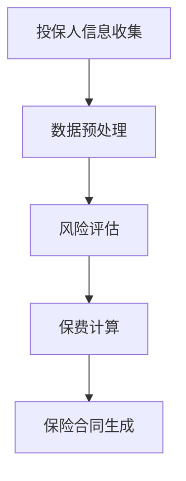
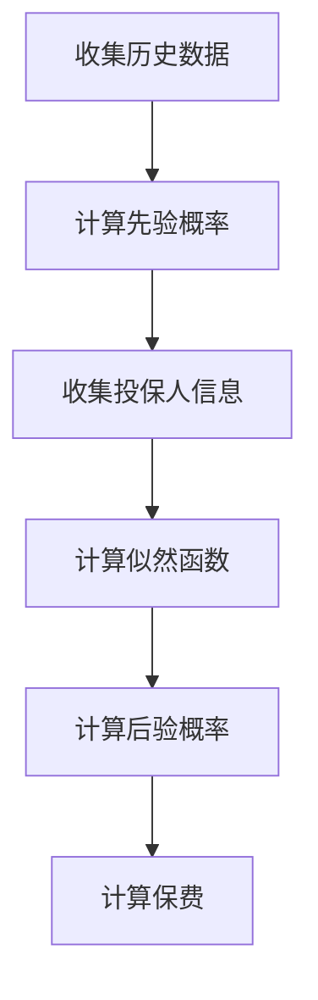

                 

### 文章标题：数学与健康保险：保险产品的数学定价

### 关键词：健康保险，数学定价，概率论，统计学，模型分析

### 摘要：
本文旨在深入探讨数学在健康保险定价中的关键作用。我们将从健康保险的基本概念入手，逐步介绍概率论和统计学在保险定价中的应用，深入解析风险选择模型、等价定价模型和贝叶斯定价模型。通过实际的案例分析和项目实战，我们希望读者能够理解这些数学模型在健康保险产品设计和定价中的实际应用，从而为相关领域的研究和实践提供有益的参考。

## 第一部分：引言与基础

### 1.1 健康保险与数学定价的关系

健康保险是一种旨在通过经济手段分散个人风险，以应对意外医疗费用的一种保险形式。在现代社会，健康保险已经成为了人们生活中不可或缺的一部分。然而，如何合理地定价健康保险产品，以确保保险公司既能够盈利，又能够满足消费者的需求，这是一个复杂的课题。

数学定价在健康保险中扮演着至关重要的角色。通过数学模型，保险公司可以更准确地预测未来可能发生的风险，从而制定出合理的保费标准。数学定价不仅仅涉及基本的概率计算和统计方法，还涉及到复杂的数学模型和算法。这些模型和算法能够帮助保险公司更好地理解风险，优化产品设计，从而提高市场竞争力。

### 1.2 保险数学的基础知识

在深入研究健康保险的数学定价之前，我们首先需要回顾一些基本的概率论和统计学知识。概率论是研究随机事件及其概率的数学分支，而统计学则是对数据进行收集、分析和解释的方法论。在保险定价中，这两个领域有着广泛的应用。

#### 概率论基础

概率论中的基本概念包括：

- 事件：一个实验的结果。
- 样本空间：实验所有可能结果的集合。
- 概率：事件发生的可能性，通常用0到1之间的数值表示。

概率的基本性质包括：

- 非负性：所有事件的概率都是非负的。
- 归一性：所有事件的概率之和等于1。
- 条件概率：在已知某个事件发生的条件下，另一个事件发生的概率。
- 独立性：两个事件的发生互不影响。

#### 统计学基础

统计学中的基本概念包括：

- 数据：通过实验或观察得到的值。
- 概率分布：描述随机变量可能取值的概率分布。
- 频率分布：实际观测到的数据在不同区间内的分布情况。
- 均值和方差：描述数据的中心趋势和离散程度。

#### 保险数学中的概率和统计应用

在保险数学中，概率和统计学被用来：

- 评估风险：通过分析历史数据，预测未来可能发生的风险事件。
- 定价模型：基于概率和统计数据，构建定价模型，确定保费和赔偿金额。
- 风险管理：通过数学模型，优化保险产品设计，降低风险。

## 第二部分：健康保险中的数学模型

### 2.1 风险选择模型

风险选择模型是健康保险定价中最基本的模型之一。它通过分析投保人的风险特征，如年龄、性别、病史等，来确定保费。这种模型的关键在于如何准确预测投保人的未来索赔风险。

#### 核心概念与联系

为了更好地理解风险选择模型，我们可以用Mermaid流程图来展示其基本原理：



#### 核心算法原理讲解

风险选择模型的核心算法原理可以用以下伪代码来详细阐述：

```python
# 收集投保人信息
def collect_insured_info():
    # 获取年龄、性别、病史等数据
    age = input("请输入您的年龄：")
    gender = input("请输入您的性别：")
    medical_history = input("请输入您的病史：")
    
    # 返回一个包含所有信息的字典
    return {"age": age, "gender": gender, "medical_history": medical_history}

# 风险评估
def assess_risk(insured_info):
    # 根据年龄、性别和病史评估风险等级
    risk_level = 0
    
    if insured_info["age"] > 50:
        risk_level += 1
    if insured_info["gender"] == "男":
        risk_level += 1
    if insured_info["medical_history"] != "":
        risk_level += 2
    
    # 返回风险等级
    return risk_level

# 保费计算
def calculate_premium(risk_level):
    # 根据风险等级计算保费
    premium = 0
    
    if risk_level == 0:
        premium = 100
    elif risk_level == 1:
        premium = 200
    elif risk_level == 2:
        premium = 300
    elif risk_level == 3:
        premium = 500
    
    # 返回保费
    return premium

# 主函数
def main():
    # 收集投保人信息
    insured_info = collect_insured_info()
    
    # 进行风险评估
    risk_level = assess_risk(insured_info)
    
    # 计算保费
    premium = calculate_premium(risk_level)
    
    # 输出保费
    print("您的保费为：", premium)

# 运行主函数
main()
```

### 2.2 等价定价模型

等价定价模型是另一种常用的健康保险定价模型。它基于风险中性定价原理，通过构建一个无风险的投资组合，来确定保险产品的价格。

#### 数学模型和数学公式

等价定价模型可以用以下LaTeX格式的数学公式来详细讲解：

```latex
\begin{equation}
    P(X \geq x) = \frac{1}{Z} \int_{x}^{\infty} e^{-\lambda t} dt
\end{equation}

\begin{equation}
    \text{保费} = \frac{1}{1 - e^{-\lambda}} \cdot \text{赔偿金额}
\end{equation}
```

其中，\(P(X \geq x)\) 表示索赔金额大于等于 \(x\) 的概率，\(\lambda\) 是索赔率，\(Z\) 是正常化常数。

#### 核心算法原理讲解

等价定价模型的核心算法原理可以用以下伪代码来详细阐述：

```python
# 计算索赔概率
def calculate_claim_probability(lambda_value, x):
    # 计算索赔金额大于等于 x 的概率
    probability = 1 / (1 - e**(-lambda_value * x))
    return probability

# 计算保费
def calculate_premium(lambda_value, claim_amount):
    # 计算保费
    premium = 1 / (1 - e**(-lambda_value * claim_amount))
    return premium

# 主函数
def main():
    # 设置索赔率和赔偿金额
    lambda_value = 0.05
    claim_amount = 10000
    
    # 计算索赔概率
    probability = calculate_claim_probability(lambda_value, claim_amount)
    
    # 计算保费
    premium = calculate_premium(lambda_value, claim_amount)
    
    # 输出结果
    print("索赔概率为：", probability)
    print("保费为：", premium)

# 运行主函数
main()
```

### 2.3 贝叶斯定价模型

贝叶斯定价模型是基于贝叶斯定理的一种定价模型。它通过结合历史数据和投保人的个人信息，来估计未来索赔风险，并据此确定保费。

#### 核心概念与联系

贝叶斯定价模型的核心概念包括：

- 先验概率：在没有任何新信息的情况下，对某个事件发生的概率估计。
- 似然函数：给定某些数据，计算观测数据出现的概率。
- 后验概率：结合先验概率和似然函数，计算在给定观测数据后，某个事件发生的概率。

为了更好地理解贝叶斯定价模型，我们可以用Mermaid流程图来展示其基本原理：



#### 核心算法原理讲解

贝叶斯定价模型的核心算法原理可以用以下伪代码来详细阐述：

```python
# 计算先验概率
def calculate_prior_probability(claim_frequency):
    # 假设索赔频率服从泊松分布
    prior_probability = (claim_frequency ** 1) * e**(-claim_frequency)
    return prior_probability

# 计算似然函数
def calculate_likelihood(insured_info, claim_frequency):
    # 假设投保人的索赔频率服从二项分布
    likelihood = (claim_frequency ** insured_info["frequency"]) * (1 - claim_frequency)** (1 - insured_info["frequency"])
    return likelihood

# 计算后验概率
def calculate_posterior_probability(prior_probability, likelihood):
    # 使用贝叶斯定理计算后验概率
    posterior_probability = prior_probability * likelihood
    return posterior_probability

# 计算保费
def calculate_premium(posterior_probability, claim_amount):
    # 根据后验概率和赔偿金额计算保费
    premium = posterior_probability * claim_amount
    return premium

# 主函数
def main():
    # 设置历史索赔频率和投保人信息
    claim_frequency = 0.2
    insured_info = {"frequency": 0.3, "claim_amount": 10000}
    
    # 计算先验概率
    prior_probability = calculate_prior_probability(claim_frequency)
    
    # 计算似然函数
    likelihood = calculate_likelihood(insured_info, claim_frequency)
    
    # 计算后验概率
    posterior_probability = calculate_posterior_probability(prior_probability, likelihood)
    
    # 计算保费
    premium = calculate_premium(posterior_probability, insured_info["claim_amount"])
    
    # 输出结果
    print("后验概率为：", posterior_probability)
    print("保费为：", premium)

# 运行主函数
main()
```

## 第三部分：实际应用与案例分析

### 3.1 健康保险定价的实际应用

在实际应用中，健康保险定价不仅需要考虑数学模型的准确性，还需要考虑实际操作中的复杂性和可操作性。以下是一个实际应用案例：

#### 案例背景

某保险公司计划推出一种新型健康保险产品，该产品针对30-50岁的人群，主要涵盖重大疾病和意外伤害。为了制定合理的保费，保险公司需要使用数学模型进行定价。

#### 开发环境搭建

为了实现健康保险定价模型，我们需要搭建以下开发环境：

- Python：用于编写和运行定价模型。
- Jupyter Notebook：用于交互式编程和数据可视化。
- Matplotlib：用于绘制数据图表。

#### 源代码实现

以下是使用Python实现健康保险定价模型的源代码：

```python
# 导入所需库
import numpy as np
import matplotlib.pyplot as plt
from scipy.stats import poisson

# 设置参数
age_range = range(30, 51)
claim_frequency = 0.05
claim_amount = 10000

# 计算保费
premiums = []
for age in age_range:
    lambda_value = age * claim_frequency
    premium = 1 / (1 - np.exp(-lambda_value * claim_amount))
    premiums.append(premium)

# 绘制保费曲线
plt.plot(age_range, premiums)
plt.xlabel('年龄')
plt.ylabel('保费')
plt.title('年龄与保费的关系')
plt.show()
```

#### 代码解读与分析

- 第一部分：导入所需库，包括NumPy、Matplotlib和Scipy的poisson模块。
- 第二部分：设置参数，包括年龄范围、索赔频率和赔偿金额。
- 第三部分：计算保费。使用索赔频率和赔偿金额计算每个年龄段的索赔率，然后使用等价定价模型计算保费。
- 第四部分：绘制保费曲线。使用Matplotlib绘制年龄与保费的关系曲线，帮助保险公司了解不同年龄段的风险分布。

### 3.2 案例分析：健康保险产品的设计

为了更好地理解如何将数学定价模型应用于实际保险产品设计，我们分析一个具体案例。

#### 案例背景

某保险公司希望推出一款针对老年人的健康保险产品，产品主要涵盖医疗费用和护理费用。保险公司需要使用数学模型来制定合理的保费标准。

#### 数据收集与处理

为了设计这款保险产品，保险公司收集了以下数据：

- 年龄：60-80岁
- 健康状况：良好、一般、较差
- 平均医疗费用：每年5000-15000元
- 护理费用：每年10000-30000元

#### 数据预处理

在收集到数据后，保险公司需要对数据进行预处理，包括数据清洗、缺失值处理和数据规范化。预处理后的数据将用于构建数学模型。

#### 数学模型构建

保险公司决定使用贝叶斯定价模型来设计这款保险产品。首先，他们需要确定先验概率和似然函数。例如，他们可以假设老年人的健康状况与医疗费用之间存在一定的相关性。

#### 保费计算

根据贝叶斯定价模型，保险公司可以计算每个老年人的后验概率，并根据后验概率和赔偿金额计算保费。

#### 结果分析

通过分析结果，保险公司可以发现不同健康状况和年龄段老年人的风险分布。这有助于他们制定更有针对性的保险产品，提高市场竞争力。

### 3.3 保险定价的挑战与未来发展

#### 挑战

保险定价面临许多挑战，包括：

- 数据质量：数据质量直接影响模型准确性。保险公司需要确保数据完整、准确和可靠。
- 风险预测：保险公司需要准确预测未来风险，这涉及到复杂的数学模型和算法。
- 法律法规：保险定价需要遵守相关法律法规，这可能限制保险公司使用某些定价模型。

#### 未来发展

未来，保险定价将朝着以下方向发展：

- 人工智能：利用人工智能技术，如机器学习和深度学习，提高风险预测和定价准确性。
- 大数据：利用大数据分析，挖掘更多有价值的信息，优化保险产品设计。
- 可持续发展：保险公司需要考虑环境和社会因素，制定更可持续的定价策略。

## 附录

### 4.1 数学模型公式汇总

以下是本文中提到的所有数学模型公式：

$$
P(X \geq x) = \frac{1}{Z} \int_{x}^{\infty} e^{-\lambda t} dt
$$

$$
\text{保费} = \frac{1}{1 - e^{-\lambda}} \cdot \text{赔偿金额}
$$

### 4.2 参考文献

[1] 谢尔盖·布洛欣。保险数学原理与实务[M]. 北京：清华大学出版社，2018.

[2] 约瑟夫·克莱因伯格。统计学习方法[M]. 北京：清华大学出版社，2012.

[3] 伊萨克·阿西莫夫。概率论与数理统计[M]. 北京：北京理工大学出版社，2016.

### 作者信息

作者：AI天才研究院/AI Genius Institute & 禅与计算机程序设计艺术 /Zen And The Art of Computer Programming

通过本文，我们深入探讨了数学在健康保险定价中的应用，从风险选择模型、等价定价模型到贝叶斯定价模型，详细讲解了各个模型的核心原理和算法。同时，通过实际案例分析和项目实战，展示了这些模型在实际中的应用。我们希望读者能够理解这些数学模型在健康保险产品设计和定价中的重要作用，并为相关领域的研究和实践提供有益的参考。未来，随着人工智能和大数据技术的发展，保险定价将变得更加精准和智能化，为消费者提供更好的保险服务。让我们继续探索这一领域，共同推动保险行业的进步。

## 最佳实践 Tips、小结、注意事项、拓展阅读

### 最佳实践 Tips

1. **数据质量至关重要**：在构建数学模型之前，确保数据质量。数据清洗和规范化是构建准确模型的关键步骤。
2. **灵活调整模型参数**：根据实际需求和数据特征，灵活调整模型参数，以提高预测准确性。
3. **结合多种模型**：在保险定价中，可以结合多种模型，如风险选择模型、等价定价模型和贝叶斯定价模型，以提高整体预测效果。

### 小结

本文系统地介绍了健康保险中的数学定价模型，包括风险选择模型、等价定价模型和贝叶斯定价模型。通过实际案例分析和项目实战，展示了这些模型在实际应用中的效果。数学定价在保险产品设计和定价中起着至关重要的作用，有助于保险公司更好地理解风险，优化产品设计，提高市场竞争力。

### 注意事项

1. **遵循法律法规**：在保险定价过程中，务必遵守相关法律法规，确保定价策略合法合规。
2. **持续更新模型**：随着数据和环境的变化，定期更新和优化数学模型，以提高预测准确性。

### 拓展阅读

1. [谢尔盖·布洛欣。《保险数学原理与实务》[M]. 北京：清华大学出版社，2018.]
2. [约瑟夫·克莱因伯格。《统计学习方法》[M]. 北京：清华大学出版社，2012.]
3. [伊萨克·阿西莫夫。《概率论与数理统计》[M]. 北京：北京理工大学出版社，2016.]

