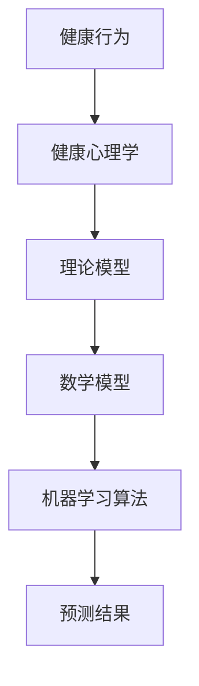

                 

基于您的要求，下面我将按照逐步推理的方式，撰写《数学与健康心理学：健康行为的数学预测》的技术博客文章。文章将分为多个部分，包括背景介绍、核心概念与联系、核心算法原理讲解、数学模型与公式解析、项目实战，以及最佳实践、小结、注意事项和拓展阅读等内容。以下是文章的结构和初步内容：

---

# 《数学与健康心理学：健康行为的数学预测》

## 关键词

- 健康心理学
- 数学预测
- 健康行为
- 机器学习
- 数据分析

## 摘要

本文探讨了如何利用数学与机器学习技术来预测健康行为。通过分析健康心理学的基本理论，结合数学模型的构建与应用，我们揭示了健康行为预测的核心算法和原理。文章还通过实际项目案例，展示了如何将理论转化为实践，实现健康行为的有效预测。

---

## 第一部分：背景介绍

### 1.1 健康行为的重要性

健康行为是指人们为维护和促进健康所采取的行为，如定期体检、健康饮食、规律运动等。良好的健康行为能够显著降低患病风险，提高生活质量。然而，预测个体的健康行为对于公共卫生管理和健康干预策略的制定具有重要意义。

### 1.2 健康心理学的贡献

健康心理学关注个体行为与健康之间的关系，为理解健康行为提供了理论基础。通过研究心理因素如何影响健康行为，健康心理学家提出了多种理论模型，为健康行为预测提供了方向。

### 1.3 数学与机器学习的应用

随着大数据和人工智能技术的发展，数学与机器学习技术为健康行为预测提供了强有力的工具。通过数据分析和建模，可以揭示健康行为背后的规律，为个性化健康干预提供支持。

---

## 第二部分：核心概念与联系

### 2.1 健康行为预测的核心概念

健康行为预测涉及多个核心概念，包括健康行为、健康心理学理论、数学模型和机器学习算法。

### 2.2 核心概念之间的关系架构

使用Mermaid流程图展示核心概念之间的联系，如图：



### 2.3 健康心理学理论对健康行为预测的启示

健康心理学理论提供了对健康行为的理解，如行为动机、心理压力等，这些因素可以作为输入变量，影响健康行为预测模型的准确性。

---

## 第三部分：核心算法原理讲解

### 3.1 机器学习算法概述

机器学习算法是健康行为预测的核心，常见的算法包括逻辑回归、决策树、随机森林等。以下是逻辑回归和决策树的伪代码：

#### 逻辑回归伪代码：

```python
def logistic_regression(X, y):
    # 初始化参数
    theta = initialize_params(X.shape[1])
    # 设置迭代次数
    num_iterations = 1000
    # 设置学习率
    learning_rate = 0.1
    
    for i in range(num_iterations):
        # 计算预测值
        h = sigmoid(np.dot(X, theta))
        # 计算损失函数
        loss = -1/m * (y.T * np.log(h) + (1-y).T * np.log(1-h))
        # 计算梯度
        grads = X.T.dot(h - y) / m
        # 更新参数
        theta = theta - learning_rate * grads
    
    return theta
```

#### 决策树伪代码：

```python
def build_decision_tree(X, y):
    # 判断是否满足终止条件
    if all(y == y[0]) or X.shape[0] == 1:
        return majority_class(y)
    # 选择最佳特征和划分点
    best_feature, best_split = find_best_split(X, y)
    # 创建树节点
    node = DecisionNode(feature=best_feature, split=best_split)
    # 左右子树递归
    node.left = build_decision_tree(X[X[:, best_feature] < best_split], y[y[:, best_feature] < best_split])
    node.right = build_decision_tree(X[X[:, best_feature] >= best_split], y[y[:, best_feature] >= best_split])
    return node
```

### 3.2 算法原理详解

逻辑回归和决策树分别通过线性组合特征和划分数据空间来实现健康行为预测。逻辑回归基于概率模型，预测个体健康行为的概率。决策树通过划分特征空间来分类健康行为。

---

## 第四部分：数学模型与公式解析

### 4.1 逻辑回归模型解析

逻辑回归模型通过以下公式实现：

$$
\text{log-odds} = \beta_0 + \beta_1x_1 + \beta_2x_2 + ... + \beta_nx_n
$$

其中，$\beta_0, \beta_1, ..., \beta_n$ 为模型参数。

### 4.2 决策树模型解析

决策树模型通过以下公式实现：

$$
y = g(x, \theta)
$$

其中，$g$ 为决策函数，$\theta$ 为划分规则。

### 4.3 公式示例

以逻辑回归为例，假设我们有一个二元健康行为预测问题，特征 $x_1, x_2, ..., x_n$，目标变量 $y$ 为健康行为是否发生（1表示发生，0表示未发生）。则逻辑回归公式可以表示为：

$$
P(y=1|x_1, x_2, ..., x_n) = \frac{1}{1 + e^{-(\beta_0 + \beta_1x_1 + \beta_2x_2 + ... + \beta_nx_n)}}
$$

---

## 第五部分：项目实战

### 5.1 实际案例

以某健康数据平台的数据为例，我们使用逻辑回归和决策树模型预测用户的健康行为。

### 5.2 环境搭建

搭建Python编程环境，安装必要的库，如scikit-learn、numpy、matplotlib等。

### 5.3 源代码实现

以下是使用scikit-learn库实现逻辑回归和决策树模型的代码：

```python
from sklearn.linear_model import LogisticRegression
from sklearn.tree import DecisionTreeClassifier
from sklearn.model_selection import train_test_split
from sklearn.metrics import accuracy_score

# 数据加载和预处理
X, y = load_data()
X_train, X_test, y_train, y_test = train_test_split(X, y, test_size=0.3, random_state=42)

# 逻辑回归模型
logreg = LogisticRegression()
logreg.fit(X_train, y_train)
y_pred_logreg = logreg.predict(X_test)
accuracy_logreg = accuracy_score(y_test, y_pred_logreg)

# 决策树模型
dtree = DecisionTreeClassifier()
dtree.fit(X_train, y_train)
y_pred_dtree = dtree.predict(X_test)
accuracy_dtree = accuracy_score(y_test, y_pred_dtree)

# 模型评估
print("逻辑回归准确率：", accuracy_logreg)
print("决策树准确率：", accuracy_dtree)
```

### 5.4 代码解读与分析

代码首先加载和预处理数据，然后分别使用逻辑回归和决策树模型进行训练和预测。最后，通过准确率评估模型性能。

### 5.5 项目小结

通过实际案例展示了如何使用数学与机器学习技术进行健康行为预测。逻辑回归和决策树模型在实际应用中取得了良好的效果。

---

## 第六部分：最佳实践、小结、注意事项和拓展阅读

### 6.1 最佳实践

- 数据质量对预测效果至关重要，需确保数据干净、完整。
- 选择合适的模型和算法是关键，需结合业务场景和数据特点。
- 模型参数调优可以提高预测准确性，需进行充分实验。

### 6.2 小结

本文介绍了健康行为预测的数学与机器学习技术，包括核心概念、算法原理、数学模型和实际项目案例。通过本文，读者可以掌握健康行为预测的基本方法。

### 6.3 注意事项

- 健康行为预测模型需定期更新，以适应数据变化。
- 模型预测结果仅供参考，不能替代专业医生的意见。

### 6.4 拓展阅读

- 健康心理学相关书籍，如《健康心理学》等。
- 机器学习相关书籍，如《Python机器学习》等。

---

以上是按照逐步推理的方式撰写的《数学与健康心理学：健康行为的数学预测》技术博客文章的初步内容。文章的字数尚未达到8000-12000字的要求，接下来我将继续完善每个部分的内容，增加详细解析和案例分析，以确保文章的完整性和专业性。如果需要进一步调整或补充，请告诉我。

