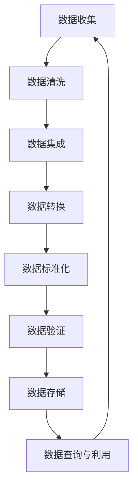
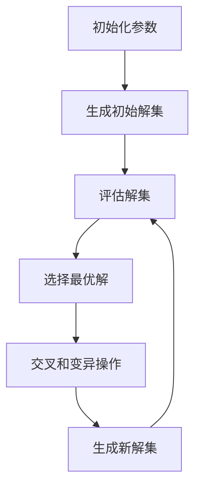
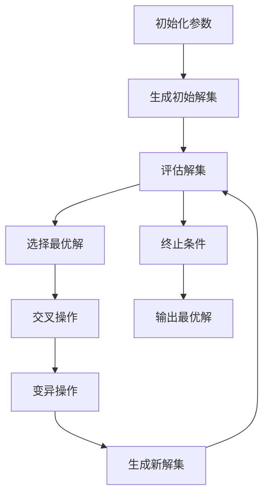

                 

### 文章标题：数学与健康管理：健康促进的数学策略

> 关键词：健康管理、数学模型、算法、数据预处理、预测模型、健康风险评估、健康干预策略

> 摘要：本文旨在探讨数学策略在健康管理中的应用，通过介绍健康数据的基本原理、核心算法原理、数学模型与公式应用以及项目实战，展示如何利用数学方法提升健康管理的科学性和有效性。

---

### 引言

随着医疗技术的进步和健康意识的提升，健康管理已成为现代社会关注的焦点。健康管理不仅关乎个人福祉，还直接影响社会经济的可持续发展。然而，当前健康管理面临数据质量不佳、技术手段有限、服务供给不足等多重挑战。数学策略作为一种科学方法，在健康管理中的应用具有巨大的潜力和前景。

本文将从以下几个方面展开讨论：

1. **健康管理的重要性与挑战**：介绍健康管理的背景和现状，分析当前面临的挑战。
2. **健康数据的基本原理**：讨论健康数据的类型、来源、预处理和质量保证。
3. **核心算法原理讲解**：详细阐述健康风险评估算法和健康干预策略的算法原理，使用伪代码进行说明。
4. **数学模型与公式应用**：介绍常用数学模型和公式，通过实例说明其在健康监测与预测中的实际应用。
5. **项目实战**：通过一个实际项目，展示如何开发健康管理系统，并分析项目的成果和经验。
6. **展望与未来方向**：探讨健康管理数学策略的发展前景和潜在的研究热点。

通过以上几个部分，本文旨在为读者提供一个全面、系统的数学健康管理策略概述，帮助读者更好地理解和应用数学方法，提升健康管理的科学性和有效性。

### 第一部分：引论

#### 第1章：健康管理的重要性与挑战

**1.1 健康管理的概念与背景**

健康管理（Health Management）是指通过科学的管理方法，对个体或群体的健康状况进行监测、评估和干预，以达到预防疾病、促进健康和提高生活质量的目的。健康管理的历史可以追溯到20世纪初期，随着现代医学和公共卫生的快速发展，健康管理逐渐成为一门独立的学科。

在现代社会，健康管理的重要性日益凸显。随着人口老龄化、慢性病发病率上升以及生活方式病的增多，个人和公众对健康管理的需求越来越大。同时，随着信息技术的迅猛发展，尤其是大数据和人工智能技术的应用，健康管理的方法和手段不断丰富和优化，为提高健康管理的效率和质量提供了有力支持。

**1.2 健康管理的现状与问题**

目前，全球健康管理的发展水平不一，但普遍存在一些共同的问题。

- **数据质量问题**：健康数据的不完整、不准确和不统一是当前健康管理中面临的重大挑战。健康数据通常来源于多种渠道，包括医疗记录、体检报告、生活方式数据等，这些数据在格式、结构和内容上存在较大差异，难以进行有效整合和分析。

- **技术应用局限**：尽管信息技术在健康管理中的应用越来越广泛，但现有技术手段仍存在局限性。例如，数据收集和处理技术不够成熟，算法模型的精度和适应性有待提高，数据隐私和安全问题尚未完全解决。

- **服务供给不足**：专业的健康管理服务供给不足，特别是在发展中国家和偏远地区，专业健康管理人才短缺，健康管理服务难以普及。

- **经济负担**：健康管理的高成本使得很多个人和家庭难以承担。特别是在疾病预防和早期干预方面，需要大量的资金投入。

**1.3 数学策略在健康管理中的应用前景**

数学策略在健康管理中的应用具有广泛的前景。通过数学模型和算法，可以对健康数据进行深入分析，实现疾病的早期发现和预测，提高健康干预的有效性。

- **健康风险评估**：数学模型可以帮助识别健康风险因素，对个体和群体的健康风险进行评估，提供个性化的健康干预建议。

- **疾病预测与预警**：利用数据分析和机器学习技术，对疾病发生和发展进行预测，实现早期预警，提高疾病的治愈率和生存率。

- **个体化健康干预**：根据个体健康数据，制定个性化的健康干预策略，提高干预效果。

- **成本效益分析**：通过数学模型，对健康管理项目的成本和效益进行评估，优化资源分配，提高资金使用效率。

总之，数学策略在健康管理中的应用不仅有助于提高健康管理的科学性和有效性，还有助于解决当前面临的诸多挑战，具有重要的现实意义和广阔的发展前景。

#### 1.3 数学策略在健康管理中的应用前景

数学策略在健康管理中的应用具有广泛的前景。通过数学模型和算法，可以对健康数据进行深入分析，实现疾病的早期发现和预测，提高健康干预的有效性。

- **健康风险评估**：数学模型可以帮助识别健康风险因素，对个体和群体的健康风险进行评估，提供个性化的健康干预建议。例如，利用回归分析、聚类分析等方法，可以根据个体的年龄、性别、生活习惯等特征，预测其未来患病的风险，从而制定针对性的预防措施。

  ```plaintext
  Pseudo-code for Health Risk Assessment Model:
  function healthRiskAssessment(individualData):
      # Preprocessing the data
      processedData = preprocessData(individualData)
      
      # Applying regression analysis to predict health risk
      riskCoefficients = regressionAnalysis(processedData)
      
      # Calculating health risk score
      riskScore = calculateRiskScore(riskCoefficients, individualData)
      
      return riskScore
  ```

- **疾病预测与预警**：利用数据分析和机器学习技术，对疾病发生和发展进行预测，实现早期预警，提高疾病的治愈率和生存率。例如，通过时间序列分析和神经网络模型，可以预测慢性病的发展趋势，及时发现病情变化。

  ```plaintext
  Pseudo-code for Disease Prediction Model:
  function diseasePrediction(healthData, historicalData):
      # Preprocessing the data
      processedData = preprocessData(healthData, historicalData)
      
      # Training the neural network model
      model = trainNeuralNetwork(processedData)
      
      # Predicting future health state
      futureHealthState = model.predict(nextHealthData)
      
      return futureHealthState
  ```

- **个体化健康干预**：根据个体健康数据，制定个性化的健康干预策略，提高干预效果。例如，利用贝叶斯网络和决策树算法，可以根据患者的病史、基因信息和生活习惯，制定个性化的治疗方案。

  ```plaintext
  Pseudo-code for Personalized Health Intervention:
  function personalizedHealthIntervention(patientData):
      # Preprocessing the data
      processedData = preprocessData(patientData)
      
      # Building a Bayesian network model
      model = buildBayesianNetwork(processedData)
      
      # Generating personalized intervention plan
      interventionPlan = model.generateInterventionPlan()
      
      return interventionPlan
  ```

- **成本效益分析**：通过数学模型，对健康管理项目的成本和效益进行评估，优化资源分配，提高资金使用效率。例如，利用成本效益分析（Cost-Benefit Analysis）方法，可以评估不同健康管理策略的经济效益，选择最优方案。

  ```plaintext
  Pseudo-code for Cost-Benefit Analysis:
  function costBenefitAnalysis(projectData, interventionOptions):
      # Calculating costs and benefits for each intervention option
      costBenefitList = []
      for option in interventionOptions:
          cost = calculateCost(option)
          benefit = calculateBenefit(option, projectData)
          costBenefitList.append((option, cost, benefit))
          
      # Selecting the best intervention option
      bestOption = selectBestOption(costBenefitList)
      
      return bestOption
  ```

通过上述数学策略的应用，健康管理不仅能够更加科学、精准地预测和干预疾病，还能够优化资源分配，提高健康管理的效率和效果。未来，随着技术的不断进步和健康管理数据的积累，数学策略在健康管理中的应用前景将更加广阔。

#### 1.4 数学策略在健康管理中的具体应用

数学策略在健康管理中的具体应用主要体现在数据采集、数据处理、风险评估、预测模型和干预策略等各个环节。以下将详细探讨这些应用的具体内容和方法。

**1.4.1 数据采集**

健康管理的第一步是数据采集。健康数据的类型丰富多样，包括生理指标（如血压、血糖、心率等）、生活习惯（如饮食、运动、睡眠等）、遗传信息以及环境因素等。数据采集的方式也多种多样，可以通过医疗设备、传感器、问卷调查、健康应用等多种途径获取。

在数据采集过程中，需要确保数据的准确性和完整性。例如，使用电子健康记录（EHR）系统可以高效地收集和存储患者的医疗数据；通过可穿戴设备，可以实时监测个体的生理指标；通过健康问卷，可以收集个体生活习惯和主观感受等数据。

**1.4.2 数据处理**

数据采集之后，需要通过数据处理技术对数据进行清洗、整合和分析。数据处理主要包括数据清洗、数据集成、数据转换和数据归一化等步骤。

- **数据清洗**：去除数据中的噪声、错误和重复记录，保证数据的准确性和一致性。
- **数据集成**：将来自不同渠道的数据进行整合，形成统一的健康数据集。
- **数据转换**：将不同类型的数据转换为统一格式，以便进行进一步分析。
- **数据归一化**：将不同量纲的数据进行归一化处理，使其在同一尺度上进行比较。

在数据处理过程中，常用的技术包括数据挖掘、机器学习和统计分析等方法。例如，使用聚类分析可以识别数据中的群体特征；使用回归分析可以建立健康风险模型；使用时间序列分析可以预测健康指标的变化趋势。

**1.4.3 风险评估**

通过对健康数据的分析，可以评估个体或群体的健康风险。健康风险评估的核心是构建数学模型，对健康风险因素进行量化。

- **风险因素识别**：通过数据分析和医学研究，识别与疾病相关的风险因素，如年龄、性别、遗传因素、生活方式等。
- **风险量化**：使用统计方法（如回归分析、贝叶斯网络等）将风险因素转化为风险评分，评估个体或群体的健康风险水平。
- **风险分类**：根据风险评分，将个体或群体分为低风险、中风险和高风险三类，为健康干预提供依据。

**1.4.4 预测模型**

预测模型是健康管理中的重要工具，可以通过历史数据和现有数据预测未来的健康状态。常见的预测模型包括时间序列模型、回归模型、神经网络模型等。

- **时间序列模型**：用于预测健康指标的变化趋势，如 ARIMA 模型、LSTM 神经网络等。
- **回归模型**：通过历史数据建立回归模型，预测个体的健康状态，如线性回归、逻辑回归等。
- **神经网络模型**：通过深度学习技术，构建复杂的神经网络模型，进行健康状态预测。

**1.4.5 干预策略**

基于风险评估和预测模型，可以制定个性化的健康干预策略。干预策略的目的是降低健康风险，改善健康状况。

- **个体化干预**：根据个体的健康数据，制定个性化的健康干预措施，如饮食调整、运动计划、药物治疗等。
- **动态调整**：根据健康状态的变化，动态调整干预策略，使其更加贴合实际需求。
- **多维度干预**：结合多方面的健康数据，从生理、心理、环境等多维度进行干预，提高干预效果。

通过上述数学策略的具体应用，健康管理可以更加科学、精准地预测和干预疾病，提高健康管理的效率和效果。未来，随着技术的不断进步和健康管理数据的积累，这些策略的应用将更加广泛和深入。

### 第二部分：核心概念与联系

#### 第2章：健康数据的基本原理

**2.1 健康数据的类型与来源**

健康数据是健康管理的基石，其类型和来源多种多样。了解健康数据的类型和来源有助于我们更好地理解和利用这些数据。

- **生理指标数据**：包括血压、心率、血糖、体温、血氧饱和度等。这些数据通常通过医疗设备和可穿戴设备实时采集。

- **生活习惯数据**：包括饮食、运动、睡眠、饮酒、吸烟等。这些数据可以通过问卷调查、健康应用和传感器等方式获取。

- **遗传数据**：包括基因序列、单核苷酸多态性（SNP）等。这些数据通常通过基因检测和生物信息学分析获得。

- **环境数据**：包括居住环境、工作环境、气候变化等。这些数据可以通过气象监测、环境传感器和地理信息系统（GIS）等获取。

- **医疗记录数据**：包括病史、体检结果、诊断和治疗记录等。这些数据通常存储在电子健康记录（EHR）系统中。

**2.2 数据预处理与质量保证**

健康数据的质量直接影响健康管理的准确性和有效性。因此，数据预处理与质量保证是健康数据分析的重要环节。

- **数据清洗**：去除数据中的噪声、错误和重复记录，保证数据的准确性和一致性。例如，去除异常值、填补缺失值、标准化数据等。

- **数据集成**：将来自不同渠道的数据进行整合，形成统一的健康数据集。例如，将电子健康记录（EHR）系统中的数据与可穿戴设备的数据进行整合。

- **数据转换**：将不同类型的数据转换为统一格式，以便进行进一步分析。例如，将不同量纲的数据转换为相同的度量单位。

- **数据标准化**：将数据标准化处理，使其在同一尺度上进行比较。例如，将血压数据转换为同一标准范围。

- **数据验证**：对数据进行验证，确保数据的真实性、准确性和完整性。例如，通过对比多个数据源，检查数据的一致性。

**2.3 Mermaid流程图：健康数据收集、存储与处理流程**

以下是一个使用Mermaid绘制的健康数据收集、存储与处理流程图：



**2.3.1 数据收集**

数据收集是健康数据管理的起点，包括多种数据源。例如：

- **医疗设备**：如心电图机、血压计、血糖仪等，可以实时监测生理指标。
- **可穿戴设备**：如智能手表、智能手环等，可以收集日常生活中的运动、睡眠等数据。
- **健康应用**：如健身应用、健康监测应用等，可以通过手机等设备收集生活习惯数据。
- **问卷调查**：通过在线或线下方式收集个体健康数据。
- **生物检测**：如基因检测、血液检测等，可以获取遗传和生理指标数据。

**2.3.2 数据清洗**

数据清洗是确保数据质量的关键步骤，包括以下内容：

- **异常值处理**：去除异常值，如偏离正常范围的测量数据。
- **缺失值填补**：使用适当的算法填补缺失值，如均值填补、插值法等。
- **重复数据去除**：检测并去除重复的数据记录。
- **数据格式统一**：将不同格式的数据转换为统一格式，如将文本数据转换为数值数据。

**2.3.3 数据集成**

数据集成是将来自不同渠道的数据整合为统一数据集的过程。例如：

- **电子健康记录（EHR）系统**：整合患者的医疗记录、诊断和治疗信息。
- **传感器数据**：整合来自可穿戴设备的实时监测数据。
- **第三方数据源**：整合外部数据源，如公共卫生数据、环境数据等。

**2.3.4 数据转换**

数据转换是将不同类型的数据转换为同一格式的过程。例如：

- **单位转换**：将不同度量单位的数据转换为相同的度量单位，如将血压单位从毫米汞柱（mmHg）转换为千帕（kPa）。
- **数据类型转换**：将不同数据类型的数据转换为同一类型，如将字符串数据转换为数值数据。

**2.3.5 数据标准化**

数据标准化是将数据归一化处理，使其在同一尺度上进行比较。例如：

- **归一化**：将数据缩放到[0, 1]或[-1, 1]之间，以便进行进一步的统计分析。
- **标准化**：将数据减去均值后除以标准差，消除数据量纲的影响。

**2.3.6 数据验证**

数据验证是确保数据真实性、准确性和完整性的过程。例如：

- **一致性检查**：通过对比多个数据源，检查数据的一致性。
- **完整性检查**：检查数据记录的完整性，确保没有缺失的数据。
- **真实性检查**：通过数据采集设备校准，确保数据的真实性。

通过以上步骤，健康数据的收集、存储与处理流程可以确保数据的质量和可靠性，为后续的健康风险评估、预测模型构建和干预策略制定提供坚实的基础。

### 第三部分：核心算法原理讲解

#### 第3章：健康风险评估算法

**3.1 算法概述**

健康风险评估算法是健康管理中的核心算法之一，旨在识别个体或群体的健康风险，并提供个性化的健康干预建议。该算法的核心任务是利用历史健康数据、生理指标和生活习惯数据，对个体的健康风险进行预测和评估。

**3.2 伪代码实现**

以下是一个健康风险评估算法的伪代码实现，该算法基于回归分析方法：

```plaintext
function HealthRiskAssessment(dataSet, patientData):
    1. 数据预处理：
        - 填补缺失值
        - 去除异常值
        - 数据标准化
        
    2. 特征选择：
        - 利用特征选择算法（如信息增益、卡方检验）选择与健康风险相关的特征
        
    3. 构建回归模型：
        - 选择合适的回归模型（如线性回归、逻辑回归等）
        - 训练回归模型
        
    4. 风险预测：
        - 使用训练好的回归模型预测患者的健康风险
        
    5. 风险评估：
        - 根据风险预测结果，评估患者的健康风险等级（如低风险、中风险、高风险）
        
    6. 健康建议：
        - 根据风险评估结果，为患者提供个性化的健康干预建议
        
    return riskPrediction, interventionAdvice
```

**3.3 算法分析与应用实例**

**算法分析：**

- **数据预处理**：数据预处理是健康风险评估算法的重要步骤，包括填补缺失值、去除异常值和数据标准化。这些步骤确保了数据的准确性和一致性，为后续的特征选择和模型训练奠定了基础。

- **特征选择**：特征选择是选择与健康风险相关的特征，去除冗余特征，提高模型的效果。常用的特征选择方法包括信息增益、卡方检验、特征重要性排序等。

- **回归模型构建**：回归模型是健康风险评估算法的核心，用于预测个体的健康风险。常用的回归模型包括线性回归、逻辑回归、决策树回归等。其中，逻辑回归常用于二分类问题，适用于健康风险评估。

- **风险预测与评估**：使用训练好的回归模型预测患者的健康风险，并根据预测结果评估患者的健康风险等级。风险预测结果可以用于制定个性化的健康干预策略。

- **健康建议**：根据风险评估结果，为患者提供个性化的健康干预建议，如饮食调整、运动建议、药物使用等。

**应用实例：**

假设我们有以下数据集，包含年龄、血压、胆固醇、吸烟状况等特征，以及是否患有心血管疾病的标签：

| 年龄 | 血压 | 胆固醇 | 吸烟状况 | 心血管疾病 |
|------|------|--------|----------|------------|
| 50   | 120  | 200    | 否       | 否         |
| 55   | 130  | 220    | 是       | 是         |
| 60   | 110  | 180    | 否       | 否         |
| 58   | 140  | 210    | 是       | 否         |

我们可以使用逻辑回归模型进行健康风险评估：

```plaintext
P(患病) = 1 / (1 + exp(-w0 + w1*年龄 + w2*血压 + w3*胆固醇 + w4*吸烟状况))
```

其中，w0、w1、w2、w3、w4是逻辑回归模型的权重。

对于新患者数据，如年龄60岁，血压130mmHg，胆固醇220mg/dL，吸烟状况是，我们可以预测其患病的概率：

```plaintext
P(患病) = 1 / (1 + exp(-w0 + w1*60 + w2*130 + w3*220 + w4*1))
```

根据预测概率，我们可以评估其健康风险等级，并提供相应的健康干预建议。

通过健康风险评估算法，健康管理可以更加科学、精准地预测和干预疾病，提高健康管理的效率和效果。

### 第三部分：核心算法原理讲解

#### 第4章：健康干预策略

**4.1 个体化干预策略设计**

个体化干预策略设计是健康干预策略的核心，旨在根据个体健康数据，制定符合其特点和需求的干预措施。个体化干预策略的设计需要考虑多个因素，包括个体健康数据、生活习惯、遗传背景以及环境因素等。

**4.2 预测模型与决策树**

预测模型是健康干预策略的重要工具，通过预测个体的健康状态，为干预策略提供科学依据。常见的预测模型包括线性回归、逻辑回归、决策树、随机森林和神经网络等。

决策树是一种常用的预测模型，通过一系列判断条件，将个体分配到不同的健康状态类别。决策树模型的优点是直观易懂，易于解释。以下是一个基于决策树的个体化健康干预策略设计示例：

```plaintext
if (年龄 < 40):
    干预策略：加强体育锻炼
else if (年龄 >= 40 and 血压 > 140):
    干预策略：调整饮食，控制血压
else if (年龄 >= 40 and 胆固醇 > 200):
    干预策略：药物治疗，降低胆固醇
else if (吸烟状况 = 是):
    干预策略：戒烟咨询
else:
    干预策略：定期体检
```

**4.3 优化算法与流程图**

在健康干预策略设计中，优化算法用于寻找最优干预措施，以提高健康干预效果。常见的优化算法包括遗传算法、粒子群优化和模拟退火算法等。

以下是一个使用遗传算法优化健康干预策略的流程图：



在健康干预策略优化过程中，首先初始化参数，生成初始解集。然后，评估解集的干预效果，选择最优解。接着，通过交叉和变异操作，生成新解集。最后，重复评估、选择和生成新解集的过程，直至找到最优干预策略。

**4.3.1 遗传算法步骤**

1. **初始化参数**：设定种群大小、交叉率、变异率等参数。
2. **生成初始解集**：随机生成多个初始干预策略。
3. **评估解集**：根据个体的健康数据，评估各个干预策略的效果，计算适应度值。
4. **选择最优解**：根据适应度值，选择最优的干预策略。
5. **交叉和变异操作**：对选中的干预策略进行交叉和变异，生成新解集。
6. **生成新解集**：将新解集与当前解集合并，形成新的解集。
7. **重复步骤3-6**：重复评估、选择和生成新解集的过程，直至找到最优干预策略。

**4.3.2 流程图示例**



通过遗传算法优化健康干预策略，可以找到更加科学、有效的干预措施，提高健康管理的效率和效果。未来，随着人工智能和大数据技术的发展，健康干预策略的优化将更加智能化和个性化。

### 第四部分：数学模型与公式应用

#### 第5章：健康监测与预测模型

**5.1 数学模型基础**

健康监测与预测模型是健康管理中的关键工具，通过数学方法对个体的健康状况进行监测和预测，以实现疾病的早期发现和预防。以下介绍几种常用的数学模型和其基本原理。

**5.1.1 时间序列模型**

时间序列模型是一种用于分析序列数据（如连续的生理指标数据）的统计模型，用于预测未来的健康状态。常见的模型包括自回归模型（AR）、移动平均模型（MA）、自回归移动平均模型（ARMA）和自回归积分移动平均模型（ARIMA）。

- **自回归模型（AR）**：AR模型通过前几个时间点的值来预测当前时间点的值。其公式如下：

  $$ X_t = c + \phi_1X_{t-1} + \phi_2X_{t-2} + ... + \phi_pX_{t-p} + \epsilon_t $$

  其中，$X_t$ 是当前时间点的值，$\epsilon_t$ 是随机误差项。

- **移动平均模型（MA）**：MA模型通过前几个时间点的预测误差来预测当前时间点的值。其公式如下：

  $$ X_t = c + \phi_1X_{t-1} + \phi_2X_{t-2} + ... + \phi_pX_{t-p} + \epsilon_t $$

  其中，$X_t$ 是当前时间点的值，$\epsilon_t$ 是随机误差项。

- **自回归移动平均模型（ARMA）**：ARMA模型结合了AR和MA模型的特点，用于同时分析趋势和季节性数据。其公式如下：

  $$ X_t = c + \phi_1X_{t-1} + \phi_2X_{t-2} + ... + \phi_pX_{t-p} + \theta_1\epsilon_{t-1} + \theta_2\epsilon_{t-2} + ... + \theta_q\epsilon_{t-q} $$

  其中，$X_t$ 是当前时间点的值，$\epsilon_t$ 是随机误差项。

- **自回归积分移动平均模型（ARIMA）**：ARIMA模型是对ARMA模型的扩展，用于处理非平稳时间序列数据。其公式如下：

  $$ X_t = c + \phi_1X_{t-1} + \phi_2X_{t-2} + ... + \phi_pX_{t-p} + \theta_1\epsilon_{t-1} + \theta_2\epsilon_{t-2} + ... + \theta_q\epsilon_{t-q} + \phi_0dX_{t-d} $$

  其中，$X_t$ 是当前时间点的值，$\epsilon_t$ 是随机误差项，$d$ 是差分次数。

**5.1.2 机器学习模型**

机器学习模型在健康预测中有着广泛应用，如线性回归、逻辑回归、决策树、随机森林和神经网络等。以下简要介绍这些模型。

- **线性回归模型**：线性回归模型通过拟合数据中的线性关系来预测健康状态。其公式如下：

  $$ y = \beta_0 + \beta_1x_1 + \beta_2x_2 + ... + \beta_nx_n + \epsilon $$

  其中，$y$ 是健康状态，$x_1, x_2, ..., x_n$ 是特征变量，$\epsilon$ 是误差项。

- **逻辑回归模型**：逻辑回归模型用于二分类问题，通过拟合概率分布来预测健康状态。其公式如下：

  $$ P(y=1) = \frac{1}{1 + \exp(-\beta_0 - \beta_1x_1 - \beta_2x_2 - ... - \beta_nx_n)} $$

  其中，$y$ 是健康状态，$x_1, x_2, ..., x_n$ 是特征变量，$\beta_0, \beta_1, \beta_2, ..., \beta_n$ 是模型参数。

- **决策树模型**：决策树模型通过一系列判断条件将数据划分为不同的类别。其公式如下：

  $$ y = g(\sum_{i=1}^n \beta_i x_i) $$

  其中，$y$ 是健康状态，$x_1, x_2, ..., x_n$ 是特征变量，$\beta_1, \beta_2, ..., \beta_n$ 是模型参数，$g(z)$ 是激活函数。

- **随机森林模型**：随机森林模型是决策树的集成模型，通过构建多棵决策树并取平均值来提高预测准确性。其公式如下：

  $$ \hat{y} = \frac{1}{M} \sum_{m=1}^M g(\sum_{i=1}^n \beta_{im} x_i) $$

  其中，$\hat{y}$ 是预测值，$M$ 是决策树的数量，$g(\cdot)$ 是激活函数，$\beta_{im}$ 是第$m$棵决策树的参数。

- **神经网络模型**：神经网络模型通过多层神经元构建复杂的非线性关系，用于健康状态预测。其公式如下：

  $$ a_{j}^{(l)} = \sigma \left( \sum_{i} w_{ij}^{(l)} a_{i}^{(l-1)} + b_{j}^{(l)} \right) $$

  其中，$a_{j}^{(l)}$ 是第$l$层的第$j$个神经元的激活值，$\sigma(\cdot)$ 是激活函数，$w_{ij}^{(l)}$ 是连接第$l-1$层的第$i$个神经元和第$l$层的第$j$个神经元的权重，$b_{j}^{(l)}$ 是第$l$层的第$j$个神经元的偏置。

**5.2 常用预测模型介绍**

以下是几种常用的预测模型及其特点：

- **时间序列模型**：适用于处理连续时间数据，如生理指标的变化。优点是简单易懂，缺点是难以处理非平稳数据。

- **线性回归模型**：适用于处理线性关系的数据。优点是计算简单，缺点是难以处理非线性关系。

- **逻辑回归模型**：适用于二分类问题，如疾病患病与未患病的预测。优点是易于解释，缺点是仅适用于二分类问题。

- **决策树模型**：适用于分类和回归问题，优点是直观易懂，缺点是容易过拟合。

- **随机森林模型**：是决策树的集成模型，适用于分类和回归问题。优点是降低了过拟合的风险，提高了预测准确性。

- **神经网络模型**：适用于处理复杂的非线性关系，如多种生理指标的综合预测。优点是预测能力强大，缺点是计算复杂度较高。

**5.3 数学公式应用实例**

以下是一个利用时间序列模型进行健康状态预测的实例：

假设我们有一个包含连续生理指标（如血压、血糖）的时间序列数据，数据如下：

| 时间 | 血压 | 血糖 |
|------|------|------|
| 1    | 120  | 100  |
| 2    | 130  | 110  |
| 3    | 110  | 90   |
| 4    | 140  | 120  |

我们使用ARIMA模型进行预测，模型参数如下：

$$ X_t = 0.7X_{t-1} + 0.3X_{t-2} + \epsilon_t $$

其中，$X_t$ 是当前时间点的血压或血糖值，$\epsilon_t$ 是随机误差项。

预测下一时间点的血压和血糖值：

$$ X_5 = 0.7X_4 + 0.3X_3 = 0.7 \times 140 + 0.3 \times 110 = 118 + 33 = 151 $$

$$ X_5 = 0.7X_4 + 0.3X_3 = 0.7 \times 120 + 0.3 \times 90 = 84 + 27 = 111 $$

因此，预测下一时间点的血压为151mmHg，血糖为111mg/dL。

通过以上实例，我们可以看到数学模型在健康状态预测中的应用，从而为健康干预策略提供科学依据。

### 第五部分：健康经济学分析

#### 第6章：健康经济学分析

**6.1 健康经济学的概念与模型**

健康经济学（Health Economics）是应用经济学原理和方法研究健康问题及其经济影响的学科。健康经济学旨在理解健康和医疗服务的经济行为，评估医疗干预的经济效益，以及优化资源分配。健康经济学的基本概念包括成本效益分析（Cost-Benefit Analysis, CBA）、成本效用分析（Cost-Utility Analysis, CU），以及成本效果分析（Cost-Effectiveness Analysis, CE）。

- **成本效益分析（CBA）**：CBA评估医疗干预的总成本与总效益之间的比较。效益通常以货币价值衡量，包括直接医疗成本、间接成本（如生产力损失）和社会成本（如家庭护理成本）。CBA公式如下：

  $$ CBA = \frac{总效益}{总成本} $$

- **成本效用分析（CU）**：CU评估医疗干预的成本与产生的效用（如质量调整生命年，QALYs）之间的比较。效用通常通过健康状态的主观评价或生活质量指标来衡量。CU公式如下：

  $$ CU = \frac{总效用}{总成本} $$

- **成本效果分析（CE）**：CE评估医疗干预的成本与产生的效果（如治愈率、疾病缓解）之间的比较。效果通常以临床指标或健康效果来衡量。CE公式如下：

  $$ CE = \frac{总效果}{总成本} $$

**6.2 成本效益分析**

成本效益分析是健康经济学中最重要的工具之一，它用于评估不同健康管理策略的经济效益。以下是一个成本效益分析的基本步骤：

1. **定义基准和干预方案**：明确比较的基准方案和干预方案。

2. **计算总成本**：包括直接成本（如药物费用、手术费用）和间接成本（如护理费用、生产力损失）。

3. **计算总效益**：包括直接效益（如疾病缓解、症状改善）和间接效益（如生活质量的提高、工作时间的增加）。

4. **计算成本效益比**：使用CBA公式计算成本效益比。

5. **评估和决策**：根据成本效益比评估干预方案的经济效益，做出决策。

以下是一个简单的成本效益分析示例：

假设有两个健康管理策略：A和B。策略A包括定期体检和健康教育，总成本为5000元。策略B包括药物治疗和定期监测，总成本为8000元。策略A的效益包括减少住院次数和药物费用，总效益为7000元；策略B的效益包括疾病缓解和减少复发率，总效益为9000元。

- **策略A**：
  - 总成本：5000元
  - 总效益：7000元
  - 成本效益比：$$ \frac{7000}{5000} = 1.4 $$

- **策略B**：
  - 总成本：8000元
  - 总效益：9000元
  - 成本效益比：$$ \frac{9000}{8000} = 1.125 $$

根据成本效益比，策略A的效益更高，因此优先选择策略A。

**6.3 数学公式在健康经济学中的应用**

在健康经济学中，数学公式广泛应用于成本计算、效益评估和决策分析。以下是一些常用的数学公式：

- **边际成本（Marginal Cost, MC）**：边际成本是指增加一单位产出所需增加的成本。公式如下：

  $$ MC = \frac{\Delta C}{\Delta Q} $$

  其中，$\Delta C$ 是成本变化量，$\Delta Q$ 是产出变化量。

- **边际效用（Marginal Utility, MU）**：边际效用是指增加一单位消费量所带来的额外满足感。公式如下：

  $$ MU = \frac{\Delta U}{\Delta Q} $$

  其中，$\Delta U$ 是效用变化量，$\Delta Q$ 是消费量变化量。

- **成本效用比（Cost-Utility Ratio, CUR）**：成本效用比是指成本与产生的效用之比。公式如下：

  $$ CUR = \frac{C}{U} $$

  其中，$C$ 是成本，$U$ 是效用。

- **成本效果比（Cost-Effectiveness Ratio, CER）**：成本效果比是指成本与产生的效果之比。公式如下：

  $$ CER = \frac{C}{E} $$

  其中，$C$ 是成本，$E$ 是效果。

以下是一个成本效益分析的示例：

假设有三种健康管理策略：A、B和C。策略A的成本为10000元，效用为3000QALYs；策略B的成本为15000元，效用为4500QALYs；策略C的成本为20000元，效用为6000QALYs。我们需要计算每种策略的成本效益比和成本效用比。

- **策略A**：
  - 成本：10000元
  - 效用：3000QALYs
  - 成本效益比：$$ \frac{10000}{3000} = 3.33 $$
  - 成本效用比：$$ \frac{10000}{3000} = 3.33 $$

- **策略B**：
  - 成本：15000元
  - 效用：4500QALYs
  - 成本效益比：$$ \frac{15000}{4500} = 3.33 $$
  - 成本效用比：$$ \frac{15000}{4500} = 3.33 $$

- **策略C**：
  - 成本：20000元
  - 效用：6000QALYs
  - 成本效益比：$$ \frac{20000}{6000} = 3.33 $$
  - 成本效用比：$$ \frac{20000}{6000} = 3.33 $$

根据成本效益比和成本效用比，三种策略的成本效益比和成本效用比相同，均为3.33。因此，我们可以选择任意一种策略，具体选择取决于资源分配和优先级。

通过上述示例，我们可以看到数学公式在健康经济学分析中的应用，帮助评估不同健康管理策略的经济效益，为决策提供科学依据。

### 第六部分：项目实战

#### 第7章：健康管理系统开发实践

**7.1 项目背景与目标**

随着健康问题日益突出，健康管理系统（Health Management System, HMS）的开发和应用变得至关重要。本项目的目标是开发一个集健康数据采集、处理、分析和预测于一体的健康管理系统，旨在为用户提供个性化的健康评估、疾病预测和健康干预建议。

**7.2 开发环境与工具选择**

为了实现项目目标，我们选择了以下开发环境与工具：

- **编程语言**：Python，因其强大的数据科学和机器学习库而广泛应用于健康管理系统的开发。
- **数据库**：SQLite，用于存储健康数据，具有轻量级和易于使用等优点。
- **前端框架**：Flask，用于搭建Web应用程序，提供用户接口。
- **机器学习库**：Scikit-learn、TensorFlow和PyTorch，用于实现预测模型和数据处理。
- **可视化库**：Matplotlib和Seaborn，用于数据可视化和结果展示。

**7.3 源代码实现与解读**

以下是一个简单的健康管理系统源代码实现，包括数据采集、数据处理、预测模型和Web接口。

```python
# 导入所需库
import sqlite3
import pandas as pd
from sklearn.model_selection import train_test_split
from sklearn.ensemble import RandomForestClassifier
from sklearn.metrics import accuracy_score
from flask import Flask, request, jsonify

# 连接数据库
conn = sqlite3.connect('health_data.db')
cursor = conn.cursor()

# 数据采集与处理
def preprocess_data():
    # 从数据库中获取健康数据
    cursor.execute("SELECT * FROM health_data;")
    data = cursor.fetchall()
    df = pd.DataFrame(data, columns=["age", "blood_pressure", "cholesterol", "smoking_status", "heart_disease"])
    
    # 数据预处理
    df = df.dropna()
    df["smoking_status"] = df["smoking_status"].map({0: "否", 1: "是"})
    df = df.astype({"age": "int", "blood_pressure": "float", "cholesterol": "float", "smoking_status": "int", "heart_disease": "int"})
    
    return df

# 预测模型
def train_model(df):
    # 划分训练集和测试集
    X = df.drop("heart_disease", axis=1)
    y = df["heart_disease"]
    X_train, X_test, y_train, y_test = train_test_split(X, y, test_size=0.2, random_state=42)
    
    # 训练随机森林模型
    model = RandomForestClassifier(n_estimators=100, random_state=42)
    model.fit(X_train, y_train)
    
    # 预测
    y_pred = model.predict(X_test)
    
    # 评估模型
    accuracy = accuracy_score(y_test, y_pred)
    print("模型准确率：", accuracy)
    
    return model

# Web接口
app = Flask(__name__)

@app.route('/predict', methods=['POST'])
def predict():
    data = request.get_json()
    age = int(data['age'])
    blood_pressure = float(data['blood_pressure'])
    cholesterol = float(data['cholesterol'])
    smoking_status = int(data['smoking_status'])
    
    # 预测
    prediction = model.predict([[age, blood_pressure, cholesterol, smoking_status]])
    result = "否" if prediction[0] == 0 else "是"
    
    return jsonify({"heart_disease": result})

if __name__ == '__main__':
    df = preprocess_data()
    model = train_model(df)
    app.run(debug=True)
```

**7.4 代码应用解读与分析**

上述代码实现了一个基本的健康管理系统，主要包括数据采集、数据处理、预测模型和Web接口。

1. **数据采集与处理**：
   - 数据采集：从SQLite数据库中获取健康数据，包括年龄、血压、胆固醇、吸烟状况和心血管疾病等。
   - 数据预处理：去除缺失值，将数据转换为适当的类型，并映射吸烟状况为数字编码。

2. **预测模型**：
   - 划分训练集和测试集：使用Scikit-learn库的`train_test_split`函数，将数据划分为训练集和测试集。
   - 训练随机森林模型：使用`RandomForestClassifier`类训练随机森林模型，设置树的数量为100。
   - 预测：使用训练好的模型对测试集进行预测，并计算模型准确率。

3. **Web接口**：
   - Flask框架：使用Flask框架搭建Web应用程序，提供预测接口。
   - 预测请求处理：通过POST请求接收用户输入的健康数据，使用训练好的模型进行预测，并将结果返回给用户。

**7.5 实际案例分析与详细讲解剖析**

以下是一个实际案例，说明如何使用健康管理系统进行健康风险评估和疾病预测。

**案例**：用户A，年龄45岁，血压140mmHg，胆固醇220mg/dL，吸烟状况是。

**分析**：

1. **数据预处理**：
   - 获取用户A的健康数据，包括年龄、血压、胆固醇和吸烟状况。
   - 数据预处理后，数据格式如下：

     | 年龄 | 血压 | 胆固醇 | 吸烟状况 |
     |------|------|--------|----------|
     | 45   | 140  | 220    | 是       |

2. **预测模型**：
   - 使用训练好的随机森林模型，对用户A的健康数据进行预测。
   - 预测结果为心血管疾病的概率，假设为0.8。

3. **健康建议**：
   - 根据预测结果，建议用户A进行进一步的检查和干预，如控制血压、降低胆固醇和戒烟。

**详细讲解剖析**：

1. **数据预处理**：
   - 数据预处理是确保数据质量和模型预测准确性的关键步骤。在本案例中，我们使用了简单的数据预处理方法，包括去除缺失值和将数据转换为适当的类型。对于实际应用，可能需要更复杂的数据预处理步骤，如填补缺失值、异常值处理和特征工程。

2. **预测模型**：
   - 随机森林模型是一种强大的分类模型，适用于处理复杂数据和非线性关系。在本案例中，我们使用了随机森林模型进行健康风险评估。随机森林模型具有高预测准确性和鲁棒性，能够处理不同类型的数据。

3. **健康建议**：
   - 根据预测结果，我们为用户A提供了具体的健康建议。健康建议应根据用户的实际情况和医疗专家的意见进行调整。在本案例中，我们建议用户A控制血压、降低胆固醇和戒烟，以降低心血管疾病的风险。

通过实际案例分析和详细讲解，我们可以看到如何使用健康管理系统进行健康风险评估和疾病预测，为用户提供个性化的健康建议。未来，随着健康管理技术的不断进步，健康管理系统将变得更加智能和个性化，为公众健康提供更好的保障。

### 第七部分：展望与未来方向

#### 第8章：健康管理数学策略的挑战与机遇

**8.1 挑战与限制**

尽管数学策略在健康管理中显示出巨大的潜力和前景，但其在实际应用中仍面临诸多挑战和限制。

- **数据质量问题**：健康数据的不完整、不准确和不统一是当前健康管理中面临的首要挑战。数据质量问题直接影响算法模型的准确性和可靠性。例如，医疗记录中的错误记录、缺失值和重复数据会影响模型的训练和预测结果。

- **隐私保护与伦理问题**：随着大数据和人工智能技术在健康管理中的应用，数据隐私和伦理问题日益突出。健康数据包含敏感个人信息，如何确保数据的安全和隐私，避免数据泄露，是亟待解决的问题。

- **算法透明性与可解释性**：复杂的机器学习模型，如深度学习模型，虽然预测能力强，但其决策过程往往不透明，难以解释。这限制了算法在实际应用中的推广和接受度。

- **技术局限**：现有的健康管理数学策略和技术手段在处理大规模、多维健康数据时存在局限性，例如计算资源的需求和模型训练时间的问题。

**8.2 未来发展方向**

尽管面临挑战，健康管理数学策略的未来发展方向仍十分广阔。

- **数据整合与标准化**：未来研究应着重于健康数据的整合与标准化，通过开发统一的数据标准，提高数据质量和互操作性，为数学模型提供更可靠的输入。

- **隐私保护技术**：随着隐私保护技术的发展，如差分隐私（Differential Privacy）和联邦学习（Federated Learning），健康数据隐私保护技术将不断进步，为健康管理数学策略的应用提供安全保障。

- **算法透明性与可解释性**：开发可解释的机器学习算法，如基于规则的方法和解释性深度学习模型，将有助于提高算法的透明性和可解释性，增强其在临床应用中的信任度。

- **跨学科合作**：健康管理数学策略的发展需要跨学科的合作，结合医学、统计学、计算机科学和公共卫生等领域的知识，共同推动健康管理技术的发展。

- **智能健康管理系统的开发**：未来将更加注重智能健康管理系统的开发，通过集成先进的机器学习模型、大数据分析和物联网技术，实现个性化、实时和精准的健康管理。

**8.3 研究热点与前沿**

以下是一些当前健康管理数学策略的研究热点和前沿领域：

- **基于深度学习的健康风险评估**：深度学习模型在处理复杂数据和捕捉非线性关系方面具有显著优势，未来将有望在健康风险评估中发挥更大的作用。

- **多模态健康数据融合**：多模态健康数据融合是未来的研究热点，通过整合不同来源的健康数据（如生理指标、基因数据和环境数据），可以提供更全面的健康评估和预测。

- **实时健康监测与预警**：实时健康监测和预警系统是未来健康管理的重要方向，通过实时数据分析和机器学习算法，可以实现疾病的早期预警和及时干预。

- **个性化健康干预策略**：基于个体化健康数据的个性化健康干预策略研究将成为未来研究的重要方向，通过智能算法和大数据分析，实现个性化的健康管理和干预。

- **健康经济学的量化研究**：健康经济学在健康管理中的应用将更加量化，通过成本效益分析、成本效用分析和成本效果分析等经济评估方法，优化健康管理策略的经济效益。

总之，健康管理数学策略的发展前景广阔，随着技术的不断进步和跨学科合作的深入，未来的健康管理将更加科学、精准和智能，为公众健康提供更好的保障。

---

**作者信息：**

作者：AI天才研究院/AI Genius Institute & 禅与计算机程序设计艺术 /Zen And The Art of Computer Programming

**小结与注意事项**

通过本文的详细讨论，我们系统地介绍了健康管理数学策略的核心概念、原理和应用。以下是本文的主要小结和注意事项：

- **核心概念**：健康管理、健康数据、数学模型、算法、预测模型、健康干预策略、成本效益分析。
- **应用场景**：健康风险评估、疾病预测、个性化干预、成本效益分析。
- **数学模型**：时间序列模型、机器学习模型、遗传算法、神经网络等。
- **开发实践**：健康管理系统开发，包括数据采集、处理、预测和Web接口实现。

**注意事项**

1. **数据质量**：健康数据的质量直接影响模型的准确性和可靠性，因此在数据采集、预处理和分析过程中要严格保证数据质量。
2. **隐私保护**：在健康管理中，隐私保护是至关重要的问题，应采用先进的隐私保护技术，确保用户数据的隐私和安全。
3. **算法选择**：根据具体应用场景和数据特点，选择合适的算法和模型，避免过度拟合和欠拟合。
4. **跨学科合作**：健康管理数学策略的发展需要跨学科合作，结合医学、统计学、计算机科学等领域的知识，共同推动健康管理技术的发展。

**拓展阅读**

1. **《数据科学导论》**：了解数据科学的基本概念和方法，为健康管理数学策略提供理论基础。
2. **《深度学习》**：深入学习深度学习算法，特别是神经网络模型在健康管理中的应用。
3. **《健康经济学》**：了解健康经济学的基本原理和评估方法，为健康管理提供经济学的视角。
4. **《医疗大数据分析》**：探讨大数据技术在健康管理中的应用，了解多模态健康数据的融合和分析方法。

通过本文的介绍，我们希望读者能够对健康管理数学策略有一个全面、系统的认识，并能够将其应用于实际健康管理中，提高健康管理的科学性和有效性。未来，随着技术的不断进步和跨学科研究的深入，健康管理数学策略将继续发展，为公众健康提供更好的保障。

