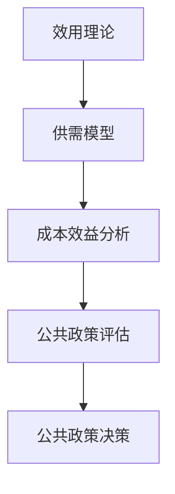
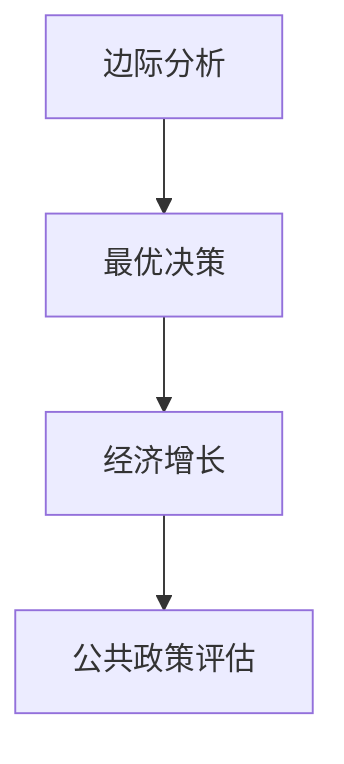
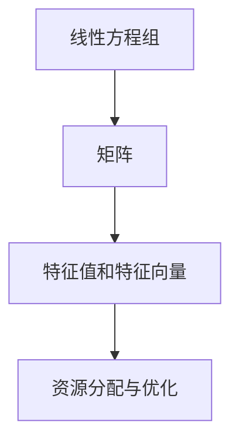

                 

### 第一部分：数学基础

## 第1章 数学模型与公共经济学

### 核心概念与联系

数学模型是经济学研究的重要工具，尤其是在公共经济学领域，它帮助我们理解经济现象、预测行为，以及评估政策的效果。以下是数学模型在公共经济学中应用的核心概念及其相互联系：

1. **效用理论**：描述个体在面临不同选择时如何最大化自己的满足度或效用。  
2. **供需模型**：分析商品或服务的需求量和供给量之间的关系，帮助理解市场价格的形成。  
3. **成本效益分析**：比较不同政策的成本和效益，以评估其经济可行性。

**Mermaid 流程图**：



### 核心算法原理讲解

**效用理论**中的决策过程可以用以下伪代码表示：

```python
# 假设有两个选择：A 和 B
choices = ["A", "B"]

# 用户对每个选择的效用
utilities = {"A": 5, "B": 3}

# 选择效用最高的选项
best_choice = max(utilities, key=utilities.get)

print(f"The best choice is: {best_choice}")
```

### 数学模型和数学公式 & 详细讲解 & 举例说明

**供需模型**可以用以下数学公式表示：

$$
Q_d = Q_s
$$

其中，$Q_d$ 是需求量，$Q_s$ 是供给量。

**举例说明**：

假设某种商品的需求函数为 $Q_d = 100 - P$，供给函数为 $Q_s = 50 + P$。我们可以通过求解以下方程组来找到市场均衡价格 $P$：

$$
\begin{cases}
Q_d = Q_s \\
Q_d = 100 - P \\
Q_s = 50 + P
\end{cases}
$$

将需求函数和供给函数代入第一个方程，得到：

$$
100 - P = 50 + P
$$

解得 $P = 25$，这是市场均衡价格。

### 项目实战

以下是一个简单的成本效益分析的Python代码实例：

```python
# 成本
cost = {
    "A": 1000,
    "B": 1500
}

# 效益
benefit = {
    "A": 2000,
    "B": 2500
}

# 计算成本效益比
cbr = {policy: benefit[policy] / cost[policy] for policy in ["A", "B"]}

# 输出最佳方案
best_policy = max(cbr, key=cbr.get)
print(f"The best policy is: {best_policy} with a CBR of {cbr[best_policy]}")
```

### 小结

本章介绍了数学模型在公共经济学中的应用，包括效用理论、供需模型和成本效益分析。我们通过流程图展示了这些概念之间的联系，并使用伪代码和数学公式详细讲解了它们的原理。项目实战部分提供了具体的代码示例，帮助读者理解如何在实际中应用这些数学模型。

## 第2章 微积分与公共经济学

### 核心概念与联系

微积分在公共经济学中的应用非常广泛，它帮助我们理解经济行为的变化趋势和动态过程。以下是微积分在公共经济学中应用的核心概念及其相互联系：

1. **边际分析**：研究经济变量微小变化对整体经济影响的过程。  
2. **最优决策**：使用微积分工具寻找最优经济决策。  
3. **经济增长**：分析经济增长的动态过程和影响因素。

**Mermaid 流程图**：



### 核心算法原理讲解

**边际分析**中的核心算法原理是边际效用。以下是一个伪代码示例：

```python
# 假设某商品的需求函数为 Q = a - bP
# 其中 a 和 b 是常数，P 是价格

def marginal_utility(Q, P, a, b):
    return a - 2 * b * P

# 计算边际效用
marginal_U = marginal_utility(Q, P, a, b)
print(f"The marginal utility is: {marginal_U}")
```

### 数学模型和数学公式 & 详细讲解 & 举例说明

**最优决策**通常涉及一阶导数和二阶导数。以下是一个使用微积分求解最优价格的例子：

$$
\frac{dU}{dP} = 0 \quad \text{和} \quad \frac{d^2U}{dP^2} > 0
$$

假设需求函数为 $Q = 100 - P$，收益函数为 $R(P) = P \cdot Q$。首先，我们计算边际收益：

$$
MR = \frac{dR}{dP} = Q + P \cdot \frac{dQ}{dP} = 100 - 2P
$$

为了找到最大收益，我们需要解方程 $MR = 0$：

$$
100 - 2P = 0
$$

解得 $P = 50$，这是最优价格。

### 项目实战

以下是一个简单的经济增长模型的Python代码实例：

```python
# 假设经济增长率为 g
g = 0.03  # 年增长率

# 起始资本 K
K = 1000

# 模型方程
def economic_growth(K, g):
    return K * (1 + g)

# 计算下一年的资本
K_next_year = economic_growth(K, g)
print(f"The capital next year is: {K_next_year}")
```

### 小结

本章介绍了微积分在公共经济学中的应用，包括边际分析、最优决策和经济增长。我们通过流程图展示了这些概念之间的联系，并使用伪代码和数学公式详细讲解了它们的原理。项目实战部分提供了具体的代码示例，帮助读者理解如何在实际中应用这些微积分工具。

## 第3章 线性代数与公共经济学

### 核心概念与联系

线性代数是公共经济学中不可或缺的工具，它用于分析多变量系统的关系和优化问题。以下是线性代数在公共经济学中应用的核心概念及其相互联系：

1. **线性方程组**：解决公共经济问题中的资源分配和预算约束问题。  
2. **矩阵**：用于描述经济系统的状态和行为。  
3. **特征值和特征向量**：分析经济系统的稳定性和灵敏度。

**Mermaid 流程图**：



### 核心算法原理讲解

**线性方程组**的求解可以用高斯消元法。以下是一个伪代码示例：

```python
# 假设有一个线性方程组
# a11 * x + a12 * y = b1
# a21 * x + a22 * y = b2

def gauss_elimination(a11, a12, b1, a21, a22, b2):
    x = (b2 * a12 - b1 * a22) / (a11 * a22 - a12 * a21)
    y = (b1 * a11 - b2 * a11) / (a11 * a22 - a12 * a21)
    return x, y

# 求解方程组
x, y = gauss_elimination(a11, a12, b1, a21, a22, b2)
print(f"The solution is: x = {x}, y = {y}")
```

### 数学模型和数学公式 & 详细讲解 & 举例说明

**矩阵**在公共经济学中的应用，如预算约束和资源分配问题。以下是一个预算约束的例子：

$$
\begin{bmatrix}
C_1 \\
C_2 \\
\end{bmatrix} =
\begin{bmatrix}
1 & 0 \\
0 & 1 \\
\end{bmatrix}
\begin{bmatrix}
I_1 \\
I_2 \\
\end{bmatrix}
$$

其中，$C_1$ 和 $C_2$ 分别表示两种消费品的消费量，$I_1$ 和 $I_2$ 分别表示两种收入的收入量。

### 项目实战

以下是一个资源分配问题的Python代码实例：

```python
# 假设有一个线性规划问题，需要最大化 z = x + y，约束条件为 Ax + By ≤ C

import numpy as np

# 系统参数
A = np.array([[1, 1], [2, 2]])
B = np.array([2, 1])
C = 5

# 求解线性规划问题
from scipy.optimize import linprog

x0_bounds = (0, None)
x1_bounds = (0, None)

result = linprog(c=[1, 1], A_ub=A, b_ub=B, bounds=[x0_bounds, x1_bounds], method='highs')

if result.success:
    print(f"Optimal value: {result.x[0] + result.x[1]}, x = {result.x[0]}, y = {result.x[1]}")
else:
    print("No optimal solution found")
```

### 小结

本章介绍了线性代数在公共经济学中的应用，包括线性方程组、矩阵和特征值。我们通过流程图展示了这些概念之间的联系，并使用伪代码和数学公式详细讲解了它们的原理。项目实战部分提供了具体的代码示例，帮助读者理解如何在实际中应用线性代数工具。

