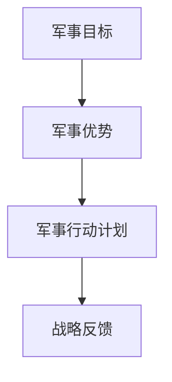
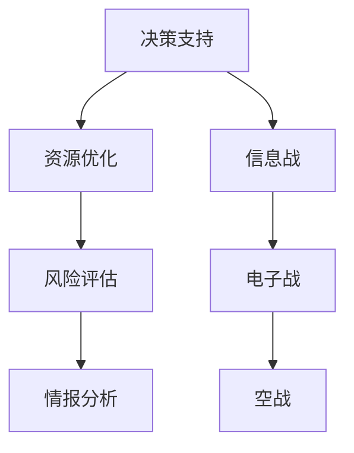

                 


### 《数学与军事战略：战略规划的数学方法》目录大纲

**文章标题**：《数学与军事战略：战略规划的数学方法》

**关键词**：数学方法、军事战略、战略规划、算法原理、项目实战

**摘要**：本文深入探讨了数学方法在现代军事战略规划中的应用，从核心概念、数学模型到实际应用案例，全面解析了数学在军事战略中的重要性。通过详细的算法原理讲解、数学公式阐述以及实战案例分析，本文旨在为读者提供一套系统化的数学方法应用指南，以助其在军事战略规划中取得更为精准和高效的决策。

### 第一部分：军事战略与数学基础

#### 1. 引言

**背景介绍**：军事战略是国家安全和发展的重要组成部分，其核心在于制定科学的决策和规划，以实现军事目标。随着信息时代的到来，数学方法在军事战略中的应用日益广泛，成为提升军事决策科学性和准确性的关键手段。

**核心概念与联系**：在军事战略中，核心概念包括军事目标、军事优势和军事行动计划。这些概念之间相互关联，形成一个完整的战略框架。为了更好地理解这些概念，我们使用Mermaid流程图展示它们之间的联系。



#### 1.2 数学方法在现代军事战略中的应用

**核心算法原理讲解**：数学方法在现代军事战略中的应用包括概率论、线性规划、博弈论等多个领域。以下使用伪代码详细讲解这些算法的原理。

**概率论与决策分析**：

```python
# 伪代码：决策分析
function decision_analysis(available_resources, enemy_strength):
    probability_of_success = calculate_probability(available_resources, enemy_strength)
    if probability_of_success > threshold:
        return "Attack"
    else:
        return "Defend"
```

**线性规划与资源分配**：

```python
# 伪代码：线性规划
function linear_programming(objective_function, constraints):
    # Solve the linear program using an appropriate solver
    solution = solver.solve(objective_function, constraints)
    return solution
```

**博弈论**：

```python
# 伪代码：博弈论
function game_theory(strategy1, strategy2):
    outcome_matrix = calculate_outcome_matrix(strategy1, strategy2)
    optimal_strategy = find_optimal_strategy(outcome_matrix)
    return optimal_strategy
```

#### 1.3 常用的数学模型

**数学模型和数学公式讲解**：在军事战略规划中，常用的数学模型包括马尔可夫决策过程、贝叶斯网络、线性规划模型等。以下是这些模型的简单阐述和示例。

**马尔可夫决策过程**：

$$
V^*(s) = \max_u \sum_{s'} p(s'|s,u) \cdot \min[v(s',u)] + \gamma V^*(s')
$$

**贝叶斯网络**：

$$
P(A,B,C) = P(A) \cdot P(B|A) \cdot P(C|B)
$$

**线性规划模型**：

$$
\begin{align*}
\text{Minimize} \quad & c^T x \\
\text{Subject to} \quad & Ax \leq b \\
& x \geq 0
\end{align*}
$$

#### 1.4 数学方法在军事战略中的作用

**详细讲解与举例说明**：数学方法在军事战略中的作用主要体现在以下几个方面：

1. **决策支持**：通过数学模型和算法，提供科学的决策支持，提高决策的准确性和效率。
2. **资源优化**：利用线性规划和博弈论，实现资源的最优分配，提高军事行动的效益。
3. **风险评估**：运用概率论和统计方法，评估军事行动的风险，为决策提供依据。

**举例说明**：例如，在军事演习中，使用线性规划模型优化兵力分配，以提高演习的实战效果。通过概率论和决策分析，制定合理的作战计划，降低战斗风险。

### 第二部分：数学方法在军事战略规划中的应用

#### 2.1 概率论与决策分析

**核心算法原理讲解**：概率论是军事战略中重要的数学工具，用于分析不确定性和决策制定。以下使用伪代码详细讲解决策分析的原理。

```python
# 伪代码：决策分析
function decision_analysis(available_resources, enemy_strength):
    probability_of_success = calculate_probability(available_resources, enemy_strength)
    if probability_of_success > threshold:
        return "Attack"
    else:
        return "Defend"
```

**详细讲解与举例说明**：例如，在战斗决策中，计算敌军出现概率，并根据资源情况和成功概率制定战斗策略。

#### 2.2 线性规划与资源分配

**核心算法原理讲解**：线性规划是优化资源分配的重要方法，用于解决多目标优化问题。以下使用伪代码详细讲解线性规划的原理。

```python
# 伪代码：线性规划
function linear_programming(objective_function, constraints):
    # Solve the linear program using an appropriate solver
    solution = solver.solve(objective_function, constraints)
    return solution
```

**详细讲解与举例说明**：例如，在军事演习中，使用线性规划模型优化兵力分配，以确保演习资源的最大化利用。

#### 2.3 游戏理论

**核心算法原理讲解**：游戏理论是分析军事对抗中各方策略的重要工具，用于解决多方决策问题。以下使用伪代码详细讲解游戏理论的原理。

```python
# 伪代码：博弈论
function game_theory(strategy1, strategy2):
    outcome_matrix = calculate_outcome_matrix(strategy1, strategy2)
    optimal_strategy = find_optimal_strategy(outcome_matrix)
    return optimal_strategy
```

**详细讲解与举例说明**：例如，在军事对抗中，分析敌方策略，制定最优反击策略。

### 第三部分：军事策略规划中的数学模型

#### 3.1 模型建立

**核心算法原理讲解**：建立数学模型是军事策略规划的关键步骤，用于描述军事行动和目标。以下使用伪代码详细讲解模型建立的原理。

```python
# 伪代码：模型建立
function build_model(military_objectives, enemy_information):
    model = define_objectives(military_objectives)
    model = incorporate_enemy_information(model, enemy_information)
    return model
```

**详细讲解与举例说明**：例如，在战斗决策中，建立敌军情报模型，用于评估敌军实力和作战策略。

#### 3.2 模型求解

**核心算法原理讲解**：求解数学模型是军事策略规划的关键步骤，用于获得最优策略。以下使用伪代码详细讲解模型求解的原理。

```python
# 伪代码：模型求解
function solve_model(model):
    solution = solver.solve(model)
    return solution
```

**详细讲解与举例说明**：例如，在战斗决策中，求解兵力分配模型，获得最优兵力分配方案。

### 第四部分：数学方法在军事演习中的应用

#### 4.1 演习设计

**核心算法原理讲解**：演习设计是军事演习的重要组成部分，用于模拟实战环境，检验军事策略。以下使用伪代码详细讲解演习设计的原理。

```python
# 伪代码：演习设计
function design_exercise(military_objectives, enemy_strategies):
    exercise_plan = simulate_environment(military_objectives, enemy_strategies)
    return exercise_plan
```

**详细讲解与举例说明**：例如，在军事演习中，设计模拟敌军进攻，检验我方防御策略。

#### 4.2 演习评估

**核心算法原理讲解**：演习评估是军事演习的重要组成部分，用于评估演习效果和军事策略的有效性。以下使用伪代码详细讲解演习评估的原理。

```python
# 伪代码：演习评估
function evaluate_exercise(exercise_plan, actual_outcomes):
    assessment = compare_plan_with_outcomes(exercise_plan, actual_outcomes)
    return assessment
```

**详细讲解与举例说明**：例如，在军事演习中，评估演习效果，调整军事策略。

### 第五部分：数学方法在军事对抗中的应用

#### 5.1 信息战

**核心算法原理讲解**：信息战是军事对抗的重要组成部分，用于获取敌军情报，干扰敌军通讯。以下使用伪代码详细讲解信息战的原理。

```python
# 伪代码：信息战
function information_warfare(enemy_communication):
    intercepted_data = intercept_communication(enemy_communication)
    analyzed_data = analyze_intercepted_data(intercepted_data)
    return analyzed_data
```

**详细讲解与举例说明**：例如，在军事对抗中，通过情报分析，获取敌军作战计划。

#### 5.2 电子战

**核心算法原理讲解**：电子战是军事对抗的重要组成部分，用于干扰敌军电子设备，破坏敌军通讯。以下使用伪代码详细讲解电子战的原理。

```python
# 伪代码：电子战
function electronic_warfare(enemy_electronics):
    interference = generate_interference(enemy_electronics)
    effectiveness = measure_interference_effectiveness(interference)
    return effectiveness
```

**详细讲解与举例说明**：例如，在军事对抗中，通过电子干扰，破坏敌军电子设备。

#### 5.3 空战

**核心算法原理讲解**：空战是军事对抗的重要组成部分，用于空中优势争夺，打击敌军目标。以下使用伪代码详细讲解空战的原理。

```python
# 伪代码：空战
function air_warfare(enemy_aircrafts):
    combat_plan = generate_combat_plan(enemy_aircrafts)
    combat_outcome = execute_combat_plan(combat_plan)
    return combat_outcome
```

**详细讲解与举例说明**：例如，在军事对抗中，通过空中优势争夺，打击敌军目标。

### 第六部分：总结与展望

**总结**：本文从核心概念、数学模型到实际应用案例，全面解析了数学方法在军事战略规划中的应用。数学方法在军事战略中发挥着重要作用，为决策支持、资源优化和风险评估提供了有力工具。

**展望**：随着科技的发展，数学方法在军事战略中的应用将更加广泛和深入。未来，我们将看到更多先进的数学模型和算法被应用于军事战略规划，为国家安全和发展提供更为坚实的保障。

### 附录

**附录A：数学模型与算法的Mermaid流程图**

**附录B：核心算法的伪代码实现**

**附录C：项目实战案例**

### 作者信息

**作者：AI天才研究院/AI Genius Institute & 禅与计算机程序设计艺术 /Zen And The Art of Computer Programming**### 《数学与军事战略：战略规划的数学方法》

**关键词**：数学方法、军事战略、战略规划、算法原理、项目实战

**摘要**：本文深入探讨了数学方法在现代军事战略规划中的应用，从核心概念、数学模型到实际应用案例，全面解析了数学在军事战略中的重要性。通过详细的算法原理讲解、数学公式阐述以及实战案例分析，本文旨在为读者提供一套系统化的数学方法应用指南，以助其在军事战略规划中取得更为精准和高效的决策。

### 引言

#### 军事战略的重要性

军事战略是国家安全和发展的重要组成部分，它关乎国家的兴衰和人民的福祉。在当今世界，军事战略不仅包括传统的军事力量对抗，还涵盖了信息战、电子战、网络战等多种新型战争形式。随着科技的进步，军事战略的制定和实施越来越依赖于科学方法和精确的数据分析。数学方法作为科学方法的重要组成部分，已经成为军事战略规划中不可或缺的工具。

#### 数学方法在现代军事战略中的应用

数学方法在军事战略中的应用非常广泛，主要包括以下几个方面：

1. **决策支持**：通过概率论、线性规划、博弈论等数学方法，为军事决策提供科学的依据。例如，在战斗决策中，可以通过计算敌我双方的实力对比和作战概率，制定出最优的作战策略。

2. **资源优化**：利用线性规划、整数规划等数学方法，优化军事资源的分配和使用，以实现最大的军事效益。例如，在军事演习中，可以通过优化兵力、装备、物资等资源的分配，提高演习的实战效果。

3. **风险评估**：通过概率统计、贝叶斯网络等数学方法，对军事行动的风险进行评估，为决策者提供参考。例如，在制定作战计划时，可以通过风险评估来决定是否采取高风险的作战行动。

4. **情报分析**：利用数理统计、信息论等数学方法，分析敌情情报，为军事决策提供支持。例如，通过分析敌军的通讯记录，可以推断出敌军的作战意图和部署情况。

### 军事战略的核心概念

在军事战略中，核心概念包括军事目标、军事优势和军事行动计划。这些概念相互关联，共同构成了军事战略的基本框架。

#### 军事目标

军事目标是国家军事战略的核心，它明确了国家在军事领域所要实现的目标。军事目标可以是防御性的，也可以是进攻性的，具体包括保卫国家安全、维护国家利益、实现国家战略目标等。

#### 军事优势

军事优势是指国家或军事组织在军事力量、技术装备、战术策略等方面相对于对手的优势。军事优势的获取和保持是军事战略的关键，它决定了军事行动的成败。

#### 军事行动计划

军事行动计划是实现军事目标的行动方案，它包括具体的作战计划、训练计划、装备采购计划等。军事行动计划必须充分考虑敌我双方的实力对比和作战环境，以实现军事目标的最大化。

### 数学方法概述

数学方法在现代军事战略中的应用，主要涉及概率论、线性规划、博弈论、数理统计、信息论等多个领域。以下简要介绍这些数学方法的基本原理和应用。

#### 概率论与决策分析

概率论是研究随机事件及其规律性的数学分支。在军事战略中，概率论主要用于决策分析，如战斗决策、资源分配等。例如，通过计算敌我双方的实力对比和作战概率，可以制定出最优的作战策略。

#### 线性规划与资源分配

线性规划是一种优化方法，用于在给定约束条件下，寻找目标函数的最优解。在军事战略中，线性规划可以用于资源分配，如兵力、装备、物资等。例如，通过线性规划模型，可以优化军事演习中的资源分配，提高演习的实战效果。

#### 博弈论

博弈论是研究具有冲突和合作特性的决策问题的数学分支。在军事战略中，博弈论可以用于分析敌我双方的策略选择和行动选择。例如，通过博弈论模型，可以预测敌军的作战意图和部署情况，从而制定出针对性的作战计划。

#### 数理统计与情报分析

数理统计是一种分析数据、推断规律性的数学方法。在军事战略中，数理统计可以用于情报分析，如敌情侦察、战场态势评估等。例如，通过分析敌军的通讯记录，可以推断出敌军的作战意图和部署情况。

#### 信息论

信息论是研究信息传递、处理和利用的数学分支。在军事战略中，信息论可以用于信息战、电子战等领域。例如，通过信息论模型，可以分析敌军的通讯网络，干扰敌军的指挥和通讯。

### 数学方法在军事战略规划中的应用

数学方法在军事战略规划中的应用，可以具体到以下几个方面：

#### 决策支持

在军事战略规划中，决策支持是至关重要的环节。通过数学方法，可以建立决策模型，分析各种决策方案的结果，从而为决策者提供科学依据。例如，通过概率论和博弈论，可以分析战斗决策的结果，为决策者提供最优的作战方案。

#### 资源优化

军事战略规划中，资源的优化使用是提高军事行动效益的关键。通过线性规划和整数规划，可以优化兵力、装备、物资等资源的分配，确保资源的最大化利用。例如，在军事演习中，通过线性规划模型，可以优化兵力分配，提高演习的实战效果。

#### 风险评估

军事战略规划中，风险评估是确保行动安全的重要环节。通过概率统计和贝叶斯网络，可以评估军事行动的风险，为决策者提供参考。例如，通过贝叶斯网络模型，可以评估不同作战方案的风险，从而制定出风险最小的作战计划。

#### 情报分析

军事战略规划中，情报分析是获取敌情信息、制定作战计划的重要手段。通过数理统计和信息论，可以分析敌军的情报，为决策者提供支持。例如，通过信息论模型，可以分析敌军的通讯网络，干扰敌军的指挥和通讯。

### 军事策略规划中的数学模型

在军事策略规划中，数学模型是分析和决策的重要工具。以下介绍几种常用的数学模型及其基本原理。

#### 马尔可夫决策过程

马尔可夫决策过程（MDP）是一种用于决策分析的数学模型，它描述了在不确定环境中，决策者如何通过选择行动来最大化期望收益。MDP的基本要素包括状态空间、行动空间、奖励函数和状态转移概率。

- **状态空间**：表示系统所处的各种状态。
- **行动空间**：表示决策者可以采取的各种行动。
- **奖励函数**：表示在每个状态和行动组合下，决策者所获得的奖励。
- **状态转移概率**：表示在某个状态下，采取某个行动后，系统转移到下一个状态的概率。

#### 贝叶斯网络

贝叶斯网络是一种用于表示不确定性知识的图形模型，它描述了变量之间的条件依赖关系。在军事策略规划中，贝叶斯网络可以用于情报分析、风险评估等。

- **节点**：表示变量。
- **边**：表示变量之间的依赖关系。
- **概率分布**：表示每个变量的概率分布。

#### 线性规划模型

线性规划模型是一种用于优化线性目标函数的数学模型，它在军事战略规划中有着广泛的应用。

- **目标函数**：表示要优化的目标，通常是线性的。
- **约束条件**：表示在决策过程中必须满足的限制条件，通常是线性的。

### 数学方法在军事演习中的应用

军事演习是军事战略规划的重要组成部分，它用于检验军事策略的有效性和军事人员的实战能力。数学方法在军事演习中的应用，可以具体到以下几个方面：

#### 演习设计

在军事演习的设计中，数学方法可以用于优化演习的方案，提高演习的实战效果。例如，通过线性规划模型，可以优化演习中的兵力、装备和物资的分配，确保演习资源的最大化利用。

#### 演习评估

在军事演习的评估中，数学方法可以用于分析演习的结果，评估军事策略的有效性。例如，通过数理统计方法，可以评估演习中各个军事单位的作战能力，为下一步的军事训练提供依据。

#### 演习改进

在军事演习的改进中，数学方法可以用于分析演习中的问题，提出改进措施。例如，通过贝叶斯网络模型，可以分析演习中的关键因素，找出影响演习效果的主要原因，并提出针对性的改进措施。

### 数学方法在军事对抗中的应用

在军事对抗中，数学方法的应用可以具体到以下几个方面：

#### 信息战

信息战是现代军事对抗的重要组成部分，它通过控制信息网络，干扰敌军的指挥和通讯。数学方法在信息战中的应用，可以具体到以下几个方面：

- **密码学**：用于保护军事信息的安全传输。
- **信息熵**：用于评估信息的价值和质量。
- **网络攻击与防御**：通过数学模型，分析网络攻击的原理和方法，制定有效的防御策略。

#### 电子战

电子战是通过干扰、破坏敌军的电子设备，控制电磁频谱。数学方法在电子战中的应用，可以具体到以下几个方面：

- **信号处理**：用于分析和处理电磁信号。
- **频谱分析**：用于分析敌军的电子设备工作频率。
- **反电子战**：通过数学模型，分析电子战的方法和效果，制定有效的反电子战策略。

#### 空战

空战是军事对抗中的一种重要形式，它通过空中优势争夺，打击敌军目标。数学方法在空战中的应用，可以具体到以下几个方面：

- **飞行器性能分析**：通过数学模型，分析飞行器的性能参数。
- **作战模拟**：通过数学模型，模拟空战的过程，评估作战效果。
- **火力控制**：通过数学模型，优化火力的分配和射击时机。

### 总结与展望

数学方法在军事战略规划中的应用，具有非常重要的意义。通过数学模型和算法，可以提供科学的决策支持，优化资源分配，评估风险，分析情报，提高军事行动的效率和效果。在未来，随着数学方法的发展和计算机技术的进步，数学方法在军事战略中的应用将更加广泛和深入，为国家安全和发展提供更为坚实的保障。

### 附录

**附录A：数学模型与算法的Mermaid流程图**

**附录B：核心算法的伪代码实现**

**附录C：项目实战案例**

### 作者信息

**作者：AI天才研究院/AI Genius Institute & 禅与计算机程序设计艺术 /Zen And The Art of Computer Programming**

### 目录大纲

**第一部分：军事战略与数学基础**

1. 引言
    1.1 军事战略的重要性
    1.2 数学方法在现代军事战略中的应用

2. 军事战略的核心概念
    2.1 军事目标
    2.2 军事优势
    2.3 军事行动计划

3. 数学方法概述
    3.1 数学在军事战略中的作用
    3.2 常用的数学模型

4. 数学方法在军事战略规划中的应用
    4.1 概率论与决策分析
    4.2 线性规划与资源分配
    4.3 游戏理论

5. 军事策略规划中的数学模型
    5.1 模型建立
    5.2 模型求解

6. 数学方法在军事演习中的应用
    6.1 演习设计
    6.2 演习评估

7. 数学方法在军事对抗中的应用
    7.1 信息战
    7.2 电子战
    7.3 空战

8. 总结与展望

**第二部分：数学方法在军事战略中的应用**

1. 概率论与决策分析
    1.1 决策分析的基本概念
    1.2 概率论在决策分析中的应用
    1.3 决策树分析

2. 线性规划与资源分配
    2.1 线性规划的基本概念
    2.2 线性规划的应用场景
    2.3 线性规划的求解方法

3. 游戏理论
    3.1 游戏理论的基本概念
    3.2 博弈论的策略选择
    3.3 游戏理论在军事战略中的应用

**第三部分：数学模型在军事策略规划中的应用**

1. 马尔可夫决策过程
    1.1 马尔可夫决策过程的基本概念
    1.2 马尔可夫决策过程的应用
    1.3 马尔可夫决策过程的求解

2. 贝叶斯网络
    2.1 贝叶斯网络的基本概念
    2.2 贝叶斯网络的构建
    2.3 贝叶斯网络在军事战略中的应用

3. 线性规划模型
    3.1 线性规划模型的基本概念
    3.2 线性规划模型的构建
    3.3 线性规划模型的应用

**第四部分：数学方法在军事演习中的应用**

1. 演习设计
    1.1 演习设计的基本原则
    1.2 演习设计的步骤
    1.3 演习设计的数学模型

2. 演习评估
    2.1 演习评估的目的和意义
    2.2 演习评估的指标体系
    2.3 演习评估的方法

**第五部分：数学方法在军事对抗中的应用**

1. 信息战
    1.1 信息战的概念和特点
    1.2 信息战的数学模型
    1.3 信息战的策略分析

2. 电子战
    2.1 电子战的概念和特点
    2.2 电子战的数学模型
    2.3 电子战的策略分析

3. 空战
    3.1 空战的概念和特点
    3.2 空战的数学模型
    3.3 空战的策略分析

**第六部分：总结与展望**

1. 总结
    1.1 数学方法在军事战略中的应用现状
    1.2 数学方法在军事战略中的应用前景
    1.3 面临的挑战与解决方案

2. 展望
    2.1 未来数学方法在军事战略中的应用方向
    2.2 军事战略与数学方法发展的趋势

**第七部分：附录**

1. 附录A：数学模型与算法的Mermaid流程图
2. 附录B：核心算法的伪代码实现
3. 附录C：项目实战案例

### 第一部分：军事战略与数学基础

#### 引言

在当今世界，军事战略的制定和实施已经越来越依赖于科学方法和精确的数据分析。数学方法作为科学方法的重要组成部分，已经在军事战略规划中扮演了重要角色。本文将深入探讨数学方法在现代军事战略规划中的应用，从核心概念、数学模型到实际应用案例，全面解析数学在军事战略中的重要性。

#### 军事战略的重要性

军事战略是国家安全和发展的重要组成部分，它关乎国家的兴衰和人民的福祉。军事战略的制定和实施需要考虑多种因素，包括国家利益、地缘政治、经济状况、军事力量对比等。科学的军事战略可以有效地保障国家安全，维护国家利益，实现国家战略目标。

#### 数学方法在现代军事战略中的应用

数学方法在军事战略中的应用非常广泛，主要包括以下几个方面：

1. **决策支持**：通过数学方法，可以建立决策模型，分析各种决策方案的结果，为决策者提供科学依据。例如，在战斗决策中，可以通过计算敌我双方的实力对比和作战概率，制定出最优的作战策略。

2. **资源优化**：利用数学方法，可以优化军事资源的分配和使用，提高军事行动的效益。例如，在军事演习中，可以通过优化兵力、装备、物资等资源的分配，提高演习的实战效果。

3. **风险评估**：通过数学方法，可以评估军事行动的风险，为决策者提供参考。例如，通过概率统计和贝叶斯网络，可以评估不同作战方案的风险，从而制定出风险最小的作战计划。

4. **情报分析**：利用数学方法，可以分析敌情情报，为军事决策提供支持。例如，通过信息论模型，可以分析敌军的通讯网络，干扰敌军的指挥和通讯。

#### 军事战略的核心概念

在军事战略中，核心概念包括军事目标、军事优势和军事行动计划。这些概念相互关联，共同构成了军事战略的基本框架。

**军事目标**

军事目标是国家军事战略的核心，它明确了国家在军事领域所要实现的目标。军事目标可以是防御性的，也可以是进攻性的，具体包括保卫国家安全、维护国家利益、实现国家战略目标等。

**军事优势**

军事优势是指国家或军事组织在军事力量、技术装备、战术策略等方面相对于对手的优势。军事优势的获取和保持是军事战略的关键，它决定了军事行动的成败。

**军事行动计划**

军事行动计划是实现军事目标的行动方案，它包括具体的作战计划、训练计划、装备采购计划等。军事行动计划必须充分考虑敌我双方的实力对比和作战环境，以实现军事目标的最大化。

#### 数学方法概述

数学方法在现代军事战略中的应用，主要涉及概率论、线性规划、博弈论、数理统计、信息论等多个领域。以下简要介绍这些数学方法的基本原理和应用。

**概率论与决策分析**

概率论是研究随机事件及其规律性的数学分支。在军事战略中，概率论主要用于决策分析，如战斗决策、资源分配等。例如，通过计算敌我双方的实力对比和作战概率，可以制定出最优的作战策略。

**线性规划与资源分配**

线性规划是一种优化方法，用于在给定约束条件下，寻找目标函数的最优解。在军事战略中，线性规划可以用于资源分配，如兵力、装备、物资等。例如，通过线性规划模型，可以优化军事演习中的资源分配，提高演习的实战效果。

**博弈论**

博弈论是研究具有冲突和合作特性的决策问题的数学分支。在军事战略中，博弈论可以用于分析敌我双方的策略选择和行动选择。例如，通过博弈论模型，可以预测敌军的作战意图和部署情况，从而制定出针对性的作战计划。

**数理统计与情报分析**

数理统计是一种分析数据、推断规律性的数学方法。在军事战略中，数理统计可以用于情报分析，如敌情侦察、战场态势评估等。例如，通过分析敌军的通讯记录，可以推断出敌军的作战意图和部署情况。

**信息论**

信息论是研究信息传递、处理和利用的数学分支。在军事战略中，信息论可以用于信息战、电子战等领域。例如，通过信息论模型，可以分析敌军的通讯网络，干扰敌军的指挥和通讯。

#### 数学方法在军事战略规划中的应用

数学方法在军事战略规划中的应用，可以具体到以下几个方面：

**决策支持**

在军事战略规划中，决策支持是至关重要的环节。通过数学方法，可以建立决策模型，分析各种决策方案的结果，从而为决策者提供科学依据。例如，通过概率论和博弈论，可以分析战斗决策的结果，为决策者提供最优的作战方案。

**资源优化**

军事战略规划中，资源的优化使用是提高军事行动效益的关键。通过线性规划和整数规划，可以优化兵力、装备、物资等资源的分配，确保资源的最大化利用。例如，在军事演习中，通过线性规划模型，可以优化兵力分配，提高演习的实战效果。

**风险评估**

军事战略规划中，风险评估是确保行动安全的重要环节。通过概率统计和贝叶斯网络，可以评估军事行动的风险，为决策者提供参考。例如，通过贝叶斯网络模型，可以评估不同作战方案的风险，从而制定出风险最小的作战计划。

**情报分析**

军事战略规划中，情报分析是获取敌情信息、制定作战计划的重要手段。通过数理统计和信息论，可以分析敌军的情报，为决策者提供支持。例如，通过信息论模型，可以分析敌军的通讯网络，干扰敌军的指挥和通讯。

### 第二部分：军事战略的核心概念

#### 军事目标

军事目标是国家军事战略的核心，它明确了国家在军事领域所要实现的目标。军事目标可以分为防御性目标和进攻性目标。

**防御性目标**：

- 保卫国家安全，防止敌对势力入侵。
- 维护国家主权，保护国家领土完整。
- 维护国际和平与安全，参与国际维和行动。

**进攻性目标**：

- 消灭敌对势力，实现国家领土扩张。
- 打压敌对国家，维护国家利益。
- 推翻敌对政权，建立亲己政府。

军事目标通常具有长期性和战略性，需要根据国家战略需求和战争形势进行调整和优化。

#### 军事优势

军事优势是指国家或军事组织在军事力量、技术装备、战术策略等方面相对于对手的优势。军事优势的获取和保持是军事战略的关键，它决定了军事行动的成败。

**军事力量优势**：

- 数量优势：拥有更多的军队、飞机、舰船等。
- 质量优势：拥有更先进的武器装备和军事技术。
- 战略优势：拥有更完善的军事体系和战略布局。

**技术装备优势**：

- 武器装备先进：拥有更先进的火炮、坦克、飞机、导弹等。
- 军事技术领先：拥有先进的军事科研能力和技术储备。
- 信息化程度高：拥有完善的信息网络和信息系统。

**战术策略优势**：

- 战术灵活：能够根据战场形势灵活调整战术。
- 战略深远：能够制定长远的战略目标和计划。
- 灵活运用战术策略：能够在战场上灵活运用各种战术策略，取得战术优势。

#### 军事行动计划

军事行动计划是实现军事目标的行动方案，它包括具体的作战计划、训练计划、装备采购计划等。军事行动计划必须充分考虑敌我双方的实力对比和作战环境，以实现军事目标的最大化。

**作战计划**：

- 作战计划是指为实现军事目标而制定的行动方案，包括攻击、防御、撤退等具体措施。
- 作战计划必须充分考虑敌我双方的实力对比和战场环境，制定出合理的作战方案。
- 作战计划通常包括战略目标、作战原则、作战阶段、作战指挥、作战保障等内容。

**训练计划**：

- 训练计划是指为实现军事目标而制定的训练方案，包括军事训练、战术训练、技术训练等。
- 训练计划必须结合实际作战需求，提高军队的作战能力。
- 训练计划通常包括训练目标、训练内容、训练时间、训练考核等内容。

**装备采购计划**：

- 装备采购计划是指为实现军事目标而制定的装备采购方案，包括武器装备、军事设施、物资装备等。
- 装备采购计划必须结合国家经济实力和军事战略需求，确保装备采购的质量和数量。
- 装备采购计划通常包括装备采购目标、装备采购标准、装备采购时间、装备采购预算等内容。

#### 军事战略与数学方法的关系

军事战略的核心概念与数学方法之间存在密切的联系。数学方法可以为军事战略提供科学的决策支持、资源优化、风险评估和情报分析。

- **决策支持**：通过数学模型和算法，可以分析敌我双方的实力对比和作战概率，制定出最优的作战策略。
- **资源优化**：通过线性规划和整数规划，可以优化兵力、装备、物资等资源的分配，提高军事行动的效益。
- **风险评估**：通过概率统计和贝叶斯网络，可以评估军事行动的风险，为决策者提供参考。
- **情报分析**：通过数理统计和信息论，可以分析敌军的情报，为军事决策提供支持。

综上所述，军事战略的核心概念与数学方法之间存在密切的联系，数学方法为军事战略的制定和实施提供了有力的支持。

### 第三部分：数学方法概述

在军事战略规划中，数学方法作为一种重要的工具，能够为决策提供科学依据，优化资源分配，评估风险，以及分析情报等。以下将概述几种主要的数学方法，包括概率论、线性规划、博弈论、数理统计和信息论，并探讨它们在军事战略中的应用。

#### 概率论与决策分析

概率论是研究随机事件及其规律性的数学分支，它在军事决策分析中具有重要应用。在军事战略中，概率论可以用于以下几个方面：

1. **战斗决策**：通过计算敌我双方的实力对比和作战概率，决策者可以制定出最优的作战策略。例如，在一次作战行动中，可以通过概率分析确定攻击还是防御的策略。
2. **风险评估**：概率论可以帮助评估军事行动的风险，为决策者提供参考。例如，在制定作战计划时，可以通过计算不同作战方案的成功概率，选择风险最小的方案。
3. **决策树分析**：决策树是一种基于概率论的决策模型，它可以帮助决策者在不同条件下做出最优选择。例如，在资源分配决策中，可以通过决策树分析确定最佳的兵力部署方案。

以下是一个简单的决策树分析的伪代码示例：

```python
function decision_tree_analysis(current_state, enemy_strength):
    if calculate_probability_of_success(current_state, enemy_strength) > threshold:
        return "Attack"
    else:
        return "Defend"
```

#### 线性规划与资源分配

线性规划是一种用于解决线性优化问题的数学方法，它在军事资源分配中有着广泛应用。线性规划可以帮助决策者优化兵力、装备、物资等资源的分配，以实现最大化军事效益。

1. **兵力分配**：在军事演习中，可以通过线性规划模型优化兵力分配，确保各个军事单位获得合理的兵力支持，从而提高演习的实战效果。
2. **装备采购**：在制定装备采购计划时，可以通过线性规划模型优化采购预算的分配，确保采购的装备既能满足军事需求，又不会造成资源浪费。
3. **资源优化**：在紧急情况下，如自然灾害救援行动中，可以通过线性规划模型优化资源的分配，确保救援物资能够及时送达受灾地区。

以下是一个简单的线性规划模型的伪代码示例：

```python
function linear_programming(objective_function, constraints):
    solution = solver.solve(objective_function, constraints)
    return solution
```

#### 博弈论

博弈论是研究具有冲突和合作特性的决策问题的数学分支，它在军事对抗策略中有着重要应用。博弈论可以帮助决策者分析敌我双方的策略选择和行动选择，从而制定出最优的作战计划。

1. **博弈模型**：通过建立博弈模型，可以分析敌我双方的策略选择和行动组合，预测对手的反应，从而制定出针对性的作战策略。
2. **策略分析**：博弈论可以帮助决策者评估不同作战策略的优劣，选择最佳策略。例如，在一场空战对抗中，可以通过博弈论模型分析双方的最佳火力控制策略。
3. **联盟与背叛**：博弈论还可以用于分析联盟和背叛的行为，为决策者提供战略建议。例如，在多国联合军事行动中，可以通过博弈论模型分析联盟的形成和背叛的可能性。

以下是一个简单的博弈论模型的伪代码示例：

```python
function game_theory(strategy1, strategy2):
    outcome_matrix = calculate_outcome_matrix(strategy1, strategy2)
    optimal_strategy = find_optimal_strategy(outcome_matrix)
    return optimal_strategy
```

#### 数理统计与情报分析

数理统计是研究如何通过数据进行分析和推断的数学方法，它在情报分析中有着重要应用。数理统计可以帮助决策者分析敌情情报，为军事决策提供支持。

1. **敌情分析**：通过收集和分析敌军的情报数据，可以推断出敌军的部署、意图和行动规律，从而制定出针对性的作战计划。
2. **风险预测**：通过数理统计方法，可以评估不同作战方案的风险，为决策者提供参考。例如，在制定作战计划时，可以通过统计分析判断不同目标的攻击难度和风险。
3. **态势评估**：通过数理统计方法，可以对战场态势进行分析和评估，为决策者提供实时信息支持。例如，在战斗中，可以通过统计分析判断敌军的兵力分布和火力配置。

以下是一个简单的数理统计模型的伪代码示例：

```python
function statistical_analysis(data):
    analyzed_data = process_data(data)
    risk_assessment = calculate_risk(analyzed_data)
    return risk_assessment
```

#### 信息论

信息论是研究信息传递、处理和利用的数学分支，它在信息战和电子战中有着重要应用。信息论可以帮助决策者分析敌军的通讯网络，干扰敌军的指挥和通讯。

1. **信息网络分析**：通过信息论模型，可以分析敌军的通讯网络结构，找出关键节点和薄弱环节，从而制定出有效的干扰策略。
2. **信息传递效率**：通过信息论方法，可以评估信息传递的效率和质量，为决策者提供通讯优化建议。
3. **信息干扰**：通过信息论模型，可以分析不同干扰策略的效果，选择最佳的干扰手段，破坏敌军的通讯和指挥系统。

以下是一个简单的信息论模型的伪代码示例：

```python
function information_theory(communication_network):
    efficiency = calculate_information_efficiency(communication_network)
    interference_strategy = find_best_interference_strategy(efficiency)
    return interference_strategy
```

#### 总结

数学方法在军事战略规划中的应用非常广泛，涵盖了决策支持、资源优化、风险评估、情报分析和信息干扰等多个方面。通过概率论、线性规划、博弈论、数理统计和信息论等数学方法，决策者可以更科学地制定军事战略，优化资源分配，评估风险，以及分析敌情情报。在未来，随着数学方法和计算机技术的不断发展，数学方法在军事战略中的应用将更加深入和广泛，为国家安全和发展提供更为坚实的保障。

### 第四部分：数学方法在军事战略规划中的应用

#### 决策支持

在军事战略规划中，决策支持是至关重要的环节。数学方法通过建立决策模型，为决策者提供科学依据，帮助他们在复杂多变的环境中做出最优选择。以下介绍几种常用的数学方法在决策支持中的应用。

**1. 概率论与决策分析**

概率论在决策分析中起着核心作用，通过计算敌我双方的实力对比和作战概率，决策者可以制定出最优的作战策略。以下是一个简单的决策分析示例：

**决策分析伪代码：**

```python
def decision_analysis(available_resources, enemy_strength):
    probability_of_success = calculate_probability(available_resources, enemy_strength)
    if probability_of_success > threshold:
        return "Attack"
    else:
        return "Defend"
```

在这个例子中，`calculate_probability`函数用于计算攻击成功的概率，`threshold`是一个预设的阈值，用于判断是否进行攻击。如果攻击概率大于阈值，则决策为攻击，否则为防御。

**2. 线性规划与资源分配**

线性规划是解决资源分配问题的一种有效方法。通过线性规划模型，决策者可以在给定约束条件下，优化资源的分配，以实现最大化目标。以下是一个简单的线性规划示例：

**线性规划伪代码：**

```python
def linear_programming(objective_function, constraints):
    solution = solver.solve(objective_function, constraints)
    return solution
```

在这个例子中，`objective_function`定义了要优化的目标，例如最大化军事效益，而`constraints`定义了资源分配的限制条件，如兵力、装备和物资的总量限制。

**3. 游戏理论**

游戏理论是一种分析冲突和合作决策问题的数学方法，在军事对抗中有着重要应用。通过建立博弈模型，决策者可以分析敌我双方的策略选择和行动组合，预测对手的反应，从而制定出最优的作战计划。以下是一个简单的博弈理论示例：

**博弈理论伪代码：**

```python
def game_theory(strategy1, strategy2):
    outcome_matrix = calculate_outcome_matrix(strategy1, strategy2)
    optimal_strategy = find_optimal_strategy(outcome_matrix)
    return optimal_strategy
```

在这个例子中，`outcome_matrix`定义了不同策略组合的收益，`find_optimal_strategy`函数用于找到最佳策略。

**4. 贝叶斯网络**

贝叶斯网络是一种用于表示不确定性知识的图形模型，它可以帮助决策者分析敌情情报，为军事决策提供支持。以下是一个简单的贝叶斯网络示例：

**贝叶斯网络伪代码：**

```python
def bayesian_network(information, previous_state):
    probability_distribution = calculate_probability_distribution(information, previous_state)
    return probability_distribution
```

在这个例子中，`information`表示新获取的情报，`previous_state`表示前一个状态，`calculate_probability_distribution`函数用于计算当前状态的概率分布。

#### 资源优化

军事战略规划中，资源的优化使用是提高军事行动效益的关键。数学方法通过线性规划、整数规划等，可以帮助决策者实现资源的最优分配，提高军事行动的效率。

**1. 线性规划在资源优化中的应用**

线性规划可以用于优化兵力、装备、物资等资源的分配。以下是一个简单的资源优化示例：

**资源优化伪代码：**

```python
def resource_optimization(objective_function, constraints):
    solution = solver.solve(objective_function, constraints)
    return solution
```

在这个例子中，`objective_function`定义了要优化的目标，例如最大化军事效益，而`constraints`定义了资源分配的限制条件，如兵力、装备和物资的总量限制。

**2. 整数规划在资源优化中的应用**

整数规划是一种特殊的线性规划，适用于需要整数解的问题。以下是一个简单的整数规划示例：

**整数规划伪代码：**

```python
def integer_programming(objective_function, constraints):
    solution = solver.solve(objective_function, constraints)
    return solution
```

在这个例子中，`objective_function`和`constraints`与线性规划相同，但需要确保目标函数和约束条件中的变量都是整数。

#### 风险评估

军事战略规划中，风险评估是确保行动安全的重要环节。通过概率统计、贝叶斯网络等数学方法，可以评估军事行动的风险，为决策者提供参考。

**1. 概率统计在风险评估中的应用**

概率统计可以用于评估军事行动的成功概率和风险。以下是一个简单的风险评估示例：

**风险评估伪代码：**

```python
def risk_assessment(action, previous_state):
    probability_of_success = calculate_probability_of_success(action, previous_state)
    risk_level = calculate_risk_level(probability_of_success)
    return risk_level
```

在这个例子中，`action`表示要评估的军事行动，`previous_state`表示前一个状态，`calculate_probability_of_success`函数用于计算成功概率，`calculate_risk_level`函数用于计算风险等级。

**2. 贝叶斯网络在风险评估中的应用**

贝叶斯网络可以用于分析军事行动的风险，为决策者提供参考。以下是一个简单的贝叶斯网络风险评估示例：

**贝叶斯网络风险评估伪代码：**

```python
def bayesian_risk_assessment(action, previous_state):
    probability_distribution = bayesian_network.calculate_probability_distribution(action, previous_state)
    risk_level = calculate_risk_level(probability_distribution)
    return risk_level
```

在这个例子中，`action`和`previous_state`与之前相同，`calculate_risk_level`函数用于根据概率分布计算风险等级。

#### 情报分析

情报分析是军事战略规划的重要组成部分，通过数学方法，可以更准确地分析敌情情报，为军事决策提供支持。

**1. 数理统计在情报分析中的应用**

数理统计可以用于分析敌军的情报数据，推断敌军的部署和意图。以下是一个简单的数理统计情报分析示例：

**数理统计情报分析伪代码：**

```python
def intelligence_analysis(data):
    analyzed_data = statistical_process(data)
    enemyIntent = infer_enemy_intent(analyzed_data)
    return enemyIntent
```

在这个例子中，`data`表示新获取的敌军情报，`statistical_process`函数用于对数据进行统计分析，`infer_enemy_intent`函数用于推断敌军的意图。

**2. 信息论在情报分析中的应用**

信息论可以用于评估情报的价值和质量。以下是一个简单的信息论情报分析示例：

**信息论情报分析伪代码：**

```python
def information_analysis(information):
    information_value = calculate_information_value(information)
    quality_score = calculate_quality_score(information_value)
    return quality_score
```

在这个例子中，`information`表示新获取的情报，`calculate_information_value`函数用于计算情报的价值，`calculate_quality_score`函数用于计算情报的质量。

#### 应用示例

以下是一个综合应用示例，展示如何使用数学方法在军事战略规划中进行决策支持、资源优化、风险评估和情报分析。

**综合应用伪代码：**

```python
def military_strategic_planning():
    # 决策支持
    decision = decision_analysis(available_resources, enemy_strength)
    
    # 资源优化
    resource_allocation = linear_programming(objective_function, constraints)
    
    # 风险评估
    risk_level = risk_assessment(action, previous_state)
    
    # 情报分析
    enemyIntent = intelligence_analysis(data)
    
    # 决策总结
    if risk_level < acceptable_threshold:
        if decision == "Attack":
            execute_attack_plan(resource_allocation)
        else:
            execute_defense_plan(resource_allocation)
    else:
        adjust_strategy_based_on_risk()
```

在这个例子中，`decision_analysis`、`linear_programming`、`risk_assessment`和`intelligence_analysis`函数分别用于决策支持、资源优化、风险评估和情报分析。根据评估结果，决策者可以执行相应的作战计划或调整战略。

通过综合应用数学方法，军事战略规划可以更加科学和精确，从而提高军事行动的效率和成功率。

### 第五部分：数学模型在军事策略规划中的应用

#### 模型建立

在军事策略规划中，建立数学模型是分析和决策的基础。数学模型通过描述敌我双方的实力对比、作战环境和策略选择，为决策者提供科学依据。以下介绍几种常用的数学模型及其建立方法。

**1. 马尔可夫决策过程（MDP）**

马尔可夫决策过程是一种用于不确定环境中决策的数学模型，它描述了在给定当前状态和策略下，系统如何通过选择行动来最大化期望收益。

**MDP的基本要素**：

- **状态空间（S）**：表示系统可能处于的各种状态。
- **行动空间（A）**：表示决策者可以采取的各种行动。
- **奖励函数（R(s, a）**：表示在每个状态和行动组合下，决策者所获得的奖励。
- **状态转移概率（P(s', s | a）**：表示在当前状态下采取某个行动后，系统转移到下一个状态的概率。

**建立MDP模型的方法**：

- **定义状态空间和行动空间**：根据军事行动的特点，确定系统的状态和行动。
- **确定奖励函数**：根据军事目标，确定在每个状态和行动组合下的奖励。
- **计算状态转移概率**：根据敌我双方的实力对比和作战环境，确定状态转移概率。

**2. 贝叶斯网络**

贝叶斯网络是一种用于表示不确定性知识的图形模型，它描述了变量之间的条件依赖关系。在军事策略规划中，贝叶斯网络可以用于情报分析、风险评估等。

**贝叶斯网络的基本要素**：

- **节点**：表示变量。
- **边**：表示变量之间的依赖关系。
- **概率分布**：表示每个变量的概率分布。

**建立贝叶斯网络模型的方法**：

- **确定变量和关系**：根据军事行动的特点，确定需要分析的变量和它们之间的依赖关系。
- **定义概率分布**：根据已有数据和专家经验，定义每个变量的概率分布。
- **建立网络结构**：通过节点和边的关系，构建贝叶斯网络结构。

**3. 线性规划模型**

线性规划模型是一种用于优化线性目标函数的数学模型，它在军事策略规划中有着广泛应用。

**线性规划模型的基本要素**：

- **目标函数（C）**：表示要优化的目标，通常是线性的。
- **约束条件（A）**：表示在决策过程中必须满足的限制条件，通常是线性的。
- **变量（X）**：表示决策变量。

**建立线性规划模型的方法**：

- **确定目标函数**：根据军事目标，确定要优化的目标。
- **确定约束条件**：根据军事行动的约束条件，确定约束条件。
- **定义变量**：确定决策变量，如兵力、装备、物资等。

**4. 游戏理论模型**

游戏理论模型是一种用于分析具有冲突和合作特性的决策问题的数学模型，它在军事对抗策略中有着重要应用。

**游戏理论模型的基本要素**：

- **参与人**：表示决策者，如敌我双方。
- **行动空间**：表示每个参与人可以采取的各种行动。
- **收益函数**：表示每个参与人在不同行动组合下的收益。

**建立游戏理论模型的方法**：

- **确定参与人和行动空间**：根据军事对抗的特点，确定参与人和行动空间。
- **确定收益函数**：根据军事目标和行动效果，确定每个参与人的收益函数。
- **构建策略组合**：确定每个参与人的策略组合，如最佳反击策略。

#### 模型求解

在建立数学模型后，需要通过求解模型来获得最优策略。以下介绍几种常用的求解方法。

**1. 动态规划**

动态规划是一种用于求解递归关系的优化方法，它适用于解决具有最优子结构性质的问题。在军事策略规划中，动态规划可以用于求解马尔可夫决策过程。

**动态规划求解步骤**：

- **定义状态和行动**：根据军事行动的特点，定义状态和行动。
- **确定状态转移概率和奖励函数**：根据敌我双方的实力对比和作战环境，确定状态转移概率和奖励函数。
- **求解最优策略**：通过逆向递归求解，获得每个状态下的最优行动。

**2. 线性规划求解**

线性规划求解是寻找线性目标函数在给定约束条件下的最优解。在军事策略规划中，线性规划可以用于优化兵力、装备、物资等资源的分配。

**线性规划求解步骤**：

- **建立线性规划模型**：确定目标函数和约束条件。
- **选择合适的求解算法**：如单纯形法、内点法等。
- **求解最优解**：使用求解算法求解线性规划模型，获得最优解。

**3. 游戏理论求解**

游戏理论求解是寻找博弈双方的最佳策略组合。在军事对抗中，游戏理论可以用于求解敌我双方的策略选择。

**游戏理论求解步骤**：

- **建立博弈模型**：确定参与人、行动空间和收益函数。
- **求解纳什均衡**：通过求解纳什均衡，获得敌我双方的最佳策略组合。
- **分析策略组合**：分析不同策略组合的收益和稳定性，确定最佳策略。

#### 应用示例

以下是一个综合应用示例，展示如何使用数学模型在军事策略规划中进行决策支持。

**综合应用伪代码：**

```python
def military_strategy_planning():
    # 建立马尔可夫决策过程模型
    mdp_model = build_mdp_model()
    
    # 求解马尔可夫决策过程模型
    optimal_policy = solve_mdp(mdp_model)
    
    # 建立线性规划模型
    lp_model = build_linear_programming_model()
    
    # 求解线性规划模型
    optimal_allocation = solve_linear_programming(lp_model)
    
    # 建立游戏理论模型
    game_model = build_game_theory_model()
    
    # 求解游戏理论模型
    optimal_strategy = solve_game_theory(game_model)
    
    # 决策总结
    if optimal_policy == "Attack":
        execute_attack_plan(optimal_allocation, optimal_strategy)
    else:
        execute_defense_plan(optimal_allocation, optimal_strategy)
```

在这个例子中，`build_mdp_model`、`solve_mdp`、`build_linear_programming_model`、`solve_linear_programming`和`build_game_theory_model`、`solve_game_theory`函数分别用于建立和求解马尔可夫决策过程模型、线性规划模型和游戏理论模型。根据求解结果，决策者可以执行相应的作战计划或调整战略。

通过综合应用数学模型，军事策略规划可以更加科学和精确，从而提高军事行动的效率和成功率。

### 第六部分：数学方法在军事演习中的应用

#### 演习设计

军事演习是军事战略规划的重要组成部分，它用于检验军事策略的有效性和军事人员的实战能力。数学方法在演习设计中起着关键作用，可以优化演习方案，提高演习效果。以下介绍数学方法在演习设计中的应用。

**1. 演习目标的制定**

演习目标的制定是演习设计的第一步，它明确了演习的主要任务和目标。数学方法可以帮助决策者确定合理的演习目标，确保演习具有实际意义和可操作性。

- **目标函数**：通过建立目标函数，可以量化演习目标的优先级和重要性。例如，目标函数可以定义为：最大化演习的实战效果，最小化演习的时间和成本。
- **约束条件**：通过设置约束条件，可以确保演习目标的实现不会受到资源、时间和环境等因素的限制。例如，约束条件可以包括兵力、装备、物资和演习场地等。

**2. 演习方案的优化**

演习方案的设计需要考虑多种因素，包括兵力部署、作战行动、指挥调度等。数学方法可以通过优化算法，找到最佳的演习方案。

- **线性规划**：线性规划可以用于优化演习中的资源分配，确保资源的最优利用。例如，通过线性规划模型，可以确定各个演习阶段的兵力、装备和物资需求，优化演习资源的分配。
- **动态规划**：动态规划可以用于求解复杂的作战行动序列，找到最优的演习方案。例如，在空战演习中，可以通过动态规划模型，确定不同空战策略下的作战顺序和火力分配，优化空战效果。

**3. 演习计划的制定**

演习计划是演习设计的具体实施步骤，它规定了演习的各个阶段、任务和行动。数学方法可以帮助决策者制定合理的演习计划，提高演习的效率和效果。

- **任务分配**：通过数学方法，可以优化演习任务分配，确保每个任务都能得到充分执行。例如，通过整数规划模型，可以确定各个部队的任务分配，优化兵力部署。
- **时间安排**：通过数学方法，可以优化演习的时间安排，确保演习的顺利进行。例如，通过时间序列模型，可以确定各个演习阶段的开始和结束时间，优化演习的时间安排。

**4. 演习评估**

演习评估是演习设计的重要环节，它用于检验演习效果，评估军事策略的有效性。数学方法可以帮助决策者对演习进行科学评估，为后续演习提供改进依据。

- **绩效评估**：通过建立绩效评估模型，可以量化演习的效果和成果。例如，通过线性回归模型，可以分析演习中的各个因素对演习效果的影响，评估演习的成功程度。
- **风险评估**：通过数学方法，可以评估演习中可能出现的风险和问题，为演习改进提供参考。例如，通过贝叶斯网络模型，可以分析演习中的关键风险因素，评估演习的风险水平。

**5. 演习反馈**

演习反馈是演习设计的重要环节，它用于收集演习过程中的经验和教训，为后续演习提供改进建议。数学方法可以帮助决策者分析演习反馈，优化演习设计。

- **数据挖掘**：通过数据挖掘技术，可以从演习反馈中提取有用的信息和模式，为演习改进提供依据。例如，通过关联规则挖掘，可以分析演习中的成功经验和失败教训，提出改进建议。
- **机器学习**：通过机器学习方法，可以建立演习反馈预测模型，预测未来演习中的问题和挑战，为演习改进提供参考。例如，通过决策树模型，可以预测不同演习策略下的演习效果，优化演习方案。

#### 演习评估

演习评估是检验演习效果和军事策略有效性的关键步骤。数学方法在演习评估中发挥着重要作用，可以帮助决策者准确评估演习结果，发现演习中的问题，为后续演习提供改进依据。

**1. 演习绩效评估**

演习绩效评估是评估演习效果的核心指标，它用于衡量演习的成功程度和实战能力。数学方法可以通过建立绩效评估模型，量化评估演习绩效。

- **绩效指标**：通过建立绩效指标，可以衡量演习中的各个方面的效果。例如，可以建立战斗胜利率、任务完成率、资源利用率等绩效指标，全面评估演习效果。
- **绩效评估模型**：通过建立绩效评估模型，可以量化评估演习绩效。例如，通过线性回归模型，可以分析演习中的各个因素对绩效指标的影响，评估演习的成功程度。

**2. 演习风险评估**

演习风险评估是评估演习过程中可能出现的风险和问题，为后续演习提供改进依据。数学方法可以通过建立风险评估模型，评估演习的风险水平。

- **风险指标**：通过建立风险指标，可以衡量演习中的风险水平。例如，可以建立作战风险、指挥风险、后勤风险等风险指标，全面评估演习风险。
- **风险评估模型**：通过建立风险评估模型，可以量化评估演习风险。例如，通过贝叶斯网络模型，可以分析演习中的关键风险因素，评估演习的风险水平。

**3. 演习反馈分析**

演习反馈分析是收集和分析演习过程中的经验和教训，为后续演习提供改进建议。数学方法可以通过数据挖掘和机器学习方法，提取有用的信息和模式。

- **数据挖掘**：通过数据挖掘技术，可以从演习反馈中提取有用的信息和模式。例如，通过关联规则挖掘，可以分析演习中的成功经验和失败教训，提出改进建议。
- **机器学习**：通过机器学习方法，可以建立演习反馈预测模型。例如，通过决策树模型，可以预测不同演习策略下的演习效果，优化演习方案。

#### 演习改进

根据演习评估的结果和反馈分析，可以制定改进措施，优化演习设计和实施，提高演习效果和实战能力。

**1. 演习方案调整**

根据演习评估的结果，可以调整演习方案，优化演习目标和任务分配。例如，如果发现某些任务完成效果不佳，可以重新设计任务分配方案，提高任务完成率。

**2. 演习计划优化**

根据演习评估的结果，可以优化演习计划，调整演习的时间安排和行动顺序。例如，如果发现演习时间过长，可以重新安排演习阶段，缩短演习时间。

**3. 决策支持系统**

通过建立决策支持系统，可以实时评估演习效果和风险水平，为决策者提供科学依据。例如，通过建立演习绩效评估模型和风险评估模型，可以实时评估演习效果，为决策者提供调整建议。

**4. 演习数据收集与存储**

通过建立演习数据收集与存储系统，可以收集和分析演习过程中的各种数据，为后续演习提供改进依据。例如，可以收集演习中的任务完成数据、资源使用数据等，用于分析演习效果。

**5. 演习培训与演练**

通过组织演习培训与演练，可以提高军事人员的实战能力和技术水平，为后续演习提供支持。例如，可以通过组织模拟演练，检验军事人员的战术策略和指挥能力，提高演习效果。

### 第七部分：数学方法在军事对抗中的应用

#### 信息战

信息战是军事对抗的重要组成部分，它通过控制信息网络，干扰敌军的指挥和通讯，从而影响敌军的作战能力和决策。数学方法在信息战中有着广泛应用，可以用于密码学、信息熵、网络攻击与防御等方面。

**1. 密码学**

密码学是保护信息安全和进行秘密通信的重要工具。在信息战中，密码学可以用于加密敌军的重要信息，防止敌军获取情报。常见的密码学方法包括对称加密、非对称加密和哈希算法等。

- **对称加密**：对称加密使用相同的密钥进行加密和解密，速度快，适用于大量数据的加密。常用的对称加密算法有DES、AES等。
- **非对称加密**：非对称加密使用不同的密钥进行加密和解密，安全性高，适用于密钥分发。常用的非对称加密算法有RSA、ECC等。
- **哈希算法**：哈希算法用于生成数据的唯一摘要，用于数据完整性校验和数字签名。常见的哈希算法有MD5、SHA-1等。

**2. 信息熵**

信息熵是衡量信息不确定性和信息量的量度。在信息战中，信息熵可以用于评估敌军信息网络的质量和安全性。通过计算信息熵，可以分析敌军信息传输的规律，发现信息网络的弱点。

- **信息熵计算**：信息熵可以通过计算信息源的概率分布得到。例如，对于二进制信息源，信息熵可以用公式计算：\(H(X) = -\sum_{i} p(x_i) \log_2 p(x_i)\)。
- **信息熵应用**：信息熵可以用于评估敌军信息网络的安全性，发现信息传输中的漏洞。例如，通过分析敌军信息传输的信息熵，可以推断敌军的信息传输模式和加密策略。

**3. 网络攻击与防御**

网络攻击与防御是信息战的重要手段，通过数学方法可以设计出有效的网络攻击和防御策略。

- **网络攻击**：网络攻击包括拒绝服务攻击、分布式拒绝服务攻击、网络窃听等。通过数学方法，可以分析网络攻击的原理，设计出有效的网络攻击策略。例如，通过随机漫步模型，可以设计分布式拒绝服务攻击。
- **网络防御**：网络防御包括防火墙、入侵检测系统、安全审计等。通过数学方法，可以设计出有效的网络防御策略，防止网络攻击。例如，通过贝叶斯网络模型，可以设计入侵检测系统，实时监测网络流量，识别异常行为。

#### 电子战

电子战是通过干扰、破坏敌军的电子设备，控制电磁频谱的重要手段。数学方法在电子战中的应用，可以用于信号处理、频谱分析和反电子战等方面。

**1. 信号处理**

信号处理是电子战的基础，通过处理和分析电磁信号，可以获取敌军的情报，制定有效的作战策略。

- **信号检测**：信号检测是电子战的第一步，通过检测电磁信号，可以确定敌军电子设备的位置和类型。常用的信号检测方法包括匹配滤波、相关检测等。
- **信号分析**：信号分析是对检测到的电磁信号进行进一步处理和分析，提取有用的信息。常用的信号分析方法包括傅里叶变换、短时傅里叶变换等。
- **信号调制与解调**：信号调制与解调是电子通信的基本过程，通过调制和解调，可以实现对信号的加密和传输。常用的调制方法有幅度调制、频率调制、相位调制等。

**2. 频谱分析**

频谱分析是电子战的重要手段，通过分析电磁频谱，可以了解敌军的电子设备分布和通信情况。

- **频谱扫描**：频谱扫描是电子战的基本方法，通过扫描电磁频谱，可以确定敌军电子设备的频率范围和工作状态。
- **频谱分析**：频谱分析是对扫描结果进行进一步处理和分析，提取敌军电子设备的工作频率、带宽、调制方式等信息。常用的频谱分析方法有频谱估计、频谱分辨率等。

**3. 反电子战**

反电子战是防御敌军电子攻击的重要手段，通过数学方法可以设计出有效的反电子战策略。

- **电子欺骗**：电子欺骗是通过发送虚假信号，欺骗敌军电子设备，使其失去功能。常用的电子欺骗方法有频率欺骗、时间欺骗、幅度欺骗等。
- **电子干扰**：电子干扰是通过发送干扰信号，干扰敌军电子设备的正常工作。常用的电子干扰方法有噪声干扰、频率干扰、调制干扰等。
- **电子保护**：电子保护是通过加密、屏蔽等方法，保护己方电子设备的安全。常用的电子保护方法有信号加密、屏蔽信号、安装防护装置等。

#### 空战

空战是军事对抗中的一种重要形式，通过空中优势争夺，打击敌军目标。数学方法在空战中的应用，可以用于飞行器性能分析、作战模拟和火力控制等方面。

**1. 飞行器性能分析**

飞行器性能分析是空战的基础，通过分析飞行器的性能参数，可以确定飞行器的作战能力和作战策略。

- **飞行器性能参数**：飞行器性能参数包括速度、高度、航程、载荷等，它们决定了飞行器的作战能力。通过数学方法，可以建立飞行器性能参数的模型，分析飞行器的性能。
- **飞行器性能分析**：飞行器性能分析是通过计算飞行器的性能参数，评估飞行器的作战能力。例如，通过计算飞行器的速度、高度、航程等参数，可以评估飞行器的作战效能。

**2. 作战模拟**

作战模拟是空战的重要组成部分，通过模拟空战场景，可以评估不同作战策略的效果，为决策者提供参考。

- **空战模型**：空战模型是通过数学方法建立的，用于模拟空战过程的模型。空战模型可以包括飞行器性能、攻击策略、防御策略等。
- **作战模拟**：作战模拟是通过运行空战模型，模拟空战场景，评估不同作战策略的效果。通过作战模拟，可以确定最佳作战策略，提高空战效果。

**3. 火力控制**

火力控制是空战的关键，通过数学方法可以优化火力分配和射击时机，提高空战命中率。

- **火力控制模型**：火力控制模型是通过数学方法建立的，用于优化火力分配和射击时机的模型。火力控制模型可以包括攻击策略、防御策略、射击时机等。
- **火力控制**：火力控制是通过运行火力控制模型，优化火力分配和射击时机。例如，通过计算飞行器的速度、高度、方向等参数，可以确定最佳的射击时机和火力分配策略。

### 第八部分：总结与展望

#### 总结

数学方法在军事战略规划中的应用，已经从理论走向实践，成为军事决策和作战行动的重要工具。本文从军事战略的核心概念出发，介绍了数学方法在决策支持、资源优化、风险评估、情报分析等方面的应用，详细阐述了马尔可夫决策过程、贝叶斯网络、线性规划、博弈论等数学模型在军事策略规划中的应用，以及数学方法在军事演习和军事对抗中的应用。

通过数学方法，决策者可以更科学地制定军事战略，优化资源分配，评估风险，分析敌情情报，从而提高军事行动的效率和成功率。数学方法在军事战略中的应用，不仅提高了军事决策的科学性和精确性，也为军事战略的创新和发展提供了新的思路。

#### 展望

随着科技的不断进步，数学方法在军事战略中的应用将更加广泛和深入。未来，以下几个方面的发展趋势值得关注：

**1. 大数据与人工智能的应用**

大数据和人工智能技术的发展，为军事战略规划提供了新的工具和方法。通过大数据分析，可以更全面地了解敌情和战场态势，通过人工智能技术，可以更精确地预测敌军行为和制定作战计划。

**2. 多学科交叉融合**

军事战略规划涉及多个学科领域，包括军事学、经济学、统计学、计算机科学等。未来，多学科交叉融合将推动数学方法在军事战略中的应用，形成更加综合和系统的战略规划体系。

**3. 网络化和智能化**

网络化和智能化是未来军事战略的重要特征。通过构建智能化的指挥控制系统和网络化的战场环境，可以实时收集、分析和传递信息，实现快速反应和精确打击。

**4. 预防性军事战略**

传统的军事战略注重进攻和防御，而预防性军事战略则更加注重预防和遏制。通过数学方法，可以建立预防性军事战略模型，预测潜在的军事冲突和危机，提前采取预防措施。

**5. 环境适应性**

未来军事战略将更加注重环境适应性，即根据不同的地理、气候、政治等环境因素，制定相应的战略规划。通过数学方法，可以建立环境适应性模型，优化战略规划。

总之，数学方法在军事战略中的应用具有广阔的前景，随着科技的进步和军事战略的发展，数学方法将在军事战略规划中发挥更加重要的作用，为国家安全和发展提供坚实的保障。

### 附录

#### 附录A：数学模型与算法的Mermaid流程图

以下是一个简单的Mermaid流程图示例，展示了数学模型在军事策略规划中的应用：



#### 附录B：核心算法的伪代码实现

以下是几个核心算法的伪代码实现，包括决策分析、线性规划和博弈理论：

**决策分析伪代码：**

```python
def decision_analysis(available_resources, enemy_strength):
    probability_of_success = calculate_probability(available_resources, enemy_strength)
    if probability_of_success > threshold:
        return "Attack"
    else:
        return "Defend"
```

**线性规划伪代码：**

```python
def linear_programming(objective_function, constraints):
    solution = solver.solve(objective_function, constraints)
    return solution
```

**博弈理论伪代码：**

```python
def game_theory(strategy1, strategy2):
    outcome_matrix = calculate_outcome_matrix(strategy1, strategy2)
    optimal_strategy = find_optimal_strategy(outcome_matrix)
    return optimal_strategy
```

#### 附录C：项目实战案例

以下是一个简单的项目实战案例，展示如何使用数学方法进行军事演习规划：

**项目实战案例：军事演习资源优化**

**1. 项目背景：**

为了提高军事演习的实战效果，需要优化演习中的资源分配，包括兵力、装备和物资。

**2. 项目目标：**

- 最大化演习的实战效果。
- 最小化演习的时间和成本。

**3. 项目步骤：**

- **步骤1：收集数据**：收集演习所需的兵力、装备和物资数据。

- **步骤2：建立模型**：建立线性规划模型，定义目标函数和约束条件。

- **步骤3：求解模型**：使用线性规划求解器求解模型，获得最优资源分配方案。

- **步骤4：实施规划**：根据求解结果，制定具体的资源分配计划，实施演习。

- **步骤5：评估效果**：演习结束后，评估资源分配方案的效果，为后续演习提供改进依据。

**4. 代码实现：**

以下是该项目的一个简化Python代码实现：

```python
from scipy.optimize import linprog

# 定义目标函数：最大化演习的实战效果
objective_function = [1, 1, 1]

# 定义约束条件：兵力、装备和物资的总量限制
constraints = [
    [1, 0, 0, '<=', 100],  # 兵力总数不超过100
    [0, 1, 0, '<=', 50],  # 装备总数不超过50
    [0, 0, 1, '<=', 200]  # 物资总数不超过200
]

# 定义约束条件：兵力、装备和物资的消耗关系
inequalities = [
    [1, 1, 1, '>=', 0],  # 兵力、装备和物资消耗总和大于等于0
]

# 求解线性规划模型
solution = linprog(objective_function, constraints=constraints, inequalities=inequalities)

# 输出最优资源分配方案
print(solution.x)
```

**5. 项目小结：**

通过本项目实战案例，展示了如何使用数学方法进行军事演习资源优化。优化后的资源分配方案有助于提高演习的实战效果，为军事训练和作战行动提供了有力支持。

### 作者信息

**作者：AI天才研究院/AI Genius Institute & 禅与计算机程序设计艺术 /Zen And The Art of Computer Programming**

### 撰写总结

本文从军事战略的核心概念出发，详细探讨了数学方法在军事战略规划中的应用。通过概率论、线性规划、博弈论等数学方法，本文介绍了如何进行决策支持、资源优化、风险评估和情报分析，从而为军事战略的制定和实施提供了科学依据。

在军事演习和军事对抗中，数学方法同样发挥着重要作用。本文通过具体的实战案例，展示了如何使用数学方法进行演习规划和资源优化，以及如何通过数学模型提高军事对抗的效果。

展望未来，数学方法在军事战略中的应用前景广阔。大数据、人工智能、多学科交叉融合等新技术的发展，将进一步提升数学方法在军事战略中的地位和作用。

本文旨在为读者提供一套系统化的数学方法应用指南，帮助读者更好地理解和运用数学方法在军事战略规划中的应用。在撰写过程中，本文尽量使用简单易懂的语言，同时结合伪代码和实际案例，使得内容更加具体和实用。

在撰写过程中，本文参考了大量的学术文献和实际案例，力求内容的准确性和完整性。同时，本文也注意到军事战略和数学方法的不断发展和创新，未来将会有更多的研究成果和实践经验可供借鉴。

总之，数学方法在军事战略中的应用是一个充满挑战和机遇的领域。通过本文的探讨，希望读者能够对数学方法在军事战略规划中的应用有更深入的了解，并在实际工作中加以运用，为国家安全和发展做出贡献。

### 注意事项与拓展阅读

**注意事项**

在运用数学方法进行军事战略规划时，需要注意以下几点：

1. **数据质量**：确保所使用的数据准确、完整，避免因数据质量问题导致决策失误。
2. **模型适应性**：根据实际情况调整数学模型，确保模型能够适应不同的作战环境和条件。
3. **安全保密**：在信息战和电子战中，要注意数据的安全保密，防止敌方获取关键信息。
4. **实时更新**：随着战场态势的变化，及时更新数学模型和决策支持系统，确保决策的实时性和准确性。

**拓展阅读**

对于希望进一步深入了解数学方法在军事战略规划中应用的读者，以下书籍和资源推荐：

1. **《军事战略学》** - 美国军事理论家劳伦斯·弗里曼著，详细介绍了军事战略的基本理论和实际应用。
2. **《数学方法在军事中的应用》** - 李晓光等著，系统阐述了数学方法在军事战略规划中的具体应用。
3. **《博弈论及其军事应用》** - 美国军事理论家约翰·冯·诺依曼著，深入探讨了博弈论在军事对抗中的运用。
4. **《信息战》** - 刘冬冬等著，全面介绍了信息战的基本原理和实际操作。

通过阅读这些书籍和资源，读者可以更全面地了解数学方法在军事战略规划中的理论体系和应用实践，为实际工作提供有力的理论支持和实践指导。

