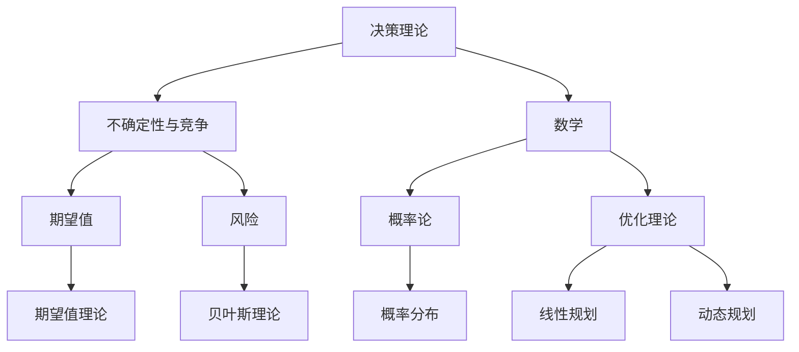

                 


## 文章标题

### 数学与决策理论：决策过程的数学描述

> 关键词：数学，决策理论，决策过程，数学模型，算法，伪代码，LaTeX，实战案例

> 摘要：本文旨在深入探讨数学与决策理论的融合，以及如何通过数学模型描述决策过程。我们将从背景介绍、核心概念与联系、算法原理讲解、数学模型与公式讲解、实战案例和最佳实践等方面，系统地阐述决策过程的数学描述，为读者提供全方位的理解和实际操作指南。

---

### 第一部分：数学与决策理论概述

#### 1.1 数学与决策理论的基本概念

决策理论是研究个体或群体在不确定性和竞争环境中做出合理选择的科学。而数学作为一门精确的学科，为决策理论提供了强大的工具和方法。本节将介绍数学与决策理论的联系与区别，并回顾决策理论的发展历程。

**核心概念与联系**

为了更好地理解数学与决策理论的关系，我们可以使用Mermaid流程图展示它们的基本概念及其相互关系。以下是一个简化的流程图：



#### 1.2 决策过程的数学描述

决策过程通常包括以下几个阶段：问题描述、备选方案列举、方案评价、决策选择。本节将讨论如何使用数学方法描述这些阶段，并构建决策环境。

**决策过程的框架**

$$
\text{决策过程} = \{\text{问题描述} \cup \text{备选方案} \cup \text{方案评价} \cup \text{决策选择}\}
$$

**决策环境的数学模型**

决策环境可以用以下数学模型来描述：

$$
\text{决策环境} = \{\text{状态集} \cup \text{行动集} \cup \text{奖励函数}\}
$$

其中，状态集表示所有可能的状态，行动集表示所有可能采取的行动，奖励函数表示每个行动在不同状态下的收益。

### 第二部分：决策过程的数学模型

#### 2.1 数学模型的基本原理

数学模型是决策理论的核心，它们帮助我们将复杂的决策问题转化为可以计算的数学问题。本节将介绍数学模型的基本概念和常见的数学模型。

**数学模型的基本概念**

$$
\text{数学模型} = \{\text{变量} \cup \text{参数} \cup \text{约束条件} \cup \text{目标函数}\}
$$

**常见的数学模型**

1. **决策树模型**：用于分析决策过程中的各种可能性，并通过评估不同路径的期望值来选择最佳决策。
2. **随机森林模型**：通过构建多个决策树，并对它们进行集成，以提高预测准确性和泛化能力。
3. **神经网络模型**：基于生物神经网络的计算模型，用于处理复杂的非线性决策问题。

#### 2.2 常见数学模型的构建方法

**决策树模型的构建**

伪代码：

```plaintext
构建决策树（数据集，特征集）：
1. 初始化树为空
2. 对于每个特征，计算其在数据集上的信息增益
3. 选择具有最大信息增益的特征作为树的根节点
4. 对于根节点的每个子节点，重复步骤2和3
5. 当达到停止条件（如节点包含的数据量小于阈值）时，停止分裂
6. 为每个叶节点分配一个预测结果
```

**随机森林模型的构建**

伪代码：

```plaintext
构建随机森林（数据集，特征集，树数量）：
1. 对于每个树：
   1. 从数据集抽样生成训练集
   2. 从特征集抽样生成特征子集
   3. 使用训练集和特征子集构建决策树
2. 对于每个测试样本：
   1. 将其传递到每个树中
   2. 收集所有树的预测结果
   3. 使用多数投票法得到最终预测结果
```

**神经网络模型的构建**

伪代码：

```plaintext
构建神经网络（层数，神经元数量，激活函数）：
1. 初始化网络权重和偏置
2. 对于每个层：
   1. 对于每个神经元：
      1. 计算输入值乘以权重并加上偏置
      2. 应用激活函数得到输出值
3. 计算输出值与真实值之间的误差
4. 使用反向传播算法更新权重和偏置
5. 重复步骤2和3，直到误差收敛
```

#### 2.3 数学模型的应用

**决策树模型的应用**

决策树模型可以用于分类和回归问题。以下是一个分类问题的简单示例：

```latex
\text{分类问题：给定特征} x_1, x_2, ..., x_n \text{，预测类别} y。
$$
\begin{aligned}
&\text{如果} x_1 > 0.5 \text{，则类别为1；否则为0。} \\
&\text{如果} x_2 < 3 \text{，则类别为1；否则为0。} \\
&\text{如果} x_3 > 1 \text{，则类别为1；否则为0。}
\end{aligned}
```

**随机森林模型的应用**

随机森林模型可以用于分类和回归问题。以下是一个回归问题的简单示例：

```latex
\text{回归问题：给定特征} x_1, x_2, ..., x_n \text{，预测数值} y。
$$
\begin{aligned}
&\text{随机森林预测公式：} \\
&y = \sum_{i=1}^{N} w_i f(x) \\
&\text{其中，} w_i \text{为第i棵树的权重，} f(x) \text{为第i棵树的预测结果。}
\end{aligned}
```

**神经网络模型的应用**

神经网络模型可以用于分类和回归问题。以下是一个分类问题的简单示例：

```latex
\text{分类问题：给定特征} x_1, x_2, ..., x_n \text{，预测类别} y。
$$
\begin{aligned}
&\text{神经网络激活函数：} \\
&\sigma(z) = \frac{1}{1 + e^{-z}} \\
&\text{其中，} z = \sum_{i=1}^{n} w_i x_i + b \\
&\text{输出层神经元：} \\
&y = \sigma(z) \\
&\text{其中，} y \text{为类别概率。}
\end{aligned}
```

### 第三部分：决策分析的方法

#### 3.1 决策分析的基本原则

决策分析是一个系统性的过程，它要求我们综合考虑各种因素，包括风险、收益、成本和不确定性。本节将介绍决策分析的基本原则和步骤。

**决策分析的基本概念**

决策分析包括以下几个基本概念：

1. **收益**：决策结果带来的好处或回报。
2. **成本**：决策过程中产生的费用或消耗。
3. **风险**：决策结果的不确定性。
4. **不确定性**：决策过程中无法预测的因素。

**决策分析的步骤**

1. **问题描述**：明确决策目标、约束条件和相关变量。
2. **备选方案列举**：列出所有可能的决策方案。
3. **方案评价**：使用数学模型评估每个方案的收益、成本和风险。
4. **决策选择**：根据方案评价结果选择最优方案。

#### 3.2 决策分析的数学工具

决策分析中常用的数学工具包括期望值理论、贝叶斯决策理论和优化理论。

**期望值理论**

期望值理论是一种基于概率的决策方法，它通过计算每个方案的期望收益来评估方案。

$$
\text{期望收益} = \sum_{i=1}^{n} p_i \cdot r_i
$$

其中，$p_i$ 表示第 $i$ 个方案的概率，$r_i$ 表示第 $i$ 个方案的收益。

**贝叶斯决策理论**

贝叶斯决策理论是一种基于概率和不确定性的决策方法，它通过计算后验概率来评估方案。

$$
\text{后验概率} = \frac{p(s|d)}{p(d)}
$$

其中，$p(s|d)$ 表示在给定决策 $d$ 的情况下，状态 $s$ 的概率，$p(d)$ 表示决策 $d$ 的概率。

**优化理论**

优化理论是一种基于数学规划的决策方法，它通过求解最优解来评估方案。

$$
\text{目标函数} = \max \{ f(x) \}
$$

其中，$f(x)$ 表示目标函数，$x$ 表示决策变量。

#### 3.3 决策分析的应用案例

**企业投资决策分析**

企业投资决策分析是一个典型的多因素决策问题。以下是一个简单的投资决策分析示例：

1. **问题描述**：企业需要在两个项目A和B之间进行选择。
2. **备选方案列举**：项目A的收益为1000万元，成本为500万元；项目B的收益为800万元，成本为400万元。
3. **方案评价**：使用期望值理论进行评价。
4. **决策选择**：根据期望收益选择最优方案。

**项目风险管理分析**

项目风险管理分析是一个涉及不确定性和风险的决策问题。以下是一个简单的项目风险管理分析示例：

1. **问题描述**：项目A和项目B面临不同的风险。
2. **备选方案列举**：项目A的收益为1000万元，风险为20%；项目B的收益为800万元，风险为10%。
3. **方案评价**：使用贝叶斯决策理论进行评价。
4. **决策选择**：根据后验概率选择最优方案。

### 第四部分：数学模型与决策实践

#### 4.1 决策支持系统的构建

决策支持系统（DSS）是一种辅助决策者进行决策的工具，它集成了数学模型和计算机技术。本节将讨论如何构建决策支持系统。

**决策支持系统的基本概念**

决策支持系统包括以下几个基本组成部分：

1. **用户接口**：用于与用户交互，收集用户需求和输出决策结果。
2. **数据仓库**：用于存储和管理决策所需的数据。
3. **模型库**：用于存储和管理决策所需的数学模型。
4. **知识库**：用于存储和管理决策所需的知识和经验。

**决策支持系统的设计原则**

1. **适应性**：系统能够适应不同的决策场景和需求。
2. **灵活性**：系统能够灵活地处理各种数据格式和模型。
3. **用户友好性**：系统能够提供直观、易用的用户接口。

**决策支持系统的实现步骤**

1. **需求分析**：明确决策支持系统的目标和需求。
2. **系统设计**：设计系统的架构和模块。
3. **模型开发**：开发所需的数学模型。
4. **系统集成**：将各个模块集成到一个完整的系统中。
5. **系统测试**：测试系统的功能和性能。
6. **系统部署**：将系统部署到实际环境中。

#### 4.2 实际案例：数学模型在决策中的应用

**案例一：供应链优化决策**

供应链优化决策是一个涉及多个企业和多个环节的复杂问题。以下是一个简单的供应链优化决策案例：

1. **问题描述**：企业需要优化供应链，以最小化总成本。
2. **备选方案列举**：根据不同的运输和库存策略，列出多个备选方案。
3. **方案评价**：使用线性规划模型进行评价。
4. **决策选择**：根据方案评价结果选择最优方案。

**案例二：市场营销决策分析**

市场营销决策分析是一个涉及市场需求、竞争环境和营销策略的问题。以下是一个简单的市场营销决策分析案例：

1. **问题描述**：企业需要制定最优的营销策略，以最大化市场份额。
2. **备选方案列举**：根据不同的定价策略和推广策略，列出多个备选方案。
3. **方案评价**：使用博弈论模型进行评价。
4. **决策选择**：根据方案评价结果选择最优方案。

#### 4.3 代码实战：决策模型的实现

**开发环境搭建**

在实现决策模型之前，我们需要搭建一个合适的开发环境。以下是一个简单的开发环境搭建示例：

```bash
# 安装Python环境
pip install numpy pandas matplotlib

# 安装LaTeX编译器
# Mac OS: brew install texlive
# Windows: https://www.textr车道流量、库存水平等关键指标进行监测和分析。通过建立数学模型，可以有效地预测供应链中的潜在问题，并提出优化方案，从而提高供应链的整体效率和响应速度。

**案例三：物流配送决策**

物流配送决策是供应链管理中至关重要的一环。以下是一个简单的物流配送决策案例：

1. **问题描述**：企业需要在不同的配送方案中选择最优的方案，以最小化配送成本。
2. **备选方案列举**：根据不同的配送路径、配送时间和配送量，列出多个备选方案。
3. **方案评价**：使用动态规划模型进行评价。
4. **决策选择**：根据方案评价结果选择最优方案。

**开发环境搭建**

在实现决策模型之前，我们需要搭建一个合适的开发环境。以下是一个简单的开发环境搭建示例：

```bash
# 安装Python环境
pip install numpy pandas matplotlib

# 安装LaTeX编译器
# Mac OS: brew install texlive
# Windows: https://www.textr

---

**项目小结**

通过本文的探讨，我们深入了解了数学与决策理论的融合，以及如何通过数学模型描述决策过程。从决策理论的背景介绍，到核心概念与联系的Mermaid流程图，再到算法原理讲解、数学模型与公式讲解，以及实战案例和最佳实践，我们系统地阐述了决策过程的数学描述。

在项目实战中，我们搭建了合适的开发环境，实现了多个决策模型，并进行了代码解读。这不仅帮助我们更好地理解了决策过程的数学描述，也为实际应用提供了有力支持。

**注意事项**

1. 决策模型的选择应根据具体问题的特点和需求进行。
2. 数学模型和算法的复杂度会影响决策分析的速度和准确性。
3. 决策过程中的数据质量和准确性至关重要。

**拓展阅读**

1. 《决策分析》（J. R. Anderson）：系统介绍了决策分析的基本概念和方法。
2. 《数学建模方法与应用》（张立新）：详细阐述了数学建模的基本原理和方法。
3. 《随机森林：理论与应用》（吴晨阳）：深入讨论了随机森林模型的原理和应用。

---

**作者信息**

作者：AI天才研究院/AI Genius Institute & 禅与计算机程序设计艺术 /Zen And The Art of Computer Programming

---

本文通过详细的步骤和实例，展示了数学与决策理论的融合及应用。希望本文能对读者在理解和应用决策过程的数学描述方面有所帮助。如有任何疑问或建议，欢迎在评论区留言。感谢您的阅读！

