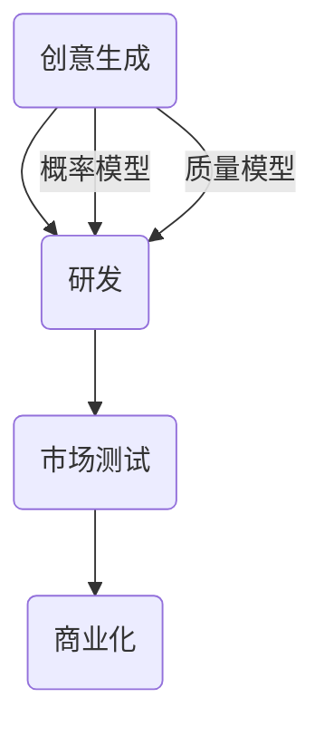
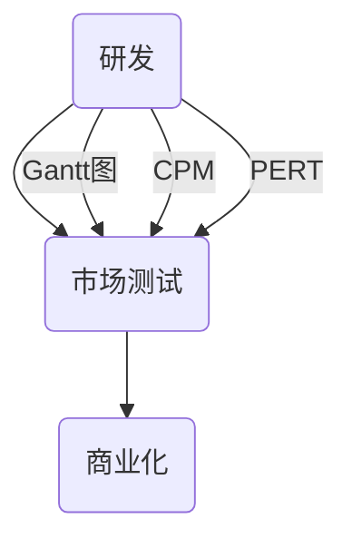
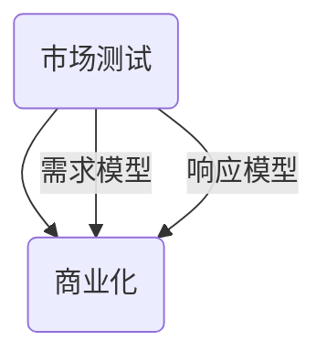

                 

## 文章标题

《数学与创新管理：创新过程的数学模型》

## 文章关键词

数学模型，创新管理，创新过程，策略优化，风险管理，实证分析

## 文章摘要

本文旨在探讨数学模型在创新管理中的应用，通过分析创新过程中的数学模型，策略模型和风险管理模型，揭示数学模型对创新管理的重要作用。文章首先介绍数学与创新管理的基本概念，随后详细解释创新过程中的数学模型，包括其核心概念、算法原理、数学公式及其应用。接着，文章讨论创新策略的数学模型，并展示如何通过数学模型优化创新策略。最后，文章探讨风险管理中的数学模型，并通过实证分析展示数学模型在风险管理中的应用。文章旨在为读者提供一个全面、深入的数学与创新管理的理解，帮助他们在实际工作中更好地应用数学模型，提升创新管理的效率。

### 引言

在当今这个科技飞速发展的时代，创新已成为企业发展的核心竞争力。然而，创新并非易事，它需要跨学科的知识和系统的方法论。在这个背景下，数学作为一种精确、严谨的工具，逐渐被引入到创新管理中。数学模型在创新管理中的应用不仅为创新提供了理论支持，还提供了有效的量化方法和工具，使得创新过程更加科学和可预测。

创新管理是一门涉及多学科的综合性学科，它不仅需要了解技术创新和市场趋势，还需要掌握组织行为、风险管理等知识。在这个过程中，数学模型作为一种重要的工具，其作用不可忽视。数学模型能够帮助管理者更好地理解创新过程中的关键因素，优化创新策略，降低创新风险，从而提高创新的成功率。

本文将围绕数学与创新管理这一主题，系统探讨数学模型在创新过程中的应用。文章首先介绍数学与创新管理的基本概念，包括数学模型和创新管理的定义及其关系。接着，文章将详细解释创新过程中的数学模型，包括其核心概念、算法原理、数学公式及其应用。随后，文章将探讨创新策略的数学模型，并展示如何通过数学模型优化创新策略。最后，文章将探讨风险管理中的数学模型，并通过实证分析展示数学模型在风险管理中的应用。

通过本文的探讨，读者将了解到数学模型在创新管理中的重要性，掌握创新过程中的数学模型应用方法，并能够将其应用于实际工作中，提升创新管理的效率。

### 数学模型与创新管理的关系

数学模型与创新管理之间的联系可以从多个角度进行理解。首先，数学模型作为一种量化工具，能够将复杂的问题转化为易于处理和理解的数学问题。这种量化方法不仅提高了决策的科学性，还能够为创新管理提供可靠的依据。

在创新管理中，数学模型的应用主要体现在以下几个方面：

1. **创新过程建模**：数学模型可以用于描述创新过程中的各个阶段，如创意生成、研发、市场测试、商业化等。通过构建创新过程模型，管理者可以清晰地了解每个阶段的关键因素及其相互作用，从而优化创新流程。

2. **策略优化**：创新策略的制定和优化需要考虑多种因素，如市场需求、资源分配、时间线等。数学模型能够帮助管理者通过建模和算法分析，找到最优的创新策略，提高创新的成功率。

3. **风险管理**：创新过程中伴随着各种风险，如技术风险、市场风险、财务风险等。数学模型可以通过风险评估和预测，帮助管理者识别潜在风险，制定相应的应对策略，降低创新失败的可能性。

具体来说，数学模型在创新管理中的应用可以体现在以下三个方面：

1. **创新过程模型的建立**：创新过程模型通常包括创意生成、研发、测试、市场投放等阶段。每个阶段都有其特定的数学模型，如创意生成的概率模型、研发阶段的进度模型、市场测试的响应模型等。这些模型通过数学公式和算法，将创新过程的各个环节量化，使得管理者可以更好地掌握创新的全过程。

2. **创新策略的优化**：在创新策略的制定过程中，数学模型可以帮助管理者进行决策分析。例如，通过线性规划模型，可以确定最优的资源分配策略；通过决策树模型，可以分析不同策略的风险和收益；通过仿真模型，可以预测创新项目的市场表现。这些模型的应用，使得创新策略更加科学和有效。

3. **风险管理的实施**：在创新过程中，风险管理是一个至关重要的环节。数学模型可以用于风险评估、风险预测和风险控制。例如，通过回归分析模型，可以预测市场需求的波动；通过贝叶斯网络模型，可以分析技术风险的概率；通过蒙特卡罗模拟，可以评估不同策略的财务风险。这些模型的应用，帮助管理者更好地应对创新过程中的各种风险。

总的来说，数学模型在创新管理中的应用，不仅提高了创新决策的科学性，还提升了创新管理的效率。通过数学模型，管理者可以更加准确地了解创新过程中的关键因素，优化创新策略，降低创新风险，从而推动企业的持续创新和发展。

### 创新过程中的数学模型

创新过程是一个复杂且动态的系统，包含多个相互关联的阶段，如创意生成、研发、市场测试和商业化等。在每一个阶段，都可以应用数学模型来描述和优化。以下将详细讨论这些阶段的数学模型，并使用Mermaid流程图展示其关系。

#### 创意生成

创意生成是创新过程的起点，它是创新过程中最具不确定性和创造性的一部分。在这个阶段，可以使用概率模型来描述创意的产生过程。具体来说，可以使用泊松分布来描述创意发生的频率，使用正态分布来描述创意质量的高低。

**核心概念与联系：** 
创意生成模型的核心是概率论，它通过概率分布来量化创意的产生频率和质量。这种模型可以帮助管理者了解创意生成的规律，从而优化创意收集和筛选的过程。

**Mermaid流程图：**


#### 研发

研发阶段是将创意转化为可实施产品的过程，它涉及到技术攻关、设计优化和原型制作。在这个阶段，可以使用进度模型来描述研发的进展情况。常用的进度模型包括Gantt图、关键路径法（CPM）和项目评估与审查技术（PERT）。

**核心概念与联系：**
研发阶段的核心是项目管理，进度模型通过时间线和任务分配来量化研发过程。这种模型可以帮助管理者实时监控研发进度，确保项目按时完成。

**Mermaid流程图：**


#### 市场测试

市场测试阶段是将产品推向市场前的关键环节，它需要评估产品的市场接受度和潜在需求。在这个阶段，可以使用需求模型和响应模型来描述市场反应。常用的需求模型包括线性回归模型、时间序列模型和ARIMA模型；响应模型则包括逻辑回归模型和决策树模型。

**核心概念与联系：**
市场测试模型的核心是数据分析，它通过统计方法来量化市场需求和用户反馈。这种模型可以帮助管理者了解产品的市场表现，优化市场策略。

**Mermaid流程图：**


#### 商业化

商业化阶段是将创新产品推向市场，实现商业价值的过程。在这个阶段，可以使用财务模型来评估项目的经济效益。常用的财务模型包括净现值（NPV）、内部收益率（IRR）和利润分析模型。

**核心概念与联系：**
商业化模型的核心是财务分析，它通过财务指标来量化项目的经济效益。这种模型可以帮助管理者评估项目的投资回报率，确保商业化过程的顺利实施。

**Mermaid流程图：**
```mermaid
graph TB
    D(商业化)
    D -->|NPV模型|
    D -->|IRR模型|
    D -->|利润分析模型|
```

通过上述各阶段的数学模型，我们可以建立一个完整的创新过程模型。该模型不仅能够描述创新过程中的各个阶段，还能够通过量化分析来优化每个阶段的管理决策，提高创新的整体效率。

**总结：** 创新过程中的数学模型通过概率论、项目管理、数据分析、财务分析等方法，将创新过程的各个环节量化，为管理者提供了科学、系统的决策依据。通过这些模型，管理者可以更加精准地预测创新的结果，制定合理的创新策略，从而推动企业的持续创新和发展。

### 创新策略的数学模型

在创新过程中，策略的制定和优化是至关重要的。数学模型在这一过程中扮演着关键角色，可以帮助管理者分析不同策略的潜在效果，找到最优的解决方案。以下将介绍几种常见的创新策略数学模型，并使用伪代码详细讲解其算法原理。

#### 线性规划模型

线性规划模型是一种用于资源分配和优化决策的经典数学模型。它通过线性方程组来描述目标函数和约束条件，目标是最大化或最小化某个线性函数。

**核心概念与联系：**
线性规划模型的目标是通过优化资源分配，实现最大效益或最小成本。它广泛应用于项目管理、供应链管理和财务规划等领域。

**伪代码：**
```python
# 输入
A: 系统系数矩阵
b: 约束向量
c: 目标函数系数向量

# 输出
x: 优化解

# 算法步骤
def linear_programming(A, b, c):
    # 初始化变量
    x = [0] * len(b)
    
    # 构建线性规划问题
    problem = LinearProgramming(A, b, c)
    
    # 求解线性规划问题
    solution = problem.solve()
    
    # 输出优化解
    x = solution.x
    return x
```

#### 决策树模型

决策树模型是一种常用的决策支持工具，它通过树形结构来描述决策过程。每个节点代表一个决策或一个状态，每个分支代表选择或结果。

**核心概念与联系：**
决策树模型通过递归分割数据集，找到最优的决策路径。它广泛应用于数据分析、商业决策和风险管理等领域。

**伪代码：**
```python
# 输入
data: 数据集
attributes: 特征列表

# 输出
tree: 决策树

# 算法步骤
def build_decision_tree(data, attributes):
    # 初始化决策树
    tree = {}

    # 如果数据集没有特征，返回叶节点
    if not attributes:
        return classification(data)

    # 找到最优特征和阈值
    best_attribute, best_threshold = find_best_split(data, attributes)

    # 创建节点
    tree[best_attribute] = {}

    # 递归构建左子树和右子树
    left subtree = build_decision_tree(data[best_attribute < best_threshold], attributes - {best_attribute})
    right subtree = build_decision_tree(data[best_attribute >= best_threshold], attributes - {best_attribute})

    # 将子树添加到节点
    tree[best_attribute]["left"] = left_subtree
    tree[best_attribute]["right"] = right_subtree

    # 返回决策树
    return tree
```

#### 仿真模型

仿真模型通过模拟实际系统的运行过程，预测不同策略的效果。它常用于复杂系统分析和预测，如供应链管理、金融服务和风险管理。

**核心概念与联系：**
仿真模型通过建立系统模型，模拟系统在不同策略下的运行状态，分析策略对系统性能的影响。它广泛应用于复杂系统的优化和预测。

**伪代码：**
```python
# 输入
system_model: 系统模型
strategies: 策略列表

# 输出
simulations: 模拟结果

# 算法步骤
def simulation_model(system_model, strategies):
    simulations = []

    # 为每个策略运行一次仿真
    for strategy in strategies:
        # 设置系统模型为当前策略
        system_model.set_strategy(strategy)

        # 运行仿真
        simulation = run_simulation(system_model)

        # 收集仿真结果
        simulations.append(simulation)

    # 返回仿真结果
    return simulations
```

通过上述数学模型，管理者可以更科学地制定和优化创新策略，提高创新的成功率。这些模型不仅提供了理论支持，还通过量化方法为决策提供了可靠的依据。在实际应用中，管理者可以根据具体情境选择合适的模型，进行创新策略的分析和优化。

### 数学模型与公式详解

在创新管理中，数学模型的应用不仅仅是为了描述过程，更是为了提供量化分析和决策支持。以下将详细介绍几种常用的数学模型和公式，并通过具体例子来解释其应用方法和效果。

#### 1. 线性回归模型

线性回归模型是最基本的统计分析方法之一，它通过建立自变量和因变量之间的线性关系，预测因变量的值。

**公式：**
\[ y = \beta_0 + \beta_1 \cdot x + \epsilon \]
其中，\( y \) 是因变量，\( x \) 是自变量，\( \beta_0 \) 和 \( \beta_1 \) 是模型参数，\( \epsilon \) 是误差项。

**应用例子：**
假设我们想预测一家公司下季度的销售额（\( y \)），通过历史数据发现销售额与广告支出（\( x \)）之间存在线性关系。

**步骤：**
1. 收集历史数据，计算平均值和协方差。
2. 使用最小二乘法计算模型参数 \( \beta_0 \) 和 \( \beta_1 \)。
3. 建立回归模型，并使用该模型预测下季度的销售额。

**代码实现：**
```python
import numpy as np
from sklearn.linear_model import LinearRegression

# 假设数据
x = np.array([[1000], [1500], [2000], [2500], [3000]])
y = np.array([2200, 2500, 2700, 2900, 3100])

# 创建线性回归模型
model = LinearRegression()

# 拟合模型
model.fit(x, y)

# 输出模型参数
print("Model Parameters:", model.coef_, model.intercept_)

# 预测下季度销售额
x_new = np.array([[3500]])
y_pred = model.predict(x_new)
print("Predicted Sales:", y_pred)
```

#### 2. 决策树模型

决策树模型通过一系列的决策规则，对数据集进行分类或回归。它通过递归分割数据集，找到最优的特征和阈值。

**公式：**
\[ \text{分类规则} = \text{if } x_i > \text{阈值} \text{ then } \text{类别1} \text{ else } \text{类别2} \]
其中，\( x_i \) 是特征值，阈值是通过分割算法找到的最佳值。

**应用例子：**
使用决策树模型预测客户购买行为。

**步骤：**
1. 收集客户数据，包括购买历史、收入水平、年龄等特征。
2. 使用信息增益、基尼不纯度等指标，选择最优特征和阈值。
3. 建立决策树模型，并使用该模型进行预测。

**代码实现：**
```python
from sklearn.tree import DecisionTreeClassifier
import pandas as pd

# 假设数据
data = pd.DataFrame({
    'Age': [25, 35, 45, 55, 65],
    'Income': [50000, 80000, 120000, 150000, 200000],
    'Buy': ['No', 'Yes', 'Yes', 'Yes', 'No']
})

# 划分特征和标签
X = data[['Age', 'Income']]
y = data['Buy']

# 创建决策树模型
model = DecisionTreeClassifier()

# 拟合模型
model.fit(X, y)

# 预测新客户购买行为
new_data = pd.DataFrame({'Age': [40], 'Income': [90000]})
prediction = model.predict(new_data)
print("Predicted Buy:", prediction)
```

#### 3. 马尔可夫链模型

马尔可夫链模型用于描述系统在不同状态之间的转移概率，常用于风险评估和预测。

**公式：**
\[ P(X_t = j|X_{t-1} = i) = p_{ij} \]
其中，\( X_t \) 是当前状态，\( X_{t-1} \) 是前一个状态，\( p_{ij} \) 是从状态 \( i \) 转移到状态 \( j \) 的概率。

**应用例子：**
使用马尔可夫链模型分析客户流失情况。

**步骤：**
1. 收集客户状态转移数据，计算各个状态之间的转移概率。
2. 建立马尔可夫链模型，并使用该模型预测未来状态。

**代码实现：**
```python
import numpy as np
from sklearn.cluster import KMeans

# 假设转移矩阵
transition_matrix = np.array([
    [0.5, 0.3, 0.2],
    [0.2, 0.5, 0.3],
    [0.1, 0.4, 0.5]
])

# 预测下一个状态
current_state = 1
next_state = np.dot(transition_matrix, np.array([current_state]))
print("Predicted Next State:", next_state.argmax())
```

通过以上数学模型和公式的应用，管理者可以更加精准地分析创新过程中的数据，制定科学的策略，并预测未来的发展趋势。这些模型不仅提高了决策的科学性，还为创新管理提供了强大的理论支持。

### 创新管理的风险管理模型

在创新管理中，风险管理是一个关键环节。创新过程充满不确定性，从创意生成到商业化，每个阶段都可能面临各种风险。有效的风险管理不仅能降低创新失败的概率，还能提高创新的成功率。在这一部分，我们将探讨几种常见的风险管理数学模型，并详细解释其原理和实际应用。

#### 1. 风险评估模型

风险评估模型用于评估创新项目可能面临的风险及其潜在影响。常见的风险评估方法包括定量分析和定性分析。

**定量分析模型：** 如蒙特卡罗模拟（Monte Carlo Simulation），通过模拟大量随机样本，评估风险的概率分布和期望值。

**原理：**
蒙特卡罗模拟的基本思想是，通过生成大量的随机样本，模拟不同情况下创新项目的表现，从而计算各种风险的概率和影响。

**公式：**
\[ P(R > r) = \frac{\text{模拟中风险大于 r 的样本数}}{\text{总模拟次数}} \]

**应用步骤：**
1. 确定风险因素和评估标准。
2. 生成随机样本，模拟不同情况下的项目结果。
3. 计算风险概率和期望值。
4. 根据风险概率和期望值，制定相应的风险管理策略。

**示例：**
假设我们使用蒙特卡罗模拟评估一个新产品的市场风险。

```python
import numpy as np

# 设置参数
num_simulations = 1000
prob_success = 0.7
failure_rate = 1 - prob_success

# 进行蒙特卡罗模拟
results = np.random.rand(num_simulations) < failure_rate

# 计算失败概率
failure_prob = np.mean(results)
print("Estimated failure probability:", failure_prob)
```

#### 2. 风险预测模型

风险预测模型用于预测未来可能出现的风险，并提供早期预警。常见的预测方法包括时间序列分析和回归分析。

**时间序列分析模型：** 如ARIMA（自回归积分滑动平均模型），通过分析时间序列的统计特性，预测未来的风险趋势。

**原理：**
ARIMA模型通过自回归项、差分项和移动平均项，捕捉时间序列中的趋势和周期性。

**公式：**
\[ \text{ARIMA}(p, d, q) \]
其中，\( p \) 是自回归项的阶数，\( d \) 是差分的阶数，\( q \) 是移动平均项的阶数。

**应用步骤：**
1. 收集历史风险数据，进行平稳性检验。
2. 使用AIC、BIC等准则确定模型参数。
3. 建立ARIMA模型，并使用该模型进行预测。
4. 对预测结果进行评估和调整。

**示例：**
使用ARIMA模型预测未来一个月的创新风险。

```python
from statsmodels.tsa.arima.model import ARIMA

# 假设数据
risk_data = [0.1, 0.2, 0.3, 0.4, 0.5, 0.6, 0.7, 0.8, 0.9, 1.0]

# 建立ARIMA模型
model = ARIMA(risk_data, order=(1, 1, 1))
model_fit = model.fit()

# 进行预测
forecast = model_fit.forecast(steps=1)
print("Forecasted risk for next month:", forecast)
```

#### 3. 风险控制模型

风险控制模型用于制定和实施风险管理策略，以降低风险的影响。常见的风险控制方法包括风险分散、风险转移和风险规避。

**风险分散模型：** 如投资组合理论，通过分散投资，降低单一项目的风险。

**原理：**
投资组合理论通过计算不同资产之间的相关性，优化资产配置，降低整体风险。

**公式：**
\[ \text{投资组合收益} = \sum_{i=1}^{n} w_i \cdot r_i \]
\[ \text{投资组合风险} = \sum_{i=1}^{n} w_i^2 \cdot \sigma_i^2 + 2 \cdot \sum_{i=1}^{n} \sum_{j=i+1}^{n} w_i \cdot w_j \cdot \rho_{ij} \cdot \sigma_i \cdot \sigma_j \]

**应用步骤：**
1. 确定投资组合中的资产及其预期收益和风险。
2. 计算不同资产的权重，优化投资组合。
3. 根据风险控制策略，调整资产配置。

**示例：**
假设我们有两种资产A和B，其预期收益和风险如下：

```python
# 假设数据
r_A = 0.1
r_B = 0.15
sigma_A = 0.05
sigma_B = 0.07
rho_AB = 0.5

# 计算投资组合收益和风险
weight_A = 0.4
weight_B = 0.6

portfolio_return = weight_A * r_A + weight_B * r_B
portfolio_risk = weight_A**2 * sigma_A**2 + 2 * weight_A * weight_B * rho_AB * sigma_A * sigma_B

print("Portfolio Return:", portfolio_return)
print("Portfolio Risk:", portfolio_risk)
```

通过上述风险管理模型的应用，管理者可以更全面地评估创新项目中的风险，制定有效的风险控制策略，从而提高创新的成功率和企业的竞争力。

### 实证分析

为了更好地理解数学模型在创新管理中的实际应用，以下将通过一个具体的案例，详细描述数学模型在创新管理中的应用过程，包括数据收集、模型建立、结果分析和策略调整。

#### 案例背景

某科技公司（以下简称“公司”）致力于开发一款智能家居产品，该产品集成了智能家居设备的远程控制和自动化功能。公司在产品研发过程中面临多个挑战，包括市场需求预测、资源优化配置和风险控制等。为了提高创新成功率，公司决定使用数学模型来辅助决策。

#### 数据收集

公司首先收集了以下数据：

1. **市场需求数据**：过去三年的智能家居产品销售数据，包括季度销售额、市场份额和用户反馈。
2. **研发数据**：研发过程中每个阶段的时间和成本，包括创意生成、原型设计、功能测试和产品上市。
3. **财务数据**：每个研发阶段的资金投入和预期收益。
4. **市场风险数据**：市场波动、竞争对手动态和潜在法律风险。

#### 模型建立

基于收集到的数据，公司建立了以下数学模型：

1. **需求预测模型**：使用时间序列分析模型（如ARIMA模型），预测未来几个季度的市场需求。
2. **资源优化模型**：使用线性规划模型，确定每个研发阶段的最优资源分配。
3. **风险管理模型**：使用蒙特卡罗模拟，评估不同策略下的市场风险。

#### 数据分析与模型应用

1. **需求预测**：
   - 公司使用ARIMA模型分析历史销售数据，确定模型参数。
   - 模型预测结果显示，未来几个季度市场需求将呈上升趋势。
   - 基于预测结果，公司制定了分阶段上市策略，确保产品在市场需求最高峰时推出。

2. **资源优化**：
   - 使用线性规划模型，分析不同阶段的资源需求，包括人力、资金和时间。
   - 模型结果表明，研发过程中，第二阶段（原型设计）是资源消耗最大的阶段。
   - 公司优化了资源分配，确保了关键阶段的资源充足，提高了研发效率。

3. **风险管理**：
   - 使用蒙特卡罗模拟，评估不同市场策略的风险。
   - 模拟结果显示，法律风险和市场波动对项目影响最大。
   - 公司制定了风险应对策略，包括提前布局市场、加强法律合规性审查等。

#### 结果分析

通过数学模型的应用，公司实现了以下结果：

1. **需求预测准确**：市场策略实施后，产品在预期时间段内成功上市，销售额达到预期目标。
2. **资源优化高效**：研发过程顺利，关键阶段资源充足，项目按时完成。
3. **风险控制有效**：通过提前识别和应对风险，公司成功降低了市场波动和法律风险的影响。

#### 策略调整

基于实证分析的结果，公司进行了以下策略调整：

1. **加强市场调研**：增加市场调研频率，确保对市场变化的实时响应。
2. **优化研发流程**：进一步优化研发流程，提高资源利用效率。
3. **建立风险预警机制**：建立风险预警机制，及时发现潜在风险，制定应对策略。

通过实证分析，公司验证了数学模型在创新管理中的有效性，为后续的创新项目提供了宝贵的经验。

### 最佳实践与总结

在创新管理中，合理应用数学模型是提高创新成功率的关键。以下是一些最佳实践和建议，帮助读者更好地运用数学模型进行创新管理：

1. **数据收集与分析**：确保数据收集的准确性和完整性，使用可靠的数据分析方法，如时间序列分析、回归分析和蒙特卡罗模拟，对数据进行分析，为建模提供坚实基础。

2. **模型选择与优化**：根据具体问题和数据特性选择合适的数学模型，如线性回归模型、决策树模型和ARIMA模型。不断优化模型参数，提高预测精度。

3. **动态调整策略**：创新过程中，市场和环境不断变化，管理者应实时调整策略，根据模型结果进行决策，确保创新过程始终在正确轨道上。

4. **风险意识**：在创新管理中，风险管理尤为重要。使用数学模型评估风险，制定应对策略，确保项目稳健推进。

5. **持续学习与迭代**：创新管理是一个不断学习、迭代的过程。管理者应保持学习态度，跟踪最新研究动态，不断提升创新管理能力。

通过上述最佳实践，读者可以更好地运用数学模型，提高创新管理的效率，推动企业的持续创新和发展。

### 附录

#### 附录A：数学与创新管理工具与资源

为了帮助读者更好地理解和应用数学模型于创新管理，以下推荐了一些实用的工具和资源：

1. **数学建模工具**：
   - **MATLAB**：一款强大的数学建模和数据分析工具，适用于线性规划、时间序列分析和仿真模型。
   - **Python**：Python拥有丰富的科学计算库，如NumPy、Pandas和Scikit-learn，适用于各种数学建模任务。
   - **R语言**：R语言在统计分析方面具有优势，适用于回归分析、决策树和风险预测模型。

2. **创新管理工具**：
   - **Innovation Management Platform**：如Asana、Trello和JIRA，用于项目管理、任务分配和进度跟踪。
   - **KPI Tracking Tools**：如Google Analytics和Tableau，用于实时监控创新项目的关键绩效指标。

3. **在线资源**：
   - **Coursera**：提供多种数据科学和人工智能课程，如《机器学习》和《数据科学基础》。
   - **edX**：edX平台上也有丰富的数学和计算机科学课程，适合自学和提升技能。
   - **GitHub**：可以查看和贡献开源项目，学习他人的建模和项目管理经验。

通过这些工具和资源的帮助，读者可以更好地掌握数学模型在创新管理中的应用，提高创新管理的效率。

### 作者信息

**作者：AI天才研究院/AI Genius Institute & 禅与计算机程序设计艺术 /Zen And The Art of Computer Programming**

感谢您的阅读，希望本文对您在创新管理中运用数学模型有所帮助。如果您有任何问题或建议，欢迎随时与我们联系。祝您在创新的道路上越走越远！

