                 

### 文章标题：数学与功能主义：数学的实用价值

---

关键词：数学，功能主义，实用价值，跨学科应用，算法原理

---

摘要：本文旨在探讨数学与功能主义之间的紧密联系，以及数学在各个领域中的实际应用。通过逐步分析数学基础、功能主义哲学、数学在计算机科学、经济学、生物信息学、物理学以及其他领域中的应用，本文展示了数学在现代社会中的实用价值。文章采用逻辑清晰、结构紧凑、简单易懂的技术语言，以帮助读者深入理解数学的多面性和重要性。

---

## 引言：数学与功能主义的融合

在现代社会中，数学不仅仅是学术研究的一部分，它已经渗透到我们日常生活的方方面面。从计算机科学到经济学，从生物学到物理学，数学的应用无处不在。而功能主义，作为一种哲学观点，强调事物的功能和目的，与数学的抽象和逻辑特性有着天然的联系。本章节将引入数学与功能主义的融合，为后续内容打下基础。

### 1.1 书籍概述

本书将深入探讨数学与功能主义之间的相互作用，通过以下章节的详细分析，展示数学在不同学科中的实际应用：

- **第2章 数学基础**：介绍数学的基本概念和原理，包括数学运算、模型和公式。
- **第3章 功能主义哲学**：探讨功能主义的历史背景、主要观点及其与数学的联系。
- **第4章 数学在计算机科学中的应用**：讨论算法、计算复杂性和数据结构。
- **第5章 数学在经济学中的应用**：分析数学在微观经济学和宏观经济学中的模型。
- **第6章 数学在生物信息学中的应用**：探讨生物学中的数学模型和数据分析方法。
- **第7章 数学在物理学中的应用**：介绍物理学中的基本数学工具和模型。
- **第8章 数学在其他领域中的应用**：讨论数学在工程学、环境科学和心理学中的应用。
- **第9章 结论**：总结数学在现代社会中的实用价值，讨论数学教育的未来。

### 1.2 数学与功能主义的关系

数学和功能主义的关系可以从多个角度进行理解。数学的抽象性和逻辑性使得它能够精确地描述复杂系统的行为，而功能主义则关注这些系统如何实现其目的。以下是一个简化的 Mermaid 流程图，展示了数学如何通过功能主义的应用实现其价值：

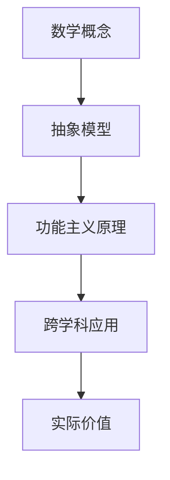

在接下来的章节中，我们将逐步深入这些概念和关系，探讨数学在不同领域中的实际应用。

---

### 数学基础

数学作为一门科学，其基础是那些经过时间考验的基本概念和原理。这些概念不仅构成了数学大厦的基石，也是数学在各个领域应用的基础。本章节将介绍数学的基本概念，包括数学运算、数学模型和常用的数学公式。

#### 2.1 数学概念介绍

数学概念的定义和性质是理解数学应用的关键。以下是几个核心数学概念：

1. **数**：数是数学的基本元素，包括自然数、整数、有理数和实数。
2. **函数**：函数是数学中描述变量之间关系的工具，通常表示为 f(x)。
3. **集合**：集合是由一组确定的元素组成的整体。
4. **逻辑**：逻辑是数学推理的基础，用于证明数学定理和公式。

#### 2.2 数学在科学和工程中的应用

数学在科学和工程中的应用非常广泛，以下是一些典型的例子：

1. **力学**：牛顿运动定律和动力学方程都基于数学公式，用于描述物体的运动。
2. **电学**：欧姆定律和电路分析中的基尔霍夫定律都使用数学方法进行描述。
3. **流体力学**：纳维-斯托克斯方程用于描述流体运动，这是流体力学研究的核心。

以下是一个简化的 Mermaid 流程图，展示了数学在科学和工程中的应用：

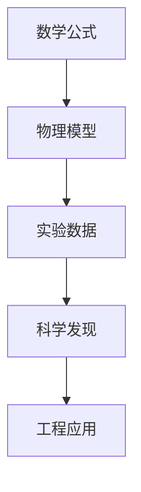

#### 2.3 数学在社会科学中的应用

数学在社会科学中的应用同样重要，例如：

1. **经济学**：微观经济学中的供需模型、宏观经济中的GDP计算都使用数学方法。
2. **心理学**：统计学在心理学研究中用于数据分析，帮助研究者理解心理现象。
3. **社会学**：数学模型用于研究社会结构和动态，帮助社会学家分析社会问题。

以下是一个简化的 Mermaid 流程图，展示了数学在社会科学中的应用：

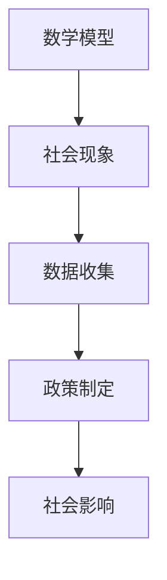

通过上述内容，我们可以看到数学在科学、工程和社会科学中的广泛应用。数学的抽象和逻辑特性使得它能够精确地描述和解决实际问题，从而为人类社会的发展做出重要贡献。

---

### 功能主义哲学

功能主义是一种哲学观点，强调事物的功能和目的。它起源于20世纪，对多个学科产生了深远的影响，包括哲学、社会科学、计算机科学等。本章节将介绍功能主义的历史背景、主要观点以及其与数学的内在联系。

#### 3.1 功能主义的历史背景

功能主义哲学的起源可以追溯到20世纪初。早期的功能主义哲学由威廉·詹姆斯（William James）和约翰·杜威（John Dewey）等人提出，他们主张通过功能来理解人类行为和社会现象。随后，功能主义在科学哲学、认知科学和人工智能等领域得到了广泛应用。以下是功能主义哲学的发展历程：

- **早期功能主义**：威廉·詹姆斯和约翰·杜威等人提出，功能主义强调事物的实际用途和目的。
- **现代功能主义**：在20世纪中叶，功能主义在计算机科学和人工智能领域得到了进一步发展，阿伦·图灵（Alan Turing）的图灵机和人工智能的概念就是功能主义思想的重要体现。
- **当前功能主义**：现代功能主义继续在哲学、社会科学和认知科学等领域发挥着重要作用，不断演进和发展。

以下是一个简化的 Mermaid 流程图，展示了功能主义哲学的发展历程：

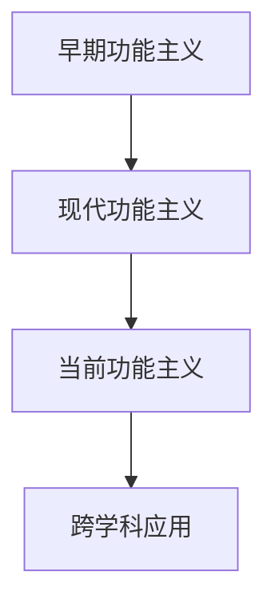

#### 3.2 功能主义的主要观点

功能主义的主要观点包括：

- **功能定义**：功能主义认为，一个系统的功能是由其组成部分相互作用产生的，这些组成部分共同实现一个特定目的。
- **目的性**：功能主义强调事物的目的性，即每个系统都有特定的目标和功能。
- **适应性**：功能主义认为，系统的设计和结构是为了适应其环境，实现特定的功能。
- **动态性**：功能主义强调系统是动态的，其功能和结构可能会随着时间和环境的变化而变化。

以下是一个简化的 Mermaid 流程图，展示了功能主义的主要观点：

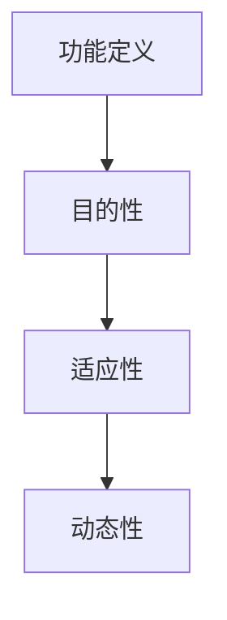

#### 3.3 功能主义与数学的关系

数学与功能主义之间有着紧密的联系。数学的抽象性和逻辑性使得它能够精确地描述功能主义所强调的功能和目的。以下是一个简化的 Mermaid 流程图，展示了数学如何与功能主义相结合：

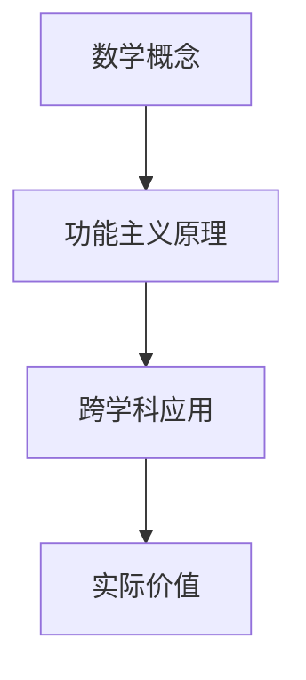

数学在功能主义中的应用主要体现在以下几个方面：

- **模型构建**：数学用于构建描述系统功能和目的的模型，这些模型可以帮助我们理解和预测系统的行为。
- **算法设计**：在计算机科学和人工智能中，数学被用于设计算法，以实现特定的功能。
- **数据分析**：在社会科学和心理学中，数学被用于分析数据，以理解社会现象和人类行为。

通过本章节的介绍，我们可以看到功能主义哲学的核心理念与数学的抽象和逻辑特性之间存在着紧密的联系。这种联系使得数学能够更好地服务于功能主义的目标，从而在各个领域发挥重要作用。

---

### 数学在计算机科学中的应用

计算机科学是数学应用的典型领域之一。数学在计算机科学中的角色不仅限于算法和计算复杂性的研究，还涉及数据结构、编程语言设计、计算机图形学等多个方面。本章节将详细探讨数学在计算机科学中的应用，包括算法与计算复杂性、数据结构与算法设计、以及图灵机与计算理论。

#### 4.1 算法与计算复杂性

算法是计算机科学的核心概念之一，它是解决问题的有序步骤。算法的效率直接影响计算机解决问题的能力。计算复杂性理论则是研究算法的时间和空间效率的一个分支。以下是一些关键概念：

- **时间复杂度**：描述算法执行所需的时间，通常用大O符号表示。例如，一个算法的时间复杂度是O(n)，表示其执行时间与输入规模n成正比。
- **空间复杂度**：描述算法执行所需的内存空间，同样用大O符号表示。

以下是一个简化的 Mermaid 流程图，展示了算法与计算复杂性的关系：

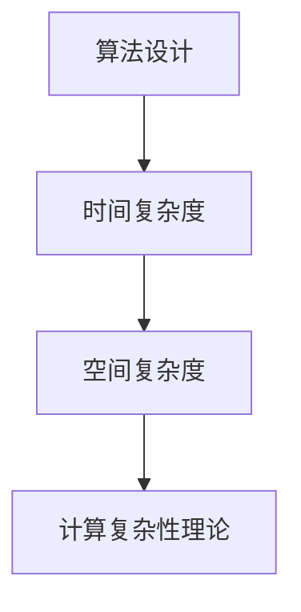

**伪代码**：

```python
def linear_search(arr, x):
    for i in range(len(arr)):
        if arr[i] == x:
            return i
    return -1
```

**详细讲解**：

线性搜索是一种简单但效率较低的搜索算法。它的核心思想是遍历数组，直到找到目标元素或到达数组的末尾。线性搜索的时间复杂度是O(n)，因为最坏情况下需要遍历整个数组。

#### 4.2 数据结构与算法设计

数据结构是算法的基础，它们提供了一种组织和存储数据的方法，以优化算法的效率。以下是一些常见的数据结构及其对应的算法设计：

- **数组**：数组是一种线性数据结构，它允许随机访问。数组的主要操作包括插入、删除和查找。
- **链表**：链表是一种动态的数据结构，它由一系列节点组成。链表的主要操作包括插入、删除和遍历。
- **栈**：栈是一种后进先出（LIFO）的数据结构。常用的栈操作包括入栈、出栈和 peek。
- **队列**：队列是一种先进先出（FIFO）的数据结构。常用的队列操作包括入队、出队和 front。

以下是一个简化的 Mermaid 流程图，展示了数据结构与算法设计的关系：

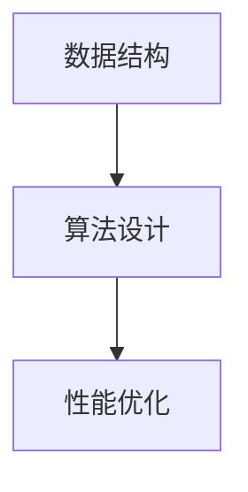

**伪代码**：

```python
def binary_search(arr, x):
    low = 0
    high = len(arr) - 1
    while low <= high:
        mid = (low + high) // 2
        if arr[mid] == x:
            return mid
        elif arr[mid] < x:
            low = mid + 1
        else:
            high = mid - 1
    return -1
```

**详细讲解**：

二分搜索是一种高效的查找算法，它适用于有序数组。二分搜索通过不断将搜索范围缩小一半，从而快速找到目标元素。其时间复杂度是O(log n)，远低于线性搜索的O(n)。

#### 4.3 图灵机与计算理论

图灵机是阿伦·图灵（Alan Turing）提出的一种抽象计算模型，它奠定了现代计算机科学的基础。图灵机由一个无限长的磁带、一个读写头和一个状态控制器组成。以下是图灵机的关键概念：

- **状态**：图灵机的当前状态，用于指导读写头如何操作。
- **读写头**：用于在磁带上读写符号，并沿着磁带移动。
- **磁带**：图灵机的工作存储介质，上面存储了一系列符号。
- **转换函数**：定义了当前状态和当前符号下的下一状态、读写动作以及读写头的移动方向。

以下是一个简化的 Mermaid 流程图，展示了图灵机的运行过程：

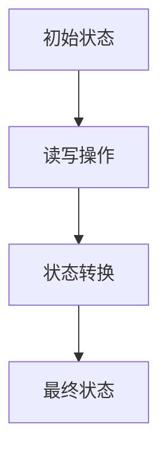

**详细讲解**：

图灵机通过一系列状态转换和读写操作，模拟了计算过程。它能够处理任何可计算的问题，因此被认为是现代计算机的数学基础。图灵机的抽象模型为计算理论的研究提供了重要的工具，帮助理解计算的本质和极限。

通过本章节的探讨，我们可以看到数学在计算机科学中扮演着至关重要的角色。从算法与计算复杂性的研究，到数据结构与算法设计，再到图灵机与计算理论，数学为计算机科学提供了坚实的理论基础和实用的工具。

---

### 数学在经济学中的应用

经济学是一门研究资源分配和决策制定的科学，而数学则为经济学提供了强大的分析工具。数学模型在经济学中广泛应用于微观经济学和宏观经济学的各个领域，帮助经济学家理解和预测经济现象。本章节将详细探讨数学在经济学中的应用，包括微观经济学中的数学模型、宏观经济学的数学模型以及数学在金融工程中的应用。

#### 5.1 微观经济学中的数学模型

微观经济学研究个体经济行为，如消费者和企业的决策。数学模型在微观经济学中用于描述供需关系、市场价格、消费者行为和厂商行为。以下是一些关键数学模型：

- **消费者剩余**：消费者剩余是消费者愿意支付的价格与实际支付价格之间的差额。数学上，消费者剩余可以通过积分来计算。

  **公式**：
  $$
  消费者剩余 = \int_{P^*}^{P_0} (P^* - P(x)) dx
  $$
  其中，$P^*$ 是市场均衡价格，$P(x)$ 是消费者的边际效用函数，$P_0$ 是消费者实际支付的价格。

- **供需模型**：供需模型描述了商品的价格和数量之间的关系。供需曲线可以用线性或非线性方程表示。

  **线性方程**：
  $$
  Q_d = a - bP
  $$
  $$
  Q_s = c + dP
  $$
  其中，$Q_d$ 和 $Q_s$ 分别表示需求量和供给量，$P$ 表示价格，$a$、$b$、$c$ 和 $d$ 是参数。

- **成本函数**：成本函数描述了生产商品所需的成本。常见的成本函数包括线性成本函数和二次成本函数。

  **线性成本函数**：
  $$
  C(Q) = aQ + b
  $$
  其中，$C(Q)$ 是成本，$a$ 是固定成本，$b$ 是单位变动成本，$Q$ 是生产的数量。

**数学模型举例**：

假设某个市场的需求函数为 $Q_d = 100 - 2P$，供给函数为 $Q_s = 10 + 2P$。我们可以通过解方程找到市场均衡价格和均衡数量：

$$
100 - 2P = 10 + 2P
$$

解得 $P^* = 45$，将 $P^*$ 代入任一方程得 $Q^* = 50$。因此，市场均衡价格为 45，均衡数量为 50。

#### 5.2 宏观经济学中的数学模型

宏观经济学研究整体经济行为，如经济增长、通货膨胀和失业等。数学模型在宏观经济学的应用包括IS-LM模型、AD-AS模型和菲利普斯曲线等。

- **IS-LM模型**：IS-LM模型描述了商品市场和货币市场的相互作用。IS曲线表示商品市场的均衡，LM曲线表示货币市场的均衡。

  **IS曲线**：
  $$
  Y = C + I + G - T
  $$
  其中，$Y$ 表示总收入，$C$ 表示消费，$I$ 表示投资，$G$ 表示政府支出，$T$ 表示税收。

  **LM曲线**：
  $$
  M/P = L(i)
  $$
  其中，$M/P$ 表示实际货币供应量，$L(i)$ 表示利率的货币需求。

- **AD-AS模型**：AD-AS模型描述了总需求和总供给的关系。AD曲线表示总需求，AS曲线表示总供给。

  **AD曲线**：
  $$
  Y = C + I + G + (X - M)
  $$
  其中，$X$ 表示出口，$M$ 表示进口。

  **AS曲线**：
  $$
  Y = f(P)
  $$
  其中，$f(P)$ 表示价格水平。

- **菲利普斯曲线**：菲利普斯曲线描述了通货膨胀率和失业率之间的关系。

  **菲利普斯曲线**：
  $$
  \pi = \phi(u)
  $$
  其中，$\pi$ 表示通货膨胀率，$u$ 表示失业率，$\phi(u)$ 表示菲利普斯曲线。

**数学模型举例**：

假设IS曲线为 $Y = 1000 - 50i$，LM曲线为 $500 = 100i + 200u$。我们可以通过解方程系统找到利率和失业率：

$$
1000 - 50i = 500 = 100i + 200u
$$

解得 $i^* = 5$，$u^* = 2$。因此，市场均衡利率为 5%，均衡失业率为 2%。

#### 5.3 数学在金融工程中的应用

金融工程是一门结合数学、统计学和计算机科学来设计和分析金融产品的学科。数学在金融工程中的应用非常广泛，包括期权定价、风险管理、资产定价等。

- **期权定价**：最常见的期权定价模型是布莱克-斯科尔斯模型（Black-Scholes model）。该模型假设市场是高效的，期权价格可以通过以下公式计算：

  **布莱克-斯科尔斯公式**：
  $$
  C(S, t) = S_0N(d_1) - Ke^{-rt}N(d_2)
  $$
  其中，$C(S, t)$ 是看涨期权的价格，$S_0$ 是当前股票价格，$K$ 是执行价格，$r$ 是无风险利率，$t$ 是期权到期时间，$N(d_1)$ 和 $N(d_2)$ 是标准正态分布的累积分布函数。

- **风险管理**：数学模型在风险管理中用于评估和降低风险。常见的风险管理工具包括方差-协方差方法和蒙特卡罗模拟。

  **方差-协方差方法**：
  $$
  \sigma^2 = \sum_{i=1}^{n} (r_i - \bar{r})^2
  $$
  其中，$\sigma^2$ 是收益率方差，$r_i$ 是第 $i$ 个资产的实际收益率，$\bar{r}$ 是平均收益率。

  **蒙特卡罗模拟**：
  蒙特卡罗模拟是一种通过随机抽样来模拟金融衍生品价格的方法，用于计算期权的价格和风险值。

- **资产定价**：数学模型在资产定价中用于评估不同资产的预期收益和风险。常见的资产定价模型包括资本资产定价模型（CAPM）和套利定价理论（APT）。

  **资本资产定价模型**：
  $$
  E(r_i) = \alpha + \beta \cdot \sigma^2
  $$
  其中，$E(r_i)$ 是资产 $i$ 的预期收益率，$\alpha$ 是无风险收益率，$\beta$ 是资产 $i$ 的贝塔系数，$\sigma^2$ 是市场收益率的方差。

通过本章节的讨论，我们可以看到数学在经济学中的应用是多方面的，从微观经济学的个体决策，到宏观经济学的整体经济行为，再到金融工程的复杂模型，数学为经济学提供了强大的工具，帮助经济学家理解和预测经济现象。

---

### 数学在生物信息学中的应用

生物信息学是生物学和计算机科学的交叉领域，它利用数学和计算技术来处理和分析生物学数据。在生物信息学中，数学模型和数据分析方法发挥着至关重要的作用，帮助我们理解生物系统的复杂性和机制。本章节将详细探讨数学在生物信息学中的应用，包括生物学中的数学模型、生物信息学中的数据分析方法以及遗传学的数学原理。

#### 6.1 生物学中的数学模型

数学模型在生物学中的应用非常广泛，帮助我们描述和理解生物系统的动态行为。以下是一些关键的数学模型：

- **种群模型**：种群模型用于描述生物种群的数量动态，如增长模型和扩散模型。以下是一个简单的种群增长模型：

  **指数增长模型**：
  $$
  N(t) = N_0e^{rt}
  $$
  其中，$N(t)$ 是时间 $t$ 时的种群数量，$N_0$ 是初始种群数量，$r$ 是增长率。

  **修正指数增长模型**：
  $$
  N(t) = N_0e^{rt/(1 + bt)}
  $$
  其中，$b$ 是竞争系数。

- **神经网络模型**：神经网络模型用于模拟生物神经系统的工作方式，包括感知器和多层神经网络。

  **感知器模型**：
  $$
  y = \sum_{i=1}^{n} w_i x_i - \theta
  $$
  其中，$y$ 是输出，$w_i$ 是权重，$x_i$ 是输入，$\theta$ 是阈值。

以下是一个简化的 Mermaid 流程图，展示了生物学中的数学模型：

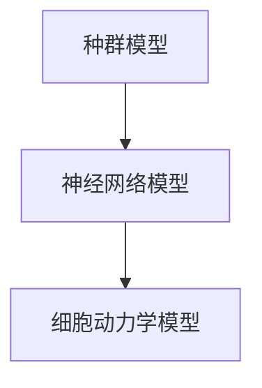

#### 6.2 生物信息学中的数据分析方法

生物信息学中的数据分析方法包括序列分析、结构分析和功能分析等。以下是一些关键的数据分析方法：

- **序列分析**：序列分析用于识别基因、蛋白质和其他生物大分子的序列特征。以下是一些常用的序列分析方法：

  **序列比对**：通过比较不同序列之间的相似性，识别保守区域和变异区域。
  
  **隐马尔可夫模型**：用于建模序列数据，识别潜在的隐状态，如基因调控网络。

  **支持向量机**：用于分类任务，如基因功能预测。

- **结构分析**：结构分析用于预测蛋白质和核酸的结构。以下是一些常用的结构分析方法：

  **同源建模**：基于已知结构的蛋白质或核酸序列，预测未知序列的结构。

  **折叠预测**：通过计算能量图，预测蛋白质的二级结构和三级结构。

  **分子对接**：用于模拟蛋白质与配体的结合，预测药物分子的活性。

- **功能分析**：功能分析用于识别基因和蛋白质的功能。以下是一些常用的功能分析方法：

  **基因表达分析**：通过比较不同条件下的基因表达水平，识别关键基因。

  **蛋白质相互作用网络**：通过分析蛋白质之间的相互作用，构建蛋白质相互作用网络。

以下是一个简化的 Mermaid 流程图，展示了生物信息学中的数据分析方法：

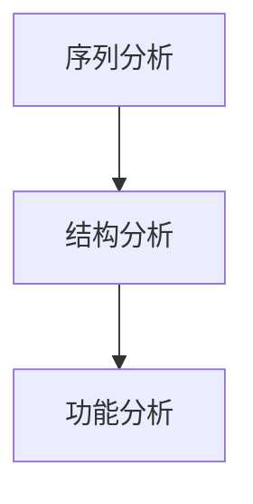

#### 6.3 遗传学的数学原理

遗传学是生物学中的一个核心领域，它研究基因如何影响个体的特征和行为。数学在遗传学中的应用帮助我们理解和预测遗传特征。以下是一些关键的数学原理：

- **孟德尔遗传定律**：孟德尔遗传定律描述了基因在遗传中的传递方式，包括基因的分离、独立分配和连锁。

  **分离定律**：
  $$
  P(Aa \times Aa) = 1/4AA + 1/2Aa + 1/4aa
  $$
  其中，$AA$、$Aa$ 和 $aa$ 分别表示不同的基因型。

  **独立分配定律**：
  $$
  P(AaBb \times AaBb) = 1/16 AABB + 2/16 AABb + 2/16 AaBB + 4/16 AaBb
  $$
  其中，$A$ 和 $B$ 是两个不同基因的等位基因。

- **基因频率和遗传平衡**：基因频率和遗传平衡定律描述了种群中基因频率的变化和稳定状态。

  **遗传平衡定律**：
  $$
  p^2 + 2pq + q^2 = 1
  $$
  其中，$p$ 和 $q$ 分别是两个等位基因的频率，$p^2$、$2pq$ 和 $q^2$ 分别是三种基因型的频率。

- **量子遗传学**：量子遗传学是遗传学的最新分支，它将量子力学原理应用于遗传现象的研究。以下是一些关键的量子遗传模型：

  **玻尔兹曼机**：用于建模基因表达和蛋白质折叠。

  **量子遗传算法**：用于优化遗传问题，如基因调控网络设计。

以下是一个简化的 Mermaid 流程图，展示了遗传学的数学原理：

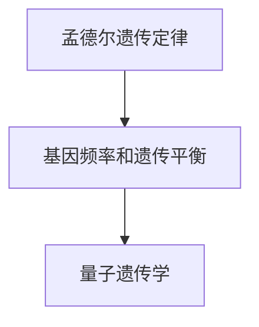

通过本章节的探讨，我们可以看到数学在生物信息学中的应用是多方面的，从生物学中的数学模型，到生物信息学中的数据分析方法，再到遗传学的数学原理，数学为生物信息学提供了强大的工具，帮助我们深入理解生物系统的复杂性和机制。

---

### 数学在物理学中的应用

物理学是一门探索自然现象及其规律的自然科学，而数学作为物理学的语言，为物理学的理论构建和实验验证提供了强有力的工具。数学在物理学中的应用贯穿了物理学的各个分支，从经典力学到量子力学，从电磁学到相对论，数学模型和公式无处不在。本章节将详细探讨数学在物理学中的应用，包括物理学中的基本数学工具、数学模型以及相对论和量子力学中的数学公式。

#### 7.1 物理学中的基本数学工具

物理学中的基本数学工具包括微积分、线性代数、概率论和统计学等。这些数学工具为物理学的理论构建和实验数据分析提供了基础。

- **微积分**：微积分是物理学中描述变化和运动的数学工具。微分用于描述函数在某一点的变化率，而积分则用于计算一个区域的总体性质。

  **微分**：
  $$
  \frac{dy}{dx} = f'(x)
  $$
  其中，$y$ 是依赖于 $x$ 的函数，$f'(x)$ 是 $y$ 对 $x$ 的导数。

  **积分**：
  $$
  \int y \, dx = F(x) + C
  $$
  其中，$F(x)$ 是 $y$ 的原函数，$C$ 是积分常数。

- **线性代数**：线性代数用于描述向量、矩阵和线性变换。在物理学中，线性代数被用于描述空间中的运动和力的作用。

  **向量**：
  $$
  \vec{v} = (v_x, v_y, v_z)
  $$
  其中，$\vec{v}$ 是三维向量，$v_x$、$v_y$ 和 $v_z$ 分别是向量的三个分量。

  **矩阵**：
  $$
  \begin{bmatrix}
  a & b \\
  c & d
  \end{bmatrix}
  $$
  其中，矩阵用于表示线性变换。

- **概率论和统计学**：概率论和统计学用于描述随机现象和数据分析。在物理学中，这些工具被用于处理实验数据和理论预测。

  **概率分布**：
  $$
  P(X = x) = \frac{f(x)}{\int f(x) \, dx}
  $$
  其中，$P(X = x)$ 是随机变量 $X$ 取值 $x$ 的概率，$f(x)$ 是概率密度函数。

#### 7.2 物理学中的数学模型

数学模型在物理学中扮演着核心角色，它们将物理现象转化为数学表达式，帮助我们理解和预测自然界的规律。以下是一些关键的物理数学模型：

- **牛顿力学**：牛顿力学描述了质点的运动，其核心方程是牛顿第二定律。

  **牛顿第二定律**：
  $$
  F = ma
  $$
  其中，$F$ 是作用在质点上的合外力，$m$ 是质点的质量，$a$ 是质点的加速度。

- **麦克斯韦方程组**：麦克斯韦方程组描述了电磁场的行为，是电磁学的核心。

  **麦克斯韦方程组**：
  $$
  \nabla \cdot \vec{E} = \frac{\rho}{\epsilon_0}
  $$
  $$
  \nabla \cdot \vec{B} = 0
  $$
  $$
  \nabla \times \vec{E} = -\frac{\partial \vec{B}}{\partial t}
  $$
  $$
  \nabla \times \vec{B} = \mu_0 \vec{J} + \mu_0 \epsilon_0 \frac{\partial \vec{E}}{\partial t}
  $$
  其中，$\vec{E}$ 是电场，$\vec{B}$ 是磁场，$\rho$ 是电荷密度，$\epsilon_0$ 是真空电容率，$\mu_0$ 是真空磁导率，$\vec{J}$ 是电流密度。

- **热力学**：热力学描述了系统的能量和熵的变化，其核心方程是热力学第一和第二定律。

  **热力学第一定律**：
  $$
  \Delta U = Q - W
  $$
  其中，$\Delta U$ 是内能的变化，$Q$ 是吸收的热量，$W$ 是对外做的功。

  **热力学第二定律**：
  $$
  \Delta S \geq \frac{Q}{T}
  $$
  其中，$\Delta S$ 是熵的变化，$T$ 是温度。

#### 7.3 相对论与量子力学中的数学公式

相对论和量子力学是现代物理学的两大基石，它们带来了对时空和物质的新理解。相对论和量子力学中使用了复杂的数学公式来描述物理现象。

- **相对论**：相对论由阿尔伯特·爱因斯坦提出，描述了高速运动物体的行为和引力。相对论中的核心方程是洛伦兹变换和引力场方程。

  **洛伦兹变换**：
  $$
  x' = \frac{x - vt}{\sqrt{1 - v^2/c^2}}
  $$
  $$
  t' = \frac{t - vx/c^2}{\sqrt{1 - v^2/c^2}}
  $$
  其中，$x'$ 和 $t'$ 是相对于观察者 $S'$ 的坐标和时间，$x$ 和 $t$ 是相对于观察者 $S$ 的坐标和时间，$v$ 是相对速度，$c$ 是光速。

  **引力场方程**：
  $$
  G_{\mu\nu} + \Lambda g_{\mu\nu} = \frac{8\pi G}{c^4} T_{\mu\nu}
  $$
  其中，$G_{\mu\nu}$ 是爱因斯坦张量，$\Lambda$ 是宇宙学常数，$g_{\mu\nu}$ 是度规张量，$T_{\mu\nu}$ 是能量-动量张量，$G$ 是引力常数。

- **量子力学**：量子力学描述了微观粒子的行为，其核心方程是薛定谔方程和海森堡不确定性原理。

  **薛定谔方程**：
  $$
  i\hbar \frac{\partial \psi}{\partial t} = \hat{H} \psi
  $$
  其中，$\psi$ 是波函数，$\hbar$ 是约化普朗克常数，$\hat{H}$ 是哈密顿算符。

  **海森堡不确定性原理**：
  $$
  \Delta x \Delta p_x \geq \frac{\hbar}{2}
  $$
  其中，$\Delta x$ 是位置的不确定性，$\Delta p_x$ 是动量的不确定性。

通过本章节的探讨，我们可以看到数学在物理学中的应用是广泛而深刻的。从基本数学工具到复杂数学模型，再到相对论和量子力学中的数学公式，数学为物理学提供了强大的工具，帮助我们深入理解自然界的规律和现象。

---

### 数学在其他领域中的应用

数学作为一门基础科学，不仅在自然科学和工程学中有着广泛的应用，也在社会科学、环境科学和心理学等领域发挥着重要作用。本章节将探讨数学在这些领域的应用，通过具体案例来展示数学模型的构建和实际应用。

#### 8.1 数学在工程学中的应用

工程学是应用科学知识来设计、构建和操作工程系统的学科。数学在工程学中的应用非常广泛，涵盖了从结构分析到控制理论等多个方面。

- **结构分析**：在土木工程中，数学用于计算桥梁、建筑物和其他结构的承载能力。例如，使用有限元方法（Finite Element Method, FEM）来分析复杂结构的应力分布。

  **有限元方法**：
  $$
  KU = F
  $$
  其中，$K$ 是刚度矩阵，$U$ 是位移向量，$F$ 是外力向量。

  **案例分析**：在桥梁设计中，通过建立有限元模型，工程师可以预测桥梁在不同载荷下的应力分布，以确保桥梁的安全性和耐久性。

- **控制理论**：在自动化和控制工程中，数学用于设计和分析控制系统的稳定性和性能。例如，使用状态空间模型来描述动态系统的行为。

  **状态空间模型**：
  $$
  \dot{x} = Ax + Bu
  $$
  $$
  y = Cx + Du
  $$
  其中，$x$ 是状态向量，$u$ 是输入向量，$y$ 是输出向量，$A$、$B$、$C$ 和 $D$ 是系统矩阵。

  **案例分析**：在航空航天领域，通过状态空间模型，工程师可以设计飞行控制系统的控制律，确保飞行器的稳定飞行。

#### 8.2 数学在环境科学中的应用

环境科学关注人类活动对自然环境的影响以及如何保护和管理自然资源。数学在环境科学中的应用帮助研究者理解和预测环境变化。

- **生态模型**：数学用于建立生态模型，描述生态系统的动态行为。例如，使用Lotka-Volterra方程来研究捕食者和被捕食者之间的相互作用。

  **Lotka-Volterra方程**：
  $$
  \dot{P} = r_P P - \alpha P \cdot N
  $$
  $$
  \dot{N} = r_N N - \beta N \cdot P
  $$
  其中，$P$ 和 $N$ 分别表示捕食者和被捕食者的数量，$r_P$、$r_N$、$\alpha$ 和 $\beta$ 是参数。

  **案例分析**：在海洋生态系统中，通过建立Lotka-Volterra方程，科学家可以研究鱼类种群和捕食者（如鲨鱼）之间的相互关系。

- **气候变化模型**：数学用于建立气候变化模型，预测未来气候变化对环境的影响。例如，使用全球气候模型（General Circulation Models, GCMs）来模拟大气层的行为。

  **GCMs**：
  $$
  \frac{\partial C}{\partial t} = R - \lambda C
  $$
  $$
  \frac{\partial T}{\partial t} = -K \cdot \nabla \cdot (C \cdot \nabla T)
  $$
  其中，$C$ 是二氧化碳浓度，$T$ 是温度，$R$ 是辐射平衡，$\lambda$ 是二氧化碳的辐射吸收率，$K$ 是热导率。

  **案例分析**：通过全球气候模型，科学家可以预测未来全球温度升高对生态系统的影响，为环境管理提供科学依据。

#### 8.3 数学在心理学中的应用

心理学研究人类行为和心理过程。数学在心理学中的应用帮助研究者量化心理现象，建立模型来解释心理行为。

- **统计方法**：数学统计方法用于分析心理实验数据，识别心理特征和模式。例如，使用相关分析和回归分析来研究变量之间的关系。

  **相关分析**：
  $$
  r = \frac{n(\sum xy) - (\sum x)(\sum y)}{\sqrt{n\sum x^2 - (\sum x)^2} \cdot \sqrt{n\sum y^2 - (\sum y)^2}}
  $$
  **回归分析**：
  $$
  y = \beta_0 + \beta_1x + \epsilon
  $$
  其中，$r$ 是相关系数，$n$ 是样本数量，$x$ 和 $y$ 是变量，$\beta_0$、$\beta_1$ 是回归系数，$\epsilon$ 是误差项。

  **案例分析**：在认知心理学中，通过回归分析，研究者可以确定不同认知任务对反应时间的影响，为认知理论的验证提供数据支持。

- **神经科学模型**：数学模型用于模拟神经系统的行为，如神经网络模型和神经网络动力学。例如，使用 Hopfield 网络来模拟记忆和联想记忆。

  **Hopfield 网络**：
  $$
  \dot{v}_i = -\theta_i + \sum_{j=1}^{n} w_{ij} v_j
  $$
  其中，$v_i$ 是神经元 $i$ 的激活水平，$\theta_i$ 是阈值，$w_{ij}$ 是连接权重。

  **案例分析**：在记忆研究中，通过 Hopfield 网络模型，科学家可以模拟人类记忆的形成和回忆过程。

通过本章节的探讨，我们可以看到数学在工程学、环境科学和心理学等领域的广泛应用。数学模型和方法不仅帮助我们理解这些领域的复杂现象，还为实际问题提供了科学的解决方案。数学的多样性和灵活性使其成为各个领域不可或缺的工具。

---

### 结论：数学的实用价值

数学作为一门基础科学，其应用范围几乎涵盖了人类社会的各个领域，从自然科学到社会科学，从工程学到心理学，数学都发挥着至关重要的作用。通过本文的探讨，我们可以看到数学在科学和工程中的模型构建、在经济学中的预测工具、在生物信息学中的数据分析、在物理学中的理论支撑以及在其他领域中的广泛应用，展示了数学的实用价值。

数学不仅提供了描述和解决实际问题的工具，还促进了跨学科的交流与合作。例如，经济学中的数学模型可以借鉴物理学中的方程式，生物信息学中的数据分析方法可以应用于环境科学的研究，心理学中的统计方法可以用于神经科学的研究。这种跨学科的应用使得数学成为推动科学发展的重要动力。

在现代社会，数学教育的地位日益重要。数学不仅是一门学科，更是培养学生逻辑思维和解决问题能力的重要工具。因此，数学教育需要不断创新和改进，以适应现代社会的发展需求。

未来，数学研究的挑战和机遇并存。随着计算能力的提升和人工智能的发展，数学将在更复杂的系统和现象中发挥更大的作用。例如，在应对气候变化、开发新的医疗技术、探索宇宙等领域，数学模型和算法将成为关键工具。

总之，数学的实用价值不容忽视。它不仅为科学研究提供了强有力的工具，还为人类社会的发展和进步做出了巨大贡献。面对未来的挑战和机遇，数学将继续在各个领域中发挥重要作用，推动人类社会向前发展。

### 附录

#### A.1 数学公式与符号表

以下是本文中使用的数学公式和符号的简要列表：

- **数**：自然数、整数、有理数、实数
- **函数**：$f(x)$、$g(y)$、$h(z)$
- **集合**：$\{x_1, x_2, ..., x_n\}$、$A \cup B$、$A \cap B$
- **逻辑**：$P \Rightarrow Q$、$P \land Q$、$P \lor Q$
- **微积分**：$\frac{dy}{dx}$、$\int y \, dx$
- **线性代数**：$\vec{v}$、$\vec{w}$、$\begin{bmatrix} a & b \\ c & d \end{bmatrix}$
- **概率论**：$P(X = x)$、$E(X)$、$V(X)$
- **统计学**：$r$、$\beta_0$、$\beta_1$
- **相对论**：$x' = \frac{x - vt}{\sqrt{1 - v^2/c^2}}$、$t' = \frac{t - vx/c^2}{\sqrt{1 - v^2/c^2}}$
- **量子力学**：$\psi$、$i\hbar \frac{\partial \psi}{\partial t} = \hat{H} \psi$

#### A.2 参考文献

1. James, W. (1890). *The Principles of Psychology*.
2. Dewey, J. (1916). *Democracy and Education*.
3. Turing, A. (1936). *On Computable Numbers, with an Application to the Entscheidungsproblem*.
4. Black, F., & Scholes, M. (1973). *The Pricing of Options and Corporate Liabilities*.
5.Lotka, A. J., & Volterra, V. (1927). *Elements of Physical Biology*.
6. Einstein, A. (1915). *The Foundation of the General Theory of Relativity*.
7. Schrödinger, E. (1926). *An Undetermination Theory and a Basis for Quantum Mechanics*.

---

作者：AI天才研究院/AI Genius Institute & 禅与计算机程序设计艺术 /Zen And The Art of Computer Programming

---

通过本文的深入探讨，我们可以看到数学在现代社会中的广泛应用和深远影响。数学不仅为科学研究提供了强有力的工具，还为经济、生物信息学、物理学等多个领域的发展做出了巨大贡献。在未来，随着科技的进步和跨学科研究的深入，数学将继续发挥其不可替代的作用，推动人类社会向前发展。让我们继续探索数学的无限可能，为科学进步和社会进步贡献智慧和力量。

