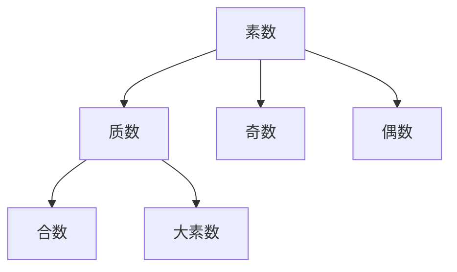
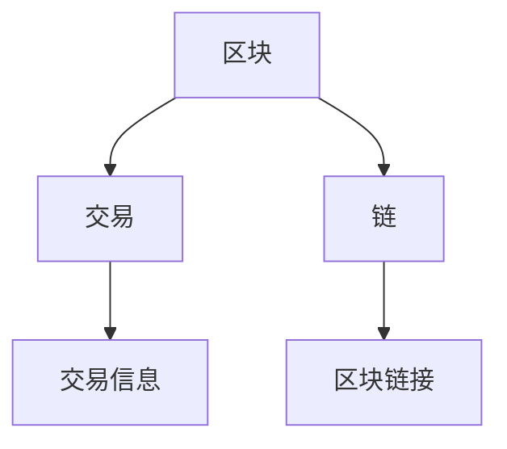
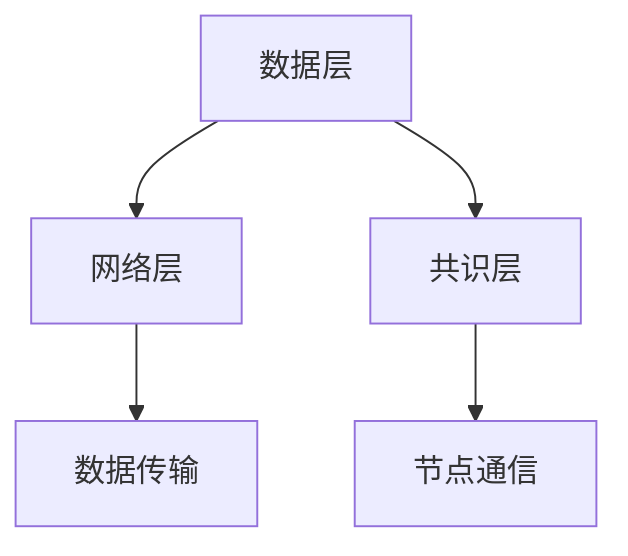
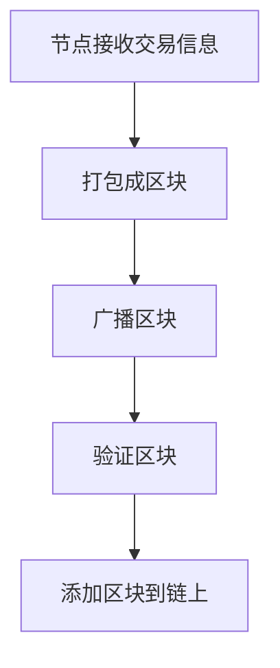
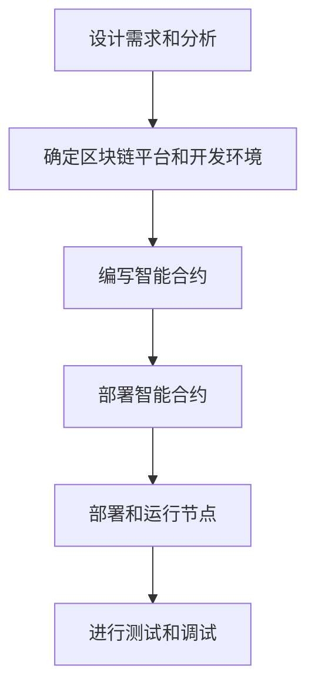

                 


### 文章标题：《数学与加密货币：区块链技术的数学基础》

#### 关键词：加密货币、区块链、数学基础、密码学、共识机制、智能合约

#### 摘要：

本文旨在深入探讨加密货币与区块链技术的数学基础，从数学和密码学的角度解析区块链的核心原理。文章首先介绍数论、密码学基础、离散数学等数学概念，接着讲解区块链的基本原理、加密算法、共识机制和智能合约，最后通过实际项目实战，展示如何应用这些数学知识解决实际问题。

### 第一部分：数学基础

#### 第1章 数论

数论是数学的一个分支，主要研究整数及其性质。在区块链技术中，数论的应用尤为广泛，特别是在加密算法和共识机制的设计中。

#### 1.1 数论的基本概念

数论的基本概念包括素数、合数、奇数、偶数、质数等。素数是只能被1和自身整除的大于1的自然数，是加密货币和区块链技术中常用的基本元素。

**Mermaid 流程图：**



#### 1.2 大素数生成算法

大素数生成算法是区块链技术中常用的算法之一。其中，最著名的算法是米勒-拉宾素性测试算法。该算法可以快速判断一个大数是否为素数。

**伪代码：**

```python
def miller_rabin(n, k):
    if n == 2 or n == 3:
        return True
    if n % 2 == 0:
        return False

    r, s = 0, n - 1
    while s % 2 == 0:
        r += 1
        s //= 2

    for _ in range(k):
        a = random.randint(2, n - 2)
        x = pow(a, s, n)
        if x == 1 or x == n - 1:
            continue
        for _ in range(r - 1):
            x = pow(x, 2, n)
            if x == n - 1:
                break
        else:
            return False
    return True
```

#### 1.3 大素数检测算法

大素数检测算法主要用于检测大素数，其中，最常用的算法是 AKS 素性检测算法。该算法可以在多项式时间内判断一个大数是否为素数。

**伪代码：**

```python
def aks(n):
    if n < 2:
        return False
    if n % 2 == 0:
        return n == 2

    for a in range(2, int(n ** 0.5) + 1):
        if n % a == 0:
            return False
    return True
```

### 第二部分：区块链技术

#### 第5章 区块链原理

区块链技术是一种分布式数据库技术，具有去中心化、不可篡改、透明等特性。在区块链中，每个区块都包含一定数量的交易信息，并通过加密算法进行连接，形成一条连续的数据链。

#### 5.1 区块链基本概念

区块链的基本概念包括区块、交易、链等。区块是区块链中的基本单位，包含一定数量的交易信息；交易是区块链中的数据元素，用于记录资金流动等信息；链是区块按照一定规则连接而成的数据结构。

**Mermaid 流程图：**



#### 5.2 区块链架构

区块链架构主要包括三个部分：数据层、网络层、共识层。数据层存储区块链上的所有数据；网络层实现数据传输和节点之间的通信；共识层确保所有节点数据一致性。

**Mermaid 流程图：**



#### 5.3 区块链工作流程

区块链的工作流程主要包括以下几个步骤：

1. 节点接收交易信息；
2. 节点将交易信息打包成区块；
3. 节点广播区块给其他节点；
4. 其他节点验证区块的有效性；
5. 一致性算法决定区块是否被添加到链上。

**Mermaid 流程图：**



### 第三部分：项目实战

#### 第9章 项目实战

在本章中，我们将通过一个实际项目，展示如何利用数学基础和区块链技术解决实际问题。该项目将实现一个简单的去中心化投票系统，用于投票选举。

#### 9.1 区块链应用开发流程

区块链应用开发流程主要包括以下几个步骤：

1. 设计需求和分析；
2. 确定区块链平台和开发环境；
3. 编写智能合约；
4. 部署智能合约；
5. 部署和运行节点；
6. 进行测试和调试。

**Mermaid 流程图：**



#### 9.2 实际案例解析

在本案例中，我们将实现一个简单的去中心化投票系统，用于投票选举。该系统包括以下功能：

1. 创建投票；
2. 投票；
3. 查看投票结果。

**代码实现：**

```solidity
pragma solidity ^0.8.0;

contract Voting {
    struct Vote {
        address voter;
        uint256 option;
    }

    mapping(uint256 => mapping(address => bool)) public votes;
    mapping(uint256 => string) public options;
    uint256 public num_options;
    mapping(uint256 => Vote[]) public vote_list;

    function createVote(string[] memory options_list) public {
        for (uint256 i = 0; i < options_list.length; i++) {
            options[num_options] = options_list[i];
            num_options++;
        }
    }

    function vote(uint256 option) public {
        require(!votes[option][msg.sender], "已经投票");
        votes[option][msg.sender] = true;
        vote_list[option].push(Vote(msg.sender, option));
    }

    function getResults() public view returns (uint256[] memory results) {
        results = new uint256[](num_options);
        for (uint256 i = 0; i < num_options; i++) {
            results[i] = vote_list[i].length;
        }
        return results;
    }
}
```

#### 9.3 代码实战

在本节中，我们将使用 Truffle 和 Ganache 搭建开发环境，实现上述投票系统的功能。

**步骤 1：安装 Truffle 和 Ganache**

```bash
npm install -g truffle
npm install -g ganache-cli
```

**步骤 2：创建 Truffle 项目**

```bash
truffle init
```

**步骤 3：编写智能合约**

在项目目录下创建一个名为 `contracts` 的文件夹，并在其中创建一个名为 `Voting.sol` 的文件，将上述代码复制到该文件中。

**步骤 4：编译智能合约**

```bash
truffle compile
```

**步骤 5：部署智能合约**

```bash
truffle migrate --network localhost
```

**步骤 6：运行节点**

```bash
ganache-cli -l 100000000
```

**步骤 7：进行测试和调试**

使用 Truffle 的测试框架编写测试脚本，并进行测试。

```bash
truffle test
```

#### 9.4 项目小结

在本项目中，我们通过实现一个简单的去中心化投票系统，展示了如何利用数学基础和区块链技术解决实际问题。这个项目不仅帮助我们理解了区块链技术的基本原理，还让我们学会了如何在实际项目中应用这些技术。

### 第四部分：附录

#### 附录 A：常用数学公式

在本附录中，我们将列出一些常用的数学公式，以供读者参考。

##### A.1 概率论公式

$$
P(A \cap B) = P(A) \cdot P(B|A)
$$

$$
P(A \cup B) = P(A) + P(B) - P(A \cap B)
$$

##### A.2 统计学公式

$$
\bar{x} = \frac{1}{n} \sum_{i=1}^{n} x_i
$$

$$
s^2 = \frac{1}{n-1} \sum_{i=1}^{n} (x_i - \bar{x})^2
$$

##### A.3 线性代数公式

$$
Ax = b
$$

$$
A^T A x = A^T b
$$

#### 附录 B：编程语言基础

在本附录中，我们将简要介绍 Python 和 Solidity 这两种编程语言。

##### B.1 Python基础

Python 是一种高级编程语言，具有简单易学、功能强大的特点。Python 的语法简洁明了，适合快速开发和测试。

##### B.2 Solidity基础

Solidity 是一种用于编写智能合约的编程语言。Solidity 语法类似于 JavaScript，但有一些特殊的语法和功能，以适应区块链环境。

#### 附录 C：区块链工具和资源

在本附录中，我们将介绍一些常用的区块链工具和资源，以帮助读者深入了解区块链技术。

##### C.1 区块链平台

- Ethereum：最流行的智能合约平台。
- Binance Smart Chain：快速且具有高吞吐量的智能合约平台。
- Polkadot：跨链技术平台。

##### C.2 区块链浏览器

- Etherscan：Ethereum区块链浏览器。
- BscScan：Binance Smart Chain区块链浏览器。

##### C.3 开发工具

- Truffle：用于智能合约开发和测试的工具。
- Hardhat：用于智能合约开发和测试的框架。
- Remix：在线智能合约开发环境。

### 结束语

数学与加密货币、区块链技术之间的联系日益紧密。本文通过深入分析数学与区块链技术的数学基础，展示了如何利用数学知识解决实际问题。我们相信，随着技术的不断发展，数学与加密货币、区块链技术之间的联系将更加紧密，为未来的科技创新提供更多可能性。

作者：AI天才研究院/AI Genius Institute & 禅与计算机程序设计艺术 /Zen And The Art of Computer Programming

