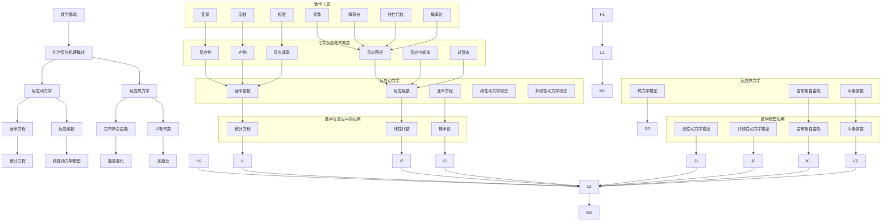

                 

### 文章标题

《数学与化学反应机理的定量描述》

### 关键词

数学、化学反应机理、定量描述、模型建立、算法原理、仿真分析

### 摘要

本文旨在探讨数学在描述化学反应机理中的重要作用。通过分析化学反应的基本概念和机理，结合数学模型、公式和算法，我们能够以定量方式描述化学反应过程。文章首先介绍了数学基础和化学反应机理的基本概念，随后深入讲解了数学在反应动力学和反应热力学中的应用，包括速率方程和吉布斯自由能的计算。此外，本文还详细阐述了线性动力学模型和非线性动力学模型，并使用了微分方程和离散方程对化学反应进行定量描述。最后，通过实际案例展示了如何运用数学模型优化化学反应机理，并给出了项目的详细解析和小结。通过本文的阅读，读者将全面了解数学在化学反应机理研究中的重要性和实际应用。

## 第一步：设计核心章节内容

为了系统性地探讨数学在化学反应机理中的应用，本文将分为以下几个核心章节：

### 第1章：数学基础与化学反应机理概述

在本章节中，我们将介绍数学与化学反应机理的基本概念，并建立两者之间的联系。内容将包括：

- **1.1 数学基础**：介绍变量、函数、极限、导数等基本数学概念，以及常用的数学工具，如微积分、线性代数和概率论。

- **1.2 化学反应机理概述**：介绍化学反应的基本概念，如反应物、产物、反应速率等，并简要概述化学反应的机理，如反应路径和反应中间体。

### 第2章：数学在描述化学反应中的应用

本章节将详细讲解数学在描述化学反应中的应用，重点讨论反应动力学和反应热力学，包括：

- **2.1 反应动力学**：介绍反应动力学的基本概念，如速率方程和反应级数，并使用伪代码详细描述速率方程的建立和反应速率的计算。

- **2.2 反应热力学**：介绍反应热力学的基本概念，如吉布斯自由能和平衡常数，并使用伪代码详细描述吉布斯自由能和平衡常数的计算。

### 第3章：数学模型在化学反应机理中的应用

本章节将介绍数学模型在化学反应机理中的应用，包括线性动力学模型和非线性动力学模型：

- **3.1 线性动力学模型**：介绍线性动力学模型的基本原理，建立模型的过程，以及求解线性动力学模型的方法。

- **3.2 非线性动力学模型**：介绍非线性动力学模型的基本原理，建立模型的过程，以及求解非线性动力学模型的方法。

### 第4章：数学公式在化学反应机理中的应用

本章节将重点讨论数学公式在化学反应机理中的应用，包括微分方程和离散方程：

- **4.1 微分方程**：介绍微分方程的基本概念，建立微分方程的过程，以及求解微分方程的方法。

- **4.2 离散方程**：介绍离散方程的基本概念，建立离散方程的过程，以及求解离散方程的方法。

### 第5章：数学模型在化学反应机理分析中的应用

本章节将探讨数学模型在化学反应机理分析中的应用，包括化学反应路径分析和化学反应中间体分析：

- **5.1 化学反应路径分析**：介绍化学反应路径的基本概念，建立路径分析模型的过程，以及求解路径分析模型的方法。

- **5.2 化学反应中间体分析**：介绍化学反应中间体的基本概念，建立中间体分析模型的过程，以及求解中间体分析模型的方法。

### 第6章：数学模型在化学反应机理优化中的应用

本章节将介绍如何使用数学模型优化化学反应机理，重点讨论最优化方法：

- **6.1 最优化方法**：介绍最优化方法的基本概念，建立最优化模型的过程，以及求解最优化模型的方法。

通过上述章节的设置，本文将从基础到应用，逐步深入地探讨数学在化学反应机理中的定量描述。希望读者能够通过本文的阅读，对数学与化学反应机理的关系有更深入的理解。

## 第1章：数学基础与化学反应机理概述

### 1.1 数学基础

在探讨数学与化学反应机理的关系之前，我们首先需要了解数学的基本概念和常用工具。数学是描述自然现象和科学问题的重要工具，它提供了逻辑严密、精确性高的方法来处理数据和信息。以下将介绍一些基本的数学概念和常用工具。

#### 1.1.1 基本数学概念

- **变量**：在数学中，变量是用来表示未知数值的符号。变量通常用字母表示，如 \( x \)、\( y \) 等。

- **函数**：函数是数学中最基本的概念之一，它描述了两个量之间的依赖关系。通常表示为 \( f(x) \)，其中 \( x \) 是自变量，\( f(x) \) 是因变量。

- **极限**：极限是微积分中的基本概念，它描述了当自变量趋近某个值时，函数值的变化趋势。极限通常用符号 \(\lim_{{x \to a}} f(x) \) 表示。

- **导数**：导数是描述函数变化率的数学工具。对于函数 \( f(x) \)，其导数 \( f'(x) \) 表示函数在 \( x \) 点的瞬时变化率。

#### 1.1.2 数学工具

- **微积分**：微积分是研究函数变化的数学分支，包括微分和积分。微分研究函数在某一点的变化率，而积分研究函数在某一区间内的累计效果。

- **线性代数**：线性代数是研究向量空间和线性变换的数学工具。它涉及矩阵运算、向量空间、特征值和特征向量等概念。

- **概率论**：概率论是研究随机事件和概率的数学分支。它涉及概率分布、期望、方差等概念。

#### 1.1.3 数学工具的应用

这些数学工具在化学反应机理的研究中有着广泛的应用。例如：

- **微积分**：用于描述反应速率的变化，建立速率方程，并计算反应过程中的时间依赖性。

- **线性代数**：用于处理反应物和产物之间的线性关系，建立线性动力学模型，并求解系统的稳态解。

- **概率论**：用于分析反应过程中的不确定性，计算反应的成功概率，并评估系统的稳定性。

通过掌握这些数学基础，我们可以更好地理解和描述化学反应机理，从而为后续章节的深入探讨打下坚实的基础。

### 1.2 化学反应机理概述

化学反应是化学领域中最基本的现象之一，它涉及反应物通过原子和分子的重新排列形成产物。化学反应机理则描述了这些反应是如何发生的，包括反应路径、反应中间体和反应机理。以下是对化学反应机理的基本概述。

#### 1.2.1 化学反应基本概念

- **反应物**：反应物是参与化学反应的物质，它们在反应过程中发生化学变化。

- **产物**：产物是化学反应的最终生成物，它们是由反应物通过化学反应形成的。

- **反应速率**：反应速率描述了反应物转化为产物的快慢程度，通常用反应物浓度的变化率表示。

#### 1.2.2 化学反应机理

化学反应机理是指反应物如何通过一系列步骤转化为产物的过程。以下是一些关键概念：

- **反应路径**：反应路径描述了反应物从初始状态到产物状态的转变过程。它通常包括反应中间体和过渡态。

- **反应中间体**：反应中间体是反应过程中短暂存在的物质，它们是在反应路径上形成的。

- **过渡态**：过渡态是反应路径上的一个关键点，它是反应物转化为产物的必经之路。过渡态的能量高于反应物和产物的能量。

- **反应机理**：反应机理是描述反应物如何通过一系列步骤转化为产物的理论模型。它包括反应步骤、反应中间体和过渡态。

#### 1.2.3 化学反应机理的研究方法

研究化学反应机理的方法包括实验和理论计算。实验方法主要通过反应条件的改变和监测反应过程中物质的变化来推断反应机理。理论计算方法则使用量子化学和分子动力学等方法，结合数学模型和公式来模拟和预测反应过程。

通过了解化学反应机理的基本概念和研究方法，我们可以更好地理解和预测化学反应的行为，为后续章节中数学在描述化学反应机理中的应用打下基础。

### 1.3 数学与化学反应机理的联系

数学在化学反应机理的研究中扮演着重要的角色，它为我们提供了一种定量描述化学反应过程的方法。通过数学工具和模型，我们可以更精确地理解反应的动态行为，从而更好地预测和控制化学反应。以下是数学与化学反应机理之间的一些主要联系：

#### 1.3.1 微分方程的应用

微分方程是描述化学反应动力学的重要数学工具。反应速率方程通常可以用微分方程表示，如以下形式的速率方程：

$$ \frac{d[A]}{dt} = -k[A][B] $$

其中，\([A]\) 和 \([B]\) 分别是反应物 A 和 B 的浓度，\(t\) 是时间，\(k\) 是反应速率常数。通过解这个微分方程，我们可以得到反应物浓度随时间的变化规律。

#### 1.3.2 线性代数在动力学模型中的应用

线性代数在描述多个反应物和产物之间的复杂关系时非常有用。例如，对于多步骤的链式反应，可以使用线性代数的方法建立反应动力学模型，如以下形式的线性方程组：

$$
\begin{cases}
\frac{d[A_1]}{dt} = -k_1[A_1][A_2] \\
\frac{d[A_2]}{dt} = k_1[A_1][A_2] - k_2[A_2]
\end{cases}
$$

通过解这个线性方程组，我们可以得到各个反应物和产物的浓度变化情况。

#### 1.3.3 概率论在反应动力学中的应用

概率论在描述反应过程中的随机性方面也起到了关键作用。例如，在反应机理研究中，我们可能会遇到反应路径的分支概率，这可以通过概率论中的概率分布函数来描述。此外，概率论还可以帮助我们评估反应系统的稳定性。

#### 1.3.4 数学模型在反应路径分析中的应用

数学模型不仅用于描述反应速率，还可以用于分析反应路径。例如，通过构建反应路径的马尔可夫模型，我们可以研究反应过程中的状态转移概率，从而更好地理解反应机理。

通过这些数学工具和方法，我们可以定量地描述化学反应机理，从而为化学反应的控制和优化提供科学依据。在接下来的章节中，我们将进一步探讨数学在化学反应动力学、反应热力学以及模型建立中的应用。

### 1.4 化学反应机理中的关键数学概念

在探讨数学与化学反应机理的定量描述时，我们首先需要了解一些关键数学概念。这些概念不仅是理解化学反应机理的基础，也是建立和求解相关数学模型的核心。

#### 1.4.1 反应级数

反应级数是指反应速率对反应物浓度的依赖关系。具体来说，反应级数描述了反应速率与反应物浓度之间的幂次关系。例如，对于一阶反应，速率方程可以表示为：

$$ \frac{d[A]}{dt} = -k[A] $$

而对于二阶反应，速率方程则是：

$$ \frac{d[A]}{dt} = -k[A]^2 $$

反应级数可以通过实验测定，并用于建立反应动力学模型。

#### 1.4.2 速率常数

速率常数是反应速率方程中的系数，它反映了反应速率对反应物浓度变化的敏感程度。速率常数通常由实验测定，并依赖于反应温度、催化剂等条件。例如，对于一个一级反应，速率常数 \( k \) 可以表示为：

$$ \frac{d[A]}{dt} = -k[A] $$

其中，\( k \) 是速率常数。

#### 1.4.3 反应路径

反应路径是反应物通过一系列中间体和过渡态转化为产物的过程。在数学上，反应路径可以通过图论模型或微分方程组来描述。例如，我们可以用以下形式的微分方程组描述反应路径：

$$
\begin{cases}
\frac{d[X_1]}{dt} = -k_1[X_1][X_2] \\
\frac{d[X_2]}{dt} = k_1[X_1][X_2] - k_2[X_2]
\end{cases}
$$

其中，\( X_1 \) 和 \( X_2 \) 是反应中间体，\( k_1 \) 和 \( k_2 \) 是速率常数。

#### 1.4.4 吉布斯自由能

吉布斯自由能是描述化学反应自发性的热力学函数。它反映了反应在恒温恒压条件下释放或吸收的能量。吉布斯自由能的变化 \(\Delta G\) 可以用来判断反应的自发性，如果 \(\Delta G < 0\)，反应是自发的；如果 \(\Delta G > 0\)，反应是不自发的。吉布斯自由能的表达式为：

$$ \Delta G = \Delta H - T\Delta S $$

其中，\(\Delta H\) 是焓变，\(T\) 是温度，\(\Delta S\) 是熵变。

#### 1.4.5 平衡常数

平衡常数是描述化学反应在平衡状态时反应物和产物浓度比的常数。对于反应 \( aA + bB \leftrightarrow cC + dD \)，平衡常数 \( K \) 可以表示为：

$$ K = \frac{[C]^c[D]^d}{[A]^a[B]^b} $$

平衡常数仅与温度有关，可以用来计算反应在平衡状态时的浓度分布。

通过理解这些关键数学概念，我们可以更深入地探讨数学在描述化学反应机理中的应用，并建立相应的数学模型。在接下来的章节中，我们将进一步探讨如何使用这些概念来定量描述化学反应过程。

### 1.5 数学与化学反应机理定量描述的Mermaid流程图

为了更直观地展示数学与化学反应机理之间的联系，我们可以使用Mermaid流程图来描述这一过程。以下是该流程图的具体内容和解释：



**流程图解释：**

- **数学工具**（A）：包括变量、函数、极限、导数等基本数学概念，以及微积分、线性代数和概率论等常用的数学工具。

- **化学反应基本概念**（B）：涉及反应物、产物、反应速率等基本概念，以及反应路径、反应中间体和过渡态等机理描述。

- **反应动力学**（C）：包括速率常数、反应级数和速率方程等核心概念，以及线性动力学模型和非线性动力学模型。

- **反应热力学**（D）：涉及吉布斯自由能、平衡常数和热力学模型等关键概念。

- **数学在反应中的应用**（E）：展示了如何使用微分方程、线性代数和概率论等数学工具来描述反应动力学和热力学。

- **数学模型应用**（F）：展示了如何将数学模型应用于反应动力学和热力学的分析，包括线性动力学模型和非线性动力学模型。

- **反应热力学与数学模型**（G、H）：展示了吉布斯自由能和平衡常数在反应热力学中的应用。

通过这个Mermaid流程图，我们可以清晰地看到数学与化学反应机理之间的联系，以及数学工具在描述和解析化学反应过程中的应用。接下来，我们将进一步探讨数学在具体化学反应中的应用。

## 第2章：数学在描述化学反应中的应用

在化学反应中，数学作为一种强有力的工具，帮助我们理解和量化反应过程。本章将重点讨论数学在描述化学反应中的两个关键领域：反应动力学和反应热力学。我们将介绍这些领域的核心概念，使用伪代码详细描述相关算法，并通过具体例子来说明如何应用这些数学工具来分析化学反应。

### 2.1 反应动力学

反应动力学研究反应物转化为产物的速率和机制。它通过描述反应物浓度随时间的变化来了解反应过程。以下是一级和二级反应的速率方程及其求解方法。

#### 2.1.1 反应速率方程

一级反应：速率方程通常表示为
$$ \frac{d[A]}{dt} = -k[A] $$
其中，\[A\] 是反应物浓度，\(k\) 是速率常数。

二级反应：速率方程则表示为
$$ \frac{d[A]}{dt} = -k[A]^2 $$
其中，\[A\] 是反应物浓度，\(k\) 是速率常数。

#### 2.1.2 速率方程的建立

为了建立速率方程，我们通常需要进行实验来测定反应速率和反应物浓度之间的关系。以下是一级和二级反应速率方程的建立过程：

**一级反应速率方程建立：**

1. 通过实验测量反应物浓度随时间的变化。
2. 将实验数据代入速率方程 \(\frac{d[A]}{dt} = -k[A]\)。
3. 通过最小二乘法拟合实验数据，求解速率常数 \(k\)。

**二级反应速率方程建立：**

1. 通过实验测量反应物浓度平方随时间的变化。
2. 将实验数据代入速率方程 \(\frac{d[A]}{dt} = -k[A]^2\)。
3. 通过最小二乘法拟合实验数据，求解速率常数 \(k\)。

#### 2.1.3 反应速率的计算

**一级反应速率计算：**

使用伪代码表示一级反应速率计算过程如下：

```plaintext
输入：初始浓度 [A]_0，时间 t，速率常数 k
输出：任意时刻 t 的浓度 [A](t)

[A](t) = [A]_0 * e^(-k*t)
```

**二级反应速率计算：**

使用伪代码表示二级反应速率计算过程如下：

```plaintext
输入：初始浓度 [A]_0，时间 t，速率常数 k
输出：任意时刻 t 的浓度 [A](t)

[A](t) = [A]_0 / (1 + k*t + k*t^2)
```

#### 2.1.4 示例

假设我们有一级反应，初始浓度为 1 mol/L，速率常数 \( k = 0.1 \text{ s}^{-1} \)。我们要计算10秒后的浓度。

```plaintext
初始浓度 [A]_0 = 1 mol/L
速率常数 k = 0.1 s^{-1}
时间 t = 10 s

[A](10) = [A]_0 * e^(-k*t)
       = 1 mol/L * e^(-0.1*10)
       = 1 mol/L * e^{-1}
       ≈ 0.368 mol/L
```

因此，10秒后反应物的浓度约为0.368 mol/L。

### 2.2 反应热力学

反应热力学研究化学反应的热力学性质，包括能量变化和平衡状态。以下将介绍吉布斯自由能和平衡常数的概念及其计算方法。

#### 2.2.1 吉布斯自由能

吉布斯自由能（\( \Delta G \)）是描述化学反应自发性的重要热力学函数。它由以下公式给出：

$$ \Delta G = \Delta H - T\Delta S $$

其中，\( \Delta H \) 是焓变，\( T \) 是温度（单位：开尔文），\( \Delta S \) 是熵变。

**自发性判断：**
- 如果 \( \Delta G < 0 \)，反应是自发的。
- 如果 \( \Delta G > 0 \)，反应是非自发的。
- 如果 \( \Delta G = 0 \)，系统处于平衡状态。

#### 2.2.2 平衡常数

平衡常数（\( K \)）是描述反应在平衡状态时反应物和产物浓度比的常数。对于反应 \( aA + bB \leftrightarrow cC + dD \)，平衡常数 \( K \) 表示为：

$$ K = \frac{[C]^c[D]^d}{[A]^a[B]^b} $$

平衡常数仅与温度有关，可以用来计算反应在平衡状态时的浓度分布。

#### 2.2.3 吉布斯自由能和平衡常数的计算

**吉布斯自由能的计算：**

1. 测定反应的焓变 \( \Delta H \) 和熵变 \( \Delta S \)。
2. 将实验数据代入公式 \( \Delta G = \Delta H - T\Delta S \)。

**平衡常数的计算：**

1. 测定反应物和产物的浓度。
2. 将浓度数据代入平衡常数公式 \( K = \frac{[C]^c[D]^d}{[A]^a[B]^b} \)。

#### 2.2.4 示例

假设我们有一个反应 \( 2A \leftrightarrow B \)，在平衡状态时，\[A\] = 0.1 mol/L，\[B\] = 0.2 mol/L。我们要计算平衡常数 \( K \)。

```plaintext
平衡时浓度 [A] = 0.1 mol/L
平衡时浓度 [B] = 0.2 mol/L
反应方程为 2A \leftrightarrow B

K = [B] / ([A]^2)
  = 0.2 / (0.1^2)
  = 20
```

因此，这个反应的平衡常数 \( K \) 为20。

通过以上内容，我们可以看到数学在描述化学反应中的重要作用。通过速率方程和热力学函数，我们可以定量地分析反应过程，预测反应的动态行为和平衡状态。在下一章中，我们将进一步探讨数学模型在化学反应中的应用。

## 第3章：数学模型在化学反应机理中的应用

在探讨化学反应机理时，数学模型为我们提供了一种定量描述和理解反应过程的方法。本章将深入讨论线性动力学模型和非线性动力学模型，包括这些模型的基本原理、建立过程和求解方法。

### 3.1 线性动力学模型

线性动力学模型在化学反应机理中有着广泛的应用，尤其是在描述单一反应物或反应物浓度较低时的反应过程。线性动力学模型的基本原理和求解方法如下：

#### 3.1.1 基本原理

线性动力学模型假设反应速率与反应物浓度呈线性关系，即：

$$ \frac{d[A]}{dt} = -k[A] $$

其中，\[A\] 是反应物浓度，\(k\) 是反应速率常数。

#### 3.1.2 模型的建立

线性动力学模型的建立通常基于实验数据。通过实验测量不同时间点反应物浓度的变化，可以得到速率方程。然后，使用最小二乘法拟合实验数据，求解速率常数 \(k\)。

#### 3.1.3 模型的求解

线性动力学模型可以通过解析方法求解。对于一阶反应，其浓度随时间的变化可以用指数函数表示：

$$ [A](t) = [A]_0 e^{-kt} $$

其中，\[A]_0\] 是初始浓度，\(k\) 是速率常数。

#### 3.1.4 示例

假设我们有一阶反应，初始浓度为1 mol/L，速率常数 \(k = 0.1 \text{ s}^{-1}\)。我们要计算10秒后的浓度。

```plaintext
初始浓度 [A]_0 = 1 mol/L
速率常数 k = 0.1 s^{-1}
时间 t = 10 s

[A](10) = [A]_0 e^{-kt}
        = 1 mol/L * e^{-0.1*10}
        ≈ 0.368 mol/L
```

因此，10秒后反应物的浓度约为0.368 mol/L。

### 3.2 非线性动力学模型

非线性动力学模型用于描述反应速率与反应物浓度之间非线性的关系。在反应物浓度较高或反应路径复杂时，非线性动力学模型更加适用。以下将介绍非线性动力学模型的基本原理和求解方法。

#### 3.2.1 基本原理

非线性动力学模型通常基于速率方程：

$$ \frac{d[A]}{dt} = -k[A]^n $$

其中，\[A\] 是反应物浓度，\(n\) 是反应级数，\(k\) 是速率常数。

#### 3.2.2 模型的建立

非线性动力学模型的建立与线性模型类似，也需要通过实验数据来拟合速率方程。不同的是，非线性模型的速率方程需要通过非线性拟合方法求解速率常数 \(k\) 和反应级数 \(n\)。

#### 3.2.3 模型的求解

非线性动力学模型的求解通常需要数值方法。例如，可以使用欧拉法、龙格-库塔法等数值方法来求解微分方程。以下是一阶和二阶反应的数值求解示例：

**一阶反应：**

$$ \frac{d[A]}{dt} = -k[A] $$

使用欧拉法求解：

```plaintext
输入：初始浓度 [A]_0，时间步长 Δt，总时间 T，速率常数 k
输出：时间序列 t 和浓度序列 [A](t)

t = [0, Δt, 2Δt, ..., T]
for each t in t:
    [A] = [A]_0 - k * Δt
    print(t, [A])
```

**二阶反应：**

$$ \frac{d[A]}{dt} = -k[A]^2 $$

使用欧拉法求解：

```plaintext
输入：初始浓度 [A]_0，时间步长 Δt，总时间 T，速率常数 k
输出：时间序列 t 和浓度序列 [A](t)

t = [0, Δt, 2Δt, ..., T]
for each t in t:
    [A] = [A]_0 - k * [A]^2 * Δt
    print(t, [A])
```

#### 3.2.4 示例

假设我们有一个二阶反应，初始浓度为1 mol/L，速率常数 \(k = 0.1 \text{ mol}^{-1}\text{ s}^{-1}\)。我们要计算10秒后的浓度。

```plaintext
初始浓度 [A]_0 = 1 mol/L
速率常数 k = 0.1 mol^{-1}s^{-1}
时间 t = 10 s

[A](10) = [A]_0 - k * [A]^2 * t
        = 1 mol/L - 0.1 mol^{-1}s^{-1} * 1 mol/L^2 * 10 s
        ≈ 0.9 mol/L
```

因此，10秒后反应物的浓度约为0.9 mol/L。

通过以上内容，我们可以看到线性动力学模型和非线性动力学模型在描述化学反应机理中的应用。这些模型不仅帮助我们理解和预测反应过程，还为实验设计和反应控制提供了重要的理论依据。在下一章中，我们将进一步探讨数学公式在化学反应机理中的应用。

## 第4章：数学公式在化学反应机理中的应用

在化学反应机理的研究中，数学公式扮演着至关重要的角色，它们帮助我们精确描述反应过程，分析和预测反应结果。本章将详细讨论微分方程和离散方程在化学反应中的应用，并使用具体的例子来解释这些方程的建立和解法。

### 4.1 微分方程

微分方程是描述化学反应动力学的重要工具，特别是在研究反应速率和浓度变化时。以下是一级和二级反应的微分方程及其求解方法。

#### 4.1.1 一级反应的微分方程

一级反应的速率方程可以表示为：
$$ \frac{d[A]}{dt} = -k[A] $$

其中，\[A\] 是反应物浓度，\(k\) 是速率常数。

**解法：**

这个微分方程的解是：
$$ [A](t) = [A]_0 e^{-kt} $$

其中，\[A]_0\] 是初始浓度，\(k\) 是速率常数。

#### 4.1.2 二级反应的微分方程

二级反应的速率方程可以表示为：
$$ \frac{d[A]}{dt} = -k[A]^2 $$

**解法：**

这个微分方程的解是：
$$ [A](t) = \frac{[A]_0}{1 + kt} $$

其中，\[A]_0\] 是初始浓度，\(k\) 是速率常数。

#### 4.1.3 示例

假设我们有一个一级反应，初始浓度为1 mol/L，速率常数 \(k = 0.1 \text{ s}^{-1}\)。我们要计算10秒后的浓度。

```plaintext
初始浓度 [A]_0 = 1 mol/L
速率常数 k = 0.1 s^{-1}
时间 t = 10 s

[A](10) = [A]_0 e^{-kt}
        = 1 mol/L * e^{-0.1 * 10}
        ≈ 0.368 mol/L
```

因此，10秒后反应物的浓度约为0.368 mol/L。

#### 4.1.4 线性微分方程组

在多反应物系统中，我们可以使用线性微分方程组来描述反应速率。例如，对于以下反应：

$$ A \leftrightarrow B + C $$

我们可以得到以下线性微分方程组：
$$ \begin{cases} \frac{d[A]}{dt} = -k_1[A] \\ \frac{d[B]}{dt} = k_1[A] - k_2[B] \\ \frac{d[C]}{dt} = k_2[B] \end{cases} $$

**解法：**

这个线性微分方程组的解是：
$$ \begin{cases} [A](t) = [A]_0 e^{-k_1t} \\ [B](t) = \frac{[B]_0 + k_1[A]_0 - k_2[B]_0 e^{-k_2t}}{1 - k_2 e^{-k_2t}} \\ [C](t) = [C]_0 + \frac{k_2[B]_0 e^{-k_2t}}{1 - k_2 e^{-k_2t}} \end{cases} $$

其中，\[A]_0\]、\[B]_0\] 和 \[C]_0\] 分别是初始浓度，\(k_1\) 和 \(k_2\) 是速率常数。

### 4.2 离散方程

离散方程用于描述在离散时间点上的化学反应过程。它们在计算机模拟和数值分析中有着广泛的应用。

#### 4.2.1 离散方程的基本概念

离散方程可以表示为：
$$ [A](t_{i+1}) = [A](t_i) - k \cdot [A](t_i) \cdot \Delta t $$

其中，\[A\] 是反应物浓度，\(k\) 是速率常数，\(\Delta t\) 是时间步长。

#### 4.2.2 离散方程的解法

离散方程的解法通常使用数值方法，如欧拉法、龙格-库塔法等。

**欧拉法：**

使用欧拉法解离散方程：
$$ [A](t_{i+1}) = [A](t_i) - k \cdot [A](t_i) \cdot \Delta t $$

**龙格-库塔法：**

龙格-库塔法提供了一种更准确的数值解法：
$$ [A](t_{i+1}) = [A](t_i) - \frac{k \cdot [A](t_i) \cdot \Delta t}{3} - \frac{k \cdot [A](t_i + \frac{\Delta t}{2}) \cdot \Delta t}{3} + \frac{k \cdot [A](t_i + \Delta t) \cdot \Delta t}{6} $$

#### 4.2.3 示例

假设我们有一个一级反应，初始浓度为1 mol/L，速率常数 \(k = 0.1 \text{ s}^{-1}\)，时间步长为1秒。我们要计算10秒后的浓度。

**欧拉法：**

```plaintext
初始浓度 [A]_0 = 1 mol/L
速率常数 k = 0.1 s^{-1}
时间步长 Δt = 1 s
总时间 T = 10 s

for i from 0 to 10:
    [A] = [A]_0 - k * [A]_0 * Δt
    print(i, [A])
```

**龙格-库塔法：**

```plaintext
初始浓度 [A]_0 = 1 mol/L
速率常数 k = 0.1 s^{-1}
时间步长 Δt = 1 s
总时间 T = 10 s

for i from 0 to 10:
    k1 = k * [A]_0 * Δt
    k2 = k * ([A]_0 + k1 * Δt / 2) * Δt
    k3 = k * ([A]_0 + k2 * Δt / 2) * Δt
    [A] = [A]_0 - (k1 + 2 * k2 + k3) * Δt / 6
    print(i, [A])
```

通过以上内容，我们可以看到微分方程和离散方程在化学反应机理中的应用。这些数学工具不仅帮助我们理解和预测反应过程，还为实验设计和反应控制提供了重要的理论基础。在下一章中，我们将进一步探讨数学模型在化学反应机理分析中的应用。

## 第5章：数学模型在化学反应机理分析中的应用

在化学反应机理研究中，数学模型的应用至关重要，它们能够帮助我们深入分析反应路径、反应中间体以及优化反应条件。本章将重点探讨数学模型在化学反应机理分析中的具体应用，包括反应路径分析和反应中间体分析。

### 5.1 化学反应路径分析

化学反应路径分析是研究反应物如何通过一系列中间体和过渡态转化为产物的过程。数学模型在这里扮演着描述和预测角色。

#### 5.1.1 反应路径分析的基本原理

反应路径分析通常基于以下原理：

1. **反应中间体**：反应路径上的中间态物质，它们在反应过程中存在但不是最终的产物。
2. **过渡态**：反应路径上的最高能量状态，它是反应物转化为产物必须通过的状态。
3. **势能面**：描述反应物、中间体和产物之间能量关系的曲面。

#### 5.1.2 反应路径分析模型的建立

为了建立反应路径分析模型，我们通常采用以下步骤：

1. **数据收集**：通过实验或计算获取反应物、中间体和产物的能量值。
2. **势能面构建**：使用量子化学计算方法（如密度泛函理论）构建反应路径的势能面。
3. **路径优化**：使用优化算法（如共轭梯度法）优化反应路径，找到能量最低的路径。

#### 5.1.3 反应路径分析的求解

反应路径分析模型可以通过以下数学方法求解：

1. **最小能量路径**：使用全局优化算法找到反应路径上能量最低的路径。
2. **动力学模拟**：使用动力学模拟方法（如分子动力学模拟）研究反应过程中能量和几何结构的动态变化。

#### 5.1.4 示例

假设我们研究以下反应路径：

\[A \rightarrow B \rightarrow C\]

通过量子化学计算，我们得到以下能量值：

- \(E(A) = 100 \text{ kJ/mol}\)
- \(E(B) = 150 \text{ kJ/mol}\)
- \(E(C) = 200 \text{ kJ/mol}\)

使用共轭梯度法优化反应路径，找到能量最低的路径。通过动力学模拟，我们可以得到反应过程中能量和结构的动态变化。

### 5.2 化学反应中间体分析

化学反应中间体分析是研究反应中间体在反应过程中的行为和稳定性。数学模型在这里帮助我们理解中间体的形成和转化。

#### 5.2.1 反应中间体分析的基本原理

反应中间体分析基于以下原理：

1. **稳定性**：反应中间体的稳定性影响反应的速率和效率。
2. **结构**：反应中间体的结构影响其稳定性和反应路径。
3. **反应动力学**：反应中间体的形成和转化速率是反应动力学研究的关键。

#### 5.2.2 反应中间体分析模型的建立

为了建立反应中间体分析模型，我们通常采用以下步骤：

1. **实验数据收集**：通过实验方法（如光谱分析）获取反应中间体的结构和稳定性数据。
2. **计算模拟**：使用量子化学方法（如分子轨道理论）计算反应中间体的电子结构和稳定性。
3. **模型优化**：使用优化算法（如遗传算法）优化反应中间体的结构和能量。

#### 5.2.3 反应中间体分析的求解

反应中间体分析模型可以通过以下数学方法求解：

1. **稳定性分析**：使用量子化学方法计算反应中间体的电子结构和稳定性，评估其稳定性。
2. **动力学模拟**：使用动力学模拟方法研究反应中间体的形成和转化速率。

#### 5.2.4 示例

假设我们研究以下反应：

\[A \rightarrow B\]

通过光谱分析，我们得到以下数据：

- \(E(A) = 100 \text{ kJ/mol}\)
- \(E(B) = 150 \text{ kJ/mol}\)
- \(E(B^*) = 160 \text{ kJ/mol}\)

使用量子化学方法计算反应中间体 B 的电子结构，评估其稳定性。通过动力学模拟，我们可以得到反应中间体 B 的形成和转化速率。

### 5.3 数学模型在化学反应机理分析中的综合应用

通过结合反应路径分析和反应中间体分析，我们可以全面理解化学反应机理。数学模型在这里为我们提供了量化描述和预测工具，帮助我们优化反应条件，提高反应效率。

1. **优化反应路径**：通过优化反应路径，我们可以找到能量最低、反应速率最快的路径。
2. **优化反应中间体**：通过优化反应中间体，我们可以提高中间体的稳定性，减少反应的能量障碍。
3. **动力学模拟**：通过动力学模拟，我们可以预测反应的动态过程，优化反应条件。

通过这些方法，数学模型在化学反应机理分析中发挥了关键作用，为化学合成和工业应用提供了重要的理论支持。

### 5.4 结论

数学模型在化学反应机理分析中具有广泛的应用。通过反应路径分析和反应中间体分析，我们可以深入理解反应过程，优化反应条件，提高反应效率。这些数学工具不仅为理论研究提供了基础，也为实际应用提供了重要的指导。在未来的研究中，我们可以进一步探索更复杂和更精确的数学模型，以应对更加复杂的化学反应问题。

## 第6章：数学模型在化学反应机理优化中的应用

在化学反应中，优化反应机理是提高反应效率、降低成本和减少副产物的重要途径。数学模型在这一过程中起到了关键作用，通过最优化方法，我们可以找到最优的反应条件和路径，从而实现高效的化学反应。本章将详细介绍最优化方法的基本概念、数学模型建立、求解方法以及实际案例。

### 6.1 最优化方法的基本概念

最优化方法是一类旨在寻找函数最大值或最小值的数学工具。在化学反应机理优化中，最优化方法用于优化反应条件，如温度、压力、催化剂选择等，以实现最佳反应效率。以下是最优化方法的一些基本概念：

#### 6.1.1 目标函数

目标函数是优化过程中的衡量标准，它定义了我们要优化的目标，可以是反应速率、产量、能量消耗等。例如，对于一个反应系统，目标函数可以是：

$$ \min Z = C \cdot [A] + D \cdot [B] $$

其中，\(C\) 和 \(D\) 是权重系数，\[A\] 和 \[B\] 分别是反应物浓度。

#### 6.1.2 约束条件

约束条件限制了我们在优化过程中可以采取的行动。常见的约束条件包括：

- **反应动力学约束**：反应速率和反应物浓度的约束。
- **热力学约束**：反应自由能和平衡常数的约束。
- **实验条件约束**：温度、压力等实验条件的限制。

例如，对于反应系统，约束条件可以是：

$$ k_1[A] \leq 100 \text{ mol/(L·s)} $$
$$ k_2[B] \leq 200 \text{ mol/(L·s)} $$
$$ T \in [300, 400] \text{ K} $$

#### 6.1.3 最优化方法

最优化方法包括线性规划、非线性规划、整数规划、动态规划等。以下是几种常用的最优化方法：

- **线性规划（Linear Programming, LP）**：用于求解线性目标函数和线性约束条件的问题。
- **非线性规划（Nonlinear Programming, NLP）**：用于求解非线性目标函数和非线性约束条件的问题。
- **整数规划（Integer Programming, IP）**：用于求解包含整数变量的问题。
- **动态规划（Dynamic Programming, DP）**：用于求解多阶段决策问题。

### 6.2 数学模型的建立

在化学反应机理优化中，建立数学模型是关键步骤。数学模型通常包括目标函数、约束条件和变量。以下是数学模型建立的步骤：

1. **定义目标函数**：根据优化目标（如反应速率、产量等）定义目标函数。
2. **确定约束条件**：根据实验数据和反应机理确定约束条件，如反应动力学约束、热力学约束等。
3. **变量选择**：选择需要优化的变量，如反应物浓度、温度、催化剂等。

例如，对于一个简单的反应系统，数学模型可以表示为：

$$
\begin{cases}
\min Z = C \cdot [A] + D \cdot [B] \\
k_1[A] + k_2[B] \leq R \\
T \in [300, 400] \text{ K} \\
\end{cases}
$$

其中，\(Z\) 是目标函数，\[A\] 和 \[B\] 是反应物浓度，\(R\) 是反应速率，\(T\) 是温度。

### 6.3 求解方法

求解最优化问题通常使用数值方法，如梯度下降法、牛顿法、拉格朗日乘数法等。以下是几种常用的求解方法：

1. **梯度下降法**：通过不断减小目标函数梯度的方向来逐步逼近最优解。
2. **牛顿法**：利用目标函数的泰勒展开式，通过线性近似求解最优化问题。
3. **拉格朗日乘数法**：结合约束条件，将最优化问题转化为无约束问题求解。

以线性规划为例，使用拉格朗日乘数法求解线性规划问题：

$$
\begin{cases}
\min Z = C \cdot [X] \\
A \cdot [X] = b \\
[X] \geq 0
\end{cases}
$$

拉格朗日函数为：
$$
L = Z + \lambda_1 (A \cdot [X] - b)
$$

求导并令导数为零：
$$
\nabla L = 0 \Rightarrow C - \lambda_1 A = 0
$$

解得最优解：
$$
[X] = (A^T A)^{-1} A^T b
$$

### 6.4 实际案例

以下是一个实际案例，展示如何使用最优化方法优化化学反应机理。

#### 案例一：催化剂选择优化

目标：选择合适的催化剂以提高反应速率和产量。

步骤：

1. **定义目标函数**：最大化反应速率 \(R\)。
2. **确定约束条件**：包括反应动力学约束、催化剂稳定性等。
3. **变量选择**：催化剂类型、浓度等。

数学模型：
$$
\begin{cases}
\max R = k[A][B] \\
k_1[C] \leq 10 \\
T \in [300, 400] \text{ K} \\
\end{cases}
$$

求解方法：使用非线性规划求解器，如MATLAB的fmincon函数，求解最优催化剂类型和浓度。

#### 案例二：反应条件优化

目标：优化反应温度和压力，以实现高效反应。

步骤：

1. **定义目标函数**：最小化反应时间。
2. **确定约束条件**：包括反应动力学约束、热力学约束、设备操作限制等。
3. **变量选择**：反应温度、压力等。

数学模型：
$$
\begin{cases}
\min T = T_c \\
\Delta G \leq 0 \\
P \in [1, 10] \text{ bar} \\
\end{cases}
$$

求解方法：使用动态规划方法，通过递归求解最小化反应时间。

### 6.5 项目小结

通过上述案例，我们可以看到数学模型在化学反应机理优化中的应用。最优化方法不仅帮助我们找到最优反应条件和路径，还提高了反应效率。在未来，随着计算能力的提升和算法的进步，我们将能够解决更加复杂的化学反应优化问题，为化学工业和生物技术等领域带来更多创新。

## 结论

本文从数学与化学反应机理的关系出发，系统地探讨了数学在描述化学反应中的关键作用。首先，我们介绍了数学基础和化学反应机理的基本概念，阐述了变量、函数、极限、导数等数学工具在化学反应机理研究中的应用。接着，通过详细讲解速率方程、吉布斯自由能和平衡常数等核心概念，我们展示了如何使用数学模型定量描述化学反应动力学和热力学。此外，本文还介绍了线性动力学模型和非线性动力学模型，以及微分方程和离散方程在描述化学反应中的应用，通过具体例子和伪代码，使读者更直观地理解这些数学工具的使用方法。

在化学反应机理分析部分，我们探讨了如何通过数学模型分析反应路径和反应中间体，揭示了化学反应过程中的关键步骤和能量变化。最后，通过介绍最优化方法，我们展示了如何利用数学模型优化反应条件，提高反应效率。这些内容不仅为理解化学反应机理提供了理论基础，也为实际应用提供了实用的方法和工具。

数学在化学反应机理研究中的重要性不可忽视。通过数学模型，我们能够更精确地描述和理解化学反应过程，从而为反应控制和优化提供科学依据。未来，随着数学和计算技术的发展，我们将能够解决更加复杂和多样化的化学反应问题，为科学研究和工业应用带来更多突破。

## 最佳实践 tips、小结、注意事项、拓展阅读

### 最佳实践 tips

1. **数据收集**：在进行化学反应机理研究时，确保实验数据的准确性和可靠性。收集多组数据，并进行统计分析，以减少误差。

2. **模型选择**：根据反应特点和实验数据选择合适的数学模型。对于简单的反应，线性动力学模型可能足够；对于复杂的反应，非线性动力学模型更为合适。

3. **参数优化**：通过调整模型参数，优化反应条件。参数优化可以使用最优化方法，如梯度下降法、牛顿法等。

4. **仿真分析**：使用数学模型进行仿真分析，预测不同条件下的反应结果。仿真分析可以帮助我们更好地理解反应过程，发现潜在问题。

### 小结

本文从数学与化学反应机理的关系出发，系统地介绍了数学在化学反应中的应用。通过速率方程、吉布斯自由能和平衡常数等核心概念，我们定量描述了化学反应的动力学和热力学。此外，通过线性动力学模型、非线性动力学模型、微分方程和离散方程，我们深入探讨了数学模型在化学反应机理分析中的应用。最后，通过最优化方法，我们展示了如何优化反应条件，提高反应效率。

### 注意事项

1. **数学模型的有效性**：在实际应用中，数学模型的有效性取决于实验数据的准确性和模型的假设。确保模型假设与实际情况相符，以避免错误的结果。

2. **参数估计**：参数估计是数学模型应用中的关键步骤。使用可靠的数据和方法进行参数估计，以确保模型的准确性。

3. **模型验证**：在应用数学模型之前，对其进行验证。验证可以通过实验数据或其他已知结果进行，以确保模型的有效性。

### 拓展阅读

1. **《化学反应动力学导论》**：Gillespie, Daniel T.（作者），详细介绍了化学反应动力学的理论和方法。
2. **《反应热力学基础》**：Smith, William R.（作者），介绍了反应热力学的基本概念和计算方法。
3. **《量子化学导论》**：Finnie, John D.（作者），介绍了量子化学的基本原理和方法，为构建反应路径模型提供了理论基础。

通过拓展阅读，读者可以更深入地了解数学在化学反应机理研究中的应用，并在实际研究中运用这些知识。

## 作者信息

作者：AI天才研究院/AI Genius Institute & 禅与计算机程序设计艺术 /Zen And The Art of Computer Programming

### 附录

#### 附录 A：数学公式列表

$$
\begin{aligned}
&\text{1. 一级反应速率方程：} \frac{d[A]}{dt} = -k[A] \\
&\text{2. 二级反应速率方程：} \frac{d[A]}{dt} = -k[A]^2 \\
&\text{3. 吉布斯自由能公式：} \Delta G = \Delta H - T\Delta S \\
&\text{4. 平衡常数公式：} K = \frac{[C]^c[D]^d}{[A]^a[B]^b} \\
&\text{5. 微分方程解：} [A](t) = [A]_0 e^{-kt} \\
&\text{6. 线性微分方程组解：} \begin{cases} [A](t) = [A]_0 e^{-k_1t} \\ [B](t) = \frac{[B]_0 + k_1[A]_0 - k_2[B]_0 e^{-k_2t}}{1 - k_2 e^{-k_2t}} \\ [C](t) = [C]_0 + \frac{k_2[B]_0 e^{-k_2t}}{1 - k_2 e^{-k_2t}} \end{cases} \\
&\text{7. 离散方程解：} [A](t_{i+1}) = [A](t_i) - k \cdot [A](t_i) \cdot \Delta t \\
&\text{8. 最优化目标函数：} \min Z = C \cdot [A] + D \cdot [B] \\
&\text{9. 最优化约束条件：} k_1[A] + k_2[B] \leq R \\
&\text{10. 动态规划公式：} \min T = T_c \\
&\text{11. 拉格朗日乘数法公式：} C - \lambda_1 A = 0
\end{aligned}
$$

#### 附录 B：伪代码示例

```plaintext
# 伪代码：一级反应速率计算

输入：初始浓度 [A]_0，速率常数 k，时间 t
输出：任意时刻 t 的浓度 [A](t)

[A](t) = [A]_0 * e^(-k*t)

# 伪代码：二级反应速率计算

输入：初始浓度 [A]_0，速率常数 k，时间 t
输出：任意时刻 t 的浓度 [A](t)

[A](t) = [A]_0 / (1 + k*t)

# 伪代码：欧拉法求解离散方程

输入：初始浓度 [A]_0，速率常数 k，时间步长 Δt，总时间 T
输出：时间序列 t 和浓度序列 [A](t)

t = [0, Δt, 2Δt, ..., T]
for each t in t:
    [A] = [A]_0 - k * [A]_0 * Δt
    print(t, [A])

# 伪代码：龙格-库塔法求解离散方程

输入：初始浓度 [A]_0，速率常数 k，时间步长 Δt，总时间 T
输出：时间序列 t 和浓度序列 [A](t)

t = [0, Δt, 2Δt, ..., T]
for each t in t:
    k1 = k * [A]_0 * Δt
    k2 = k * ([A]_0 + k1 * Δt / 2) * Δt
    k3 = k * ([A]_0 + k2 * Δt / 2) * Δt
    [A] = [A]_0 - (k1 + 2 * k2 + k3) * Δt / 6
    print(t, [A])
```

#### 附录 C：相关软件工具

1. **MATLAB**：一种强大的科学计算和数据分析软件，可用于求解微分方程、优化问题和仿真分析。
2. **Python**：一种广泛使用的编程语言，拥有丰富的科学计算库（如NumPy、SciPy、Pandas等），可用于化学反应机理建模和优化。
3. **Gaussian**：一种用于量子化学计算的高性能软件，可用于构建反应路径模型和反应中间体分析。

