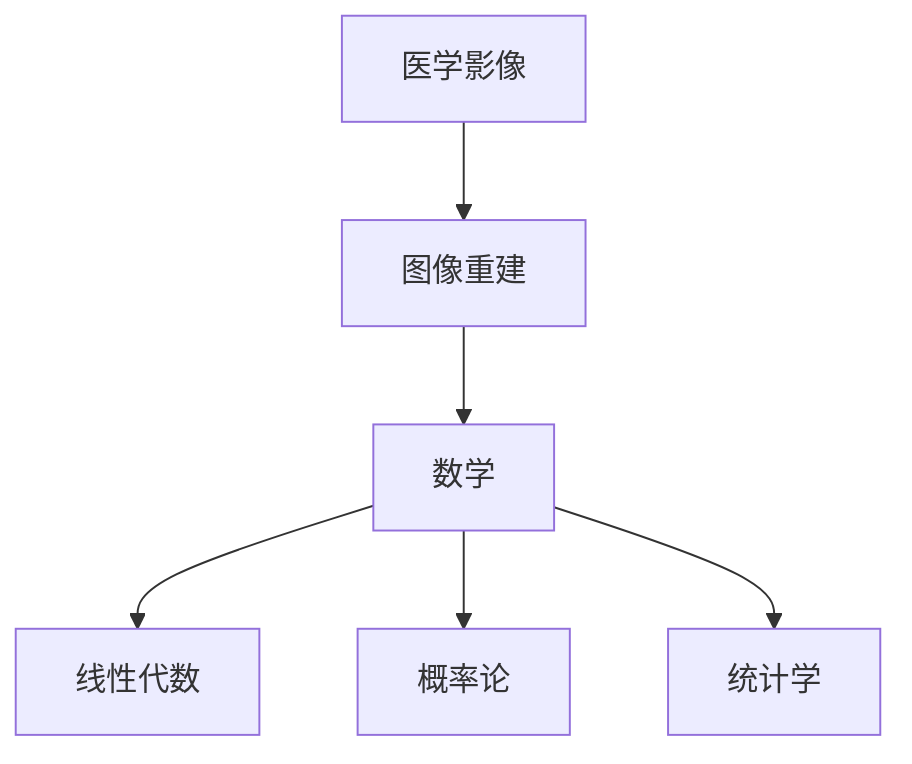

                 


### 写作步骤：

1. **文章标题和关键词**：
   - 标题：《数学与医学影像：图像重建的数学算法》
   - 关键词：数学、医学影像、图像重建、算法、数学模型

2. **文章摘要**：
   - 摘要：本文将深入探讨数学在医学影像图像重建中的应用，包括基础数学概念、常见算法原理及其在医学影像中的实际应用。文章将通过详细的数学模型解释和算法伪代码展示，帮助读者理解图像重建的复杂过程。

3. **引言**：
   - 背景介绍：介绍医学影像的重要性，以及图像重建在医学影像中的关键作用。
   - 核心概念与联系：用Mermaid流程图展示图像重建的基本流程和涉及的关键概念。

4. **数学基础**：
   - 基础数学概念：介绍用于图像重建的数学基础，如线性代数、概率论和统计学等。
   - 数学模型与公式：详细讲解图像重建中常用的数学模型和公式，例如傅里叶变换、逆问题理论和优化算法等。

5. **图像重建算法**：
   - 算法原理讲解：使用伪代码详细阐述图像重建算法的工作原理。
   - 常见算法：介绍并分析常见的图像重建算法，如傅里叶重建、迭代重建和基于深度学习的重建方法。

6. **医学影像应用**：
   - 实际案例：通过实际病例展示图像重建算法在医学影像诊断和治疗中的应用。
   - 代码实现与解读：提供具体的代码实现和解读，展示算法的实操性。

7. **项目实战**：
   - 开发环境搭建：介绍搭建图像重建项目所需的环境和工具。
   - 源代码实现：详细展示图像重建项目的源代码实现。
   - 应用解读与分析：对图像重建的应用进行深入分析，讨论其实际意义和潜在问题。

8. **小结**：
   - 最佳实践 tips：总结一些实践经验，帮助读者更好地应用图像重建算法。
   - 注意事项：提醒读者在实际应用中需要注意的问题。
   - 拓展阅读：推荐一些相关书籍和资源，供读者进一步学习。

### 最终文章格式：

```markdown
# 数学与医学影像：图像重建的数学算法

## 关键词
数学、医学影像、图像重建、算法、数学模型

## 摘要
本文将深入探讨数学在医学影像图像重建中的应用，包括基础数学概念、常见算法原理及其在医学影像中的实际应用。文章将通过详细的数学模型解释和算法伪代码展示，帮助读者理解图像重建的复杂过程。

## 引言
### 背景介绍
#### 核心概念与联系


## 数学基础
### 基础数学概念
#### 数学模型与公式
$$
\text{公式示例}
$$

### 图像重建算法
#### 算法原理讲解
```python
# 伪代码示例
```
#### 常见算法
##### 傅里叶重建
##### 迭代重建
##### 基于深度学习的重建方法

## 医学影像应用
### 实际案例
### 代码实现与解读

## 项目实战
### 开发环境搭建
### 源代码实现
### 应用解读与分析

## 小结
### 最佳实践 tips
### 注意事项
### 拓展阅读

## 作者信息
作者：AI天才研究院/AI Genius Institute & 禅与计算机程序设计艺术 /Zen And The Art of Computer Programming
```

这个步骤化的大纲应该能够帮助您撰写出一篇结构严谨、内容丰富的技术博客文章。接下来，您可以逐一填充每个章节的内容，确保文章的字数在要求的范围内。祝您写作顺利！

