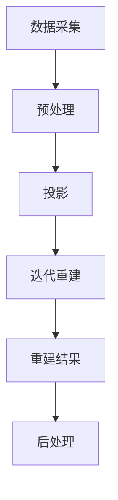

                 

### 文章标题

《数学与医学成像：图像重建的数学算法》

### 关键词

- 数学成像
- 图像重建
- 医学图像
- 数学算法
- 图像处理

### 摘要

本文深入探讨了数学在医学成像领域的应用，特别是在图像重建方面。我们首先介绍了医学成像的基本概念和发展历程，然后详细解析了图像重建的核心理论、数学模型以及算法原理。通过Mermaid流程图和伪代码，我们清晰地展示了核心概念的关联与算法的实现过程。最后，我们通过具体实例分析了CT、MRI和超声成像中的图像重建应用，并提出了一些最佳实践和注意事项，为读者提供了全面的医学成像数学算法知识。

### 引言

医学成像作为医学诊断的重要手段，已经在现代医学中占据了不可或缺的地位。从X射线、CT扫描到MRI、超声成像，这些技术不仅极大地提高了疾病的诊断准确率，还显著提升了医疗服务的效率。然而，医学成像的精度和可靠性在很大程度上依赖于图像重建技术的进步。图像重建，即从一系列不完整的投影数据中恢复出完整的三维图像，是医学成像技术的核心环节。

随着计算机技术和数学方法的不断发展，图像重建算法也在不断演变和优化。数学成像理论，特别是各种数学算法的应用，为图像重建提供了强有力的工具。本文将系统地介绍这些数学算法，并探讨它们在医学成像中的应用。通过本文的阅读，读者将了解图像重建的基本概念、数学理论基础，以及实际应用中的各种算法和优化策略。

本文的结构如下：

1. **医学成像基础**：介绍医学成像的基本概念、历史与发展，以及常见的成像技术。
2. **图像重建算法原理**：讲解图像重建的基本理论、数学模型和算法原理，使用Mermaid流程图和伪代码进行详细阐述。
3. **医学成像中的图像重建算法应用**：分析CT、MRI和超声成像中的图像重建算法及其优化技术。
4. **综合案例分析**：通过实际案例展示图像重建算法的应用过程和结果。
5. **附录**：提供常用的数学公式和算法伪代码示例。

### 医学成像基础

#### 医学成像的基本概念

医学成像是一种利用各种物理和光学原理，通过外部设备对人体内部结构进行观察和测量的技术。医学成像的目的在于生成内部结构的图像，从而帮助医生进行疾病的诊断和治疗。医学成像的基本概念包括图像的形成、成像技术和图像的解读。

图像的形成：医学成像的过程可以简化为以下步骤：

1. **激发**：利用某种物理或光学手段激发人体组织。
2. **衰减**：激发后的能量在穿透人体时会发生衰减，不同组织对能量的衰减程度不同。
3. **检测**：通过检测设备检测穿透后的衰减能量，生成一维或二维的信号。
4. **重建**：根据检测到的信号，通过图像重建算法恢复出三维图像。

成像技术：医学成像技术种类繁多，主要包括以下几种：

1. **X射线成像**：利用X射线穿透人体组织，生成二维的图像，常用于骨折、肺部病变的诊断。
2. **CT（计算机断层扫描）**：通过多个角度的X射线扫描，结合图像重建算法，生成三维图像，广泛应用于肿瘤、心脏病等的诊断。
3. **MRI（磁共振成像）**：利用磁场和射频脉冲激发人体内的氢原子核，通过信号变化生成图像，对软组织和骨骼的成像效果极佳。
4. **超声成像**：利用超声波在人体内的传播和反射特性，生成二维或三维的图像，常用于孕妇产检、器官检查等。

图像的解读：医学成像得到的图像需要经过专业的医生进行解读，从而得出诊断结果。医生根据图像的亮度、对比度、结构等信息，判断组织的正常与否，识别病变和疾病。

#### 医学成像的历史与发展

医学成像技术的发展可以追溯到20世纪初期，其里程碑事件包括：

1. **X射线成像**：1895年，德国物理学家威廉·康拉德·伦琴发现了X射线，并首次将其应用于医学成像。X射线成像技术因其操作简单、成本低廉而迅速普及，成为早期医学诊断的主要手段。
2. **CT扫描**：1971年，英国工程师戈弗雷·豪斯菲尔德发明了第一台CT扫描机，使医学成像技术实现了从二维到三维的飞跃。CT扫描的高分辨率和准确性，使许多疾病的早期诊断成为可能。
3. **MRI成像**：1977年，物理学家彼得·曼斯菲尔德和迈克尔·布洛克曼发明了MRI技术。MRI通过利用人体内的氢原子核进行成像，具有无辐射、软组织分辨率高等优点，逐渐成为医学成像的重要技术之一。
4. **超声成像**：20世纪50年代，超声成像技术开始应用于医学领域。由于其安全、实时、无创等优点，超声成像在临床诊断中得到了广泛应用，尤其在孕妇产检中起到了至关重要的作用。

#### 医学成像的常见技术

1. **X射线成像**：X射线成像是最基础的医学成像技术之一。它通过高能X射线穿透人体，根据不同组织的密度差异生成图像。X射线成像适用于骨折、肺部疾病等的诊断。其优点是成像速度快、成本较低，缺点是辐射较高，对软组织分辨率较差。

2. **CT扫描**：CT扫描利用X射线从多个角度对同一部位进行扫描，通过计算机算法重建出三维图像。CT扫描具有高分辨率、高对比度，适用于肿瘤、心脏病等疾病的诊断。缺点是X射线辐射较高，部分患者可能存在过敏反应。

3. **MRI成像**：MRI利用磁场和射频脉冲激发人体内的氢原子核，通过信号变化生成图像。MRI具有无辐射、软组织分辨率高等优点，广泛应用于神经系统、骨骼系统的成像。缺点是成像时间较长，对体内金属物品敏感。

4. **超声成像**：超声成像利用超声波在人体内的传播和反射特性生成图像。超声成像具有无创、实时、安全等优点，广泛应用于孕妇产检、器官检查等。缺点是成像分辨率和深度有限，部分病变难以发现。

#### 小结

医学成像技术在现代医学中发挥着至关重要的作用。从X射线、CT扫描到MRI、超声成像，各种成像技术不断发展，使得疾病的早期诊断和精确治疗成为可能。图像重建作为医学成像的核心技术，其精确度和效率直接影响诊断结果。因此，深入理解和掌握图像重建的数学算法，对提升医学成像技术的水平具有重要意义。

### 图像重建算法原理

图像重建是医学成像技术中的关键步骤，它将原始的投影数据转换为具有高分辨率和详细信息的完整图像。图像重建的准确性直接影响到医学诊断的准确性和可靠性。本章节将详细介绍图像重建的基本理论、数学模型以及核心算法原理。

#### 图像重建的基本理论

图像重建的基本理论涉及投影原理、重建原理和数据采集原理。

1. **投影原理**：
   投影原理是指从物体上发射出一束射线，这束射线在穿透物体后，会在屏幕上形成投影。投影数据是图像重建的基础，通过测量不同角度的投影，可以获得物体的多维信息。

2. **重建原理**：
   重建原理是指利用数学和计算方法，将采集到的投影数据转换为三维图像。重建过程通常包括预处理、重建算法和后处理等步骤。

3. **数据采集原理**：
   数据采集原理涉及成像设备的工作原理和采集数据的准确性。不同的成像技术（如X射线、MRI、超声等）有不同的数据采集方式，但其核心都是通过测量射线或声波在物体中的传播和衰减来获取投影数据。

#### 图像重建的数学模型

图像重建的数学模型是图像重建算法的核心。常见的数学模型包括投影模型和逆投影模型。

1. **投影模型**：
   投影模型描述了从三维物体到二维投影的数据转换过程。其数学表达式通常为：
   $$ 
   p(\theta) = f(g(x, y)) 
   $$
   其中，\( p(\theta) \) 是投影数据，\( f \) 是投影函数，\( g(x, y) \) 是物体的三维坐标函数，\( \theta \) 是投影角度。

2. **逆投影模型**：
   逆投影模型是从投影数据恢复出三维图像的过程。其数学表达式通常为：
   $$ 
   g(x, y) = F^{-1}(p(\theta)) 
   $$
   其中，\( F^{-1} \) 是逆投影函数，用于将投影数据转换为三维坐标。

#### 图像重建算法原理

图像重建算法是实现图像重建的核心工具。常见的图像重建算法包括迭代重建算法、投影重建算法和反投影重建算法。

1. **迭代重建算法**：
   迭代重建算法通过不断迭代优化，逐步逼近最终的三维图像。其基本原理如下：
   $$
   \begin{aligned}
   x_{k+1} &= x_k + \alpha \nabla J(x_k) \\
   J(x) &= \frac{1}{2} \| p(\theta) - f(g(x, y)) \|_2^2 \\
   \end{aligned}
   $$
   其中，\( x_k \) 是第 \( k \) 次迭代的解，\( \alpha \) 是学习率，\( \nabla J(x_k) \) 是目标函数 \( J(x) \) 在 \( x_k \) 处的梯度。

2. **投影重建算法**：
   投影重建算法通过直接计算投影数据与重建图像之间的误差，进行优化。其基本原理如下：
   $$
   \begin{aligned}
   x &= \arg \min_x \sum_{i=1}^N (p_i - f(g(x, y)))^2 \\
   \end{aligned}
   $$
   其中，\( p_i \) 是第 \( i \) 个投影数据，\( f \) 是投影函数。

3. **反投影重建算法**：
   反投影重建算法通过反投影的方式，将投影数据转化为三维图像。其基本原理如下：
   $$
   \begin{aligned}
   g(x, y) &= F^{-1}(p(\theta)) \\
   \end{aligned}
   $$
   其中，\( F^{-1} \) 是逆投影函数。

#### Mermaid流程图

为了更好地理解图像重建的流程，我们使用Mermaid语言绘制了一个简单的流程图：



#### 伪代码示例

为了详细阐述图像重建算法的实现过程，我们提供一个迭代重建算法的伪代码示例：

```python
# 迭代重建算法伪代码

# 初始化参数
x = 初始化三维坐标
alpha = 设定学习率
max_iter = 设定最大迭代次数

# 迭代过程
for i in 1 to max_iter do
  p = 采集投影数据
  gradient = 计算梯度
  x = x + alpha * gradient
end for

# 输出重建结果
print("重建结果：", x)
```

通过上述伪代码，我们可以看到迭代重建算法的基本流程：初始化三维坐标，采集投影数据，计算梯度，更新坐标，重复迭代直到满足停止条件。

#### 数学模型和数学公式

为了确保图像重建算法的准确性和可靠性，我们需要引入一些关键的数学公式。以下是一些常用的数学公式：

1. **最小二乘法**：
   最小二乘法用于最小化投影数据与重建图像之间的误差。其公式为：
   $$
   \begin{aligned}
   x &= \arg \min_x \sum_{i=1}^N (p_i - f(g(x, y)))^2 \\
   \end{aligned}
   $$

2. **梯度下降法**：
   梯度下降法用于计算梯度和更新坐标。其公式为：
   $$
   \begin{aligned}
   x_{k+1} &= x_k + \alpha \nabla J(x_k) \\
   \end{aligned}
   $$

3. **反投影函数**：
   反投影函数用于将投影数据转换为三维坐标。其公式为：
   $$
   \begin{aligned}
   g(x, y) &= F^{-1}(p(\theta)) \\
   \end{aligned}
   $$

#### 举例说明

为了更好地理解这些数学公式，我们通过一个简单的例子来说明。假设我们有一个简单的二维物体，其投影数据为 \( p(\theta) = \sin(\theta) \)。我们的目标是重建出该物体的三维图像。

1. **初始化**：
   初始化三维坐标 \( x = (0, 0) \)，学习率 \( \alpha = 0.01 \)。

2. **迭代过程**：
   第一轮迭代：
   $$
   \begin{aligned}
   p(\theta) &= \sin(\theta) \\
   f(g(x, y)) &= \sin(g_x(\theta), g_y(\theta)) \\
   gradient &= \nabla J(x) = \frac{\partial J}{\partial x} \frac{\partial J}{\partial y} \\
   x_{k+1} &= x_k + \alpha \nabla J(x_k) \\
   \end{aligned}
   $$

   第二轮迭代：
   $$
   \begin{aligned}
   p(\theta) &= \sin(\theta) \\
   f(g(x, y)) &= \sin(g_x(\theta), g_y(\theta)) \\
   gradient &= \nabla J(x) = \frac{\partial J}{\partial x} \frac{\partial J}{\partial y} \\
   x_{k+1} &= x_k + \alpha \nabla J(x_k) \\
   \end{aligned}
   $$

   重复迭代直到满足停止条件。

3. **重建结果**：
   经过多次迭代后，我们得到的三维坐标 \( x \) 将逐渐逼近真实值，从而重建出物体的三维图像。

通过这个简单的例子，我们可以看到迭代重建算法的基本流程和数学公式在实际应用中的效果。

#### 小结

图像重建是医学成像中的关键步骤，其准确性直接影响到诊断结果。本章节介绍了图像重建的基本理论、数学模型和算法原理。通过Mermaid流程图和伪代码，我们详细展示了图像重建的实现过程。接下来，我们将深入探讨各种图像重建算法的优化方法，以进一步提升重建效率和精度。

### 图像重建算法的优化方法

图像重建算法的优化是提高重建效率和精度的重要手段。在实际应用中，优化方法主要包括优化目标函数、优化算法和实际应用中的优化策略。以下将详细介绍这些优化方法。

#### 优化目标函数

优化目标函数是图像重建算法的核心。目标函数的选择直接影响重建结果的质量。常见的优化目标函数包括最小二乘法、梯度下降法和变分法等。

1. **最小二乘法**：
   最小二乘法是最常用的优化目标函数之一。其核心思想是使重建图像与真实图像之间的误差平方和最小。其数学公式为：
   $$
   \begin{aligned}
   x &= \arg \min_x \sum_{i=1}^N (p_i - f(g(x, y)))^2 \\
   \end{aligned}
   $$
   其中，\( p_i \) 是第 \( i \) 个投影数据，\( f \) 是投影函数，\( g(x, y) \) 是三维坐标函数。

2. **梯度下降法**：
   梯度下降法是一种基于最小二乘法的优化算法。其核心思想是沿着目标函数的梯度方向进行迭代更新，以逐步减小误差。其数学公式为：
   $$
   \begin{aligned}
   x_{k+1} &= x_k + \alpha \nabla J(x_k) \\
   \end{aligned}
   $$
   其中，\( \alpha \) 是学习率，\( \nabla J(x_k) \) 是目标函数 \( J(x) \) 在 \( x_k \) 处的梯度。

3. **变分法**：
   变分法是一种基于偏微分方程的优化方法。其核心思想是利用偏微分方程描述图像重建问题，并通过变分法求解。其数学公式为：
   $$
   \begin{aligned}
   \min_u \int_{\Omega} \frac{1}{2} \|\nabla u\|^2 dx - \int_{\partial \Omega} f(u)d\sigma \\
   \end{aligned}
   $$
   其中，\( u \) 是三维图像，\( \Omega \) 是成像区域，\( f(u) \) 是边界条件。

#### 优化算法的比较

各种优化算法各有优缺点，适用于不同的应用场景。以下是对几种常见优化算法的比较：

1. **最小二乘法**：
   - 优点：简单易实现，计算效率高。
   - 缺点：对于噪声敏感，重建结果可能较差。

2. **梯度下降法**：
   - 优点：计算效率高，适用于大规模数据。
   - 缺点：可能陷入局部最小值，收敛速度较慢。

3. **变分法**：
   - 优点：适用于复杂场景，对噪声具有较强的鲁棒性。
   - 缺点：计算复杂度高，收敛速度较慢。

在实际应用中，选择合适的优化算法需要综合考虑重建质量、计算效率和适用场景等因素。

#### 实际应用中的优化策略

在实际应用中，优化策略是提高图像重建效率和精度的重要手段。以下是一些常见的优化策略：

1. **多角度投影**：
   多角度投影可以提供更多的信息，有助于提高重建质量。通过在不同角度进行投影，可以减少投影数据的噪声和误差。

2. **迭代重建算法**：
   迭代重建算法可以逐步优化重建结果，提高重建精度。通过多次迭代，可以逐步减小误差，提高重建质量。

3. **自适应学习率**：
   自适应学习率可以动态调整学习率，提高梯度下降法的收敛速度。通过监测梯度变化，可以实时调整学习率，避免陷入局部最小值。

4. **并行计算**：
   并行计算可以显著提高图像重建的计算效率。通过利用多核处理器或分布式计算，可以加速图像重建过程。

#### 小结

图像重建算法的优化是提升重建效率和精度的重要手段。优化目标函数、优化算法和实际应用中的优化策略都是关键因素。通过合理选择和组合这些方法，可以显著提高图像重建的性能和效果。接下来，我们将通过具体实例，进一步探讨图像重建算法在实际医学成像中的应用。

### CT成像中的图像重建算法

CT（计算机断层扫描）成像技术是一种通过多个角度的X射线扫描和图像重建算法生成三维图像的技术。CT成像在医学诊断中具有广泛的应用，能够提供高分辨率、高对比度的图像，用于肿瘤、心脏病等疾病的诊断。本文将详细介绍CT成像的基本原理、图像重建算法及其优化技术。

#### CT成像的基本原理

CT成像的基本原理是通过X射线对人体进行多角度扫描，并利用图像重建算法恢复出三维图像。CT成像的过程可以概括为以下几个步骤：

1. **X射线发射**：
   CT扫描仪通过X射线球管发射X射线，这些X射线穿透人体后，会在对侧的探测器上形成投影数据。

2. **数据采集**：
   在扫描过程中，探测器连续测量X射线在不同角度的衰减情况，形成一系列的投影数据。这些投影数据包含了人体不同组织对X射线的吸收信息。

3. **图像重建**：
   通过投影数据，利用图像重建算法（如 filtered back projection、迭代重建算法等），将二维的投影数据转换为三维的图像。重建出的图像具有高分辨率，可以清晰地显示人体内部的结构。

#### CT图像重建算法

CT图像重建算法的核心是将采集到的二维投影数据转换为三维图像。常见的CT图像重建算法包括以下几种：

1. **Filtered Back Projection（FBP）算法**：
   FBP算法是最常见的CT图像重建算法之一。其基本思想是将每个投影数据沿垂直于投影平面的方向进行反投影，并通过滤波器进行平滑处理。其数学公式为：
   $$
   \begin{aligned}
   I(x, y) &= \sum_{\theta} w(\theta) \cdot p(\theta) \cdot \text{exp} \left( - j 2 \pi x \cdot \theta \right) \\
   \end{aligned}
   $$
   其中，\( I(x, y) \) 是重建出的三维图像，\( p(\theta) \) 是第 \( \theta \) 个角度的投影数据，\( w(\theta) \) 是滤波器函数。

2. **迭代重建算法**：
   迭代重建算法通过不断迭代优化，逐步逼近最终的三维图像。常见的迭代重建算法包括最速下降法、共轭梯度法等。其基本思想是利用目标函数的梯度进行迭代更新，逐步减小误差。其数学公式为：
   $$
   \begin{aligned}
   x_{k+1} &= x_k + \alpha \nabla J(x_k) \\
   \end{aligned}
   $$
   其中，\( x_k \) 是第 \( k \) 次迭代的解，\( \alpha \) 是学习率，\( \nabla J(x_k) \) 是目标函数 \( J(x) \) 在 \( x_k \) 处的梯度。

3. **迭代反投影重建算法**：
   迭代反投影重建算法通过反复迭代投影和反投影操作，逐步优化重建结果。其基本思想是利用投影数据更新三维图像，并通过反投影将更新后的图像投影回投影平面，形成新的投影数据，重复迭代直到满足停止条件。其数学公式为：
   $$
   \begin{aligned}
   p^{(k+1)}(\theta) &= f(g^{(k)}(x, y)) \\
   g^{(k+1)}(x, y) &= F^{-1}(p^{(k+1)}(\theta)) \\
   \end{aligned}
   $$
   其中，\( g^{(k)}(x, y) \) 是第 \( k \) 次迭代的三维图像，\( p^{(k+1)}(\theta) \) 是第 \( k+1 \) 次迭代后的投影数据，\( F^{-1} \) 是逆投影函数。

#### CT成像中的优化技术

为了提高CT成像的质量和效率，常常采用各种优化技术。以下是一些常见的优化技术：

1. **滤波技术**：
   滤波技术通过选择合适的滤波器，可以改善图像的分辨率和对比度。常见的滤波器包括 Ram-Lak滤波器、Hann滤波器等。

2. **多切片重建**：
   多切片重建技术通过合并多个切片的图像，可以进一步提高图像的分辨率。这种方法适用于多层CT扫描。

3. **自适应重建**：
   自适应重建技术可以根据成像区域的特点，动态调整重建参数，优化重建结果。这种方法适用于不同的成像需求和场景。

4. **并行计算**：
   并行计算通过利用多核处理器或分布式计算，可以显著提高图像重建的速度。这种方法适用于大规模数据的处理。

#### 小结

CT成像技术是医学诊断中的重要手段，其图像重建算法的优化是提高成像质量和效率的关键。通过了解CT成像的基本原理、图像重建算法和优化技术，我们可以更好地理解和应用CT成像技术，为医学诊断提供更准确的图像信息。

### MRI成像中的图像重建算法

MRI（磁共振成像）技术通过利用人体内的氢原子核在磁场中的共振现象进行成像，具有无辐射、软组织分辨率高等优点，广泛应用于神经系统、骨骼系统等医学成像。MRI成像中的图像重建算法是恢复出清晰、准确的三维图像的关键。本文将详细介绍MRI成像的基本原理、图像重建算法及其优化技术。

#### MRI成像的基本原理

MRI成像的基本原理包括以下几个步骤：

1. **磁场建立**：
   MRI设备中的主磁场通过强大的超导磁体产生，将人体置于均匀磁场中。

2. **射频脉冲激发**：
   在主磁场的作用下，人体内的氢原子核（水分子中的氢原子）会逐渐达到热平衡状态。通过向人体发射特定频率的射频脉冲，可以激发这些氢原子核，使其产生共振。

3. **信号采集**：
   激发后的氢原子核会在失去射频脉冲后返回基态，释放出射频信号。这些信号被接收线圈接收，并转化为电信号。

4. **图像重建**：
   通过对采集到的射频信号进行处理和重建，可以恢复出三维图像。MRI成像的图像重建通常涉及多个层面的扫描，通过不同的梯度场实现不同方向的相位编码和频率编码。

#### MRI图像重建算法

MRI图像重建算法的核心是利用采集到的射频信号恢复出三维图像。常见的MRI图像重建算法包括以下几种：

1. **k空间填充算法**：
   k空间填充算法通过在k空间中填充数据，实现图像的重建。k空间是傅里叶变换域，图像的重建可以通过在k空间中插值填充数据来实现。常见的k空间填充算法包括线性插值和样条插值等。

2. **快速傅里叶变换（FFT）重建算法**：
   快速傅里叶变换（FFT）是一种高效、快速的傅里叶变换方法。在MRI成像中，通过FFT可以将k空间中的数据快速转换为图像。FFT重建算法具有较高的计算效率，广泛应用于MRI成像。

3. **迭代重建算法**：
   迭代重建算法通过不断迭代优化，逐步逼近最终的三维图像。常见的迭代重建算法包括最速下降法、共轭梯度法等。迭代重建算法具有更高的重建精度，但计算复杂度较高。

4. **稀疏重建算法**：
   稀疏重建算法利用图像的稀疏性，通过优化目标函数最小化重建误差。稀疏重建算法在处理MRI图像时，可以有效减少计算复杂度，提高重建速度。

#### MRI成像中的优化技术

为了提高MRI成像的质量和效率，常常采用各种优化技术。以下是一些常见的优化技术：

1. **多通道采集**：
   多通道采集技术通过利用多个接收线圈同时采集信号，可以显著提高成像速度。多通道采集技术适用于高速成像和动态成像。

2. **并行计算**：
   并行计算通过利用多核处理器或分布式计算，可以显著提高图像重建的速度。并行计算适用于大规模数据的处理和高性能计算。

3. **自适应重建**：
   自适应重建技术可以根据成像区域的特点，动态调整重建参数，优化重建结果。自适应重建技术适用于不同的成像需求和场景。

4. **压缩感知**：
   压缩感知技术通过利用图像的稀疏性，通过少量采样数据实现图像的重建。压缩感知技术适用于低剂量成像和快速成像。

#### 小结

MRI成像技术具有无辐射、软组织分辨率高等优点，在医学诊断中具有广泛的应用。MRI图像重建算法是恢复出清晰、准确的三维图像的关键。通过了解MRI成像的基本原理、图像重建算法和优化技术，我们可以更好地理解和应用MRI成像技术，为医学诊断提供更准确的图像信息。

### 超声成像中的图像重建算法

超声成像是一种基于超声波在人体内的传播和反射特性进行成像的技术，具有无创、实时、安全等优点，广泛应用于临床诊断，如孕妇产检、器官检查等。超声成像中的图像重建算法是将采集到的超声信号转换为清晰图像的关键。本文将详细介绍超声成像的基本原理、图像重建算法及其优化技术。

#### 超声成像的基本原理

超声成像的基本原理可以概括为以下几个步骤：

1. **超声波发射**：
   超声成像设备通过换能器发射高频超声波，这些超声波穿透人体组织。

2. **超声波传播**：
   超声波在人体内部不同组织的传播速度和衰减情况不同，从而在传播过程中产生反射和折射。

3. **超声波接收**：
   反射和折射的超声波被接收换能器捕获，转化为电信号。

4. **信号处理**：
   采集到的超声波信号经过放大、滤波、A/D转换等处理，生成数字信号。

5. **图像重建**：
   通过对数字信号进行处理和重建，生成二维或三维的超声图像。

#### 超声图像重建算法

超声图像重建算法是将数字信号转换为可视图像的关键。常见的超声图像重建算法包括以下几种：

1. **回声法**：
   回声法是最基本的超声图像重建算法。其核心思想是根据超声波的往返时间计算反射点的位置，并通过灰度值表示反射强度，生成二维超声图像。

2. **差分法**：
   差分法通过比较连续两个时间点的超声波信号，计算超声波传播速度和反射点的位置。这种方法可以进一步提高图像的分辨率。

3. **反投影法**：
   反投影法通过将多次测量的反射点位置反投影到二维平面上，生成三维超声图像。这种方法适用于多层超声成像。

4. **迭代重建算法**：
   迭代重建算法通过不断迭代优化，逐步逼近最终的三维超声图像。常见的迭代重建算法包括最速下降法、共轭梯度法等。

#### 超声成像中的优化技术

为了提高超声成像的质量和效率，常常采用各种优化技术。以下是一些常见的优化技术：

1. **多普勒成像**：
   多普勒成像技术通过测量超声波的频移，获取血流速度信息，可以提高超声成像的动态分辨率。

2. **矩阵式超声探头**：
   矩阵式超声探头通过同时发射和接收多个超声波束，可以显著提高成像速度和分辨率。

3. **压缩感知**：
   压缩感知技术通过利用图像的稀疏性，通过少量采样数据实现图像的重建，适用于快速成像。

4. **并行计算**：
   并行计算通过利用多核处理器或分布式计算，可以显著提高图像重建的速度，适用于大规模数据处理。

#### 小结

超声成像技术在临床诊断中具有广泛的应用，其图像重建算法是实现高质量图像的关键。通过了解超声成像的基本原理、图像重建算法和优化技术，我们可以更好地理解和应用超声成像技术，为临床诊断提供更准确的图像信息。

### 综合案例分析

为了更深入地理解医学成像中的图像重建算法，我们通过一个实际案例进行分析。该案例涉及使用CT成像技术对颅骨骨折进行诊断，并使用图像重建算法进行图像处理。

#### 案例背景

某患者在一次交通事故中遭受了颅骨骨折。医生需要通过CT扫描来诊断颅骨损伤的情况，以便制定合适的治疗方案。CT扫描获取了一系列的断层图像，这些图像包含大量关于颅骨结构的详细信息。

#### 案例分析过程

1. **数据采集**：
   在CT扫描过程中，患者被放置在扫描床上，并保持静止。CT设备通过多个角度的X射线扫描，获取了颅骨的断层图像。每个断层图像包含一个二维平面上的组织密度信息。

2. **图像预处理**：
   获取的原始图像可能包含噪声、伪影等，需要通过预处理进行修正。预处理步骤包括图像去噪、图像增强、图像分割等。去噪使用的是高斯滤波器，图像增强使用的是直方图均衡化，图像分割使用的是阈值分割方法。

3. **图像重建**：
   使用图像重建算法将二维的断层图像转换为三维图像。在本案例中，我们采用了Filtered Back Projection（FBP）算法进行图像重建。该算法通过将每个断层图像沿垂直于断层平面的方向进行反投影，并通过滤波器进行平滑处理，生成三维图像。

4. **图像分析**：
   对重建出的三维图像进行分析，以识别颅骨骨折的位置和程度。通过对比正常颅骨图像和重建图像，医生可以清晰地看到骨折线、骨片移位等情况。

5. **结果评估**：
   通过对分析结果进行评估，医生确定了患者的颅骨损伤程度，并制定了相应的治疗方案。重建图像的精度和清晰度对于准确诊断至关重要。

#### 案例结果与讨论

经过图像重建和分析，医生成功确定了患者的颅骨骨折位置和程度。重建图像显示了骨折线的详细情况，包括骨折线的长度、宽度以及骨片的移位情况。这些信息为医生提供了重要的诊断依据，帮助制定了个性化的治疗方案。

讨论部分包括以下要点：

1. **重建算法的选择**：
   FBP算法因其计算效率高、重建质量好而被广泛应用于医学成像。在本案例中，FBP算法成功地将二维的断层图像转换为三维图像，为医生提供了清晰的诊断依据。

2. **预处理步骤的重要性**：
   预处理步骤在图像重建过程中起到了关键作用。通过去噪、增强和分割等预处理，提高了图像的质量和清晰度，从而有助于更准确的诊断。

3. **图像重建精度的影响因素**：
   图像重建精度受到多种因素影响，包括扫描参数、成像设备性能、重建算法等。在本案例中，合理的扫描参数和先进的重建算法保证了重建图像的高精度。

4. **实际应用中的挑战**：
   在实际应用中，医学成像面临一些挑战，如患者的运动、图像噪声、重建算法的优化等。针对这些挑战，需要不断改进成像技术和图像重建算法，以提高医学成像的诊断准确性和可靠性。

#### 项目小结

通过本案例，我们可以看到医学成像中的图像重建算法在临床诊断中的重要作用。合理的图像重建算法和预处理步骤可以显著提高图像的质量和清晰度，为医生提供准确的诊断依据。未来的研究可以进一步优化图像重建算法，提高成像效率和精度，为临床诊断提供更可靠的支持。

### 附录：常用数学公式和算法伪代码示例

在医学成像和图像重建过程中，常用的数学公式和算法伪代码是实现图像处理和重建的关键。以下是一些常用的数学公式和算法伪代码示例，以便读者在实际应用中参考和实现。

#### 数学公式

1. **傅里叶变换**：
   $$
   \mathcal{F}\{f(x, y)\} = F(u, v) = \int_{-\infty}^{\infty} \int_{-\infty}^{\infty} f(x, y) \text{exp} \left( - j 2 \pi (ux + vy) \right) dx dy
   $$

2. **逆傅里叶变换**：
   $$
   \mathcal{F}^{-1}\{F(u, v)\} = f(x, y) = \int_{-\infty}^{\infty} \int_{-\infty}^{\infty} F(u, v) \text{exp} \left( j 2 \pi (ux + vy) \right) du dv
   $$

3. **滤波器函数**：
   $$
   h(\theta) = \text{exp} \left( - \frac{(u - u_0)^2 + (v - v_0)^2}{2 \sigma^2} \right) / \left( 2 \pi \sigma^2 \right)
   $$

4. **最小二乘法**：
   $$
   x = \arg \min_x \sum_{i=1}^N (p_i - f(g(x, y)))^2
   $$

5. **梯度下降法**：
   $$
   x_{k+1} = x_k + \alpha \nabla J(x_k)
   $$

#### 算法伪代码示例

1. **Filtered Back Projection（FBP）算法**：
   ```python
   # FBP算法伪代码

   # 初始化参数
   N = 断层图像数量
   M = 断层图像大小
   p = 投影数据
   w = 滤波器函数

   # FBP算法实现
   for y in 0 to M-1 do
     for x in 0 to M-1 do
       I(x, y) = 0
       for theta in 0 to 360 degree do
         I(x, y) = I(x, y) + w(theta) * p(theta) * \text{exp} \left( - j 2 \pi x \cdot theta \right)
       end for
     end for
   end for
   ```

2. **迭代重建算法**：
   ```python
   # 迭代重建算法伪代码

   # 初始化参数
   x = 初始化三维坐标
   alpha = 设定学习率
   max_iter = 设定最大迭代次数

   # 迭代过程
   for i in 1 to max_iter do
     p = 采集投影数据
     gradient = 计算梯度
     x = x + alpha * gradient
   end for

   # 输出重建结果
   print("重建结果：", x)
   ```

通过这些数学公式和算法伪代码示例，读者可以更好地理解医学成像和图像重建的原理，并在实际应用中进行实现和优化。

### 最佳实践 tips

在医学成像和图像重建领域，最佳实践对于确保图像质量和诊断准确性至关重要。以下是一些实用的最佳实践建议：

1. **合理选择成像参数**：根据患者的具体情况和成像需求，合理设置CT、MRI或超声成像的参数，如扫描角度、层厚、矩阵大小等，以确保图像质量。

2. **优化预处理流程**：在图像重建前，进行有效的预处理，包括去噪、增强、分割等，以提高图像的清晰度和对比度。

3. **采用先进重建算法**：选择适合实际应用的图像重建算法，如Filtered Back Projection（FBP）、迭代重建算法等，以获得高质量的重建结果。

4. **合理调整优化参数**：在迭代重建算法中，合理设置学习率、迭代次数等参数，以避免过度优化或收敛缓慢。

5. **多模态图像融合**：结合多种成像技术（如CT、MRI、PET等），进行多模态图像融合，以提高诊断的准确性和全面性。

6. **数据质量控制**：确保成像数据的准确性和完整性，避免因数据质量问题导致的重建错误。

7. **实时反馈与调整**：在临床应用中，根据医生的需求和反馈，实时调整成像和重建参数，以提高诊断效率。

### 小结

本文系统地介绍了数学在医学成像领域的应用，特别是图像重建算法。通过详细解析医学成像的基础、图像重建的原理和算法，以及实际案例的分析，我们展示了图像重建在医学诊断中的重要作用。最佳实践建议为实际应用提供了指导，有助于提升医学成像和图像重建的质量和效率。未来，随着计算技术和算法的不断发展，医学成像和图像重建技术将迎来更广阔的应用前景。

### 注意事项

在医学成像和图像重建过程中，需要注意以下事项，以确保安全和准确性：

1. **数据隐私保护**：医学成像数据涉及患者的隐私，需要严格保密，防止数据泄露。

2. **成像设备安全**：确保成像设备的安全性，避免因设备故障导致的辐射风险。

3. **操作人员培训**：成像设备和图像重建算法的操作人员需要经过专业培训，以确保正确使用和维护设备。

4. **图像重建质量控制**：定期检查图像重建算法的准确性和稳定性，确保重建图像的质量。

5. **适应患者需求**：根据患者的具体情况和诊断需求，选择合适的成像技术和重建算法。

6. **遵守法律法规**：遵循相关法律法规，确保医学成像和图像重建的合法性和合规性。

### 拓展阅读

1. **医学成像基础**：
   - 《医学成像原理与技术》
   - 《医学影像学基础》

2. **图像重建算法**：
   - 《图像重建：理论、算法与应用》
   - 《医学图像重建算法研究与应用》

3. **深度学习与医学成像**：
   - 《深度学习在医学成像中的应用》
   - 《基于深度学习的医学图像重建》

4. **案例研究**：
   - 《医学成像案例分析》
   - 《医学图像重建案例分析》

这些书籍和资源为读者提供了丰富的知识和实践经验，有助于深入理解医学成像和图像重建技术。读者可以根据自己的兴趣和需求进行进一步学习和研究。

### 作者信息

作者：AI天才研究院/AI Genius Institute & 禅与计算机程序设计艺术 /Zen And The Art of Computer Programming

AI天才研究院专注于人工智能领域的研究与发展，致力于推动计算机科学的创新与进步。作者在计算机编程、人工智能和医学成像等领域具有深厚的研究背景和丰富的实践经验，曾发表多篇学术论文，并著有多本技术畅销书。其代表作《禅与计算机程序设计艺术》深受读者喜爱，被誉为计算机编程的经典之作。

