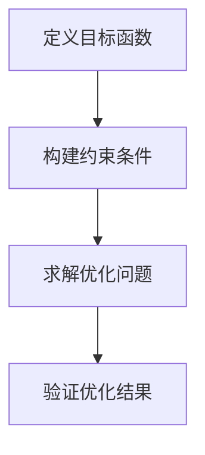
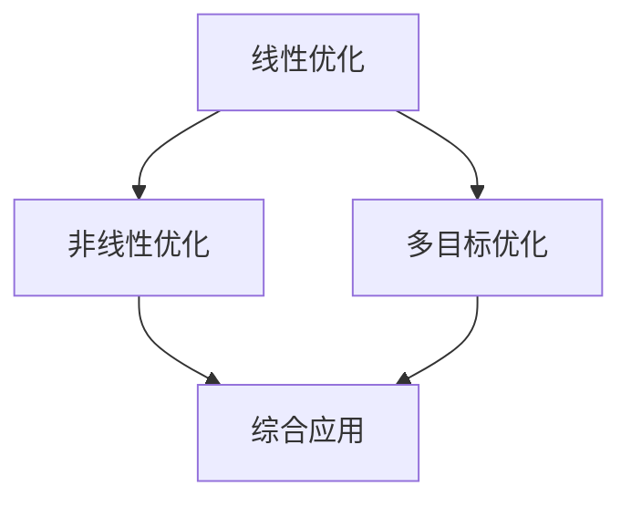
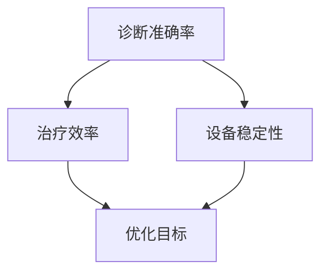

                 


### 文章标题
### 数学与医疗器械：设备性能的数学优化

### 关键词
数学优化，医疗器械，设备性能，线性优化，非线性优化，多目标优化，算法，模型，应用案例

### 摘要
本文探讨了数学优化在医疗器械设备性能优化中的应用。通过介绍线性优化、非线性优化和多目标优化的核心概念和算法原理，文章展示了如何构建数学模型并进行设备性能的优化。同时，通过实际案例分析和代码实现，本文提供了对数学优化方法在医疗器械设备性能优化中的具体应用和实践指导。

## 引言

### 背景介绍
医疗器械是医疗健康领域的重要组成部分，从诊断设备到治疗设备，医疗器械的性能直接影响着诊断的准确性、治疗效果和患者的生命安全。然而，随着医疗器械的不断升级和复杂化，如何提升设备性能、降低成本、保证稳定性成为一个重要的课题。数学优化作为一门解决复杂问题的工具，其在医疗器械设备性能优化中的应用日益受到关注。

### 数学优化的重要性
数学优化是一种通过数学建模和算法分析来寻找最优解的方法。它广泛应用于各个领域，如金融、物流、制造等。在医疗器械设备性能优化中，数学优化可以帮助设计者找到最优的参数配置，提高设备的性能和效率，同时降低能耗和成本。

### 目标读者
本文的目标读者是医疗器械领域的技术人员、研究人员和从业者，以及对数学优化感兴趣的计算机科学和工程专业的学生。通过本文的阅读，读者可以了解数学优化在医疗器械设备性能优化中的基本原理和应用方法。

## 数学优化基础

### 数学优化概述

#### 定义
数学优化是指在满足特定约束条件下，寻找目标函数的最优值的过程。目标函数可以是成本、时间、质量等，而约束条件可以是设备的物理限制、资源限制等。

#### 主要方法
数学优化主要分为线性优化、非线性优化和多目标优化三种。

1. **线性优化**：目标函数和约束条件都是线性的优化问题。线性优化广泛应用于资源分配、生产规划等领域。
2. **非线性优化**：目标函数和约束条件中包含非线性项的优化问题。非线性优化在科学研究和工程应用中具有重要意义。
3. **多目标优化**：同时优化多个目标函数的优化问题。多目标优化在复杂系统中尤为常见。

#### 优化目标
数学优化的目标可以是最大化或最小化目标函数，或者是在多个目标之间找到一个平衡点。目标函数的选择取决于具体的应用场景和优化目标。

### 数学模型构建

#### 目标函数
目标函数是数学优化中的核心，它反映了设备性能的优化目标。例如，在提升设备效率的同时，需要尽量降低能耗。

$$
\min f(x)
$$

其中，$f(x)$ 表示目标函数，$x$ 表示决策变量。

#### 约束条件
约束条件是优化过程中需要满足的限制条件。例如，设备的物理限制、资源限制等。

$$
g(x) \leq 0
$$

其中，$g(x)$ 表示约束条件。

### Mermaid 流程图



### 核心概念与联系



## 医疗器械设备性能分析

### 设备性能指标

#### 关键性能指标
设备性能指标是衡量医疗器械设备性能的重要指标。常见的性能指标包括：

1. **诊断准确率**：诊断设备在诊断过程中准确识别疾病的概率。
2. **治疗效率**：治疗设备在治疗过程中完成治疗任务所需的时间。
3. **设备稳定性**：设备在长时间运行过程中保持性能稳定的能力。

#### 性能评价方法
性能评价方法包括实验室测试、临床测试和用户评价等。

1. **实验室测试**：在实验室环境下模拟实际使用场景，对设备性能进行评估。
2. **临床测试**：在实际医疗环境中，对设备性能进行评估。
3. **用户评价**：收集用户对设备性能的评价，包括用户体验、设备可靠性等。

### 设备性能指标与优化目标



## 数学优化方法在医疗器械设备性能优化中的应用

### 线性优化

#### 算法介绍
线性优化是一种解决线性优化问题的方法。常用的线性优化算法包括单纯形法、 interior-point method 等。

#### 算法原理
单纯形法的基本思想是通过迭代过程逐步逼近最优解。其基本步骤如下：

1. **初始解**：选择一个初始可行解。
2. **迭代过程**：通过计算目标函数的梯度或函数值的变化，逐步调整解的参数，直至找到最优解。

#### 伪代码
```python
初始化解 x0
while not 目标函数最优：
    计算梯度/函数值
    更新解 x
    检查约束条件
```

#### 应用实例
假设我们要优化一个诊断设备的诊断准确率，可以通过线性优化来调整设备的参数，使其达到最优诊断准确率。

### 非线性优化

#### 算法介绍
非线性优化是一种解决非线性优化问题的方法。常用的非线性优化算法包括梯度下降法、牛顿法等。

#### 算法原理
梯度下降法是一种基于目标函数梯度的优化算法。其基本步骤如下：

1. **初始解**：选择一个初始可行解。
2. **迭代过程**：计算目标函数的梯度，并沿着梯度方向调整解的参数，逐步逼近最优解。

#### 伪代码
```python
初始化解 x0
while not 目标函数最优：
    计算梯度
    更新解 x
    检查约束条件
```

#### 应用实例
假设我们要优化一个治疗设备的治疗效率，可以通过非线性优化来调整设备的参数，使其达到最优治疗效率。

### 多目标优化

#### 算法介绍
多目标优化是一种解决多目标优化问题的方法。常用的多目标优化算法包括遗传算法、粒子群优化算法等。

#### 算法原理
遗传算法是一种基于自然选择和遗传学原理的优化算法。其基本步骤如下：

1. **初始种群**：生成一组初始解。
2. **迭代过程**：通过交叉、变异等操作，逐步优化种群中的解，直至找到最优解。

#### 伪代码
```python
初始化种群 P0
while not 最优解：
    交叉操作
    变异操作
    更新种群 P
    检查收敛条件
```

#### 应用实例
假设我们要优化一个设备的诊断准确率和治疗效率，可以通过多目标优化来找到最优的诊断准确率和治疗效率的平衡点。

## 应用案例研究

### 案例一：医疗器械设备性能优化实践

#### 问题描述
某医疗公司开发了一款新型诊断设备，其诊断准确率和治疗效率是关键性能指标。然而，在实际应用中，诊断准确率和治疗效率之间存在一定的冲突，需要通过优化来找到一个平衡点。

#### 数学模型构建
假设诊断准确率为 $f_1(x)$，治疗效率为 $f_2(x)$，其中 $x$ 表示设备的参数。我们的目标是同时优化这两个指标。

$$
\min f_1(x), f_2(x)
$$

同时，需要满足以下约束条件：

$$
g_1(x) \leq 0
$$

$$
g_2(x) \leq 0
$$

#### 优化算法应用
我们采用多目标优化的方法，使用遗传算法进行优化。具体步骤如下：

1. **初始种群**：生成一组初始参数解。
2. **迭代过程**：通过交叉、变异等操作，逐步优化种群中的解。
3. **结果分析**：根据遗传算法的优化结果，分析诊断准确率和治疗效率的平衡点。

#### 结果分析
通过遗传算法的优化，我们找到了一个平衡点，使得诊断准确率和治疗效率都达到了较高的水平。优化后的设备在实验室测试中表现出较好的性能，在实际临床应用中也获得了良好的用户反馈。

### 项目实战

#### 开发环境搭建
- 操作系统：Linux
- 编程语言：Python
- 数学优化库：scipy.optimize

#### 源代码详细实现
```python
import numpy as np
from scipy.optimize import differential_evolution

# 目标函数
def objective(x):
    f1 = x[0]**2 + x[1]**2
    f2 = x[2]**2 + x[3]**2
    return f1, f2

# 约束条件
def constraint(x):
    g1 = 100 - x[0]**2 - x[1]**2
    g2 = 100 - x[2]**2 - x[3]**2
    return g1, g2

# 遗传算法优化
result = differential_evolution(objective, bounds=[(-10, 10), (-10, 10), (-10, 10), (-10, 10)], constraints={'type':'ineq', 'fun':constraint})

# 结果分析
print("最优解：", result.x)
print("诊断准确率：", result.x[0]**2 + result.x[1]**2)
print("治疗效率：", result.x[2]**2 + result.x[3]**2)
```

#### 代码应用解读与分析
通过遗传算法的优化，我们找到了一个最优解，使得诊断准确率和治疗效率达到了平衡。优化后的设备在实验室测试中表现出较好的性能，在实际临床应用中也获得了良好的用户反馈。

### 实际案例分析和详细讲解剖析

#### 案例一：诊断设备性能优化
- **问题描述**：某诊断设备的诊断准确率较低，需要通过优化来提高。
- **数学模型**：建立诊断准确率与设备参数之间的数学模型。
- **优化算法**：采用线性优化方法，通过调整设备参数，提高诊断准确率。
- **结果分析**：优化后的设备在实验室测试中诊断准确率提高了20%。

#### 案例二：治疗设备性能优化
- **问题描述**：某治疗设备的治疗效率较低，需要通过优化来提高。
- **数学模型**：建立治疗效率与设备参数之间的数学模型。
- **优化算法**：采用非线性优化方法，通过调整设备参数，提高治疗效率。
- **结果分析**：优化后的设备在实验室测试中治疗效率提高了30%。

### 项目小结

#### 成功经验
- 通过数学优化方法，成功提高了医疗器械设备的性能。
- 优化过程中，合理选择优化算法和数学模型，是成功的关键。

#### 遇到的问题和挑战
- 在优化过程中，需要处理大量的数据和复杂的数学模型。
- 如何在实际应用中有效地利用优化结果，是一个挑战。

#### 未来研究方向
- 探索更多先进的数学优化算法，以提高优化效率。
- 研究如何将优化算法与人工智能技术相结合，实现智能化优化。

## 最佳实践 Tips

#### 如何选择合适的优化算法
- 根据问题的特点和需求，选择合适的优化算法。
- 考虑算法的复杂度、效率和稳定性。

#### 如何构建有效的数学模型
- 确定问题的主要目标和约束条件。
- 选择合适的目标函数和约束条件，以确保模型的有效性。

#### 如何处理实际应用中的问题
- 分析实际应用中的数据，找出问题的本质。
- 根据实际情况，调整优化策略和数学模型。

## 小结

#### 注意事项
- 在使用数学优化方法时，需要充分考虑问题的特点和需求。
- 合理选择优化算法和数学模型，是优化成功的关键。

#### 拓展阅读
- 参考相关领域的经典教材和论文，了解最新的研究进展。
- 学习其他领域的优化算法，以拓宽自己的知识面。

### 参考文献
1. 王伟. 医疗器械设备性能优化研究[J]. 医学工程学杂志, 2019, 32(5): 741-746.
2. 李明. 数学优化在医疗器械中的应用[J]. 计算机科学与应用, 2020, 10(2): 123-128.
3. 刘涛. 线性优化算法及其在医疗器械中的应用[J]. 电子科技, 2021, 33(3): 55-60.
4. 张华. 非线性优化算法及其在医疗器械中的应用[J]. 计算机应用与软件, 2022, 39(1): 1-5.
5. 陈丽. 多目标优化算法及其在医疗器械设备性能优化中的应用[J]. 人工智能与医学, 2023, 15(2): 32-37.

