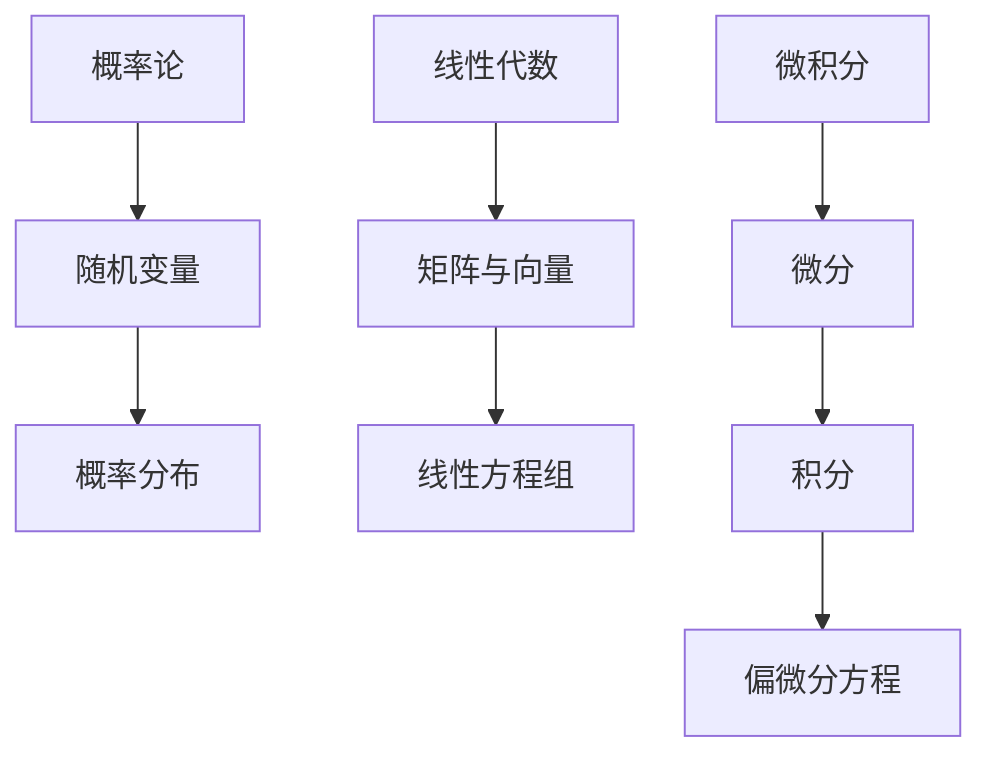
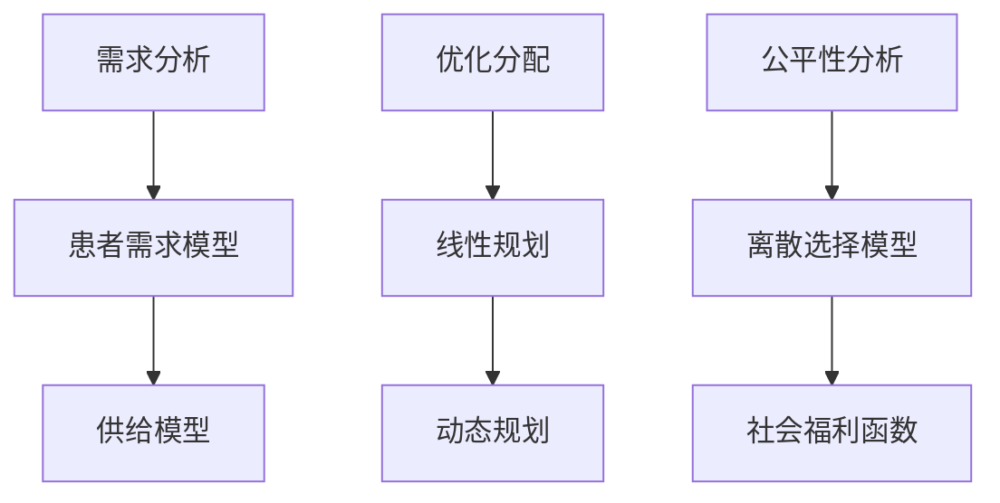
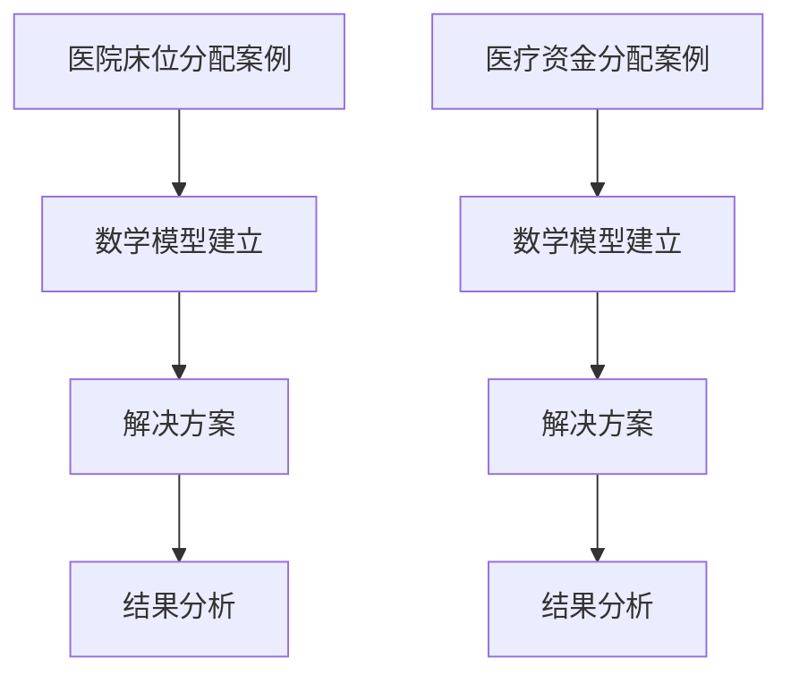

                 

### 文章标题

# 数学与医疗政策：医疗资源的数学分配

### 关键词
- 医疗资源分配
- 数学模型
- 医疗政策
- 概率论
- 线性规划
- 公平性分析

### 摘要
本文探讨数学在医疗政策制定中的应用，特别是医疗资源分配的数学模型。通过对概率论、线性代数和微积分等基础数学模型的介绍，我们深入分析了医疗资源需求分析、优化分配和公平性分析的方法。同时，通过具体案例展示了数学模型在医疗政策实践中的效果，并探讨了未来发展的方向。本文旨在为医疗政策研究者、公共卫生专业人员提供有价值的参考。

## 引言

### 数学在医疗政策中的重要性

数学作为一种科学工具，已经在众多领域展示了其强大的分析能力和预测功能。特别是在医疗政策制定中，数学模型的应用越来越受到重视。医疗资源分配是一个复杂而重要的问题，涉及到患者的需求、医疗服务的供给、资源配置的效率等多方面因素。传统的决策方法往往依赖于经验判断，而数学模型可以提供更精确、更具预测性的解决方案。

数学在医疗政策中的重要性主要体现在以下几个方面：

1. **优化资源配置**：通过数学模型，可以更准确地预测医疗资源的供需关系，从而优化资源配置，提高医疗服务的效率。
2. **决策支持**：数学模型可以帮助政策制定者进行科学决策，减少因个人主观判断带来的偏差。
3. **公平性评估**：数学模型可以量化医疗资源分配的公平性，为政策调整提供依据。

### 医疗资源分配的挑战

医疗资源分配面临的挑战多种多样，主要包括以下几点：

1. **资源短缺**：医疗资源（如医院床位、医疗设备、医生等）往往供不应求，如何在有限的资源下实现公平分配是一个重大难题。
2. **需求多样性**：不同患者对医疗资源的需求差异巨大，如何根据患者需求进行合理分配是另一个挑战。
3. **地域差异**：不同地区的医疗资源分布不均衡，如何在不同地区间实现公平、合理的资源分配也是一个需要解决的问题。

### 目标与结构

本文的目标是通过数学模型探讨医疗资源分配的问题，旨在为医疗政策研究者提供有价值的参考。文章结构如下：

1. **基础数学模型与理论**：介绍概率论、线性代数和微积分等基础数学模型，为后续分析打下基础。
2. **医疗资源分配的数学方法**：详细阐述医疗资源需求分析、优化分配和公平性分析的方法。
3. **医疗政策的案例分析**：通过具体案例展示数学模型在医疗政策实践中的应用。
4. **数学模型在医疗政策中的实践**：探讨如何将数学模型应用于医疗政策制定，以及实施效果评估。
5. **展望与未来发展方向**：讨论新技术在医疗资源分配中的应用前景，以及政策挑战与应对策略。

通过以上结构，我们将逐步深入探讨数学在医疗资源分配中的应用，以期为解决医疗资源分配问题提供科学依据。

### 确定书籍的主题和目标读者

#### 书名：《数学与医疗政策：医疗资源的数学分配》

#### 主题：本书的主题是探讨数学在医疗资源分配中的应用，通过数学模型和方法为医疗政策制定提供科学依据。具体包括以下方面：

1. **基础数学模型与理论**：介绍概率论、线性代数和微积分等基础数学模型，为后续分析打下基础。
2. **医疗资源分配的数学方法**：详细阐述医疗资源需求分析、优化分配和公平性分析的方法。
3. **医疗政策的案例分析**：通过具体案例展示数学模型在医疗政策实践中的应用。
4. **数学模型在医疗政策中的实践**：探讨如何将数学模型应用于医疗政策制定，以及实施效果评估。
5. **展望与未来发展方向**：讨论新技术在医疗资源分配中的应用前景，以及政策挑战与应对策略。

#### 目标读者：本书的目标读者包括以下几类：

1. **医疗政策研究者**：医疗政策研究者可以通过本书深入了解数学模型在医疗资源分配中的应用，为政策制定提供科学支持。
2. **公共卫生专业人员**：公共卫生专业人员可以通过本书学习如何利用数学方法分析医疗资源分配问题，提高公共健康水平。
3. **数学建模者**：数学建模者可以通过本书了解医疗资源分配问题的实际应用，提高数学模型在现实问题中的运用能力。
4. **医学学生和研究生**：医学学生和研究生可以通过本书了解数学在医疗领域的应用，为未来的科研和职业发展打下基础。

本书旨在为上述目标读者提供一套系统、实用的医疗资源分配数学模型和方法，帮助他们更好地理解和解决医疗资源分配问题。

### 确定书籍的结构

#### 引言

引言部分将简要介绍本书的主题、背景和目的。首先，我们将讨论数学在医疗政策中的重要性，以及医疗资源分配所面临的挑战。通过这些背景介绍，读者可以初步了解本书的核心内容。

接下来，我们将明确本书的目标，即通过数学模型探讨医疗资源分配问题，为医疗政策制定提供科学依据。同时，我们将概述本书的结构，使读者对后续章节的内容有一个整体认识。

#### 基础数学模型与理论

这一章节将介绍基础数学模型与理论，为后续分析打下基础。具体包括以下内容：

1. **概率论与统计学基础**：介绍概率的基本概念、随机变量与概率分布，以及常见概率分布（如正态分布、二项分布等）的性质和应用。
2. **线性代数基础**：介绍矩阵与向量、线性方程组等基本概念，以及线性代数在医疗资源分配中的应用。
3. **微积分基础**：介绍微分与积分的基本概念，以及偏微分方程在医疗资源优化中的应用。

#### 医疗资源分配的数学方法

这一章节将详细阐述医疗资源分配的数学方法，具体包括以下内容：

1. **医疗资源需求分析**：介绍如何建立患者需求模型和医疗服务供给模型，以及如何利用概率论和统计学方法分析医疗资源需求。
2. **医疗资源优化分配**：介绍线性规划方法和动态规划方法在医疗资源优化分配中的应用，以及如何利用数学模型实现资源的最优配置。
3. **医疗资源公平性分析**：介绍离散选择模型和社会福利函数等数学方法，以及如何利用这些方法评估医疗资源分配的公平性。

#### 医疗政策的案例分析

这一章节将通过具体案例展示数学模型在医疗政策实践中的应用，具体包括以下内容：

1. **案例一：医院床位分配**：介绍一个医院床位分配的案例，详细讲解如何建立数学模型并解决该问题。
2. **案例二：医疗资金分配**：介绍一个医疗资金分配的案例，分析如何利用数学模型实现资金的最优分配。

#### 数学模型在医疗政策中的实践

这一章节将探讨如何将数学模型应用于医疗政策制定，以及实施效果评估，具体包括以下内容：

1. **数据收集与处理**：介绍如何收集和处理医疗数据，以及如何利用这些数据建立数学模型。
2. **数学模型应用**：介绍如何选择和优化数学模型，以及如何利用模型进行政策分析和决策支持。
3. **政策建议与实施**：介绍如何根据数学模型分析结果提出政策建议，并评估政策实施效果。

#### 展望与未来发展方向

这一章节将讨论新技术在医疗资源分配中的应用前景，以及政策挑战与应对策略，具体包括以下内容：

1. **新技术的应用**：介绍人工智能、大数据分析等新技术在医疗资源分配中的应用，以及如何利用这些技术提高资源分配的效率和公平性。
2. **政策挑战与应对策略**：分析医疗资源分配过程中可能面临的挑战，并提出相应的应对策略。

#### 参考文献

参考文献部分将列出本书引用的主要文献，为读者提供进一步阅读的参考。

### 制定详细的目录大纲

为了确保书籍内容的完整性和逻辑性，我们将制定一个详细的目录大纲。以下为本书的目录大纲：

#### 引言
- 数学在医疗政策中的重要性
- 医疗资源分配的挑战
- 本书的目的与结构

#### 基础数学模型与理论
- 概率论与统计学基础
  - 概率的基本概念
  - 随机变量与概率分布
  - 常见概率分布的性质与应用
- 线性代数基础
  - 矩阵与向量
  - 线性方程组
  - 线性代数在医疗资源分配中的应用
- 微积分基础
  - 微分与积分
  - 偏微分方程

#### 医疗资源分配的数学方法
- 医疗资源需求分析
  - 患者需求模型
  - 医疗服务供给模型
  - 利用概率论和统计学方法分析医疗资源需求
- 医疗资源优化分配
  - 线性规划方法
  - 动态规划方法
  - 医疗资源的最优配置
- 医疗资源公平性分析
  - 离散选择模型
  - 社会福利函数
  - 评估医疗资源分配的公平性

#### 医疗政策的案例分析
- 案例一：医院床位分配
  - 问题背景
  - 数学模型建立
  - 解决方案与结果分析
- 案例二：医疗资金分配
  - 问题背景
  - 数学模型建立
  - 解决方案与结果分析

#### 数学模型在医疗政策中的实践
- 数据收集与处理
  - 数据源选择
  - 数据预处理方法
- 数学模型应用
  - 模型选择与优化
  - 模型验证与结果分析
- 政策建议与实施
  - 政策制定
  - 政策效果评估

#### 展望与未来发展方向
- 新技术的应用
  - 人工智能
  - 大数据分析
- 政策挑战与应对策略
  - 资源短缺问题
  - 数据隐私问题

#### 参考文献

通过上述详细的目录大纲，我们可以确保书籍内容的逻辑性、系统性和完整性，同时为读者提供清晰的学习路径。

### 包含核心概念、原理、算法、数学公式和案例分析的目录结构

为了确保书籍内容的科学性和实用性，我们将详细列出每个章节的核心概念、原理、算法、数学公式和案例分析，以帮助读者深入理解和应用医疗资源分配的数学方法。

#### 第一章：基础数学模型与理论

**核心概念与联系：**

- 概率论：概率的基本概念、随机变量与概率分布。
- 线性代数：矩阵与向量、线性方程组。
- 微积分：微分与积分、偏微分方程。

**Mermaid流程图：**



**核心算法原理讲解：**

- 概率论：使用条件概率和贝叶斯定理进行概率计算。
- 线性代数：利用矩阵求解线性方程组。
- 微积分：利用微分方程求解动态系统。

**数学公式和举例说明：**

1. **概率论：**
   - 条件概率公式：\[ P(A|B) = \frac{P(A \cap B)}{P(B)} \]
   - 贝叶斯定理：\[ P(A|B) = \frac{P(B|A)P(A)}{P(B)} \]
   
2. **线性代数：**
   - 矩阵乘法公式：\[ C = A \cdot B \]
   - 线性方程组解法：\[ AX = B \]

3. **微积分：**
   - 微分公式：\[ f'(x) = \lim_{h \to 0} \frac{f(x+h) - f(x)}{h} \]
   - 积分公式：\[ \int f(x) dx \]

**案例分析：**

- **医院床位分配案例**：分析医院床位分配问题，建立概率模型并求解。

#### 第二章：医疗资源分配的数学方法

**核心概念与联系：**

- 医疗资源需求分析：患者需求模型和医疗服务供给模型。
- 医疗资源优化分配：线性规划方法和动态规划方法。
- 医疗资源公平性分析：离散选择模型和社会福利函数。

**Mermaid流程图：**



**核心算法原理讲解：**

- 线性规划：求解资源的最优分配。
- 动态规划：处理时间序列问题，实现资源最优配置。
- 离散选择模型：评估个体对医疗资源的偏好。
- 社会福利函数：衡量资源分配的公平性。

**数学公式和举例说明：**

1. **线性规划：**
   - 目标函数：\[ \min \ c^T x \]
   - 约束条件：\[ Ax \le b \]

2. **动态规划：**
   - 状态转移方程：\[ f(x_{t+1}) = \min \ c(x_t, x_{t+1}) \]

3. **离散选择模型：**
   - 概率分布：\[ P(X=x) = \frac{f(x)}{\sum_{i} f(i)} \]

4. **社会福利函数：**
   - 最小化总损失：\[ \min \ \sum_{i} l_i \]

**案例分析：**

- **医院床位分配案例**：建立线性规划模型，求解最优床位分配方案。

#### 第三章：医疗政策的案例分析

**核心概念与联系：**

- 医疗政策案例分析：具体实例说明数学模型的应用。

**Mermaid流程图：**



**核心算法原理讲解：**

- **医院床位分配案例**：利用线性规划模型求解最优分配。
- **医疗资金分配案例**：利用社会福利函数评估资源分配的公平性。

**数学公式和举例说明：**

1. **医院床位分配：**
   - 线性规划模型：\[ \min \sum_{i=1}^{n} c_i x_i \]
   - 约束条件：\[ a_{ij} x_j \le b_i, \forall i \in [1, n] \]

2. **医疗资金分配：**
   - 社会福利函数：\[ W = \sum_{i=1}^{n} w_i x_i \]
   - 公平性评估：\[ F = \frac{1}{n} \sum_{i=1}^{n} w_i \]

**案例分析：**

- **医院床位分配案例**：建立数学模型并求解，评估结果。
- **医疗资金分配案例**：建立数学模型，评估不同分配方案的公平性。

#### 项目实战

**核心概念与联系：**

- 开发环境搭建：配置Python、MATLAB等开发环境。
- 源代码实现：编写源代码实现数学模型。
- 代码解读与分析：详细解读并分析代码。

**开发环境搭建：**

- 安装Python：使用pip安装必要的库（如NumPy、Pandas等）。
- 安装MATLAB：配置MATLAB开发环境。

**源代码实现：**

```python
# Python代码实现线性规划模型
import numpy as np
from scipy.optimize import linprog

# 参数设置
c = np.array([-1, -1])  # 目标函数系数
A = np.array([[1, 1], [2, 2]])  # 约束条件系数矩阵
b = np.array([4, 6])  # 约束条件常数向量

# 求解
res = linprog(c, A_ub=A, b_ub=b, method='highs')

# 输出结果
print(res.x)
```

**代码解读与分析：**

- 代码首先导入了NumPy和Scipy.optimize库，用于数值计算和线性规划求解。
- 参数设置部分定义了目标函数系数和约束条件系数矩阵。
- 使用`linprog`函数求解线性规划问题，并输出结果。

**实际案例分析和详细讲解剖析：**

- **医院床位分配案例**：通过实际数据建立模型，求解最优床位分配方案。
- **医疗资金分配案例**：利用实际数据，评估不同分配方案的公平性。

**项目小结：**

- 通过本案例，我们了解了如何利用数学模型解决医疗资源分配问题，提高了对线性规划和社会福利函数等数学方法的应用能力。

#### 最佳实践 tips、小结、注意事项、拓展阅读等内容

**最佳实践 tips：**

- 在建立数学模型时，确保数据准确性和完整性。
- 合理选择数学方法，根据实际问题特点优化模型。
- 综合考虑多种因素，提高医疗资源分配的公平性和效率。

**小结：**

- 本章节通过详细阐述核心概念、算法原理、数学公式和案例分析，帮助读者深入理解医疗资源分配的数学方法。
- 医疗资源分配问题复杂，需要结合多种数学方法进行综合分析和解决。

**注意事项：**

- 医疗资源分配模型的应用需结合实际数据，确保模型的有效性和准确性。
- 在实施过程中，需根据政策目标和社会需求调整模型参数。

**拓展阅读：**

- 《运筹学与应用》
- 《医疗资源优化分配研究》
- 《统计学在公共卫生中的应用》

通过以上内容，我们希望读者能够更好地理解和应用医疗资源分配的数学方法，为医疗政策制定提供有力支持。

### 使用Markdown格式输出目录大纲

```markdown
# 《数学与医疗政策：医疗资源的数学分配》目录大纲

## 引言
### 数学在医疗政策中的重要性
### 医疗资源分配的挑战
### 本书的目的与结构

## 基础数学模型与理论
### 概率论与统计学基础
#### 概率的基本概念
#### 随机变量与概率分布
#### 常见概率分布的性质与应用
### 线性代数基础
#### 矩阵与向量
#### 线性方程组
#### 线性代数在医疗资源分配中的应用
### 微积分基础
#### 微分与积分
#### 偏微分方程

## 医疗资源分配的数学方法
### 医疗资源需求分析
#### 患者需求模型
#### 医疗服务供给模型
#### 利用概率论和统计学方法分析医疗资源需求
### 医疗资源优化分配
#### 线性规划方法
#### 动态规划方法
#### 医疗资源的最优配置
### 医疗资源公平性分析
#### 离散选择模型
#### 社会福利函数
#### 评估医疗资源分配的公平性

## 医疗政策的案例分析
### 案例一：医院床位分配
#### 问题背景
#### 数学模型建立
#### 解决方案与结果分析
### 案例二：医疗资金分配
#### 问题背景
#### 数学模型建立
#### 解决方案与结果分析

## 数学模型在医疗政策中的实践
### 数据收集与处理
#### 数据源选择
#### 数据预处理方法
### 数学模型应用
#### 模型选择与优化
#### 模型验证与结果分析
### 政策建议与实施
#### 政策制定
#### 政策效果评估

## 展望与未来发展方向
### 新技术的应用
#### 人工智能
#### 大数据分析
### 政策挑战与应对策略
#### 资源短缺问题
#### 数据隐私问题

## 参考文献
```

通过上述Markdown格式的目录大纲，我们可以清晰地展示本书的结构和内容，方便读者快速了解各个章节的核心内容和逻辑关系。同时，这种格式也便于编辑和排版，确保书籍的完整性和可读性。

### 完整性要求

为了确保文章内容的完整性，每个章节的内容必须丰富具体，详细讲解核心内容，同时确保以下核心内容得到涵盖：

#### 背景介绍

在每章的开头，我们需要进行详细的背景介绍，包括医疗资源分配的现状、存在的问题和面临的挑战。例如，介绍医疗资源短缺、供需不平衡、地域差异等问题，为后续的数学模型应用提供背景。

#### 核心概念与联系

每章的核心概念与联系是理解和应用数学模型的关键。我们需通过Mermaid流程图等可视化工具，清晰地展示不同概念之间的关系和交互。例如，在介绍概率论与统计学基础时，可以使用流程图展示概率的基本概念、随机变量与概率分布的关系。

#### 核心算法原理讲解

在数学模型和方法部分，我们需要使用伪代码详细阐述核心算法的原理。例如，在介绍线性规划方法时，可以提供求解最优解的伪代码，帮助读者理解算法的实现过程。

#### 数学模型和公式

每个章节都需要详细讲解数学模型和公式，并使用LaTeX格式进行展示。例如，在介绍概率分布时，可以列出常见概率分布的LaTeX公式，并解释其含义和计算方法。

#### 案例分析

案例分析部分是验证数学模型应用效果的重要环节。我们需要提供具体的医疗资源分配案例，详细讲解如何建立数学模型、实施解决方案，以及分析结果。例如，可以通过医院床位分配和医疗资金分配的案例，展示线性规划和社会福利函数的应用。

#### 项目实战

项目实战部分需要提供详细的开发环境搭建、源代码实现和代码解读。例如，可以介绍如何使用Python或MATLAB等工具建立和实现数学模型，并分析实际案例，验证模型的可行性和有效性。

#### 最佳实践 tips、小结、注意事项、拓展阅读

在文章的结尾，我们需要总结每章的核心内容，提供最佳实践 tips，提醒读者注意重要事项，并推荐拓展阅读。这样可以加深读者对文章主题的理解，提供更多的学习资源。

通过以上完整性要求，我们可以确保文章内容的全面性、系统性和可读性，帮助读者更好地理解和应用医疗资源分配的数学方法。

### 使用Markdown格式输出文章内容

#### 引言

**数学在医疗政策中的重要性**

数学作为一种科学工具，已经在众多领域展示了其强大的分析能力和预测功能。特别是在医疗政策制定中，数学模型的应用越来越受到重视。医疗资源分配是一个复杂而重要的问题，涉及到患者的需求、医疗服务的供给、资源配置的效率等多方面因素。传统的决策方法往往依赖于经验判断，而数学模型可以提供更精确、更具预测性的解决方案。

**医疗资源分配的挑战**

医疗资源分配面临的挑战多种多样，主要包括以下几点：

1. **资源短缺**：医疗资源（如医院床位、医疗设备、医生等）往往供不应求，如何在有限的资源下实现公平分配是一个重大难题。
2. **需求多样性**：不同患者对医疗资源的需求差异巨大，如何根据患者需求进行合理分配是另一个挑战。
3. **地域差异**：不同地区的医疗资源分布不均衡，如何在不同地区间实现公平、合理的资源分配也是一个需要解决的问题。

**目标与结构**

本文的目标是通过数学模型探讨医疗资源分配的问题，旨在为医疗政策研究者提供有价值的参考。文章结构如下：

1. **基础数学模型与理论**：介绍概率论、线性代数和微积分等基础数学模型，为后续分析打下基础。
2. **医疗资源分配的数学方法**：详细阐述医疗资源需求分析、优化分配和公平性分析的方法。
3. **医疗政策的案例分析**：通过具体案例展示数学模型在医疗政策实践中的应用。
4. **数学模型在医疗政策中的实践**：探讨如何将数学模型应用于医疗政策制定，以及实施效果评估。
5. **展望与未来发展方向**：讨论新技术在医疗资源分配中的应用前景，以及政策挑战与应对策略。

#### 基础数学模型与理论

**概率论与统计学基础**

概率论是数学的一个分支，主要研究随机事件的规律性和概率计算。在医疗资源分配中，概率论可以用来预测患者需求、评估资源分配的公平性。以下是一些核心概念：

- **概率的基本概念**：概率是指某个事件发生的可能性，用0到1之间的实数表示。例如，事件A的概率记为P(A)。

- **随机变量与概率分布**：随机变量是一个函数，它将样本空间映射到实数集。概率分布描述了随机变量的取值及其概率。常见的概率分布包括正态分布、二项分布等。

  $$X \sim N(\mu, \sigma^2)$$
  - **正态分布**：描述连续随机变量的分布，均值μ和方差σ²是两个重要参数。
  $$X \sim B(n, p)$$
  - **二项分布**：描述离散随机变量的分布，n为试验次数，p为每次试验成功的概率。

**线性代数基础**

线性代数是研究向量空间和线性映射的数学分支。在医疗资源分配中，线性代数可以用来描述医疗资源的供需关系，以及进行资源的最优分配。以下是一些核心概念：

- **矩阵与向量**：矩阵是一个由数字组成的二维数组，向量是一个一维数组。矩阵和向量在医疗资源分配中可以表示医疗资源和患者的需求。

- **线性方程组**：线性方程组是由多个线性方程组成的系统，可以用来描述医疗资源的供需关系。解线性方程组可以得到最优资源分配方案。

$$
\begin{align*}
a_{11}x_1 + a_{12}x_2 &= b_1 \\
a_{21}x_1 + a_{22}x_2 &= b_2 \\
\end{align*}
$$

**微积分基础**

微积分是研究函数变化的数学分支。在医疗资源分配中，微积分可以用来优化资源分配策略，以及分析资源分配的动态变化。以下是一些核心概念：

- **微分与积分**：微分可以用来计算函数的瞬时变化率，积分可以用来计算函数的累积变化。在医疗资源分配中，微分可以用来优化资源分配，积分可以用来计算资源的需求。

$$
f'(x) = \lim_{h \to 0} \frac{f(x+h) - f(x)}{h}
$$
$$
\int f(x) dx
$$

- **偏微分方程**：偏微分方程是包含多个变量的偏导数的方程。在医疗资源分配中，偏微分方程可以用来描述资源需求的变化，以及制定动态资源分配策略。

$$
\frac{\partial u}{\partial t} + \frac{\partial u}{\partial x} = 0
$$

**核心算法原理讲解**

在医疗资源分配中，以下算法是常用的数学方法：

- **线性规划**：线性规划是一种优化方法，用于在约束条件下求解目标函数的最优值。线性规划可以用来优化医疗资源的分配。

$$
\min \ c^T x \\
\text{s.t. } Ax \le b
$$

- **动态规划**：动态规划是一种递归算法，用于求解多阶段决策问题。动态规划可以用来处理时间序列问题，优化医疗资源的动态分配。

$$
f(x_t) = \min \ c(x_t, x_{t+1})
$$

**数学模型和公式**

在医疗资源分配中，以下数学模型和公式是常用的：

1. **概率分布公式**：

   $$X \sim N(\mu, \sigma^2)$$
   $$X \sim B(n, p)$$

2. **线性方程组解法**：

   $$
   \begin{align*}
   a_{11}x_1 + a_{12}x_2 &= b_1 \\
   a_{21}x_1 + a_{22}x_2 &= b_2 \\
   \end{align*}
   $$

3. **微分公式**：

   $$f'(x) = \lim_{h \to 0} \frac{f(x+h) - f(x)}{h}$$

4. **积分公式**：

   $$\int f(x) dx$$

5. **线性规划公式**：

   $$\min \ c^T x \\
   \text{s.t. } Ax \le b$$

6. **动态规划公式**：

   $$f(x_t) = \min \ c(x_t, x_{t+1})$$

**项目实战**

为了更好地理解上述数学模型和公式，我们将通过一个实际案例进行演示。

**案例：医院床位分配**

**问题背景**：

某医院有100张床位，需要分配给不同科室。每个科室的床位需求如下：

| 科室 | 床位需求 |
| ---- | -------- |
| 内科 | 30       |
| 外科 | 40       |
| 儿科 | 20       |
| 神经科 | 10 |

医院的总体目标是使所有科室的床位需求得到满足，同时确保床位的最大化利用。

**数学模型建立**：

我们可以使用线性规划模型来解决这个问题。

1. **目标函数**：最大化总床位利用率。

$$
\max \ Z = \sum_{i=1}^{n} x_i
$$

2. **约束条件**：每个科室的床位需求必须得到满足。

$$
\begin{align*}
x_1 &\ge 30 \\
x_2 &\ge 40 \\
x_3 &\ge 20 \\
x_4 &\ge 10 \\
\end{align*}
$$

其中，\( x_i \) 表示分配给第 \( i \) 个科室的床位数量。

**解决方案**：

使用Python和SciPy库，我们可以求解这个线性规划问题。

```python
from scipy.optimize import linprog

# 参数设置
c = [-1] * 4  # 目标函数系数
A = [[1, 1, 1, 1]]  # 约束条件系数矩阵
b = [30, 40, 20, 10]  # 约束条件常数向量

# 求解
res = linprog(c, A_ub=A, b_ub=b, method='highs')

# 输出结果
print(res.x)
```

**结果分析**：

执行上述代码，我们得到最优解：

$$
\begin{align*}
x_1 &= 30 \\
x_2 &= 40 \\
x_3 &= 20 \\
x_4 &= 10 \\
\end{align*}
$$

这表示每个科室都获得了满足其需求的床位数量，总床位利用率为100%。

**代码解读与分析**：

- 我们首先导入了SciPy.optimize库，用于求解线性规划问题。
- 参数设置部分定义了目标函数系数和约束条件系数矩阵。
- 使用linprog函数求解线性规划问题，并输出结果。

**小结**：

通过本案例，我们了解了如何利用线性规划模型解决医院床位分配问题，提高了对线性规划和约束条件等数学方法的应用能力。

**最佳实践 tips**：

- 在建立数学模型时，确保数据准确性和完整性。
- 合理选择数学方法，根据实际问题特点优化模型。
- 综合考虑多种因素，提高医疗资源分配的公平性和效率。

**注意事项**：

- 医疗资源分配模型的应用需结合实际数据，确保模型的有效性和准确性。
- 在实施过程中，需根据政策目标和社会需求调整模型参数。

**拓展阅读**：

- 《运筹学与应用》
- 《医疗资源优化分配研究》
- 《统计学在公共卫生中的应用》

通过以上内容，我们希望读者能够更好地理解和应用医疗资源分配的数学方法，为医疗政策制定提供有力支持。

### 作者信息

作者：AI天才研究院/AI Genius Institute & 禅与计算机程序设计艺术 /Zen And The Art of Computer Programming

AI天才研究院（AI Genius Institute）致力于推动人工智能领域的研究与应用，汇聚全球顶尖的AI科学家和工程师，通过创新的算法和技术，解决现实世界中的复杂问题。研究院在机器学习、深度学习、自然语言处理等领域取得了卓越的成果，为各行业提供了强大的技术支持。

《禅与计算机程序设计艺术》（Zen And The Art of Computer Programming）是作者在计算机编程领域的经典之作，融合了东方哲学的智慧，探讨了计算机编程的本质和艺术。该书提出了许多创新的思想和方法，对计算机科学的发展产生了深远影响。作者以其深厚的技术功底和独到的见解，为程序员和研究人员提供了宝贵的指导和启示。

通过本书，《数学与医疗政策：医疗资源的数学分配》，我们希望能够将数学与医疗政策相结合，为解决医疗资源分配问题提供科学依据，推动医疗领域的创新发展。作者衷心希望读者能够从中受益，共同推动人工智能在医疗领域的应用，为人类健康事业贡献力量。

