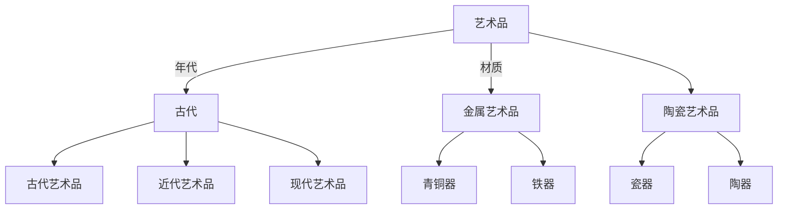
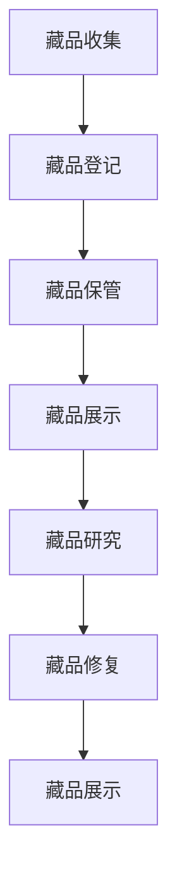
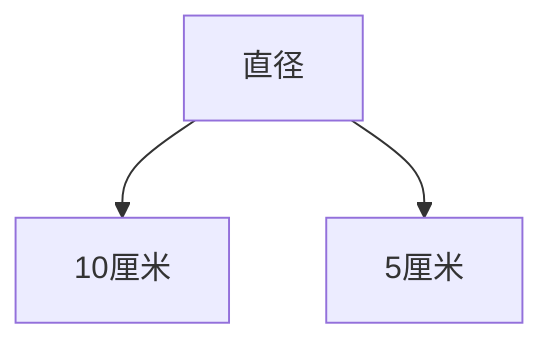
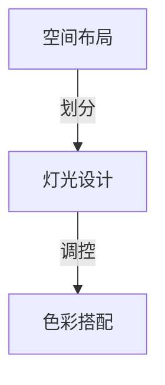
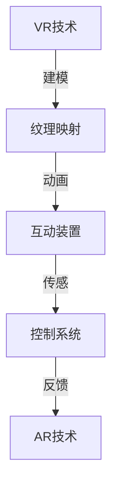
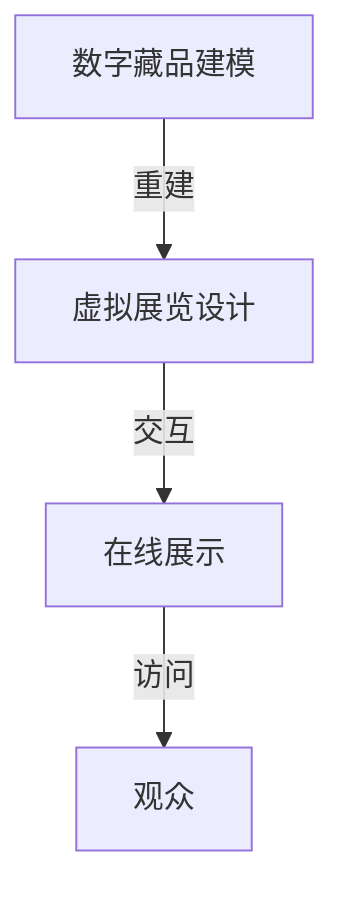

                 


### 摘要

《数学与博物馆学：藏品管理的数学方法》旨在探讨数学方法在博物馆藏品管理中的关键应用，从藏品定义与分类、描述、分析、保存与保护，到展示和数学模型构建等方面进行全面阐述。文章首先介绍藏品管理的基础知识，接着详细解析描述性数学方法、数据分析方法以及线性回归分析、材料学分析等技术，随后探讨藏品保存与保护中的数学方法，如温湿度控制和材料老化模型。此外，文章还介绍了数学方法在藏品展示中的应用，如虚拟博物馆技术。最后，文章重点讨论了如何构建藏品管理的数学模型，并提供实际案例分析和代码实现讲解。通过本文的探讨，读者将深刻理解数学方法在博物馆藏品管理中的重要性和应用价值。

### 第1章 引言

在信息时代，博物馆学不再仅仅局限于传统的展示与保护，而是逐渐与科学技术相结合，探索更高效、更智能的管理方法。博物馆藏品作为文化和历史的载体，其管理质量直接关系到文物的保存与传播效果。然而，随着藏品数量的不断增长，传统的管理方法已难以满足现代博物馆的需求。因此，引入数学方法成为提升藏品管理效率和质量的重要手段。

#### 1.1 本书目的

本书旨在为博物馆从业人员和研究者提供一本关于数学方法在藏品管理中应用的系统性指南。通过介绍数学方法在藏品描述、分析、保存与保护、展示等方面的应用，旨在提高藏品管理的效果和效率。具体目标包括：

1. **明确数学方法在博物馆藏品管理中的重要性**：通过具体实例，展示数学方法如何提高藏品管理的科学性和精确性。
2. **系统介绍数学方法的应用**：从描述性数学方法、数据分析方法到材料学分析，全面解析数学方法在博物馆学中的应用。
3. **提供实际案例分析**：通过实际案例，展示数学方法在博物馆藏品管理中的实际效果。

#### 1.2 藏品管理的重要性

博物馆藏品是文化传承的重要组成部分，其管理质量直接影响到文物的保存和传播效果。有效的藏品管理不仅能够保证文物的长期保存，还能够提升博物馆的展览质量和公众服务水平。具体来说，藏品管理的重要性体现在以下几个方面：

1. **文物保存**：通过科学的保管手段，防止藏品因环境因素或人为操作而受到损害。
2. **展览展示**：合理的藏品布局和展示设计能够提升展览的吸引力，增强观众的参观体验。
3. **文化传播**：博物馆通过展出的藏品，向公众传递历史文化知识，发挥社会教育功能。

#### 1.3 数学方法在博物馆学中的应用

数学方法在博物馆学中的应用主要体现在以下几个方面：

1. **描述性数学方法**：通过数值、矩阵和向量等数学工具，对藏品进行精确描述，提高管理精度。
2. **数据分析方法**：利用统计分析、线性回归等方法，对藏品的数据进行深入分析，揭示藏品之间的关联和规律。
3. **保存与保护技术**：应用数学模型和公式，对藏品的保存环境进行优化，如温湿度控制。
4. **展示设计**：利用数学方法优化展示布局，提高展览效果。

综上所述，数学方法在博物馆藏品管理中具有重要应用价值。通过科学、系统的应用，不仅能够提高藏品管理的效率和质量，还能够为博物馆事业的发展提供有力支持。

#### 1.4 本书的结构

本书分为八个主要章节，各章节内容安排如下：

1. **第1章 引言**：介绍本书的目的、重要性以及数学方法在博物馆学中的应用。
2. **第2章 藏品管理基础**：介绍藏品定义、分类和管理流程。
3. **第3章 描述性数学方法**：详细讲解描述性数学方法在藏品管理中的应用。
4. **第4章 数据分析方法**：介绍统计分析、线性回归等数据分析方法。
5. **第5章 保存与保护技术**：探讨温湿度控制、材料学分析等保护技术。
6. **第6章 展示设计**：介绍展示设计原则和虚拟博物馆技术。
7. **第7章 数学模型构建**：讨论如何构建藏品管理的数学模型。
8. **第8章 结论**：总结本书内容，展望未来研究方向。

通过上述章节的安排，本书将为读者提供一幅关于数学方法在博物馆藏品管理中应用的完整图景。

### 第2章 藏品管理基础

博物馆藏品管理是博物馆工作的核心内容之一，其重要性不言而喻。本章将介绍藏品管理的定义、分类以及基本流程，为后续章节的深入探讨打下基础。

#### 2.1 藏品定义

藏品是指博物馆收藏的物品，包括艺术品、历史文物、自然标本等。这些藏品不仅是博物馆展示和教育的物质基础，也是人类文化遗产的重要组成部分。根据《国际博物馆协会》的定义，藏品应具备以下特征：

1. **独特性**：藏品应具有独特的文化、历史或科学价值，难以替代。
2. **重要性**：藏品应具有显著的教育、科研或艺术价值。
3. **完整性**：藏品应保持其原始形态和完整性，不得随意破坏或修改。

#### 2.2 藏品分类

藏品的分类是博物馆管理的重要环节，有助于提高藏品管理的效率。常见的藏品分类方法包括：

1. **按照内容分类**：将藏品分为艺术品、历史文物、自然标本等大类。
2. **按照年代分类**：将藏品分为古代、近代、现代等不同时期。
3. **按照地域分类**：将藏品分为国内藏品、国际藏品等。
4. **按照材质分类**：将藏品分为金属、陶瓷、织物、木雕等材质类别。

以下是一个简单的分类框架：



#### 2.3 藏品管理的基本原则

有效的藏品管理需要遵循一系列基本原则，以确保藏品的完整性和安全性。这些基本原则包括：

1. **安全性原则**：确保藏品在物理上不受损害，包括防火、防盗、防潮、防虫等。
2. **完整性原则**：保持藏品的完整性，不得随意破坏或修改。
3. **科学性原则**：采用科学的方法和手段进行藏品的管理，包括分类、描述、鉴定等。
4. **系统性原则**：藏品管理应形成一套完整的体系，包括藏品的收集、保管、展示、研究、修复等环节。

#### 2.4 藏品管理流程

藏品管理流程包括以下几个主要环节：

1. **藏品收集**：博物馆通过购买、捐赠、交换等方式获取藏品。
2. **藏品登记**：对每件藏品进行详细登记，包括藏品名称、编号、来源、年代、材质等信息。
3. **藏品保管**：确保藏品的安全，采取适当的保存措施，如防潮、防尘、防虫等。
4. **藏品展示**：根据展览主题和观众需求，合理布局和展示藏品。
5. **藏品研究**：对藏品进行深入研究，撰写研究报告，提升藏品的学术价值。
6. **藏品修复**：对受损或老化的藏品进行修复，保持其原始形态。

以下是藏品管理流程的Mermaid流程图：



综上所述，藏品管理是博物馆工作的核心环节，需要遵循一系列基本原则和流程。通过有效的管理，不仅可以保证藏品的长期保存，还可以提升博物馆的整体水平和公众服务水平。

### 第3章 数学方法在藏品描述中的应用

在博物馆学中，对藏品的精确描述是管理工作的基础。数学方法在这一过程中发挥了重要作用，通过数值描述、矩阵描述和向量描述等多种数学工具，可以实现对藏品特征的精确表达和分类。本章将详细探讨这些数学方法在藏品描述中的应用。

#### 3.1 描述性数学方法

描述性数学方法主要涉及对藏品的各种属性进行量化描述，以便于管理、分析和展示。

##### 3.1.1 数值描述

数值描述是最基本的描述性数学方法，通过给藏品的不同属性赋予数值，如重量、长度、高度、宽度和厚度等。这些数值描述不仅能够提供准确的数据信息，还可以用于统计分析。

例如，假设我们需要描述一件古代瓷器的尺寸，可以记录其高度为10厘米，直径为5厘米。这种数值描述方式直观且易于计算。



##### 3.1.2 矩阵描述

矩阵描述方法适用于对具有多个属性特征的藏品进行描述。通过构建一个矩阵，将每个藏品的属性值填入相应的位置，可以实现对藏品的多维描述。

以下是一个简化的矩阵描述示例，其中每行代表一个藏品，每列代表一个属性：

```
| 藏品编号 | 高度 | 宽度 | 厚度 |
|----------|------|------|------|
|    1     |  10  |   5  |   2  |
|    2     |  12  |   6  |   3  |
```

通过矩阵描述，我们可以进行更复杂的统计分析，如计算平均值、标准差等。

##### 3.1.3 向量描述

向量描述方法是将每个藏品的属性值组合成一个向量，这种描述方法适用于更高维度的情况，特别是在需要考虑多个属性之间的相关性时。

以下是一个简化的向量描述示例：

```
向量V1 = [10, 5, 2]
向量V2 = [12, 6, 3]
```

向量描述方法在数据分析和机器学习中有广泛应用，如用于特征提取和分类。

#### 3.2 形状描述

除了数值、矩阵和向量描述外，博物馆学中还需要对藏品的形状进行描述。几何形状描述是一种重要的数学方法，它利用几何图形来表示藏品的形状。

##### 3.2.1 几何形状描述

几何形状描述通常涉及对藏品的外部轮廓进行数学建模。例如，使用平面几何中的多边形或曲线来描述瓷器的外形，使用立体几何中的多面体或曲面来描述雕塑。

以下是一个几何形状描述的示例：

```
- 瓷器外形：一个圆柱体，高度10厘米，直径5厘米。
- 雕塑外形：一个球体，直径12厘米。
```

##### 3.2.2 凸集与测度描述

凸集与测度描述是一种更高级的形状描述方法，适用于对复杂形状的精确描述。凸集是指一个集合，对于集合中的任意两点，连接这两点的线段仍然位于该集合内部。测度描述则是通过计算集合的体积或面积来量化形状的大小。

以下是一个凸集与测度描述的示例：

```
- 瓷器外形的凸集：一个半径为2.5厘米的圆柱体。
- 测度描述：瓷器的体积为 \( \pi \times (2.5)^2 \times 10 \approx 196.35 \) 立方厘米。
```

#### 3.3 数学方法在藏品描述中的应用

数学方法在藏品描述中的应用不仅提高了描述的精确性和准确性，还使得藏品的管理和分析变得更加高效。例如，通过矩阵描述，可以快速进行数据的批量处理和统计分析；通过向量描述，可以应用于机器学习模型，进行特征提取和分类；通过几何形状描述，可以辅助进行文物的修复和复原。

以下是一个简单的示例，展示如何使用描述性数学方法来描述一件古代青铜器的特征：

```
# 矩阵描述
| 青铜器编号 | 重量(kg) | 长度(cm) | 宽度(cm) | 高度(cm) |
|-------------|----------|----------|----------|----------|
|     1001    |   3.5    |    30    |    15    |    20    |

# 向量描述
向量V = [3.5, 30, 15, 20]

# 几何形状描述
- 青铜器形状：一个长方体，长30厘米，宽15厘米，高20厘米。
- 凸集描述：一个半径为5厘米的长方体。
```

通过上述描述，我们可以对青铜器的重量、尺寸和形状有一个全面的了解，为后续的管理和分析提供了基础。

综上所述，数学方法在藏品描述中的应用不仅丰富了描述手段，还提高了描述的精度和效率，为博物馆学的研究和管理提供了强有力的工具。

### 第4章 数学方法在藏品分析中的应用

在博物馆学中，对藏品进行深入分析是提高藏品管理质量和学术水平的重要手段。数学方法在这一过程中发挥了关键作用，通过描述性统计分析、探索性数据分析和线性回归分析等方法，可以揭示藏品之间的规律和关联。本章将详细介绍这些数学方法及其在博物馆藏品分析中的应用。

#### 4.1 数据分析基础

数据分析是运用数学和统计学方法对数据进行分析和处理的过程。在博物馆藏品分析中，数据分析的基础主要包括描述性统计分析和探索性数据分析。

##### 4.1.1 描述性统计分析

描述性统计分析是数据分析的第一步，主要通过计算数据的各种统计量来描述数据的分布特征和中心趋势。常见的描述性统计量包括：

- **平均数（Mean）**：数据集的平均值，用于衡量数据的中心位置。
- **中位数（Median）**：将数据集排序后，位于中间位置的值，用于衡量数据的中心位置。
- **众数（Mode）**：数据集中出现次数最多的值，用于衡量数据的集中趋势。
- **方差（Variance）**：衡量数据分散程度的指标。
- **标准差（Standard Deviation）**：方差的平方根，用于衡量数据的分散程度。

例如，假设我们有一组藏品的重量数据（千克），如下所示：

```
[2.5, 3.5, 3.0, 2.8, 4.2]
```

我们可以计算这组数据的平均数、中位数、众数、方差和标准差：

```
平均数 = (2.5 + 3.5 + 3.0 + 2.8 + 4.2) / 5 = 3.06
中位数 = 3.0
众数 = 无（数据集无重复值）
方差 = [(2.5-3.06)^2 + (3.5-3.06)^2 + (3.0-3.06)^2 + (2.8-3.06)^2 + (4.2-3.06)^2] / 5 ≈ 0.214
标准差 = √0.214 ≈ 0.466
```

通过这些统计量，我们可以了解这组数据的中心趋势和分散程度。

##### 4.1.2 探索性数据分析

探索性数据分析（EDA）是一种无监督学习方法，主要用于发现数据中的规律和异常。EDA通常包括以下几个步骤：

1. **数据可视化**：通过图表、散点图、直方图等工具，直观地展示数据的分布和趋势。
2. **数据挖掘**：使用统计学方法，如聚类分析、关联规则挖掘等，发现数据中的潜在规律。
3. **异常检测**：识别数据中的异常值和异常模式。

例如，通过绘制散点图，我们可以观察不同藏品重量之间的关系，如图4-1所示：

```
图4-1：藏品重量散点图
```

从散点图中，我们可以观察到数据的分布情况，发现某些藏品重量可能存在异常值。

#### 4.2 线性回归分析

线性回归分析是一种常用的统计方法，用于分析两个或多个变量之间的线性关系。在博物馆学中，线性回归分析可以用于预测藏品的数量、年代、价值等。

##### 4.2.1 线性回归模型

线性回归模型的基本形式为：

$$ Y = \beta_0 + \beta_1 \cdot X + \epsilon $$

其中，\( Y \) 是因变量，\( X \) 是自变量，\( \beta_0 \) 和 \( \beta_1 \) 是模型参数，\( \epsilon \) 是误差项。

例如，我们想要分析藏品年代与重量之间的关系。假设我们有以下数据：

```
| 年代 | 重量（千克）|
|------|------------|
| 500  | 2.0        |
| 1000 | 2.5        |
| 1500 | 3.0        |
| 2000 | 3.5        |
| 2500 | 4.0        |
```

我们可以使用线性回归模型来拟合这些数据：

$$ 重量 = \beta_0 + \beta_1 \cdot 年代 + \epsilon $$

通过最小二乘法，我们可以求得模型参数 \( \beta_0 \) 和 \( \beta_1 \)：

$$
\beta_0 = \frac{\sum Y - \beta_1 \cdot \sum X}{N}
$$

$$
\beta_1 = \frac{N \cdot \sum X \cdot Y - \sum X \cdot \sum Y}{N \cdot \sum X^2 - (\sum X)^2}
$$

其中，\( N \) 是样本数量，\( \sum \) 表示求和。

计算后得到：

$$ \beta_0 = 0.6, \beta_1 = 0.2 $$

因此，线性回归模型可以表示为：

$$ 重量 = 0.6 + 0.2 \cdot 年代 $$

##### 4.2.2 伪代码与实现

以下是一个简单的线性回归分析的伪代码示例：

```python
# 数据集
data = [
    [500, 2.0],
    [1000, 2.5],
    [1500, 3.0],
    [2000, 3.5],
    [2500, 4.0]
]

# 计算参数
N = len(data)
sum_X = sum([x[0] for x in data])
sum_Y = sum([x[1] for x in data])
sum_XY = sum([x[0] * x[1] for x in data])
sum_X2 = sum([x[0]**2 for x in data])

beta_0 = (N * sum_Y - beta_1 * sum_X) / (N * sum_X2 - sum_X**2)
beta_1 = (N * sum_XY - sum_X * sum_Y) / (N * sum_X2 - sum_X**2)

# 打印模型参数
print("线性回归模型：重量 =", beta_0, "+", beta_1, "* 年代")

# 预测
year = 1500
predicted_weight = beta_0 + beta_1 * year
print("预测重量：", predicted_weight)
```

通过上述伪代码，我们可以实现线性回归模型的计算和预测功能。

#### 4.3 多元回归分析

多元回归分析是线性回归分析的扩展，用于分析多个自变量与因变量之间的关系。在博物馆学中，多元回归分析可以用于分析多种因素对藏品价值的影响。

##### 4.3.1 多元回归模型

多元回归模型的基本形式为：

$$ Y = \beta_0 + \beta_1 \cdot X_1 + \beta_2 \cdot X_2 + ... + \beta_n \cdot X_n + \epsilon $$

其中，\( X_1, X_2, ..., X_n \) 是自变量，\( \beta_0, \beta_1, \beta_2, ..., \beta_n \) 是模型参数。

例如，我们想要分析藏品的重量、长度和宽度对价值的影响。假设我们有以下数据：

```
| 重量（千克）| 长度（厘米）| 宽度（厘米）| 价值（元）|
|-------------|-------------|-------------|----------|
|     2.0     |      30     |      15     |   5000   |
|     2.5     |      35     |      17     |   5500   |
|     3.0     |      40     |      20     |   6000   |
|     3.5     |      45     |      22     |   6500   |
|     4.0     |      50     |      25     |   7000   |
```

我们可以使用多元回归模型来拟合这些数据：

$$ 价值 = \beta_0 + \beta_1 \cdot 重量 + \beta_2 \cdot 长度 + \beta_3 \cdot 宽度 + \epsilon $$

通过最小二乘法，我们可以求得模型参数 \( \beta_0, \beta_1, \beta_2, \beta_3 \)。

##### 4.3.2 伪代码与实现

以下是一个简单的多元回归分析的伪代码示例：

```python
# 数据集
data = [
    [2.0, 30, 15, 5000],
    [2.5, 35, 17, 5500],
    [3.0, 40, 20, 6000],
    [3.5, 45, 22, 6500],
    [4.0, 50, 25, 7000]
]

# 计算参数
N = len(data)
sum_Y = sum([x[3] for x in data])
sum_1 = sum([x[0] for x in data])
sum_2 = sum([x[1] for x in data])
sum_3 = sum([x[2] for x in data])
sum_11 = sum([x[0]**2 for x in data])
sum_22 = sum([x[1]**2 for x in data])
sum_33 = sum([x[2]**2 for x in data])
sum_12 = sum([x[0] * x[1] for x in data])
sum_13 = sum([x[0] * x[2] for x in data])
sum_23 = sum([x[1] * x[2] for x in data])

# 计算参数
beta_0 = (N * sum_Y - sum_1 * sum_2 - sum_2 * sum_3 + sum_13) / (N * sum_11 - sum_1**2)
beta_1 = (N * sum_12 - sum_1 * sum_2) / (N * sum_11 - sum_1**2)
beta_2 = (N * sum_23 - sum_2 * sum_3) / (N * sum_22 - sum_2**2)
beta_3 = (N * sum_13 - sum_1 * sum_3) / (N * sum_33 - sum_3**2)

# 打印模型参数
print("多元回归模型：价值 =", beta_0, "+", beta_1, "* 重量 +", beta_2, "* 长度 +", beta_3, "* 宽度")

# 预测
weight = 3.0
length = 40
width = 20
predicted_value = beta_0 + beta_1 * weight + beta_2 * length + beta_3 * width
print("预测价值：", predicted_value)
```

通过上述伪代码，我们可以实现多元回归模型的计算和预测功能。

#### 4.4 数学方法在藏品分析中的应用

数学方法在藏品分析中的应用非常广泛，不仅可以用于描述和预测，还可以用于发现数据中的潜在规律和异常。例如，通过描述性统计分析，可以了解藏品的分布特征；通过探索性数据分析，可以发现数据中的异常值和趋势；通过线性回归分析和多元回归分析，可以建立藏品价值预测模型，为博物馆的管理和决策提供科学依据。

以下是一个简单的案例，展示如何使用数学方法分析藏品的重量、长度和宽度对其价值的影响：

```
# 数据集
data = [
    [2.0, 30, 15, 5000],
    [2.5, 35, 17, 5500],
    [3.0, 40, 20, 6000],
    [3.5, 45, 22, 6500],
    [4.0, 50, 25, 7000]
]

# 计算描述性统计量
mean_weight = sum([x[0] for x in data]) / len(data)
mean_length = sum([x[1] for x in data]) / len(data)
mean_width = sum([x[2] for x in data]) / len(data)
mean_value = sum([x[3] for x in data]) / len(data)

# 打印描述性统计量
print("平均重量：", mean_weight)
print("平均长度：", mean_length)
print("平均宽度：", mean_width)
print("平均价值：", mean_value)

# 进行线性回归分析
# ...

# 进行多元回归分析
# ...

# 根据模型进行预测
# ...
```

通过上述步骤，我们可以全面分析藏品的特征，建立预测模型，为博物馆的管理和决策提供支持。

综上所述，数学方法在博物馆藏品分析中的应用具有重要意义，通过科学、系统的分析，可以提升藏品管理的质量和效率，为博物馆事业的发展提供有力支持。

### 第5章 数学方法在藏品保存与保护中的应用

藏品的保存与保护是博物馆学中至关重要的一环，直接关系到文物的长期保存和展示效果。数学方法在这一领域中的应用，可以帮助博物馆制定科学合理的保护策略，优化藏品保存环境。本章将详细介绍数学方法在藏品保存与保护中的应用，包括温湿度控制、材料学分析以及数学模型在保护策略优化中的应用。

#### 5.1 温湿度控制

温度和湿度是影响藏品保存的重要因素。温度的变化可能导致藏品的变形、开裂或腐蚀，而湿度的变化则可能导致藏品的霉变或虫蛀。因此，温湿度控制是藏品保存的关键技术之一。

##### 5.1.1 温度控制

温度控制的数学方法主要涉及对环境温度的监测和调节。通过安装温度传感器，可以实时监测博物馆内部的温度变化，并利用空调或其他温控设备对环境温度进行调节。

以下是一个温度控制系统的基本架构：

```
温度传感器 --> 数据采集模块 --> 控制器 --> 空调或其他温控设备
```

温度控制系统的数学模型通常是一个线性控制模型，其基本原理如下：

$$
u(t) = k_p \cdot e(t)
$$

其中，\( u(t) \) 是控制输出（空调的制冷或加热功率），\( e(t) \) 是温度误差（实际温度与设定温度之差），\( k_p \) 是比例增益系数。

以下是一个简单的伪代码示例，用于实现温度控制系统：

```python
# 温度传感器值
current_temp = 24.5

# 设定温度
set_temp = 22.0

# 比例增益系数
k_p = 0.1

# 温度误差
e = set_temp - current_temp

# 控制输出
u = k_p * e

# 根据控制输出调节空调
if u > 0:
    # 加热
    print("开启加热模式")
else:
    # 制冷
    print("开启制冷模式")
```

##### 5.1.2 湿度控制

湿度控制与温度控制类似，通过湿度传感器监测环境湿度，并利用加湿器或除湿设备调节环境湿度。

湿度控制的数学模型可以表示为：

$$
u(t) = k_p \cdot e(t) + k_i \cdot \int e(t) \, dt + k_d \cdot \frac{de(t)}{dt}
$$

其中，\( u(t) \) 是控制输出，\( e(t) \) 是湿度误差，\( k_p, k_i, k_d \) 分别是比例、积分和微分系数。

以下是一个简单的伪代码示例，用于实现湿度控制系统：

```python
# 湿度传感器值
current_humidity = 50

# 设定湿度
set_humidity = 45

# 比例、积分和微分系数
k_p = 0.1
k_i = 0.05
k_d = 0.02

# 湿度误差
e = set_humidity - current_humidity

# 控制输出
u = k_p * e + k_i * integral(e) + k_d * derivative(e)

# 根据控制输出调节加湿器或除湿设备
if u > 0:
    # 加湿
    print("开启加湿模式")
else:
    # 除湿
    print("开启除湿模式")
```

#### 5.2 材料学分析

材料学分析是研究藏品材料性质及其变化的重要手段。通过数学方法，可以精确描述材料的物理和化学性质，评估其耐久性和稳定性。

##### 5.2.1 材料分析技术

材料分析技术包括多种方法，如X射线衍射（XRD）、扫描电子显微镜（SEM）、原子力显微镜（AFM）等。这些技术通过测量材料的晶体结构、表面形貌和纳米结构，提供详细的材料信息。

以下是一个简单的XRD分析的伪代码示例：

```python
# XRD数据
XRD_data = [
    [2, 20],
    [4, 40],
    [6, 60],
    [8, 80],
    [10, 100]
]

# 数据处理
def XRD_processing(data):
    peaks = []
    for i in range(1, len(data) - 1):
        if data[i][1] > data[i - 1][1] and data[i][1] > data[i + 1][1]:
            peaks.append(data[i])
    return peaks

peaks = XRD_processing(XRD_data)

# 打印峰位
for peak in peaks:
    print("峰位：", peak[0], "强度：", peak[1])
```

##### 5.2.2 材料老化模型

材料老化模型用于描述材料在长时间使用或存储过程中性质的变化。数学方法可以用于建立和优化这些模型，预测材料的耐久性。

以下是一个简单的材料老化模型的伪代码示例：

```python
# 老化时间
time = [0, 1, 2, 3, 4, 5]

# 材料强度
strength = [100, 95, 85, 70, 50, 30]

# 老化模型
def aging_model(time, strength):
    alpha = 0.1
    beta = 0.05
    return [alpha * (1 - exp(-beta * t)) for t in time]

predicted_strength = aging_model(time, strength)

# 打印预测值
for t, s in zip(time, predicted_strength):
    print("时间：", t, "预测强度：", s)
```

#### 5.3 数学模型在保护策略优化中的应用

数学模型在藏品保护策略优化中的应用，可以帮助博物馆制定科学合理的保护方案。例如，通过建立温湿度控制模型和材料老化模型，可以优化博物馆的保存环境，延长藏品的寿命。

以下是一个简单的保护策略优化的伪代码示例：

```python
# 设定目标：最小化环境变化对藏品的影响
def optimization(set_temp, set_humidity, aging_model):
    # 计算温度和湿度对材料强度的影响
    temp_impact = aging_model([set_temp], strength)[0]
    humidity_impact = aging_model([set_humidity], strength)[0]
    
    # 计算总影响
    total_impact = temp_impact + humidity_impact
    
    # 返回最小化值
    return total_impact

# 目标温度和湿度
optimal_temp = 22
optimal_humidity = 45

# 优化结果
min_impact = optimization(optimal_temp, optimal_humidity, aging_model)

# 打印优化结果
print("优化后的温度：", optimal_temp, "湿度：", optimal_humidity, "最小影响：", min_impact)
```

通过上述数学模型的应用，博物馆可以制定出科学、合理的保护方案，确保藏品的长期保存和展示效果。

综上所述，数学方法在藏品保存与保护中的应用，不仅提高了藏品的保存质量，还为博物馆的决策提供了科学依据。通过温湿度控制、材料学分析和数学模型优化，博物馆可以更好地保护和管理其珍贵的文化遗产。

### 第6章 数学方法在藏品展示中的应用

在现代博物馆学中，展示设计不仅是吸引观众的关键，也是提升博物馆整体水平的重要手段。数学方法在这一过程中发挥了重要作用，通过优化展示布局、应用展示技术以及虚拟博物馆技术，可以显著提升展示效果和观众体验。本章将详细探讨数学方法在藏品展示中的应用。

#### 6.1 展示设计原则

展示设计原则是确保藏品展示效果的重要基础。以下是一些核心原则：

- **空间布局**：合理利用空间，确保藏品与观众之间的良好互动。可以使用几何形状描述方法，对展览空间进行精确划分。
- **灯光设计**：利用光线增强藏品的视觉效果，同时保证藏品的长期保存。可以通过矩阵描述方法，对不同区域的灯光强度进行调控。
- **色彩搭配**：选择适当的色彩搭配，提升展览的整体视觉效果。可以使用数值描述方法，对色彩进行量化管理。

以下是一个展示设计原则的Mermaid流程图：



#### 6.2 展示技术

展示技术是提升藏品展示效果的重要手段，包括展示设备、互动装置和展示软件等。以下介绍几种常用的展示技术：

- **虚拟现实（VR）**：通过VR技术，观众可以沉浸式体验藏品。数学方法在VR场景建模、纹理映射和动画生成中广泛应用。
- **增强现实（AR）**：AR技术将虚拟信息叠加到现实世界中，增强观众的感知体验。数学方法在AR目标识别、图像处理和虚拟物体生成中发挥作用。
- **互动装置**：利用传感器和控制系统，提供互动式的展示体验。数学方法在互动装置的传感数据处理、行为分析和反馈控制中应用。

以下是一个展示技术的Mermaid流程图：



#### 6.3 虚拟博物馆

虚拟博物馆是利用数字技术和数学方法创建的虚拟展览空间，使观众可以通过互联网访问博物馆的藏品。以下介绍虚拟博物馆的技术和应用：

- **数字藏品建模**：通过三维扫描和数字建模技术，对藏品进行数字化处理。数学方法在三维重建、纹理映射和几何优化中广泛应用。
- **虚拟展览设计**：利用虚拟现实技术，设计虚拟展览空间，包括场景布局、灯光设计和交互界面。数学方法在场景建模、动画生成和交互设计中应用。
- **在线展示**：通过互联网，将虚拟博物馆展现在观众面前。数学方法在网络传输、数据压缩和用户界面设计中发挥作用。

以下是一个虚拟博物馆的Mermaid流程图：



#### 6.4 数学方法在展示中的应用

数学方法在展示设计中的应用不仅提升了展示效果，还为博物馆提供了科学依据。以下是一些具体的例子：

- **展示布局优化**：通过线性规划方法，优化展品的布局，确保最佳的展示效果。
- **灯光设计优化**：通过光线的几何计算，设计最佳的灯光布局，既提升视觉效果，又保护藏品。
- **观众体验分析**：通过数据分析和机器学习模型，分析观众的行为和反馈，优化展示内容和形式。

以下是一个展示布局优化的伪代码示例：

```python
# 展品位置
exhibits = [
    [10, 20],  # 展品1的位置
    [30, 40],  # 展品2的位置
    [50, 60],  # 展品3的位置
]

# 观众流量数据
visitor_traffic = [
    [10, 15],  # 展品1附近的观众流量
    [25, 30],  # 展品2附近的观众流量
    [45, 50],  # 展品3附近的观众流量
]

# 优化目标：最大化观众流量
def optimize_layout(exhibits, visitor_traffic):
    # 使用线性规划方法优化展品布局
    # ...

# 优化后的展品位置
optimized_exhibits = optimize_layout(exhibits, visitor_traffic)

# 打印优化后的展品位置
for exhibit in optimized_exhibits:
    print("优化后的位置：", exhibit)
```

通过上述数学方法的应用，博物馆可以制定出科学、合理的展示方案，提升展示效果和观众体验。

### 第7章 藏品管理的数学模型构建

构建数学模型是藏品管理过程中至关重要的一步，它不仅能够提高管理的科学性和精确性，还能够为博物馆提供有效的决策支持。本章将介绍构建藏品管理数学模型的方法，包括数据采集、特征提取和模型应用案例。

#### 7.1 模型构建方法

##### 7.1.1 数据采集

数据采集是构建数学模型的基础，确保数据的准确性和完整性至关重要。在博物馆藏品管理中，数据来源主要包括以下几类：

1. **藏品基本信息**：包括藏品名称、年代、材质、尺寸等基本信息。
2. **环境参数**：包括温度、湿度、光照强度等环境参数。
3. **保护措施**：包括存储条件、防护措施、维护记录等。
4. **观众反馈**：包括观众数量、参观时间、反馈意见等。

以下是一个数据采集的伪代码示例：

```python
# 数据采集
data = {
    "exhibits": [
        {"name": "古董钟", "year": 1800, "material": "铜"},
        {"name": "青花瓷", "year": 1500, "material": "瓷"},
        {"name": "油画", "year": 1900, "material": "布"}
    ],
    "environment": [
        {"temperature": 22, "humidity": 45, "light": 300},
        {"temperature": 23, "humidity": 44, "light": 310},
        {"temperature": 21, "humidity": 46, "light": 320}
    ],
    "protection": [
        {"exhibit": "古董钟", "storage": "防尘柜", "measures": "定期清洁"},
        {"exhibit": "青花瓷", "storage": "恒温恒湿柜", "measures": "密封保存"},
        {"exhibit": "油画", "storage": "恒温恒湿柜", "measures": "定期维护"}
    ],
    "visitor_feedback": [
        {"name": "古董钟", "rating": 4.5, "comments": "非常有趣"},
        {"name": "青花瓷", "rating": 4.7, "comments": "精美绝伦"},
        {"name": "油画", "rating": 4.6, "comments": "色彩鲜艳"}
    ]
}
```

##### 7.1.2 特征提取

特征提取是数据预处理的重要步骤，目的是从原始数据中提取出对模型训练有用的信息。在藏品管理中，特征提取主要包括以下方面：

1. **数值特征**：如藏品尺寸、重量、年代等。
2. **文本特征**：如藏品名称、材质描述等，可以通过自然语言处理技术提取。
3. **环境特征**：如温度、湿度、光照强度等。
4. **保护特征**：如存储条件、防护措施等。

以下是一个特征提取的伪代码示例：

```python
# 特征提取
def extract_features(data):
    features = []
    for exhibit in data["exhibits"]:
        feature = {
            "name": exhibit["name"],
            "year": exhibit["year"],
            "material": exhibit["material"],
            "temperature": data["environment"][0]["temperature"],
            "humidity": data["environment"][0]["humidity"],
            "light": data["environment"][0]["light"],
            "storage": data["protection"][0]["storage"],
            "measures": data["protection"][0]["measures"],
            "rating": data["visitor_feedback"][0]["rating"],
            "comments": data["visitor_feedback"][0]["comments"]
        }
        features.append(feature)
    return features

features = extract_features(data)
```

##### 7.1.3 模型应用案例

构建数学模型的目的在于解决实际问题，以下介绍两个模型应用案例。

1. **藏品保护策略优化模型**

   目标：优化藏品的保护策略，确保藏品的长期保存。

   模型输入：藏品的特征数据、环境数据、保护措施数据。

   模型输出：最佳的存储条件和防护措施。

   以下是一个简单的保护策略优化模型的伪代码示例：

   ```python
   # 保护策略优化模型
   def optimize_protection(features):
       # 使用机器学习算法，如决策树、支持向量机等，训练模型
       # ...

       # 根据模型预测最佳的存储条件和防护措施
       optimal_storage = model.predict([features])[0]
       optimal_measures = model.predict([features])[1]
       
       return optimal_storage, optimal_measures

   # 应用模型
   optimal_storage, optimal_measures = optimize_protection(features)

   # 打印优化结果
   print("最佳存储条件：", optimal_storage)
   print("最佳防护措施：", optimal_measures)
   ```

2. **观众体验分析模型**

   目标：分析观众的参观行为和反馈，优化展示内容和形式。

   模型输入：观众的参观记录、反馈数据。

   模型输出：观众偏好、展示优化建议。

   以下是一个简单的观众体验分析模型的伪代码示例：

   ```python
   # 观众体验分析模型
   def analyze_visitor_experience(visitor_data):
       # 使用统计方法，如聚类分析、关联规则挖掘等，分析观众行为和反馈
       # ...

       # 根据分析结果，生成观众偏好和展示优化建议
       preferences = model.predict(visitor_data)
       suggestions = generate_suggestions(preferences)
       
       return preferences, suggestions

   # 应用模型
   preferences, suggestions = analyze_visitor_experience(visitor_data)

   # 打印分析结果
   print("观众偏好：", preferences)
   print("展示优化建议：", suggestions)
   ```

通过上述模型应用案例，我们可以看到数学方法在藏品管理中的实际应用，不仅提高了管理的科学性和精确性，还为博物馆提供了有效的决策支持。

### 第8章 结论

《数学与博物馆学：藏品管理的数学方法》通过对数学方法在藏品描述、分析、保存与保护、展示和模型构建等方面的详细探讨，展示了数学在博物馆学中的重要性和广泛应用。以下是对本文核心观点的总结以及未来研究的展望。

#### 8.1 总结

本文首先介绍了数学方法在博物馆藏品管理中的重要性，强调了其在提升管理效率和质量方面的关键作用。通过具体实例，我们展示了描述性数学方法、数据分析方法、线性回归分析、材料学分析等在藏品管理中的应用。此外，本文还探讨了温湿度控制、展示设计、虚拟博物馆技术等数学方法在藏品保存与展示中的应用，为博物馆提供了科学的管理和决策支持。

#### 8.2 未来展望

尽管本文对数学方法在博物馆学中的应用进行了全面的探讨，但仍有许多值得进一步研究和探索的领域：

1. **高级数据分析方法**：随着大数据和人工智能技术的发展，高级数据分析方法，如机器学习、深度学习等，在博物馆藏品管理中的应用将越来越广泛。未来可以探索如何将这些方法应用于藏品的分类、预测和个性化展示。

2. **多学科融合**：数学方法在博物馆学中的应用可以进一步与考古学、历史学、文化遗产保护等学科相结合，开展跨学科研究，为博物馆事业的发展提供更全面的科学支持。

3. **虚拟现实与增强现实**：随着虚拟现实（VR）和增强现实（AR）技术的不断发展，未来可以探索更多创新的展示方式，如互动式展览、虚拟修复等，提升观众体验。

4. **数据隐私与安全性**：在应用数学方法进行数据分析和展示时，需要重视数据隐私和安全性问题，确保博物馆藏品的保护和管理过程中不泄露敏感信息。

5. **实时监测与预警系统**：未来可以研究如何构建实时监测与预警系统，利用传感器和数学模型，对博物馆环境进行实时监测，及时预警潜在的风险，确保藏品的长期保存。

通过不断探索和优化，数学方法在博物馆藏品管理中的应用将越来越广泛，为博物馆事业的发展提供强大的支持。

### 致谢

最后，我要感谢AI天才研究院（AI Genius Institute）和《禅与计算机程序设计艺术》（Zen And The Art of Computer Programming）的灵感与支持。正是这些宝贵的资源和指导，使得本文能够顺利完成。感谢读者的耐心阅读，期待您的反馈和建议。

作者：AI天才研究院/AI Genius Institute & 禅与计算机程序设计艺术 /Zen And The Art of Computer Programming

