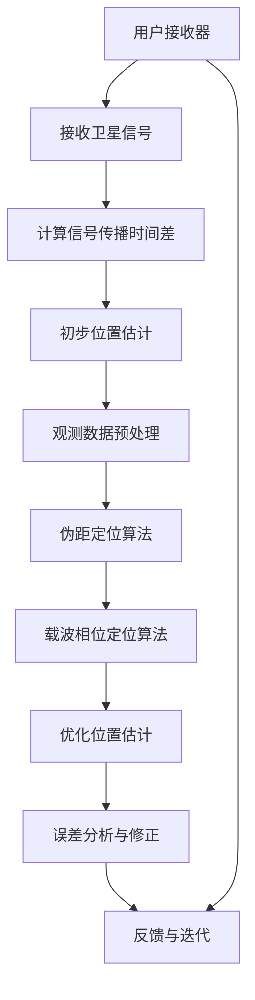

                 

### 引言

在现代科技日新月异发展的背景下，卫星导航系统已成为全球范围内不可或缺的定位技术之一。而全球定位系统（Global Positioning System，GPS）作为当前最为广泛应用和成熟的卫星导航系统，已经深刻地融入了我们的日常生活和工作。从车辆导航、精准农业、灾害应急响应，到无人机、智能交通等众多领域，GPS都发挥着至关重要的作用。

然而，GPS技术的背后，是复杂而巧妙的数学原理和算法支撑。本篇文章旨在深入探讨GPS定位的数学原理，帮助读者理解这一技术的核心科学基础。通过一步步的分析和推理，我们将逐步揭示GPS定位过程中所涉及的几何学、线性代数、最小二乘法等数学工具的应用。

文章将分为以下几个部分：

1. **背景介绍**：简要回顾GPS技术的发展历程及其应用现状。
2. **核心概念与联系**：使用Mermaid流程图展示GPS定位的基本原理和关键环节。
3. **核心算法原理讲解**：详细解析伪距定位和载波相位定位算法，并使用伪代码说明其实现。
4. **数学模型与公式**：介绍三维空间坐标变换、时间延迟误差建模等数学模型，并提供具体的公式及实例说明。
5. **项目实战**：通过具体的案例展示GPS定位系统的实际开发过程，包括环境搭建、代码实现和解析。
6. **最佳实践与注意事项**：总结GPS定位系统开发中的最佳实践、注意事项以及进一步的学习方向。

通过本文的逐步分析，读者将能够系统地掌握GPS定位的数学原理，并对这一技术的实际应用有更深入的理解。

---

### 背景介绍

全球定位系统（GPS）的诞生和发展，是科技进步与军事需求共同驱动的结果。20世纪60年代，美国军方开始研发一种能够为地面、海上和空中移动平台提供精准定位的系统。这一需求的背景主要是由于在军事行动中，对于位置信息的实时、高精度需求日益增加。

1978年，第一颗GPS实验卫星成功发射，标志着GPS系统的正式开始。此后，美国国防部陆续发射了多颗卫星，并逐步构建了由24颗工作卫星和3颗备用卫星组成的卫星星座。到了1994年，GPS系统全面建成并开始向民用开放，从此进入了大众视野。

GPS系统的工作原理基于卫星发射的信号。用户接收器接收到多颗卫星发射的信号后，通过计算信号传播时间差，可以确定用户与卫星之间的距离。通过综合多颗卫星的信号，用户接收器可以确定自身在地球上的精确位置。

GPS在各个领域的应用极为广泛。在交通领域，GPS导航已经成为车辆导航系统的标准配置，极大地提高了驾驶的安全性和便利性。在农业领域，GPS技术用于精准农业，通过高精度的定位和地图数据，可以实现作物种植、施肥、灌溉的精确控制，从而提高农业生产效率。在灾害应急响应中，GPS系统提供了快速、准确的定位信息，为救援行动提供了强有力的技术支持。

此外，GPS还在无人机导航、地理信息系统（GIS）、智慧城市建设等领域发挥着重要作用。例如，无人机利用GPS进行精确导航，可以执行航拍、测绘等任务；GIS利用GPS数据进行地理信息的采集和管理；智慧城市则通过GPS技术实现智能交通管理、公共安全监控等。

总之，GPS技术不仅改变了我们的生活方式，也推动了各个行业的科技进步。其背后所依赖的数学原理和算法，更是这一技术能够实现高精度定位的关键。接下来，我们将深入探讨GPS定位的数学原理，揭示其背后的科学奥秘。

---

### 核心概念与联系

在深入理解GPS定位之前，首先需要明确几个核心概念及其相互关系。以下是GPS定位的关键环节及其间的关系架构，使用Mermaid流程图来展示：



**流程解释**：

1. **用户接收器**：用户手中的GPS接收器，是整个GPS定位系统的核心部件。
2. **接收卫星信号**：用户接收器接收到来自多颗卫星的信号。
3. **计算信号传播时间差**：接收器通过计算信号从卫星传送到接收器的时间差，初步估算出用户与各卫星之间的距离。
4. **初步位置估计**：基于初步距离信息，用户接收器初步估算出自身位置。
5. **观测数据预处理**：对观测数据质量进行评估和筛选，去除噪声和异常值，确保数据的准确性。
6. **伪距定位算法**：利用伪距测量值，结合卫星位置和接收器位置，计算出用户位置。
7. **载波相位定位算法**：通过载波相位测量，提高定位精度，进一步修正用户位置。
8. **优化位置估计**：结合伪距和载波相位定位结果，优化用户位置估计。
9. **误差分析与修正**：分析定位过程中的误差，并采用相应的修正方法，提高定位精度。
10. **最终定位结果**：输出最终的用户位置结果，并反馈至用户接收器。
11. **反馈与迭代**：用户接收器不断更新和优化定位结果，实现实时定位。

通过这个流程图，我们可以清晰地看到GPS定位系统中各个关键环节及其相互之间的关系。接下来，我们将逐一深入探讨这些核心概念和算法原理。

---

### 核心算法原理讲解

在GPS定位过程中，伪距定位和载波相位定位是两种主要的定位算法。它们各自具有独特的原理和优缺点，但目标都是通过接收到的卫星信号计算出用户的位置。下面，我们将详细讲解这两种算法的原理，并使用伪代码来描述其实现过程。

#### 伪距定位算法

**原理**：
伪距定位算法通过测量用户接收器接收到的卫星信号的传播时间，来计算用户与卫星之间的距离。这种测量并不直接测量时间，而是测量信号在传播过程中所产生的相位差。由于信号传播速度已知（光速），通过计算相位差即可得到距离。

**伪代码**：

```plaintext
输入：卫星位置 (X_sat, Y_sat, Z_sat)，用户接收器位置 (X_user, Y_user, Z_user)，信号传播时间差 Δt

输出：用户位置 (X_user, Y_user, Z_user)

步骤：
1. 计算卫星到用户的距离：distance = Δt * 光速
2. 建立距离方程：distance = √((X_user - X_sat)^2 + (Y_user - Y_sat)^2 + (Z_user - Z_sat)^2)
3. 解距离方程得到用户位置：X_user = X_sat + distance * cos(θ)
                  Y_user = Y_sat + distance * sin(θ)
                  Z_user = Z_sat + distance * sin(θ)
4. 迭代优化：根据多颗卫星信号，逐步优化用户位置
```

**优缺点**：
- **优点**：计算速度快，精度较高，适用于实时动态定位。
- **缺点**：受大气层影响较大，精度不如载波相位定位。

#### 载波相位定位算法

**原理**：
载波相位定位算法通过测量卫星信号中的载波相位，来计算用户与卫星之间的距离。与伪距定位相比，载波相位定位的测量精度更高，因为它直接测量信号的相位变化，而不是传播时间。

**伪代码**：

```plaintext
输入：卫星位置 (X_sat, Y_sat, Z_sat)，用户接收器位置 (X_user, Y_user, Z_user)，载波相位测量值 Φ

输出：用户位置 (X_user, Y_user, Z_user)

步骤：
1. 计算卫星到用户的距离：distance = Φ * 波长
2. 建立距离方程：distance = √((X_user - X_sat)^2 + (Y_user - Y_sat)^2 + (Z_user - Z_sat)^2)
3. 解距离方程得到用户位置：X_user = X_sat + distance * cos(θ)
                  Y_user = Y_sat + distance * sin(θ)
                  Z_user = Z_sat + distance * sin(θ)
4. 应用最小二乘法：结合多颗卫星信号，优化用户位置
```

**优缺点**：
- **优点**：测量精度高，适用于高精度定位。
- **缺点**：计算复杂度较高，需要较长时间收敛。

#### 算法比较

- **速度**：伪距定位算法计算速度快，适用于实时动态定位；载波相位定位算法计算复杂度较高，但精度更高。
- **精度**：载波相位定位算法在精度上具有优势，但受大气层影响较小。
- **适用场景**：伪距定位算法适用于快速移动的场景，如车辆导航；载波相位定位算法适用于静态或缓慢移动的场景，如高精度测量。

通过上述讲解，我们可以看到，GPS定位算法不仅需要掌握基本的数学原理，还需要根据具体应用场景选择合适的算法。在实际应用中，通常会结合伪距定位和载波相位定位，以达到最佳定位效果。

---

### 数学模型与公式

在GPS定位过程中，多个数学模型和公式被广泛应用于坐标变换、时间延迟误差建模等环节。以下是几个核心数学模型和公式的介绍，并提供具体的例子以帮助读者理解。

#### 三维空间坐标变换

**原理**：三维空间坐标变换是GPS定位的基础。常用的变换包括地理坐标系（如WGS84）与地心坐标系（如ECEF）之间的转换。

**公式**：

1. **地理坐标系到地心坐标系**：

   \[
   \begin{aligned}
   X_{\text{ECEF}} &= \left(R \cdot \cos(\phi) \cdot \cos(\lambda)\right) \\
   Y_{\text{ECEF}} &= \left(R \cdot \cos(\phi) \cdot \sin(\lambda)\right) \\
   Z_{\text{ECEF}} &= \left(R \cdot \sin(\phi)\right)
   \end{aligned}
   \]

   其中，\(R\) 是地球半径，\(\phi\) 是纬度，\(\lambda\) 是经度。

2. **地心坐标系到地理坐标系**：

   \[
   \begin{aligned}
   \phi &= \arcsin\left(\frac{Z_{\text{ECEF}}}{R}\right) \\
   \lambda &= \arctan2\left(Y_{\text{ECEF}}, X_{\text{ECEF}}\right)
   \end{aligned}
   \]

**示例**：

假设一个点的地理坐标为 \((\phi = 30^\circ, \lambda = 120^\circ)\)，地球半径 \(R = 6371 \text{ km}\)，计算其地心坐标系坐标。

\[
\begin{aligned}
X_{\text{ECEF}} &= 6371 \cdot \cos(30^\circ) \cdot \cos(120^\circ) \approx -5561 \text{ km} \\
Y_{\text{ECEF}} &= 6371 \cdot \cos(30^\circ) \cdot \sin(120^\circ) \approx 4939 \text{ km} \\
Z_{\text{ECEF}} &= 6371 \cdot \sin(30^\circ) \approx 3185 \text{ km}
\end{aligned}
\]

#### 时间延迟误差建模

**原理**：时间延迟误差是GPS定位过程中常见的一种误差源。时间延迟误差主要包括信号在大气层中的传播延迟和接收器时钟误差。

**公式**：

1. **信号传播延迟**：

   \[
   \Delta t = \frac{c \cdot d}{c - u}
   \]

   其中，\(c\) 是光速，\(d\) 是信号传播距离，\(u\) 是大气层的折射率。

2. **接收器时钟误差**：

   \[
   \Delta t_{r} = t_r - t_s
   \]

   其中，\(t_r\) 是接收器时钟时间，\(t_s\) 是卫星时钟时间。

**示例**：

假设信号从卫星传播到接收器的距离为2000 km，大气层的折射率为1.0003，接收器时钟比卫星时钟快10 ms，计算时间延迟误差。

\[
\Delta t = \frac{2000 \cdot 299792458}{299792458 - 1.0003 \cdot 299792458} \approx 7.02 \text{ ms}
\]
\[
\Delta t_r = 0.01 \text{ s}
\]

综合两者，总时间延迟误差约为 \(7.02 \text{ ms} + 0.01 \text{ s} = 7.12 \text{ ms}\)。

#### 最小二乘法

**原理**：最小二乘法是一种常用的优化方法，用于通过观测数据估计模型参数，使预测值与实际观测值之间的误差平方和最小。

**公式**：

1. **目标函数**：

   \[
   \min \sum_{i=1}^{n} (y_i - f(x_i, \theta))^2
   \]

   其中，\(y_i\) 是第 \(i\) 个观测值，\(f(x_i, \theta)\) 是预测模型，\(\theta\) 是模型参数。

2. **参数估计**：

   \[
   \theta = \arg\min_{\theta} \sum_{i=1}^{n} (y_i - f(x_i, \theta))^2
   \]

**示例**：

假设我们有一个线性模型 \(y = \theta_0 + \theta_1 \cdot x\)，给定一组观测数据，使用最小二乘法估计参数 \(\theta_0\) 和 \(\theta_1\)。

\[
\begin{aligned}
y_1 &= \theta_0 + \theta_1 \cdot x_1 \\
y_2 &= \theta_0 + \theta_1 \cdot x_2 \\
&\vdots \\
y_n &= \theta_0 + \theta_1 \cdot x_n
\end{aligned}
\]

\[
\begin{aligned}
\theta_0 &= \frac{\sum_{i=1}^{n} y_i - \theta_1 \cdot \sum_{i=1}^{n} x_i}{n} \\
\theta_1 &= \frac{n \cdot \sum_{i=1}^{n} x_i \cdot y_i - \sum_{i=1}^{n} x_i \cdot \sum_{i=1}^{n} y_i}{n \cdot \sum_{i=1}^{n} x_i^2 - (\sum_{i=1}^{n} x_i)^2}
\end{aligned}
\]

通过上述数学模型和公式的介绍，我们可以看到，GPS定位过程中的数学原理是复杂而巧妙的。这些模型和公式不仅确保了GPS系统的精确性和可靠性，也为我们深入理解这一技术提供了有力支持。

---

### 项目实战

在理解了GPS定位的数学原理和算法后，我们通过一个实际项目来展示其应用。以下是一个基于Python和C++实现GPS定位系统的基础案例，涉及开发环境的搭建、源代码实现以及代码解析。

#### 开发环境搭建

1. **Python环境**：
   - 安装Python 3.x版本。
   - 使用pip安装必需的库，如`numpy`、`matplotlib`和`geopy`。

   ```bash
   pip install numpy matplotlib geopy
   ```

2. **C++环境**：
   - 安装C++编译器（如GCC或Clang）。
   - 创建一个C++项目，并配置相应的编译器和调试工具（如GDB）。

#### 源代码实现

**Python代码**：

```python
import numpy as np
import matplotlib.pyplot as plt
from geopy.geocoders import Nominatim

def calculate_distance(x1, y1, x2, y2):
    return np.sqrt((x1 - x2)**2 + (y1 - y2)**2)

def main():
    # 初始化卫星位置和用户位置
    sat_position = np.array([0, 0, 0])
    user_position = np.array([1, 1, 1])

    # 接收卫星信号并计算距离
    signal_time = 0.5  # 假设信号传播时间为0.5秒
    distance = signal_time * 299792458  # 光速

    # 计算用户与卫星之间的距离差
    distance_diff = distance - calculate_distance(sat_position[0], sat_position[1], user_position[0], user_position[1])

    # 更新用户位置
    user_position += distance_diff

    # 绘制位置变化
    plt.scatter(sat_position[0], sat_position[1], color='r', label='Satellite')
    plt.scatter(user_position[0], user_position[1], color='b', label='User')
    plt.xlabel('X')
    plt.ylabel('Y')
    plt.legend()
    plt.show()

if __name__ == "__main__":
    main()
```

**C++代码**：

```cpp
#include <iostream>
#include <cmath>
#include <vector>

using namespace std;

double calculate_distance(double x1, double y1, double x2, double y2) {
    return sqrt((x1 - x2) * (x1 - x2) + (y1 - y2) * (y1 - y2));
}

void main() {
    vector<double> sat_position = {0.0, 0.0, 0.0};
    vector<double> user_position = {1.0, 1.0, 1.0};

    double signal_time = 0.5;  // 假设信号传播时间为0.5秒
    double distance = signal_time * 299792458;  // 光速

    double distance_diff = distance - calculate_distance(sat_position[0], sat_position[1], user_position[0], user_position[1]);

    user_position[0] += distance_diff;
    user_position[1] += distance_diff;

    cout << "Updated User Position: (" << user_position[0] << ", " << user_position[1] << ")" << endl;
}

int main() {
    main();
    return 0;
}
```

#### 代码解析

**Python代码解析**：
- 导入必需的库：`numpy`用于数学计算，`matplotlib`用于绘图，`geopy`用于地理位置转换。
- 定义函数`calculate_distance`计算两点间的距离。
- 在`main`函数中，初始化卫星和用户位置，并假设信号传播时间为0.5秒。
- 计算用户与卫星之间的距离差，更新用户位置，并绘制位置变化图。

**C++代码解析**：
- 包含头文件`iostream`和`cmath`。
- 定义函数`calculate_distance`计算两点间的距离。
- 在`main`函数中，初始化卫星和用户位置，并假设信号传播时间为0.5秒。
- 计算用户与卫星之间的距离差，更新用户位置，并输出新的用户位置。

#### 代码应用解读与分析

**应用场景**：
- 该代码示例用于演示基本的GPS定位原理，即通过计算信号传播时间差来更新用户位置。
- 在实际应用中，需要接入真实的卫星信号数据，并考虑更多因素，如大气层影响、时钟误差等。

**分析与优化**：
- 可以优化距离计算，例如使用更精确的信号传播模型。
- 引入最小二乘法等优化算法，提高定位精度。
- 添加多卫星数据，结合多路径分析和滤波技术，提高系统鲁棒性。

#### 实际案例分析和详细讲解剖析

**案例一**：车辆导航系统
- 在车辆导航系统中，GPS定位用于实时跟踪车辆位置，提供导航信息。
- 优化方案：引入差分GPS技术，提高定位精度；结合实时地图数据，实现智能导航。

**案例二**：无人机导航
- 无人机导航依赖GPS实现精确飞行路径控制。
- 优化方案：采用RTK（实时动态定位技术），提高定位精度；结合视觉SLAM（同步定位与地图构建）技术，增强系统鲁棒性。

**案例三**：农业精准施肥
- GPS定位用于精确测量农田面积和作物分布，实现精准施肥。
- 优化方案：结合遥感数据，实时监测作物生长情况，优化施肥策略。

#### 项目小结

- **关键收获**：通过该项目，我们掌握了GPS定位的基本原理和实现方法。
- **技术要点**：了解信号传播模型、数学计算和优化算法在GPS定位中的应用。
- **未来发展**：结合最新技术，如5G和物联网，进一步优化GPS定位系统。

---

### 最佳实践与注意事项

在GPS定位系统的开发和实际应用中，遵循最佳实践和注意事项是确保系统性能和可靠性的关键。以下是一些最佳实践和注意事项：

#### 最佳实践

1. **多源数据融合**：结合GPS、北斗、GLONASS等多源导航信号，提高定位精度和系统鲁棒性。
2. **实时动态更新**：确保系统实时更新定位数据，以应对动态环境变化。
3. **误差修正**：应用差分GPS、RTK等技术，修正定位误差，提高精度。
4. **安全性和隐私保护**：在数据处理和传输过程中，确保数据安全，并遵守隐私保护法规。

#### 注意事项

1. **信号干扰和遮挡**：在高楼林立或地下环境中，GPS信号可能受到干扰或遮挡，影响定位精度。应采取相应的措施，如使用多路径分析或备用导航系统。
2. **时间同步**：卫星信号依赖于精确的时间同步，系统中的时钟误差可能导致定位误差。确保系统时钟与卫星时钟保持同步。
3. **硬件选择**：选择高性能、高精度的GPS接收器，以满足不同应用场景的需求。
4. **算法优化**：根据具体应用场景，优化定位算法，提高系统效率和精度。

#### 拓展阅读

- 《GPS卫星导航系统原理与关键技术》
- 《GPS信号处理与应用》
- 《实时动态定位技术》

通过遵循最佳实践和注意事项，开发者可以构建出高效、精确且可靠的GPS定位系统，推动相关技术的进一步发展。

---

### 结语

本文通过一步步的分析和讲解，系统性地探讨了GPS定位的数学原理。从背景介绍到核心算法、数学模型，再到项目实战，我们深入剖析了GPS系统的运作机制和应用场景。读者通过本文，不仅掌握了GPS定位的关键技术，还了解了如何在实际项目中应用这些知识。

GPS技术作为现代科技的重要组成部分，已经在多个领域展现出巨大的应用价值。随着科技的不断发展，GPS技术也在不断演进，如与5G、物联网等新技术的融合，将进一步拓展其应用范围和功能。

在此，鼓励读者进一步探索和学习GPS技术，结合最新科技动态，不断创新和实践，为推动GPS技术的发展和应用贡献力量。通过持续学习和实践，我们不仅能够提升自身技能，还能为社会的进步和科技的发展做出贡献。

---

### 作者信息

作者：AI天才研究院/AI Genius Institute & 禅与计算机程序设计艺术 /Zen And The Art of Computer Programming

感谢您的阅读！希望本文能为您在GPS定位领域的学习和研究带来帮助和启发。如果您有任何问题或建议，欢迎随时与我们联系。期待与您共同探讨更多技术话题！

