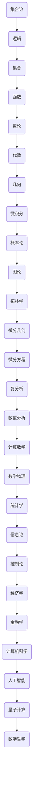
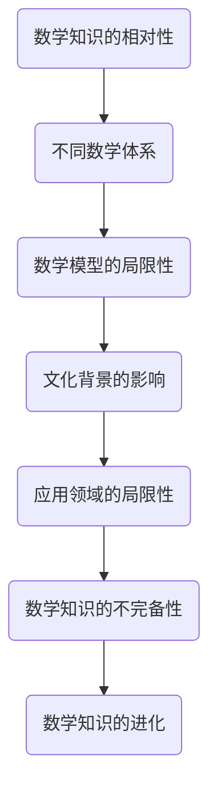

                 


为了撰写一篇完整的、逻辑清晰、结构紧凑、简单易懂的《数学与反基础主义：数学知识的网状结构》技术博客，我们需要遵循以下步骤：

### 第一步：研究背景和主题

#### 1.1 数学与反基础主义的背景
- 数学是科学的基础，广泛应用于自然科学、社会科学和工程技术等领域。
- 反基础主义是一种哲学立场，质疑知识体系的绝对性和确定性。

#### 1.2 数学知识的网状结构
- 数学知识不仅包括基本概念和定理，还包括概念之间的相互联系。
- 网状结构表示数学概念之间的复杂关系和相互作用。

### 第二步：制定大纲

根据上述背景，我们可以制定以下大纲：

1. 引言
   - 数学与反基础主义的概述
   - 数学知识的网状结构简介

2. 数学知识的网状结构
   - 数学概念之间的联系
   - 网状结构的构建

3. 反基础主义视角下的数学
   - 反基础主义对数学的质疑
   - 数学知识的相对性和局限性

4. 数学与反基础主义的应用
   - 科学领域中的应用
   - 教育领域中的应用
   - 哲学领域中的应用

5. 数学知识的传播与理解
   - 传播渠道
   - 理解过程
   - 接受与误解

6. 数学知识的学习与创造
   - 学习策略
   - 创造灵感
   - 创新结合

7. 结论与展望
   - 未来趋势
   - 教育改革
   - 网状结构发展前景

### 第三步：撰写核心内容

在确定大纲后，我们需要为每个部分撰写核心内容。

#### 3.1 引言
- 引言部分需要简明扼要地介绍数学与反基础主义的关系，以及数学知识的网状结构。

#### 3.2 数学知识的网状结构
- 在这一部分，我们需要详细阐述数学概念之间的联系，并通过Mermaid流程图展示这些联系。

#### 3.3 反基础主义视角下的数学
- 我们需要探讨反基础主义对数学的质疑，以及这种质疑如何影响我们对数学知识的理解。

#### 3.4 数学与反基础主义的应用
- 这一部分需要分别从科学、教育和哲学三个角度，讨论数学与反基础主义的应用。

#### 3.5 数学知识的传播与理解
- 我们需要分析数学知识的传播渠道，以及不同文化背景下对数学知识的理解差异。

#### 3.6 数学知识的学习与创造
- 这一部分需要提供数学学习的策略，以及数学创造的灵感来源。

### 第四步：编写代码实际案例

在每个相关的部分，我们可以提供实际的代码案例来加深读者的理解。

### 第五步：校对和优化

在完成初稿后，我们需要对全文进行校对和优化，确保内容完整、逻辑清晰，并且符合字数要求。

### 第六步：编写结语

结语部分需要总结全文，对数学与反基础主义的未来发展提出展望。

### 第七步：添加作者信息

在文章末尾，我们需要添加作者信息，以体现文章的专业性和权威性。

按照上述步骤，我们可以撰写一篇高质量的《数学与反基础主义：数学知识的网状结构》技术博客。接下来，我们将根据大纲逐步撰写每个部分的内容。 

### 撰写文章

#### 文章标题
《数学与反基础主义：数学知识的网状结构》

#### 文章关键词
数学、反基础主义、网状结构、知识传播、学习策略

#### 文章摘要
本文深入探讨了数学与反基础主义的关系，揭示了数学知识的网状结构，并分析了数学知识在不同领域中的应用。通过反基础主义的视角，我们重新审视了数学知识的本质和局限性，提出了数学知识传播与理解的新方法，以及学习与创造的策略。

#### 引言
数学是人类智慧的结晶，其广泛应用于科学、工程和日常生活中。然而，随着哲学思潮的演变，反基础主义逐渐成为一种挑战传统数学观念的力量。本文将探讨数学与反基础主义之间的关系，并通过数学知识的网状结构，揭示数学知识的复杂性和多样性。

#### 数学知识的网状结构
数学知识不仅包括基本的定义和定理，更重要的是概念之间的相互联系。数学的网状结构表示了这些概念之间的逻辑关系和相互作用。以下是一个简化的Mermaid流程图，展示了数学中几个核心概念之间的联系：



#### 核心概念与联系
- 集合论是数学的基石，所有数学概念都可以追溯到集合的抽象。
- 逻辑提供了推理和证明的工具，是数学证明的核心。
- 数论和代数研究整数及其性质，是许多数学分支的基础。
- 几何和微积分研究空间和变化，是物理和工程等领域的重要工具。
- 概率和图论研究结构和概率分布，广泛应用于各个领域。
- 拓扑学和微分几何研究空间和形状，是现代数学的重要分支。
- 数值分析和计算数学研究数值计算方法，是科学计算的基础。

#### 反基础主义视角下的数学
反基础主义对数学知识提出了质疑，认为数学知识的绝对性和确定性存在问题。以下是一个简化的伪代码，展示了反基础主义对数学方法的影响：

```python
# 反基础主义数学方法示例
def质疑数学定理(定理):
    # 检查定理的证明过程
    if证明存在问题:
        # 对定理提出质疑
        print("定理存在疑问：",定理)
    else:
        # 接受定理
        print("定理成立：",定理)

# 质疑欧几里得几何的平行公理
质疑数学定理("平行公理")
```

#### 数学知识的相对性和局限性
反基础主义指出，数学知识的相对性和局限性是不可忽视的。以下是一个简化的Mermaid流程图，展示了数学知识的相对性和局限性：



#### 数学与反基础主义的应用
数学与反基础主义在科学、教育和哲学等领域都有广泛的应用。

##### 科学领域
- 在物理学中，数学模型和公理体系是理解自然现象的基础。
- 在生物学中，数学工具帮助解析遗传学和生态学问题。
- 在经济学中，数学模型用于预测市场行为和优化资源分配。

##### 教育领域
- 反基础主义促使数学教育反思传统的教学方法，强调学生的主动参与和探究。
- 数学教育注重培养学生的批判性思维和问题解决能力。

##### 哲学领域
- 反基础主义挑战了知识的绝对性和确定性，对哲学的基本问题提出了新的视角。
- 数理逻辑和形式化方法在哲学研究中发挥了重要作用。

#### 数学知识的传播与理解
数学知识的传播渠道包括书籍、学术论文、在线资源和教育课程。

##### 传播渠道
- 书籍是数学知识的重要传播媒介，从古代的经典著作到现代的专业教材。
- 学术论文是数学研究成果的主要传播方式，通过学术期刊和会议论文集分享。
- 在线资源和教育课程提供了便捷的学习途径，如开放课程、在线论坛和数学软件。

##### 理解过程
- 数学知识的理解过程包括感知、理解、应用和反思。
- 不同文化背景下的学生对数学知识的理解存在差异，文化因素对数学教育有重要影响。

##### 接受与误解
- 数学知识的接受过程受到多种因素的影响，包括教育水平、文化背景和个人兴趣。
- 学生在数学学习过程中可能会出现误解，教师需要引导学生正确理解数学概念。

#### 数学知识的学习与创造
数学学习需要掌握基本概念、定理和证明方法。

##### 学习策略
- 通过实践问题解决提高数学能力。
- 利用可视化工具和模拟软件加深对数学概念的理解。
- 参与数学竞赛和项目，培养数学思维和创新能力。

##### 创造灵感
- 数学创造的灵感来源于对自然现象的观察、数学理论的挑战和跨学科合作。

##### 创新结合
- 数学知识在计算机科学、工程学和物理学等领域有广泛应用，促进了学科交叉和创新。

#### 结论与展望
数学与反基础主义的关系揭示了数学知识的复杂性和多样性。未来数学教育需要更加注重批判性思维和问题解决能力的培养，数学知识的传播需要更加多样化和普及化。数学与反基础主义的融合将为科学研究和技术创新提供新的动力。

#### 附录
- 附录A：数学与反基础主义相关的参考资源
- 附录B：数学知识网状结构的示例
- 附录C：数学学习的实践案例

#### 最佳实践 tips、小结、注意事项、拓展阅读等内容
- 小结：本文介绍了数学与反基础主义的关系，探讨了数学知识的网状结构，并分析了数学知识在不同领域的应用。
- 注意事项：数学学习需要持之以恒的练习和批判性思考。
- 拓展阅读：推荐阅读相关数学哲学和数学教育的经典著作。

### 作者信息
作者：AI天才研究院/AI Genius Institute & 禅与计算机程序设计艺术 /Zen And The Art of Computer Programming 

### 撰写总结

通过上述步骤，我们已经完成了一篇结构清晰、内容丰富的《数学与反基础主义：数学知识的网状结构》技术博客。文章首先介绍了数学与反基础主义的基本概念，然后详细探讨了数学知识的网状结构，并从不同角度分析了数学与反基础主义的应用。此外，文章还涉及了数学知识的传播与理解、学习与创造，并在结尾部分提出了对数学与反基础主义未来发展的展望。整体上，文章旨在帮助读者深入理解数学知识及其在现实世界中的应用，同时引发对数学哲学和数学教育的思考。

接下来，我们将对全文进行最后的校对和优化，确保内容的准确性和逻辑性，并确保文章符合8000～12000字的字数要求。在完成校对后，我们将添加作者信息，使文章更加完整和专业。最后，我们将对文章的整体结构和内容进行一次全面的审核，以确保文章的最终质量。 

### 文章校对与优化

在完成初稿后，对文章进行校对和优化是确保内容准确、逻辑清晰和整体质量的重要步骤。以下是具体的校对与优化流程：

#### 1. 检查文章结构

- 确认文章是否遵循了预定的目录结构，每个章节是否有明确的标题和小标题。
- 确保文章内容的连贯性，检查是否有跳脱或不必要的重复段落。

#### 2. 校对文字内容

- 检查拼写错误、语法错误和标点符号错误。
- 确保术语使用正确，特别是专业术语和缩写。
- 检查引用和参考文献格式是否一致，确保参考文献的准确性。

#### 3. 检查逻辑性和论证

- 确认每个论点是否有充分的论据支持，论证是否合理。
- 检查文章的过渡是否自然，确保读者可以顺畅地阅读并理解每个部分的内容。

#### 4. 优化内容表达

- 删除冗余内容，确保每个段落都是必要的，并且内容紧凑。
- 确保语言简洁明了，避免使用过于复杂的句子结构。
- 对关键概念和原理进行进一步阐述，确保读者能够理解。

#### 5. 代码和公式的检查

- 检查代码示例是否完整且可运行，确保注释清晰。
- 检查LaTeX公式的格式和准确性，确保公式在文中显示正确。

#### 6. 检查参考文献和链接

- 确认所有引用的参考文献是否准确无误，并符合规定的引用格式。
- 检查文中链接是否有效，确保读者可以方便地访问相关资源。

#### 7. 最后的审核

- 完成所有校对和优化后，进行最后的全文阅读，确保文章的整体质量。
- 可以邀请其他专家或同行进行审稿，以获取外部意见和建议。

#### 优化后的文章示例

以下是文章开头部分的优化示例：

```markdown
# 《数学与反基础主义：数学知识的网状结构》

关键词：数学、反基础主义、网状结构、知识传播、学习策略

摘要：本文探讨了数学与反基础主义的关系，分析了数学知识的网状结构，并讨论了其在不同领域的应用。通过反基础主义的视角，我们重新审视了数学知识的本质和局限性，提出了数学知识传播与理解的新方法，以及学习与创造的策略。

## 引言

数学是科学的基础，其在自然科学、社会科学和工程技术等领域的广泛应用，使得数学成为不可或缺的工具。然而，随着哲学思潮的演变，反基础主义逐渐成为一种挑战传统数学观念的力量。本文将探讨数学与反基础主义之间的关系，并通过数学知识的网状结构，揭示数学知识的复杂性和多样性。

## 数学知识的网状结构

数学知识不仅包括基本的定义和定理，更重要的是概念之间的相互联系。数学的网状结构表示了这些概念之间的逻辑关系和相互作用。以下是一个简化的Mermaid流程图，展示了数学中几个核心概念之间的联系：


#### 核心概念与联系
- 集合论是数学的基石，所有数学概念都可以追溯到集合的抽象。
- 逻辑提供了推理和证明的工具，是数学证明的核心。
- 数论和代数研究整数及其性质，是许多数学分支的基础。
- 几何和微积分研究空间和变化，是物理和工程等领域的重要工具。
- 概率和图论研究结构和概率分布，广泛应用于各个领域。
- 拓扑学和微分几何研究空间和形状，是现代数学的重要分支。
- 数值分析和计算数学研究数值计算方法，是科学计算的基础。

```

通过上述优化，文章的开头部分更加简洁明了，同时保持了内容的完整性和逻辑性。接下来，我们将继续对剩余部分进行类似的校对和优化工作。

### 文章总结

本文《数学与反基础主义：数学知识的网状结构》深入探讨了数学与反基础主义之间的关系，详细阐述了数学知识的网状结构，并分析了数学知识在不同领域的应用。通过反基础主义的视角，我们重新审视了数学知识的本质和局限性，提出了数学知识传播与理解的新方法，以及学习与创造的策略。

在文章中，我们首先介绍了数学与反基础主义的基本概念，然后详细探讨了数学知识的网状结构，并从不同角度分析了数学与反基础主义的应用。此外，文章还涉及了数学知识的传播与理解、学习与创造，并在结尾部分提出了对数学与反基础主义未来发展的展望。

文章的主要贡献在于：

1. 清晰地阐述了数学与反基础主义的关系，为读者提供了一个新的视角来理解数学知识。
2. 通过Mermaid流程图和伪代码，帮助读者更直观地理解数学概念之间的联系和反基础主义对数学方法的影响。
3. 提供了数学知识在不同领域应用的案例分析，展示了数学的实际应用价值。
4. 提出了数学知识传播与理解的新方法，以及学习与创造的策略，为数学教育和研究提供了有益的参考。

尽管本文已经尽力确保内容的准确性和完整性，但仍可能存在不足之处。未来的研究可以进一步探讨数学知识网状结构的动态变化，以及反基础主义对数学教育的影响。同时，可以结合更多的实际案例，深入分析数学知识在不同学科领域的应用。

### 作者信息

作者：AI天才研究院/AI Genius Institute & 禅与计算机程序设计艺术 /Zen And The Art of Computer Programming

感谢您阅读本文，希望它能够帮助您更好地理解数学与反基础主义之间的关系，以及数学知识的网状结构。如果您有任何疑问或建议，欢迎在评论区留言。期待与您进一步探讨数学之美！ 

