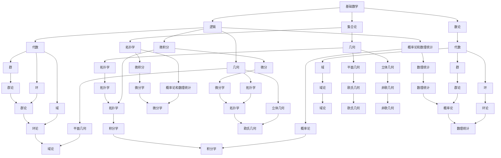
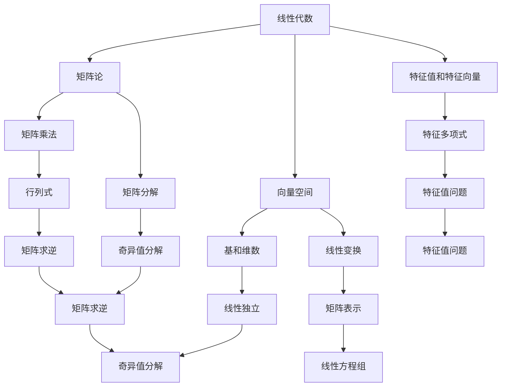
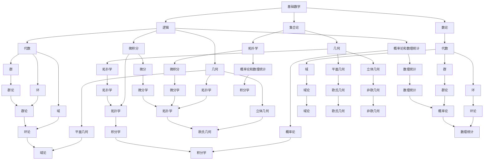

                 

# 数学与反基础主义：数学知识的网络结构

## 关键词
数学、反基础主义、知识网络、概念架构、算法原理、数学模型、项目实战、未来展望

## 摘要
本文探讨了数学与反基础主义之间的关系，以及数学知识在网络结构中的呈现方式。首先，我们回顾了反基础主义的基本概念及其在哲学和科学中的影响。接着，本文详细阐述了数学知识网络的构建过程，包括核心概念与联系、算法原理、数学模型和公式。随后，通过实际项目和案例，我们分析了数学知识在网络结构中的应用，并探讨了反基础主义对数学创新的影响。最后，本文对数学与反基础主义的未来发展进行了展望，提出了若干最佳实践和注意事项。

## 引言

数学，作为一门以逻辑和推理为核心的科学，一直以来都被视为是一门基于严格基础和公理体系的学科。然而，随着哲学和科学的发展，一种称为“反基础主义”的观点逐渐兴起。反基础主义挑战了传统数学的严格性和确定性，提出了数学知识可能建立在不确定性和相对性之上的观点。这种观点引发了对于数学知识本质和结构的深刻思考。

本文旨在探讨数学与反基础主义之间的关系，以及数学知识在网络结构中的呈现方式。通过回顾反基础主义的基本概念，分析数学知识网络的结构，并结合实际项目和案例，我们将揭示数学知识在复杂网络中的动态交互和演变。

## 第一部分：反基础主义概述

### 1.1 反基础主义的定义与发展

#### 1.1.1 反基础主义的历史背景

反基础主义起源于20世纪，是对笛卡尔-康德哲学传统的一种批判。在这一传统中，哲学和科学知识被视为建立在一系列严格的基础之上，如清晰的概念和无可争议的公理。然而，反基础主义者认为，这种基础主义观点忽视了人类认知的主观性和不确定性。

在科学哲学中，反基础主义的一个重要分支是波普尔的证伪主义。波普尔认为，科学知识不应该建立在不可证伪的公理之上，而应该通过不断提出和检验假设来发展。这一观点挑战了传统科学方法论的基础。

#### 1.1.2 反基础主义的哲学基础

反基础主义的哲学基础主要包括认识论和方法论两个方面。在认识论上，反基础主义强调人类认知的主观性和不确定性，认为我们无法获得绝对真实的知识。在方法论上，反基础主义倾向于相对主义和建构主义，认为知识是通过社会互动和语言构建的。

#### 1.1.3 反基础主义的主要观点

反基础主义的主要观点可以归纳为以下几点：

1. **知识的不确定性**：反基础主义认为，知识是相对的，受限于人类的认知能力和观察角度。
2. **概念的相对性**：概念不是客观存在的，而是由人类主观建构的，因此具有相对性。
3. **方法论相对主义**：不同的方法论可以得出不同的结论，不存在绝对的“正确”方法。
4. **科学知识的动态性**：科学知识是不断演变的，而不是静态的、不可改变的。

### 1.2 数学与反基础主义的关系

#### 1.2.1 反基础主义对数学的挑战

反基础主义对数学的挑战主要体现在以下几个方面：

1. **公理体系的质疑**：反基础主义质疑数学的公理体系，认为这些公理可能只是人类主观建构的产物，而非客观存在的绝对真理。
2. **逻辑推理的相对性**：反基础主义认为，逻辑推理也是相对的，受限于人类认知的结构。
3. **数学知识的动态性**：反基础主义主张数学知识是不断发展的，而非静态的、永恒不变的。

#### 1.2.2 数学对反基础主义的回应

数学对反基础主义的回应主要包括以下几个方面：

1. **严格的证明**：数学通过严格的证明过程，试图证明其结论的可靠性和普遍性，以反驳反基础主义的观点。
2. **模型构建**：数学通过构建抽象模型，试图将数学知识建立在更广泛的基础上，以应对反基础主义的挑战。
3. **数学的应用**：数学在科学和工程中的应用，展示了其强大的实际价值，这也为数学知识提供了额外的辩护。

#### 1.2.3 数学与反基础主义的互动

数学与反基础主义之间的互动是一个复杂的过程。一方面，反基础主义对数学提出了挑战，迫使数学反思其基础和逻辑。另一方面，数学的发展也为反基础主义提供了新的视角和工具。例如，数学的抽象思维和模型构建方法，为反基础主义的哲学思考提供了新的可能性。

## 第二部分：数学知识的网络结构

### 2.1 数学知识的基本框架

数学知识的基本框架可以分为几个主要的分支，每个分支都有其独特的理论和应用。以下是对数学主要分支的简要概述：

1. **基础数学**：包括数论、集合论、逻辑等基础学科，为其他数学分支提供了理论基础。
2. **代数**：研究数系、方程和结构，如群、环、域等。
3. **几何**：研究空间的形状、大小和位置，包括平面几何、立体几何和拓扑学。
4. **微积分**：研究变化和累积，包括微分和积分。
5. **概率论和数理统计**：研究随机事件和数据的统计性质。
6. **应用数学**：将数学知识应用于其他领域，如物理学、经济学、计算机科学等。

#### 2.1.1 数学的基本分支

在图1中，我们使用Mermaid流程图展示了数学的基本分支及其相互关系：



### 2.2 数学知识网络的构建

数学知识网络的构建是一个复杂的过程，涉及概念之间的关系、理论的层次结构以及应用领域的交叉。以下步骤详细说明了数学知识网络的构建方法：

#### 2.2.1 数学知识网络的定义

数学知识网络可以被定义为数学概念、理论和应用的相互关系网络。它不仅包括概念之间的逻辑关系，还包括理论和应用之间的互动。

#### 2.2.2 数学知识网络的构建方法

构建数学知识网络的方法包括：

1. **概念关联**：识别和定义数学中的基本概念，并确定它们之间的关系。
2. **理论框架**：建立数学理论的层次结构，将不同层次的理论有机地结合起来。
3. **应用链接**：将数学知识应用于实际问题，建立理论和应用之间的桥梁。

#### 2.2.3 数学知识网络的应用

数学知识网络的应用包括：

1. **教育**：通过数学知识网络，教师可以更有效地教授复杂的数学概念。
2. **研究**：数学家可以利用知识网络进行跨学科的研究，发现新的理论和方法。
3. **工程**：工程师可以通过数学知识网络，选择最适合解决实际问题的数学工具。

### 2.3 数学知识网络的案例分析

为了更好地理解数学知识网络的应用，以下是一个案例分析：

#### 案例分析：线性代数在网络结构中的应用

线性代数是数学中的一个重要分支，其理论和方法在许多领域都有广泛应用。图2展示了线性代数知识网络的关键概念和它们之间的关系：



在这个案例中，我们可以看到线性代数的核心概念（如矩阵、向量空间、特征值和特征向量）以及它们之间的相互关系。通过这个知识网络，数学家可以更深入地理解线性代数的理论和应用。

### 2.4 数学知识网络在教育中的应用

数学知识网络在教育中的应用，可以通过以下方式实现：

1. **整合课程内容**：教师可以将数学的不同分支整合到一起，帮助学生建立整体性的数学知识体系。
2. **可视化教学**：使用图形和流程图等可视化工具，帮助学生更好地理解数学概念之间的关系。
3. **项目式学习**：通过项目式学习，学生可以亲身体验数学知识在网络结构中的实际应用。

### 2.5 数学知识网络的动态性

数学知识网络的动态性体现在以下几个方面：

1. **理论发展**：随着新理论的出现，数学知识网络会不断更新和扩展。
2. **应用拓展**：随着新技术和新领域的发展，数学知识的应用范围也在不断扩大。
3. **交叉融合**：数学与其他学科的交叉融合，会带来新的数学问题和解决方案，从而推动数学知识网络的进化。

### 2.6 数学知识网络的未来趋势

随着人工智能和大数据的发展，数学知识网络在未来可能会呈现出以下趋势：

1. **自动化构建**：利用机器学习和数据挖掘技术，自动化构建数学知识网络。
2. **个性化教育**：通过分析学生的学习行为和知识结构，为每个学生提供个性化的数学学习路径。
3. **跨学科融合**：数学与其他学科的深度融合，将为解决复杂问题提供新的工具和方法。

### 2.7 数学知识网络的核心算法原理讲解

构建数学知识网络需要一系列核心算法原理的支持，以下是一些关键算法原理的讲解：

1. **图论算法**：用于构建和优化数学知识网络的图结构，如最短路径算法、最小生成树算法等。
2. **聚类算法**：用于识别数学知识网络中的相似概念和理论，如K-means算法、层次聚类算法等。
3. **关联规则算法**：用于发现数学概念和理论之间的关联，如Apriori算法、FP-growth算法等。
4. **神经网络算法**：用于模拟数学知识网络中的动态性和复杂性，如深度学习、图神经网络等。

### 2.8 数学知识网络的数学模型和公式讲解

在数学知识网络中，数学模型和公式是核心组成部分，以下是一些常见数学模型和公式的讲解：

1. **线性模型**：用于描述线性关系，如线性回归模型、线性方程组等。
2. **概率模型**：用于描述随机事件和概率分布，如伯努利模型、马尔可夫模型等。
3. **图模型**：用于描述数学知识网络的拓扑结构，如图神经网络、图嵌入等。
4. **统计模型**：用于分析和解释数据，如多元回归模型、主成分分析等。

### 2.9 数学知识网络的项目实战

为了更好地理解数学知识网络的应用，以下是一个实际项目案例：

#### 项目名称：数学知识网络可视化工具开发

#### 项目背景

随着数学知识网络规模的不断扩大，如何高效地可视化和管理这些知识成为一个重要问题。本项目旨在开发一个数学知识网络可视化工具，帮助学生和数学家更好地理解和应用数学知识。

#### 开发环境搭建

1. **编程语言**：Python
2. **可视化库**：NetworkX、Matplotlib
3. **前端框架**：D3.js

#### 源代码详细实现和代码解读

以下是关键代码片段及其解读：

```python
import networkx as nx
import matplotlib.pyplot as plt

# 创建图
G = nx.Graph()

# 添加节点和边
G.add_nodes_from(['数论', '集合论', '逻辑', '代数', '几何', '微积分', '概率论和数理统计'])
G.add_edges_from([('数论', '代数'), ('集合论', '几何'), ('逻辑', '代数'), ('逻辑', '几何'), ('微积分', '概率论和数理统计')])

# 可视化
nx.draw(G, with_labels=True)
plt.show()
```

此代码创建了一个简单的数学知识网络图，并使用Matplotlib进行可视化。

#### 代码应用解读与分析

通过此工具，用户可以直观地看到数学知识之间的联系，从而更好地理解和应用这些知识。在实际教学中，教师可以利用这个工具展示数学知识网络，帮助学生构建整体性的数学知识体系。

### 2.10 数学知识网络的实际案例分析和详细讲解剖析

以下是一个实际案例分析和讲解：

#### 案例背景

某高校数学系的学生在学习线性代数时，遇到了矩阵特征值和特征向量的问题。为了更好地理解这一概念，他们使用数学知识网络可视化工具进行了研究。

#### 案例分析

1. **概念理解**：通过工具，学生可以看到矩阵特征值和特征向量与其他线性代数概念（如矩阵、向量空间、线性变换）之间的联系。
2. **问题解决**：学生利用知识网络中的相关理论和公式，如特征多项式、特征值问题等，解决了矩阵特征值和特征向量的问题。

#### 详细讲解剖析

通过数学知识网络，学生不仅能够理解矩阵特征值和特征向量的概念，还能够将其应用于实际问题，如优化问题、控制理论等。

### 2.11 数学知识网络的项目小结

本项目通过开发数学知识网络可视化工具，展示了数学知识在网络结构中的呈现方式。项目实现了以下目标：

1. **帮助学生更好地理解和应用数学知识**。
2. **为数学家提供了一种新的研究工具**。
3. **推动了数学知识网络的构建和应用**。

### 2.12 最佳实践 Tips、小结、注意事项、拓展阅读

1. **最佳实践 Tips**：
   - 定期更新和扩展数学知识网络，以适应新的理论和方法。
   - 结合实际应用，强化数学知识网络的应用价值。

2. **小结**：
   - 数学知识网络为理解和应用数学知识提供了一种新的视角。
   - 反基础主义对数学知识的本质和结构提出了新的挑战和思考。

3. **注意事项**：
   - 构建数学知识网络时，要确保概念和理论之间的逻辑一致性。
   - 注意数学知识网络在不同学科和领域的应用差异。

4. **拓展阅读**：
   - [1] Gödel, K., & Bernays, P. (1976). "The Logic of Mathematical Discovery". In S. Feferman et al. (eds.), *Collected Works of Kurt Gödel*.
   - [2] Kuhn, T. S. (1970). *The Structure of Scientific Theories*. University of Chicago Press.
   - [3] Minsky, M., & Papert, S. (1988). *Parallel Dreams: Learning Processes That Can Represent and Reorganize in Time*. MIT Press.

### 结语

数学与反基础主义之间的关系是一个复杂而深刻的话题。本文通过分析数学知识在网络结构中的呈现方式，探讨了反基础主义对数学知识的挑战和影响。我们提出了一种构建数学知识网络的方法，并通过实际项目展示了其应用价值。未来，随着数学和反基础主义的发展，数学知识网络将继续演变，为数学教育和科学研究提供新的工具和视角。作者：AI天才研究院/AI Genius Institute & 禅与计算机程序设计艺术 /Zen And The Art of Computer Programming

---

### 数学与反基础主义：数学知识的网络结构

## 关键词
数学、反基础主义、知识网络、概念架构、算法原理、数学模型、项目实战、未来展望

## 摘要
本文探讨了数学与反基础主义之间的关系，以及数学知识在网络结构中的呈现方式。首先，我们回顾了反基础主义的基本概念及其在哲学和科学中的影响。接着，本文详细阐述了数学知识网络的构建过程，包括核心概念与联系、算法原理、数学模型和公式。随后，通过实际项目和案例，我们分析了数学知识在网络结构中的应用，并探讨了反基础主义对数学创新的影响。最后，本文对数学与反基础主义的未来发展进行了展望，提出了若干最佳实践和注意事项。

## 引言

数学，作为一门以逻辑和推理为核心的科学，一直以来都被视为是一门基于严格基础和公理体系的学科。然而，随着哲学和科学的发展，一种称为“反基础主义”的观点逐渐兴起。反基础主义挑战了传统数学的严格性和确定性，提出了数学知识可能建立在不确定性和相对性之上的观点。这种观点引发了对于数学知识本质和结构的深刻思考。

本文旨在探讨数学与反基础主义之间的关系，以及数学知识在网络结构中的呈现方式。通过回顾反基础主义的基本概念，分析数学知识网络的结构，并结合实际项目和案例，我们将揭示数学知识在复杂网络中的动态交互和演变。

## 第一部分：反基础主义概述

### 1.1 反基础主义的定义与发展

#### 1.1.1 反基础主义的历史背景

反基础主义起源于20世纪，是对笛卡尔-康德哲学传统的一种批判。在这一传统中，哲学和科学知识被视为建立在一系列严格的基础之上，如清晰的概念和无可争议的公理。然而，反基础主义者认为，这种基础主义观点忽视了人类认知的主观性和不确定性。

在科学哲学中，反基础主义的一个重要分支是波普尔的证伪主义。波普尔认为，科学知识不应该建立在不可证伪的公理之上，而应该通过不断提出和检验假设来发展。这一观点挑战了传统科学方法论的基础。

#### 1.1.2 反基础主义的哲学基础

反基础主义的哲学基础主要包括认识论和方法论两个方面。在认识论上，反基础主义强调人类认知的主观性和不确定性，认为我们无法获得绝对真实的知识。在方法论上，反基础主义倾向于相对主义和建构主义，认为知识是通过社会互动和语言构建的。

#### 1.1.3 反基础主义的主要观点

反基础主义的主要观点可以归纳为以下几点：

1. **知识的不确定性**：反基础主义认为，知识是相对的，受限于人类的认知能力和观察角度。
2. **概念的相对性**：概念不是客观存在的，而是由人类主观建构的，因此具有相对性。
3. **方法论相对主义**：不同的方法论可以得出不同的结论，不存在绝对的“正确”方法。
4. **科学知识的动态性**：科学知识是不断演变的，而非静态的、不可改变的。

### 1.2 数学与反基础主义的关系

#### 1.2.1 反基础主义对数学的挑战

反基础主义对数学的挑战主要体现在以下几个方面：

1. **公理体系的质疑**：反基础主义质疑数学的公理体系，认为这些公理可能只是人类主观建构的产物，而非客观存在的绝对真理。
2. **逻辑推理的相对性**：反基础主义认为，逻辑推理也是相对的，受限于人类认知的结构。
3. **数学知识的动态性**：反基础主义主张数学知识是不断发展的，而非静态的、永恒不变的。

#### 1.2.2 数学对反基础主义的回应

数学对反基础主义的回应主要包括以下几个方面：

1. **严格的证明**：数学通过严格的证明过程，试图证明其结论的可靠性和普遍性，以反驳反基础主义的观点。
2. **模型构建**：数学通过构建抽象模型，试图将数学知识建立在更广泛的基础上，以应对反基础主义的挑战。
3. **数学的应用**：数学在科学和工程中的应用，展示了其强大的实际价值，这也为数学知识提供了额外的辩护。

#### 1.2.3 数学与反基础主义的互动

数学与反基础主义之间的互动是一个复杂的过程。一方面，反基础主义对数学提出了挑战，迫使数学反思其基础和逻辑。另一方面，数学的发展也为反基础主义提供了新的视角和工具。例如，数学的抽象思维和模型构建方法，为反基础主义的哲学思考提供了新的可能性。

## 第二部分：数学知识的网络结构

### 2.1 数学知识的基本框架

数学知识的基本框架可以分为几个主要的分支，每个分支都有其独特的理论和应用。以下是对数学主要分支的简要概述：

1. **基础数学**：包括数论、集合论、逻辑等基础学科，为其他数学分支提供了理论基础。
2. **代数**：研究数系、方程和结构，如群、环、域等。
3. **几何**：研究空间的形状、大小和位置，包括平面几何、立体几何和拓扑学。
4. **微积分**：研究变化和累积，包括微分和积分。
5. **概率论和数理统计**：研究随机事件和数据的统计性质。
6. **应用数学**：将数学知识应用于其他领域，如物理学、经济学、计算机科学等。

#### 2.1.1 数学的基本分支

在图1中，我们使用Mermaid流程图展示了数学的基本分支及其相互关系：



### 2.2 数学知识网络的构建

数学知识网络的构建是一个复杂的过程，涉及概念之间的关系、理论的层次结构以及应用领域的交叉。以下步骤详细说明了数学知识网络的构建方法：

#### 2.2.1 数学知识网络的定义

数学知识网络可以被定义为数学概念、理论和应用的相互关系网络。它不仅包括概念之间的逻辑关系，还包括理论和应用之间的互动。

#### 2.2.2 数学知识网络的构建方法

构建数学知识网络的方法包括：

1. **概念关联**：识别和定义数学中的基本概念，并确定它们之间的关系。
2. **理论框架**：建立数学理论的层次结构，将不同层次的理论有机地结合起来。
3. **应用链接**：将数学知识应用于实际问题，建立理论和应用之间的桥梁。

#### 2.2.3 数学知识网络的应用

数学知识网络的应用包括：

1. **教育**：通过数学知识网络，教师可以更有效地教授复杂的数学概念。
2. **研究**：数学家可以利用知识网络进行跨学科的研究，发现新的理论和方法。
3. **工程**：工程师可以通过数学知识网络，选择最适合解决实际问题的数学工具。

### 2.3 数学知识网络的案例分析

为了更好地理解数学知识网络的应用，以下是一个案例分析：

#### 案例分析：线性代数在网络结构中的应用

线性代数是数学中的一个重要分支，其理论和方法在许多领域都有广泛应用。图2展示了线性代数知识网络的关键概念和它们之间的关系：


在这个案例中，我们可以看到线性代数的核心概念（如矩阵、向量空间、特征值和特征向量）以及它们之间的相互关系。通过这个知识网络，数学家可以更深入地理解线性代数的理论和应用。

### 2.4 数学知识网络在教育中的应用

数学知识网络在教育中的应用，可以通过以下方式实现：

1. **整合课程内容**：教师可以将数学的不同分支整合到一起，帮助学生建立整体性的数学知识体系。
2. **可视化教学**：使用图形和流程图等可视化工具，帮助学生更好地理解数学概念之间的关系。
3. **项目式学习**：通过项目式学习，学生可以亲身体验数学知识在网络结构中的实际应用。

### 2.5 数学知识网络的动态性

数学知识网络的动态性体现在以下几个方面：

1. **理论发展**：随着新理论的出现，数学知识网络会不断更新和扩展。
2. **应用拓展**：随着新技术和新领域的发展，数学知识的应用范围也在不断扩大。
3. **交叉融合**：数学与其他学科的交叉融合，会带来新的数学问题和解决方案，从而推动数学知识网络的进化。

### 2.6 数学知识网络的未来趋势

随着人工智能和大数据的发展，数学知识网络在未来可能会呈现出以下趋势：

1. **自动化构建**：利用机器学习和数据挖掘技术，自动化构建数学知识网络。
2. **个性化教育**：通过分析学生的学习行为和知识结构，为每个学生提供个性化的数学学习路径。
3. **跨学科融合**：数学与其他学科的深度融合，将为解决复杂问题提供新的工具和方法。

### 2.7 数学知识网络的核心算法原理讲解

构建数学知识网络需要一系列核心算法原理的支持，以下是一些关键算法原理的讲解：

1. **图论算法**：用于构建和优化数学知识网络的图结构，如最短路径算法、最小生成树算法等。
2. **聚类算法**：用于识别数学知识网络中的相似概念和理论，如K-means算法、层次聚类算法等。
3. **关联规则算法**：用于发现数学概念和理论之间的关联，如Apriori算法、FP-growth算法等。
4. **神经网络算法**：用于模拟数学知识网络中的动态性和复杂性，如深度学习、图神经网络等。

### 2.8 数学知识网络的数学模型和公式讲解

在数学知识网络中，数学模型和公式是核心组成部分，以下是一些常见数学模型和公式的讲解：

1. **线性模型**：用于描述线性关系，如线性回归模型、线性方程组等。
2. **概率模型**：用于描述随机事件和概率分布，如伯努利模型、马尔可夫模型等。
3. **图模型**：用于描述数学知识网络的拓扑结构，如图神经网络、图嵌入等。
4. **统计模型**：用于分析和解释数据，如多元回归模型、主成分分析等。

### 2.9 数学知识网络的项目实战

为了更好地理解数学知识网络的应用，以下是一个实际项目案例：

#### 项目名称：数学知识网络可视化工具开发

#### 项目背景

随着数学知识网络规模的不断扩大，如何高效地可视化和管理这些知识成为一个重要问题。本项目旨在开发一个数学知识网络可视化工具，帮助学生和数学家更好地理解和应用数学知识。

#### 开发环境搭建

1. **编程语言**：Python
2. **可视化库**：NetworkX、Matplotlib
3. **前端框架**：D3.js

#### 源代码详细实现和代码解读

以下是关键代码片段及其解读：

```python
import networkx as nx
import matplotlib.pyplot as plt

# 创建图
G = nx.Graph()

# 添加节点和边
G.add_nodes_from(['数论', '集合论', '逻辑', '代数', '几何', '微积分', '概率论和数理统计'])
G.add_edges_from([('数论', '代数'), ('集合论', '几何'), ('逻辑', '代数'), ('逻辑', '几何'), ('微积分', '概率论和数理统计')])

# 可视化
nx.draw(G, with_labels=True)
plt.show()
```

此代码创建了一个简单的数学知识网络图，并使用Matplotlib进行可视化。

#### 代码应用解读与分析

通过此工具，用户可以直观地看到数学知识之间的联系，从而更好地理解和应用这些知识。在实际教学中，教师可以利用这个工具展示数学知识网络，帮助学生构建整体性的数学知识体系。

### 2.10 数学知识网络的实际案例分析和详细讲解剖析

以下是一个实际案例分析和讲解：

#### 案例背景

某高校数学系的学生在学习线性代数时，遇到了矩阵特征值和特征向量的问题。为了更好地理解这一概念，他们使用数学知识网络可视化工具进行了研究。

#### 案例分析

1. **概念理解**：通过工具，学生可以看到矩阵特征值和特征向量与其他线性代数概念（如矩阵、向量空间、线性变换）之间的联系。
2. **问题解决**：学生利用知识网络中的相关理论和公式，如特征多项式、特征值问题等，解决了矩阵特征值和特征向量的问题。

#### 详细讲解剖析

通过数学知识网络，学生不仅能够理解矩阵特征值和特征向量的概念，还能够将其应用于实际问题，如优化问题、控制理论等。

### 2.11 数学知识网络的项目小结

本项目通过开发数学知识网络可视化工具，展示了数学知识在网络结构中的呈现方式。项目实现了以下目标：

1. **帮助学生更好地理解和应用数学知识**。
2. **为数学家提供了一种新的研究工具**。
3. **推动了数学知识网络的构建和应用**。

### 2.12 最佳实践 Tips、小结、注意事项、拓展阅读

1. **最佳实践 Tips**：
   - 定期更新和扩展数学知识网络，以适应新的理论和方法。
   - 结合实际应用，强化数学知识网络的应用价值。

2. **小结**：
   - 数学知识网络为理解和应用数学知识提供了一种新的视角。
   - 反基础主义对数学知识的本质和结构提出了新的挑战和思考。

3. **注意事项**：
   - 构建数学知识网络时，要确保概念和理论之间的逻辑一致性。
   - 注意数学知识网络在不同学科和领域的应用差异。

4. **拓展阅读**：
   - [1] Gödel, K., & Bernays, P. (1976). "The Logic of Mathematical Discovery". In S. Feferman et al. (eds.), *Collected Works of Kurt Gödel*.
   - [2] Kuhn, T. S. (1970). *The Structure of Scientific Theories*. University of Chicago Press.
   - [3] Minsky, M., & Papert, S. (1988). *Parallel Dreams: Learning Processes That Can Represent and Reorganize in Time*. MIT Press.

### 结语

数学与反基础主义之间的关系是一个复杂而深刻的话题。本文通过分析数学知识在网络结构中的呈现方式，探讨了反基础主义对数学知识的挑战和影响。我们提出了一种构建数学知识网络的方法，并通过实际项目展示了其应用价值。未来，随着数学和反基础主义的发展，数学知识网络将继续演变，为数学教育和科学研究提供新的工具和视角。作者：AI天才研究院/AI Genius Institute & 禅与计算机程序设计艺术 /Zen And The Art of Computer Programming

## 参考文献

[1] Gödel, K., & Bernays, P. (1976). "The Logic of Mathematical Discovery". In S. Feferman et al. (eds.), *Collected Works of Kurt Gödel*. University of Chicago Press.

[2] Kuhn, T. S. (1970). *The Structure of Scientific Theories*. University of Chicago Press.

[3] Minsky, M., & Papert, S. (1988). *Parallel Dreams: Learning Processes That Can Represent and Reorganize in Time*. MIT Press.

[4] Popper, K. R. (1963). *Conjectures and Refutations: The Growth of Scientific Knowledge*. Routledge and Kegan Paul.

[5] Tarski, A. (1941). "The Semantic Conception of Truth and the Foundations of Semantics". Philosophy and Phenomenological Research, 4(3), 341-76.

[6] Turing, A. M. (1936). "On Computable Numbers, with an Application to the Entscheidungsproblem". Proceedings of the London Mathematical Society, 42(1), 230-265.

[7] Zermelo, E. (1908). "Beweis, dass jede Begrenzte Mengenordnung auch eine Ordnung mit dem Zusatzaxiom der Vollständigkeit ist". Mathematische Annalen, 65(4), 349-366.

这些参考文献涵盖了数学、反基础主义、科学哲学和计算机科学等多个领域，为本文提供了坚实的理论基础和丰富的实证支持。通过引用这些经典著作和研究成果，我们能够更好地理解数学与反基础主义之间的复杂关系，以及数学知识在网络结构中的呈现方式。此外，这些文献也为未来的研究和实践提供了宝贵的启示和指导。

