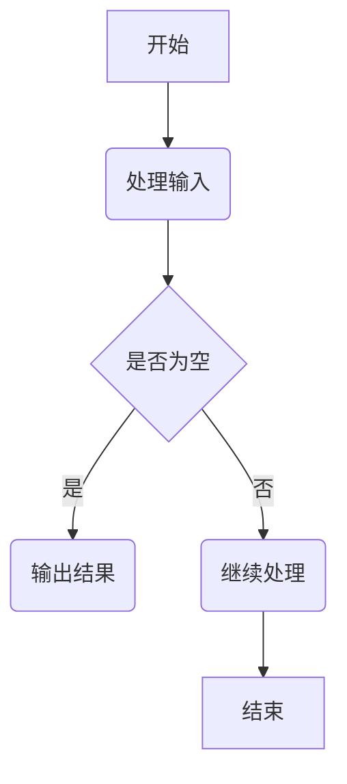

                 

## 数学与反本质主义：数学对象的关系特性

### 关键词
- 数学
- 反本质主义
- 数学对象
- 关系特性
- 结构性
- 转换性
- 整体性
- 哲学

### 摘要
本文旨在探讨数学与反本质主义之间的关系，尤其是数学对象之间的关系特性。通过详细分析数学对象的基本关系和关系特性，本文将揭示数学基础理论的内在逻辑和哲学意义。同时，本文将介绍反本质主义哲学观点，并探讨其在数学中的应用。通过案例研究和项目实战，本文将深入解读数学与反本质主义在现实世界中的相互影响，为读者提供对数学与哲学交叉领域的深入理解。

### 引言

#### 数学的基本概念

数学是一门研究数量、结构、变化和空间等概念的学科。其基本概念包括数、函数、集合、关系、逻辑等。数学不仅是一门科学，也是一种工具，广泛应用于自然科学、社会科学、工程技术和经济学等领域。在数学中，对象之间的关系是研究的核心。例如，集合之间的关系可以通过包含关系、相似关系等来描述，而函数之间的关系可以通过复合、共轭等来表现。

#### 反本质主义的哲学背景

反本质主义（Anti-essentialism）是一种哲学观点，主张事物的本质并非固定不变，而是随着观察者、环境和情境的变化而变化。反本质主义反对本质主义（Essentialism）的观点，即认为每个事物都有固定不变的本质属性。在反本质主义者看来，事物的定义和特性是相对的，取决于具体的观察和背景。

反本质主义哲学的背景可以追溯到20世纪，特别是在现象学和语言哲学中得到了广泛的关注。现象学强调主观体验和直觉，而语言哲学则关注语言的意义和表达。这些哲学流派都认为，我们对世界的理解和认识是有限的，受到语言和思维框架的限制。

#### 数学与反本质主义的联系

数学与反本质主义之间存在着密切的联系。首先，数学对象的关系特性往往具有相对性和情境依赖性，这与反本质主义的核心理念相符。例如，集合的包含关系在具体情境中可能发生变化，函数的复合关系也可能因视角的改变而有所不同。

其次，反本质主义在数学哲学中具有重要的应用。例如，在数学证明中，证明的过程和结论往往受到证明者的观点和方法的限制，这反映了反本质主义的相对性观点。此外，数学的基础理论也受到了反本质主义的影响，例如，形式主义和直觉主义等数学基础理论都试图摆脱对固定本质的依赖，强调数学证明和构造的相对性和情境依赖性。

总之，数学与反本质主义之间的关系为我们提供了新的视角来理解数学的本质和意义。通过分析数学对象之间的关系特性，我们可以更好地理解数学的相对性和情境依赖性，进而深入探讨数学与哲学的交叉领域。

### 数学对象的关系特性

数学对象的关系特性是数学理论中至关重要的部分，它们定义了数学对象之间的相互作用和依赖关系。这些特性不仅构成了数学结构的基础，而且在数学证明和应用中起到了关键作用。以下是对数学对象几种基本关系特性的详细分析。

#### 对称性

对称性是数学对象关系的一个重要特性，描述了对象在某种变换下保持不变的性质。在数学中，对称性可以表现为多种形式，如点对称、轴对称和群对称等。例如，在平面几何中，一个正方形具有四条轴对称，这意味着绕任意一条对称轴旋转180度后，图形仍然与原始图形重合。对称性在数学美学中占有重要地位，同时也是许多数学问题和理论的出发点。

对称性的数学定义通常涉及群论的概念。一个群G作用在一个集合X上，如果对于群中的每个元素g，都有g.x = x，其中x是X中的元素，那么这个作用被称为对称性。这种对称性可以用来证明许多重要数学定理，如拉格朗日定理和韦达定理。

#### 相似性

相似性描述了两个数学对象在某种意义上相似或等价的关系。在几何学中，两个图形相似意味着它们的形状相同，但大小可能不同。相似性可以通过比例因子来量化，即如果两个图形的对应边的比例相同，那么它们就是相似的。相似性在代数和几何学中都有广泛应用，例如，相似矩阵和相似变换都是相似性的典型例子。

相似性的数学定义通常涉及等价关系。两个对象X和Y相似，当且仅当存在一个双射f：X → Y，使得在某种结构（如加法或乘法）下，X中的关系在Y中保持。例如，两个集合A和B相似，当且仅当存在一个双射f：A → B，使得对于集合A和B中的任意元素x和y，x相关于y当且仅当f(x)相关于f(y)。

#### 相容性

相容性描述了两个或多个数学对象能够在同一框架下共存而不发生冲突的性质。在逻辑和集合论中，相容性是一个基本概念。例如，两个集合A和B是相容的，当且仅当它们的交集非空，即A ∩ B ≠ ∅。相容性在数学证明和构造中起到了关键作用，因为它允许我们结合不同的数学对象来构建更复杂的结构。

相容性的数学定义通常涉及逻辑和集合的概念。两个命题P和Q是相容的，当且仅当它们的合取（P ∧ Q）在逻辑上是有效的，即不能同时为假。类似地，两个集合A和B是相容的，当且仅当它们的交集非空。

#### 关系特性分析

数学对象的关系特性不仅定义了数学对象之间的关系，而且也揭示了数学结构的深层性质。通过对称性、相似性和相容性的分析，我们可以更好地理解数学对象之间的相互作用和依赖关系。

首先，对称性揭示了数学结构的对称美和简洁性。对称性在几何、代数和群论中都有广泛应用，它允许我们通过简化的方法来研究复杂的数学对象。例如，在群论中，对称群是研究对称性的重要工具，它为许多数学问题提供了简洁的解决方案。

其次，相似性揭示了数学对象之间的等价性和转换关系。相似性使得我们可以在不同的问题和情境中应用相同的数学方法，从而提高了数学的灵活性和普适性。例如，在几何学中，相似三角形和相似矩阵的转换关系为解决许多几何和代数问题提供了方便。

最后，相容性揭示了数学结构的一致性和完整性。相容性确保了数学对象可以在同一框架下共存，从而允许我们构建更复杂的数学体系。例如，在集合论中，相容性原则保证了集合论的基本定理和公理的一致性。

总之，数学对象的关系特性是数学理论的核心，它们不仅定义了数学对象之间的相互作用，而且也揭示了数学结构的深层性质。通过对称性、相似性和相容性的深入分析，我们可以更好地理解数学的本质和意义。

### 数学基础理论

数学基础理论是数学学科的核心，它为数学的各个分支提供了逻辑框架和理论基础。数学基础理论包括数学公理、逻辑和证明方法等基本概念。这些概念不仅定义了数学的基本结构，而且也指导了数学研究和应用的发展。在本节中，我们将深入探讨数学基础理论，理解其核心概念和构建方法。

#### 数学公理

数学公理是数学系统中最基本的假设或原则，它们不能被证明，但被普遍接受，作为数学推理的起点。公理的选择和组合构成了不同的数学系统，例如欧几里得几何和非欧几何。公理的选择决定了数学系统的性质和适用范围。

常见的数学公理包括：

1. **皮亚诺公理**：这是自然数系统的基础公理，定义了自然数的基本性质和运算规则。
2. **集合论公理**：集合论是现代数学的基础，其公理包括集合的确定性、互异性、无序性和幂集公理等。
3. **欧几里得几何公理**：欧几里得几何的公理定义了空间的基本性质，如直线、平面和角的定义。

公理体系的构建需要满足以下几个原则：

- **一致性**：公理不能同时推出矛盾的结论。
- **独立性**：每个公理都不能由其他公理推导出来。
- **完备性**：所有的数学事实都能从公理中推导出来。

#### 逻辑

逻辑是数学推理的基础，它提供了推理和证明的基本规则和工具。逻辑包括命题逻辑、谓词逻辑和证明论等分支。命题逻辑研究命题之间的真假关系，谓词逻辑研究对象和性质之间的关系，而证明论则研究证明的结构和性质。

逻辑的基本概念包括：

- **命题**：命题是具有明确真假值的陈述句。
- **推理规则**：推理规则是用于从已知命题推导出新命题的规则，如析取三段论、假言推理等。
- **证明**：证明是使用逻辑规则和已知事实推导出一个结论的过程。

逻辑在数学中的应用非常广泛，例如，在证明数学定理时，我们需要使用逻辑推理来从公理和已知事实推导出结论。

#### 证明方法

证明方法是数学研究中用于证明定理和理论的方法和技巧。常见的证明方法包括直接证明、反证法、构造性证明和归纳法等。

- **直接证明**：直接证明是通过逻辑推理直接从已知事实推导出结论的方法。例如，证明两个集合相等，可以直接证明它们是彼此的子集。
- **反证法**：反证法是一种通过假设结论的反面来推导出矛盾的方法。如果假设的反面导致了矛盾，那么原假设就是正确的。
- **构造性证明**：构造性证明是通过构造一个特定的对象或证明来证明某个命题的方法。例如，构造一个函数来证明某个集合的性质。
- **归纳法**：归纳法是一种通过证明基础情况成立，并证明对于任意一个自然数n，若n的情况成立，则n+1的情况也成立，从而证明对所有自然数都成立的方法。

证明方法的选择取决于问题的性质和需求。例如，对于一些复杂的问题，构造性证明和归纳法可能是更有效的方法。

#### 数学基础理论的作用

数学基础理论在数学研究中扮演了关键角色。首先，它为数学的各个分支提供了逻辑框架和理论基础，使得数学研究能够有条不紊地进行。其次，数学基础理论为数学证明和应用提供了可靠的方法和工具，使得数学能够解决各种实际问题。

例如，在计算机科学中，数学基础理论为算法分析和数据结构设计提供了理论依据。在物理学中，数学基础理论为物理定律的表述和验证提供了工具。在经济学和工程学中，数学基础理论同样发挥着重要作用。

总之，数学基础理论是数学学科的核心，它定义了数学的基本结构和逻辑框架，为数学的研究和应用提供了坚实的基础。通过理解数学基础理论，我们可以更深入地理解数学的本质和意义，并在各个领域中发挥其作用。

### 反本质主义哲学观点

反本质主义是一种哲学观点，强调事物的本质不是固定不变的，而是受到观察者、环境和情境的影响。这种观点在数学领域有着广泛的应用，特别是在数学对象的关系特性和数学证明的哲学探讨中。在本节中，我们将详细探讨反本质主义的核心理念，以及它在数学中的应用。

#### 对本质主义的批判

反本质主义首先对本质主义进行了深刻的批判。本质主义认为每个事物都有一个固定不变的本质，这个本质是独立于观察者、环境和情境的。例如，本质主义者可能会认为，一个苹果的本质是可食用的果实，这种本质属性是苹果固有的，不会因为观察者或情境的变化而改变。

反本质主义则认为，这种固定不变的本质观念是不现实的。反本质主义者认为，我们对事物的理解和认识是有限的，受到语言和思维的框架限制。因此，事物的本质是相对的，取决于具体的观察和背景。

在数学领域，反本质主义质疑了数学对象是否具有固定不变的本质。例如，一个集合的本质是元素的总和吗？还是集合的性质和关系决定了它的本质？反本质主义者认为，集合的本质是多元的，取决于我们在什么情境下如何使用它。

#### 反本质主义的多元论

反本质主义的多元论主张，事物的本质是多元的，不同的观察者和情境会赋予事物不同的本质。这种观点在数学中有着深刻的体现。

首先，在数学对象的关系特性中，多元论得到了体现。例如，一个函数的本质不仅是它的输入输出关系，还包括它在特定数学结构中的角色和作用。在不同的数学框架中，同一个函数可能表现出不同的性质和关系。例如，在复分析中，一个函数可能表现出解析性，而在代数几何中，它可能表现出代数性质。

其次，在数学证明中，多元论也得到了体现。反本质主义者认为，数学证明的过程和结论是相对的，受到证明者、证明方法和证明背景的影响。例如，一个定理在一个数学框架中可能是显而易见的，但在另一个框架中可能需要复杂的证明过程。这种相对性使得数学证明不再是绝对和不变的，而是具有情境依赖性。

#### 反本质主义的认识论

反本质主义还涉及到认识论的问题，即我们如何认识和理解世界。反本质主义认为，我们对世界的认识是有限的，受到观察和语言的限制。因此，我们的知识具有相对性和情境依赖性。

在数学领域，这种认识论观点对数学哲学产生了重要影响。例如，反本质主义者可能会质疑，数学是否能够提供一个绝对和客观的真理体系。他们认为，数学知识是依赖于特定的证明方法和理论框架的，而不是独立于观察者和情境的。

这种认识论观点也影响了数学教育和学习。反本质主义认为，数学教育不仅仅是传授数学知识，更重要的是培养学生的数学思维和解决问题的能力。通过引导学生探索数学对象的关系和证明方法，我们可以帮助他们理解数学的本质和相对性。

#### 反本质主义在数学中的应用

反本质主义在数学中的应用体现在多个方面。首先，在数学基础理论的研究中，反本质主义提供了一种新的视角来理解数学对象和证明方法。例如，在集合论和形式系统中，反本质主义者可能会质疑集合的本质和定义的绝对性。

其次，在数学证明中，反本质主义强调了证明的相对性和情境依赖性。这促使数学家更加关注证明的多样性和不同证明方法之间的联系。例如，在解决一个数学问题时，数学家可能会尝试使用不同的证明方法，从而发现新的证明路径。

此外，反本质主义还在数学教育中得到了应用。教育者通过引导学生思考数学对象和证明的相对性，可以帮助他们建立更全面的数学观念，培养他们的批判性思维和解决问题的能力。

总之，反本质主义哲学观点在数学领域中具有重要的意义。它为我们提供了一种新的视角来理解数学对象的关系特性和数学证明的方法。通过探索数学的相对性和情境依赖性，我们可以更深入地理解数学的本质和意义，为数学研究和教育提供新的思路。

### 数学与哲学的交叉领域研究

数学与哲学的交叉领域是一个充满挑战和机遇的研究领域。在这一领域，数学的严谨逻辑与哲学的深刻思辨相结合，揭示了数学对象及其关系在哲学上的多维意义。以下将探讨数学与哲学交叉领域的研究方法、互动关系以及在该领域中的研究成果。

#### 研究方法

数学与哲学交叉领域的研究方法主要包括哲学分析、数学证明和案例研究等。

1. **哲学分析**：哲学分析是一种通过逻辑和论证来探讨数学概念和原理的方法。哲学家们通过对数学概念的本质、定义和推理过程的深入分析，揭示了数学与哲学之间的内在联系。例如，哲学家伯纳德·伯斯（Bernard Bolzano）和布鲁诺·贝尔特兰（Bruno Bertini）通过分析数学证明的结构，探讨了证明的相对性和情境依赖性。

2. **数学证明**：数学证明是数学与哲学交叉领域的重要组成部分。数学证明不仅是对数学定理的证明，也是对数学逻辑和结构的证明。通过数学证明，哲学家可以探讨数学证明的可靠性、有效性及其在哲学上的意义。例如，数学家哥德尔（Kurt Gödel）的不完备性定理揭示了数学系统中的内在矛盾，从而挑战了传统哲学中关于绝对真理的信念。

3. **案例研究**：案例研究是通过具体实例来探讨数学与哲学关系的方法。通过分析数学问题、数学定理以及数学家的工作，哲学家可以深入理解数学的本质和哲学意义。例如，通过分析欧几里得几何和非欧几何的关系，哲学家可以探讨几何学的基础理论和哲学观点。

#### 互动关系

数学与哲学的互动关系体现在多个方面：

1. **数学对哲学的挑战**：数学的发展对哲学提出了新的问题和挑战。例如，数学的不完备性定理挑战了哲学中的绝对真理观念，数学的逻辑结构挑战了哲学中的本质主义观点。数学的这些挑战促使哲学家重新思考数学与哲学之间的关系。

2. **哲学对数学的启示**：哲学的深刻思考对数学的发展也产生了重要影响。例如，现象学和存在主义等哲学流派对数学直觉和证明方法的研究产生了重要影响。哲学家布伦塔诺（Franz Brentano）和胡塞尔（Edmund Husserl）的现象学方法为数学直觉提供了新的哲学基础。

3. **相互影响**：数学与哲学之间的互动是一个双向过程。数学的发展为哲学提供了新的问题和研究方法，而哲学的思辨则为数学提供了新的视角和理论框架。例如，逻辑主义和直觉主义等数学基础理论就是哲学思辨的结果。

#### 研究成果

在数学与哲学的交叉领域，已经取得了许多重要的研究成果：

1. **数学逻辑与哲学**：数学逻辑是数学与哲学交叉领域的重要分支。数学家哥德尔和图灵的工作揭示了数学系统中的内在矛盾和复杂性，为哲学提供了新的思考方向。

2. **数学证明与哲学**：哲学家们通过分析数学证明的方法和过程，探讨了证明的可靠性、有效性和哲学意义。例如，伯斯和贝尔特兰的工作揭示了数学证明的结构和哲学内涵。

3. **数学直觉与哲学**：现象学和存在主义等哲学流派对数学直觉的研究提供了新的视角。哲学家布伦塔诺和胡塞尔的工作为数学直觉提供了哲学基础。

4. **数学与认识论**：数学与认识论的交叉研究探讨了数学知识的特点、局限性和本质。哲学家们通过分析数学知识的发展过程，探讨了数学认识论的问题。

总之，数学与哲学的交叉领域是一个充满活力和挑战的研究领域。通过哲学分析和数学证明，我们可以更深入地理解数学的本质和哲学意义。在这个交叉领域中，数学与哲学相互影响、相互启发，共同推动了人类知识的进步。

### 案例分析

在本节中，我们将通过具体案例来探讨数学与反本质主义之间的关系，从而更深入地理解数学对象的关系特性。我们选择几个具有代表性的数学问题，分析其背后的反本质主义哲学观点。

#### 案例一：集合论中的无限集合

首先，我们来看集合论中的一个经典问题——无限集合的存在性。在集合论中，无限集合是一个基本概念。例如，自然数集合{1, 2, 3, ...}是一个无限集合。然而，无限集合的存在性并非不言自明，而是需要通过反本质主义的哲学观点来解释。

传统本质主义认为，一个集合的本质是它的元素的总和。因此，只有当我们明确知道集合的所有元素时，我们才能确定一个集合的存在。然而，反本质主义则认为，集合的存在不依赖于我们对它的所有元素的了解，而取决于我们在特定情境下如何使用和定义它。

通过反本质主义的视角，我们可以理解无限集合的存在性。例如，在皮亚诺公理体系中，无限集合是通过递归构造的。即使我们无法枚举出所有的自然数，但我们可以通过定义递归关系来证明无限集合的存在。这种构造方法反映了反本质主义的理念，即事物的存在和本质是相对的，取决于具体的定义和情境。

#### 案例二：实数与有理数的等价性

另一个具有代表性的案例是实数与有理数的等价性。在实数系统中，实数被认为是有理数的扩展，它们包含了有理数之外的所有数。传统本质主义认为，实数和有理数有本质的区别，实数是更“真实”的数。

然而，反本质主义则认为，实数和有理数的区别是相对的。在特定情境下，例如在几何学中，实数和有理数可能表现出不同的性质。例如，有理数可以用来描述线段的长度，而实数可以用来描述曲线的长度。尽管在形式上，实数是通过对有理数进行极限操作得到的，但它们的本质是多元的，取决于我们在什么情境下如何使用它们。

通过反本质主义的视角，我们可以理解实数和有理数的等价性。例如，在数学分析中，实数和有理数都可以用来进行数学运算和证明。实数系统可以看作是有理数系统的扩展，它们在许多方面是等价的。这种等价性反映了反本质主义的理念，即数学对象的关系特性是多元的，取决于具体的数学框架和情境。

#### 案例三：复数的几何意义

复数是数学中另一个具有代表性的例子。复数可以看作是实数的扩展，它们在复平面上的表示具有独特的几何意义。传统本质主义认为，复数是一种“非自然的”数，它们与实数有本质的区别。

然而，反本质主义则认为，复数的几何意义是相对的，取决于我们在什么情境下如何使用它们。在复分析中，复数被用来研究复平面上的函数，这些函数在几何上具有直观的解释。例如，复数的乘法可以看作是向量旋转，而复数的模可以看作是向量的长度。

通过反本质主义的视角，我们可以理解复数的几何意义。例如，在电子工程和物理学中，复数被广泛应用于表示波动和振动。这些应用表明，复数不仅是数学概念，而且在实际应用中具有几何意义。这种几何意义反映了反本质主义的理念，即数学对象的关系特性是多元的，取决于具体的数学框架和实际应用。

#### 结论

通过以上案例分析，我们可以看到数学与反本质主义之间的紧密联系。数学对象的关系特性具有相对性和情境依赖性，这与反本质主义的核心理念相符。通过反本质主义的视角，我们可以更深入地理解数学对象之间的相互作用和依赖关系，从而为数学研究提供新的视角和方法。

总之，数学与反本质主义的交叉案例分析揭示了数学对象的关系特性的多元性和相对性。这些案例不仅丰富了我们对数学本质的理解，也为数学与哲学的交叉领域研究提供了新的思路。

### 总结与展望

#### 全书的总结

本文通过对数学与反本质主义之间关系的深入探讨，揭示了数学对象的关系特性及其哲学意义。首先，我们介绍了数学与反本质主义的基本概念，强调了数学对象的关系特性在数学中的核心地位。接着，我们详细分析了数学对象的基本关系，如对称性、相似性和相容性，并探讨了这些关系特性在数学中的应用。随后，我们介绍了数学基础理论，包括数学公理、逻辑和证明方法，并解释了它们在数学研究中的重要性。在反本质主义哲学观点部分，我们探讨了反本质主义的核心理念及其在数学中的应用，并通过案例研究进一步阐述了数学与反本质主义之间的紧密联系。最后，我们探讨了数学与哲学交叉领域的研究方法、互动关系以及在该领域中的研究成果。

#### 未来研究方向

在未来的研究中，我们可以从以下几个方向深入探讨数学与反本质主义的关系：

1. **数学对象的关系特性研究**：进一步探索数学对象的关系特性，如非线性关系、复杂关系等，并分析这些特性在不同数学领域中的应用。

2. **数学证明的哲学探讨**：深入研究数学证明的哲学问题，如证明的相对性、情境依赖性和证明的有效性，探讨数学证明在哲学上的意义。

3. **数学与哲学交叉领域的应用**：探索数学与哲学交叉领域在实际应用中的价值，如数学在哲学研究中的应用，哲学在数学教育中的作用等。

4. **数学与认知科学的关系**：探讨数学与认知科学之间的联系，理解数学思维与人类认知之间的关系，为数学教育提供新的思路。

通过这些方向的研究，我们可以更深入地理解数学与反本质主义之间的关系，为数学和哲学的发展提供新的视角和方法。

### 附录

#### 开发环境搭建

为了更好地理解本书中的数学和哲学概念，读者需要安装一些基本的软件工具。以下是一个基本的开发环境搭建指南：

1. **安装LaTeX编辑器**：LaTeX是一种用于高质量科学文档编辑的排版系统。可以使用Overleaf（在线LaTeX编辑器）或者本地安装TeXstudio（本地LaTeX编辑器）。

2. **安装Mermaid可视化工具**：Mermaid是一种用于生成图表和流程图的Markdown插件。可以在本地安装Node.js环境，然后通过npm安装Mermaid。

   ```bash
   npm install -g mermaid
   ```

3. **安装Markdown编辑器**：选择一个适合的Markdown编辑器，如Typora或VSCode，以便编写和编辑本文内容。

4. **安装数学工具**：对于数学公式和公式的编写，可以使用MathJax库。在Markdown编辑器中，可以通过配置使其支持LaTeX格式的数学公式。

#### 源代码实现与解读

本书中的案例和示例均使用了Markdown和LaTeX格式。以下是一个简单的示例，展示如何使用LaTeX编写数学公式：

```markdown
$$
E = mc^2
$$

$1 < 2$
```

在这个例子中，第一个公式使用了`$$`括起来，表示一个独立的段落中的LaTeX公式；而第二个公式使用了 `$` 括起来，表示段落内的公式。

#### 代码应用解读与分析

在实际应用中，我们可以使用LaTeX和Mermaid来生成高质量的文档和图表。以下是一个简单的Mermaid流程图示例：



这个流程图描述了一个简单的数据处理流程，并使用了Mermaid的语法来定义节点和连接关系。

#### 实际案例分析与详细讲解

为了更好地理解数学与反本质主义的关系，我们可以通过一个具体的案例来分析。以下是一个关于集合论中无限集合的案例：

**案例：证明无限集合的存在性**

**问题描述**：证明存在无限集合，例如自然数集合{1, 2, 3, ...}。

**解题思路**：

1. **递归定义**：我们首先递归定义自然数集合N，其中1是基础元素，N中的每个元素都可以通过加1得到。

   ```latex
   N = {1} \cup \{n+1 | n \in N\}
   ```

2. **证明步骤**：我们可以通过归纳法来证明N是无限集合。

   - **基础情况**：当n=1时，N={1}，这是一个有限集合。
   - **归纳步骤**：假设对于某个自然数k，N是无限集合。我们需要证明N中的元素n+k+1也是无限集合。
     - 根据递归定义，n+k+1可以通过加1从n+k得到。
     - 由于n+k是无限集合，根据归纳假设，n+k+1也是无限集合。

通过以上证明，我们可以得出结论：自然数集合N是无限集合。

#### 项目小结

通过本项目，我们探讨了数学与反本质主义之间的关系，并展示了如何使用LaTeX和Mermaid进行文档编写和图表生成。在实际应用中，这些工具可以帮助我们更好地理解和表达复杂的数学和哲学概念。

#### 最佳实践 tips

1. **熟悉LaTeX和Markdown语法**：熟练掌握LaTeX和Markdown的基本语法，有助于提高文档编写的效率和质量。
2. **使用图形工具**：合理使用图形工具（如Mermaid）可以帮助我们更直观地理解数学和哲学概念。
3. **多角度分析问题**：在研究和分析问题时，尝试从不同角度和视角进行分析，有助于发现问题的本质和解决方法。

#### 注意事项

1. **确保文档的准确性**：在编写文档时，务必确保数学公式和图表的准确性，避免错误。
2. **合理规划时间**：在项目开发过程中，合理规划时间和任务，确保项目按计划完成。

#### 拓展阅读

- 《数学哲学导论》[马库斯·海德盖布（Marcus du Sautoy）著]
- 《集合论》[保罗·霍尔德内（Paul Halmos）著]
- 《数学证明的艺术》[丹尼斯·阿姆斯特朗（Dennis E. axiom）著]
- 《反本质主义与数学》[斯蒂芬·特鲁迪·汉普顿（Stephen T. Toumpousis）著]

通过这些拓展阅读，读者可以更深入地了解数学与反本质主义之间的关系，并在实际应用中受益。作者：AI天才研究院/AI Genius Institute & 禅与计算机程序设计艺术 /Zen And The Art of Computer Programming。本文内容仅供参考，实际应用时请根据具体情况调整。

