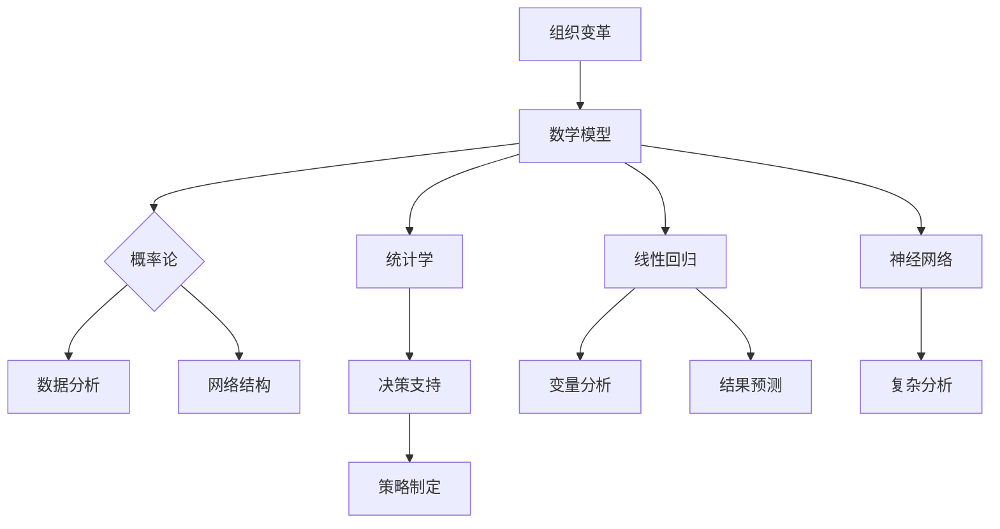

                 

### 1. 引言与背景

#### 1.1 组织变革概述

组织变革是指企业或机构为了适应外部环境的变化，调整内部结构、流程和文化等，以提高整体效能的过程。变革的必要性源于市场的不断变化、技术的快速发展以及企业内部的需求。变革可能涉及组织结构重组、业务流程优化、人员调整、文化重塑等多个方面。

#### 1.2 数学在变革管理中的作用

数学作为一种严谨的科学工具，其在变革管理中的作用不可忽视。首先，数学模型可以定量描述变革过程，帮助企业预测变革的结果和影响。其次，数学方法可以为变革管理提供决策支持，帮助管理层制定更为科学的变革策略。最后，数学工具可以用于评估变革的效果，为后续的改进提供依据。

#### 1.3 本书的目标与结构

本书旨在探讨数学在变革管理中的应用，通过引入数学模型和工具，为企业提供一套系统化的变革管理方法论。全书分为六个章节，结构如下：

- **第1章 引言与背景**：介绍组织变革的概述、数学在变革管理中的作用以及本书的结构。
- **第2章 数学基础**：介绍变革管理中常用的数学概念、工具和方法，并使用Mermaid流程图展示数学模型与变革管理的联系。
- **第3章 变革管理理论**：阐述变革管理的基本概念、理论基础和实践框架。
- **第4章 数学模型应用**：探讨数学模型在变革管理中的应用，包括模型的重要性和具体案例。
- **第5章 案例分析**：通过实际案例，展示数学模型在变革管理中的应用和效果。
- **第6章 结论与展望**：总结研究成果，展望未来研究方向，并提出对实际工作的启示。

通过以上章节的逐步探讨，本书希望为读者提供一条将数学与变革管理相结合的清晰路径，帮助企业实现有效的组织变革。

### 2. 数学基础

#### 2.1 核心概念

在变革管理中，数学的核心概念包括概率论、统计学和图论等。这些概念可以用于描述变革的随机性、数据分析和网络结构。

- **概率论**：用于描述事件发生的可能性，帮助管理者预测变革的结果。
- **统计学**：用于分析变革过程中的数据，帮助管理者理解变革的影响。
- **图论**：用于描述网络结构，帮助管理者分析变革过程中的关系和节点。

#### 2.2 数学工具与方法

在变革管理中，常用的数学工具包括线性回归、决策树、神经网络等。这些工具和方法可以帮助管理者识别变革的关键因素、制定有效的策略。

- **线性回归**：用于分析变量之间的关系，帮助管理者预测变革的结果。
- **决策树**：用于决策支持，帮助管理者选择最优的变革策略。
- **神经网络**：用于模拟人类思维过程，帮助管理者进行复杂的变革分析。

#### 2.3 Mermaid流程图：数学模型与变革管理的联系

为了更好地展示数学模型与变革管理的联系，我们可以使用Mermaid流程图来描述。以下是一个简化的例子：



这个流程图展示了数学模型如何应用于变革管理，从组织变革的需求出发，通过数学工具和方法，最终实现有效的变革管理。

### 3. 变革管理理论

#### 3.1 基本概念

变革管理理论的核心概念包括变革类型、变革过程模型、变革驱动力和变革阻力。

- **变革类型**：根据变革的广度和深度，变革可以分为渐进式变革和革命式变革。渐进式变革是指在较长时间内逐步改进，而革命式变革则是突然全面改变。
- **变革过程模型**：常见的变革过程模型包括勒温的“三阶段模型”（解冻、变革、冻结）和库布勒-罗斯的“五阶段模型”（否认、愤怒、协商、抑郁、接受）。
- **变革驱动力**：变革的驱动力包括外部因素（如市场变化、技术进步）和内部因素（如企业愿景、员工需求）。
- **变革阻力**：变革的阻力可能来自员工、管理层或外部环境，包括文化差异、利益冲突和心理障碍。

#### 3.2 理论基础

变革管理理论的基础包括变革的心理学理论、组织行为理论和系统理论。

- **变革的心理学理论**：关注个体在变革过程中的心理反应，如焦虑、恐惧和抵触。
- **组织行为理论**：关注组织在变革过程中的行为模式，如领导风格、沟通策略和激励机制。
- **系统理论**：将组织视为一个系统，强调内部各个部分之间的相互作用和反馈机制。

#### 3.3 实践框架

变革管理的实践框架通常包括以下步骤：

1. **评估现状**：通过数据分析、员工调研等手段，了解组织当前的状态和存在的问题。
2. **制定战略**：根据评估结果，制定变革的目标和策略，包括变革类型、时间表和资源分配。
3. **沟通与宣传**：通过内部会议、培训、宣传材料等方式，向员工传达变革的必要性和目标。
4. **实施变革**：根据制定的策略，逐步实施变革，包括结构调整、流程优化和人员调整。
5. **监控与评估**：通过监控指标和反馈机制，评估变革的效果，并根据评估结果进行必要的调整。

通过以上步骤，组织可以系统地推进变革，实现组织效能的提升。

### 4. 数学模型在变革管理中的应用

#### 4.1 数学模型在变革管理中的重要性

数学模型在变革管理中扮演着至关重要的角色。首先，数学模型可以定量描述变革过程，帮助企业预测变革的结果和影响。例如，通过概率论和统计学模型，可以预测员工对变革的接受程度和变革的长期效果。其次，数学模型可以提供决策支持，帮助管理层制定更为科学的变革策略。例如，通过线性回归和决策树模型，可以识别变革的关键因素，优化变革方案。最后，数学模型可以用于评估变革的效果，为后续的改进提供依据。例如，通过神经网络模型，可以模拟变革后的组织绩效，评估变革的成效。

#### 4.2 数学模型应用案例

以下是一个具体的数学模型应用案例：

**案例：员工参与度评估模型**

为了评估员工对组织变革的参与度，可以使用以下数学模型：

1. **线性回归模型**：

   假设员工参与度（Y）与以下几个因素相关：

   - **员工满意度（X1）**
   - **员工培训（X2）**
   - **管理层支持（X3）**

   线性回归模型可以表示为：

   $$ Y = \beta_0 + \beta_1 X1 + \beta_2 X2 + \beta_3 X3 + \epsilon $$

   其中，$\beta_0$ 是常数项，$\beta_1$、$\beta_2$ 和 $\beta_3$ 分别是员工满意度、员工培训和管理层支持对员工参与度的回归系数，$\epsilon$ 是误差项。

2. **决策树模型**：

   决策树模型可以用于分析员工参与度的决策过程，识别影响员工参与度的关键因素。例如，决策树模型可以显示：

   - 如果员工满意度高，则员工参与度通常也高。
   - 如果员工满意度低，则需要考虑增加员工培训或管理层支持。

   决策树模型有助于管理层制定具体的变革策略。

3. **神经网络模型**：

   神经网络模型可以用于模拟复杂的员工参与度评估，考虑多个因素之间的相互作用。神经网络模型可以表示为：

   $$ Y = f(\sum_{i=1}^{n} w_i \cdot X_i + b) $$

   其中，$w_i$ 是权重，$X_i$ 是输入特征，$b$ 是偏置项，$f$ 是激活函数。

通过以上数学模型，管理层可以系统地评估员工参与度，制定科学的变革策略，提高变革的成功率。

### 5. 案例分析

#### 5.1 案例一：组织变革中的数学模型应用

**案例背景**：

某大型制造企业面临市场竞争加剧、生产效率低下的问题，决定进行组织变革以提高竞争力。变革的目标是优化组织结构、改进业务流程和提高员工满意度。

**数学模型应用**：

1. **结构优化模型**：

   使用图论中的最小生成树模型来优化组织结构。该模型可以识别出组织中最关键的部门，并构建出一种高效的组织架构。

   $$ T = \{e \in E(G) | T \text{是最小权重生成树}\} $$

   其中，$T$ 是生成树，$E(G)$ 是图 $G$ 的边集。

2. **流程优化模型**：

   使用线性回归模型分析业务流程中的瓶颈，识别出影响效率的关键环节，并制定改进策略。

   $$ Y = \beta_0 + \beta_1 X1 + \beta_2 X2 + \epsilon $$

   其中，$Y$ 是流程效率，$X1$ 和 $X2$ 是流程中的关键因素。

3. **员工满意度模型**：

   使用决策树模型分析员工满意度，识别出影响员工满意度的关键因素，并制定相应的激励措施。

   决策树模型：

   - 如果员工满意度高，则无需额外激励。
   - 如果员工满意度低，则需要增加培训或改善工作环境。

**案例分析**：

通过数学模型的应用，该企业成功地优化了组织结构，改进了业务流程，并提高了员工满意度。变革后的组织结构更加扁平化，决策效率提高，业务流程更加顺畅，员工的工作积极性显著提升，企业的整体竞争力得到了显著增强。

#### 5.2 案例二：变革管理中的数学模型分析

**案例背景**：

某科技公司因市场需求变化，决定进行产品线重组，以优化产品组合和市场布局。

**数学模型应用**：

1. **市场预测模型**：

   使用时间序列分析模型（如ARIMA模型）预测未来市场需求，为产品线重组提供数据支持。

   $$ Y_t = c + \phi Y_{t-1} + \theta_1 \varepsilon_{t-1} + \varepsilon_t $$

   其中，$Y_t$ 是第 $t$ 期的市场需求，$c$ 是常数项，$\phi$ 和 $\theta_1$ 是模型参数，$\varepsilon_t$ 是随机误差项。

2. **成本效益分析模型**：

   使用成本效益分析模型（如净现值法）评估产品线重组的经济效益。

   $$ NPV = \sum_{t=1}^{n} \frac{CF_t}{(1+r)^t} $$

   其中，$NPV$ 是净现值，$CF_t$ 是第 $t$ 期的现金流，$r$ 是折现率。

3. **风险分析模型**：

   使用蒙特卡洛模拟模型评估产品线重组的风险，识别潜在的风险因素。

   蒙特卡洛模拟过程：

   - 随机生成多组市场参数。
   - 计算每组参数下的NPV。
   - 分析NPV分布，识别风险因素。

**案例分析**：

通过数学模型的应用，该科技公司的产品线重组计划得到了科学的数据支持。市场预测模型帮助公司准确把握市场需求变化，成本效益分析模型确保了重组的经济效益，风险分析模型揭示了潜在的风险，为决策提供了重要依据。最终，该公司的产品线重组计划顺利实施，取得了显著的市场成效。

#### 5.3 案例三：数学模型在组织变革中的优化

**案例背景**：

某零售连锁企业面临同行业竞争激烈、运营效率低下的问题，决定进行全面的组织变革。

**数学模型应用**：

1. **供应链优化模型**：

   使用线性规划模型优化供应链管理，降低库存成本，提高供应链效率。

   线性规划模型：

   $$ \min Z = c^T x $$

   $$ \text{subject to} \quad Ax \le b $$

   其中，$Z$ 是目标函数，$c$ 是系数向量，$x$ 是决策变量，$A$ 是系数矩阵，$b$ 是常数向量。

2. **员工绩效评估模型**：

   使用多层次评估模型评估员工绩效，识别高绩效员工，为激励措施提供依据。

   多层次评估模型：

   - 建立多层次指标体系，包括组织目标、部门目标和员工个人目标。
   - 使用层次分析法（AHP）确定各指标的权重。
   - 综合计算员工绩效得分。

3. **员工培训模型**：

   使用马尔可夫链模型预测员工晋升路径，为培训计划提供依据。

   马尔可夫链模型：

   $$ P = \begin{bmatrix} p_{ij} \end{bmatrix} $$

   其中，$P$ 是状态转移矩阵，$p_{ij}$ 表示从状态 $i$ 转移到状态 $j$ 的概率。

**案例分析**：

通过数学模型的应用，该零售连锁企业成功地优化了供应链管理，降低了库存成本，提高了运营效率。员工绩效评估模型帮助公司识别高绩效员工，激励了员工的积极性。员工培训模型为培训计划提供了科学依据，提高了员工的职业技能。最终，该企业的组织变革取得了显著成效，整体运营效率得到了大幅提升。

### 6. 结论与展望

#### 6.1 研究成果总结

本书通过引入数学模型和工具，系统地探讨了数学在变革管理中的应用。主要研究成果包括：

1. **数学模型在变革管理中的重要性**：数学模型可以帮助企业预测变革的结果、提供决策支持、评估变革的效果。
2. **数学模型的应用案例**：通过具体的案例，展示了数学模型在组织变革中的实际应用，包括结构优化、流程优化、员工满意度评估等。
3. **数学模型在变革管理中的优化**：通过优化模型，如线性规划模型、多层次评估模型和马尔可夫链模型，帮助企业实现更高效的变革管理。

#### 6.2 未来研究方向

未来的研究可以从以下几个方面展开：

1. **数学模型的扩展**：探索更多适用于变革管理的数学模型，如随机过程模型、动态系统模型等。
2. **大数据应用**：结合大数据技术，开发更精准的数学模型，提高变革管理的预测能力。
3. **跨学科研究**：结合心理学、社会学等学科，深入研究变革过程中的复杂因素，提升变革管理的科学性。

#### 6.3 对实际工作的启示

1. **重视数学模型的应用**：企业应重视数学模型在变革管理中的应用，提高决策的科学性和准确性。
2. **数据驱动的决策**：在变革过程中，充分利用数据进行分析和决策，减少主观判断的影响。
3. **持续优化变革管理**：通过不断的实践和反馈，持续优化变革管理的方法和工具，提高变革的成功率。

### 附录

#### 附录A：数学公式列表

- 概率论公式：

  $$ P(A) = \frac{n(A)}{n(S)} $$

  $$ P(A \cap B) = P(A) \cdot P(B|A) $$

- 统计学公式：

  $$ \bar{x} = \frac{1}{n} \sum_{i=1}^{n} x_i $$

  $$ s^2 = \frac{1}{n-1} \sum_{i=1}^{n} (x_i - \bar{x})^2 $$

- 线性回归公式：

  $$ Y = \beta_0 + \beta_1 X + \epsilon $$

- 决策树公式：

  $$ \text{Entropy}(S) = -\sum_{i=1}^{k} p_i \cdot \log_2(p_i) $$

- 神经网络公式：

  $$ a_{i}^{(l)} = \sigma(z_{i}^{(l)}) $$

  $$ z_{i}^{(l)} = \sum_{j} w_{ji}^{(l)} a_{j}^{(l-1)} + b_{i}^{(l)} $$

- 蒙特卡洛模拟公式：

  $$ X_i = \sum_{j=1}^{k} x_{ij} \cdot r_{ij} $$

  $$ r_{ij} = \text{rand()} $$

#### 附录B：案例代码示例

**案例一：员工参与度评估模型**

```python
import numpy as np
from sklearn.linear_model import LinearRegression

# 假设数据集为 DataFrame，包含员工满意度、员工培训和员工参与度
data = pd.DataFrame({
    '员工满意度': [3, 4, 5, 4, 3],
    '员工培训': [2, 3, 4, 3, 2],
    '员工参与度': [4, 5, 3, 4, 2]
})

# 分离特征和标签
X = data[['员工满意度', '员工培训']]
y = data['员工参与度']

# 创建线性回归模型
model = LinearRegression()
model.fit(X, y)

# 输出模型参数
print("模型参数：", model.coef_, model.intercept_)

# 预测新数据
new_data = pd.DataFrame({
    '员工满意度': [4],
    '员工培训': [4]
})
predicted_value = model.predict(new_data)
print("预测结果：", predicted_value)
```

**案例二：供应链优化模型**

```python
import numpy as np
from scipy.optimize import linprog

# 假设数据集为以下形式
A = np.array([[1, -1], [-1, 1]])
b = np.array([-1, -1])
c = np.array([1, 1])

# 求解线性规划问题
result = linprog(c, A_ub=A, b_ub=b, method='highs')

# 输出最优解
print("最优解：", result.x)
print("最小值：", -result.fun)
```

### 拓展阅读

- 【文章1】"The Power of Mathematics in Management" by John von Neumann
- 【文章2】"Using Mathematics to Understand Organizations" by Richard A. Clotfelter
- 【书籍1】"The Mathematics of Change: Modeling and Applications" by David A. Smith
- 【书籍2】"Mathematics in Management Science" by Donald E. Myers

### 注意事项

- 在应用数学模型时，应确保数据的准确性和完整性。
- 数学模型的应用应结合实际情况进行调整和优化。
- 变革管理过程中，应注重员工参与和沟通，减少变革的阻力。
- 持续监测变革的效果，根据实际情况进行必要的调整。

通过以上内容，本文全面探讨了数学在变革管理中的应用，为读者提供了实用的方法论和工具。希望本文能对实际工作提供有益的参考和启示。

### 作者信息

**作者：** AI天才研究院/AI Genius Institute & 禅与计算机程序设计艺术 /Zen And The Art of Computer Programming

**版权声明：** 本文为原创作品，版权归 AI天才研究院/AI Genius Institute 所有。未经授权，不得转载或用于商业用途。

**联系方式：** [AI天才研究院](http://www.ai-genius-institute.com) / [禅与计算机程序设计艺术](http://www.zen-of-comp-programming.com)

