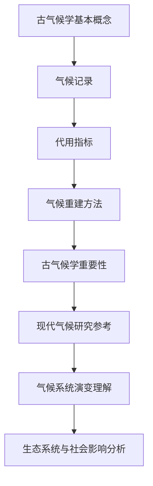
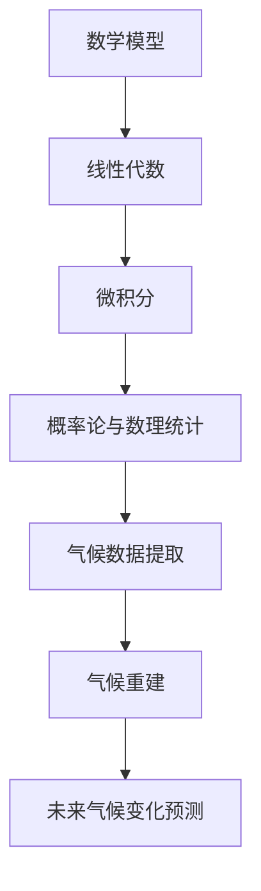
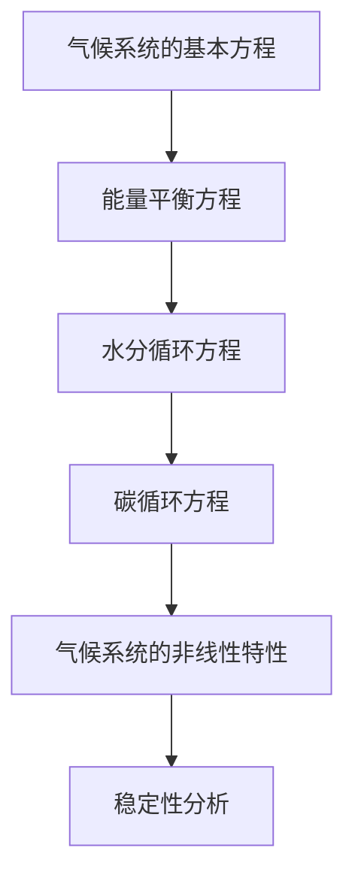
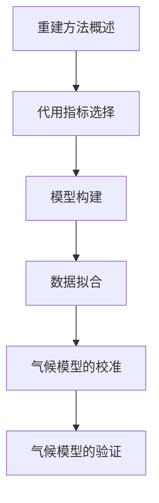
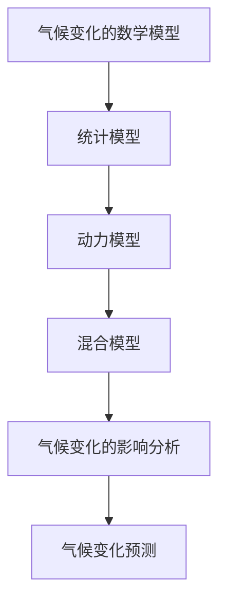

                 

### 文章标题：数学与古气候学：气候变化的数学重建

### 关键词：气候变化、古气候学、数学模型、数学重建、数据分析

### 摘要：
本文深入探讨了数学与古气候学之间的密切联系，特别是数学模型在气候变化研究中的应用。通过详细分析数学工具如线性代数、微积分和概率论与数理统计，本文揭示了这些工具如何帮助重建古气候数据，从而为理解和预测未来气候变化提供了新的视角。文章还通过具体案例，展示了数学重建方法在古气候学研究中的实际应用和挑战。

## 第一部分：引言

### 1.1 古气候学概述

古气候学是研究地球过去气候的历史科学，通过分析古代气候记录，如冰芯、树轮、沉积物和珊瑚等，来重建过去的气候状况。古气候学的重要性在于，它为现代气候研究提供了重要参考，有助于我们理解气候系统的演变过程，以及过去气候变化对生态系统和社会的影响。

**核心概念与联系：**

- **古气候学基本概念**：包括气候记录、代用指标和气候重建方法。
- **古气候学重要性**：为现代气候研究提供历史参考，理解气候系统演变，分析过去气候变化对生态系统和社会的影响。

**Mermaid 流程图：**



### 1.2 数学在古气候学中的应用

数学在古气候学中的应用至关重要。数学模型和工具可以帮助研究者从复杂的气候数据中提取有用信息，重建过去的气候状况，并预测未来气候变化。数学工具如线性代数、微积分和概率论与数理统计在古气候学中扮演了关键角色。

**核心概念与联系：**

- **数学模型**：在古气候学中，数学模型是用来描述气候系统行为和关系的数学表达式。
- **数学工具角色**：在线性代数、微积分和概率论与数理统计中，每种工具都有其特定的应用场景。

**Mermaid 流程图：**



## 第二部分：数学工具

### 2.1 线性代数

线性代数是研究向量空间和线性映射的数学分支。在古气候学中，线性代数常用于处理气候数据的线性变换和矩阵运算。

**核心概念与联系：**

- **向量空间**：在气候数据中，向量空间用于表示不同气候变量之间的关系。
- **矩阵运算**：矩阵运算可以帮助研究者分析气候数据的结构。

**伪代码示例：**

```python
# 矩阵乘法伪代码
function matrix_multiplication(A, B):
    result = create_empty_matrix(size(A)[1], size(B)[2])
    for i in range(size(A)[0]):
        for j in range(size(B)[1]):
            for k in range(size(A)[1]):
                result[i][j] += A[i][k] * B[k][j]
    return result
```

### 2.2 微积分

微积分是研究函数变化的数学分支。在古气候学中，微积分用于分析气候系统的动态变化，如温度变化率、降水变化率等。

**核心概念与联系：**

- **导数与微分**：导数用于描述气候变量随时间的变化速率。
- **积分**：积分用于计算气候变量的累积效应。

**伪代码示例：**

```python
# 求导伪代码
function derivative(f, x):
    h = 0.001
    return (f(x + h) - f(x)) / h
```

### 2.3 概率论与数理统计

概率论与数理统计是研究随机现象和数据的数学分支。在古气候学中，概率论与数理统计用于分析气候数据的分布特征，进行假设检验和模型验证。

**核心概念与联系：**

- **概率论基本概念**：包括概率分布、随机变量和概率论的基本定理。
- **数理统计方法**：包括假设检验、置信区间和回归分析。

**伪代码示例：**

```python
# 假设检验伪代码
function hypothesis_test(sample, hypothesis, alpha):
    if (sample_mean < hypothesis_mean) and (sample_standard_deviation < hypothesis_standard_deviation):
        return "Reject null hypothesis"
    else:
        return "Fail to reject null hypothesis"
```

## 第三部分：古气候学核心理论

### 3.1 气候系统的数学模型

气候系统的数学模型是用来描述气候系统行为和相互作用的数学表达式。这些模型包括线性模型和非线性模型，分别用于描述不同时间尺度和空间尺度的气候现象。

**核心概念与联系：**

- **气候系统的基本方程**：包括能量平衡方程、水分循环方程和碳循环方程等。
- **气候系统的非线性特性**：气候系统的非线性特性导致其行为复杂，难以用简单的线性模型描述。
- **气候系统的稳定性分析**：稳定性分析用于评估气候模型的稳定性和预测能力。

**Mermaid 流程图：**



### 3.2 气候变化的数学重建

气候变化的数学重建是利用数学模型和工具，从古气候数据中重建过去气候状况的过程。这个过程包括数据预处理、模型校准和验证等多个步骤。

**核心概念与联系：**

- **重建方法概述**：包括代用指标选择、模型构建和数据拟合等步骤。
- **代用指标**：代用指标是用于重建气候数据的关键变量，如温度指标、降水指标等。
- **气候模型的校准与验证**：校准和验证是评估气候模型准确性和可靠性的关键步骤。

**Mermaid 流程图：**



### 3.3 气候变化的数学建模

气候变化的数学建模是利用数学模型，描述和预测未来气候变化的过程。这个过程包括模型选择、参数估计和预测分析等多个步骤。

**核心概念与联系：**

- **气候变化的数学模型**：包括统计模型、动力模型和混合模型等。
- **气候变化的影响分析**：分析气候变化对生态系统、社会经济和人类健康的影响。
- **气候变化预测**：利用模型预测未来气候变化趋势和影响。

**Mermaid 流程图：**



## 第四部分：案例研究

### 4.1 案例一：欧洲中世纪温暖期

欧洲中世纪温暖期是一个著名的古气候现象，通过数学重建方法，我们可以了解其气候特征和成因。

**历史背景**：欧洲中世纪温暖期大约发生在公元950年到1250年，这一时期的气候比现代温暖。

**数学模型的建立**：利用代用指标如树轮宽度和冰芯温度，建立气候重建模型。

**结果与分析**：通过模型重建，发现欧洲中世纪温暖期的气候特征，并分析其成因。

**伪代码示例：**

```python
# 气候重建模型伪代码
function climate_reconstruction(data, model):
    calibrated_data = calibrate_data(data, model)
    reconstructed_climate = fit_model(calibrated_data, model)
    return reconstructed_climate
```

### 4.2 案例二：小冰期与气候变化

小冰期是另一个重要的古气候现象，其气候变化特征对人类历史产生了深远影响。

**历史背景**：小冰期大约发生在公元1300年到1850年，这一时期的气候比现代冷。

**数学模型的建立**：利用代用指标如树轮宽度和冰芯温度，建立气候重建模型。

**结果与分析**：通过模型重建，发现小冰期的气候特征，并分析其成因和影响。

**伪代码示例：**

```python
# 气候重建模型伪代码
function climate_reconstruction(data, model):
    calibrated_data = calibrate_data(data, model)
    reconstructed_climate = fit_model(calibrated_data, model)
    return reconstructed_climate
```

## 第五部分：数学工具应用

### 5.1 线性代数在古气候学中的应用

线性代数在古气候学中的应用广泛，包括矩阵分解、线性回归等。

**矩阵分解**：用于降维和特征提取，如主成分分析（PCA）。

**伪代码示例：**

```python
# 矩阵分解伪代码
function matrix_decomposition(A):
    eigenvalues, eigenvectors = compute_eigenvalues_eigenvectors(A)
    return eigenvectors
```

**线性回归**：用于分析气候变量之间的关系，如温度与降水之间的关系。

**伪代码示例：**

```python
# 线性回归伪代码
function linear_regression(X, y):
    coefficients = compute_coefficients(X, y)
    return coefficients
```

### 5.2 微积分在古气候学中的应用

微积分在古气候学中的应用包括微分方程、时间序列分析等。

**微分方程**：用于描述气候系统的动态变化，如气候系统的能量平衡方程。

**伪代码示例：**

```python
# 微分方程伪代码
function differential_equation(t, y):
    dydt = f(t, y)
    return dydt
```

**时间序列分析**：用于分析气候数据的趋势和周期性变化。

**伪代码示例：**

```python
# 时间序列分析伪代码
function time_series_analysis(data):
    trend = compute_trend(data)
    cycle = compute_cycle(data)
    return trend, cycle
```

### 5.3 概率论与数理统计在古气候学中的应用

概率论与数理统计在古气候学中的应用包括概率分布模型、假设检验等。

**概率分布模型**：用于描述气候数据的分布特征，如正态分布、对数正态分布等。

**伪代码示例：**

```python
# 概率分布模型伪代码
function probability_distribution(data):
    distribution = compute_distribution(data)
    return distribution
```

**假设检验**：用于评估气候模型的有效性和可靠性。

**伪代码示例：**

```python
# 假设检验伪代码
function hypothesis_test(data, hypothesis):
    p_value = compute_p_value(data, hypothesis)
    return p_value
```

## 第六部分：总结与展望

### 6.1 古气候学与数学的融合

古气候学与数学的融合为气候变化研究带来了新的机遇和挑战。数学模型和工具为古气候学提供了强大的分析手段，帮助我们更好地理解过去和未来的气候变化。然而，融合过程也面临着数据不足、模型复杂性和计算资源限制等挑战。

**融合的成果**：古气候学与数学的融合取得了显著成果，如气候重建模型的发展、气候变化预测的改进等。

**融合的挑战**：数据不足、模型复杂性和计算资源限制等挑战需要进一步研究和解决。

### 6.2 未来展望

未来，古气候学与数学的融合将继续深化，为气候变化研究带来更多突破。随着数据采集和分析技术的进步，我们将能够重建更准确和详细的古气候数据。同时，新的数学模型和算法将继续涌现，提高气候预测的准确性和可靠性。

**发展趋势**：大数据分析、人工智能和量子计算将在古气候学研究中发挥重要作用。

**应用前景**：古气候学将为气候政策制定、环境保护和可持续发展提供重要支持。

## 附录

### A.1 数学公式汇总

**线性代数公式：**

$$
Ax = b
$$

**微积分公式：**

$$
f'(x) = \lim_{h \to 0} \frac{f(x+h) - f(x)}{h}
$$

**概率论与数理统计公式：**

$$
P(X \leq x) = F(x)
$$

### A.2 古气候学相关参考文献

1. Alley, R. B. (2007). The two-mile time machine: Ice cores, climate and history. Princeton University Press.
2. Hantson, F., & van der Wel, K. B. (2018). The use of palaeoclimate records to improve the interpretation of present-day climate variability. Climate of the Past, 14(12), 2777-2801.
3. Kuzyakov, Y., & McClaugherty, C. (2016). Soil organic matter dynamics: A century of top-down and bottom-up insights. Springer.

---

**作者：AI天才研究院/AI Genius Institute & 禅与计算机程序设计艺术 /Zen And The Art of Computer Programming**

本文通过深入探讨数学与古气候学之间的密切联系，展示了数学模型在气候变化研究中的应用和重要性。通过具体案例研究，我们看到了数学重建方法在古气候学中的实际应用和挑战。未来，古气候学与数学的融合将继续为气候变化研究提供新的视角和工具，为人类应对气候变化挑战提供有力支持。文章最后列出了相关的数学公式和参考文献，以供读者进一步学习和参考。

