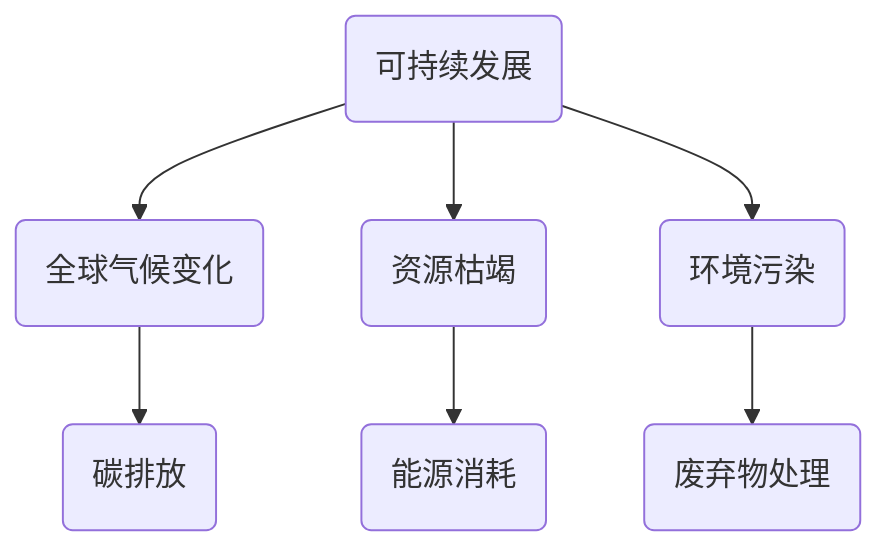
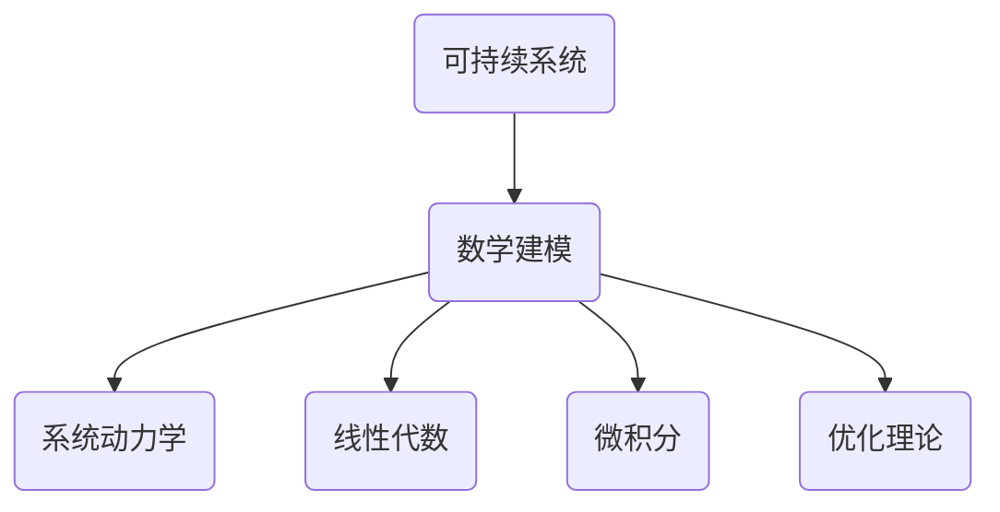

                 

### 文章标题：数学与可持续发展：可持续系统的数学建模

> 关键词：可持续发展，数学建模，系统动力学，线性代数，微积分，优化理论，资源管理，经济模型，政策评估，城市规划，农业可持续发展

> 摘要：本文探讨了数学在可持续发展中的应用，通过介绍可持续发展的背景与数学基础，对能源资源、水资源和土地资源的数学建模进行了详细分析，并探讨了可持续发展的经济数学模型和政策制定与评估方法。同时，通过实际案例展示了数学建模在可持续发展规划中的应用，为未来可持续发展提供了有益的启示。

---

## 目录大纲

### 第一部分：可持续发展的背景与数学基础

#### 第1章：可持续发展的概念与挑战

#### 第2章：可持续系统的数学建模基础

### 第二部分：可持续资源的数学建模

#### 第3章：能源资源的数学建模

#### 第4章：水资源管理数学模型

#### 第5章：土地资源利用与保护数学模型

### 第三部分：可持续发展的经济数学模型

#### 第6章：经济发展与环境保护的权衡

#### 第7章：可持续发展政策制定与评估

### 第四部分：案例分析与应用

#### 第8章：可持续发展城市规划

#### 第9章：农业可持续发展

#### 第10章：可持续发展的未来展望

### 附录

#### 附录A：常用数学建模工具与资源

#### 附录B：可持续发展相关数据获取与处理方法

#### 附录C：案例分析详细数据与代码

---

## 文章正文

### 第1章：可持续发展的概念与挑战

**背景介绍**

可持续发展作为一种理念，起源于20世纪80年代的全球环境问题。随着全球气候变化、资源枯竭和环境污染等问题的加剧，可持续发展成为各国政府、国际组织和学术界共同关注的焦点。可持续发展旨在实现经济、社会和环境的协调发展，以满足当代人的需求，不损害后代人满足自身需求的能力。

**核心概念与联系**



**核心算法原理讲解**

在可持续发展领域，常用的算法原理包括系统动力学、线性代数、微积分和优化理论。这些算法为分析可持续系统的运行机制提供了有力工具。

- **系统动力学原理**：系统动力学是研究系统内部各种因素相互作用的动态过程。在可持续发展研究中，系统动力学可以帮助分析资源、能源和环境之间的复杂关系。

- **线性代数在可持续发展中的应用**：线性代数用于处理可持续系统中的线性关系，如能源供需平衡、水资源分配等。

- **微积分与优化理论**：微积分用于分析系统的动态变化，优化理论则用于寻找最优解决方案，如碳排放量最小化、土地利用优化等。

### 第2章：可持续系统的数学建模基础

**背景介绍**

可持续系统的数学建模是可持续发展研究的重要方法。通过数学建模，可以定量分析系统的运行状态，预测未来趋势，为决策提供科学依据。

**核心概念与联系**



**核心算法原理讲解**

**能源消耗与供需平衡模型（伪代码）**

```python
# 定义能源消耗与供需平衡模型
# 输入：能源消耗量，供应量，需求量
# 输出：供需平衡状态

def energy_balance(energy_consumption, supply, demand):
    if supply >= demand:
        surplus = supply - demand
        return "供需平衡，剩余能源：" + str(surplus)
    else:
        deficit = demand - supply
        return "供需不平衡，短缺能源：" + str(deficit)
```

**数学模型和数学公式 & 详细讲解 & 举例说明**

**碳排放与减排策略（LaTeX公式）**

```latex
\begin{equation}
C = f(C_0, t, R)
\end{equation}
```

其中，$C$ 表示碳排放量，$C_0$ 表示初始碳排放量，$t$ 表示时间，$R$ 表示减排措施。

**项目实战**

**开发环境搭建**

- 安装Python环境
- 安装Jupyter Notebook
- 安装相关数学建模库，如NumPy，SciPy，Matplotlib等

**源代码详细实现和代码解读**

**能源消耗与供需平衡模型（Python代码）**

```python
import numpy as np

def energy_balance(energy_consumption, supply, demand):
    if supply >= demand:
        surplus = supply - demand
        print("供需平衡，剩余能源：", surplus)
    else:
        deficit = demand - supply
        print("供需不平衡，短缺能源：", deficit)
```

**项目小结**

本章介绍了可持续发展的概念与挑战，以及可持续系统的数学建模基础。通过伪代码、LaTeX公式和实际代码，阐述了能源消耗与供需平衡模型和碳排放与减排策略的数学原理。这些模型和方法为可持续发展提供了科学依据，有助于实现经济、社会和环境的协调发展。

---

接下来，我们将进一步探讨可持续资源的数学建模，包括能源资源、水资源和土地资源的数学建模方法。请期待下一章的内容。通过一步一步的分析推理，我们将深入理解可持续发展的数学本质，为可持续发展提供创新的解决方案。

