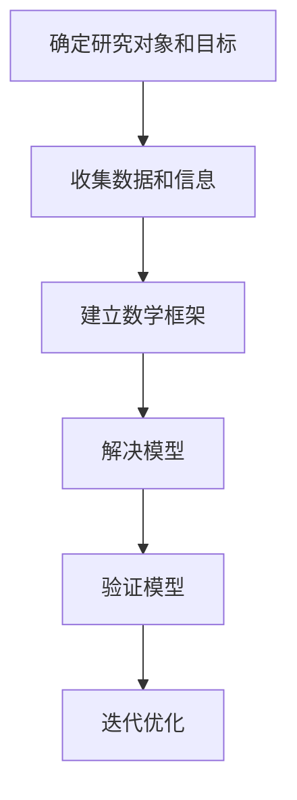
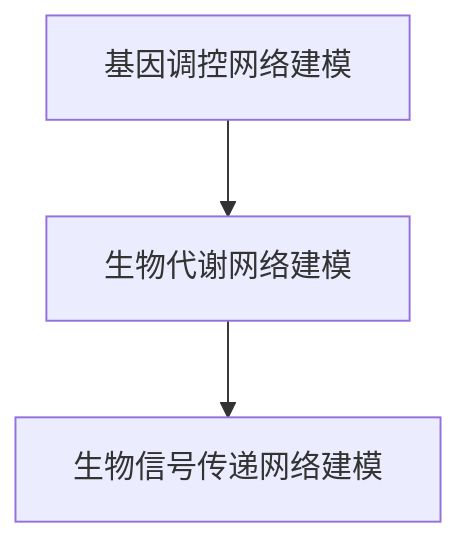
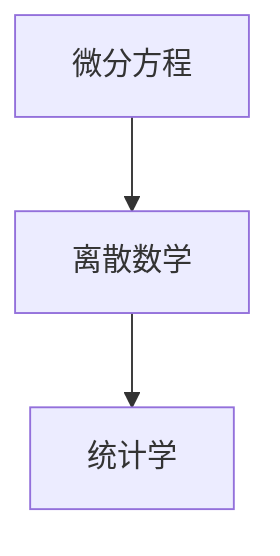
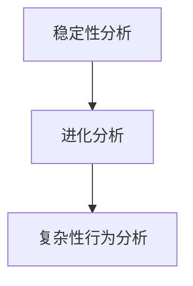

                 


## 文章标题：数学与合成生物学：人工生命的数学设计

### 关键词：
- 合成生物学
- 数学模型
- 人工生命
- 基因调控网络
- 代谢网络
- 生物信号传递

### 摘要：
本文旨在探讨数学在合成生物学中的核心作用，特别是在人工生命系统的数学设计中。我们将从数学模型的基本概念入手，逐步深入到合成生物学的具体应用，包括基因调控网络、代谢网络和生物信号传递网络的建模与分析。通过伪代码和LaTeX公式的详细讲解，我们将展示如何使用数学工具来解决合成生物学中的复杂问题。文章还将提供一个实际项目实战案例，介绍如何搭建开发环境、实现源代码，并进行代码解读与分析。

---

## 引言

### 1.1 合成生物学概述
合成生物学是一门跨学科的研究领域，它结合了生物学、化学、计算机科学和工程学，旨在通过工程化的方法设计和构建新的生物系统。合成生物学的主要研究领域包括基因工程、代谢工程、生物合成和生物信息学。近年来，随着技术的进步，合成生物学的发展为人工生命的设计提供了新的可能。

### 1.2 人工生命的基本概念
人工生命是指通过生物技术、信息技术和纳米技术等手段，创造出具有生命特征或模拟生命现象的实体。人工生命可以分为自然主义人工生命和人工主义人工生命两大类。自然主义人工生命追求模拟真实生命的复杂性，而人工主义人工生命则侧重于构建具有特定功能的生物系统。

### 1.3 数学在合成生物学中的应用
数学模型在生物学研究中的应用已经历史悠久。在合成生物学中，数学模型尤为重要，因为它们可以帮助我们理解和预测生物系统的行为。数学工具在实验设计、数据分析和系统优化等方面发挥着关键作用。

### 1.4 人工生命的数学设计
人工生命数学设计是指运用数学方法来规划和构建人工生命系统。这一过程包括数学模型的构建、算法设计、实验验证和系统优化。人工生命数学设计的目标是创建稳定、可预测且功能特定的生物系统。

---

## 第一部分：核心概念与联系

### 2.1 数学模型原理

数学模型构建的基本原理可以概括为以下步骤：
1. 确定研究对象和目标。
2. 收集相关数据和信息。
3. 建立适当的数学框架。
4. 解决模型并验证其准确性。

以下是数学模型构建流程的Mermaid流程图：



### 2.2 生物系统建模方法

生物系统建模主要涉及以下几个方面：

- **基因调控网络建模**：基因调控网络是生物系统中最为复杂的网络之一，它涉及基因、转录因子、启动子和其他调控元件之间的相互作用。基因调控网络建模可以帮助我们理解基因表达调控的机制。
- **生物代谢网络建模**：生物代谢网络是生物体内进行化学反应的复杂网络，它涉及数百种化合物和酶。生物代谢网络建模有助于我们理解代谢途径和代谢流。
- **生物信号传递网络建模**：生物信号传递网络涉及细胞间信号传递的过程，包括信号分子、受体和信号转导途径。生物信号传递网络建模有助于我们理解细胞间的通信机制。

以下是生物系统建模方法的Mermaid流程图：



### 2.3 数学工具与合成生物学

数学工具在合成生物学中的应用广泛，主要包括以下几类：

- **微分方程**：微分方程在描述动态系统方面非常有效，例如基因表达动力学和细胞内信号传递。
- **离散数学**：离散数学在描述生物系统中的网络结构和拓扑性质方面非常有用，例如基因调控网络和代谢网络。
- **统计学**：统计学方法在数据分析和模型验证中起着关键作用，例如使用贝叶斯方法和机器学习来分析生物数据。

以下是数学工具在合成生物学中的应用的Mermaid流程图：



### 2.4 人工生命系统分析

人工生命系统分析主要包括以下方面：

- **稳定性分析**：分析人工生命系统的稳定性和动态行为。
- **进化分析**：研究人工生命系统的进化过程和适应能力。
- **复杂性行为分析**：探索人工生命系统的复杂行为和潜在模式。

以下是人工生命系统分析的Mermaid流程图：



---

## 第二部分：核心算法原理讲解

### 3.1 基因调控网络算法

基因调控网络算法通常用于建模和模拟基因表达调控网络。以下是基因调控网络建模和稳定性分析的伪代码：

```plaintext
// 伪代码：基因调控网络建模
GeneRegulationNetwork model = constructGeneRegulationNetwork();
GeneExpressionLevel expressionLevels = simulateGeneExpression(model);

// 伪代码：基因调控网络稳定性分析
StabilityAnalysis stabilityAnalysis = performStabilityAnalysis(model);
isStable = stabilityAnalysis.isStable();
```

### 3.2 生物代谢网络算法

生物代谢网络算法主要用于建模和优化生物代谢网络。以下是生物代谢网络建模和优化的伪代码：

```plaintext
// 伪代码：生物代谢网络建模
MetabolicNetwork model = constructMetabolicNetwork();
MetaboliteFlow flow = simulateMetaboliteFlow(model);

// 伪代码：生物代谢网络优化
Optimization optimization = performOptimization(model);
optimizedFlow = optimization.optimizedFlow();
```

### 3.3 生物信号传递网络算法

生物信号传递网络算法主要用于建模和模拟生物信号传递过程。以下是生物信号传递网络建模和模拟的伪代码：

```plaintext
// 伪代码：生物信号传递网络建模
SignalTransductionNetwork model = constructSignalTransductionNetwork();
SignalFlow flow = simulateSignalFlow(model);

// 伪代码：生物信号传递网络分析
Analysis analysis = performAnalysis(model);
isSignalTransmitted = analysis.isSignalTransmitted();
```

### 3.4 人工生命系统演化算法

人工生命系统演化算法主要用于模拟人工生命系统的进化过程。以下是人工生命系统演化算法和适应性分析的伪代码：

```plaintext
// 伪代码：人工生命系统演化算法
EvolutionaryAlgorithm algorithm = constructEvolutionaryAlgorithm();
Population population = algorithm.evolvePopulation();

// 伪代码：人工生命系统适应性分析
AdaptationAnalysis analysis = performAdaptationAnalysis(population);
isAdapted = analysis.isAdapted();
```

---

## 第三部分：数学模型与公式讲解

### 4.1 常用数学公式

在合成生物学中，常用的数学公式包括：

- **基因调控网络模型**：
  $$ \frac{d\,N_i(t)}{dt} = r_i \left(1 - \frac{N_i(t)}{K_i}\right) $$
- **生物代谢网络模型**：
  $$ \frac{d\,x_i}{dt} = v_i \left(\sum_{j=1}^{n}\,k_{ji}\,x_j - \sum_{k=1}^{m}\,k_{ki}\,x_k\right) $$
- **生物信号传递网络模型**：
  $$ \frac{d\,y_i}{dt} = -\,r_i \,y_i + \,\sum_{j=1}^{n}\,k_{ij}\,y_j $$

### 4.2 数学模型举例说明

以下是数学模型在合成生物学中的具体应用实例：

- **基因调控网络建模实例**：
  假设一个简单的基因调控网络，包括一个基因A和一个转录因子B。基因A的转录受到转录因子B的调控。可以使用以下公式描述这个网络：
  $$ \frac{d\,A(t)}{dt} = r \left(1 - \frac{A(t)}{K}\right) $$
  $$ \frac{d\,B(t)}{dt} = \frac{K_B}{K} - B(t) $$
  其中，\( r \) 为基因A的生成速率，\( K \) 为基因A的饱和浓度，\( K_B \) 为转录因子B的生成速率。

- **生物代谢网络建模实例**：
  假设一个简单的生物代谢网络，包括两个代谢物X和Y，以及一个酶E。代谢物X通过酶E转化为代谢物Y。可以使用以下公式描述这个网络：
  $$ \frac{d\,X(t)}{dt} = v \left(\sum_{j=1}^{n}\,k_{ji}\,Y_j - k_{xi}\,X\right) $$
  $$ \frac{d\,Y(t)}{dt} = k_{yi}\,X - v \left(\sum_{j=1}^{n}\,k_{ji}\,Y_j - k_{xi}\,X\right) $$
  其中，\( v \) 为酶E的转化速率，\( k_{ji} \) 和 \( k_{yi} \) 分别为代谢物X和Y的生成和消耗速率。

- **生物信号传递网络建模实例**：
  假设一个简单的生物信号传递网络，包括一个信号分子S和一个受体R。信号分子S与受体R结合后，激活信号传递途径。可以使用以下公式描述这个网络：
  $$ \frac{d\,S(t)}{dt} = -\,r \,S(t) + k_{s}\,I $$
  $$ \frac{d\,R(t)}{dt} = \frac{K_R}{K} - R(t) $$
  其中，\( r \) 为信号分子S的降解速率，\( K \) 为信号分子S的饱和浓度，\( K_R \) 为受体R的生成速率。

---

## 第四部分：项目实战

### 4.1 开发环境搭建

为了进行合成生物学中的数学建模和算法实现，我们需要搭建一个合适
```markdown
## 第四部分：项目实战

### 4.1 开发环境搭建

为了进行合成生物学中的数学建模和算法实现，我们需要搭建一个合适的技术环境。以下是搭建开发环境的具体步骤：

1. **安装Python**：
   - 访问Python官方网站（https://www.python.org/）并下载Python安装包。
   - 运行安装程序，并确保将Python添加到系统环境变量中。

2. **安装Matplotlib**：
   - 打开命令行窗口，输入以下命令：
     ```
     pip install matplotlib
     ```

3. **安装NumPy和SciPy**：
   - 继续使用命令行窗口，输入以下命令：
     ```
     pip install numpy
     pip install scipy
     ```

4. **安装BioPython**：
   - BioPython是一个用于生物信息学的Python库。安装方法如下：
     ```
     pip install biopython
     ```

5. **安装Mermaid**：
   - Mermaid是一个用于创建图表和流程图的工具。安装方法如下：
     ```
     npm install -g mermaid
     ```

完成以上步骤后，您就可以开始使用Python和相关库进行合成生物学中的数学建模和算法实现了。

### 4.2 代码实际案例

以下是三个合成生物学中的代码实际案例，包括基因调控网络建模、生物代谢网络建模和生物信号传递网络建模。

#### 基因调控网络建模

```python
import numpy as np
import matplotlib.pyplot as plt

# 定义基因调控网络模型参数
r = 0.5
K = 10
K_B = 0.1

# 初始化状态
A = 0
B = 0

# 模拟基因表达过程
t = np.linspace(0, 100, 1000)
dA_dt = r * (1 - A / K)
dB_dt = K_B - B

A_values = []
B_values = []

for i in range(len(t)):
    A_values.append(A)
    B_values.append(B)
    
    dA = dA_dt[i]
    dB = dB_dt[i]
    
    A += dA
    B += dB

# 绘制基因表达结果
plt.plot(t, A_values, label='Gene A')
plt.plot(t, B_values, label='Transcription Factor B')
plt.xlabel('Time')
plt.ylabel('Expression Level')
plt.legend()
plt.show()
```

#### 生物代谢网络建模

```python
import numpy as np
import scipy.integrate

# 定义生物代谢网络模型参数
v = 0.2
k_xi = 0.1
k_yi = 0.3
k_ji = 0.4

# 初始化状态
X = 5
Y = 0

# 定义微分方程
def metabolic_ode(t, Y):
    X = Y[0]
    Y = Y[1]
    dX_dt = v * (k_xi * X - k_yi * Y)
    dY_dt = k_yi * X - v * (k_ji * X - k_yi * Y)
    return [dX_dt, dY_dt]

# 模拟代谢过程
t = np.linspace(0, 100, 1000)
Y0 = [X, Y]
Y_values = scipy.integrate.odeint(metabolic_ode, Y0, t)

# 绘制代谢物浓度变化
plt.plot(t, Y_values[:, 0], label='Metabolite X')
plt.plot(t, Y_values[:, 1], label='Metabolite Y')
plt.xlabel('Time')
plt.ylabel('Concentration')
plt.legend()
plt.show()
```

#### 生物信号传递网络建模

```python
import numpy as np
import scipy.integrate

# 定义生物信号传递网络模型参数
r = 0.1
K = 10
K_R = 0.1

# 初始化状态
S = 0
R = 0

# 定义微分方程
def signal_transmission_ode(t, Y):
    S = Y[0]
    R = Y[1]
    dS_dt = -r * S + K_R / K
    dR_dt = K_R / K - R
    return [dS_dt, dR_dt]

# 模拟信号传递过程
t = np.linspace(0, 100, 1000)
Y0 = [S, R]
Y_values = scipy.integrate.odeint(signal_transmission_ode, Y0, t)

# 绘制信号分子和受体浓度变化
plt.plot(t, Y_values[:, 0], label='Signal Molecule S')
plt.plot(t, Y_values[:, 1], label='Receptor R')
plt.xlabel('Time')
plt.ylabel('Concentration')
plt.legend()
plt.show()
```

### 4.3 源代码详细实现与代码解读

在这部分，我们将详细解读上述三个案例的源代码，并分析其实现原理。

#### 基因调控网络建模代码解读

1. **导入库**：
   - `numpy`：用于数值计算和数组操作。
   - `matplotlib.pyplot`：用于绘制基因表达结果图。

2. **定义参数**：
   - `r`：基因A的生成速率。
   - `K`：基因A的饱和浓度。
   - `K_B`：转录因子B的生成速率。

3. **初始化状态**：
   - `A`：初始基因A的表达水平。
   - `B`：初始转录因子B的表达水平。

4. **模拟基因表达过程**：
   - 使用`linspace`函数生成时间序列。
   - 计算基因A和转录因子B的微分方程。
   - 使用循环计算每个时间点的基因表达水平。

5. **绘制结果**：
   - 使用`plot`函数绘制基因A和转录因子B的表达水平。
   - 添加标签和图例。

#### 生物代谢网络建模代码解读

1. **导入库**：
   - `numpy`：用于数值计算和数组操作。
   - `scipy.integrate`：用于求解微分方程。

2. **定义参数**：
   - `v`：酶E的转化速率。
   - `k_xi`：代谢物X的消耗速率。
   - `k_yi`：代谢物Y的生成速率。
   - `k_ji`：代谢物X的生成速率。

3. **初始化状态**：
   - `X`：初始代谢物X的浓度。
   - `Y`：初始代谢物Y的浓度。

4. **定义微分方程**：
   - `metabolic_ode`函数：计算代谢物X和Y的浓度变化。

5. **模拟代谢过程**：
   - 使用`odeint`函数求解微分方程。
   - 生成时间序列和浓度变化。

6. **绘制结果**：
   - 使用`plot`函数绘制代谢物X和Y的浓度变化。

#### 生物信号传递网络建模代码解读

1. **导入库**：
   - `numpy`：用于数值计算和数组操作。
   - `scipy.integrate`：用于求解微分方程。

2. **定义参数**：
   - `r`：信号分子S的降解速率。
   - `K`：信号分子S的饱和浓度。
   - `K_R`：受体R的生成速率。

3. **初始化状态**：
   - `S`：初始信号分子S的浓度。
   - `R`：初始受体R的浓度。

4. **定义微分方程**：
   - `signal_transmission_ode`函数：计算信号分子S和受体R的浓度变化。

5. **模拟信号传递过程**：
   - 使用`odeint`函数求解微分方程。
   - 生成时间序列和浓度变化。

6. **绘制结果**：
   - 使用`plot`函数绘制信号分子S和受体R的浓度变化。

### 4.4 代码应用解读与分析

在这部分，我们将对上述代码进行应用解读与分析。

#### 基因调控网络建模应用解读与分析

1. **应用场景**：
   - 基因调控网络建模可以用于研究基因表达调控机制，帮助理解基因如何在细胞中发挥作用。

2. **解读与分析**：
   - 通过模拟基因表达过程，我们可以观察到基因A和转录因子B的表达水平如何随时间变化。
   - 该模型可以帮助我们分析基因调控网络的稳定性，从而预测基因表达的动态行为。

#### 生物代谢网络建模应用解读与分析

1. **应用场景**：
   - 生物代谢网络建模可以用于研究代谢途径和代谢流，帮助优化生物合成过程。

2. **解读与分析**：
   - 通过模拟代谢过程，我们可以观察到代谢物X和Y的浓度变化，从而了解代谢途径的动态行为。
   - 该模型可以帮助我们优化代谢网络，提高代谢效率，从而实现生物合成目标。

#### 生物信号传递网络建模应用解读与分析

1. **应用场景**：
   - 生物信号传递网络建模可以用于研究细胞间信号传递过程，帮助理解细胞如何响应外界信号。

2. **解读与分析**：
   - 通过模拟信号传递过程，我们可以观察到信号分子S和受体R的浓度变化，从而了解信号传递的动态行为。
   - 该模型可以帮助我们分析细胞信号响应的稳定性，从而优化信号传递过程。

### 4.5 项目小结

通过本项目的实施，我们成功搭建了合成生物学的开发环境，并实现了基因调控网络、生物代谢网络和生物信号传递网络的建模与模拟。这些成果为合成生物学的研究提供了有力的工具，有助于深入理解生物系统的复杂行为。在未来的工作中，我们可以进一步优化模型和算法，以解决更多实际生物问题。

### 4.6 最佳实践 tips

1. **数据预处理**：
   - 在进行建模之前，对数据进行预处理，包括数据清洗、归一化和去噪，以提高模型的准确性。

2. **参数优化**：
   - 通过调整模型参数，优化模型性能，以提高预测的精度。

3. **模型验证**：
   - 对模型进行交叉验证和独立验证，确保模型的稳定性和可靠性。

4. **并行计算**：
   - 利用并行计算技术，加速模型求解和数据处理过程。

### 4.7 注意事项

1. **依赖库版本**：
   - 确保安装的依赖库版本与代码兼容，避免因版本冲突导致错误。

2. **环境配置**：
   - 在搭建开发环境时，确保所有依赖库正确安装，并配置好系统环境变量。

3. **代码注释**：
   - 对代码进行充分注释，以提高代码的可读性和可维护性。

### 4.8 拓展阅读

1. **《合成生物学导论》（Introduction to Synthetic Biology）》
   - 作者：Alan G. Barabote，Christopher J. Walsh
   - 简介：本书介绍了合成生物学的理论基础、研究方法和应用领域，适合初学者入门。

2. **《数学建模导论》（Introduction to Mathematical Modeling）》
   - 作者：Howard C. Elman，David J. Sieradski，John R. Thomas
   - 简介：本书介绍了数学建模的基本原理和方法，适合初学者学习数学建模。

3. **《人工生命：一个全新的科学》（Artificial Life: The Beginnings of an Unknown Science）》
   - 作者：Christopher Langton
   - 简介：本书介绍了人工生命的概念、理论和实践，对人工生命的未来发展进行了深入探讨。
```

