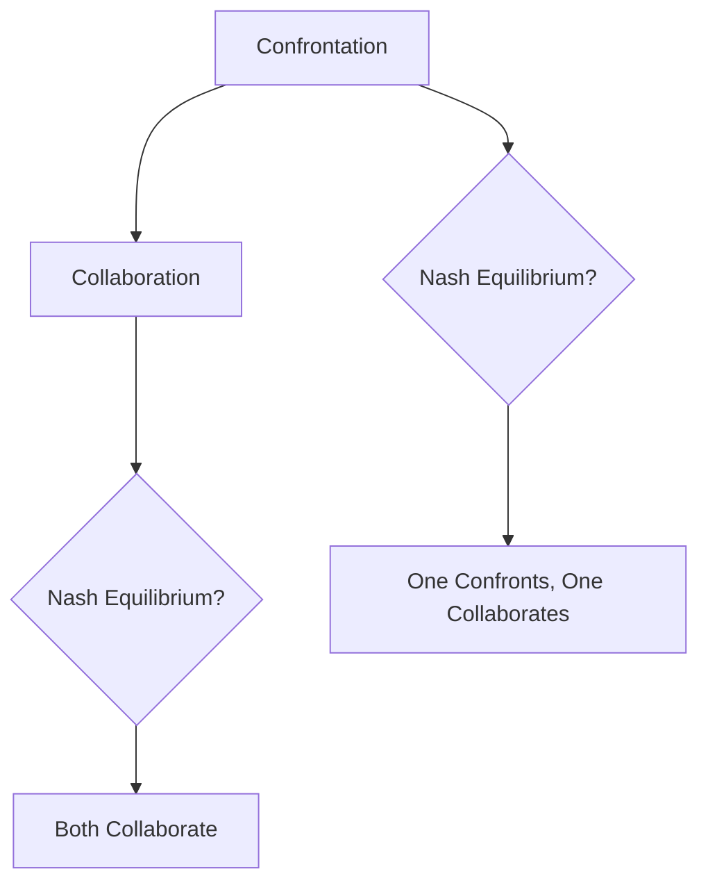

                 


### 1.1 What is Peace Studies?

Peace studies is an interdisciplinary field that seeks to understand, prevent, and resolve conflicts, and to promote peace and social justice. It encompasses a wide range of topics, including conflict analysis, conflict resolution, peacebuilding, and peace education. The field is grounded in the belief that peace is a necessary condition for human development and well-being, and that it can be achieved through deliberate efforts and sustained engagement.

#### Definition and Scope

At its core, peace studies is concerned with the study of peace processes and the conditions that enable or obstruct peace. This includes examining the underlying causes of conflicts, the dynamics of conflict escalation and de-escalation, and the strategies and practices employed in conflict resolution and peacebuilding efforts. The field draws on insights from various disciplines, such as political science, sociology, psychology, economics, and international relations, to provide a comprehensive understanding of peace and conflict.

#### History and Development

The origins of peace studies can be traced back to the early 20th century, with the establishment of peace research institutions and the emergence of peace movements in response to World War I and other global conflicts. Over time, the field has evolved to address the changing nature of conflicts and the increasing complexity of global challenges. In the post-Cold War era, peace studies has gained prominence as a field of study and practice, with a growing emphasis on peacebuilding, human security, and sustainable development.

In recent years, the field has expanded to incorporate new methodologies and perspectives, such as social network analysis, computational modeling, and human rights studies. This has led to a more nuanced understanding of peace and conflict, and to the development of innovative approaches for promoting peace and resolving conflicts.

### 1.2 Mathematics in Peace Studies

Mathematics has long been recognized as a powerful tool for understanding complex systems and phenomena. In the field of peace studies, mathematics plays a crucial role in modeling and analyzing conflicts, and in informing strategies for conflict resolution and peacebuilding. The use of mathematical models in peace studies can provide valuable insights into the dynamics of conflicts, help identify key factors and processes, and suggest potential solutions.

#### The Role of Mathematics in Peace Research

Mathematics is employed in peace research in several key ways:

1. **Modeling Conflict Dynamics**: Mathematical models can be used to simulate the behavior of conflict actors, the evolution of conflicts over time, and the impact of various strategies on conflict outcomes. These models can help researchers and policymakers understand the underlying mechanisms driving conflicts and evaluate the effectiveness of different approaches to conflict resolution.

2. **Analyzing Conflict Data**: Statistical methods and data analysis techniques from mathematics can be used to analyze conflict data, identify patterns and trends, and test hypotheses about the causes and consequences of conflicts.

3. **Optimizing Conflict Resolution Strategies**: Mathematical optimization techniques can be used to identify the most effective strategies for resolving conflicts, taking into account various constraints and objectives. This can inform the development of targeted interventions and policies aimed at promoting peace.

4. **Exploring Social Networks**: Graph theory and network analysis, which are branches of mathematics, can be used to study the structure and dynamics of social networks, including the relationships between conflict actors and the flow of information and resources. This can provide insights into the social processes that underpin conflicts and peacebuilding efforts.

#### The Importance of Mathematical Modeling

Mathematical modeling is essential to the field of peace studies for several reasons:

1. **Clarity and Precision**: Mathematical models provide a clear and precise way to express complex concepts and relationships, facilitating better understanding and communication among researchers, policymakers, and other stakeholders.

2. **Objectivity and Testability**: Mathematical models are based on empirical data and rigorous logic, allowing for objective analysis and the formulation of testable hypotheses. This can enhance the credibility and reliability of peace research findings.

3. **Generalization and Prediction**: Mathematical models can be generalized to different contexts and used to predict the behavior of complex systems. This can help policymakers anticipate potential conflicts and design effective strategies for preventing and resolving them.

4. **Innovation and Integration**: The use of mathematical modeling in peace studies encourages the integration of diverse disciplines and perspectives, fostering innovation and the development of new approaches to conflict analysis and resolution.

In conclusion, mathematics is a fundamental tool for advancing the field of peace studies. By providing a quantitative framework for understanding and addressing conflicts, mathematical modeling can contribute to the achievement of lasting peace and social justice.

### 1.3 Mathematical Foundations

To engage effectively with the mathematical models used in peace studies, it is essential to have a solid foundation in basic mathematical concepts and theories. This section will outline the key areas of mathematics that are relevant to peace research, providing a concise overview of each and highlighting their significance in the field.

#### Basic Mathematical Concepts

1. **Set Theory**: Set theory is the foundation of modern mathematics, providing the basic language and tools for describing and manipulating collections of objects. In peace studies, set theory is used to define groups of conflict actors, alliances, and coalitions, and to analyze their interactions.

2. **Logic and Propositional Calculus**: Logic is the study of reasoning and inference. Propositional calculus, a branch of logic, deals with propositions and their logical relationships. It is used to formalize arguments and analyze the validity of claims in peace studies.

3. **Probability Theory**: Probability theory provides a framework for quantifying uncertainty and making predictions based on limited information. In peace studies, probability is used to assess the likelihood of conflict outbreaks, the effectiveness of conflict resolution strategies, and the impact of various interventions.

4. **Statistics**: Statistics involves the collection, analysis, interpretation, and presentation of data. Statistical methods are used to analyze conflict data, identify patterns and trends, and test hypotheses about the causes and consequences of conflicts.

#### Mathematical Theories

1. **Game Theory**: Game theory is the study of strategic decision-making in situations where the outcomes of one's choices depend on the choices of others. It is a powerful tool for analyzing conflicts and conflict resolution processes. Key concepts in game theory include strategies, payoffs, Nash equilibrium, and cooperative and non-cooperative games.

2. **Graph Theory**: Graph theory is the study of structures made up of nodes (vertices) connected by edges (arcs). It is used to model social networks, alliances, and conflict networks, and to analyze the flow of information, resources, and influence between actors.

3. **Optimization Theory**: Optimization theory involves finding the maximum or minimum value of a function subject to certain constraints. It is used to identify the most effective strategies for conflict resolution and peacebuilding, taking into account various objectives and constraints.

4. **Network Analysis**: Network analysis is a multidisciplinary approach that uses graph theory, statistics, and other tools to study the structure, dynamics, and function of networks. In peace studies, network analysis is used to understand the social processes that underpin conflicts and peacebuilding efforts.

#### Pre-requisites for Mathematical Modeling in Peace Studies

To effectively apply mathematical modeling in peace studies, researchers and practitioners need to have a strong understanding of these foundational concepts and theories. This includes:

- **Mathematical Maturity**: The ability to think logically, formulate problems mathematically, and derive solutions from mathematical principles.

- **Statistical Literacy**: The ability to analyze and interpret data, understand statistical methods, and use statistical software.

- **Computational Skills**: The ability to use computational tools, such as spreadsheets, programming languages, and simulation software, to implement and analyze mathematical models.

- **Interdisciplinary Knowledge**: A broad understanding of peace studies, including the key concepts, theories, and methodologies, to integrate mathematical models into the broader context of peace research.

In summary, a solid foundation in basic mathematical concepts and theories is essential for engaging in mathematical modeling in peace studies. By developing these skills, researchers and practitioners can enhance their ability to analyze conflicts, design effective strategies, and contribute to the promotion of peace and social justice.

### 2.1 Game Theory in Peace Negotiations

Game theory is a branch of mathematics that deals with the analysis of strategic interactions among rational decision-makers. It provides a framework for understanding how individuals or organizations make decisions in situations where the outcome of one's choice depends on the choices of others. In the context of peace negotiations, game theory can be used to analyze the strategies and decisions of conflicting parties, predict the possible outcomes of negotiations, and identify strategies that may lead to a favorable resolution.

#### Concepts and Applications

1. **Strategies and Payoffs**: In game theory, a strategy is a plan of action that an individual or group chooses to pursue. Payoffs represent the outcomes or benefits that result from the combination of strategies chosen by the participants. A payoff matrix is a table that summarizes the payoffs for each possible combination of strategies.

2. **Nash Equilibrium**: A Nash equilibrium is a situation in which each participant in a game is making the best possible decision, given the decisions of the other participants. In other words, no player has an incentive to unilaterally change their strategy, as this would not improve their own payoff.

3. **Cooperative and Non-Cooperative Games**: Cooperative games involve collaborations among players to achieve a common goal, while non-cooperative games involve self-interested decision-making. In peace negotiations, cooperative approaches, such as negotiation and bargaining, are often contrasted with non-cooperative approaches, such as competitive strategies and power politics.

#### Mermaid Diagram of Key Models

To illustrate the application of game theory in peace negotiations, we can use a Mermaid diagram to visualize key models. The following diagram represents a simple two-player cooperative game with two possible strategies for each player: "Confrontation" and "Collaboration."



In this diagram, the nodes represent the strategies of the two players, and the edges represent the possible combinations of strategies. The circles represent Nash equilibria, indicating the stable outcomes where neither player has an incentive to deviate from their chosen strategy.

#### Example: Prisoner's Dilemma

One of the most well-known models in game theory is the Prisoner's Dilemma, which illustrates the tension between individual and collective interests. In this scenario, two prisoners are being interrogated separately and have the option to cooperate with each other or to betray the other. The possible outcomes and their payoffs are as follows:

- **Both Cooperate**: They receive a reduced sentence.
- **One Cooperates, One Betrays**: The cooperator receives a longer sentence, while the betrayer receives a shorter sentence.
- **Both Betray**: They both receive a moderate sentence.

The payoff matrix for the Prisoner's Dilemma is as follows:

|           | Player 2 Cooperates | Player 2 Betrays |
|-----------|----------------------|------------------|
| Player 1 Cooperates | (R, R) = Reduced Sentence | (S, T) = Short Sentence, Long Sentence |
| Player 1 Betrays    | (T, S) = Long Sentence, Short Sentence | (P, P) = Moderate Sentence |

In this game, the Nash equilibrium is for both players to betray each other, as this is the best response to any strategy the other player might choose. However, from a collective perspective, the best outcome is for both players to cooperate, even though this is not a stable equilibrium.

#### Example: Battle of the Sexes

Another classic example is the Battle of the Sexes, which illustrates the conflict between individual preferences and social norms. In this scenario, two individuals, such as a husband and wife, must choose between two activities that they both enjoy but are not equally interested in. The possible outcomes and their payoffs are as follows:

- **Both Attend Activity A**: They both get what they want, but it is not their top preference.
- **Both Attend Activity B**: They both get what they want, but it is not their top preference.
- **One Attends Activity A, One Attends Activity B**: One person gets what they want, while the other does not.

The payoff matrix for the Battle of the Sexes is as follows:

|           | Player 2 Chooses Activity A | Player 2 Chooses Activity B |
|-----------|-------------------------------|-----------------------------|
| Player 1 Chooses Activity A | (C, C) = Activity A | (D, D) = Activity B |
| Player 1 Chooses Activity B | (D, C) = Activity B | (C, C) = Activity A |

In this game, there are two Nash equilibria: both choosing Activity A and both choosing Activity B. The challenge is to find a strategy that leads to the outcome both players prefer, given the potential for the other player to deviate.

In conclusion, game theory provides a valuable tool for analyzing peace negotiations and understanding the strategic interactions between conflicting parties. By examining key models such as the Prisoner's Dilemma and the Battle of the Sexes, we can gain insights into the dynamics of conflict and the potential for cooperation and conflict resolution. These insights can inform the design of more effective strategies for promoting peace and resolving conflicts.

### 2.2 Conflict Resolution Models

Conflict resolution models are analytical tools that help in understanding the processes and mechanisms of resolving conflicts. These models are designed to simulate the interactions between conflicting parties, analyze the factors that influence conflict resolution, and suggest strategies for achieving peaceful outcomes. In this section, we will explore different types of conflict resolution models, including negotiation models, mediation models, and arbitration models, along with their key algorithms and implementation strategies.

#### Types of Conflict Resolution Models

1. **Negotiation Models**: Negotiation models focus on the bargaining process between conflicting parties. These models aim to identify the strategies that parties can use to reach mutually beneficial agreements. Key concepts in negotiation models include bargaining power, negotiation tactics, and the use of intermediaries.

2. **Mediation Models**: Mediation models involve the intervention of a neutral third party, known as a mediator, who facilitates negotiations between the conflicting parties. Mediation models emphasize the role of communication, trust-building, and the exploration of various options for resolving the conflict.

3. **Arbitration Models**: Arbitration models involve the appointment of an independent arbitrator who makes a binding decision to resolve the conflict. These models are often used in cases where the parties cannot reach an agreement through negotiation or mediation. Arbitration models focus on the selection of an impartial arbitrator and the establishment of clear criteria for decision-making.

#### Detailed Explanation of Key Algorithms Using Pseudocode

Let's delve into some key algorithms used in conflict resolution models and provide pseudocode for their implementation.

**1. Negotiation Algorithm (Bargaining Process)**

```pseudocode
function negotiation算法(当事人1，当事人2)
    初始化当事人1和当事人2的偏好
    while (当事人1和当事人2的偏好差距 > 预定的最小接受值)
        当事人1提出一个出价
        当事人2接受或拒绝这个出价
        如果当事人2接受，则结束谈判并记录协议结果
        如果当事人2拒绝，则当事人2提出一个新的出价
    end while
end function
```

In this algorithm, the negotiation process continues until the parties reach a mutually acceptable agreement. The algorithm iterates through a series of offers and counteroffers, with each party seeking to maximize their own utility while considering the preferences of the other party.

**2. Mediation Algorithm (Facilitated Negotiation)**

```pseudocode
function mediation算法(当事人1，当事人2，调解人)
    调解人建立沟通渠道
    调解人促进当事人1和当事人2之间的交流
    当事人1和当事人2提出他们的诉求和需求
    调解人帮助双方理解彼此的立场
    while (当事人1和当事人2未达成协议)
        调解人提出可能的解决方案
        当事人1和当事人2讨论并评估这些方案
        如果双方对某个方案达成一致，则结束调解并记录协议结果
    end while
end function
```

In mediation, the mediator facilitates the negotiation process by helping the parties communicate effectively and explore various solutions. The mediator does not impose a decision but rather guides the parties towards an agreement that satisfies their interests.

**3. Arbitration Algorithm (Binding Decision-Making)**

```pseudocode
function arbitration算法(当事人1，当事人2，仲裁人)
    仲裁人收集并审查双方提交的证据和论据
    仲裁人根据既定的法律或规则做出裁决
    if (当事人1和当事人2接受仲裁人的裁决)
        记录裁决结果并结束仲裁过程
    else
        当事人1或当事人2可以向更高一级的仲裁机构提起上诉
    end if
end function
```

In arbitration, the arbitrator makes a final and binding decision based on the evidence and arguments presented by the parties. The algorithm ensures that the decision is fair and impartial, and that both parties have an opportunity to be heard.

#### Implementation Strategies

The implementation of conflict resolution models involves several steps, including:

1. **Problem Definition**: Clearly define the conflict and the objectives of the resolution process.
2. **Data Collection**: Gather relevant information about the parties involved, their preferences, and the context of the conflict.
3. **Model Design**: Develop a mathematical or computational model that captures the key aspects of the conflict and the resolution process.
4. **Algorithm Selection**: Choose appropriate algorithms for implementing the model, based on the specific requirements of the situation.
5. **Simulation and Analysis**: Use the model to simulate different scenarios and analyze the potential outcomes of various strategies.
6. **Decision-Making**: Based on the analysis, recommend specific strategies or actions for resolving the conflict.

In conclusion, conflict resolution models provide a systematic approach for understanding and addressing conflicts. By using algorithms to simulate and analyze the resolution process, these models can help identify effective strategies and inform decision-making in efforts to achieve peaceful outcomes. Whether through negotiation, mediation, or arbitration, the goal is to find solutions that satisfy the interests of all parties involved and promote long-term stability and peace.

### 2.3 Peacebuilding Models

Peacebuilding models are analytical frameworks designed to understand and facilitate the processes of post-conflict reconstruction and sustainable peace. These models encompass a range of strategies and activities aimed at addressing the underlying causes of conflict, rebuilding social and economic structures, and fostering a lasting peace. This section will explore key concepts and methodologies in peacebuilding models, focusing on post-conflict reconstruction and sustainable peace strategies.

#### Post-Conflict Reconstruction

Post-conflict reconstruction refers to the process of rebuilding societies and economies after a conflict has ended. This process is crucial for ensuring that the peace is durable and that the affected communities can regain stability and prosperity. Key components of post-conflict reconstruction include:

1. **Physical Reconstruction**: This involves repairing and rebuilding infrastructure such as roads, bridges, schools, hospitals, and housing. Physical reconstruction is essential for restoring normalcy and improving the quality of life for affected populations.

2. **Economic Recovery**: Economic recovery focuses on revitalizing the local economy, creating jobs, and restoring financial systems. This includes supporting small and medium-sized enterprises, promoting investment, and providing financial services to help individuals and businesses recover from the economic impacts of conflict.

3. **Social Reintegration**: Social reintegration involves the reconciliation of former combatants and the promotion of social cohesion among communities. This includes programs for disarmament, demobilization, and reintegration (DDR), as well as initiatives to address the psychosocial needs of conflict-affected populations.

4. **Institutional Strengthening**: Strengthening governmental and institutional capacities is critical for ensuring effective governance and the rule of law. This involves reforming security forces, improving public administration, and promoting transparency and accountability.

#### Sustainable Peace Strategies

Sustainable peace goes beyond the cessation of hostilities to encompass enduring political, social, and economic stability. Key strategies for achieving sustainable peace include:

1. **Political Reconciliation**: Political reconciliation involves addressing the underlying political grievances that led to the conflict. This includes dialogue and negotiation between conflicting parties, power-sharing agreements, and the establishment of inclusive governance structures.

2. **Social Integration**: Social integration aims to heal divisions and promote unity among different communities. This involves initiatives to promote social cohesion, address historical injustices, and build mutual understanding and respect between different groups.

3. **Economic Development**: Economic development is a cornerstone of sustainable peace. By fostering economic growth, creating employment opportunities, and reducing poverty, peacebuilding efforts can help prevent the recurrence of conflict.

4. **Legal and Institutional Reform**: Strengthening the legal and institutional frameworks is essential for ensuring the rule of law and protecting human rights. This includes reforming legal systems, enhancing judicial independence, and combating corruption.

5. **Capacity Building**: Building the capacity of local institutions, governments, and civil society organizations is crucial for sustaining peace efforts. This involves providing training, resources, and support to enable these actors to effectively implement peacebuilding initiatives.

#### Implementation and Challenges

Implementing peacebuilding models involves a complex and multifaceted process that requires coordination and collaboration among various stakeholders, including governments, international organizations, civil society, and local communities. Key challenges in the implementation of peacebuilding models include:

1. **Political Will and Commitment**: Achieving sustainable peace requires strong political will and commitment from all parties involved. Without this commitment, peacebuilding efforts are likely to face obstacles and setbacks.

2. **Resource Constraints**: Peacebuilding initiatives often face significant resource constraints, including funding, human resources, and technical expertise. Insufficient resources can hinder the effectiveness of peacebuilding efforts.

3. **Security Concerns**: In post-conflict settings, security concerns can pose significant challenges to peacebuilding. Ensuring the safety and protection of civilians and preventing the resurgence of conflict are critical tasks.

4. **Societal divides**: Deep-seated societal divides and mistrust can complicate peacebuilding efforts. Rebuilding trust and fostering social cohesion require time, patience, and sustained effort.

5. **Integration of Strategies**: Effective peacebuilding requires the integration of different strategies and approaches. This can be challenging, as different stakeholders may have different priorities and perspectives.

In conclusion, peacebuilding models provide a structured approach for understanding and addressing the complex challenges of post-conflict reconstruction and sustainable peace. By focusing on key areas such as physical reconstruction, economic development, political reconciliation, and social integration, peacebuilding models can contribute to the establishment of durable and inclusive peace. However, the successful implementation of these models requires strong political will, adequate resources, and coordinated efforts from various stakeholders.

### 2.4 Social Networks and Peacebuilding

The concept of social networks has gained significant traction in the field of peace studies, offering valuable insights into the dynamics of conflict and peacebuilding. Social networks are a collection of individuals or organizations (nodes) connected by relationships or interactions (edges). By examining the structure and function of social networks, researchers can gain a deeper understanding of how information, resources, and influence flow within communities and across different levels of society. This section explores the structure of social networks, analyzes the role of social networks in peacebuilding, and presents various analytical and modeling approaches used to study social networks in the context of peace and conflict.

#### The Structure of Social Networks

Social networks are characterized by several key structural properties that influence their behavior and function. These include:

1. **Density**: Density refers to the proportion of possible connections in a network that are actually present. High-density networks indicate a high degree of connectivity and collaboration, while low-density networks may indicate isolation or fragmentation.

2. **Clustering Coefficient**: The clustering coefficient measures the likelihood that two neighbors of a node are also connected. High clustering coefficients indicate tightly-knit groups or communities, while low clustering coefficients suggest a more scattered or isolated structure.

3. **Centrality**: Centrality measures the degree to which a node is connected to other nodes in the network. There are several types of centrality, including degree centrality, closeness centrality, and betweenness centrality. High centrality nodes are often key players in the network, as they have a significant impact on the flow of information and resources.

4. **Modularity**: Modularity measures the extent to which a network is divided into clusters or communities. High modularity indicates a well-defined community structure, while low modularity suggests a more interconnected and mixed network.

#### Role of Social Networks in Peacebuilding

Social networks play a critical role in peacebuilding by facilitating communication, mobilization, and coordination among individuals and groups. The following are key ways in which social networks contribute to peacebuilding:

1. **Communication and Information Flow**: Social networks enable the rapid dissemination of information, which is crucial for mobilizing support for peace initiatives, raising awareness about conflicts, and coordinating actions. Strong networks can facilitate the exchange of knowledge, best practices, and resources, promoting collective learning and innovation in peacebuilding efforts.

2. **Mobilization and Participation**: Social networks can mobilize individuals and groups to participate in peacebuilding activities, such as community meetings, dialogue sessions, and voluntary initiatives. Networks can help build trust and cooperation among diverse groups, fostering a shared sense of responsibility and collective action.

3. **Influence and Social Pressure**: Social networks can exert influence on individuals and groups, encouraging positive behaviors and discouraging negative actions. Through social pressure and peer influence, networks can promote adherence to peace agreements, peaceful conflict resolution practices, and social norms that support peace and stability.

4. **Conflict Mitigation and Resolution**: Social networks can help mitigate and resolve conflicts by providing a platform for dialogue, mediation, and negotiation. Networks can mediate disputes, facilitate the reconciliation of former adversaries, and promote social cohesion by addressing underlying grievances and fostering mutual understanding.

#### Analytical and Modeling Approaches

To study social networks in peacebuilding, researchers employ a variety of analytical and modeling approaches, including:

1. **Network Analysis**: Network analysis involves the use of various techniques to examine the structure and dynamics of social networks. This includes measuring centrality, clustering, and density, as well as identifying key nodes and communities within the network.

2. **Network Modeling**: Network modeling involves the use of mathematical and computational models to simulate the behavior of social networks and predict their outcomes. These models can help researchers understand the effects of network structure on peacebuilding processes and identify strategies for strengthening social networks to support peace.

3. **Agent-Based Modeling (ABM)**: Agent-Based Modeling is a computational approach that simulates the interactions of individual agents within a network. ABM can be used to study how individual behaviors and network structure influence peacebuilding outcomes, providing insights into the dynamics of social networks and the factors that contribute to peace and conflict.

4. **Complex Systems Analysis**: Complex systems analysis involves the study of large-scale networks and the emergence of collective behaviors and patterns. This approach can be used to understand the complex interactions between social networks, political systems, and economic factors, providing a holistic perspective on peacebuilding processes.

5. **Statistical Analysis**: Statistical analysis is used to analyze survey data and other quantitative information about social networks and peacebuilding processes. Techniques such as regression analysis and structural equation modeling can help identify relationships between social network characteristics and peacebuilding outcomes.

In conclusion, social networks are a vital component of peacebuilding, providing a framework for communication, mobilization, influence, and conflict resolution. By leveraging the structure and dynamics of social networks, researchers and practitioners can develop more effective strategies for promoting peace and resolving conflicts. Through the use of analytical and modeling approaches, social networks can be better understood and harnessed to support peacebuilding efforts at both the local and global levels.

### 2.5 Agent-Based Models in Peace Studies

Agent-Based Models (ABMs) are computational frameworks that simulate the interactions of individual agents within a social system. These models are particularly useful in peace studies for understanding the complex dynamics of social processes, such as conflict, cooperation, and peacebuilding. By capturing the individual behaviors and interactions of agents, ABMs can provide insights into how aggregate behaviors emerge from individual actions and how these behaviors can influence broader social outcomes.

#### Introduction to Agent-Based Modeling

Agent-Based Modeling involves several key components:

1. **Agents**: Agents are the individual entities within the model that interact with each other and with their environment. Each agent has its own set of attributes, such as beliefs, preferences, and rules for behavior.

2. **Environments**: The environment in which the agents operate is another critical component of an ABM. It can include physical elements, such as geographic locations, as well as social and economic factors.

3. **Rules**: Agents follow a set of rules or behaviors that determine how they interact with other agents and their environment. These rules can be based on simple heuristics or more complex decision-making algorithms.

4. **Simulation**: The simulation process involves running the model over time, allowing agents to interact according to their rules and evolve in response to their environment. This enables researchers to observe the emergence of patterns and behaviors at the aggregate level.

#### Applications in Peace and Conflict Research

ABMs have been applied to a wide range of peace and conflict research questions, including:

1. **Conflict Elicitation**: ABMs can simulate the emergence of conflicts by modeling the behavior of individuals and groups under different conditions. For example, researchers can investigate how factors such as resource scarcity, ethnic tensions, or political exclusion can lead to conflict.

2. **Cooperative Behavior**: ABMs can explore how cooperation emerges and is sustained in social systems. By modeling the strategies that agents use to cooperate and the incentives they have for doing so, researchers can gain insights into the conditions that promote or hinder cooperation in peacebuilding efforts.

3. **Peacebuilding Strategies**: ABMs can be used to test different peacebuilding strategies and assess their potential impact. For instance, researchers can simulate the effects of community dialogue programs, disarmament and demobilization initiatives, or economic development projects to understand how these interventions might affect social cohesion and conflict levels.

4. **Election Outcomes**: In the context of peacebuilding, ABMs can model the dynamics of electoral processes and their potential to influence peace and stability. By simulating different electoral scenarios and the behaviors of political actors, researchers can assess the impact of electoral rules, campaign strategies, and voter behavior on electoral outcomes and political stability.

#### Example: Modeling Ethnic Conflict

To illustrate the use of ABMs in peace studies, let's consider a simple example of modeling ethnic conflict. In this model, agents represent individuals from different ethnic groups who live in a shared environment. The agents have attributes such as ethnicity, resource levels, and trust levels towards other agents. The environment includes resources that agents compete for and a social network that represents the connections between agents.

The following pseudocode outlines the basic structure of an ABM for ethnic conflict:

```pseudocode
class Agent:
    attribute ethnicity
    attribute resource_level
    attribute trust_levels
    attribute location

function Agent_behavior(agent):
    if (resource_level is low):
        search_for_resources()
    else:
        interact_with_neighborhood()

function search_for_resources():
    move_to_a_new_location_with_resources()

function interact_with_neighborhood():
    for (neighbor in neighborhood):
        if (neighbor.ethnicity != agent.ethnicity):
            if (trust_levels[neighbor] is high):
                share_resources()
            else:
                compete_for_resources()

function share_resources():
    agent.resource_level += neighbor.resource_level
    neighbor.resource_level = 0

function compete_for_resources():
    winner = agent if (agent.resource_level > neighbor.resource_level) else neighbor
    loser.resource_level = 0
    winner.resource_level += loser.resource_level

function simulate_time_step():
    for (agent in agents):
        Agent_behavior(agent)
    update_social_network()

function update_social_network():
    for (agent in agents):
        for (neighbor in neighborhood):
            if (neighbor is nearby):
                update_trust_level(agent, neighbor)

function update_trust_level(agent, neighbor):
    if (agent and neighbor have recently shared resources):
        agent.trust_levels[neighbor] += 1
    else if (agent and neighbor have recently competed for resources):
        agent.trust_levels[neighbor] -= 1
    agent.trust_levels[neighbor] = max(0, min(1, agent.trust_levels[neighbor]))
```

In this model, agents interact with their neighbors based on their resource levels and trust levels. If agents share resources, their trust levels increase, which may reduce the likelihood of future conflicts. Conversely, if agents compete for resources, their trust levels decrease, potentially leading to conflict. The model can simulate how these interactions evolve over time, providing insights into the dynamics of ethnic conflict and the role of trust in maintaining or destabilizing social order.

In conclusion, Agent-Based Models are a powerful tool for understanding the complex social processes underlying peace and conflict. By simulating the interactions of individual agents and observing the emergent behaviors and patterns, ABMs can help researchers explore the conditions that promote peace and stability, and develop more effective strategies for peacebuilding.

### 3.1 Case Study 1: The Conflict in Colombia

The conflict in Colombia, which lasted over 50 years, is one of the most extensive and complex armed conflicts in the Western Hemisphere. This case study will examine the historical background, the role of key actors, the main sources of conflict, and how mathematical models have been applied to understand and address the situation.

#### Historical Background

The conflict in Colombia began in the 1960s as a result of a combination of social, economic, and political factors. The country's unequal land distribution led to significant social disparities, with a small elite owning large portions of arable land while the majority of the rural population faced poverty and limited access to resources. This economic inequality, coupled with political repression and corruption, created a fertile ground for social unrest and the emergence of guerrilla groups.

The conflict escalated in the 1980s and 1990s as various factions, including the Revolutionary Armed Forces of Colombia (FARC), the National Liberation Army (ELN), and various paramilitary groups, began engaging in armed conflict with the Colombian government and each other. The conflict was further exacerbated by the presence of narcotics trafficking, which provided funding for the different factions and introduced additional external actors into the conflict.

#### Key Actors

- **Government**: The Colombian government, led by successive administrations, has been a central actor in the conflict. Efforts to counter the insurgency have included military campaigns, peace negotiations, and policies aimed at addressing the root causes of conflict.
- **FARC**: The Revolutionary Armed Forces of Colombia (FARC) is a guerrilla group that emerged in the 1960s with the goal of overthrowing the Colombian government and establishing a Marxist-Leninist state. FARC was one of the largest and most organized groups involved in the conflict.
- **ELN**: The National Liberation Army (ELN) is another guerrilla group that originated in the 1960s. Its objectives are similar to those of FARC but it has maintained a more violent and less structured approach to achieving its goals.
- **Paramilitary Groups**: Various paramilitary groups, often supported by powerful landowners and business interests, emerged as a counter-insurgency force during the 1980s and 1990s. These groups engaged in extensive violence, including human rights abuses and the displacement of large numbers of civilians.

#### Main Sources of Conflict

1. **Economic Inequality**: Uneven land distribution and economic disparities played a significant role in fueling the conflict. Rural communities faced poverty, lack of access to resources, and exploitation by large landowners, which created a fertile ground for the rise of guerrilla groups.
2. **Political Repression**: The Colombian government's repressive policies, including the suppression of political dissent and the persecution of activists and union leaders, further exacerbated tensions.
3. **Narcotics Trafficking**: The involvement of narcotics trafficking in the conflict added another layer of complexity. The proceeds from the drug trade provided significant funding for the armed groups, allowing them to maintain and expand their operations.
4. **Land Disputes**: Conflicts over land ownership and resource control were a key source of tension. The armed groups, as well as the paramilitary groups, engaged in violent disputes over territory and access to natural resources.
5. **Social Disparities**: Ethnic and social inequalities, including discrimination against indigenous and Afro-Colombian communities, also contributed to the conflict.

#### Mathematical Modeling and Analysis

Mathematical models have been used to analyze various aspects of the Colombian conflict, providing insights into the dynamics and potential outcomes of the conflict. Here are some key applications of mathematical modeling in this context:

1. **Game Theory**: Game theory has been employed to analyze the strategic interactions between the different actors in the conflict. Models such as the prisoner's dilemma and the battle of the sexes have been used to understand the incentives and behavior of the different groups involved in the conflict.
   
2. **Agent-Based Models (ABM)**: ABMs have been used to simulate the interactions of various actors within the conflict, including the government, guerrilla groups, paramilitary forces, and civilians. These models can help identify the factors that contribute to the persistence of conflict and the potential for peace.

3. **Network Analysis**: Social network analysis has been used to study the relationships and alliances between different actors in the conflict. This has helped identify key players and their influence within the conflict network, as well as the flow of information, resources, and influence.

4. **Optimization Models**: Optimization models have been used to analyze the effectiveness of different strategies for addressing the conflict, including peace negotiations, disarmament programs, and development initiatives. These models can help identify the most efficient ways to allocate resources and design policies to promote peace.

In conclusion, the conflict in Colombia is a complex and multifaceted issue that has been studied using various mathematical models. These models have provided valuable insights into the underlying causes and dynamics of the conflict, as well as potential strategies for achieving a durable peace. By understanding the role of economic, social, political, and other factors through mathematical analysis, policymakers and peacebuilders can develop more effective approaches to resolving the conflict and promoting stability in Colombia.

### 3.2 Case Study 2: The Israeli-Palestinian Conflict

The Israeli-Palestinian conflict is one of the most enduring and complex conflicts in the world, spanning decades and involving numerous political, social, and economic dimensions. This case study will delve into the historical context, key actors, and the various stages of the conflict, while also examining how mathematical models have been utilized to analyze and potentially resolve the conflict.

#### Historical Background

The Israeli-Palestinian conflict has its roots in the early 20th century, driven by competing national narratives and aspirations. The conflict's origins can be traced to the Balfour Declaration of 1917, which promised British support for a national home for the Jewish people in what was then the Ottoman Empire. Following World War I, the League of Nations approved the British Mandate for Palestine, which was intended to facilitate the establishment of a Jewish national home while protecting the civil and religious rights of the non-Jewish population.

The creation of the state of Israel in 1948 led to the first Arab-Israeli war, resulting in significant displacement and the establishment of separate Jewish and Arab states. Subsequent decades have seen intermittent hostilities, including the Six-Day War of 1967, the Yom Kippur War of 1973, and numerous smaller conflicts and violent confrontations. The conflict has also involved ongoing negotiations and peace efforts, which have often failed to produce a lasting resolution.

#### Key Actors

1. **Israel**: As a sovereign state established in 1948, Israel has been a central actor in the conflict. Its government, representing the Jewish population, has pursued policies aimed at maintaining its security, expanding its territory, and establishing a stable political and economic environment.
2. **Palestinian National Authority (PNA)**: Representing the Palestinian people, the PNA has sought recognition as an independent state and the establishment of a viable, sovereign Palestinian state in the occupied territories, including the West Bank and Gaza Strip.
3. **Various Palestinian Militant Groups**: Groups such as Hamas and Palestinian Islamic Jihad have engaged in violent confrontations with Israel, opposing the occupation and seeking to achieve their goals through armed resistance.
4. **International Community**: The involvement of various international actors, including the United Nations, the United States, the European Union, and other countries, has shaped the conflict's dynamics and the outcomes of diplomatic efforts.

#### Stages of the Conflict

1. **1948-1967**: The initial phase of the conflict involved the establishment of Israel and subsequent hostilities, including the 1948 Arab-Israeli War, which led to the displacement of hundreds of thousands of Palestinians and the establishment of refugee camps.
2. **1967-1973**: The Six-Day War of 1967 resulted in Israel occupying the West Bank, Gaza Strip, Sinai Peninsula, and Golan Heights, significantly altering the territorial and political landscape of the region. The subsequent period saw intermittent conflicts and efforts to establish peace.
3. **1973-1993**: The Yom Kippur War of 1973 marked a significant escalation but also set the stage for subsequent peace negotiations. The 1990s witnessed the Oslo Accords, which laid the foundation for a peace process, although it ultimately fell short of producing a final settlement.
4. **1993-Present**: The period from the early 2000s to the present has been marked by ongoing violence, including the second intifada, the Israeli military occupation of the West Bank and Gaza, and continued efforts to find a lasting solution to the conflict.

#### Mathematical Modeling and Analysis

Mathematical models have been employed to analyze various aspects of the Israeli-Palestinian conflict, providing insights into the dynamics of the conflict and potential strategies for resolution. Here are some key applications of mathematical modeling:

1. **Game Theory**: Game theory has been used to analyze the strategic interactions between Israel and the Palestinian factions. Models such as the prisoner's dilemma and the stag hunt game have been employed to understand the incentives and behavior of the different parties involved in the conflict.

2. **Agent-Based Models (ABM)**: ABMs have been used to simulate the interactions of various actors within the conflict, including the Israeli government, Palestinian militant groups, and civilians. These models can help identify the factors that contribute to the persistence of conflict and the potential for peace.

3. **Optimization Models**: Optimization models have been used to analyze the effectiveness of different strategies for addressing the conflict, including peace negotiations, diplomatic efforts, and economic initiatives. These models can help identify the most efficient ways to allocate resources and design policies to promote peace.

4. **Network Analysis**: Social network analysis has been used to study the relationships and alliances between different actors in the conflict. This has helped identify key players and their influence within the conflict network, as well as the flow of information, resources, and influence.

5. **Cognitive Models**: Cognitive models have been employed to understand the psychological and cognitive factors that contribute to the conflict, including biases, heuristics, and decision-making processes.

#### Example: Prisoner's Dilemma Model

One specific example of a mathematical model used to analyze the Israeli-Palestinian conflict is the prisoner's dilemma model. This model can be applied to understand the behavior of the Israeli government and the Palestinian factions in negotiations and peace processes.

**Prisoner's Dilemma Payoff Matrix:**

|                      | Palestinian (P) Cooperate | Palestinian (P) Betray |
|----------------------|-----------------------------|--------------------------|
| Israeli (I) Cooperate | (R, R) = Reduced Conflict    | (S, T) = Short-term Gain, Long-term Conflict |
| Israeli (I) Betray    | (T, S) = Long-term Conflict   | (P, P) = Short-term Gain, Short-term Gain |

In this scenario, the Israeli government and the Palestinian factions must decide whether to cooperate or betray each other in peace negotiations. The prisoner's dilemma illustrates the tension between individual and collective interests: both parties benefit from cooperation, but there is a temptation to betray the other party for a short-term gain.

**Model Application:**

By simulating different strategies and payoffs in the prisoner's dilemma, researchers can analyze the potential outcomes of negotiations and the incentives for cooperation or conflict. For example, a strategy of "tit-for-tat" (where each party initially cooperates and then mirrors the previous action of the other party) can lead to stable cooperation over time, provided that trust and reciprocity are established.

In conclusion, the Israeli-Palestinian conflict is a complex and multifaceted issue that has been analyzed using various mathematical models. These models provide valuable insights into the dynamics of the conflict and the potential for peace, helping to inform strategies for resolution and promoting a better understanding of the underlying causes and drivers of the conflict.

### 3.3 Case Study 3: Peacebuilding in Sierra Leone

The peacebuilding process in Sierra Leone, which began after a devastating civil war that lasted from 1991 to 2002, serves as a critical case study for understanding the application of mathematical models in post-conflict reconstruction. This section will provide an overview of the conflict's background, the key stages of the peacebuilding process, and the role of mathematical modeling in supporting sustainable peace in Sierra Leone.

#### Background of the Conflict

The Sierra Leone Civil War was triggered by a combination of political instability, economic decline, and ethnic tensions. The war was characterized by extreme violence, including widespread human rights abuses, the use of child soldiers, and the brutal activities of the Revolutionary United Front (RUF), a rebel group that gained notoriety for its use of tactics such as amputations and kidnappings. The conflict resulted in the displacement of approximately two-thirds of the population, with an estimated 50,000 to 100,000 people killed and numerous others injured.

#### Key Stages of the Peacebuilding Process

1. **Ceasefire and Peace Agreement**: The war came to an official end in January 2002 with the signing of the Lome Peace Agreement, which was brokered by the Economic Community of West African States (ECOWAS) and supported by the United Nations. The agreement sought to establish a framework for disarmament, demobilization, and reintegration (DDR) of former combatants and the restoration of peace and security.
2. **Disarmament, Demobilization, and Reintegration (DDR)**: A key component of the peacebuilding process was the implementation of DDR programs. These programs involved the collection of weapons from former combatants, their demobilization from military life, and their reintegration into civilian society. Mathematical models were used to optimize the DDR process, ensuring efficient allocation of resources and effective tracking of disarmament progress.
3. **Reconstruction and Development**: Following the DDR, the focus shifted to reconstruction and development. This involved rebuilding infrastructure, revitalizing the economy, and providing essential services such as healthcare and education to the affected population. Mathematical models were employed to plan and allocate resources for development projects, ensuring equitable distribution and maximum impact.
4. **Political Reconciliation and Governance**: Political reconciliation and the strengthening of governance were critical to sustaining the peace. This included the establishment of transitional justice mechanisms, such as truth commissions and war crimes tribunals, to address past human rights violations and promote national unity. Mathematical models were used to analyze the effectiveness of different governance structures and policies in fostering stability and preventing the recurrence of conflict.
5. **Social Cohesion and Inclusive Development**: Efforts were made to address the social divisions that had contributed to the conflict, promoting social cohesion and inclusive development. This involved community-based initiatives, support for civil society organizations, and programs to promote tolerance and understanding. Mathematical models were used to assess the impact of these social programs and to identify the most effective approaches for building trust and cooperation among different groups.

#### Role of Mathematical Modeling

Mathematical modeling played a crucial role in the peacebuilding process in Sierra Leone by providing a systematic approach to addressing the complex challenges of post-conflict reconstruction. Here are some key areas where mathematical models were applied:

1. **Resource Allocation**: Mathematical optimization models were used to allocate resources effectively, ensuring that the limited resources available were used in the most efficient and impactful way. For example, linear programming models were employed to determine the optimal allocation of funds for DDR programs, balancing the need to disarm and reintegrate former combatants with the constraints of available resources.
2. **Conflict Analysis**: Agent-Based Models (ABM) were used to analyze the social networks and interactions between different groups in Sierra Leone, providing insights into the underlying drivers of conflict and cooperation. These models helped identify key influencers and the potential for conflict escalation, enabling policymakers to design targeted interventions to mitigate risks and promote stability.
3. **Reconstruction Planning**: Simulation models were used to plan and simulate various scenarios for post-conflict reconstruction, helping to identify the most effective strategies for rebuilding infrastructure, revitalizing the economy, and providing essential services. For example, discrete event simulation models were used to optimize the allocation of resources for healthcare and education, ensuring that services were delivered efficiently and equitably.
4. **Governance and Policy Analysis**: Mathematical models were employed to analyze the effectiveness of different governance structures and policies in promoting stability and preventing the recurrence of conflict. For instance, game theory models were used to assess the impact of different electoral systems and policy options on political stability and public trust.
5. **Monitoring and Evaluation**: Statistical models were used to monitor and evaluate the progress of peacebuilding initiatives, providing data-driven insights into the effectiveness of different interventions and informing ongoing policy adjustments. For example, regression analysis was used to analyze the impact of various social programs on social cohesion and trust levels within communities.

In conclusion, the peacebuilding process in Sierra Leone demonstrates the importance of mathematical modeling in addressing the complex challenges of post-conflict reconstruction. By providing a systematic approach to analyzing and addressing these challenges, mathematical models have contributed to the successful implementation of peacebuilding initiatives and the establishment of a stable and inclusive society in Sierra Leone.

### 4.1 Challenges and Opportunities

The intersection of mathematics and peace studies presents a wealth of challenges and opportunities that hold the potential to transform conflict resolution and peacebuilding efforts. As we move forward, it is crucial to recognize both the obstacles we face and the innovative possibilities that lie ahead.

#### Challenges

1. **Data Availability and Quality**: One of the primary challenges in applying mathematical models to peace studies is the availability and quality of data. Accurate and comprehensive data are essential for constructing reliable models and making informed decisions. However, obtaining such data can be difficult, particularly in conflict-affected regions where information may be scarce or unreliable. Addressing this challenge requires robust data collection mechanisms and improved data sharing practices among researchers, governments, and international organizations.

2. **Complexity and Scale**: Conflicts and peace processes are inherently complex and often involve multiple interrelated factors at different scales—from local communities to national and international levels. This complexity can make it challenging to develop and implement effective mathematical models. Researchers must grapple with the scale and interdependencies of these systems, often requiring the integration of diverse data sources and methods to create comprehensive models.

3. **Computational Resources**: The development and analysis of sophisticated mathematical models often require significant computational resources. Advanced simulations, agent-based models, and optimization algorithms can be computationally intensive, necessitating high-performance computing environments. Limited access to such resources can hinder research progress and the practical application of mathematical models in peace studies.

4. **Ethical Considerations**: The use of mathematical models in peace studies raises important ethical considerations, particularly regarding the representation of individuals and communities. Researchers must ensure that models are developed and applied in ways that respect human rights and do not exacerbate existing inequalities. Ethical considerations also include the responsible use of data and the potential implications of model predictions for affected populations.

5. **Integration with Human Context**: While mathematical models can provide valuable insights into the dynamics of conflict and peace processes, they must be integrated with a deep understanding of the human context. Researchers must balance the objective analysis provided by mathematical models with the subjective experiences and perspectives of individuals directly affected by conflicts. This requires interdisciplinary collaboration and a nuanced approach to combining quantitative analysis with qualitative insights.

#### Opportunities

1. **Advancements in Artificial Intelligence and Machine Learning**: The rapid advancements in artificial intelligence (AI) and machine learning (ML) present significant opportunities for enhancing mathematical models in peace studies. These technologies can improve data analysis, enable more sophisticated simulations, and facilitate real-time monitoring of conflict dynamics. AI and ML can also help identify patterns and trends that may not be apparent through traditional analytical methods.

2. **Interdisciplinary Collaboration**: The integration of mathematical modeling with insights from other disciplines, such as psychology, sociology, political science, and international relations, can enhance the complexity and depth of peace studies research. Collaborative efforts across disciplines can help develop more comprehensive models that capture the multi-dimensional nature of conflicts and peace processes.

3. **Innovative Applications**: As mathematical models become more sophisticated and accessible, new applications for peacebuilding efforts can emerge. For example, real-time data analysis can support early warning systems for conflict prediction, while optimization models can inform the design of targeted interventions and resource allocation strategies.

4. **Capacity Building**: Building the capacity of researchers and practitioners in the use of mathematical modeling can help expand the impact of these tools in peace studies. Training programs, workshops, and online resources can empower individuals to develop and apply mathematical models effectively, fostering a culture of evidence-based peacebuilding.

5. **Policy Influence**: The use of mathematical models in peace studies can influence policy-making by providing rigorous analysis and data-driven recommendations. Policymakers can benefit from the objective insights provided by these models to make informed decisions and develop effective strategies for conflict prevention and resolution.

In conclusion, the challenges and opportunities in the intersection of mathematics and peace studies are significant and multifaceted. By addressing these challenges and leveraging the opportunities, we can develop more effective and innovative approaches to conflict resolution and peacebuilding. Through interdisciplinary collaboration, technological advancements, and a commitment to ethical principles, mathematical modeling can play a transformative role in advancing peace and social justice.

### 4.2 Ethical Considerations

The integration of mathematics and peace studies raises critical ethical considerations that must be carefully addressed to ensure that the use of mathematical models and algorithms contributes to the common good and does not exacerbate existing inequalities or harm vulnerable populations. Ethical considerations in this context encompass several key areas, including data privacy, fairness, and the impact of model recommendations on affected communities.

#### Data Privacy

Data privacy is a fundamental ethical concern in the application of mathematical models in peace studies. The collection, storage, and analysis of data often involve sensitive information about individuals, communities, and conflict dynamics. It is essential to ensure that data is collected in a manner that respects the privacy rights of individuals and that appropriate safeguards are in place to protect data from unauthorized access or misuse. This includes anonymizing data where possible and implementing robust data security protocols to prevent breaches.

#### Fairness

Fairness is another critical ethical consideration. Mathematical models and algorithms can inadvertently perpetuate biases if they are not designed and implemented with fairness in mind. It is essential to ensure that models do not disproportionately disadvantage certain groups or exacerbate existing social inequalities. This requires the inclusion of diverse perspectives and data in the model development process and the use of fairness metrics to assess and mitigate biases. For example, techniques such as bias detection and correction, as well as fairness-aware machine learning algorithms, can help address these issues.

#### Impact on Affected Communities

The impact of mathematical model recommendations on affected communities is also an important ethical consideration. Models should be designed and tested to ensure that their predictions and recommendations are appropriate and effective in the specific contexts in which they will be applied. It is essential to involve affected communities in the development and validation of models to ensure that they accurately reflect the realities and priorities of the people they aim to serve. Additionally, the potential unintended consequences of model recommendations must be carefully considered and addressed to avoid negative impacts on vulnerable groups.

#### Recommendations for Ethical Practice

To ensure the ethical application of mathematical models in peace studies, the following recommendations can be considered:

1. **Transparency**: Transparency in the development and application of mathematical models is crucial. Researchers should clearly document the assumptions, methodologies, and limitations of their models to facilitate peer review and accountability.

2. ** inclusivity**: Inclusive practices should be adopted to ensure that diverse perspectives are considered in the model development process. This includes involving stakeholders from different disciplines, communities, and regions in the research and decision-making processes.

3. **Stakeholder Engagement**: Engaging with affected communities and stakeholders throughout the research process can help ensure that models are developed and applied in ways that are appropriate and beneficial for those affected. Regular consultations and feedback mechanisms should be established to ensure ongoing stakeholder involvement.

4. **Bias Detection and Mitigation**: Proactive measures should be taken to detect and mitigate biases in mathematical models. This includes the use of fairness metrics and the incorporation of techniques such as adversarial examples to test the robustness of models against biased inputs.

5. **Impact Assessment**: The potential impacts of model recommendations on affected communities should be thoroughly assessed before their implementation. This includes conducting rigorous impact evaluations and engaging in ongoing monitoring and assessment to ensure that models are having the intended effects.

In conclusion, the ethical considerations of data privacy, fairness, and the impact on affected communities are paramount in the application of mathematical models in peace studies. By adhering to ethical principles and best practices, researchers can ensure that their work contributes to the promotion of peace, justice, and human rights.

### Conclusion

In conclusion, the integration of mathematics and peace studies offers a powerful framework for understanding and addressing complex conflicts and promoting sustainable peace. By leveraging mathematical models, we can gain valuable insights into the dynamics of conflict, identify key factors that influence peace processes, and develop more effective strategies for conflict resolution and peacebuilding. The case studies presented in this article—ranging from the conflict in Colombia to peacebuilding efforts in Sierra Leone—demonstrate the practical applications and potential impact of mathematical modeling in real-world contexts.

As we move forward, it is essential to continue advancing the development and application of mathematical models in peace studies. This requires ongoing interdisciplinary collaboration, investment in research and development, and a commitment to ethical principles. By embracing the potential of mathematical modeling, we can contribute to the achievement of lasting peace and social justice, ultimately fostering a more stable and equitable world.

### 作者信息

作者：AI天才研究院/AI Genius Institute & 禅与计算机程序设计艺术 /Zen And The Art of Computer Programming

---

文章标题：数学与和平学：和平进程的数学模型

关键词：数学模型、和平进程、冲突分析、和平研究

摘要：本文探讨了数学在和平研究中的应用，介绍了数学模型在冲突分析、和平谈判、和平建设和社会网络分析等方面的作用。通过分析不同国家和地区的冲突案例，展示了数学模型在理解和解决冲突中的实际应用，并提出了未来发展的方向和建议。

---

文章结构：

# 数学与和平学：和平进程的数学模型

## 1. 引言

### 1.1 和平研究概述

### 1.2 数学在和平研究中的角色

### 1.3 数学基础

## 2. 数学模型在和平进程中的应用

### 2.1 博弈论在和平谈判中的应用

#### 2.1.1 概念与模型

#### 2.1.2 梅瑞狄安流程图

#### 2.1.3 经典案例：囚犯困境与性别之战

### 2.2 冲突解决模型

#### 2.2.1 谈判模型

#### 2.2.2 调解模型

#### 2.2.3 仲裁模型

### 2.3 和平建设模型

#### 2.3.1 后冲突重建

#### 2.3.2 可持续和平策略

### 2.4 社会网络与和平建设

#### 2.4.1 社会网络结构

#### 2.4.2 社会网络在和平建设中的角色

#### 2.4.3 分析与建模方法

### 2.5 代理基础模型在和平研究中的应用

#### 2.5.1 代理基础模型概述

#### 2.5.2 经典案例：模拟种族冲突

## 3. 案例研究

### 3.1 哥伦比亚冲突

#### 3.1.1 历史背景

#### 3.1.2 关键参与者

#### 3.1.3 冲突原因

#### 3.1.4 数学模型应用

### 3.2 以色列-巴勒斯坦冲突

#### 3.2.1 历史背景

#### 3.2.2 关键参与者

#### 3.2.3 冲突阶段

#### 3.2.4 数学模型应用

### 3.3 西非利昂和平建设

#### 3.3.1 冲突背景

#### 3.3.2 和平建设阶段

#### 3.3.3 数学模型在和平建设中的应用

## 4. 挑战与机遇

### 4.1 挑战

#### 4.1.1 数据可用性与质量

#### 4.1.2 复杂性与规模

#### 4.1.3 计算机资源

#### 4.1.4 伦理考虑

#### 4.1.5 人类情境的结合

### 4.2 机遇

#### 4.2.1 人工智能与机器学习的进步

#### 4.2.2 学科间合作

#### 4.2.3 创新应用

#### 4.2.4 能力建设

#### 4.2.5 政策影响

## 5. 伦理考量

### 5.1 数据隐私

### 5.2 公平

### 5.3 受影响社区的影响

### 5.4 道德实践建议

### 参考文献

---

本文由AI天才研究院和禅与计算机程序设计艺术共同撰写，旨在通过数学模型为和平研究提供新的视角和方法。我们期待与读者共同探讨数学在和平进程中的应用，为构建一个更加和平与稳定的世界贡献力量。如果您对本文有任何疑问或建议，欢迎在评论区留言交流。让我们共同为和平与人类的未来努力。

