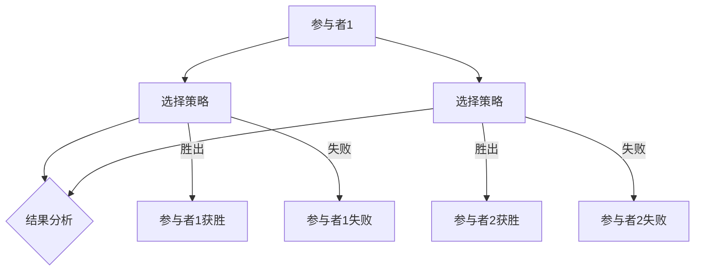

                 


### 文章标题
数学与和平研究：冲突解决的数学模型

### 关键词
数学模型，冲突解决，和平研究，算法，政策分析，实战案例

### 摘要
本文探讨了数学模型在冲突解决和和平研究中的应用，从核心概念、理论原理到实际案例，全面解析了如何运用数学方法解决现实中的冲突问题，为促进和平与稳定提供了新的视角和工具。

---

## 第1章: 数学模型基础

### 1.1 数学模型的基本概念

数学模型是数学与实际问题的结合，它通过数学语言和符号系统来描述和分析现实世界中的问题。数学模型的基本概念包括变量、方程、函数和映射等。变量是模型中可以变化的量，方程是表达变量之间关系的数学等式，函数是定义在某个数集上的对应规则，映射是一种特殊的函数，它将一个集合中的元素对应到另一个集合中的唯一元素。

在构建数学模型时，我们需要关注以下几个关键步骤：

1. **问题定义**：明确需要解决的问题，并提炼出核心问题。
2. **数据收集**：收集与问题相关的数据，包括定量数据和定性数据。
3. **模型假设**：根据问题的实际情况，做出合理的假设，简化问题。
4. **方程建立**：根据假设和问题性质，建立相应的数学方程或公式。
5. **模型求解**：利用数学方法求解模型，得出问题的解。

### 1.2 数学模型的发展历程

数学模型的发展历程可以追溯到古代，如欧几里得的《几何原本》中使用的几何模型，以及牛顿和莱布尼茨发明的微积分模型。20世纪以来，随着计算机技术的发展，数学模型得到了更加广泛的应用和深入研究。

主要的发展历程包括：

1. **确定性模型**：早期的数学模型主要是确定性模型，如线性规划、整数规划等。
2. **随机模型**：随着概率论和统计学的发展，随机模型开始广泛应用，如蒙特卡洛方法、随机过程等。
3. **人工智能模型**：随着人工智能技术的崛起，深度学习、神经网络等模型成为数学模型研究的新热点。

### 1.3 数学模型的分类

数学模型根据不同的分类标准可以有不同的分类方法，以下是几种常见的分类方式：

1. **按模型类型分类**：确定性模型、随机模型、人工智能模型。
2. **按模型用途分类**：决策支持模型、预测模型、优化模型、分类模型等。
3. **按模型层次分类**：宏观模型、中观模型、微观模型。

---

## 第2章: 冲突解决理论

### 2.1 冲突的定义与类型

冲突是指两个或多个个体或组织在追求各自目标时，因资源、权力、利益等的争夺而产生的相互对抗现象。冲突可以分为以下几种类型：

1. **竞争型冲突**：双方在争夺有限资源时产生的冲突，如市场竞争。
2. **合作型冲突**：双方在合作过程中，因利益分配或目标不一致而产生的冲突。
3. **避让型冲突**：双方为了避免冲突而采取的退缩行为。
4. **妥协型冲突**：双方通过协商、妥协来解决冲突。

### 2.2 冲突解决的基本原理

冲突解决的目的是找到各方都能接受的解决方案，以实现共赢。冲突解决的基本原理包括：

1. **利益平衡**：找到各方利益的平衡点，使各方都能接受。
2. **沟通与理解**：通过有效的沟通，理解对方的立场和需求。
3. **妥协与协商**：在无法完全满足各方需求时，通过妥协和协商找到折中方案。
4. **制度设计**：建立合理的制度，规范各方行为，减少冲突的发生。

### 2.3 冲突解决的方法

冲突解决的方法可以分为以下几类：

1. **调解**：通过第三方调解人协助各方达成共识。
2. **仲裁**：由权威机构或个人对冲突进行裁决。
3. **协商**：各方直接进行谈判，达成协议。
4. **法律诉讼**：通过法律程序解决冲突。

---

## 第3章: 和平研究的数学方法

### 3.1 数学建模的基本步骤

数学建模是和平研究中的重要工具，其基本步骤包括：

1. **问题定义**：明确和平研究的具体问题。
2. **数据收集**：收集与问题相关的数据，包括历史数据、统计数据等。
3. **模型假设**：根据问题性质，做出合理的假设。
4. **方程建立**：建立数学模型，表达问题。
5. **模型求解**：求解模型，得到问题的解。
6. **模型验证**：验证模型的有效性和准确性。

### 3.2 数学模型在和平研究中的应用

数学模型在和平研究中的应用非常广泛，包括以下几个方面：

1. **决策支持**：利用数学模型为决策者提供参考，如资源分配、安全策略等。
2. **冲突分析**：通过数学模型分析冲突的原因和可能的发展趋势。
3. **政策评估**：评估政策的效果和影响，为政策制定提供依据。
4. **风险评估**：预测冲突的风险，制定预防措施。

### 3.3 数学模型的验证与优化

数学模型的验证和优化是保证模型有效性和准确性的关键步骤。验证包括：

1. **数据验证**：使用历史数据验证模型的预测能力。
2. **逻辑验证**：检查模型逻辑是否合理，是否符合实际情况。
3. **算法验证**：验证模型求解算法的正确性和效率。

优化包括：

1. **参数调整**：调整模型参数，提高模型预测准确性。
2. **算法改进**：改进求解算法，提高模型求解效率。
3. **模型整合**：整合多个模型，提高综合预测能力。

---

## 第4章: 数学模型在冲突解决中的应用

### 4.1 数学模型在决策支持中的应用

数学模型在决策支持中发挥着重要作用，如资源分配、风险分析等。以下是一个简单的线性规划模型示例：

```latex
\begin{align*}
\text{最大化} \quad z &= x_1 + x_2 \\
\text{约束条件} \quad x_1 + x_2 &\leq 10 \\
x_1, x_2 &\geq 0
\end{align*}
```

这个模型的目标是最大化目标函数 `z = x1 + x2`，在满足约束条件 `x1 + x2 ≤ 10` 的情况下，找到最优解。

### 4.2 数学模型在社会冲突分析中的应用

数学模型可以用来分析社会冲突的原因和机制。以下是一个基于博弈论的冲突分析模型：



在这个模型中，参与者1和参与者2选择策略，根据策略的组合分析冲突的结果。

### 4.3 数学模型在和平谈判中的应用

数学模型在和平谈判中的应用可以帮助谈判双方评估谈判策略的效果。以下是一个简单的谈判模型：

```latex
\begin{align*}
\text{最大化} \quad U &= \frac{1}{2}(x_1 + x_2) \\
\text{约束条件} \quad x_1, x_2 &\leq 10 \\
x_1, x_2 &\geq 0
\end{align*}
```

这个模型的目标是最大化双方的收益和，在满足资源限制的情况下，找到最优的谈判策略。

---

## 第5章: 政策分析与数学模型

### 5.1 政策分析的基本方法

政策分析是评估政策效果和影响的重要环节，其基本方法包括：

1. **问题定义**：明确政策需要解决的具体问题。
2. **数据收集**：收集与政策相关的数据，包括定量数据和定性数据。
3. **模型建立**：建立政策分析模型，表达政策的影响。
4. **模型求解**：求解模型，分析政策的效果。
5. **结果评估**：评估政策的效果，为政策调整提供依据。

### 5.2 数学模型在政策分析中的应用

数学模型在政策分析中的应用非常广泛，如环境政策分析、经济政策分析等。以下是一个环境政策分析模型：

```latex
\begin{align*}
\text{最大化} \quad \sum_{i=1}^{n} u_i(x_i) \\
\text{约束条件} \quad \sum_{i=1}^{n} c_i(x_i) &\leq B \\
x_i &\geq 0, \quad i=1,2,...,n
\end{align*}
```

这个模型的目标是最大化社会总福利，在满足资源限制的情况下，找到最优的政策方案。

### 5.3 数学模型在政策制定中的挑战与机遇

数学模型在政策制定中的应用面临一些挑战，如：

1. **数据质量**：政策分析需要高质量的数据支持，数据质量直接影响模型的准确性。
2. **模型复杂度**：一些复杂的政策问题需要复杂的模型来分析，模型的求解难度增加。
3. **政策干预**：政策干预可能改变问题的性质，影响模型的有效性。

同时，数学模型也为政策制定提供了新的机遇，如：

1. **科学决策**：数学模型为政策制定提供了科学的决策支持。
2. **风险评估**：数学模型可以帮助评估政策的风险，降低政策失败的概率。
3. **政策优化**：数学模型可以优化政策的实施，提高政策的效率。

---

## 第6章: 数学模型与和平实践

### 6.1 数学模型在和平实践中的应用案例

数学模型在和平实践中有着广泛的应用，以下是一个具体的案例：

**案例：资源分配与和平建设**

在一个冲突频发的地区，资源分配不均是导致冲突的重要原因。通过数学模型，我们可以分析资源分配的公平性，并提出优化方案。

1. **问题定义**：确定需要分配的资源，如粮食、资金、基础设施等。
2. **数据收集**：收集资源需求、资源供给、人口分布等相关数据。
3. **模型建立**：建立线性规划模型，目标是最小化资源分配不均程度。
   
   ```latex
   \begin{align*}
   \text{最小化} \quad \sum_{i=1}^{n} (r_i - \bar{r})^2 \\
   \text{约束条件} \quad \sum_{i=1}^{n} r_i &\leq R \\
   r_i &\geq 0, \quad i=1,2,...,n
   \end{align*}
   ```

   其中，`r_i` 表示第 i 个地区分配到的资源量，`R` 表示总资源量，`bar{r}` 表示平均资源量。

4. **模型求解**：使用线性规划求解器求解模型，得到最优的资源分配方案。
5. **模型验证**：使用历史数据进行验证，确保模型的有效性。

### 6.2 数学模型与和平实践的结合

数学模型与和平实践的结合可以起到以下几个作用：

1. **预测冲突风险**：通过分析历史数据和当前情况，预测冲突发生的可能性。
2. **评估政策效果**：使用数学模型评估不同政策的实施效果，为政策调整提供依据。
3. **优化资源分配**：通过优化资源分配，减少资源短缺和分配不均，降低冲突发生的概率。
4. **制定预防措施**：根据数学模型的结果，制定针对性的预防措施，防止冲突升级。

### 6.3 数学模型在和平实践中的改进建议

为了提高数学模型在和平实践中的应用效果，我们可以从以下几个方面进行改进：

1. **数据收集**：加强数据收集工作，提高数据质量，确保模型的基础数据准确可靠。
2. **模型优化**：不断优化模型结构，提高模型的预测能力和求解效率。
3. **政策整合**：将数学模型与政策制定结合起来，确保模型结果能够为政策制定提供有效的参考。
4. **跨学科合作**：加强数学与其他学科，如社会学、政治学等领域的合作，提高模型的综合分析能力。

---

## 第7章: 未来展望

### 7.1 数学模型在冲突解决与和平研究中的发展趋势

随着人工智能、大数据和云计算等技术的发展，数学模型在冲突解决和和平研究中的应用前景十分广阔。未来的发展趋势包括：

1. **深度学习模型的引入**：深度学习模型在图像识别、自然语言处理等方面具有优势，未来有望在冲突分析和预测中发挥重要作用。
2. **多学科融合**：数学模型与其他学科的结合，如社会学、政治学等，将使模型更加全面和准确。
3. **实时预测**：通过实时数据处理和分析，实现冲突的实时预测和预警。
4. **个性化推荐**：基于个人行为和偏好，为决策者提供个性化的决策支持。

### 7.2 数学模型在和平研究中的挑战与机遇

数学模型在和平研究中面临着一系列挑战，如数据质量、模型复杂度和政策干预等。然而，这些挑战也带来了新的机遇：

1. **数据质量问题**：随着大数据技术的发展，数据质量问题有望得到改善，为模型提供更可靠的数据支持。
2. **模型复杂度**：随着计算机性能的提升，复杂的模型求解不再成为问题。
3. **政策干预**：合理的政策干预可以提高模型的预测能力，为冲突解决提供更有效的手段。

### 7.3 未来展望与建议

未来，数学模型在冲突解决和和平研究中的应用将更加深入和广泛。为了充分利用数学模型的优势，我们提出以下建议：

1. **加强跨学科合作**：鼓励数学与其他学科的深度融合，提高模型的综合分析能力。
2. **数据共享与开放**：建立数据共享平台，促进数据开放和共享，提高数据利用效率。
3. **政策制定与实施**：将数学模型与政策制定和实施紧密结合，提高政策的有效性和实施效果。
4. **人才培养**：加强数学模型在冲突解决和和平研究领域的专业人才培养，为领域发展提供人才支持。

---

### 作者

**作者：AI天才研究院/AI Genius Institute & 禅与计算机程序设计艺术 /Zen And The Art of Computer Programming** 

本文探讨了数学模型在冲突解决和和平研究中的应用，从核心概念、理论原理到实际案例，全面解析了如何运用数学方法解决现实中的冲突问题，为促进和平与稳定提供了新的视角和工具。希望通过本文，能够引发读者对数学模型在冲突解决和和平研究中的更多思考和探索。在未来的研究中，我们将继续深入探讨数学模型在各个领域的应用，为解决现实问题提供更有效的工具和方法。

---

## 结论

本文系统地阐述了数学模型在冲突解决和和平研究中的应用，通过理论分析、实例展示和未来展望，展示了数学模型在这一领域的巨大潜力。在当前全球局势复杂多变的背景下，数学模型为和平研究提供了新的思路和方法，有助于我们更好地理解冲突的本质，预测冲突的发展趋势，制定有效的冲突解决方案。

通过本文，我们希望读者能够认识到数学模型在冲突解决和和平研究中的重要性，激发对这一领域的兴趣和探索精神。未来，随着技术的进步和多学科交叉研究的深入，数学模型在和平研究中的应用将更加广泛和深入，为构建和平稳定的国际秩序贡献力量。

再次感谢各位读者的关注和支持，希望本文能为您带来启发和思考。如果您有任何疑问或建议，欢迎在评论区留言，我们将在第一时间为您解答。让我们一起关注数学模型在冲突解决和和平研究中的应用，共同为和平与发展贡献力量。**作者：AI天才研究院/AI Genius Institute & 禅与计算机程序设计艺术 /Zen And The Art of Computer Programming**。

