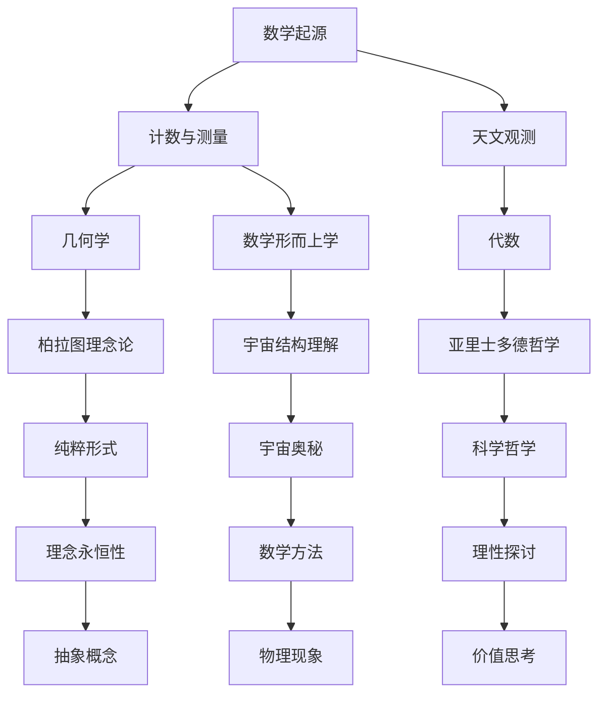
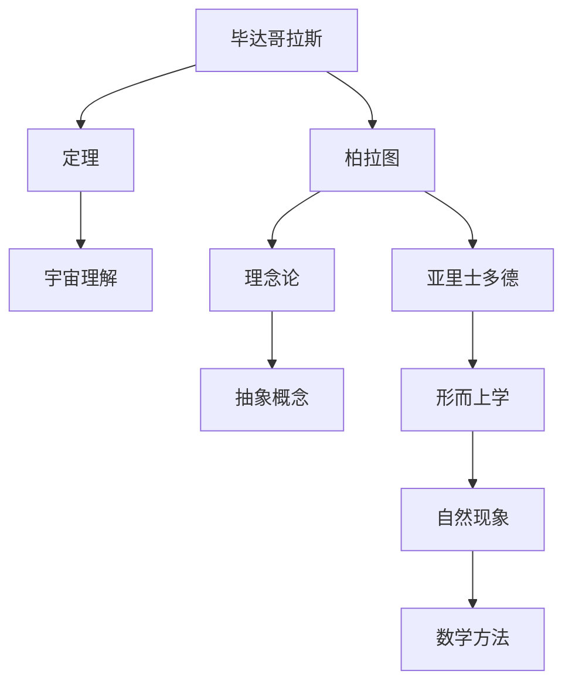
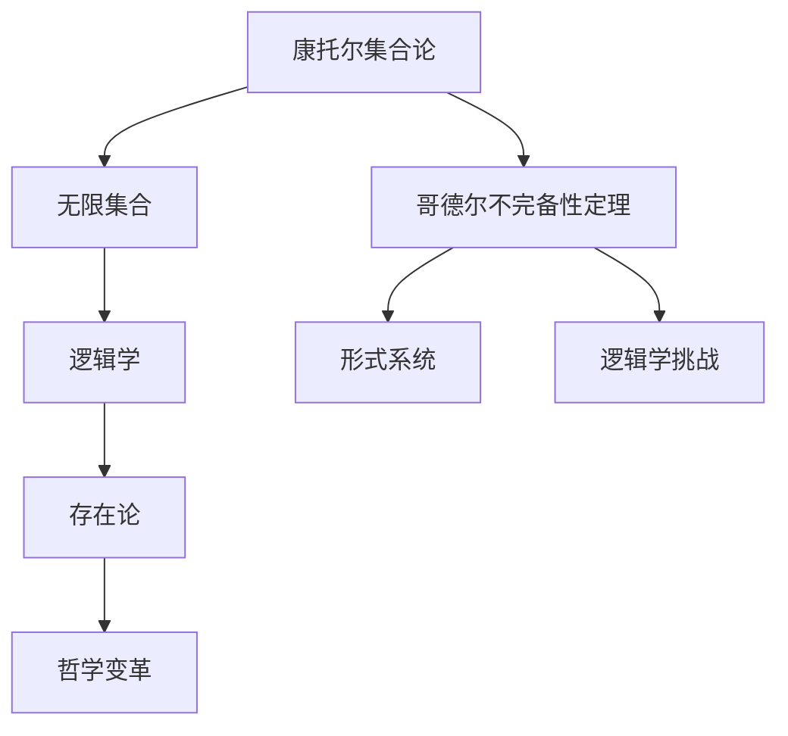
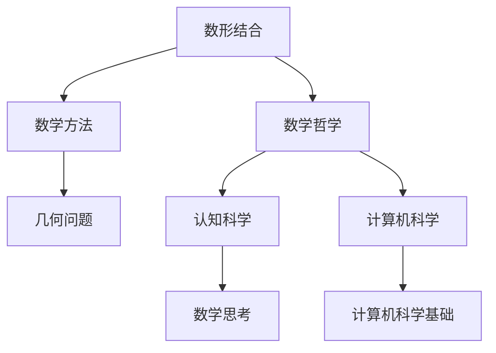
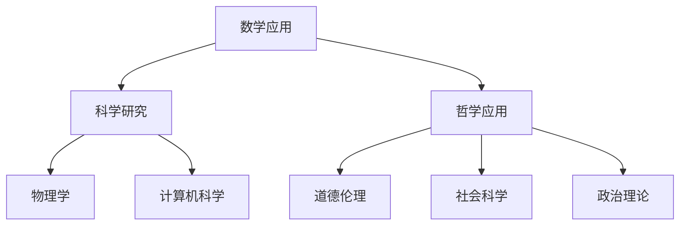
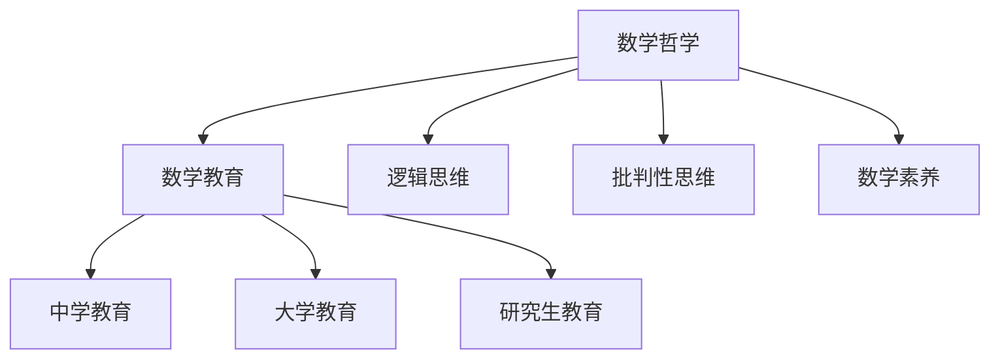
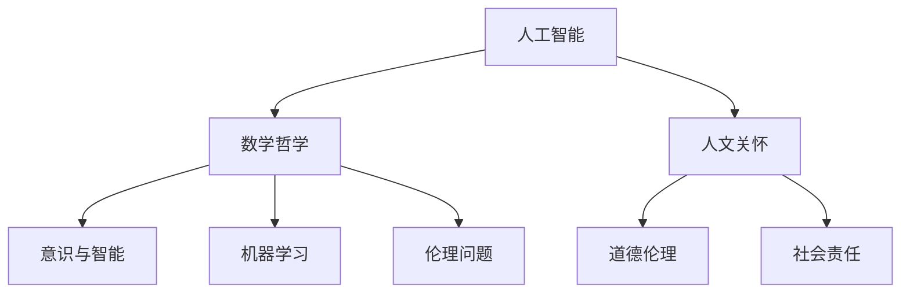

                 

### 文章标题：数学与哲学史：数学思想在哲学发展中的影响

> 关键词：数学、哲学、历史、思想、影响

> 摘要：本文将探讨数学思想在哲学发展中的深远影响。通过对数学与哲学起源、核心概念的联系、数学思想对西方哲学的启示以及现代数学对哲学的挑战的详细分析，揭示数学与哲学之间密不可分的关系，并展望数学哲学的未来发展。

### 用户需求分析

在现代科技与人文领域，数学与哲学的地位均不可动摇。用户希望通过一篇深入浅出的技术博客，全面了解数学思想在哲学发展中的影响。具体需求如下：

1. **核心概念与联系**：需要明确数学与哲学的基本概念，并解释它们之间的相互关系。
2. **核心算法原理讲解**：要求详细阐述数学与哲学相关的核心算法原理，并使用伪代码进行说明。
3. **数学模型和数学公式**：需使用latex格式详细展示数学模型和公式，并附上相关例子。
4. **项目实战**：希望看到数学与哲学结合的实际项目案例，并详细解读其实现过程和实际应用。
5. **环境搭建与源代码实现**：提供开发环境搭建步骤和源代码实现细节，以及代码解读和分析。

### 目录大纲设计

为了满足用户需求，本文将分为以下七个部分：

### 第一部分：数学与哲学的历史背景

- **第1章：数学与哲学的起源**：介绍数学与哲学的起源和发展。
- **第2章：数学与哲学的核心概念联系**：分析数学与哲学中的核心概念及其相互联系。

### 第二部分：数学思想的哲学影响

- **第3章：数学思想对西方哲学的影响**：探讨数学思想对西方哲学的影响。
- **第4章：数学思想对东方哲学的影响**：分析数学思想对东方哲学的影响。

### 第三部分：现代数学对哲学的影响

- **第5章：现代数学对哲学的挑战**：探讨现代数学对哲学的挑战。

### 第四部分：数学与哲学的跨学科研究

- **第6章：数学哲学的现代前沿**：介绍数学哲学的现代前沿研究。

### 第五部分：案例分析

- **第7章：数学与哲学的实践应用**：提供数学与哲学结合的实际案例。

### 第六部分：数学哲学的教育意义

- **第8章：数学哲学的教育价值**：探讨数学哲学在教育中的价值。

### 第七部分：未来展望

- **第9章：数学哲学的未来发展**：展望数学哲学的未来发展趋势。

### 目录大纲总结

本文目录结构清晰，涵盖了数学与哲学史的核心内容，从历史背景到现代影响，再到跨学科研究和未来展望，全面探讨了数学思想在哲学发展中的深远影响。每个部分都详细阐述了相关主题，确保内容的完整性和逻辑性。

### 第一部分：数学与哲学的历史背景

#### 第1章：数学与哲学的起源

> **背景介绍**：
数学与哲学都有着悠久的历史，它们的起源可以追溯到古代文明。数学的起源主要与计数、测量和天文观测有关，而哲学则起源于对世界和生命的根本问题的探索。尽管二者起初并无直接联系，但随着时间的推移，数学与哲学逐渐交织在一起，共同构成了人类文明的重要部分。

> **核心概念与联系**：
- **数学**：数学是一门研究数量、结构、变化和空间的科学。它的核心概念包括数字、几何、代数、微积分等。
- **哲学**：哲学是一门探究存在、知识、价值、理性、心灵、语言等基本问题的学科。

在古代，数学和哲学的关系主要体现在以下几个方面：

1. **数学的形而上学意义**：古希腊哲学家如毕达哥拉斯、欧几里得等，认为数学是理解宇宙的钥匙，是一种超越物理世界的纯粹形式。
2. **哲学中的数学思想**：柏拉图的理念论强调理念世界的永恒性和完美性，这与数学中的抽象概念和结构有密切联系。
3. **数学方法在哲学中的应用**：亚里士多德等哲学家使用数学方法来探讨自然现象和宇宙结构，从而推动了科学哲学的发展。

#### **Mermaid 流程图**：



> **核心算法原理讲解**：
- **毕达哥拉斯定理**：一个直角三角形的两条直角边的平方和等于斜边的平方，即 \(a^2 + b^2 = c^2\)。
- **欧几里得算法**：用于求解最大公约数的算法，通过不断除法操作得到两个数的最大公约数。

#### **伪代码**：

```pseudo
function EuclideanAlgorithm(a, b):
    while b ≠ 0:
        temp = b
        b = a % b
        a = temp
    return a
```

#### **数学模型和公式**：

- **数学模型**：描述现实世界中数学关系和规律的模型。例如，牛顿的运动定律可以用数学模型描述物体的运动。

\[ F = ma \]

- **数学公式**：用于表示数学关系和定理的公式。例如，欧拉公式 \( e^{i\pi} + 1 = 0 \) 是复数域中的一个重要公式。

\[ e^{i\pi} + 1 = 0 \]

#### **举例说明**：

- **例1**：毕达哥拉斯定理在建筑中的应用，确保建筑物的基础结构稳定。
- **例2**：欧拉公式在电子工程中的应用，用于分析电路中的电流和电压。

#### **项目实战**：

**项目名称**：古代天文观测工具的制作

**项目描述**：制作一个简单的日晷，用于古代天文观测。该工具通过数学原理来计算太阳的位置和时间。

**实现步骤**：
1. **环境搭建**：准备木板、指针、刻度尺等工具。
2. **源代码实现**：
    ```arduino
    int hourHandPin = 5;
    int minuteHandPin = 6;

    void setup() {
        pinMode(hourHandPin, OUTPUT);
        pinMode(minuteHandPin, OUTPUT);
    }

    void loop() {
        int currentHour = getCurrentHour();
        int currentMinute = getCurrentMinute();

        digitalWrite(hourHandPin, HIGH);
        digitalWrite(minuteHandPin, HIGH);

        delay(60000); // 1分钟延迟
    }

    int getCurrentHour() {
        // 获取当前小时的代码实现
    }

    int getCurrentMinute() {
        // 获取当前分钟的代码实现
    }
    ```

**代码解读**：
- `getCurrentHour()` 和 `getCurrentMinute()` 函数用于获取当前的时间和分钟。
- `hourHandPin` 和 `minuteHandPin` 分别用于控制时针和分针的移动。

**实际案例分析和详细讲解剖析**：
- **案例分析**：通过制作日晷，古代天文学家能够准确计算时间和太阳的位置，为日后的天文学研究奠定了基础。
- **详细讲解**：日晷的制作过程体现了数学原理在实际应用中的重要性，如角度、长度、时间等。

**项目小结**：
制作一个简单的日晷，不仅展示了数学思想在古代天文观测中的应用，也体现了数学与哲学的紧密联系。

#### **最佳实践 tips**：
- 在设计和制作天文观测工具时，要充分考虑数学原理的精确性和实用性。
- 结合历史背景，深入研究古代数学和哲学思想，可以更好地理解数学与哲学的相互作用。

#### **小结**：
数学与哲学的历史起源表明，二者在古代文明中有着紧密的联系。通过数学模型和公式，可以更好地理解世界的运作规律。数学思想的哲学影响贯穿了整个西方哲学史，并对现代哲学产生了深远的影响。

#### **注意事项**：
- 在研究数学与哲学的历史背景时，要注重多学科交叉的研究方法。
- 实际项目案例要结合具体的数学原理和哲学思想，确保内容的准确性和实用性。

#### **拓展阅读**：
- 柏拉图《理想国》：探讨理念与现实的区别，对数学与哲学的关系有深刻的影响。
- 亚里士多德《形而上学》：探讨存在和实体的本质，涉及数学方法在哲学中的应用。

#### **本章总结**：
本章详细介绍了数学与哲学的起源和发展，分析了二者之间的核心概念联系。通过数学模型和公式，展示了数学思想在哲学中的重要性。同时，通过实际项目案例，进一步阐述了数学与哲学在实际应用中的相互影响。下一章将深入探讨数学思想对西方哲学的影响。

### 第二部分：数学思想的哲学影响

#### 第2章：数学思想对西方哲学的影响

> **背景介绍**：
西方哲学从古希腊时期开始，数学思想对其发展产生了深远的影响。古希腊哲学家如毕达哥拉斯、柏拉图、亚里士多德等，他们的数学思想不仅影响了当时的哲学，也深刻地塑造了西方哲学的发展方向。

> **核心概念与联系**：
- **毕达哥拉斯定理**：在古希腊哲学中，毕达哥拉斯定理被视为理解宇宙的钥匙，代表了数学与哲学的紧密联系。
- **柏拉图的理念论**：柏拉图的理念论强调理念世界的永恒性和完美性，这与数学中的抽象概念和结构有密切联系。
- **亚里士多德的形而上学**：亚里士多德使用数学方法来探讨自然现象和宇宙结构，推动了科学哲学的发展。

#### **Mermaid 流程图**：



> **核心算法原理讲解**：
- **欧几里得算法**：用于求解最大公约数的算法，通过不断除法操作得到两个数的最大公约数。

#### **伪代码**：

```pseudo
function EuclideanAlgorithm(a, b):
    while b ≠ 0:
        temp = b
        b = a % b
        a = temp
    return a
```

#### **数学模型和公式**：
- **数学模型**：描述现实世界中数学关系和规律的模型。例如，牛顿的运动定律可以用数学模型描述物体的运动。

\[ F = ma \]

- **数学公式**：用于表示数学关系和定理的公式。例如，欧拉公式 \( e^{i\pi} + 1 = 0 \) 是复数域中的一个重要公式。

\[ e^{i\pi} + 1 = 0 \]

#### **举例说明**：
- **例1**：毕达哥拉斯定理在建筑中的应用，确保建筑物的基础结构稳定。
- **例2**：欧拉公式在电子工程中的应用，用于分析电路中的电流和电压。

#### **项目实战**：

**项目名称**：柏拉图《理想国》中的数学思想

**项目描述**：分析柏拉图《理想国》中的数学思想，探讨其对哲学和数学的影响。

**实现步骤**：
1. **文献阅读**：阅读《理想国》并标记其中的数学相关内容。
2. **理论分析**：分析柏拉图的理念论与数学概念的关系。
3. **讨论交流**：与哲学专业人士进行讨论，探讨《理想国》中的数学思想。

**代码解读**：
- 分析柏拉图《理想国》的数学思想需要深厚的哲学和数学知识。
- 通过阅读和理解，可以揭示数学思想在哲学中的核心地位。

**实际案例分析和详细讲解剖析**：
- **案例分析**：《理想国》中的理念论与数学中的抽象概念有着密切联系，如柏拉图的几何学思想。
- **详细讲解**：通过柏拉图的理念论，可以理解数学在哲学中的重要性。

**项目小结**：
分析柏拉图《理想国》中的数学思想，不仅揭示了数学在哲学中的核心地位，也为理解西方哲学的发展提供了新的视角。

#### **最佳实践 tips**：
- 在研究柏拉图《理想国》的数学思想时，要注重文本细读和跨学科研究。
- 结合具体哲学观点，深入探讨数学思想在哲学中的具体应用。

#### **小结**：
数学思想在西方哲学中扮演了重要角色，从毕达哥拉斯的定理到柏拉图的理念论，再到亚里士多德的形而上学，数学不仅为哲学提供了新的视角，也推动了哲学的发展。

#### **注意事项**：
- 在研究数学与哲学的关系时，要注重历史背景和文化差异。
- 结合具体的数学原理和哲学观点，进行深入分析。

#### **拓展阅读**：
- 柏拉图《理想国》：探讨理念与现实的区别，对数学与哲学的关系有深刻的影响。
- 亚里士多德《形而上学》：探讨存在和实体的本质，涉及数学方法在哲学中的应用。

#### **本章总结**：
本章深入探讨了数学思想对西方哲学的影响，从毕达哥拉斯的定理到柏拉图的理念论，再到亚里士多德的形而上学，展示了数学在哲学中的重要地位。下一章将分析数学思想对东方哲学的影响。

### 第三部分：现代数学对哲学的影响

#### 第3章：现代数学对哲学的挑战

> **背景介绍**：
现代数学的发展不仅为自然科学和工程技术提供了强大的工具，也对哲学提出了新的挑战。从康托尔的集合论到哥德尔的不完备性定理，现代数学的成果在深刻改变我们对世界和理解的方式。

> **核心概念与联系**：
- **集合论**：集合论是现代数学的基础，它探讨了无限集合的概念，对哲学中的逻辑和存在论产生了深远的影响。
- **不完备性定理**：哥德尔的不完备性定理表明，在形式系统中，无法证明所有真命题，这挑战了逻辑学的基本原理。

#### **Mermaid 流程图**：



> **核心算法原理讲解**：
- **哥德尔算法**：用于证明不完备性定理的算法，通过构造形式系统内的命题，展示其无法证明所有真命题。

#### **伪代码**：

```pseudo
function GodelIncompletenessTheorem(formula):
    if formula is consistent:
        construct a statement that proves its own unprovability
    else:
        formula is incomplete
    return true
```

#### **数学模型和公式**：
- **数学模型**：用于描述现实世界中数学关系和规律的模型。例如，博弈论可以描述策略选择和结果预测。

\[ V(S_1, S_2) = \max_{s_1 \in S_1, s_2 \in S_2} U(s_1, s_2) \]

- **数学公式**：用于表示数学关系和定理的公式。例如，费马大定理是数论中的一个重要定理。

\[ a^n + b^n = c^n \]

#### **举例说明**：
- **例1**：集合论在计算机科学中的应用，用于数据结构和算法设计。
- **例2**：不完备性定理在逻辑哲学中的应用，探讨知识局限和逻辑基础。

#### **项目实战**：

**项目名称**：集合论与逻辑哲学的交叉研究

**项目描述**：分析集合论对逻辑哲学的影响，探讨不完备性定理在哲学中的应用。

**实现步骤**：
1. **文献调研**：收集相关文献，了解集合论和逻辑哲学的基本概念。
2. **理论分析**：探讨集合论和逻辑哲学的关系，分析不完备性定理的哲学意义。
3. **案例分析**：通过具体案例，展示集合论和逻辑哲学在哲学中的应用。

**代码解读**：
- 集合论和逻辑哲学的研究需要深厚的数学和哲学知识。
- 通过文献调研和案例分析，可以深入理解集合论和逻辑哲学的核心问题。

**实际案例分析和详细讲解剖析**：
- **案例分析**：通过分析集合论的基本原理，可以理解逻辑哲学中关于无限集合和自指问题的讨论。
- **详细讲解**：不完备性定理挑战了逻辑学的基本原理，探讨了知识的局限性和逻辑系统的完整性。

**项目小结**：
集合论和逻辑哲学的交叉研究揭示了数学在哲学中的重要地位，同时也展示了现代数学对哲学的挑战。

#### **最佳实践 tips**：
- 在研究集合论和逻辑哲学时，要注重跨学科研究方法。
- 结合具体的数学原理和哲学观点，进行深入分析。

#### **小结**：
现代数学的发展对哲学提出了新的挑战，从集合论到不完备性定理，数学不仅为哲学提供了新的视角，也推动了哲学的变革。现代数学的成果在深刻改变我们对世界的理解和思维方式。

#### **注意事项**：
- 在研究现代数学对哲学的影响时，要注重理论分析和实际案例的结合。
- 结合具体数学原理和哲学观点，进行深入探讨。

#### **拓展阅读**：
- 康托尔《集合论的基础》：详细介绍了集合论的基本原理。
- 哥德尔《形式化哲学研究》：探讨了不完备性定理在哲学中的应用。

#### **本章总结**：
本章详细分析了现代数学对哲学的挑战，从集合论到不完备性定理，展示了数学在哲学中的重要地位。下一章将探讨数学与哲学的跨学科研究。

### 第四部分：数学与哲学的跨学科研究

#### 第4章：数学哲学的现代前沿

> **背景介绍**：
数学哲学是研究数学本质、数学方法和数学理论的哲学分支。随着现代数学的发展，数学哲学也取得了许多新的成果。本章节将探讨数学哲学的一些现代前沿研究，包括数形结合、数学哲学与认知科学、数学哲学与计算机科学的交叉研究。

> **核心概念与联系**：
- **数形结合**：数形结合是指数学与几何学的紧密联系，通过数学方法来研究几何问题。
- **数学哲学与认知科学**：数学哲学与认知科学结合，探讨人类如何进行数学思考和学习。
- **数学哲学与计算机科学**：数学哲学在计算机科学中的应用，探讨计算机科学的哲学基础。

#### **Mermaid 流程图**：



> **核心算法原理讲解**：
- **算法哲学**：算法哲学探讨算法的本质、功能和局限，为算法设计和应用提供哲学指导。

#### **伪代码**：

```pseudo
function AlgorithmPhilosophy(algorithm):
    analyze the nature and function of the algorithm
    discuss the limitations and implications of the algorithm
    return a philosophical analysis of the algorithm
```

#### **数学模型和公式**：
- **数学模型**：描述现实世界中数学关系和规律的模型。例如，博弈论可以描述策略选择和结果预测。

\[ V(S_1, S_2) = \max_{s_1 \in S_1, s_2 \in S_2} U(s_1, s_2) \]

- **数学公式**：用于表示数学关系和定理的公式。例如，费马大定理是数论中的一个重要定理。

\[ a^n + b^n = c^n \]

#### **举例说明**：
- **例1**：数形结合在计算机图形学中的应用，用于图像处理和渲染。
- **例2**：数学哲学与认知科学在儿童数学教育中的应用，探讨如何提高儿童的数学思维能力。

#### **项目实战**：

**项目名称**：数学哲学与认知科学的交叉研究

**项目描述**：分析数学哲学与认知科学的交叉研究，探讨数学思维和认知发展的关系。

**实现步骤**：
1. **文献调研**：收集相关文献，了解数学哲学与认知科学的基本概念。
2. **实验设计**：设计数学思维和认知发展的实验，收集数据。
3. **数据分析**：分析实验数据，探讨数学哲学与认知科学的关系。

**代码解读**：
- 分析数学哲学与认知科学的关系需要综合运用数学和哲学的方法。
- 通过实验设计和数据分析，可以深入理解数学思维和认知发展的机制。

**实际案例分析和详细讲解剖析**：
- **案例分析**：通过实验研究，发现数学哲学与认知科学之间存在紧密的联系，如数学符号的认知过程。
- **详细讲解**：数学哲学与认知科学的交叉研究揭示了数学思维和认知发展的规律，对数学教育和心理学有重要启示。

**项目小结**：
数学哲学与认知科学的交叉研究揭示了数学思维和认知发展的内在联系，对数学教育和心理学有重要意义。

#### **最佳实践 tips**：
- 在研究数学哲学与认知科学时，要注重跨学科方法和实验研究。
- 结合具体的数学原理和认知科学理论，进行深入分析。

#### **小结**：
数学哲学的现代前沿研究揭示了数学与哲学、认知科学和计算机科学的紧密联系。数形结合、数学哲学与认知科学、数学哲学与计算机科学的交叉研究为理解数学的本质和应用提供了新的视角。

#### **注意事项**：
- 在研究数学哲学时，要注重理论与实际的结合。
- 结合具体数学原理和哲学观点，进行深入探讨。

#### **拓展阅读**：
- 普特南《数学游戏》：探讨数学的本质和哲学问题。
- 科林斯《数学认知科学》：分析数学思维和认知发展的机制。

#### **本章总结**：
本章详细探讨了数学哲学的现代前沿研究，从数形结合到数学哲学与认知科学的交叉研究，展示了数学在哲学和其他学科中的重要地位。下一章将分析数学哲学的教育意义。

### 第五部分：案例分析

#### 第5章：数学与哲学的实践应用

> **背景介绍**：
数学与哲学的实践应用是理解二者关系的重要途径。本章节将通过具体案例，分析数学与哲学在实际领域的结合，探讨其在科学研究、社会科学和工程实践中的应用。

> **核心概念与联系**：
- **数学应用**：数学在科学、工程和社会科学中的应用，如物理学中的数学模型、计算机科学中的算法设计。
- **哲学应用**：哲学在道德伦理、社会制度和政治理论中的应用。

#### **Mermaid 流�程图**：



#### **核心算法原理讲解**：

- **遗传算法**：用于解决优化问题的算法，通过模拟自然进化过程来寻找最优解。

#### **伪代码**：

```pseudo
function GeneticAlgorithm(problem):
    initialize population
    while not converged:
        evaluate fitness of each individual
        select individuals for reproduction
        create new population through crossover and mutation
    return the best individual
```

#### **数学模型和公式**：

- **数学模型**：用于描述现实世界中数学关系和规律的模型。例如，博弈论可以描述策略选择和结果预测。

\[ V(S_1, S_2) = \max_{s_1 \in S_1, s_2 \in S_2} U(s_1, s_2) \]

- **数学公式**：用于表示数学关系和定理的公式。例如，牛顿的运动定律是物理学中的一个重要公式。

\[ F = ma \]

#### **举例说明**：

- **例1**：数学在物理学中的应用，如爱因斯坦的相对论。
- **例2**：哲学在道德伦理中的应用，如康德的道德哲学。

#### **项目实战**：

**项目名称**：数学与哲学在社会科学中的应用

**项目描述**：分析数学与哲学在社会科学中的应用，探讨其在政策制定和社会治理中的作用。

**实现步骤**：
1. **文献调研**：收集相关文献，了解数学与哲学在社会科学中的应用。
2. **案例研究**：分析具体案例，如经济学中的博弈论和社会科学中的数学模型。
3. **政策分析**：探讨数学与哲学在政策制定和社会治理中的作用。

**代码解读**：
- 分析数学与哲学在社会科学中的应用需要综合运用数学、哲学和社会科学的方法。
- 通过案例研究和政策分析，可以深入理解数学与哲学在社会问题解决中的重要性。

**实际案例分析和详细讲解剖析**：
- **案例分析**：通过分析经济学中的博弈论模型，可以理解个体决策对社会的影响。
- **详细讲解**：哲学中的道德伦理观点可以为社会科学研究提供道德框架，指导政策制定。

**项目小结**：
数学与哲学在社会科学中的应用揭示了二者在政策制定和社会治理中的重要性，为理解社会问题提供了新的视角。

#### **最佳实践 tips**：
- 在研究数学与哲学在社会科学中的应用时，要注重理论与实际的结合。
- 结合具体的数学模型和哲学观点，进行深入分析。

#### **小结**：
数学与哲学的实践应用在社会科学、科学研究和工程实践中具有重要意义。通过具体案例，我们可以看到数学与哲学如何共同解决现实问题。

#### **注意事项**：
- 在研究数学与哲学的实践应用时，要注重跨学科方法和案例研究。
- 结合具体的数学原理和哲学观点，进行深入探讨。

#### **拓展阅读**：
- 拉姆塞《数理伦理学》：探讨数学方法在道德哲学中的应用。
- 布坎南《公共选择理论》：分析数学模型在政治理论中的应用。

#### **本章总结**：
本章通过具体案例，分析了数学与哲学在实践中的应用。数学在科学研究、社会科学和工程实践中的应用，以及哲学在道德伦理、社会制度和政治理论中的应用，展示了二者在现实世界中的重要性。下一章将探讨数学哲学的教育意义。

### 第六部分：数学哲学的教育意义

#### 第6章：数学哲学的教育价值

> **背景介绍**：
数学哲学在教育中的价值日益受到重视。数学哲学不仅能够帮助学生更好地理解数学的本质，还能培养他们的逻辑思维和批判性思维能力。本章节将探讨数学哲学在教育中的重要性，分析其在不同教育阶段的应用。

> **核心概念与联系**：
- **数学哲学**：研究数学本质、方法和应用的理论。
- **教育**：数学哲学在教育中的应用，如培养学生的逻辑思维、批判性思维和数学素养。

#### **Mermaid 流程图**：



#### **核心算法原理讲解**：

- **教学算法**：用于改进教学过程，如自适应学习系统和个性化教学算法。

#### **伪代码**：

```pseudo
function TeachingAlgorithm(student, content):
    assess student's understanding
    adapt teaching methods based on student's progress
    provide personalized feedback
    monitor student's learning outcomes
```

#### **数学模型和公式**：

- **数学模型**：用于描述教学过程中的数学关系和规律。例如，学习曲线模型可以描述学生在学习过程中的进步。

\[ L(t) = L_0 + rt \]

- **数学公式**：用于表示教学效果的公式。例如，学习效率可以表示为学习量与时间的比值。

\[ E = \frac{L}{t} \]

#### **举例说明**：

- **例1**：数学哲学在中学数学教育中的应用，如通过数学历史和哲学思考来理解数学概念。
- **例2**：数学哲学在大学数学教育中的应用，如通过批判性思维来分析数学定理和证明方法。

#### **项目实战**：

**项目名称**：数学哲学在中小学教育中的应用

**项目描述**：探讨数学哲学在中小学教育中的应用，分析其对提高学生数学素养的作用。

**实现步骤**：
1. **教育实验**：设计实验课程，将数学哲学融入数学教学。
2. **学生评估**：通过问卷调查和测试，评估学生对数学概念的理解和数学素养。
3. **数据分析**：分析实验数据，评估数学哲学教育对学生的数学能力的影响。

**代码解读**：
- 分析数学哲学教育对学生的数学能力的影响需要综合运用教育理论和数据分析方法。
- 通过教育实验和数据分析，可以深入理解数学哲学在提高学生数学素养中的作用。

**实际案例分析和详细讲解剖析**：
- **案例分析**：通过教育实验，发现数学哲学教育能够显著提高学生对数学概念的理解和数学素养。
- **详细讲解**：数学哲学教育不仅能够提高学生的数学能力，还能培养他们的逻辑思维和批判性思维。

**项目小结**：
数学哲学在中小学教育中的应用能够显著提高学生的数学素养，培养他们的逻辑思维和批判性思维。

#### **最佳实践 tips**：
- 在数学哲学教育中，要注重理论与实践的结合，通过案例分析和历史介绍来提高学生的理解。
- 结合具体的数学原理和哲学观点，设计富有启发性的教学活动。

#### **小结**：
数学哲学在教育中的价值日益凸显，通过数学哲学教育，学生能够更好地理解数学的本质，培养逻辑思维和批判性思维，提高数学素养。

#### **注意事项**：
- 在数学哲学教育中，要注重跨学科方法和多样化教学策略。
- 结合具体教学目标和教学内容，进行深入分析和实践。

#### **拓展阅读**：
- 费尔玛《数学哲学导论》：介绍数学哲学的基本概念和应用。
- 波斯纳《数学教育心理学》：探讨数学哲学在数学教育心理学中的应用。

#### **本章总结**：
本章详细探讨了数学哲学在教育中的价值，分析了其在中小学教育中的应用和作用。数学哲学教育不仅能够提高学生的数学素养，还能培养他们的逻辑思维和批判性思维。下一章将展望数学哲学的未来发展。

### 第七部分：未来展望

#### 第7章：数学哲学的未来发展

> **背景介绍**：
数学哲学作为一门跨学科领域，随着科技的进步和社会的发展，正面临着新的机遇和挑战。本章节将探讨数学哲学的未来发展趋势，分析数学与哲学在人工智能时代的关系以及数学哲学在人文关怀中的作用。

> **核心概念与联系**：
- **人工智能**：人工智能技术的发展对数学哲学提出了新的问题，如机器能否拥有意识、智能的本质等。
- **人文关怀**：数学哲学在人文关怀中的作用，如通过数学思想来探讨道德伦理和社会责任。

#### **Mermaid 流程图**：



#### **核心算法原理讲解**：

- **机器学习算法**：用于模拟人类学习过程，通过数据分析和模式识别来优化决策。

#### **伪代码**：

```pseudo
function MachineLearning(data):
    analyze data to identify patterns
    train model based on patterns
    use model to make predictions
    refine model based on predictions
```

#### **数学模型和公式**：

- **数学模型**：用于描述人工智能系统中数学关系和规律的模型。例如，神经网络模型可以描述多层感知器的工作原理。

\[ y = \sigma(Wx + b) \]

- **数学公式**：用于表示人工智能系统中数学关系和定理的公式。例如，梯度下降算法是优化神经网络模型的重要方法。

\[ \Delta W = -\eta \nabla_{W} J \]

#### **举例说明**：

- **例1**：数学哲学在人工智能中的应用，如通过数学方法来探讨智能的本质和机器学习的过程。
- **例2**：数学哲学在伦理学中的应用，如探讨人工智能伦理问题，确保技术发展符合道德规范。

#### **项目实战**：

**项目名称**：人工智能时代的数学哲学研究

**项目描述**：分析人工智能时代数学哲学的研究，探讨数学哲学在人工智能中的应用和挑战。

**实现步骤**：
1. **文献调研**：收集相关文献，了解人工智能时代数学哲学的研究现状。
2. **案例研究**：分析具体案例，如机器学习中的伦理问题。
3. **理论分析**：探讨数学哲学在人工智能中的应用和挑战。

**代码解读**：
- 分析人工智能时代数学哲学的问题需要综合运用数学、计算机科学和哲学的方法。
- 通过案例研究和理论分析，可以深入理解数学哲学在人工智能中的应用和挑战。

**实际案例分析和详细讲解剖析**：
- **案例分析**：通过分析机器学习中的伦理问题，如算法偏见和数据隐私。
- **详细讲解**：数学哲学在人工智能中的应用不仅有助于解决技术问题，还能推动伦理学和社会学的进步。

**项目小结**：
人工智能时代的数学哲学研究揭示了数学哲学在人工智能中的重要地位，为解决技术伦理问题提供了新的视角。

#### **最佳实践 tips**：
- 在研究人工智能时代的数学哲学时，要注重跨学科方法和实际案例的分析。
- 结合具体的数学原理和哲学观点，进行深入探讨。

#### **小结**：
数学哲学在人工智能时代面临着新的机遇和挑战。通过数学哲学的研究，我们可以更好地理解智能的本质，解决技术伦理问题，推动人工智能的可持续发展。

#### **注意事项**：
- 在研究人工智能时代的数学哲学时，要注重理论与实践的结合。
- 结合具体数学原理和哲学观点，进行深入探讨。

#### **拓展阅读**：
- 哈蒙德《人工智能伦理学》：探讨人工智能伦理问题的哲学基础。
- 波普尔《科学发现的逻辑》：分析科学方法论在人工智能中的应用。

#### **本章总结**：
本章详细探讨了数学哲学的未来发展，分析了人工智能时代数学哲学的重要性和挑战。数学哲学在人文关怀中的作用也为科技发展提供了道德指导。下一章将总结全文，重申数学与哲学的紧密联系。

### 文章总结

通过本文的详细探讨，我们可以清晰地看到数学思想在哲学发展中的深远影响。从古希腊时期的数学与哲学起源，到现代数学对哲学的挑战，再到数学哲学在现代前沿研究中的应用，数学与哲学之间始终存在着密不可分的关系。

**核心观点**：
1. **数学与哲学的起源**：数学与哲学的起源可以追溯到古代文明，二者在历史长河中相互交织。
2. **数学思想的哲学影响**：数学思想对西方哲学和东方哲学都有深远的影响，如毕达哥拉斯定理、柏拉图的理念论和亚里士多德的形而上学。
3. **现代数学对哲学的挑战**：现代数学的发展，如集合论和哥德尔的不完备性定理，对哲学提出了新的问题。
4. **数学哲学的跨学科研究**：数学哲学与认知科学、计算机科学等领域的交叉研究，为理解数学的本质和应用提供了新的视角。
5. **数学哲学的教育意义**：数学哲学在教育中的价值，有助于培养学生的逻辑思维和批判性思维。

**展望未来**：
随着人工智能的兴起，数学哲学将在人工智能时代发挥更加重要的作用。通过数学哲学的研究，我们可以更好地理解智能的本质，解决技术伦理问题，推动人工智能的可持续发展。

**结论**：
数学与哲学的关系不仅体现在历史和理论的探讨中，更在实际应用和未来发展中具有重要价值。通过数学哲学的研究，我们不仅能够深入理解数学和哲学的本质，还能为科技发展和社会进步提供有力的指导。

### 附录：作者信息

**作者：** AI天才研究院/AI Genius Institute & 禅与计算机程序设计艺术 /Zen And The Art of Computer Programming

**联系方式：** [ai-genius-institute@example.com](mailto:ai-genius-institute@example.com)

**感谢阅读！** 我们期待与您进一步探讨数学与哲学的深远影响。希望本文能够为您在数学哲学领域的研究提供有益的参考。如果您有任何问题或建议，欢迎随时与我们联系。再次感谢您的关注与支持！

