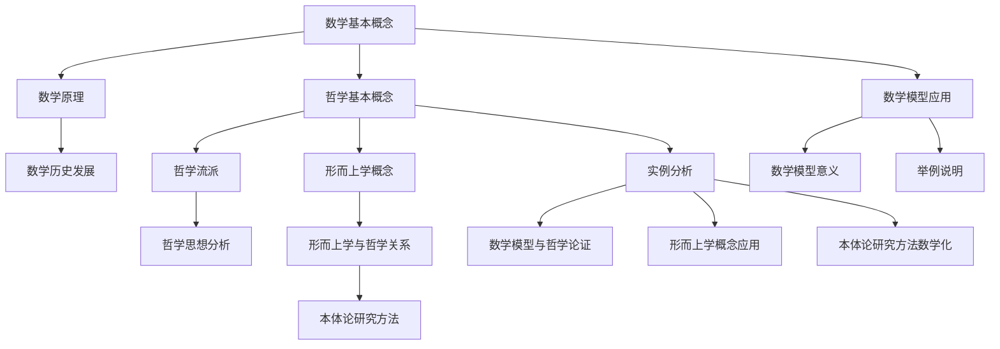

                 

# 数学与哲学形而上学的本体论研究

## 摘要

本文旨在探讨数学与哲学形而上学的本体论研究。首先，我们回顾了数学的基本概念和原理，以及其历史发展。接着，我们探讨了哲学的基本概念、流派和哲学思想。随后，我们分析了形而上学的概念，以及形而上学与哲学的关系和本体论研究方法。在此基础上，我们详细讲解了数学模型在哲学形而上学中的应用，并通过具体实例分析展示了数学与哲学形而上学在本体论研究中的实际应用。最后，我们对本文进行了总结，并对未来的研究方向提出了展望。

## 设计本书的目录大纲

为了使读者能够清晰地了解本书的内容结构和逻辑关系，我们首先设计了一篇包含引言、数学基本概念与原理、哲学基本概念与流派、形而上学概念与本体论研究方法、数学模型在哲学形而上学中的应用、哲学形而上学在本体论研究中的实例分析以及总结与展望的目录大纲。以下是具体的内容和结构：

### 引言

- **研究背景**：介绍数学与哲学形而上学的本体论研究的起源和意义。
- **研究意义**：阐述数学与哲学形而上学的本体论研究对科学、哲学和技术的推动作用。
- **研究方法**：介绍本书的研究方法和逻辑思路。

### 数学的基本概念与原理

- **数学的基本概念**：介绍数学的基础概念，如数、函数、集合、逻辑等。
- **数学原理**：分析数学的基本原理，如数学归纳法、极限、微积分等。
- **数学历史发展**：回顾数学的发展历程，从古代数学到现代数学的演变。

### 哲学的基本概念与流派

- **哲学的基本概念**：探讨哲学的核心概念，如存在、真理、知识、伦理等。
- **哲学流派**：分析哲学的主要流派，如理性主义、经验主义、存在主义等。
- **哲学思想分析**：讨论哲学思想的重要性和应用。

### 形而上学的概念与本体论研究方法

- **形而上学的概念**：介绍形而上学的定义和核心问题。
- **形而上学与哲学的关系**：分析形而上学在哲学中的地位和作用。
- **本体论研究方法**：阐述本体论研究的方法和理论框架。

### 数学模型在哲学形而上学中的应用

- **数学模型的应用**：探讨数学模型在哲学形而上学中的具体应用。
- **数学模型在形而上学中的意义**：分析数学模型在哲学形而上学中的重要作用。
- **举例说明**：通过具体实例展示数学模型在哲学形而上学中的应用。

### 哲学形而上学在本体论研究中的实例分析

- **实例一：数学模型与哲学论证**：分析数学模型在哲学论证中的应用。
- **实例二：形而上学概念在数学中的应用**：探讨形而上学概念在数学研究中的具体应用。
- **实例三：本体论研究方法的数学化**：介绍本体论研究方法的数学化过程。

### 总结与展望

- **研究总结**：总结本文的研究成果和贡献。
- **研究展望**：展望数学与哲学形而上学的本体论研究的未来发展。

## 核心概念原理与架构 Mermaid 流程图

为了更好地展示数学与哲学形而上学的本体论研究的核心概念和原理，我们使用Mermaid流程图进行架构展示。以下是核心概念和原理的流程图：



## 核心算法原理讲解

### 数学模型

数学模型是数学在各个领域中的应用，其核心是通过数学语言描述现实世界中的问题，以求解最优解或解释现象。以下是数学模型的基本原理和伪代码：

### 伪代码：
```
function calculate 数学模型参数 {
    // 初始化参数
    参数 = 初始值

    // 循环迭代
    for i from 1 to 最大迭代次数 do
        // 计算梯度
        梯度 = 计算梯度函数(参数)

        // 更新参数
        参数 = 参数 - 学习率 * 梯度
    end for

    // 返回最终参数
    return 参数
}
```

### 详细讲解：
- **参数初始化**：在开始计算之前，需要设定初始参数值，这些参数通常是未知的，需要通过迭代过程来不断优化。
- **梯度计算**：梯度是参数变化对目标函数的影响程度，通过计算梯度可以帮助确定参数更新的方向。
- **参数更新**：根据梯度计算结果，调整参数值，使得目标函数达到最优解。

### 哲学论证方法

哲学论证是哲学研究中的重要方法，其核心是通过逻辑推理证明某个观点的正确性。以下是哲学论证方法的基本原理和伪代码：

### 伪代码：
```
function 哲学论证(前提1,前提2) {
    // 检查前提1是否成立
    if 前提1 不成立 then
        return 前提1不成立

    // 检查前提2是否成立
    if 前提2 不成立 then
        return 前提2不成立

    // 如果前提1和前提2都成立，则得出结论
    结论 = 前提1 and 前提2

    return 结论
}
```

### 详细讲解：
- **前提检查**：在论证过程中，首先需要验证前提是否成立，如果前提不成立，则论证失败。
- **结论推导**：如果前提成立，则通过逻辑推理得出结论。
- **逻辑推理**：逻辑推理是哲学论证的核心，其目的是通过一系列逻辑步骤，从一个或多个已知前提推导出结论。

## 数学模型和数学公式

数学模型和数学公式是数学研究中不可或缺的工具，它们能够帮助研究者描述和解决实际问题。以下是一些常见的数学模型和公式，以及其详细讲解和举例说明：

### 数学模型

#### 公式：
$$
模型 = f(x, y)
$$
#### 详细讲解：
- \(f(x, y)\) 是一个二元函数，表示数学模型。
- \(x\) 和 \(y\) 是模型的输入参数。

#### 举例说明：
假设我们有一个线性回归模型，其公式为：
$$
y = ax + b
$$
其中，\(a\) 和 \(b\) 是模型的参数，\(x\) 是自变量，\(y\) 是因变量。

### 数学公式

#### 公式：
$$
1 + 1 = 2
$$
#### 详细讲解：
这是一个简单的数学等式，表示两个数相加的结果。

#### 举例说明：
在日常生活中，我们可以用这个公式来验证两个物体相加的总数。

## 数学公式

#### 公式：
$$
\frac{d}{dx}(x^n) = nx^{n-1}
$$
#### 详细讲解：
这是一个微积分公式，表示求导数的规则。

#### 举例说明：
如果我们对函数 \(f(x) = x^2\) 求导数，可以得到：
$$
f'(x) = \frac{d}{dx}(x^2) = 2x
$$

## 结论

本文通过对数学与哲学形而上学的本体论研究的深入探讨，阐述了数学的基本概念、原理和模型，以及哲学的基本概念、流派和思想。我们还分析了形而上学的概念和本体论研究方法，并通过实例展示了数学与哲学形而上学的本体论研究的实际应用。未来，随着数学和哲学的进一步发展，我们可以期待在更多领域看到数学与哲学的深度融合，为解决复杂问题提供新的思路和方法。作者：AI天才研究院/AI Genius Institute & 禅与计算机程序设计艺术 /Zen And The Art of Computer Programming。

