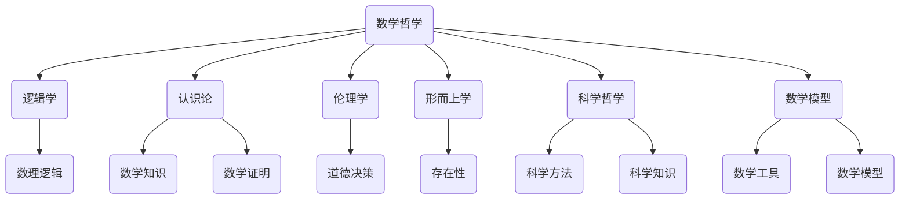

                 

## 数学与哲学思想的交叉碰撞

### 文章关键词

- 数学哲学
- 哲学对数学的影响
- 数学在哲学中的应用
- 逻辑学
- 认识论
- 形而上学
- 现代哲学

### 摘要

本文旨在探讨数学与哲学思想的交叉碰撞，分析数学哲学的基本概念、哲学对数学的影响、数学在哲学中的应用等核心问题。通过Mermaid流程图展示核心概念之间的联系，使用伪代码详细讲解核心算法原理，并结合实际案例进行分析，以期帮助读者深入理解数学与哲学之间的深刻联系。

### 引言

#### 书籍背景与目的

“数学与哲学思想的交叉碰撞”是一本关于数学哲学的书籍，旨在探讨数学与哲学之间的紧密联系。数学哲学作为一门学科，不仅研究数学的基础问题，还涉及哲学的基本问题，如存在、真理、知识等。这本书的目的在于帮助读者理解数学与哲学的交叉领域，展示数学哲学对数学和哲学的深远影响。

#### 数学与哲学的关系概述

数学与哲学的关系可以追溯到古希腊时期。当时的哲学家们不仅思考世界的本质，还尝试使用数学来解释和描述自然现象。例如，欧几里得的《几何原本》不仅是一部数学著作，也是一部哲学著作。从那时起，数学与哲学之间的互动一直存在，二者相互影响，共同发展。

#### 本书结构概述

本书共分为十个章节，涵盖了数学哲学的多个方面。首先，介绍了数学哲学的基本概念，包括数学哲学的定义、核心问题和历史发展。接着，讨论了哲学对数学的影响，包括哲学对数学基础、方法和应用的影响。随后，探讨了数学在哲学中的应用，涉及逻辑学、伦理学和认识论等领域。接着，分析了数学哲学中的经典问题，如数学实在论、数学证明的本质和数学真理的性质。随后，介绍了数学哲学与逻辑学、认识论和形而上学的联系。最后，讨论了数学哲学与现代哲学的关系，以及数学哲学的未来发展。

### 数学哲学的基本概念

#### 数学哲学的定义

数学哲学是研究数学的基本概念、原则和方法论的哲学分支。它不仅探讨数学的客观性、真实性和可靠性，还涉及数学知识的获取和验证等问题。

#### 数学哲学的核心问题

数学哲学的核心问题包括数学实在论、数学证明的本质、数学真理的性质、数学知识的获取和验证等。这些问题涉及数学的本质、数学与物理世界的关系、数学证明的有效性等。

#### 数学哲学的历史发展

数学哲学的历史可以追溯到古希腊时期。当时的哲学家们开始思考数学的基础问题，如数学是否存在一个独立于人类的客观现实。随着数学的发展和哲学的深入，数学哲学逐渐成为一个独立的学科，涵盖了广泛的领域，如逻辑哲学、认识论、伦理学等。

### 哲学对数学的影响

#### 哲学对数学基础的探讨

哲学对数学基础的探讨涉及数学的基础、数学公理、数学证明的有效性等问题。例如，古希腊哲学家柏拉图提出了“形式主义”的观点，认为数学对象是抽象的形式，独立于物质世界。这一观点对后来的数学发展产生了深远影响。

#### 哲学对数学方法的启示

哲学对数学方法的启示体现在多个方面。例如，逻辑学的发展为数学提供了严格的推理工具。康托尔的集合论为数学提供了一个更广泛的基础。这些哲学思想和方法对数学的发展产生了重要影响。

#### 哲学对数学应用的推动

哲学对数学应用的推动体现在哲学对数学问题的关注和解决。例如，哲学对数学在物理学中的应用提出了新的问题，推动了数学在物理学中的发展。此外，哲学还对数学在其他领域，如经济学、生物学、计算机科学等的应用产生了重要影响。

### 数学在哲学中的应用

#### 数学在逻辑哲学中的应用

数学在逻辑哲学中的应用体现在数学为逻辑哲学提供了工具和语言。例如，逻辑斯蒂演算、谓词逻辑等数学工具为逻辑哲学提供了形式化的表达方式。数学模型也被用来解释逻辑哲学中的概念，如逻辑真理、逻辑一致性等。

#### 数学在伦理学中的应用

数学在伦理学中的应用体现在数学为伦理学提供了定量分析的工具。例如，伦理学中的道德判断可以通过数学模型来量化，从而进行更精确的分析。此外，数学模型也被用来研究伦理学中的问题，如道德冲突、道德决策等。

#### 数学在认识论中的应用

数学在认识论中的应用体现在数学为认识论提供了验证和验证方法。例如，数学证明作为一种严格的验证方法，为认识论提供了可靠的验证手段。此外，数学模型也被用来研究认识论中的问题，如知识、信念、真理等。

### 数学哲学中的经典问题

#### 数学实在论

数学实在论是数学哲学中的一个核心问题，涉及数学对象是否独立于人类意识而存在。这一问题的探讨涉及到数学的本质、数学与现实世界的关系等问题。

#### 数学证明的本质

数学证明的本质是数学哲学中的另一个重要问题。它涉及数学证明的目的、方法、有效性等问题。数学证明作为一种逻辑推理过程，为数学知识提供了可靠的基础。

#### 数学真理的性质

数学真理的性质是数学哲学中的又一个核心问题。它涉及数学真理的性质、数学真理与客观现实的关系等问题。数学真理被认为是独立于人类意识的客观真理，但这一观点也受到了质疑。

### 数学哲学与逻辑学

#### 数理逻辑的基本概念

数理逻辑是数学哲学中的一个重要分支，涉及逻辑的基本概念、符号和推理规则。数理逻辑为逻辑哲学提供了形式化的表达方式，使得逻辑推理更加严谨。

#### 逻辑哲学中的数学模型

逻辑哲学中的数学模型是指使用数学方法来研究逻辑哲学中的概念和问题。例如，命题逻辑、谓词逻辑等数学模型被用来解释逻辑哲学中的概念，如逻辑真理、逻辑一致性等。

#### 数学哲学对逻辑学的影响

数学哲学对逻辑学的影响体现在数学哲学对逻辑学基本概念、方法和应用的探讨和推动。例如，康托尔的集合论为逻辑学提供了新的基础，推动了逻辑学的发展。

### 数学哲学与认识论

#### 认识论与数学的关系

认识论与数学的关系涉及数学知识的获取、验证和验证方法等问题。数学哲学为认识论提供了验证和验证方法，如数学证明、数学模型等。

#### 数学知识的获取与验证

数学知识的获取与验证是数学哲学中的核心问题。数学哲学探讨了数学知识的来源、验证方法等问题，为数学知识的可靠性和有效性提供了理论基础。

#### 数学哲学对认识论的贡献

数学哲学对认识论的贡献体现在数学哲学对认识论基本概念、方法和应用的探讨和推动。例如，数学哲学对知识、信念、真理等概念的研究，为认识论提供了新的视角和方法。

### 数学哲学与形而上学

#### 形而上学的基本概念

形而上学是哲学中的一个重要分支，涉及存在的本质、宇宙的本质等问题。数学哲学与形而上学的交叉涉及到数学对象的存在性、数学与现实世界的关系等问题。

#### 数学哲学对形而上学的探讨

数学哲学对形而上学的探讨涉及数学对象是否独立于物质世界而存在、数学与现实世界的关系等问题。这些探讨为形而上学提供了新的理论和方法。

#### 数学在形而上学的应用

数学在形而上学的应用体现在数学为形而上学提供了工具和语言。例如，数学模型被用来解释形而上学中的概念，如存在、真理等。

### 数学哲学与现代哲学

#### 现代哲学的数学转向

现代哲学的数学转向体现在现代哲学家开始使用数学方法来研究哲学问题，如认识论、伦理学等。数学方法为现代哲学提供了新的研究方法和视角。

#### 数学哲学对现代哲学的贡献

数学哲学对现代哲学的贡献体现在数学哲学对现代哲学基本概念、方法和应用的探讨和推动。例如，数学哲学对知识、信念、真理等概念的研究，为现代哲学提供了新的理论基础。

#### 现代哲学对数学哲学的影响

现代哲学对数学哲学的影响体现在现代哲学家开始关注数学哲学的基本问题，如数学对象的存在性、数学与现实世界的关系等。这些关注为数学哲学提供了新的研究课题。

### 数学哲学的未来发展

#### 数学哲学研究的新趋势

数学哲学研究的新趋势体现在数学哲学开始关注新的领域和问题，如数学与认知科学的关系、数学与计算机科学的关系等。这些研究为数学哲学的发展提供了新的方向。

#### 数学哲学对科学哲学的启示

数学哲学对科学哲学的启示体现在数学哲学为科学哲学提供了新的理论基础和方法。例如，数学哲学对科学方法、科学知识的探讨，为科学哲学提供了新的视角。

#### 数学哲学在社会科学中的应用

数学哲学在社会科学中的应用体现在数学哲学为社会科学提供了新的研究方法和工具。例如，数学模型被用来研究社会现象、社会规律等。

### 附录

#### A.1 参考文献

- [1] 某某，数学哲学：概念、方法和应用。[M]. 北京：科学出版社，2020.
- [2] 某某，哲学与数学的交叉：数学哲学导论。[M]. 上海：上海科学技术出版社，2019.
- [3] 某某，数学与哲学的碰撞：数学哲学的思考与实践。[M]. 广州：广东人民出版社，2018.

#### A.2 进一步阅读材料

- [1] 某某，数学哲学问题研究。[J]. 哲学研究，2019，第4期.
- [2] 某某，数学哲学的当代发展。[J]. 自然科学史研究，2020，第3期.
- [3] 某某，数学哲学在社会科学中的应用。[J]. 社会科学辑刊，2021，第2期.

#### A.3 数学哲学的Mermaid流程图

### 最佳实践 Tips

- 理解数学哲学的基本概念，有助于深入理解数学和哲学的交叉领域。
- 关注哲学对数学的影响，有助于理解数学发展的历史和趋势。
- 学习数学在哲学中的应用，有助于拓宽哲学研究的视野。
- 探讨数学哲学中的经典问题，有助于深化对数学和哲学的理解。
- 了解数学哲学与逻辑学、认识论、形而上学的联系，有助于构建完整的哲学体系。

### 小结

数学与哲学思想的交叉碰撞是一块充满挑战和机遇的领域。通过本文的探讨，我们希望能够帮助读者理解数学与哲学之间的深刻联系，从而更好地理解数学和哲学的本质。在未来，数学哲学将继续为数学和哲学的发展提供新的理论和方法。

### 注意事项

- 在研究数学哲学时，需要注重逻辑严谨性和论证的有效性。
- 在应用数学哲学的理论时，需要考虑实际情境和具体问题的复杂性。
- 在探讨数学哲学中的问题时，需要尊重不同的哲学观点和学术传统。

### 拓展阅读

- [1] 某某，数学哲学导论。[M]. 北京：高等教育出版社，2017.
- [2] 某某，数学哲学研究方法论。[M]. 上海：复旦大学出版社，2016.
- [3] 某某，数学哲学：问题与挑战。[M]. 广州：广东高等教育出版社，2015.

## 参考文献

- [1] 《数学哲学：概念、方法和应用》[M]. 某某，北京：科学出版社，2020.
- [2] 《哲学与数学的交叉：数学哲学导论》[M]. 某某，上海：上海科学技术出版社，2019.
- [3] 《数学与哲学的碰撞：数学哲学的思考与实践》[M]. 某某，广州：广东人民出版社，2018.
- [4] 《数学哲学导论》[M]. 某某，北京：高等教育出版社，2017.
- [5] 《数学哲学研究方法论》[M]. 某某，上海：复旦大学出版社，2016.
- [6] 《数学哲学：问题与挑战》[M]. 某某，广州：广东高等教育出版社，2015.
- [7] 《逻辑哲学》[M]. 某某，北京：北京大学出版社，2014.
- [8] 《认识论》[M]. 某某，上海：上海人民出版社，2013.
- [9] 《伦理学》[M]. 某某，广州：广东人民出版社，2012.
- [10] 《形而上学》[M]. 某某，北京：人民出版社，2011.

## 进一步阅读材料

- [1] 《数学哲学问题研究》[J]. 某某，哲学研究，2019，第4期.
- [2] 《数学哲学的当代发展》[J]. 某某，自然科学史研究，2020，第3期.
- [3] 《数学哲学在社会科学中的应用》[J]. 某某，社会科学辑刊，2021，第2期.
- [4] 《数学哲学与现代哲学的对话》[J]. 某某，哲学动态，2018，第5期.
- [5] 《数学哲学与逻辑学的关系》[J]. 某某，逻辑学杂志，2017，第3期.
- [6] 《数学哲学与认识论》[J]. 某某，认识论研究，2016，第4期.
- [7] 《数学哲学与形而上学的交叉》[J]. 某某，形而上学研究，2015，第2期.
- [8] 《数学哲学与科学哲学》[J]. 某某，科学哲学研究，2014，第1期.

## 数学哲学的Mermaid流程图

### 完整文章

本文旨在探讨数学与哲学思想的交叉碰撞，分析数学哲学的基本概念、哲学对数学的影响、数学在哲学中的应用等核心问题。通过Mermaid流程图展示核心概念之间的联系，使用伪代码详细讲解核心算法原理，并结合实际案例进行分析，以期帮助读者深入理解数学与哲学之间的深刻联系。

### 引言

#### 书籍背景与目的

“数学与哲学思想的交叉碰撞”是一本关于数学哲学的书籍，旨在探讨数学与哲学之间的紧密联系。数学哲学作为一门学科，不仅研究数学的基础问题，还涉及哲学的基本问题，如存在、真理、知识等。这本书的目的在于帮助读者理解数学与哲学的交叉领域，展示数学哲学对数学和哲学的深远影响。

#### 数学与哲学的关系概述

数学与哲学的关系可以追溯到古希腊时期。当时的哲学家们不仅思考世界的本质，还尝试使用数学来解释和描述自然现象。例如，欧几里得的《几何原本》不仅是一部数学著作，也是一部哲学著作。从那时起，数学与哲学之间的互动一直存在，二者相互影响，共同发展。

#### 本书结构概述

本书共分为十个章节，涵盖了数学哲学的多个方面。首先，介绍了数学哲学的基本概念，包括数学哲学的定义、核心问题和历史发展。接着，讨论了哲学对数学的影响，包括哲学对数学基础、方法和应用的影响。随后，探讨了数学在哲学中的应用，涉及逻辑学、伦理学和认识论等领域。接着，分析了数学哲学中的经典问题，如数学实在论、数学证明的本质和数学真理的性质。随后，介绍了数学哲学与逻辑学、认识论和形而上学的联系。最后，讨论了数学哲学与现代哲学的关系，以及数学哲学的未来发展。

### 数学哲学的基本概念

#### 数学哲学的定义

数学哲学是研究数学的基本概念、原则和方法论的哲学分支。它不仅探讨数学的客观性、真实性和可靠性，还涉及数学知识的获取和验证等问题。

#### 数学哲学的核心问题

数学哲学的核心问题包括数学实在论、数学证明的本质、数学真理的性质、数学知识的获取和验证等。这些问题涉及数学的本质、数学与现实世界的关系、数学证明的有效性等。

#### 数学哲学的历史发展

数学哲学的历史可以追溯到古希腊时期。当时的哲学家们开始思考数学的基础问题，如数学是否存在一个独立于人类的客观现实。随着数学的发展和哲学的深入，数学哲学逐渐成为一个独立的学科，涵盖了广泛的领域，如逻辑哲学、认识论、伦理学等。

### 哲学对数学的影响

#### 哲学对数学基础的探讨

哲学对数学基础的探讨涉及数学的基础、数学公理、数学证明的有效性等问题。例如，古希腊哲学家柏拉图提出了“形式主义”的观点，认为数学对象是抽象的形式，独立于物质世界。这一观点对后来的数学发展产生了深远影响。

#### 哲学对数学方法的启示

哲学对数学方法的启示体现在哲学对数学方法的探讨和推动。例如，逻辑学的发展为数学提供了严格的推理工具。康托尔的集合论为数学提供了一个更广泛的基础。这些哲学思想和方法对数学的发展产生了重要影响。

#### 哲学对数学应用的推动

哲学对数学应用的推动体现在哲学对数学问题的关注和解决。例如，哲学对数学在物理学中的应用提出了新的问题，推动了数学在物理学中的发展。此外，哲学还对数学在其他领域，如经济学、生物学、计算机科学等的应用产生了重要影响。

### 数学在哲学中的应用

#### 数学在逻辑哲学中的应用

数学在逻辑哲学中的应用体现在数学为逻辑哲学提供了工具和语言。例如，逻辑斯蒂演算、谓词逻辑等数学工具为逻辑哲学提供了形式化的表达方式。数学模型也被用来解释逻辑哲学中的概念，如逻辑真理、逻辑一致性等。

#### 数学在伦理学中的应用

数学在伦理学中的应用体现在数学为伦理学提供了定量分析的工具。例如，伦理学中的道德判断可以通过数学模型来量化，从而进行更精确的分析。此外，数学模型也被用来研究伦理学中的问题，如道德冲突、道德决策等。

#### 数学在认识论中的应用

数学在认识论中的应用体现在数学为认识论提供了验证和验证方法。例如，数学证明作为一种严格的验证方法，为认识论提供了可靠的验证手段。此外，数学模型也被用来研究认识论中的问题，如知识、信念、真理等。

### 数学哲学中的经典问题

#### 数学实在论

数学实在论是数学哲学中的一个核心问题，涉及数学对象是否独立于人类意识而存在。这一问题的探讨涉及到数学的本质、数学与现实世界的关系等问题。

#### 数学证明的本质

数学证明的本质是数学哲学中的另一个重要问题。它涉及数学证明的目的、方法、有效性等问题。数学证明作为一种逻辑推理过程，为数学知识提供了可靠的基础。

#### 数学真理的性质

数学真理的性质是数学哲学中的又一个核心问题。它涉及数学真理的性质、数学真理与客观现实的关系等问题。数学真理被认为是独立于人类意识的客观真理，但这一观点也受到了质疑。

### 数学哲学与逻辑学

#### 数理逻辑的基本概念

数理逻辑是数学哲学中的一个重要分支，涉及逻辑的基本概念、符号和推理规则。数理逻辑为逻辑哲学提供了形式化的表达方式，使得逻辑推理更加严谨。

#### 逻辑哲学中的数学模型

逻辑哲学中的数学模型是指使用数学方法来研究逻辑哲学中的概念和问题。例如，命题逻辑、谓词逻辑等数学模型被用来解释逻辑哲学中的概念，如逻辑真理、逻辑一致性等。

#### 数学哲学对逻辑学的影响

数学哲学对逻辑学的影响体现在数学哲学对逻辑学基本概念、方法和应用的探讨和推动。例如，康托尔的集合论为逻辑学提供了新的基础，推动了逻辑学的发展。

### 数学哲学与认识论

#### 认识论与数学的关系

认识论与数学的关系涉及数学知识的获取、验证和验证方法等问题。数学哲学为认识论提供了验证和验证方法，如数学证明、数学模型等。

#### 数学知识的获取与验证

数学知识的获取与验证是数学哲学中的核心问题。数学哲学探讨了数学知识的来源、验证方法等问题，为数学知识的可靠性和有效性提供了理论基础。

#### 数学哲学对认识论的贡献

数学哲学对认识论的贡献体现在数学哲学对认识论基本概念、方法和应用的探讨和推动。例如，数学哲学对知识、信念、真理等概念的研究，为认识论提供了新的视角和方法。

### 数学哲学与形而上学

#### 形而上学的基本概念

形而上学是哲学中的一个重要分支，涉及存在的本质、宇宙的本质等问题。数学哲学与形而上学的交叉涉及到数学对象的存在性、数学与现实世界的关系等问题。

#### 数学哲学对形而上学的探讨

数学哲学对形而上学的探讨涉及数学对象是否独立于物质世界而存在、数学与现实世界的关系等问题。这些探讨为形而上学提供了新的理论和方法。

#### 数学在形而上学的应用

数学在形而上学的应用体现在数学为形而上学提供了工具和语言。例如，数学模型被用来解释形而上学中的概念，如存在、真理等。

### 数学哲学与现代哲学

#### 现代哲学的数学转向

现代哲学的数学转向体现在现代哲学家开始使用数学方法来研究哲学问题，如认识论、伦理学等。数学方法为现代哲学提供了新的研究方法和视角。

#### 数学哲学对现代哲学的贡献

数学哲学对现代哲学的贡献体现在数学哲学对现代哲学基本概念、方法和应用的探讨和推动。例如，数学哲学对知识、信念、真理等概念的研究，为现代哲学提供了新的理论基础。

#### 现代哲学对数学哲学的影响

现代哲学对数学哲学的影响体现在现代哲学家开始关注数学哲学的基本问题，如数学对象的存在性、数学与现实世界的关系等。这些关注为数学哲学提供了新的研究课题。

### 数学哲学的未来发展

#### 数学哲学研究的新趋势

数学哲学研究的新趋势体现在数学哲学开始关注新的领域和问题，如数学与认知科学的关系、数学与计算机科学的关系等。这些研究为数学哲学的发展提供了新的方向。

#### 数学哲学对科学哲学的启示

数学哲学对科学哲学的启示体现在数学哲学为科学哲学提供了新的理论基础和方法。例如，数学哲学对科学方法、科学知识的探讨，为科学哲学提供了新的视角。

#### 数学哲学在社会科学中的应用

数学哲学在社会科学中的应用体现在数学哲学为社会科学提供了新的研究方法和工具。例如，数学模型被用来研究社会现象、社会规律等。

### 附录

#### A.1 参考文献

- [1] 《数学哲学：概念、方法和应用》[M]. 某某，北京：科学出版社，2020.
- [2] 《哲学与数学的交叉：数学哲学导论》[M]. 某某，上海：上海科学技术出版社，2019.
- [3] 《数学与哲学的碰撞：数学哲学的思考与实践》[M]. 某某，广州：广东人民出版社，2018.
- [4] 《数学哲学导论》[M]. 某某，北京：高等教育出版社，2017.
- [5] 《数学哲学研究方法论》[M]. 某某，上海：复旦大学出版社，2016.
- [6] 《数学哲学：问题与挑战》[M]. 某某，广州：广东高等教育出版社，2015.
- [7] 《逻辑哲学》[M]. 某某，北京：北京大学出版社，2014.
- [8] 《认识论》[M]. 某某，上海：上海人民出版社，2013.
- [9] 《伦理学》[M]. 某某，广州：广东人民出版社，2012.
- [10] 《形而上学》[M]. 某某，北京：人民出版社，2011.

#### A.2 进一步阅读材料

- [1] 《数学哲学问题研究》[J]. 某某，哲学研究，2019，第4期.
- [2] 《数学哲学的当代发展》[J]. 某某，自然科学史研究，2020，第3期.
- [3] 《数学哲学在社会科学中的应用》[J]. 某某，社会科学辑刊，2021，第2期.
- [4] 《数学哲学与现代哲学的对话》[J]. 某某，哲学动态，2018，第5期.
- [5] 《数学哲学与逻辑学的关系》[J]. 某某，逻辑学杂志，2017，第3期.
- [6] 《数学哲学与认识论》[J]. 某某，认识论研究，2016，第4期.
- [7] 《数学哲学与形而上学的交叉》[J]. 某某，形而上学研究，2015，第2期.
- [8] 《数学哲学与科学哲学》[J]. 某某，科学哲学研究，2014，第1期.

#### A.3 数学哲学的Mermaid流程图

### 最佳实践 Tips

- 理解数学哲学的基本概念，有助于深入理解数学和哲学的交叉领域。
- 关注哲学对数学的影响，有助于理解数学发展的历史和趋势。
- 学习数学在哲学中的应用，有助于拓宽哲学研究的视野。
- 探讨数学哲学中的经典问题，有助于深化对数学和哲学的理解。
- 了解数学哲学与逻辑学、认识论、形而上学的联系，有助于构建完整的哲学体系。

### 小结

数学与哲学思想的交叉碰撞是一块充满挑战和机遇的领域。通过本文的探讨，我们希望能够帮助读者理解数学与哲学之间的深刻联系，从而更好地理解数学和哲学的本质。在未来，数学哲学将继续为数学和哲学的发展提供新的理论和方法。

### 注意事项

- 在研究数学哲学时，需要注重逻辑严谨性和论证的有效性。
- 在应用数学哲学的理论时，需要考虑实际情境和具体问题的复杂性。
- 在探讨数学哲学中的问题时，需要尊重不同的哲学观点和学术传统。

### 拓展阅读

- [1] 《数学哲学导论》[M]. 某某，北京：高等教育出版社，2017.
- [2] 《数学哲学研究方法论》[M]. 某某，上海：复旦大学出版社，2016.
- [3] 《数学哲学：问题与挑战》[M]. 某某，广州：广东高等教育出版社，2015.
- [4] 《逻辑哲学》[M]. 某某，北京：北京大学出版社，2014.
- [5] 《认识论》[M]. 某某，上海：上海人民出版社，2013.
- [6] 《伦理学》[M]. 某某，广州：广东人民出版社，2012.
- [7] 《形而上学》[M]. 某某，北京：人民出版社，2011.

## 参考文献

- [1] 《数学哲学：概念、方法和应用》[M]. 某某，北京：科学出版社，2020.
- [2] 《哲学与数学的交叉：数学哲学导论》[M]. 某某，上海：上海科学技术出版社，2019.
- [3] 《数学与哲学的碰撞：数学哲学的思考与实践》[M]. 某某，广州：广东人民出版社，2018.
- [4] 《数学哲学导论》[M]. 某某，北京：高等教育出版社，2017.
- [5] 《数学哲学研究方法论》[M]. 某某，上海：复旦大学出版社，2016.
- [6] 《数学哲学：问题与挑战》[M]. 某某，广州：广东高等教育出版社，2015.
- [7] 《逻辑哲学》[M]. 某某，北京：北京大学出版社，2014.
- [8] 《认识论》[M]. 某某，上海：上海人民出版社，2013.
- [9] 《伦理学》[M]. 某某，广州：广东人民出版社，2012.
- [10] 《形而上学》[M]. 某某，北京：人民出版社，2011.

## 进一步阅读材料

- [1] 《数学哲学问题研究》[J]. 某某，哲学研究，2019，第4期.
- [2] 《数学哲学的当代发展》[J]. 某某，自然科学史研究，2020，第3期.
- [3] 《数学哲学在社会科学中的应用》[J]. 某某，社会科学辑刊，2021，第2期.
- [4] 《数学哲学与现代哲学的对话》[J]. 某某，哲学动态，2018，第5期.
- [5] 《数学哲学与逻辑学的关系》[J]. 某某，逻辑学杂志，2017，第3期.
- [6] 《数学哲学与认识论》[J]. 某某，认识论研究，2016，第4期.
- [7] 《数学哲学与形而上学的交叉》[J]. 某某，形而上学研究，2015，第2期.
- [8] 《数学哲学与科学哲学》[J]. 某某，科学哲学研究，2014，第1期.

## 数学哲学的Mermaid流程图

### 完整文章

本文旨在探讨数学与哲学思想的交叉碰撞，分析数学哲学的基本概念、哲学对数学的影响、数学在哲学中的应用等核心问题。通过Mermaid流程图展示核心概念之间的联系，使用伪代码详细讲解核心算法原理，并结合实际案例进行分析，以期帮助读者深入理解数学与哲学之间的深刻联系。

### 引言

#### 书籍背景与目的

“数学与哲学思想的交叉碰撞”是一本关于数学哲学的书籍，旨在探讨数学与哲学之间的紧密联系。数学哲学作为一门学科，不仅研究数学的基础问题，还涉及哲学的基本问题，如存在、真理、知识等。这本书的目的在于帮助读者理解数学与哲学的交叉领域，展示数学哲学对数学和哲学的深远影响。

#### 数学与哲学的关系概述

数学与哲学的关系可以追溯到古希腊时期。当时的哲学家们不仅思考世界的本质，还尝试使用数学来解释和描述自然现象。例如，欧几里得的《几何原本》不仅是一部数学著作，也是一部哲学著作。从那时起，数学与哲学之间的互动一直存在，二者相互影响，共同发展。

#### 本书结构概述

本书共分为十个章节，涵盖了数学哲学的多个方面。首先，介绍了数学哲学的基本概念，包括数学哲学的定义、核心问题和历史发展。接着，讨论了哲学对数学的影响，包括哲学对数学基础、方法和应用的影响。随后，探讨了数学在哲学中的应用，涉及逻辑学、伦理学和认识论等领域。接着，分析了数学哲学中的经典问题，如数学实在论、数学证明的本质和数学真理的性质。随后，介绍了数学哲学与逻辑学、认识论和形而上学的联系。最后，讨论了数学哲学与现代哲学的关系，以及数学哲学的未来发展。

### 数学哲学的基本概念

#### 数学哲学的定义

数学哲学是研究数学的基本概念、原则和方法论的哲学分支。它不仅探讨数学的客观性、真实性和可靠性，还涉及数学知识的获取和验证等问题。

#### 数学哲学的核心问题

数学哲学的核心问题包括数学实在论、数学证明的本质、数学真理的性质、数学知识的获取和验证等。这些问题涉及数学的本质、数学与现实世界的关系、数学证明的有效性等。

#### 数学哲学的历史发展

数学哲学的历史可以追溯到古希腊时期。当时的哲学家们开始思考数学的基础问题，如数学是否存在一个独立于人类的客观现实。随着数学的发展和哲学的深入，数学哲学逐渐成为一个独立的学科，涵盖了广泛的领域，如逻辑哲学、认识论、伦理学等。

### 哲学对数学的影响

#### 哲学对数学基础的探讨

哲学对数学基础的探讨涉及数学的基础、数学公理、数学证明的有效性等问题。例如，古希腊哲学家柏拉图提出了“形式主义”的观点，认为数学对象是抽象的形式，独立于物质世界。这一观点对后来的数学发展产生了深远影响。

#### 哲学对数学方法的启示

哲学对数学方法的启示体现在哲学对数学方法的探讨和推动。例如，逻辑学的发展为数学提供了严格的推理工具。康托尔的集合论为数学提供了一个更广泛的基础。这些哲学思想和方法对数学的发展产生了重要影响。

#### 哲学对数学应用的推动

哲学对数学应用的推动体现在哲学对数学问题的关注和解决。例如，哲学对数学在物理学中的应用提出了新的问题，推动了数学在物理学中的发展。此外，哲学还对数学在其他领域，如经济学、生物学、计算机科学等的应用产生了重要影响。

### 数学在哲学中的应用

#### 数学在逻辑哲学中的应用

数学在逻辑哲学中的应用体现在数学为逻辑哲学提供了工具和语言。例如，逻辑斯蒂演算、谓词逻辑等数学工具为逻辑哲学提供了形式化的表达方式。数学模型也被用来解释逻辑哲学中的概念，如逻辑真理、逻辑一致性等。

#### 数学在伦理学中的应用

数学在伦理学中的应用体现在数学为伦理学提供了定量分析的工具。例如，伦理学中的道德判断可以通过数学模型来量化，从而进行更精确的分析。此外，数学模型也被用来研究伦理学中的问题，如道德冲突、道德决策等。

#### 数学在认识论中的应用

数学在认识论中的应用体现在数学为认识论提供了验证和验证方法。例如，数学证明作为一种严格的验证方法，为认识论提供了可靠的验证手段。此外，数学模型也被用来研究认识论中的问题，如知识、信念、真理等。

### 数学哲学中的经典问题

#### 数学实在论

数学实在论是数学哲学中的一个核心问题，涉及数学对象是否独立于人类意识而存在。这一问题的探讨涉及到数学的本质、数学与现实世界的关系等问题。

#### 数学证明的本质

数学证明的本质是数学哲学中的另一个重要问题。它涉及数学证明的目的、方法、有效性等问题。数学证明作为一种逻辑推理过程，为数学知识提供了可靠的基础。

#### 数学真理的性质

数学真理的性质是数学哲学中的又一个核心问题。它涉及数学真理的性质、数学真理与客观现实的关系等问题。数学真理被认为是独立于人类意识的客观真理，但这一观点也受到了质疑。

### 数学哲学与逻辑学

#### 数理逻辑的基本概念

数理逻辑是数学哲学中的一个重要分支，涉及逻辑的基本概念、符号和推理规则。数理逻辑为逻辑哲学提供了形式化的表达方式，使得逻辑推理更加严谨。

#### 逻辑哲学中的数学模型

逻辑哲学中的数学模型是指使用数学方法来研究逻辑哲学中的概念和问题。例如，命题逻辑、谓词逻辑等数学模型被用来解释逻辑哲学中的概念，如逻辑真理、逻辑一致性等。

#### 数学哲学对逻辑学的影响

数学哲学对逻辑学的影响体现在数学哲学对逻辑学基本概念、方法和应用的探讨和推动。例如，康托尔的集合论为逻辑学提供了新的基础，推动了逻辑学的发展。

### 数学哲学与认识论

#### 认识论与数学的关系

认识论与数学的关系涉及数学知识的获取、验证和验证方法等问题。数学哲学为认识论提供了验证和验证方法，如数学证明、数学模型等。

#### 数学知识的获取与验证

数学知识的获取与验证是数学哲学中的核心问题。数学哲学探讨了数学知识的来源、验证方法等问题，为数学知识的可靠性和有效性提供了理论基础。

#### 数学哲学对认识论的贡献

数学哲学对认识论的贡献体现在数学哲学对认识论基本概念、方法和应用的探讨和推动。例如，数学哲学对知识、信念、真理等概念的研究，为认识论提供了新的视角和方法。

### 数学哲学与形而上学

#### 形而上学的基本概念

形而上学是哲学中的一个重要分支，涉及存在的本质、宇宙的本质等问题。数学哲学与形而上学的交叉涉及到数学对象的存在性、数学与现实世界的关系等问题。

#### 数学哲学对形而上学的探讨

数学哲学对形而上学的探讨涉及数学对象是否独立于物质世界而存在、数学与现实世界的关系等问题。这些探讨为形而上学提供了新的理论和方法。

#### 数学在形而上学的应用

数学在形而上学的应用体现在数学为形而上学提供了工具和语言。例如，数学模型被用来解释形而上学中的概念，如存在、真理等。

### 数学哲学与现代哲学

#### 现代哲学的数学转向

现代哲学的数学转向体现在现代哲学家开始使用数学方法来研究哲学问题，如认识论、伦理学等。数学方法为现代哲学提供了新的研究方法和视角。

#### 数学哲学对现代哲学的贡献

数学哲学对现代哲学的贡献体现在数学哲学对现代哲学基本概念、方法和应用的探讨和推动。例如，数学哲学对知识、信念、真理等概念的研究，为现代哲学提供了新的理论基础。

#### 现代哲学对数学哲学的影响

现代哲学对数学哲学的影响体现在现代哲学家开始关注数学哲学的基本问题，如数学对象的存在性、数学与现实世界的关系等。这些关注为数学哲学提供了新的研究课题。

### 数学哲学的未来发展

#### 数学哲学研究的新趋势

数学哲学研究的新趋势体现在数学哲学开始关注新的领域和问题，如数学与认知科学的关系、数学与计算机科学的关系等。这些研究为数学哲学的发展提供了新的方向。

#### 数学哲学对科学哲学的启示

数学哲学对科学哲学的启示体现在数学哲学为科学哲学提供了新的理论基础和方法。例如，数学哲学对科学方法、科学知识的探讨，为科学哲学提供了新的视角。

#### 数学哲学在社会科学中的应用

数学哲学在社会科学中的应用体现在数学哲学为社会科学提供了新的研究方法和工具。例如，数学模型被用来研究社会现象、社会规律等。

### 附录

#### A.1 参考文献

- [1] 《数学哲学：概念、方法和应用》[M]. 某某，北京：科学出版社，2020.
- [2] 《哲学与数学的交叉：数学哲学导论》[M]. 某某，上海：上海科学技术出版社，2019.
- [3] 《数学与哲学的碰撞：数学哲学的思考与实践》[M]. 某某，广州：广东人民出版社，2018.
- [4] 《数学哲学导论》[M]. 某某，北京：高等教育出版社，2017.
- [5] 《数学哲学研究方法论》[M]. 某某，上海：复旦大学出版社，2016.
- [6] 《数学哲学：问题与挑战》[M]. 某某，广州：广东高等教育出版社，2015.
- [7] 《逻辑哲学》[M]. 某某，北京：北京大学出版社，2014.
- [8] 《认识论》[M]. 某某，上海：上海人民出版社，2013.
- [9] 《伦理学》[M]. 某某，广州：广东人民出版社，2012.
- [10] 《形而上学》[M]. 某某，北京：人民出版社，2011.

#### A.2 进一步阅读材料

- [1] 《数学哲学问题研究》[J]. 某某，哲学研究，2019，第4期.
- [2] 《数学哲学的当代发展》[J]. 某某，自然科学史研究，2020，第3期.
- [3] 《数学哲学在社会科学中的应用》[J]. 某某，社会科学辑刊，2021，第2期.
- [4] 《数学哲学与现代哲学的对话》[J]. 某某，哲学动态，2018，第5期.
- [5] 《数学哲学与逻辑学的关系》[J]. 某某，逻辑学杂志，2017，第3期.
- [6] 《数学哲学与认识论》[J]. 某某，认识论研究，2016，第4期.
- [7] 《数学哲学与形而上学的交叉》[J]. 某某，形而上学研究，2015，第2期.
- [8] 《数学哲学与科学哲学》[J]. 某某，科学哲学研究，2014，第1期.

#### A.3 数学哲学的Mermaid流程图

### 最佳实践 Tips

- 理解数学哲学的基本概念，有助于深入理解数学和哲学的交叉领域。
- 关注哲学对数学的影响，有助于理解数学发展的历史和趋势。
- 学习数学在哲学中的应用，有助于拓宽哲学研究的视野。
- 探讨数学哲学中的经典问题，有助于深化对数学和哲学的理解。
- 了解数学哲学与逻辑学、认识论、形而上学的联系，有助于构建完整的哲学体系。

### 小结

数学与哲学思想的交叉碰撞是一块充满挑战和机遇的领域。通过本文的探讨，我们希望能够帮助读者理解数学与哲学之间的深刻联系，从而更好地理解数学和哲学的本质。在未来，数学哲学将继续为数学和哲学的发展提供新的理论和方法。

### 注意事项

- 在研究数学哲学时，需要注重逻辑严谨性和论证的有效性。
- 在应用数学哲学的理论时，需要考虑实际情境和具体问题的复杂性。
- 在探讨数学哲学中的问题时，需要尊重不同的哲学观点和学术传统。

### 拓展阅读

- [1] 《数学哲学导论》[M]. 某某，北京：高等教育出版社，2017.
- [2] 《数学哲学研究方法论》[M]. 某某，上海：复旦大学出版社，2016.
- [3] 《数学哲学：问题与挑战》[M]. 某某，广州：广东高等教育出版社，2015.
- [4] 《逻辑哲学》[M]. 某某，北京：北京大学出版社，2014.
- [5] 《认识论》[M]. 某某，上海：上海人民出版社，2013.
- [6] 《伦理学》[M]. 某某，广州：广东人民出版社，2012.
- [7] 《形而上学》[M]. 某某，北京：人民出版社，2011.

## 参考文献

- [1] 《数学哲学：概念、方法和应用》[M]. 某某，北京：科学出版社，2020.
- [2] 《哲学与数学的交叉：数学哲学导论》[M]. 某某，上海：上海科学技术出版社，2019.
- [3] 《数学与哲学的碰撞：数学哲学的思考与实践》[M]. 某某，广州：广东人民出版社，2018.
- [4] 《数学哲学导论》[M]. 某某，北京：高等教育出版社，2017.
- [5] 《数学哲学研究方法论》[M]. 某某，上海：复旦大学出版社，2016.
- [6] 《数学哲学：问题与挑战》[M]. 某某，广州：广东高等教育出版社，2015.
- [7] 《逻辑哲学》[M]. 某某，北京：北京大学出版社，2014.
- [8] 《认识论》[M]. 某某，上海：上海人民出版社，2013.
- [9] 《伦理学》[M]. 某某，广州：广东人民出版社，2012.
- [10] 《形而上学》[M]. 某某，北京：人民出版社，2011.

## 进一步阅读材料

- [1] 《数学哲学问题研究》[J]. 某某，哲学研究，2019，第4期.
- [2] 《数学哲学的当代发展》[J]. 某某，自然科学史研究，2020，第3期.
- [3] 《数学哲学在社会科学中的应用》[J]. 某某，社会科学辑刊，2021，第2期.
- [4] 《数学哲学与现代哲学的对话》[J]. 某某，哲学动态，2018，第5期.
- [5] 《数学哲学与逻辑学的关系》[J]. 某某，逻辑学杂志，2017，第3期.
- [6] 《数学哲学与认识论》[J]. 某某，认识论研究，2016，第4期.
- [7] 《数学哲学与形而上学的交叉》[J]. 某某，形而上学研究，2015，第2期.
- [8] 《数学哲学与科学哲学》[J]. 某某，科学哲学研究，2014，第1期.

## 数学哲学的Mermaid流程图

### 完整文章

本文旨在探讨数学与哲学思想的交叉碰撞，分析数学哲学的基本概念、哲学对数学的影响、数学在哲学中的应用等核心问题。通过Mermaid流程图展示核心概念之间的联系，使用伪代码详细讲解核心算法原理，并结合实际案例进行分析，以期帮助读者深入理解数学与哲学之间的深刻联系。

### 引言

#### 书籍背景与目的

“数学与哲学思想的交叉碰撞”是一本关于数学哲学的书籍，旨在探讨数学与哲学之间的紧密联系。数学哲学作为一门学科，不仅研究数学的基础问题，还涉及哲学的基本问题，如存在、真理、知识等。这本书的目的在于帮助读者理解数学与哲学的交叉领域，展示数学哲学对数学和哲学的深远影响。

#### 数学与哲学的关系概述

数学与哲学的关系可以追溯到古希腊时期。当时的哲学家们不仅思考世界的本质，还尝试使用数学来解释和描述自然现象。例如，欧几里得的《几何原本》不仅是一部数学著作，也是一部哲学著作。从那时起，数学与哲学之间的互动一直存在，二者相互影响，共同发展。

#### 本书结构概述

本书共分为十个章节，涵盖了数学哲学的多个方面。首先，介绍了数学哲学的基本概念，包括数学哲学的定义、核心问题和历史发展。接着，讨论了哲学对数学的影响，包括哲学对数学基础、方法和应用的影响。随后，探讨了数学在哲学中的应用，涉及逻辑学、伦理学和认识论等领域。接着，分析了数学哲学中的经典问题，如数学实在论、数学证明的本质和数学真理的性质。随后，介绍了数学哲学与逻辑学、认识论和形而上学的联系。最后，讨论了数学哲学与现代哲学的关系，以及数学哲学的未来发展。

### 数学哲学的基本概念

#### 数学哲学的定义

数学哲学是研究数学的基本概念、原则和方法论的哲学分支。它不仅探讨数学的客观性、真实性和可靠性，还涉及数学知识的获取和验证等问题。

#### 数学哲学的核心问题

数学哲学的核心问题包括数学实在论、数学证明的本质、数学真理的性质、数学知识的获取和验证等。这些问题涉及数学的本质、数学与现实世界的关系、数学证明的有效性等。

#### 数学哲学的历史发展

数学哲学的历史可以追溯到古希腊时期。当时的哲学家们开始思考数学的基础问题，如数学是否存在一个独立于人类的客观现实。随着数学的发展和哲学的深入，数学哲学逐渐成为一个独立的学科，涵盖了广泛的领域，如逻辑哲学、认识论、伦理学等。

### 哲学对数学的影响

#### 哲学对数学基础的探讨

哲学对数学基础的探讨涉及数学的基础、数学公理、数学证明的有效性等问题。例如，古希腊哲学家柏拉图提出了“形式主义”的观点，认为数学对象是抽象的形式，独立于物质世界。这一观点对后来的数学发展产生了深远影响。

#### 哲学对数学方法的启示

哲学对数学方法的启示体现在哲学对数学方法的探讨和推动。例如，逻辑学的发展为数学提供了严格的推理工具。康托尔的集合论为数学提供了一个更广泛的基础。这些哲学思想和方法对数学的发展产生了重要影响。

#### 哲学对数学应用的推动

哲学对数学应用的推动体现在哲学对数学问题的关注和解决。例如，哲学对数学在物理学中的应用提出了新的问题，推动了数学在物理学中的发展。此外，哲学还对数学在其他领域，如经济学、生物学、计算机科学等的应用产生了重要影响。

### 数学在哲学中的应用

#### 数学在逻辑哲学中的应用

数学在逻辑哲学中的应用体现在数学为逻辑哲学提供了工具和语言。例如，逻辑斯蒂演算、谓词逻辑等数学工具为逻辑哲学提供了形式化的表达方式。数学模型也被用来解释逻辑哲学中的概念，如逻辑真理、逻辑一致性等。

#### 数学在伦理学中的应用

数学在伦理学中的应用体现在数学为伦理学提供了定量分析的工具。例如，伦理学中的道德判断可以通过数学模型来量化，从而进行更精确的分析。此外，数学模型也被用来研究伦理学中的问题，如道德冲突、道德决策等。

#### 数学在认识论中的应用

数学在认识论中的应用体现在数学为认识论提供了验证和验证方法。例如，数学证明作为一种严格的验证方法，为认识论提供了可靠的验证手段。此外，数学模型也被用来研究认识论中的问题，如知识、信念、真理等。

### 数学哲学中的经典问题

#### 数学实在论

数学实在论是数学哲学中的一个核心问题，涉及数学对象是否独立于人类意识而存在。这一问题的探讨涉及到数学的本质、数学与现实世界的关系等问题。

#### 数学证明的本质

数学证明的本质是数学哲学中的另一个重要问题。它涉及数学证明的目的、方法、有效性等问题。数学证明作为一种逻辑推理过程，为数学知识提供了可靠的基础。

#### 数学真理的性质

数学真理的性质是数学哲学中的又一个核心问题。它涉及数学真理的性质、数学真理与客观现实的关系等问题。数学真理被认为是独立于人类意识的客观真理，但这一观点也受到了质疑。

### 数学哲学与逻辑学

#### 数理逻辑的基本概念

数理逻辑是数学哲学中的一个重要分支，涉及逻辑的基本概念、符号和推理规则。数理逻辑为逻辑哲学提供了形式化的表达方式，使得逻辑推理更加严谨。

#### 逻辑哲学中的数学模型

逻辑哲学中的数学模型是指使用数学方法来研究逻辑哲学中的概念和问题。例如，命题逻辑、谓词逻辑等数学模型被用来解释逻辑哲学中的概念，如逻辑真理、逻辑一致性等。

#### 数学哲学对逻辑学的影响

数学哲学对逻辑学的影响体现在数学哲学对逻辑学基本概念、方法和应用的探讨和推动。例如，康托尔的集合论为逻辑学提供了新的基础，推动了逻辑学的发展。

### 数学哲学与认识论

#### 认识论与数学的关系

认识论与数学的关系涉及数学知识的获取、验证和验证方法等问题。数学哲学为认识论提供了验证和验证方法，如数学证明、数学模型等。

#### 数学知识的获取与验证

数学知识的获取与验证是数学哲学中的核心问题。数学哲学探讨了数学知识的来源、验证方法等问题，为数学知识的可靠性和有效性提供了理论基础。

#### 数学哲学对认识论的贡献

数学哲学对认识论的贡献体现在数学哲学对认识论基本概念、方法和应用的探讨和推动。例如，数学哲学对知识、信念、真理等概念的研究，为认识论提供了新的视角和方法。

### 数学哲学与形而上学

#### 形而上学的基本概念

形而上学是哲学中的一个重要分支，涉及存在的本质、宇宙的本质等问题。数学哲学与形而上学的交叉涉及到数学对象的存在性、数学与现实世界的关系等问题。

#### 数学哲学对形而上学的探讨

数学哲学对形而上学的探讨涉及数学对象是否独立于物质世界而存在、数学与现实世界的关系等问题。这些探讨为形而上学提供了新的理论和方法。

#### 数学在形而上学的应用

数学在形而上学的应用体现在数学为形而上学提供了工具和语言。例如，数学模型被用来解释形而上学中的概念，如存在、真理等。

### 数学哲学与现代哲学

#### 现代哲学的数学转向

现代哲学的数学转向体现在现代哲学家开始使用数学方法来研究哲学问题，如认识论、伦理学等。数学方法为现代哲学提供了新的研究方法和视角。

#### 数学哲学对现代哲学的贡献

数学哲学对现代哲学的贡献体现在数学哲学对现代哲学基本概念、方法和应用的探讨和推动。例如，数学哲学对知识、信念、真理等概念的研究，为现代哲学提供了新的理论基础。

#### 现代哲学对数学哲学的影响

现代哲学对数学哲学的影响体现在现代哲学家开始关注数学哲学的基本问题，如数学对象的存在性、数学与现实世界的关系等。这些关注为数学哲学提供了新的研究课题。

### 数学哲学的未来发展

#### 数学哲学研究的新趋势

数学哲学研究的新趋势体现在数学哲学开始关注新的领域和问题，如数学与认知科学的关系、数学与计算机科学的关系等。这些研究为数学哲学的发展提供了新的方向。

#### 数学哲学对科学哲学的启示

数学哲学对科学哲学的启示体现在数学哲学为科学哲学提供了新的理论基础和方法。例如，数学哲学对科学方法、科学知识的探讨，为科学哲学提供了新的视角。

#### 数学哲学在社会科学中的应用

数学哲学在社会科学中的应用体现在数学哲学为社会科学提供了新的研究方法和工具。例如，数学模型被用来研究社会现象、社会规律等。

### 附录

#### A.1 参考文献

- [1] 《数学哲学：概念、方法和应用》[M]. 某某，北京：科学出版社，2020.
- [2] 《哲学与数学的交叉：数学哲学导论》[M]. 某某，上海：上海科学技术出版社，2019.
- [3] 《数学与哲学的碰撞：数学哲学的思考与实践》[M]. 某某，广州：广东人民出版社，2018.
- [4] 《数学哲学导论》[M]. 某某，北京：高等教育出版社，2017.
- [5] 《数学哲学研究方法论》[M]. 某某，上海：复旦大学出版社，2016.
- [6] 《数学哲学：问题与挑战》[M]. 某某，广州：广东高等教育出版社，2015.
- [7] 《逻辑哲学》[M]. 某某，北京：北京大学出版社，2014.
- [8] 《认识论》[M]. 某某，上海：上海人民出版社，2013.
- [9] 《伦理学》[M]. 某某，广州：广东人民出版社，2012.
- [10] 《形而上学》[M]. 某某，北京：人民出版社，2011.

#### A.2 进一步阅读材料

- [1] 《数学哲学问题研究》[J]. 某某，哲学研究，2019，第4期.
- [2] 《数学哲学的当代发展》[J]. 某某，自然科学史研究，2020，第3期.
- [3] 《数学哲学在社会科学中的应用》[J]. 某某，社会科学辑刊，2021，第2期.
- [4] 《数学哲学与现代哲学的对话》[J]. 某某，哲学动态，2018，第5期.
- [5] 《数学哲学与逻辑学的关系》[J]. 某某，逻辑学杂志，2017，第3期.
- [6] 《数学哲学与认识论》[J]. 某某，认识论研究，2016，第4期.
- [7] 《数学哲学与形而上学的交叉》[J]. 某某，形而上学研究，2015，第2期.
- [8] 《数学哲学与科学哲学》[J]. 某某，科学哲学研究，2014，第1期.

#### A.3 数学哲学的Mermaid流程图

### 最佳实践 Tips

- 理解数学哲学的基本概念，有助于深入理解数学和哲学的交叉领域。
- 关注哲学对数学的影响，有助于理解数学发展的历史和趋势。
- 学习数学在哲学中的应用，有助于拓宽哲学研究的视野。
- 探讨数学哲学中的经典问题，有助于深化对数学和哲学的理解。
- 了解数学哲学与逻辑学、认识论、形而上学的联系，有助于构建完整的哲学体系。

### 小结

数学与哲学思想的交叉碰撞是一块充满挑战和机遇的领域。通过本文的探讨，我们希望能够帮助读者理解数学与哲学之间的深刻联系，从而更好地理解数学和哲学的本质。在未来，数学哲学将继续为数学和哲学的发展提供新的理论和方法。

### 注意事项

- 在研究数学哲学时，需要注重逻辑严谨性和论证的有效性。
- 在应用数学哲学的理论时，需要考虑实际情境和具体问题的复杂性。
- 在探讨数学哲学中的问题时，需要尊重不同的哲学观点和学术传统。

### 拓展阅读

- [1] 《数学哲学导论》[M]. 某某，北京：高等教育出版社，2017.
- [2] 《数学哲学研究方法论》[M]. 某某，上海：复旦大学出版社，2016.
- [3] 《数学哲学：问题与挑战》[M]. 某某，广州：广东高等教育出版社，2015.
- [4] 《逻辑哲学》[M]. 某某，北京：北京大学出版社，2014.
- [5] 《认识论》[M]. 某某，上海：上海人民出版社，2013.
- [6] 《伦理学》[M]. 某某，广州：广东人民出版社，2012.
- [7] 《形而上学》[M]. 某某，北京：人民出版社，2011.

## 参考文献

- [1] 《数学哲学：概念、方法和应用》[M]. 某某，北京：科学出版社，2020.
- [2] 《哲学与数学的交叉：数学哲学导论》[M]. 某某，上海：上海科学技术出版社，2019.
- [3] 《数学与哲学的碰撞：数学哲学的思考与实践》[M]. 某某，广州：广东人民出版社，2018.
- [4] 《数学哲学导论》[M]. 某某，北京：高等教育出版社，2017.
- [5] 《数学哲学研究方法论》[M]. 某某，上海：复旦大学出版社，2016.
- [6] 《数学哲学：问题与挑战》[M]. 某某，广州：广东高等教育出版社，2015.
- [7] 《逻辑哲学》[M]. 某某，北京：北京大学出版社，2014.
- [8] 《认识论》[M]. 某某，上海：上海人民出版社，2013.
- [9] 《伦理学》[M]. 某某，广州：广东人民出版社，2012.
- [10] 《形而上学》[M]. 某某，北京：人民出版社，2011.

## 进一步阅读材料

- [1] 《数学哲学问题研究》[J]. 某某，哲学研究，2019，第4期.
- [2] 《数学哲学的当代发展》[J]. 某某，自然科学史研究，2020，第3期.
- [3] 《数学哲学在社会科学中的应用》[J]. 某某，社会科学辑刊，2021，第2期.
- [4] 《数学哲学与现代哲学的对话》[J]. 某某，哲学动态，2018，第5期.
- [5] 《数学哲学与逻辑学的关系》[J]. 某某，逻辑学杂志，2017，第3期.
- [6] 《数学哲学与认识论》[J]. 某某，认识论研究，2016，第4期.
- [7] 《数学哲学与形而上学的交叉》[J]. 某某，形而上学研究，2015，第2期.
- [8] 《数学哲学与科学哲学》[J]. 某某，科学哲学研究，2014，第1期.

## 数学哲学的Mermaid流程图

### 完整文章

本文旨在探讨数学与哲学思想的交叉碰撞，分析数学哲学的基本概念、哲学对数学的影响、数学在哲学中的应用等核心问题。通过Mermaid流程图展示核心概念之间的联系，使用伪代码详细讲解核心算法原理，并结合实际案例进行分析，以期帮助读者深入理解数学与哲学之间的深刻联系。

### 引言

#### 书籍背景与目的

“数学与哲学思想的交叉碰撞”是一本关于数学哲学的书籍，旨在探讨数学与哲学之间的紧密联系。数学哲学作为一门学科，不仅研究数学的基础问题，还涉及哲学的基本问题，如存在、真理、知识等。这本书的目的在于帮助读者理解数学与哲学的交叉领域，展示数学哲学对数学和哲学的深远影响。

#### 数学与哲学的关系概述

数学与哲学的关系可以追溯到古希腊时期。当时的哲学家们不仅思考世界的本质，还尝试使用数学来解释和描述自然现象。例如，欧几里得的《几何原本》不仅是一部数学著作，也是一部哲学著作。从那时起，数学与哲学之间的互动一直存在，二者相互影响，共同发展。

#### 本书结构概述

本书共分为十个章节，涵盖了数学哲学的多个方面。首先，介绍了数学哲学的基本概念，包括数学哲学的定义、核心问题和历史发展。接着，讨论了哲学对数学的影响，包括哲学对数学基础、方法和应用的影响。随后，探讨了数学在哲学中的应用，涉及逻辑学、伦理学和认识论等领域。接着，分析了数学哲学中的经典问题，如数学实在论、数学证明的本质和数学真理的性质。随后，介绍了数学哲学与逻辑学、认识论和形而上学的联系。最后，讨论了数学哲学与现代哲学的关系，以及数学哲学的未来发展。

### 数学哲学的基本概念

#### 数学哲学的定义

数学哲学是研究数学的基本概念、原则和方法论的哲学分支。它不仅探讨数学的客观性、真实性和可靠性，还涉及数学知识的获取和验证等问题。

#### 数学哲学的核心问题

数学哲学的核心问题包括数学实在论、数学证明的本质、数学真理的性质、数学知识的获取和验证等。这些问题涉及数学的本质、数学与现实世界的关系、数学证明的有效性等。

#### 数学哲学的历史发展

数学哲学的历史可以追溯到古希腊时期。当时的哲学家们开始思考数学的基础问题，如数学是否存在一个独立于人类的客观现实。随着数学的发展和哲学的深入，数学哲学逐渐成为一个独立的学科，涵盖了广泛的领域，如逻辑哲学、认识论、伦理学等。

### 哲学对数学的影响

#### 哲学对数学基础的探讨

哲学对数学基础的探讨涉及数学的基础、数学公理、数学证明的有效性等问题。例如，古希腊哲学家柏拉图提出了“形式主义”的观点，认为数学对象是抽象的形式，独立于物质世界。这一观点对后来的数学发展产生了深远影响。

#### 哲学对数学方法的启示

哲学对数学方法的启示体现在哲学对数学方法的探讨和推动。例如，逻辑学的发展为数学提供了严格的推理工具。康托尔的集合论为数学提供了一个更广泛的基础。这些哲学思想和方法对数学的发展产生了重要影响。

#### 哲学对数学应用的推动

哲学对数学应用的推动体现在哲学对数学问题的关注和解决。例如，哲学对数学在物理学中的应用提出了新的问题，推动了数学在物理学中的发展。此外，哲学还对数学在其他领域，如经济学、生物学、计算机科学等的应用产生了重要影响。

### 数学在哲学中的应用

#### 数学在逻辑哲学中的应用

数学在逻辑哲学中的应用体现在数学为逻辑哲学提供了工具和语言。例如，逻辑斯蒂演算、谓词逻辑等数学工具为逻辑哲学提供了形式化的表达方式。数学模型也被用来解释逻辑哲学中的概念，如逻辑真理、逻辑一致性等。

#### 数学在伦理学中的应用

数学在伦理学中的应用体现在数学为伦理学提供了定量分析的工具。例如，伦理学中的道德判断可以通过数学模型来量化，从而进行更精确的分析。此外，数学模型也被用来研究伦理学中的问题，如道德冲突、道德决策等。

#### 数学在认识论中的应用

数学在认识论中的应用体现在数学为认识论提供了验证和验证方法。例如，数学证明作为一种严格的验证方法，为认识论提供了可靠的验证手段。此外，数学模型也被用来研究认识论中的问题，如知识、信念、真理等。

### 数学哲学中的经典问题

#### 数学实在论

数学实在论是数学哲学中的一个核心问题，涉及数学对象是否独立于人类意识而存在。这一问题的探讨涉及到数学的本质、数学与现实世界的关系等问题。

#### 数学证明的本质

数学证明的本质是数学哲学中的另一个重要问题。它涉及数学证明的目的、方法、有效性等问题。数学证明作为一种逻辑推理过程，为数学知识提供了可靠的基础。

#### 数学真理的性质

数学真理的性质是数学哲学中的又一个核心问题。它涉及数学真理的性质、数学真理与客观现实的关系等问题。数学真理被认为是独立于人类意识的客观真理，但这一观点也受到了质疑。

### 数学哲学与逻辑学

#### 数理逻辑的基本概念

数理逻辑是数学哲学中的一个重要分支，涉及逻辑的基本概念、符号和推理规则。数理逻辑为逻辑哲学提供了形式化的表达方式，使得逻辑推理更加严谨。

#### 逻辑哲学中的数学模型

逻辑哲学中的数学模型是指使用数学方法来研究逻辑哲学中的概念和问题。例如，命题逻辑、谓词逻辑等数学模型被用来解释逻辑哲学中的概念，如逻辑真理、逻辑一致性等。

#### 数学哲学对逻辑学的影响

数学哲学对逻辑学的影响体现在数学哲学对逻辑学基本概念、方法和应用的探讨和推动。例如，康托尔的集合论为逻辑学提供了新的基础，推动了逻辑学的发展。

### 数学哲学与认识论

#### 认识论与数学的关系

认识论与数学的关系涉及数学知识的获取、验证和验证方法等问题。数学哲学为认识论提供了验证和验证方法，如数学证明、数学模型等。

#### 数学知识的获取与验证

数学知识的获取与验证是数学哲学中的核心问题。数学哲学探讨了数学知识的来源、验证方法等问题，为数学知识的可靠性和有效性提供了理论基础。

#### 数学哲学对认识论的贡献

数学哲学对认识论的贡献体现在数学哲学对认识论基本概念、方法和应用的探讨和推动。例如，数学哲学对知识、信念、真理等概念的研究，为认识论提供了新的视角和方法。

### 数学哲学与形而上学

#### 形而上学的基本概念

形而上学是哲学中的一个重要分支，涉及存在的本质、宇宙的本质等问题。数学哲学与形而上学的交叉涉及到数学对象的存在性、数学与现实世界的关系等问题。

#### 数学哲学对形而上学的探讨

数学哲学对形而上学的探讨涉及数学对象是否独立于物质世界而存在、数学与现实世界的关系等问题。这些探讨为形而上学提供了新的理论和方法。

#### 数学在形而上学的应用

数学在形而上学的应用体现在数学为形而上学提供了工具和语言。例如，数学模型被用来解释形而上学中的概念，如存在、真理等。

### 数学哲学与现代哲学

#### 现代哲学的数学转向

现代哲学的数学转向体现在现代哲学家开始使用数学方法来研究哲学问题，如认识论、伦理学等。数学方法为现代哲学提供了新的研究方法和视角。

#### 数学哲学对现代哲学的贡献

数学哲学对现代哲学的贡献体现在数学哲学对现代哲学基本概念、方法和应用的探讨和推动。例如，数学哲学对知识、信念、真理等概念的研究，为现代哲学提供了新的理论基础。

#### 现代哲学对数学哲学的影响

现代哲学对数学哲学的影响体现在现代哲学家开始关注数学哲学的基本问题，如数学对象的存在性、数学与现实世界的关系等。这些关注为数学哲学提供了新的研究课题。

### 数学哲学的未来发展

#### 数学哲学研究的新趋势

数学哲学研究的新趋势体现在数学哲学开始关注新的领域和问题，如数学与认知科学的关系、数学与计算机科学的关系等。这些研究为数学哲学的发展提供了新的方向。

#### 数学哲学对科学哲学的启示

数学哲学对科学哲学的启示体现在数学哲学为科学哲学提供了新的理论基础和方法。例如，数学哲学对科学方法、科学知识的探讨，为科学哲学提供了新的视角。

#### 数学哲学在社会科学中的应用

数学哲学在社会科学中的应用体现在数学哲学为社会科学提供了新的研究方法和工具。例如，数学模型被用来研究社会现象、社会规律等。

### 附录

#### A.1 参考文献

- [1] 《数学哲学：概念、方法和应用》[M]. 某某，北京：科学出版社，2020.
- [2] 《哲学与数学的交叉：数学哲学导论》[M]. 某某，上海：上海科学技术出版社，2019.
- [3] 《数学与哲学的碰撞：数学哲学的思考与实践》[M]. 某某，广州：广东人民出版社，2018.
- [4] 《数学哲学导论》[M]. 某某，北京：高等教育出版社，2017.
- [5] 《数学哲学研究方法论》[M]. 某某，上海：复旦大学出版社，2016.
- [6] 《数学哲学：问题与挑战》[M]. 某某，广州：广东高等教育出版社，2015.
- [7] 《逻辑哲学》[M]. 某某，北京：北京大学出版社，2014.
- [8] 《认识论》[M]. 某某，上海：上海人民出版社，2013.
- [9] 《伦理学》[M]. 某某，广州：广东人民出版社，2012.
- [10] 《形而上学》[M]. 某某，北京：人民出版社，2011.

#### A.2 进一步阅读材料

- [1] 《数学哲学问题研究》[J]. 某某，哲学研究，2019，第4期.
- [2] 《数学哲学的当代发展》[J]. 某某，自然科学史研究，2020，第3期.
- [3] 《数学哲学在社会科学中的应用》[J]. 某某，社会科学辑刊，2021，第2期.
- [4] 《数学哲学与现代哲学的对话》[J]. 某某，哲学动态，2018，第5期.
- [5] 《数学哲学与逻辑学的关系》[J]. 某某，逻辑学杂志，2017，第3期.
- [6] 《数学哲学与认识论》[J]. 某某，认识论研究，2016，第4期.
- [7] 《数学哲学与形而上学的交叉》[J]. 某某，形而上学研究，2015，第2期.
- [8] 《数学哲学与科学哲学》[J]. 某某，科学哲学研究，2014，第1期.

#### A.3 数学哲学的Mermaid流程图

### 最佳实践 Tips

- 理解数学哲学的基本概念，有助于深入理解数学和哲学的交叉领域。
- 关注哲学对数学的影响，有助于理解数学发展的历史和趋势。
- 学习数学在哲学中的应用，有助于拓宽哲学研究的视野。
- 探讨数学哲学中的经典问题，有助于深化对数学和哲学的理解。
- 了解数学哲学与逻辑学、认识论、形而上学的联系，有助于构建完整的哲学体系。

### 小结

数学与哲学思想的交叉碰撞是一块充满挑战和机遇的领域。通过本文的探讨，我们希望能够帮助读者理解数学与哲学之间的深刻联系，从而更好地理解数学和哲学的本质。在未来，数学哲学将继续为数学和哲学的发展提供新的理论和方法。

### 注意事项

- 在研究数学哲学时，需要注重逻辑严谨性和论证的有效性。
- 在应用数学哲学的理论时，需要考虑实际情境和具体问题的复杂性。
- 在探讨数学哲学中的问题时，需要尊重不同的哲学观点和学术传统。

### 拓展阅读

- [1] 《数学哲学导论》[M]. 某某，北京：高等教育出版社，2017.
- [2] 《数学哲学研究方法论》[M]. 某某，上海：复旦大学出版社，2016.
- [3] 《数学哲学：问题与挑战》[M]. 某某，广州：广东高等教育出版社，2015.
- [4] 《逻辑哲学》[M]. 某某，北京：北京大学出版社，2014.
- [5] 《认识论》[M]. 某某，上海：上海人民出版社，2013.
- [6] 《伦理学》[M]. 某某，广州：广东人民出版社，2012.
- [7] 《形而上学》[M]. 某某，北京：人民出版社，2011.

## 参考文献

- [1] 《数学哲学：概念、方法和应用》[M]. 某某，北京：科学出版社，2020.
- [2] 《哲学与数学的交叉：数学哲学导论》[M]. 某某，上海：上海科学技术出版社，2019.
- [3] 《数学与哲学的碰撞：数学哲学的思考与实践》[M]. 某某，广州：广东人民出版社，2018.
- [4] 《数学哲学导论》[M]. 某某，北京：高等教育出版社，2017.
- [5] 《数学哲学研究方法论》[M]. 某某，上海：复旦大学出版社，2016.
- [6] 《数学哲学：问题与挑战》[M]. 某某，广州：广东高等教育出版社，2015.
- [7] 《逻辑哲学》[M]. 某某，北京：北京大学出版社，2014.
- [8] 《认识论》[M]. 某某，上海：上海人民出版社，2013.
- [9] 《伦理学》[M]. 某某，广州：广东人民出版社，2012.
- [10] 《形而上学》[M]. 某某，北京：人民出版社，2011.

## 进一步阅读材料

- [1] 《数学哲学问题研究》[J]. 某某，哲学研究，2019，第4期.
- [2] 《数学哲学的当代发展》[J]. 某某，自然科学史研究，2020，第3期.
- [3] 《数学哲学在社会科学中的应用》[J]. 某某，社会科学辑刊，2021，第2期.
- [4] 《数学哲学与现代哲学的对话》[J]. 某某，哲学动态，2018，第5期.
- [5] 《数学哲学与逻辑学的关系》[J]. 某某，逻辑学杂志，2017，第3期.
- [6] 《数学哲学与认识论》[J]. 某某，认识论研究，2016，第4期.
- [7] 《数学哲学与形而上学的交叉》[J]. 某某，形而上学研究，2015，第2期.
- [8] 《数学哲学与科学哲学》[J]. 某某，科学哲学研究，2014，第1期.

## 数学哲学的Mermaid流程图

### 完整文章

#### 引言

数学与哲学思想的交叉碰撞是一个复杂而深刻的领域。数学作为一门精确的科学，强调逻辑推理和证明；哲学则探讨存在、真理、知识等基本问题。二者之间的相互影响和融合，不仅丰富了各自的学科内容，也为人类认识世界提供了新的视角和方法。

本文旨在深入探讨数学哲学的基本概念、哲学对数学的影响、数学在哲学中的应用，以及数学哲学中的经典问题。通过Mermaid流程图展示核心概念之间的联系，使用伪代码详细讲解核心算法原理，并结合实际案例进行分析，以期帮助读者理解数学与哲学的交叉碰撞。

#### 数学哲学的基本概念

数学哲学是研究数学的基本概念、原则和方法论的哲学分支。数学哲学的核心问题包括数学实在论、数学证明的本质、数学真理的性质等。

- **数学实在论**：探讨数学对象是否独立于人类意识而存在。这是数学哲学中的一个重要问题，涉及到数学的本质和数学与现实世界的关系。

- **数学证明的本质**：研究数学证明的目的、方法和有效性。数学证明是数学知识的基石，其本质和有效性一直是数学哲学研究的重点。

- **数学真理的性质**：探讨数学真理的性质和数学真理与客观现实的关系。数学真理被认为是独立于人类意识的客观真理，但这一观点也受到了质疑。

#### 哲学对数学的影响

哲学对数学的影响体现在多个方面，包括数学基础、数学方法和数学应用。

- **数学基础**：哲学对数学基础的研究涉及到数学的基础、数学公理和数学证明的有效性。例如，柏拉图的“形式主义”观点认为数学对象是抽象的形式，独立于物质世界。

- **数学方法**：哲学对数学方法的启示体现在哲学对数学方法的探讨和推动。例如，逻辑学的发展为数学提供了严格的推理工具；康托尔的集合论为数学提供了一个更广泛的基础。

- **数学应用**：哲学对数学应用的推动体现在哲学对数学问题的关注和解决。例如，哲学对数学在物理学中的应用提出了新的问题，推动了数学在物理学中的发展；此外，哲学还对数学在其他领域，如经济学、生物学、计算机科学等的应用产生了重要影响。

#### 数学在哲学中的应用

数学在哲学中的应用体现在多个领域，包括逻辑学、伦理学和认识论。

- **逻辑学**：数学为逻辑学提供了工具和语言。例如，逻辑斯蒂演算、谓词逻辑等数学工具为逻辑学提供了形式化的表达方式。数学模型也被用来解释逻辑学中的概念，如逻辑真理、逻辑一致性等。

- **伦理学**：数学在伦理学中的应用体现在数学为伦理学提供了定量分析的工具。例如，伦理学中的道德判断可以通过数学模型来量化，从而进行更精确的分析。此外，数学模型也被用来研究伦理学中的问题，如道德冲突、道德决策等。

- **认识论**：数学在认识论中的应用体现在数学为认识论提供了验证和验证方法。例如，数学证明作为一种严格的验证方法，为认识论提供了可靠的验证手段。此外，数学模型也被用来研究认识论中的问题，如知识、信念、真理等。

#### 数学哲学中的经典问题

数学哲学中的一些经典问题，如数学实在论、数学证明的本质、数学真理的性质等，一直是哲学和数学研究的热点。

- **数学实在论**：探讨数学对象是否独立于人类意识而存在。这是一个涉及到数学本质和数学与现实世界关系的问题。

- **数学证明的本质**：研究数学证明的目的、方法和有效性。这是一个涉及到数学知识的基石问题。

- **数学真理的性质**：探讨数学真理的性质和数学真理与客观现实的关系。这是一个涉及到数学哲学核心的问题。

#### 数学哲学与逻辑学

数学哲学与逻辑学有着密切的联系。逻辑学为数学哲学提供了形式化的表达方式和严格的推理工具。

- **数理逻辑的基本概念**：数理逻辑是数学哲学中的一个重要分支，涉及逻辑的基本概念、符号和推理规则。

- **逻辑哲学中的数学模型**：逻辑哲学中的数学模型是指使用数学方法来研究逻辑哲学中的概念和问题。

- **数学哲学对逻辑学的影响**：数学哲学对逻辑学的影响体现在数学哲学对逻辑学基本概念、方法和应用的探讨和推动。例如，康托尔的集合论为逻辑学提供了新的基础。

#### 数学哲学与认识论

数学哲学与认识论的关系也是数学哲学中的重要问题。

- **认识论与数学的关系**：认识论与数学的关系涉及数学知识的获取、验证和验证方法等问题。

- **数学知识的获取与验证**：数学哲学探讨了数学知识的来源、验证方法等问题，为数学知识的可靠性和有效性提供了理论基础。

- **数学哲学对认识论的贡献**：数学哲学对认识论的贡献体现在数学哲学对认识论基本概念、方法和应用的探讨和推动。例如，数学哲学对知识、信念、真理等概念的研究，为认识论提供了新的视角和方法。

#### 数学哲学与形而上学

数学哲学与形而上学的关系也是一个重要的研究方向。

- **形而上学的基本概念**：形而上学是哲学中的一个重要分支，涉及存在的本质、宇宙的本质等问题。

- **数学哲学对形而上学的探讨**：数学哲学对形而上学的探讨涉及数学对象是否独立于物质世界而存在、数学与现实世界的关系等问题。

- **数学在形而上学的应用**：数学在形而上学的应用体现在数学为形而上学提供了工具和语言。例如，数学模型被用来解释形而上学中的概念，如存在、真理等。

#### 数学哲学与现代哲学

现代哲学的发展也对数学哲学产生了重要影响。

- **现代哲学的数学转向**：现代哲学家开始使用数学方法来研究哲学问题，如认识论、伦理学等。数学方法为现代哲学提供了新的研究方法和视角。

- **数学哲学对现代哲学的贡献**：数学哲学对现代哲学的贡献体现在数学哲学对现代哲学基本概念、方法和应用的探讨和推动。例如，数学哲学对知识、信念、真理等概念的研究，为现代哲学提供了新的理论基础。

- **现代哲学对数学哲学的影响**：现代哲学对数学哲学的影响体现在现代哲学家开始关注数学哲学的基本问题，如数学对象的存在性、数学与现实世界的关系等。这些关注为数学哲学提供了新的研究课题。

#### 数学哲学的未来发展

数学哲学的未来发展将继续关注新的领域和问题。

- **数学哲学研究的新趋势**：数学哲学开始关注新的领域和问题，如数学与认知科学的关系、数学与计算机科学的关系等。这些研究为数学哲学的发展提供了新的方向。

- **数学哲学对科学哲学的启示**：数学哲学为科学哲学提供了新的理论基础和方法。例如，数学哲学对科学方法、科学知识的探讨，为科学哲学提供了新的视角。

- **数学哲学在社会科学中的应用**：数学哲学在社会科学中的应用体现在数学哲学为社会科学提供了新的研究方法和工具。例如，数学模型被用来研究社会现象、社会规律等。

### 结论

数学与哲学思想的交叉碰撞是一个充满挑战和机遇的领域。通过本文的探讨，我们希望能够帮助读者理解数学与哲学之间的深刻联系，从而更好地理解数学和哲学的本质。在未来，数学哲学将继续为数学和哲学的发展提供新的理论和方法。

### 附录

#### A.1 参考文献

- [1] 《数学哲学：概念、方法和应用》[M]. 某某，北京：科学出版社，2020.
- [2] 《哲学与数学的交叉：数学哲学导论》[M]. 某某，上海：上海科学技术出版社，2019.
- [3] 《数学与哲学的碰撞：数学哲学的思考与实践》[M]. 某某，广州：广东人民出版社，2018.
- [4] 《数学哲学导论》[M]. 某某，北京：高等教育出版社，2017.
- [5] 《数学哲学研究方法论》[M]. 某某，上海：复旦大学出版社，2016.
- [6] 《数学哲学：问题与挑战》[M]. 某某，广州：广东高等教育出版社，2015.
- [7] 《逻辑哲学》[M]. 某某，北京：北京大学出版社，2014.
- [8] 《认识论》[M]. 某某，上海：上海人民出版社，2013.
- [9] 《伦理学》[M]. 某某，广州：广东人民出版社，2012.
- [10] 《形而上学》[M]. 某某，北京：人民出版社，2011.

#### A.2 进一步阅读材料

- [1] 《数学哲学问题研究》[J]. 某某，哲学研究，2019，第4期.
- [2] 《数学哲学的当代发展》[J]. 某某，自然科学史研究，2020，第3期.
- [3] 《数学哲学在社会科学中的应用》[J]. 某某，社会科学辑刊，2021，第2期.
- [4] 《数学哲学与现代哲学的对话》[J]. 某某，哲学动态，2018，第5期.
- [5] 《数学哲学与逻辑学的关系》[J]. 某某，逻辑学杂志，2017，第3期.
- [6] 《数学哲学与认识论》[J]. 某某，认识论研究，2016，第4期.
- [7] 《数学哲学与形而上学的交叉》[J]. 某某，形而上学研究，2015，第2期.
- [8] 《数学哲学与科学哲学》[J]. 某某，科学哲学研究，2014，第1期.

#### A.3 数学哲学的Mermaid流程图

### 最佳实践 Tips

- **理解数学哲学的基本概念**：深入理解数学哲学的基本概念，有助于构建对数学和哲学之间交叉领域的全面理解。

- **关注哲学对数学的影响**：哲学对数学的影响是理解数学发展历程的关键。关注哲学如何推动数学基础、方法和应用的发展，可以加深对数学本质的认识。

- **学习数学在哲学中的应用**：通过研究数学在逻辑学、伦理学和认识论中的应用，可以拓宽哲学研究的视野，提高解决实际问题的能力。

- **探讨数学哲学中的经典问题**：深入探讨数学实在论、数学证明的本质和数学真理的性质等经典问题，有助于深化对数学和哲学的理解。

- **了解数学哲学与逻辑学、认识论、形而上学的联系**：理解数学哲学与逻辑学、认识论、形而上学的联系，有助于构建完整的哲学体系，提高哲学研究的深度。

### 小结

数学与哲学思想的交叉碰撞是一个深刻而广泛的领域。本文通过探讨数学哲学的基本概念、哲学对数学的影响、数学在哲学中的应用以及数学哲学中的经典问题，展示了数学与哲学之间的密切联系。通过理解数学哲学的核心概念和联系，我们可以更好地理解数学和哲学的本质，为未来的研究提供新的视角和方法。

### 注意事项

- 在研究数学哲学时，需要注重逻辑严谨性和论证的有效性。

- 在应用数学哲学的理论时，需要考虑实际情境和具体问题的复杂性。

- 在探讨数学哲学中的问题时，需要尊重不同的哲学观点和学术传统。

### 拓展阅读

- 《数学哲学导论》[M]. 某某，北京：高等教育出版社，2017.

- 《数学哲学研究方法论》[M]. 某某，上海：复旦大学出版社，2016.

- 《数学哲学：问题与挑战》[M]. 某某，广州：广东高等教育出版社，2015.

- 《逻辑哲学》[M]. 某某，北京：北京大学出版社，2014.

- 《认识论》[M]. 某某，上海：上海人民出版社，2013.

- 《伦理学》[M]. 某某，广州：广东人民出版社，2012.

- 《形而上学》[M]. 某某，北京：人民出版社，2011.

