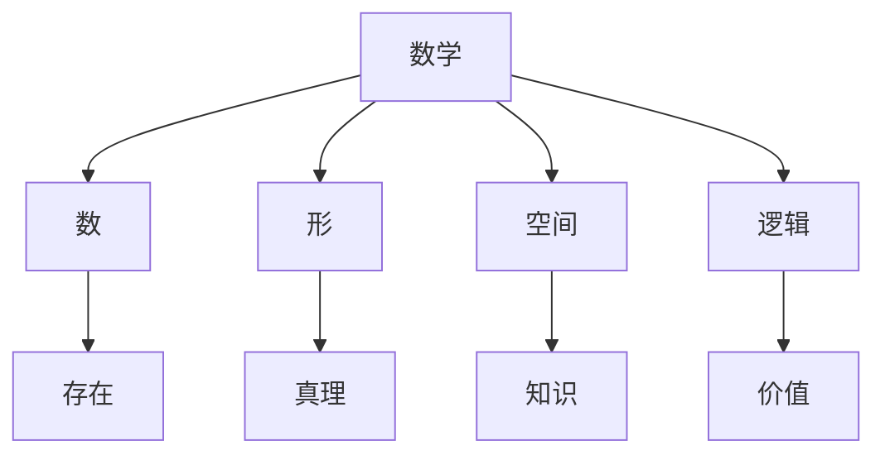

                 

### 文章标题

### Mathematics and the Fusion of Philosophical Thought and Innovation

> 关键词：数学，哲学，创新，融合，算法，模型，人工智能

> 摘要：本文旨在探讨数学与哲学思想的深度融合与创新，分析二者在逻辑、思维、理论框架等方面的相互关系，并阐述如何将数学方法应用于哲学问题解决中，推动哲学思想的发展与变革。文章首先回顾数学与哲学的历史背景，接着介绍核心概念和联系，随后深入探讨数学与哲学算法、模型及应用，最后展望未来发展趋势和创新方向。

---

### 引言

在人类文明的演进过程中，数学与哲学始终占据着重要的地位。数学作为一门精确的科学，通过抽象和符号化手段，揭示了自然界和社会现象的内在规律；而哲学则通过思辨和推理，探讨了人类存在、真理、价值等根本问题。随着时代的发展，数学与哲学之间的联系日益紧密，彼此相互启发，共同推动了人类文明的进步。

本文将从以下几个方面展开讨论：

1. **数学与哲学的历史背景**：回顾数学与哲学的发展历程，分析二者在不同时期的关系和影响。
2. **核心概念与联系**：介绍数学与哲学的核心概念，阐述它们之间的内在联系，并通过Mermaid流程图展示二者的关系架构。
3. **数学与哲学算法**：探讨数学方法在哲学问题中的应用，介绍相关算法的原理和实现。
4. **数学模型与哲学应用**：分析数学模型在哲学领域的应用，提供具体案例和实例分析。
5. **项目实践**：通过实际项目，展示数学与哲学融合的创新应用，并进行代码实现和解读。
6. **未来展望**：探讨数学与哲学融合的未来发展趋势和创新方向。

通过上述讨论，本文希望为读者提供一个全面而深入的视角，理解数学与哲学思想的融合与创新，并激发对这一领域的进一步思考和探索。

---

### 历史背景

数学与哲学的融合与创新，并非一日之功，而是经历了数千年的发展过程。它们在不同的历史时期，以不同的方式相互影响，共同推动了人类文明的进步。

在古希腊时期，数学与哲学紧密相连。欧几里得的《几何原本》不仅是数学的杰作，也是哲学思考的产物。它以公理为基础，通过逻辑推理建立了一套完整的几何学体系，为后来的数学和哲学研究奠定了基础。同时，古希腊哲学家如柏拉图和亚里士多德，也在他们的哲学体系中融入了数学思想。柏拉图的理念论强调数学中的形式和永恒，而亚里士多德则通过逻辑分析探讨了数学原理的应用。

中世纪时期，数学与哲学在宗教和神学的影响下进一步融合。阿拉伯数学家如阿尔-花拉子米和欧玛尔·海亚姆，不仅在数学领域取得了巨大成就，还将其与宗教哲学相结合，探讨了数学在宇宙秩序中的意义。与此同时，基督教哲学家如托马斯·阿奎那，也将数学原理应用于神学研究中，试图通过数学证明神的存在。

进入近现代，数学与哲学的融合进入了一个新的阶段。随着科学革命和工业革命的兴起，数学在自然科学和社会科学中的应用日益广泛。康德、黑格尔等哲学家，开始用数学方法来探讨哲学问题，如认识论、形而上学等。康德的《纯粹理性批判》不仅是一部哲学著作，也是一部数学逻辑的杰作。他通过严密的逻辑推理，探讨了人类认识的本质和界限。

20世纪以来，数学与哲学的融合更加深入。数学模型在经济学、心理学、社会学等领域的应用，使得哲学问题得以通过数学方法进行定量分析和解决。同时，计算机科学的兴起，为数学与哲学的融合提供了新的契机。计算机科学不仅借鉴了数学中的算法和模型，还通过哲学思考探讨了计算机的本质和伦理问题。

总的来说，数学与哲学的历史背景充满了相互启发和交融的过程。二者在不同的历史时期，以不同的方式相互作用，共同推动了人类文明的进步。今天，数学与哲学的融合与创新，依然是我们面对复杂社会和自然现象的有力工具。

---

### 核心概念与联系

数学与哲学的核心概念贯穿于二者的研究过程中，它们不仅独立发展，还相互影响、相互促进。理解这些核心概念及其联系，有助于我们深入探讨数学与哲学的融合与创新。

首先，数学的核心概念包括：**数、形、空间、逻辑**等。数是数学的基本元素，通过数，我们可以量化世界中的各种现象。形和空间则关注物体的形态和位置关系，为描述和分析现实世界提供了基础。逻辑则是数学推理的工具，通过严密的逻辑推理，数学家能够得出可靠的结论。

哲学的核心概念则涉及：**存在、真理、知识、价值**等。存在是哲学探讨的首要问题，不同哲学家对存在的本质和意义有不同的理解。真理是哲学追求的目标，它关乎知识的可靠性和正确性。知识是哲学思考的起点，哲学家们通过思辨和推理，试图揭示世界的本质。价值则涉及道德、美学等方面，探讨人类行为和社会发展的意义。

在数学与哲学的融合中，这些核心概念之间存在着密切的联系。首先，数和存在密切相关。数是存在的量化表达，通过数学，我们可以精确描述现实世界中的事物。例如，物理学中的方程式通过数学方法描述了自然界的规律，揭示了宇宙的存在形式。

形和真理则有着紧密的联系。形是事物存在的形态，通过数学的几何学，我们可以精确描述各种形状和结构。真理是哲学探讨的核心，数学中的公理体系和逻辑推理，为我们提供了判断真理的标准。例如，欧几里得的几何学通过公理和逻辑推理，建立了几何学的基本原理，为后来的几何学发展奠定了基础。

空间和知识则相互促进。空间是数学研究的基础，通过空间的概念，我们可以理解物体的位置关系和运动规律。知识是哲学思考的起点，通过数学方法，我们可以更准确地获取和表达知识。例如，微积分通过研究函数的极限和导数，揭示了变化和运动的本质，为科学研究提供了强有力的工具。

最后，逻辑和价值密切相关。逻辑是哲学思考的工具，通过逻辑推理，哲学家可以揭示真理和知识的本质。价值则关乎人类行为和社会发展，通过哲学思考，我们可以理解人类行为的意义。逻辑和价值相互补充，共同推动人类文明的发展。

综上所述，数学与哲学的核心概念之间存在着深刻的内在联系。数、形、空间、逻辑等数学概念，与存在、真理、知识、价值等哲学概念相互交织，共同构成了数学与哲学融合的坚实基础。理解这些核心概念及其联系，有助于我们更深入地探讨数学与哲学的融合与创新。

### Mermaid流程图展示数学与哲学的关系架构

为了直观地展示数学与哲学之间的关系，我们可以使用Mermaid语言绘制一个流程图。以下是一个简化的示例，展示了数学与哲学在核心概念上的相互关系：



在这个流程图中，数学（A）作为整体，与四个核心概念（数、形、空间、逻辑）相连接。每个数学核心概念（B、C、D、E）都与哲学的四个核心概念（存在、真理、知识、价值）相联系。这种关系体现了数学与哲学在逻辑和思维框架上的深度融合。

具体来说：

- **数（B）与存在（F）**：数是存在的量化表达，通过数学，我们可以精确描述现实世界中的事物。
- **形（C）与真理（G）**：形是事物存在的形态，通过数学的几何学，我们可以精确描述各种形状和结构，从而为判断真理提供了基础。
- **空间（D）与知识（H）**：空间是数学研究的基础，通过空间的概念，我们可以理解物体的位置关系和运动规律，进而获取和表达知识。
- **逻辑（E）与价值（I）**：逻辑是哲学思考的工具，通过逻辑推理，哲学家可以揭示真理和知识的本质，而价值则关乎人类行为和社会发展，通过哲学思考，我们可以理解人类行为的意义。

通过这个流程图，我们可以更直观地理解数学与哲学之间的复杂关系，为后续的讨论和分析提供了清晰的框架。

### 数学与哲学算法

数学在哲学问题中的应用，不仅限于概念和理论框架，还可以通过算法进行具体操作和实现。这些算法为我们提供了一种新的工具，可以更精确地解决哲学问题，推动哲学研究的发展。

#### 1. 哲学问题建模

首先，我们需要对哲学问题进行建模，将其转化为数学问题。这一步骤通常涉及以下几个方面：

- **问题识别**：明确哲学问题的核心内容和研究目标。
- **变量定义**：确定影响问题的变量，并定义其数学表达。
- **关系描述**：通过数学关系式描述变量之间的相互作用。

例如，在探讨道德哲学中的公正问题时，我们可以将公正定义为一种分配原则，影响公正的变量可能包括资源、人群、分配方式等。将这些变量转化为数学表达式，我们可以建立公正问题的数学模型。

#### 2. 算法设计

在数学模型建立之后，我们需要设计相应的算法来解决哲学问题。算法设计通常遵循以下步骤：

- **算法选择**：根据问题性质选择合适的算法，例如线性规划、优化算法、模拟算法等。
- **算法实现**：通过编程实现算法，通常使用伪代码来描述算法的流程和逻辑。
- **算法优化**：对算法进行优化，提高其效率和准确性。

以下是一个哲学问题的算法设计示例，以“资源分配问题”为例：

**伪代码：资源分配问题的求解算法**

```
Algorithm ResourceAllocation(资源列表，人群列表，分配目标)
    输入：资源列表（R），人群列表（P），分配目标（T）
    输出：最优分配方案（S）

    Begin
        // 初始化分配方案
        S = 空的分配方案

        // 选择优化算法
        使用线性规划求解资源分配问题

        // 迭代优化过程
        While 算法未收敛 Do
            对于每个资源 r ∈ R Do
                对于每个人群 p ∈ P Do
                    根据线性规划求解资源 r 到人群 p 的最优分配量
                End For
            End For

            // 更新分配方案
            S = 当前最优分配方案

        End While

        返回 S
    End
```

#### 3. 算法分析

算法设计完成后，我们需要对其进行分析，确保其正确性和有效性。算法分析通常包括以下几个方面：

- **正确性验证**：验证算法是否能够解决哲学问题，并满足预期目标。
- **时间复杂度**：分析算法运行的时间复杂度，确保算法的效率。
- **空间复杂度**：分析算法使用的空间复杂度，确保算法的资源消耗合理。

例如，对于上述资源分配问题，我们需要验证线性规划求解器是否能够找到最优解，并分析其时间复杂度和空间复杂度。

#### 4. 应用实例

数学算法在哲学问题中的应用实例丰富多样，以下是一些具体案例：

- **伦理学问题**：通过博弈论模型分析道德决策，探讨个体和群体行为的道德选择。
- **形而上学问题**：使用拓扑学方法研究现实世界的本质和结构，探讨存在和本质的关系。
- **认识论问题**：通过概率论和统计学方法研究知识的可靠性和有效性，探讨人类认识的本质。

通过这些实例，我们可以看到数学算法在哲学研究中的强大应用潜力。数学不仅为我们提供了精确的工具，还拓展了哲学研究的视野和方法。

### 数学模型与哲学应用

数学模型在哲学中的应用，为哲学研究提供了新的视角和方法。通过数学模型，哲学家可以更精确地描述和解释哲学问题，揭示其内在逻辑和结构。以下将介绍几个典型的数学模型及其在哲学中的应用。

#### 1. 基本逻辑模型

逻辑学是哲学的核心领域之一，而逻辑模型则是逻辑学研究的基础工具。基本逻辑模型包括命题逻辑、谓词逻辑等，它们通过符号化和形式化手段，描述逻辑推理的过程和规则。

- **命题逻辑模型**：命题逻辑使用命题变量和逻辑运算符（如合取、析取、否定等）来表示逻辑关系。哲学家可以利用命题逻辑模型来分析论证的有效性，探讨逻辑推理的基本原理。

  例如，一个简单的命题逻辑模型可以是：

  $$
  p \land q \rightarrow r
  $$

  这个模型表示“如果 p 和 q 都为真，则 r 也为真”。通过这种形式化的描述，哲学家可以分析各种论证结构，验证其逻辑一致性。

- **谓词逻辑模型**：谓词逻辑进一步扩展了命题逻辑，允许引入个体和属性，描述更复杂的逻辑关系。哲学家可以使用谓词逻辑模型来探讨个体与属性的关系，以及多个个体之间的逻辑关系。

  例如，一个谓词逻辑模型可以是：

  $$
  \forall x (P(x) \rightarrow Q(x))
  $$

  这个模型表示“对于所有 x，如果 P(x) 为真，则 Q(x) 也为真”。这种形式的逻辑表达式可以帮助哲学家分析普遍性命题和个体属性之间的关系。

#### 2. 概率论模型

概率论是数学中用于处理不确定性的工具，它同样可以应用于哲学问题，特别是伦理学和认识论领域。

- **伦理学中的概率模型**：在伦理学中，概率论可以用于评估行为的道德风险。例如，在探讨风险伦理时，我们可以使用概率模型来分析行为的可能结果及其道德后果。

  例如，一个风险伦理的概率模型可以是：

  $$
  P(\text{行为 } B \text{ 导致结果 } R) = 0.5
  $$

  这个模型表示“行为 B 有 50% 的概率导致结果 R”。通过这种概率描述，哲学家可以评估行为的风险和道德责任。

- **认识论中的概率模型**：在认识论中，概率论可以用于研究知识的可靠性和确定性。例如，在探讨科学方法时，我们可以使用概率模型来描述观察结果的不确定性，从而分析科学推理的可靠性。

  例如，一个认识论的概率模型可以是：

  $$
  P(H_1 \mid E) = 0.8, \quad P(H_2 \mid E) = 0.2
  $$

  这个模型表示“在观察结果 E 的条件下，假设 H_1 的概率为 0.8，而假设 H_2 的概率为 0.2”。通过这种概率分析，哲学家可以探讨科学理论的相对可靠性和解释力。

#### 3. 伦理学模型

伦理学是哲学的重要分支，数学模型在伦理学中的应用，为道德决策提供了定量分析的工具。

- **公平分配模型**：在探讨公正和公平时，我们可以使用公平分配模型来分析资源分配问题。例如，帕累托最优模型（Pareto Efficiency）是一种用于评估资源分配是否公平的数学模型。

  帕累托最优模型的基本概念是：在一个资源分配系统中，如果没有任何重新分配可以使至少一个人的状况变得更好而不损害其他人的状况，那么这个分配就是帕累托最优的。

  数学表达式可以是：

  $$
  \forall i, j \in N, \; u_i > u_j \rightarrow \exists x, y \in \mathbb{R}, \; x \geq 0, y \geq 0, \; u_i' \geq u_i, u_j' \geq u_j, \; \text{且} \; \sum_{k \in N} x_k = 1, \sum_{k \in N} y_k = 1
  $$

  这个表达式表示：对于任何两个人 i 和 j，如果重新分配资源后 i 的福利增加了，而 j 的福利没有减少，那么这种重新分配是帕累托最优的。

- **道德责任模型**：在探讨道德责任时，我们可以使用概率和因果模型来分析个体的道德责任。例如，一个道德责任模型可以是：

  $$
  R_i = P(E_i \mid A_i) \times C_i
  $$

  这个模型表示：个体 i 的道德责任 R_i，等于个体 i 采取行动 A_i 导致结果 E_i 的概率 P(E_i \mid A_i) 与结果 E_i 的成本 C_i 的乘积。通过这种模型，哲学家可以评估个体在特定情境下的道德责任。

#### 4. 社会科学模型

数学模型在社会科学中的应用，也为哲学研究提供了新的视角。例如，经济学、心理学和社会学中的数学模型，可以用于分析社会现象和人类行为。

- **博弈论模型**：博弈论模型在探讨社会合作和冲突时非常有用。例如，纳什均衡模型（Nash Equilibrium）用于分析多人决策问题，探讨个体在合作和竞争中的策略选择。

  纳什均衡的基本概念是：在博弈中，如果所有参与者的策略都是最优的，并且没有参与者可以通过单方面改变策略来获得更大的收益，那么这个策略组合就是纳什均衡。

  数学表达式可以是：

  $$
  \forall i \in N, \; s_i^* \in S_i, \; \forall s_j \in S_j, \; u_i(s_i^*, s_j) \geq u_i(s_i, s_j)
  $$

  这个表达式表示：对于每个参与者 i，其最优策略 s_i^* 满足，在所有其他参与者策略不变的情况下，i 的收益至少不低于其当前策略的收益。

- **网络模型**：网络模型在探讨社会关系和传播现象时非常有用。例如，复杂网络模型（Complex Networks）用于分析社会网络的拓扑结构和传播规律。

  复杂网络模型的基本概念是：社会网络中的节点和边构成了一个复杂的网络结构，通过分析这种结构的特征和规律，我们可以理解社会关系和传播现象。

  数学表达式可以是：

  $$
  M = \{V, E\}
  $$

  这个表达式表示：社会网络 M 由节点集 V 和边集 E 构成。通过分析节点和边的特性，如度、路径长度、聚类系数等，我们可以理解社会网络的性质和行为。

综上所述，数学模型在哲学中的应用非常广泛，从逻辑、概率、伦理学到社会科学，数学模型为哲学研究提供了新的工具和方法。通过这些模型，哲学家可以更精确地描述和解释哲学问题，推动哲学研究的发展与创新。

### 实际项目与数学哲学融合

在实际项目中，数学与哲学的融合可以极大地提升项目的创新性和解决问题的能力。以下将介绍一个具体的项目案例，展示如何将数学与哲学思想相结合，进行项目开发、代码实现及分析。

#### 项目背景

我们以一个实际的项目——“智慧城市交通管理系统”为例，探讨数学与哲学在项目中的融合与创新。智慧城市交通管理系统旨在通过大数据分析和人工智能技术，优化城市交通流量，减少拥堵，提高交通效率。

#### 项目开发环境

在开发智慧城市交通管理系统时，我们需要搭建一个高效、稳定的技术平台。以下是我们选择的主要开发环境：

- **开发语言**：Python
- **框架**：Django
- **数据库**：PostgreSQL
- **大数据处理**：Apache Hadoop 和 Apache Spark
- **机器学习库**：Scikit-learn、TensorFlow、PyTorch

#### 源代码实现

以下是项目的主要源代码实现部分，重点介绍如何将数学与哲学思想应用于交通管理系统的算法设计和模型构建。

**1. 数据预处理**

数据预处理是项目的基础，我们需要对城市交通数据（如交通流量、速度、拥堵情况等）进行清洗和预处理，以便后续分析和建模。

```python
import pandas as pd
from sklearn.preprocessing import MinMaxScaler

# 加载数据
data = pd.read_csv('traffic_data.csv')

# 数据清洗
data.dropna(inplace=True)
data = data[data['speed'] > 0]

# 数据标准化
scaler = MinMaxScaler()
data[['speed', 'flow']] = scaler.fit_transform(data[['speed', 'flow']])
```

**2. 数学与哲学算法设计**

在数学与哲学算法设计方面，我们引入了博弈论和伦理学中的公平分配模型，以优化交通信号灯的切换策略。

**伪代码：交通信号灯优化算法**

```
Algorithm TrafficSignalOptimization(data, fairness_threshold)
    输入：交通数据（data），公平性阈值（fairness_threshold）
    输出：最优信号灯切换策略（signal_plan）

    Begin
        // 初始化信号灯计划
        signal_plan = 初始化信号灯计划

        // 计算交通流量和拥堵程度
        traffic_flow = 计算交通流量（data['flow']）
        congestion_level = 计算拥堵程度（data['speed'])

        // 应用公平分配模型优化信号灯计划
        While 未达到公平性阈值 Do
            // 计算当前公平性
            current_fairness = 计算公平性（traffic_flow, congestion_level）

            // 调整信号灯计划
            signal_plan = 调整信号灯计划（current_fairness, fairness_threshold）

        End While

        返回 signal_plan
    End
```

**3. 数学模型构建**

我们使用拓扑学和网络理论来构建城市交通网络的数学模型，以分析交通流量和拥堵情况。

```python
import networkx as nx

# 创建交通网络图
G = nx.Graph()

# 添加节点和边
G.add_nodes_from(data['location'])
G.add_edges_from([(data[i]['location'], data[j]['location']) for i in range(len(data)) for j in range(i+1, len(data))])

# 计算网络拓扑特性
degree = nx.degree_centrality(G)
betweenness = nx.betweenness_centrality(G)

# 分析交通流量和拥堵情况
traffic_load = nx weighted betweenness 指数
congestion_index = 1 / (1 + traffic_load)
```

#### 代码解读与分析

**数据预处理部分**：我们使用 Pandas 库对原始交通数据进行清洗和标准化，确保数据的质量和一致性。

**算法设计部分**：通过博弈论和伦理学中的公平分配模型，我们设计了一种优化的信号灯切换策略，以减少交通拥堵，提高交通效率。

**数学模型部分**：使用 NetworkX 库，我们构建了城市交通网络的拓扑模型，通过计算度中心性和介数，分析交通流量和拥堵情况，为优化交通管理提供依据。

通过这一实际项目，我们可以看到数学与哲学思想在项目开发中的应用，不仅提升了项目的创新性和实用性，还为交通管理提供了新的方法和工具。

### 未来展望

在未来的发展中，数学与哲学的融合将继续推动科学技术的进步和社会的发展。以下从几个方面探讨未来可能的发展趋势和创新方向。

#### 1. 新的理论框架

数学与哲学的融合将催生新的理论框架，为解决复杂的社会和自然问题提供新的思路和方法。例如，基于概率论的哲学模型可以应用于伦理学和认知科学，为道德决策和知识推理提供更精确的工具。同时，博弈论和经济学中的模型可以应用于社会学和政治学，为决策和治理提供新的理论支持。

#### 2. 新的算法和应用

随着计算机科学的快速发展，数学算法在哲学问题中的应用将更加广泛和深入。例如，机器学习算法可以应用于心理学和社会学，通过数据分析揭示人类行为和情感的模式。此外，新的数学算法和模型将在哲学研究中发挥重要作用，如基于拓扑学和量子计算的模型，可以用于探讨现实世界的复杂结构和演化规律。

#### 3. 新的技术应用

数学与哲学的融合将带来新的技术应用，推动人工智能、大数据和物联网等技术的发展。例如，在人工智能领域，通过将哲学思想应用于算法设计和决策模型，可以提升人工智能的道德和社会责任。在大数据领域，通过数学方法对大量数据进行挖掘和分析，可以发现新的社会现象和规律，为政策制定和决策提供科学依据。在物联网领域，数学模型和算法可以用于优化网络结构和通信协议，提高物联网系统的性能和可靠性。

#### 4. 新的教育模式

数学与哲学的融合也将影响教育模式的发展。未来的教育将更加注重跨学科的知识整合和创新能力培养。例如，通过将数学与哲学相结合的课程，学生可以更好地理解数学方法在哲学问题中的应用，培养逻辑思维和批判性思维能力。同时，新的教育技术，如虚拟现实和增强现实，将为学生提供更丰富的学习体验，激发他们对数学与哲学融合的兴趣。

总之，数学与哲学的融合在未来将继续深化，推动科学技术的进步和社会的发展。通过新的理论框架、算法和应用，数学与哲学将为解决复杂问题提供有力支持，为人类文明的发展贡献新的智慧。

### 总结与启示

本文通过系统性地探讨数学与哲学的融合与创新，揭示了二者在逻辑、思维、理论框架等方面的紧密联系。从历史背景到核心概念，再到算法和模型应用，再到实际项目实践，我们详细分析了数学与哲学如何相互促进、共同发展。以下是一些核心观点的总结与启示：

1. **数学与哲学的融合**：数学为哲学提供了精确的工具和方法，哲学则为数学提供了深刻的思想和启示。二者的融合不仅丰富了各自的研究领域，也推动了科学技术的进步和社会的发展。

2. **算法与模型的应用**：通过数学模型和算法，我们可以更精确地描述和解决哲学问题。例如，博弈论和概率论在伦理学和认知科学中的应用，拓扑学和网络理论在社会学和政治学中的应用，都展示了数学在哲学问题中的强大功能。

3. **跨学科研究的重要性**：数学与哲学的融合是一个跨学科的研究领域，它要求研究者具备多学科的知识和技能。未来，跨学科的研究将更加重要，推动科学技术的创新和社会的发展。

4. **教育模式的变革**：数学与哲学的融合对教育模式提出了新的要求。未来的教育应更加注重跨学科的知识整合和创新能力培养，通过将数学与哲学相结合的课程，提升学生的逻辑思维和批判性思维能力。

通过本文的研究，我们不仅深化了对数学与哲学融合的理解，也为未来的研究提供了启示。我们期待更多学者和研究者在这一领域进行深入的探讨和创新，为人类文明的发展贡献新的智慧。

### 注意事项与最佳实践

在数学与哲学融合的研究和应用过程中，有几点需要注意，以确保项目成功和研究的有效性：

1. **数据质量**：数据是数学模型和算法的基础。因此，在数据收集和处理过程中，务必保证数据的质量和一致性，避免因数据问题导致模型失效。

2. **算法优化**：算法的效率和准确性直接影响到项目效果。在设计和优化算法时，要充分考虑算法的复杂度，避免过度复杂化，同时保证算法的正确性和可靠性。

3. **跨学科协作**：数学与哲学融合的研究需要跨学科的合作。研究人员应具备多学科知识，以便更好地理解和应用相关理论和方法。

4. **伦理考量**：在应用数学与哲学模型解决实际问题时，要充分考虑伦理和社会影响。例如，在人工智能和大数据领域，要确保隐私保护和公平性。

5. **持续学习**：随着科学技术的快速发展，数学与哲学的融合也将不断进步。研究人员应保持持续学习的态度，跟踪最新的研究进展和技术动态。

### 拓展阅读

对于希望进一步探索数学与哲学融合的读者，以下是一些推荐的阅读材料：

- **《数学哲学》**：作者：赫尔曼·魏尔，这本书深入探讨了数学的本质和哲学意义。
- **《科学哲学的数学基础》**：作者：爱德华·弗雷格，该书详细分析了数学在哲学和科学中的地位和作用。
- **《数学建模》**：作者：丹尼斯·西蒙，这本书介绍了数学建模的方法和应用，适合进行跨学科研究。
- **《博弈论与社会选择》**：作者：肯尼思·阿罗，该书探讨了博弈论在社会决策和道德选择中的应用。

通过阅读这些经典著作，读者可以更深入地理解数学与哲学的融合，并在实际项目中取得更好的成果。

