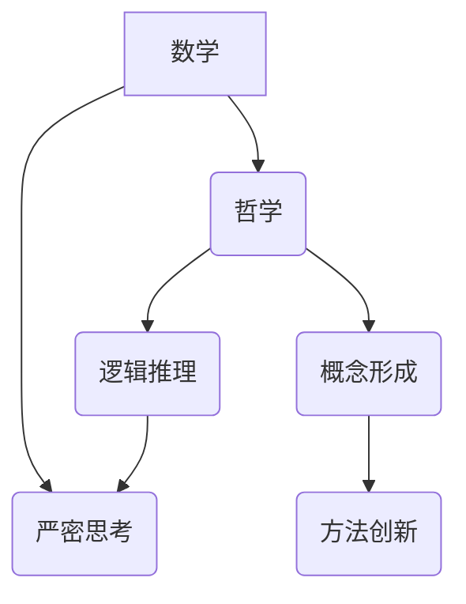
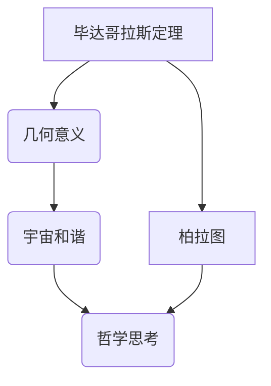
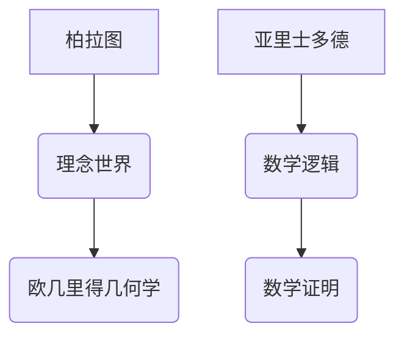
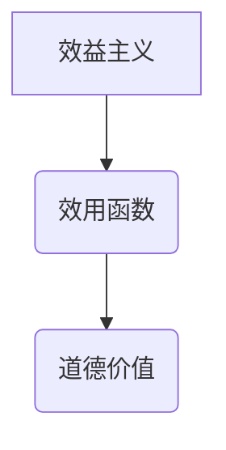
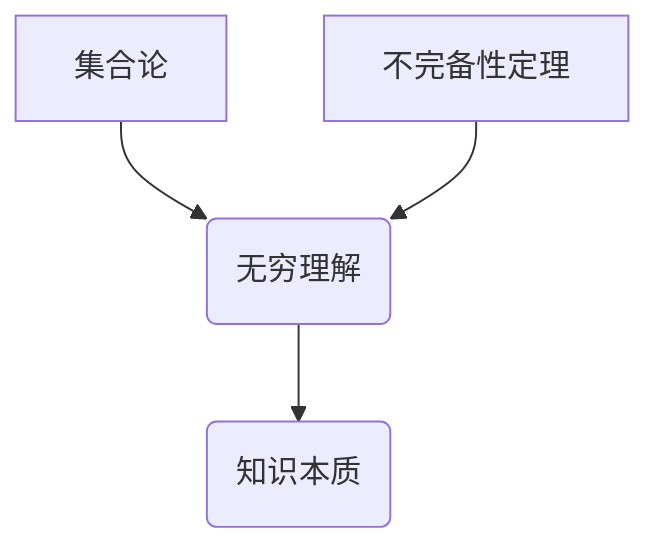
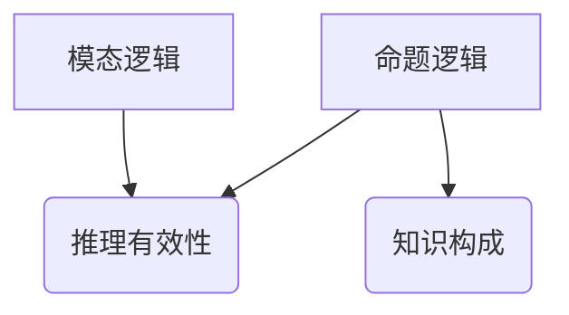
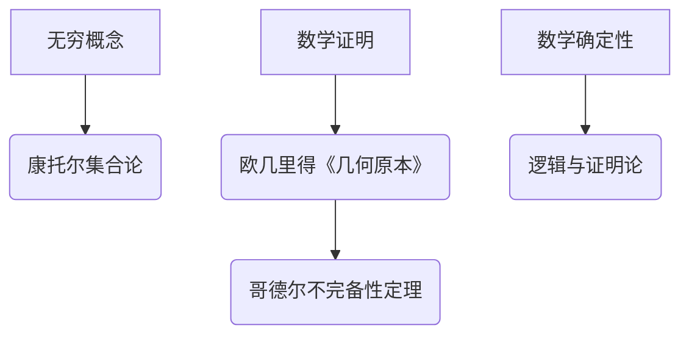
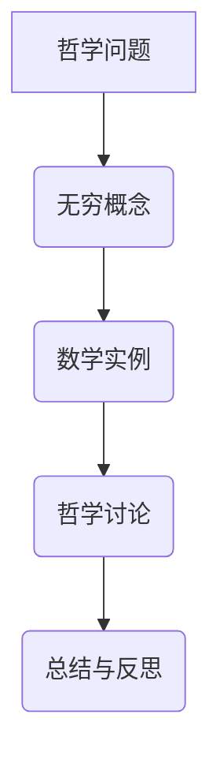

                 

### 1.1 数学与哲学的关系历史概述

数学与哲学自古以来便有着紧密的联系。早在古希腊时期，数学和哲学就已经交融在一起。毕达哥拉斯是这一时期最具代表性的思想家之一，他提出了“万物皆数”的哲学观点，将数学原理视为宇宙的本质。毕达哥拉斯学派的研究范围不仅涉及数学，还包括音乐、天文学等自然科学，他们试图通过数学来解释宇宙的和谐。

### 1.1.1 数学在哲学思辨中的作用

数学在哲学思辨中扮演了不可或缺的角色。它不仅提供了逻辑和推理的工具，使得哲学思考更加严密和精确，还在一定程度上影响了哲学的基本观念。例如，康托尔的集合论改变了我们对“无穷”的理解，而哥德尔的不完备性定理则对逻辑哲学产生了深远的影响。

#### 1.1.1.1 逻辑推理与哲学论证

逻辑推理是哲学思辨的重要工具。通过数学的逻辑结构，哲学家可以更加严密地构建论证。例如，亚里士多德的《工具论》中，就详细探讨了逻辑学的基本原理，这些原理后来被广泛应用于数学证明中。数学的逻辑结构使得哲学论证更加严谨，有助于发现论点中的逻辑漏洞。

#### 1.1.1.2 数学模型与哲学思考

数学模型在哲学思考中也起到了重要作用。例如，在伦理学中，可以通过数学模型来分析道德决策的后果；在认识论中，数学逻辑可以帮助我们理解知识的构成和推理过程。数学模型为哲学思考提供了具体的工具和框架，使得抽象的哲学问题得以量化和分析。

### 1.1.2 哲学对数学概念的影响

哲学不仅影响了数学的发展，还影响了数学概念的形成。例如，笛卡尔的坐标几何法改变了我们对空间和距离的认识，而莱布尼茨的微积分法则则推动了数学分析的发展。哲学思考促使数学家重新审视基本概念，从而推动数学的进步。

#### 1.1.2.1 笛卡尔的坐标几何法

笛卡尔的坐标几何法将数学与几何结合起来，建立了坐标系，使得几何问题可以用代数方法解决。这种方法不仅丰富了数学的内容，也改变了我们对空间和距离的认识。

#### 1.1.2.2 莱布尼茨的微积分法则

莱布尼茨的微积分法则将连续与离散相结合，提供了分析复杂现象的工具。他的方法使得数学分析成为可能，从而推动了自然科学的发展。

### 1.1.3 数学与哲学思辨的关系图示

以下是一个Mermaid流程图，展示了数学与哲学思辨之间的关系：



在这个流程图中，数学和哲学相互影响，共同推动了人类文明的进步。

### 1.1.4 历史上的数学哲学争论

历史上，数学哲学引发了许多深刻的争论。例如，关于无穷的概念，哲学家和数学家提出了不同的观点。康托尔的集合论提出了无穷集合的概念，但这一观点遭到了一些哲学家的质疑。这种争论推动了数学和哲学的不断发展，使得我们对这些概念的理解更加深入。

总之，数学与哲学的关系历史悠久，两者相互影响，共同推动了人类文明的进步。在接下来的章节中，我们将进一步探讨数学与哲学的交叉融合，分析其在各个领域中的应用。

## 2.1 数学核心概念解析

### 2.1.1 数的概念与哲学思考

数是数学中最基本的概念之一，它不仅具有数学上的意义，也引发了哲学上的思考。哲学家和数学家对数的本质、起源和意义进行了深入的探讨。

#### 2.1.1.1 数的本质

数的本质是一个长期争论的话题。一些哲学家认为，数是一种抽象的概念，是人类意识的产物，而非客观存在的实体。例如，柏拉图认为，数是理念世界的组成部分，是永恒不变的。而另一些哲学家则认为，数是客观存在的，可以与物质世界对应。例如，亚里士多德认为，数是物质世界的本质属性，是与物质不可分割的。

#### 2.1.1.2 数的起源

关于数的起源，哲学家和数学家也有不同的观点。一些哲学家认为，数是通过对物质世界的计数而产生的。例如，毕达哥拉斯认为，数是通过对自然现象的观察和计数得到的。而另一些哲学家则认为，数是先于物质世界的，是宇宙的本质。例如，柏拉图认为，数是理念世界的组成部分，是先于物质世界的。

#### 2.1.1.3 数的意义

数在哲学上有重要的意义。首先，数是哲学思考的工具，可以帮助我们理解世界的本质和规律。例如，康托尔的集合论通过研究无穷集合，改变了我们对“无穷”的理解。其次，数在伦理学、认识论等领域也有广泛的应用。例如，效益主义通过数学模型来衡量行为的结果，而逻辑学中的命题逻辑可以帮助我们理解推理的有效性。

### 2.1.2 几何与形而上学

几何是数学的一个重要分支，它不仅涉及空间和形状，也与哲学有着密切的联系。形而上学是哲学的一个分支，探讨存在的本质和基础。几何与形而上学的交叉融合，为哲学思考提供了新的视角。

#### 2.1.2.1 几何的基本概念

几何的基本概念包括点、线、面、体等。这些概念不仅具有数学上的意义，也引发了哲学上的思考。例如，点在哲学上可以被视为无限小的实体，而线则可以被视为无限延伸的实体。这些概念帮助我们理解空间和形状的本质。

#### 2.1.2.2 几何与形而上学的联系

几何与形而上学的联系在于，几何提供了研究形而上学问题的方法。例如，通过研究几何形状，哲学家可以探讨存在的本质和基础。例如，柏拉图的“理念世界”可以被视为一种几何结构，而亚里士多德则通过研究几何形状来探讨存在的本质。

#### 2.1.2.3 几何与形而上学的区别

尽管几何与形而上学有联系，但它们在研究对象和目的上有所不同。几何主要研究空间和形状的性质，而形而上学则探讨存在的本质和基础。几何关注的是具体的事实，而形而上学则试图回答更为抽象和普遍的问题。

### 2.1.3 数学逻辑与哲学论证

数学逻辑是数学中的一个重要分支，它研究逻辑结构和推理规则。数学逻辑不仅应用于数学证明，也对哲学论证产生了重要影响。

#### 2.1.3.1 数学逻辑的基本概念

数学逻辑的基本概念包括命题、逻辑运算、推理规则等。这些概念为哲学论证提供了工具。例如，命题逻辑可以帮助我们理解推理的有效性，而模态逻辑可以帮助我们分析可能性与现实性。

#### 2.1.3.2 数学逻辑在哲学中的应用

数学逻辑在哲学中有着广泛的应用。例如，在认识论中，数学逻辑可以帮助我们理解知识的构成和推理过程。在伦理学中，数学逻辑可以帮助我们分析道德决策的后果。在逻辑哲学中，数学逻辑可以帮助我们探讨推理的有效性。

### 2.1.4 数学模型的哲学意义

数学模型是数学的一个重要应用，它将现实问题抽象为数学问题，从而提供了一种解决问题的方法。数学模型不仅在科学和技术领域有重要应用，也在哲学思考中具有重要意义。

#### 2.1.4.1 数学模型的基本概念

数学模型是将现实问题转化为数学问题的一种方法。它包括建立数学模型、求解数学模型和验证数学模型等步骤。数学模型不仅需要数学工具，还需要对现实问题的深刻理解。

#### 2.1.4.2 数学模型在哲学思考中的应用

数学模型在哲学思考中具有重要意义。例如，在伦理学中，可以通过数学模型来分析道德决策的后果。在认识论中，可以通过数学模型来探讨知识的构成和推理过程。在逻辑哲学中，可以通过数学模型来分析推理的有效性。

### 2.1.5 伪代码展示：数学模型的构建

以下是一个简单的伪代码示例，展示了如何构建一个数学模型：

```pseudo
// 定义变量
let x = 0
let y = 0

// 建立数学模型
function model(x, y):
    // 求解模型
    z = x * y

    // 返回结果
    return z

// 应用模型
let result = model(x, y)
```

在这个示例中，我们定义了一个简单的数学模型，用于求解两个变量的乘积。这个模型可以通过调整变量和公式来适应不同的现实问题。

通过以上对数学核心概念的解析，我们可以看到，数学不仅是科学的一部分，也是哲学思考的工具。数学的抽象和逻辑结构，为我们提供了理解世界和解决复杂问题的方法。在接下来的章节中，我们将继续探讨数学与哲学的交叉融合，分析其在各个领域中的应用。

### 2.2 哲学基础理论探讨

哲学基础理论是探讨存在、知识、价值和理性的根源与性质的学科。在哲学与数学的交叉领域，哲学基础理论为我们提供了一种深入理解数学概念和原理的方法。以下将重点探讨几个关键哲学基础理论及其与数学的关系。

#### 2.2.1 哲学基本概念与数学的关系

哲学基本概念包括存在、知识、真理、价值和理性等，这些概念在数学中有着重要的体现和应用。

1. **存在**

   哲学中的存在概念涉及到实体和属性的问题。在数学中，存在概念体现在对数的定义和集合的构建上。例如，自然数的存在是数学运算的基础，而集合论中的存在性则帮助我们理解无穷集合和抽象概念。

2. **知识**

   哲学中的知识概念探讨的是我们如何认识世界。数学知识依赖于逻辑推理和证明，这些逻辑工具是知识论的核心。数学中的定理和证明过程正是对知识的一种严谨表达。

3. **真理**

   哲学中的真理概念涉及对事实的正确陈述。在数学中，真理体现在定理和公理的成立。数学真理是经过严格证明的，它确保了数学理论的准确性和一致性。

4. **价值**

   哲学中的价值概念探讨的是事物的重要性。在数学中，价值体现在对理论的应用和解决实际问题的能力。例如，微积分在物理和工程中的应用，体现了其价值。

5. **理性**

   哲学中的理性概念指的是通过推理和逻辑来理解和解决问题。数学作为一门科学，依赖于理性思维，其理论体系的构建和验证都离不开理性的力量。

#### 2.2.2 形而上学与数学建模

形而上学探讨存在的本质和基础，与数学建模有着密切的关系。

1. **数学本体论**

   数学本体论研究数学对象和概念的本质。例如，集合论中的集合是什么，无穷集合的存在性问题等，都是数学本体论探讨的内容。形而上学的本体论方法帮助我们理解数学概念的深刻内涵。

2. **数学实在论**

   数学实在论探讨数学对象是否具有独立于我们思维的现实存在。数学家如莱布尼茨和柏拉图认为，数学对象具有客观存在性，它们存在于理念世界中。这种观点影响了数学建模的方式，使得数学模型更加接近现实。

3. **数学认识论**

   数学认识论探讨数学知识的来源和性质。形而上学的认识论方法帮助数学家理解数学知识是如何获得的，以及这种知识如何应用于实际问题。例如，皮亚诺公理系统如何帮助我们理解自然数的结构。

#### 2.2.3 伦理学与数学的应用

伦理学与数学的应用在道德决策和后果分析中有着重要作用。

1. **效益主义**

   效益主义通过数学模型来衡量行为的结果。例如，效用函数可以用来评估不同行为的道德价值。数学模型帮助伦理学家分析社会和经济政策的影响。

2. **康德的义务论**

   康德的义务论强调道德规则的普遍性和绝对性。数学逻辑可以帮助我们分析道德规则的有效性，例如，通过形式逻辑来证明道德规则的一致性。

#### 2.2.4 逻辑学在数学哲学中的应用

逻辑学是哲学的基础工具，它在数学哲学中的应用尤为重要。

1. **命题逻辑**

   命题逻辑用于分析数学命题的结构和推理过程。例如，通过命题逻辑，我们可以证明数学定理的有效性，分析推理过程中的逻辑错误。

2. **模态逻辑**

   模态逻辑用于分析可能性和必要性。在数学哲学中，模态逻辑可以帮助我们探讨无穷集合的存在性和数学证明的性质。

3. **证明论**

   证明论研究数学证明的性质和方法。证明论中的递归证明方法为数学哲学提供了新的视角，帮助我们理解证明的本质。

#### 2.2.5 数学公式阐述：逻辑推理示例

以下是一个简单的数学公式示例，用于阐述逻辑推理：

$$
\begin{aligned}
    P \wedge Q &\rightarrow R \\
    P &\rightarrow \neg Q \\
    \neg R &\rightarrow \neg P
\end{aligned}
$$

这个公式描述了一个逻辑推理过程。从前提$P \wedge Q \rightarrow R$和$P \rightarrow \neg Q$，我们可以通过逻辑推理得出结论$\neg R \rightarrow \neg P$。这个推理过程展示了逻辑学在数学哲学中的应用，帮助我们理解数学证明的逻辑结构。

### 总结

哲学基础理论为数学提供了一种深刻的思考框架，帮助我们理解数学概念的本质和应用。通过哲学的视角，我们可以更好地理解数学的抽象和逻辑结构，从而推动数学的发展。在接下来的章节中，我们将进一步探讨数学与哲学在各个领域的具体应用。

### 2.3 数学与哲学思辨的经典案例

在数学与哲学的交汇点，有许多著名的案例展示了两者如何相互启发并促进彼此的发展。以下将介绍几个经典的案例，分析数学在哲学思辨中的应用，以及哲学家对数学的贡献。

#### 2.3.1 希腊哲学中的数学观念

古希腊哲学中，数学观念占据了一个核心的地位。例如，毕达哥拉斯提出的“万物皆数”观念，深刻影响了后来的数学和哲学。毕达哥拉斯认为，宇宙的本质是数，所有物理现象都可以用数学关系来解释。这一观念不仅激发了数学的研究，也促使哲学家们思考宇宙的本质和秩序。

**毕达哥拉斯定理（Pythagorean Theorem）**

一个典型的数学与哲学结合的例子是毕达哥拉斯定理。该定理指出，直角三角形的两条直角边的平方和等于斜边的平方。这一数学事实不仅具有几何意义，也引发了哲学家们的哲学思考。例如，柏拉图将毕达哥拉斯定理视为宇宙和谐的一个象征，体现了数和比例在宇宙中的重要性。

**Mermaid流程图：毕达哥拉斯定理与哲学关系**



#### 2.3.2 哲学家对数学的贡献

哲学家不仅对数学概念进行了深刻的思考，还直接参与了数学的发展。其中，最著名的例子是柏拉图和亚里士多德。

**柏拉图与数学理念**

柏拉图是古希腊哲学家中最具数学倾向的一位。他在《理想国》中提出了“理念世界”的概念，认为数学对象存在于一个永恒不变的理念世界中。这一观念对后来的数学和哲学产生了深远的影响，尤其是对欧几里得几何学的发展起到了重要的推动作用。

**亚里士多德与数学逻辑**

亚里士多德在《形而上学》中探讨了数学的基本原理，强调了逻辑推理的重要性。他的《工具论》详细阐述了逻辑学的基本原则，为后来的数学证明提供了逻辑基础。亚里士多德的方法论对中世纪和近代数学的发展产生了重要影响。

**Mermaid流程图：哲学家与数学贡献**



#### 2.3.3 数学的哲学应用案例

数学在哲学中的应用不仅仅是解释宇宙的和谐，还涉及到伦理学、认识论和逻辑哲学等领域的探讨。

**伦理学与数学**

效益主义是一种伦理学理论，它使用数学模型来衡量行为的后果。例如，约翰·斯图尔特·密尔的《功利主义》中，通过效用函数来评估行为的道德价值。这一数学方法帮助伦理学家更精确地分析道德决策。

**Mermaid流程图：伦理学与数学应用**



**认识论与数学**

在认识论中，数学逻辑和证明论提供了理解知识的工具。例如，康托尔的集合论改变了我们对无穷的理解，而哥德尔的不完备性定理则揭示了逻辑系统中的基本限制。这些数学工具帮助我们更深刻地理解知识的本质。

**Mermaid流程图：认识论与数学应用**



**逻辑哲学与数学**

逻辑哲学探讨推理的有效性和知识的构成。数学逻辑为逻辑哲学提供了严格的推理工具。例如，命题逻辑和模态逻辑帮助分析推理过程中的逻辑结构和有效性。

**Mermaid流程图：逻辑哲学与数学应用**



#### 2.3.4 哲学对数学问题的探讨

哲学也对数学问题进行了深刻的探讨，例如无穷的概念、数学证明的本质和数学的确定性。

**无穷的概念**

无穷是哲学和数学中的一个重要问题。哲学家如康托尔探讨了无穷集合，揭示了无穷的复杂性和层次性。他的研究成果对后来的数学和哲学产生了深远的影响。

**数学证明的本质**

哲学家和数学家如欧几里得和哥德尔探讨了数学证明的本质。欧几里得的《几何原本》提供了严谨的几何证明方法，而哥德尔的不完备性定理则揭示了逻辑系统中的基本限制。

**数学的确定性**

数学的确定性是一个哲学问题，涉及到数学真理的可靠性。哲学家和数学家通过研究逻辑和证明论，探讨了数学确定性的基础和局限性。

**Mermaid流程图：哲学对数学问题的探讨**



#### 2.3.5 具体案例的伪代码实现与解释

以下是一个简单的伪代码示例，展示了如何通过数学方法解决一个哲学问题：证明两个集合A和B的并集大小与A和B单独存在时的大小之和相等。

```pseudo
// 输入：集合A和B的元素
let A = [1, 2, 3]
let B = [4, 5, 6]

// 定义集合A和B的并集
let C = A + B

// 计算并集C的大小
let size_C = length(C)

// 计算集合A和B单独存在时的大小之和
let size_A = length(A)
let size_B = length(B)
let size_AB = size_A + size_B

// 检验并集大小是否等于大小之和
if size_C == size_AB then
    print("证明成功：A和B的并集大小与A和B单独存在时的大小之和相等。")
else
    print("证明失败：A和B的并集大小与A和B单独存在时的大小之和不相等。")
```

在这个伪代码中，我们定义了两个集合A和B，并计算它们的并集C。接着，我们计算并集C的大小以及集合A和B单独存在时的大小之和。通过比较这两个值，我们可以验证并集大小是否与大小之和相等。这个简单的例子展示了数学在解决哲学问题中的应用。

### 总结

通过以上经典案例的分析，我们可以看到数学与哲学在历史上是如何相互影响、相互促进的。数学不仅为哲学提供了工具和概念，哲学也对数学进行了深刻的思考和反思。在未来的发展中，数学与哲学的交叉融合将继续推动人类文明的前进。

## 2.4 现代数学与哲学交叉领域研究

在当代，数学与哲学的交叉领域得到了广泛的研究，这一领域不仅丰富了数学理论，也为哲学提供了新的研究方法和视角。以下将探讨几个现代数学与哲学交叉领域的研究主题。

### 2.4.1 数学哲学的现代发展

现代数学哲学研究主要关注数学的本质、数学知识的性质以及数学证明的方法。以下是一些主要的研究方向：

1. **数学实在论与形式主义**

   数学实在论主张数学对象具有独立于人类思维的现实存在，而形式主义则认为数学仅是符号系统的操作。现代数学哲学家如莫里斯·克莱因和罗素·贝尔纳·布朗等，对这些观点进行了深入探讨。

2. **数学证明与直觉主义**

   直觉主义认为数学证明必须基于直觉和逻辑推理，而非形式化的符号操作。现代数学哲学家如莱布尼茨和戴德金等，对直觉主义数学证明进行了研究，探讨其合理性和适用性。

3. **数学逻辑与语言哲学**

   数学逻辑与语言哲学的交叉研究关注数学语言和符号系统的性质，以及它们如何影响数学理解和证明。哥德尔和图灵等学者在这方面做出了重要贡献。

### 2.4.2 数理逻辑与哲学探讨

数理逻辑是现代数学哲学研究的重要工具，它为哲学提供了严密的推理和证明方法。以下是一些数理逻辑在哲学中的应用：

1. **逻辑哲学**

   逻辑哲学探讨推理的有效性和知识的构成。数理逻辑工具，如命题逻辑和模态逻辑，帮助哲学家分析逻辑推理的结构和有效性。例如，命题逻辑可以用来证明道德规则的一致性，而模态逻辑可以用来分析可能性与现实性。

2. **认识论**

   数理逻辑在认识论中的应用，主要体现在对数学知识的来源和性质的研究。通过形式化的数学证明，哲学家可以探讨数学知识的可靠性和确定性。例如，哥德尔的不完备性定理揭示了逻辑系统中的基本限制，影响了我们对数学知识的理解。

3. **形而上学**

   形而上学探讨存在的本质和基础，数理逻辑为形而上学提供了新的研究方法。通过形式化的数学模型，哲学家可以探讨存在概念、无穷概念等基本问题。例如，集合论中的无穷集合研究，为形而上学提供了新的视角。

### 2.4.3 哲学视角下的数学证明

哲学视角下的数学证明关注数学证明的本质和逻辑结构。以下是一些关键的研究主题：

1. **证明的合理性**

   哲学家探讨数学证明的合理性，包括证明的证明和反证法。他们研究如何构建严谨的证明过程，以及证明过程中的逻辑漏洞。例如，康托尔的集合论证明了无穷集合的存在性，引发了哲学上的争议。

2. **证明的证明**

   证明的证明关注数学证明的可证明性和可靠性。哲学家研究如何证明数学证明的有效性，以及证明过程中的逻辑推理。例如，哥德尔的不完备性定理表明，某些数学系统的证明可能无法完全形式化，这影响了我们对数学证明的信任。

3. **证明的形式化**

   形式化数学证明是现代数学哲学研究的重要方向。通过形式化的方法，哲学家可以更严格地分析和验证数学证明。例如，皮亚诺公理系统提供了自然数的形式化定义，使得自然数理论更加严谨。

### 2.4.4 数学与语言哲学的关系

数学与语言哲学的交叉研究关注数学语言和符号系统的性质。以下是一些主要的研究主题：

1. **数学语言的形式化**

   数学语言的形式化研究数学语言的表达能力和逻辑结构。哲学家和数学家探讨如何用符号和公式来表达数学概念和证明。例如，皮亚诺公理系统提供了自然数的形式化定义，使得自然数理论更加严谨。

2. **数学符号的哲学意义**

   哲学家探讨数学符号的哲学意义，研究它们如何影响数学理解和推理。例如，逻辑符号如“与”、“或”、“非”等，在数学证明中起着关键作用，但它们的哲学含义也需要深入探讨。

3. **数学语言的逻辑结构**

   数学语言的逻辑结构研究数学语言中的逻辑关系和推理规则。哲学家和数学家探讨如何构建逻辑上自洽的数学语言，以及如何验证数学证明的有效性。

### 2.4.5 哲学对数学研究的影响

哲学对数学研究有着深远的影响，以下是一些关键的影响方面：

1. **数学方法论**

   哲学方法论对数学研究有着重要的指导作用。例如，笛卡尔的理性主义方法强调数学研究中的逻辑推理和证明，推动了数学的发展。

2. **数学哲学问题**

   哲学问题如无穷、确定性、数学证明的本质等，对数学研究产生了重要影响。数学家通过哲学问题的引导，深入探讨数学的基本概念和理论。

3. **数学与科学的关系**

   哲学研究数学与科学的关系，探讨数学在自然科学中的地位和作用。哲学家和数学家合作，推动数学在科学研究中的应用和发展。

### 2.4.6 数学与哲学思辨的未来趋势

数学与哲学思辨的未来趋势将朝着更深入、更广泛的交叉方向发展。以下是一些可能的趋势：

1. **跨学科研究**

   数学与哲学的跨学科研究将越来越普遍，数学家、哲学家和逻辑学家等将合作探讨共同的问题，推动数学哲学的发展。

2. **数学证明的形式化**

   数学证明的形式化研究将得到进一步发展，通过形式化的方法，哲学家和数学家将更严格地分析和验证数学证明的有效性。

3. **数学与计算机科学的融合**

   随着计算机科学的进步，数学与计算机科学的融合将更加紧密。计算机科学的工具和方法将为数学研究提供新的视角和手段。

4. **数学在教育中的应用**

   哲学对数学教育的思考将更加深入，数学与哲学的融合将促进数学教育的发展，提高学生的数学素养和逻辑思维能力。

总之，数学与哲学思辨的未来将充满机遇和挑战。通过跨学科的合作和深入的研究，数学与哲学将继续相互启发、相互促进，为人类文明的发展做出更大的贡献。

### 2.5 数学与哲学思辨的教育融合

数学与哲学的融合在教育领域中有着广阔的应用前景，这种融合不仅能够提高学生的数学素养，还能增强他们的哲学思维能力。以下将探讨数学教育中的哲学思考、哲学在数学教育中的角色、具体教学案例以及教育研究的数学哲学问题。

#### 2.5.1 数学教育中的哲学思考

数学教育中的哲学思考涉及到对数学概念、方法和应用的根本性理解。通过哲学的视角，数学教育可以更加深入和全面。以下是一些重要的哲学思考方向：

1. **数学的本质**

   哲学思考可以帮助我们理解数学的本质。例如，数学是客观存在的吗？数学对象是如何定义和理解的？通过哲学的探讨，学生可以更深刻地理解数学的概念，从而提高他们的数学素养。

2. **数学与逻辑的关系**

   数学与逻辑有着密切的联系。哲学思考可以帮助学生理解逻辑推理在数学证明中的应用。例如，通过分析逻辑谬误，学生可以学会如何构建严谨的数学论证。

3. **数学的教育方法**

   哲学思考还可以帮助我们反思数学教育的方法。例如，如何平衡抽象的数学理论与具体的应用场景？如何激发学生对数学的兴趣和好奇心？这些问题可以通过哲学的视角得到更深入的探讨。

#### 2.5.2 哲学在数学教育中的角色

哲学在数学教育中扮演着多重角色，以下是一些具体的角色：

1. **促进批判性思维**

   哲学教育鼓励学生进行批判性思考，这种能力在数学学习中尤为重要。通过哲学问题，学生可以学会质疑和探索数学概念的本质，从而提高他们的数学思维能力。

2. **提供逻辑工具**

   哲学提供了丰富的逻辑工具，这些工具可以帮助学生更好地理解和应用数学。例如，命题逻辑和模态逻辑可以帮助学生构建严谨的数学证明。

3. **引导数学探究**

   哲学思考可以引导数学探究。例如，通过探讨数学证明的本质和有效性，学生可以更深入地理解数学问题，从而激发他们的探究欲望。

#### 2.5.3 教学案例：数学与哲学的结合

以下是一个结合数学与哲学的教学案例，旨在通过哲学问题引导学生理解数学概念。

**案例：探讨无穷的概念**

**教学目标：** 让学生理解无穷的概念，并探讨其在数学中的应用。

**教学步骤：**

1. **引入哲学问题**：通过提问引导学生思考无穷的概念。例如，“什么是无穷？无穷是否存在？无穷与有限有何区别？”

2. **数学背景知识**：介绍无穷的概念在数学中的重要性，例如，自然数、实数和集合论中的无穷集合。

3. **实例分析**：通过具体的数学实例，如康托尔的集合论，展示无穷集合的性质和应用。

4. **哲学讨论**：引导学生讨论无穷的哲学意义，例如，无穷是否违背了因果律？无穷集合的存在性是否合理？

5. **总结与反思**：总结无穷的概念，并讨论哲学与数学之间的联系。

**Mermaid流程图：教学案例**



#### 2.5.4 教育研究的数学哲学问题

数学哲学在教育研究中具有重要意义，以下是一些常见的数学哲学问题：

1. **数学知识的性质**

   教育研究关注数学知识的性质，包括数学知识的客观性、可靠性和有效性。哲学思考可以帮助研究者理解数学知识的本质，从而设计更有效的数学教育方法。

2. **数学学习的过程**

   教育研究探讨数学学习的过程，包括学生的认知发展、学习策略和教学效果。哲学思考可以帮助研究者理解数学学习中的心理过程，从而改进教学方法和策略。

3. **数学证明的有效性**

   教育研究关注数学证明的有效性，包括如何构建严谨的数学证明和如何评价证明的有效性。哲学思考可以帮助研究者分析数学证明的逻辑结构和方法，从而提高数学证明的教学效果。

#### 2.5.5 教学方法探讨与改进

哲学与数学的结合可以推动数学教学方法的发展和改进。以下是一些教学方法探讨与改进的方向：

1. **探究式教学**

   探究式教学鼓励学生主动探究数学问题，通过提出问题、假设和验证来理解数学概念。哲学思考可以帮助学生更好地提出问题和进行假设，从而提高他们的探究能力。

2. **案例教学法**

   案例教学法通过具体实例来展示数学概念和应用。哲学思考可以帮助学生从多个角度分析案例，理解数学概念的本质和应用。

3. **问题驱动教学**

   问题驱动教学以问题为中心，引导学生通过解决问题来学习数学。哲学思考可以帮助学生理解问题的本质，从而更好地解决问题。

4. **跨学科合作**

   跨学科合作将数学与其他学科如哲学、物理学、计算机科学等相结合。哲学思考可以帮助学生从多个学科的角度理解数学问题，从而提高他们的综合能力和创新思维。

总之，数学与哲学的融合在教育领域中具有巨大的潜力。通过哲学的视角，数学教育可以更加深入和全面，从而提高学生的数学素养和哲学思维能力。未来的教育研究应继续探索数学与哲学的融合方法，为数学教育的发展做出更大的贡献。

### 2.6 数学与哲学思辨的教育融合

#### 2.6.1 数学教育中的哲学思考

数学教育中的哲学思考可以帮助学生理解数学概念的本质，培养他们的批判性思维和解决问题的能力。以下是一些哲学思考在数学教育中的应用：

1. **数学概念的本质理解**

   哲学思考可以帮助学生深入理解数学概念的本质。例如，通过探讨数的概念，学生可以理解自然数、分数、负数和复数等不同类型的数。哲学思考还可以引导学生探讨无穷的概念，理解无穷集合、极限和无穷小等数学概念。

2. **数学证明的逻辑结构**

   哲学思考可以帮助学生理解数学证明的逻辑结构。通过分析不同的证明方法，如直接证明、反证法和归纳法，学生可以学会如何构建严谨的数学论证。哲学思考还可以帮助学生理解证明的目的和意义，培养他们进行批判性分析的能力。

3. **数学教育的教学方法**

   哲学思考可以帮助教师反思和改进数学教学方法。例如，通过探讨探究式学习和案例教学法，教师可以设计更加有效的数学课程，激发学生的学习兴趣和主动性。哲学思考还可以帮助教师理解学生的认知过程，从而更好地引导学生进行数学学习。

#### 2.6.2 哲学在数学教育中的角色

哲学在数学教育中扮演着多重角色，以下是一些具体的角色：

1. **培养批判性思维**

   哲学教育鼓励学生进行批判性思维，这种能力在数学学习中尤为重要。通过哲学问题，学生可以学会如何质疑和探索数学概念，从而提高他们的数学素养。

2. **提供逻辑工具**

   哲学提供了丰富的逻辑工具，这些工具可以帮助学生更好地理解和应用数学。例如，命题逻辑和模态逻辑可以帮助学生构建严谨的数学证明。

3. **引导数学探究**

   哲学思考可以引导数学探究。例如，通过探讨数学证明的本质和有效性，学生可以更深入地理解数学问题，从而激发他们的探究欲望。

#### 2.6.3 教学案例：数学与哲学的结合

以下是一个结合数学与哲学的教学案例，旨在通过哲学问题引导学生理解数学概念。

**案例：探讨无穷的概念**

**教学目标：** 让学生理解无穷的概念，并探讨其在数学中的应用。

**教学步骤：**

1. **引入哲学问题**：通过提问引导学生思考无穷的概念。例如，“什么是无穷？无穷是否存在？无穷与有限有何区别？”

2. **数学背景知识**：介绍无穷的概念在数学中的重要性，例如，自然数、实数和集合论中的无穷集合。

3. **实例分析**：通过具体的数学实例，如康托尔的集合论，展示无穷集合的性质和应用。

4. **哲学讨论**：引导学生讨论无穷的哲学意义，例如，无穷集合的存在性是否合理？无穷是否违背了因果律？

5. **总结与反思**：总结无穷的概念，并讨论哲学与数学之间的联系。

**Mermaid流程图：教学案例**


#### 2.6.4 教育研究的数学哲学问题

数学哲学在教育研究中具有重要意义，以下是一些常见的数学哲学问题：

1. **数学知识的性质**

   教育研究关注数学知识的性质，包括数学知识的客观性、可靠性和有效性。哲学思考可以帮助研究者理解数学知识的本质，从而设计更有效的数学教育方法。

2. **数学学习的过程**

   教育研究探讨数学学习的过程，包括学生的认知发展、学习策略和教学效果。哲学思考可以帮助研究者理解数学学习中的心理过程，从而改进教学方法和策略。

3. **数学证明的有效性**

   教育研究关注数学证明的有效性，包括如何构建严谨的数学证明和如何评价证明的有效性。哲学思考可以帮助研究者分析数学证明的逻辑结构和方法，从而提高数学证明的教学效果。

#### 2.6.5 教学方法探讨与改进

哲学与数学的结合可以推动数学教学方法的发展和改进。以下是一些教学方法探讨与改进的方向：

1. **探究式教学**

   探究式教学鼓励学生主动探究数学问题，通过提出问题、假设和验证来理解数学概念。哲学思考可以帮助学生更好地提出问题和进行假设，从而提高他们的探究能力。

2. **案例教学法**

   案例教学法通过具体实例来展示数学概念和应用。哲学思考可以帮助学生从多个角度分析案例，理解数学概念的本质和应用。

3. **问题驱动教学**

   问题驱动教学以问题为中心，引导学生通过解决问题来学习数学。哲学思考可以帮助学生理解问题的本质，从而更好地解决问题。

4. **跨学科合作**

   跨学科合作将数学与其他学科如哲学、物理学、计算机科学等相结合。哲学思考可以帮助学生从多个学科的角度理解数学问题，从而提高他们的综合能力和创新思维。

总之，数学与哲学的融合在教育领域中具有巨大的潜力。通过哲学的视角，数学教育可以更加深入和全面，从而提高学生的数学素养和哲学思维能力。未来的教育研究应继续探索数学与哲学的融合方法，为数学教育的发展做出更大的贡献。

### 2.7 结论与展望

#### 2.7.1 本书总结

本书通过深入探讨数学与哲学的关系，从历史、哲学基础理论、经典案例、现代交叉领域研究、教育融合等多个角度，揭示了数学与哲学之间的紧密联系。以下是本书的主要结论：

1. **数学与哲学的历史交融**：古希腊时期，数学与哲学不可分割，毕达哥拉斯和欧几里得等哲学家的贡献奠定了数学与哲学交融的基础。

2. **数学在哲学思辨中的应用**：数学为哲学提供了精确的工具，帮助哲学家构建严谨的论证，如逻辑推理、数学模型等。

3. **哲学对数学概念的影响**：哲学思考促使数学家重新审视基本概念，如数的本质、几何与形而上学的联系等。

4. **数学与哲学的交叉领域研究**：现代数学哲学关注数学的本质、数学知识的性质和数学证明的方法，为数学和哲学的发展提供了新的视角。

5. **教育融合中的数学与哲学**：数学与哲学的结合可以提升学生的数学素养和哲学思维能力，推动数学教育的发展。

#### 2.7.2 数学与哲学思辨的未来趋势

数学与哲学思辨的未来趋势将呈现以下几个方向：

1. **跨学科研究**：数学与哲学的跨学科研究将越来越普遍，数学家、哲学家和逻辑学家等将合作探讨共同的问题，推动数学哲学的发展。

2. **数学证明的形式化**：随着计算机科学的进步，数学证明的形式化研究将得到进一步发展，通过形式化的方法，哲学家和数学家将更严格地分析和验证数学证明的有效性。

3. **数学与计算机科学的融合**：计算机科学的工具和方法将为数学研究提供新的视角和手段，促进数学与计算机科学的深度融合。

4. **数学在教育中的应用**：哲学对数学教育的思考将更加深入，数学与哲学的融合将促进数学教育的发展，提高学生的数学素养和逻辑思维能力。

#### 2.7.3 研究建议与展望

未来研究可以从以下方面进行：

1. **数学哲学的新理论**：探索新的数学哲学理论，如量子数学哲学、信息数学哲学等，为数学提供更深刻的哲学基础。

2. **数学与哲学的实证研究**：通过实证研究，分析数学与哲学在教育、科研和社会实践中的具体应用和效果。

3. **数学证明的形式化工具**：开发更高效的数学证明形式化工具，如自动化定理证明器，以支持数学哲学的研究。

4. **跨学科合作**：鼓励数学家、哲学家和其他领域专家的合作，推动数学与哲学的交叉研究。

5. **数学哲学教育**：设计专门的数学哲学教育课程，培养具有哲学思维能力的数学专业人才。

总之，数学与哲学思辨的交叉融合是推动人类文明进步的重要力量。通过不断的研究和探索，数学与哲学将继续相互启发、相互促进，为未来的发展做出更大的贡献。

### 2.8 附录

**A. 数学与哲学相关的经典文献和资源列表**

1. 毕达哥拉斯《数论》
2. 柏拉图《理想国》
3. 亚里士多德《形而上学》
4. 哥德尔《不完备性定理》
5. 康托尔《集合论》
6. 莱布尼茨《单子论》
7. 罗素和怀特海德《数学原理》
8. 康德《纯粹理性批判》
9. 柏克莱《数学哲学》
10. 莫里斯·克莱因《数学与文化》

**B. 常用数学公式和符号表**

- 自然数：$\mathbb{N} = \{1, 2, 3, \ldots\}$
- 实数：$\mathbb{R}$
- 复数：$\mathbb{C}$
- 集合运算：$\cup$（并集）、$\cap$（交集）、$\setminus$（差集）
- 命题逻辑符号：$\neg$（非）、$\land$（且）、$\lor$（或）、$\rightarrow$（蕴含）
- 模态逻辑符号：$Np$（在下一时刻p为真）、$Op$（可能p为真）

**C. 哲学与数学交叉领域的研究方法**

1. **文献分析法**：通过回顾和分析相关文献，了解数学与哲学交叉领域的发展历程和前沿研究。
2. **案例研究法**：通过具体案例，探讨数学与哲学在实际问题中的应用和效果。
3. **实验研究法**：设计实验，验证数学哲学理论在数学教育和科研中的有效性。
4. **跨学科合作研究**：鼓励数学家、哲学家和其他领域专家的合作，进行深入的交叉研究。

这些文献、资源和研究方法为数学与哲学交叉领域的研究提供了重要的参考和指导。希望读者能够通过这些资源，进一步探索数学与哲学的深层次联系，为未来的研究奠定坚实的基础。

### 总结

通过本书的探讨，我们深入了解了数学与哲学之间的紧密联系。从历史、哲学基础理论、经典案例、现代交叉领域研究到教育融合，数学与哲学的交叉融合不仅丰富了数学理论，也为哲学提供了新的研究方法。以下是本书的主要内容和核心思想：

- **历史交融**：古希腊时期，数学与哲学不可分割，毕达哥拉斯和欧几里得等哲学家的贡献奠定了数学与哲学交融的基础。
- **哲学思辨的工具**：数学为哲学提供了精确的工具，如逻辑推理、数学模型等，帮助哲学家构建严谨的论证。
- **哲学对数学的影响**：哲学思考促使数学家重新审视基本概念，如数的本质、几何与形而上学的联系等。
- **现代交叉领域研究**：现代数学哲学关注数学的本质、数学知识的性质和数学证明的方法，为数学和哲学的发展提供了新的视角。
- **教育融合**：数学与哲学的结合可以提升学生的数学素养和哲学思维能力，推动数学教育的发展。

数学与哲学的交叉融合是推动人类文明进步的重要力量。通过不断的研究和探索，数学与哲学将继续相互启发、相互促进，为未来的发展做出更大的贡献。希望本书能够为读者提供一个新的视角，激发对数学与哲学交叉领域的研究兴趣。在未来的学术探索中，我们期待更多的人能够参与到这一领域，共同推动数学与哲学的深度融合，为人类文明的进步贡献力量。

