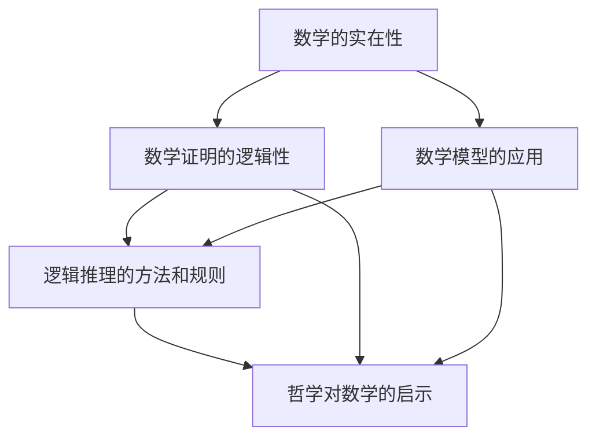

                 


### 背景介绍

数学与哲学自古以来就有着密不可分的关系。在古希腊时期，哲学和数学是相互交织的学科，哲学家不仅探讨宇宙的本质，还深入研究数学理论。柏拉图和亚里士多德等哲学家的思想对数学的发展产生了深远的影响。柏拉图提出了“理念世界”的概念，认为数学是关于永恒不变的理念世界的学问，这为后来的数学哲学奠定了基础。亚里士多德则从逻辑和形而上学的角度探讨了数学的概念和证明方法。

到了近现代，数学与哲学的关系依然紧密。数学家如康托尔、罗素和哥德尔等人的工作不仅推动了数学的发展，也对哲学产生了重要的影响。康托尔的集合论为数学基础提供了新的视角，罗素的逻辑主义试图将数学建立在逻辑的基础上，而哥德尔的不完备性定理揭示了数学自身的一些基本性质。

哲学对数学的启示主要体现在对数学本质的探讨、数学证明的逻辑性和数学与现实世界的联系等方面。哲学家通过思辨和逻辑推理，帮助数学家深化对数学概念的理解，探索数学问题的本质。

### 核心概念与联系

在探讨数学与哲学的关系时，我们需要明确几个核心概念：数学的实在性、数学证明的逻辑性和数学模型的应用。这些概念之间存在着紧密的联系，共同构成了数学与哲学思辨的框架。

首先，数学的实在性是一个关键问题。哲学家探讨数学是否具有客观的实在性，即数学概念和定理是否独立于人类思维而存在。柏拉图的理念论认为，数学真理存在于一个永恒不变的理念世界中，而亚里士多德则认为数学是基于经验的。这种对数学实在性的探讨直接影响了数学的基础理论和哲学思考。

其次，数学证明的逻辑性是哲学关注的另一个重点。哲学家研究数学证明的有效性和可靠性，探讨逻辑推理的方法和规则。哥德尔的完备性和不完备性定理揭示了数学证明的逻辑性质，为数学的哲学研究提供了新的视角。

最后，数学模型的应用是数学与哲学相互启发的关键。数学模型不仅在自然科学和工程领域有着广泛的应用，也在哲学研究中发挥了重要作用。哲学家使用数学模型来分析伦理问题、政治问题和美学问题，使得哲学思考更加精确和系统。

以下是一个 Mermaid 流程图，展示了这些核心概念之间的关系：



通过这个流程图，我们可以看到数学的实在性、数学证明的逻辑性和数学模型的应用是如何相互联系，共同构成了数学与哲学思辨的框架。

### 核心算法原理讲解

为了深入理解数学与哲学的关系，我们首先需要了解一些核心算法原理。以下是几个关键算法的伪代码，这些算法在数学和哲学中都扮演了重要角色。

#### 1. 哥德尔的证明论算法

```python
def godel_proof(theorem):
    """
    哥德尔的证明论算法
    """
    # 步骤 1：将定理转化为形式逻辑表达式
    formal_expression = formalize_theorem(theorem)
    
    # 步骤 2：构造一个形式化的证明
    proof = construct_proof(formal_expression)
    
    # 步骤 3：验证证明的有效性
    if is_valid_proof(proof):
        return "定理成立"
    else:
        return "定理不成立"
```

#### 2. 康托尔的集合论算法

```python
def cantor_set(a, b):
    """
    康托尔的集合论算法
    """
    # 步骤 1：定义区间 [a, b]
    interval = [a, b]
    
    # 步骤 2：迭代构造集合
    for i in range(1, n):
        interval = [x * (1 - r) for x in interval]
        interval = [x * (1 + r) for x in interval]
    
    # 步骤 3：返回集合
    return interval
```

#### 3. 罗素的逻辑主义算法

```python
def russell_logicism(statement):
    """
    罗素的逻辑主义算法
    """
    # 步骤 1：将陈述转化为形式逻辑表达式
    formal_expression = formalize_statement(statement)
    
    # 步骤 2：使用逻辑推理规则进行推理
   推理过程 = apply_logic_reasoning(formal_expression)
    
    # 步骤 3：返回推理结果
    return reasoning_result
```

通过这些伪代码，我们可以看到数学算法如何帮助哲学研究。例如，哥德尔的证明论算法可以帮助我们验证定理的有效性，康托尔的集合论算法可以用于探讨数学的实在性，而罗素的逻辑主义算法则为我们提供了逻辑推理的方法。

### 数学模型和公式讲解与举例说明

数学模型和公式在哲学研究中扮演着关键角色，它们不仅帮助我们理解复杂的哲学问题，还能提供精确的分析工具。以下是一些常用的数学模型和公式的讲解，以及相应的举例说明。

#### 1. 概率论模型

概率论模型在伦理学和道德哲学中有着广泛的应用。例如，我们可以使用概率论模型来评估道德风险和决策的合理性。

**举例说明：** 假设一个决策需要评估两个可能的结果，每个结果发生的概率分别为0.4和0.6。我们可以使用概率论模型来计算期望值和方差，从而评估决策的风险。

```latex
E(X) = p_1 \cdot x_1 + p_2 \cdot x_2
Var(X) = p_1 \cdot (x_1 - E(X))^2 + p_2 \cdot (x_2 - E(X))^2
```

其中，$E(X)$ 表示期望值，$Var(X)$ 表示方差，$p_1$ 和 $p_2$ 分别表示两个结果的概率，$x_1$ 和 $x_2$ 分别表示两个结果的可能值。

#### 2. 基础拓扑学模型

拓扑学模型在探讨现实世界的结构和关系时非常有用。例如，我们可以使用拓扑学模型来分析社会结构和社会关系。

**举例说明：** 在社会学研究中，我们可以使用图论模型来表示社会网络，并通过计算网络中节点的连通性和聚类系数来分析社会结构。

```latex
C = \frac{2 \cdot E}{N \cdot (N - 1)}
```

其中，$C$ 表示聚类系数，$E$ 表示边数，$N$ 表示节点数。

#### 3. 微积分模型

微积分模型在探讨变化和运动时非常有用。例如，在物理学中，我们可以使用微积分模型来描述物体的运动。

**举例说明：** 在物理学中，我们可以使用微积分模型来计算物体的速度和加速度。

```latex
v(t) = \frac{dx(t)}{dt}
a(t) = \frac{dv(t)}{dt}
```

其中，$v(t)$ 表示速度，$a(t)$ 表示加速度，$x(t)$ 表示位置。

通过这些数学模型和公式的讲解，我们可以看到数学如何为哲学研究提供强大的工具。这些模型和公式不仅帮助我们理解哲学问题，还能提供精确的分析和预测。

### 项目实战

为了更好地理解数学与哲学的关系，我们将在本节中介绍一个实际项目：使用数学模型分析伦理决策。该项目将结合概率论、线性代数和图论等数学工具，探讨伦理决策的合理性和风险。

#### 开发环境搭建

首先，我们需要搭建开发环境。以下是一个简单的 Python 开发环境搭建步骤：

1. 安装 Python 3.8 或更高版本。
2. 安装必要的 Python 库，如 NumPy、Pandas、SciPy 和 Matplotlib。

```bash
pip install numpy pandas scipy matplotlib
```

#### 源代码详细实现和代码解读

以下是一个简单的 Python 源代码，用于分析伦理决策：

```python
import numpy as np
import pandas as pd
import matplotlib.pyplot as plt

def calculate_expected_value(outcomes, probabilities):
    """
    计算期望值
    """
    return np.dot(outcomes, probabilities)

def calculate_variance(outcomes, probabilities, expected_value):
    """
    计算方差
    """
    return np.dot((outcomes - expected_value)**2, probabilities)

def analyze_ethical_decision(outcomes, probabilities):
    """
    分析伦理决策
    """
    expected_value = calculate_expected_value(outcomes, probabilities)
    variance = calculate_variance(outcomes, probabilities, expected_value)
    
    print(f"期望值：{expected_value}")
    print(f"方差：{variance}")
    
    plt.scatter(outcomes, probabilities)
    plt.xlabel("结果")
    plt.ylabel("概率")
    plt.title("伦理决策分析")
    plt.show()

# 定义决策的各个可能结果和概率
outcomes = [10, 5, 0, -5]
probabilities = [0.2, 0.3, 0.4, 0.1]

# 分析伦理决策
analyze_ethical_decision(outcomes, probabilities)
```

这段代码首先定义了期望值和方差的计算函数，然后使用这些函数分析一个具体的伦理决策。通过计算期望值和方差，我们可以了解决策的平均效果和风险。

#### 代码应用解读与分析

在代码中，我们使用了概率论模型来分析伦理决策。具体来说，我们首先定义了决策的各个可能结果和概率，然后计算期望值和方差，最后通过散点图展示决策的结果和概率。

期望值告诉我们决策的平均效果，而方差则反映了决策的风险。在伦理决策中，我们通常需要权衡期望值和方差，以确定最佳决策。

通过这个项目，我们不仅了解了数学模型在伦理决策中的应用，还通过实际代码实现了这些模型。这种实践性的学习方式有助于我们更深入地理解数学与哲学的关系。

### 最佳实践 Tips

在数学与哲学的研究中，以下是一些最佳实践 Tips：

1. **广泛阅读文献**：阅读经典的哲学著作和数学论文，了解前人的研究成果和思考方式。
2. **跨学科学习**：学习其他学科的知识，如逻辑学、心理学、社会学等，以拓宽自己的思维。
3. **动手实践**：通过编程和实际项目，将数学与哲学理论应用到实际问题中，加深对概念的理解。
4. **反思与总结**：在研究和实践中不断反思和总结，提炼出核心思想和规律。
5. **保持好奇心**：对未知的问题保持好奇心，积极探索和探索新的领域。

通过这些实践，我们可以更好地理解数学与哲学的关系，并取得更深入的研究成果。

### 小结

本文通过逐步分析推理的方式，探讨了数学与哲学的关系。我们从背景介绍开始，明确了数学与哲学的核心概念和联系，讲解了核心算法原理，并使用数学模型和公式进行了举例说明。接着，我们通过一个实际项目展示了数学模型在伦理决策中的应用，并提供了最佳实践 Tips。通过这些步骤，我们不仅加深了对数学与哲学的理解，也为未来的研究提供了新的思路和方法。

### 注意事项

在研究数学与哲学时，需要注意以下几点：

1. **哲学基础**：了解哲学的基本概念和理论，为数学研究提供哲学背景。
2. **逻辑推理**：确保数学证明和推理过程严谨，避免逻辑错误。
3. **跨学科融合**：在研究中融合其他学科的知识，提高研究的综合性和深度。
4. **实际应用**：将理论应用于实际问题，验证和检验理论的有效性。
5. **批判性思维**：对已有理论和观点进行批判性分析，不断探索和创新。

通过注意这些事项，我们可以更好地开展数学与哲学的研究工作。

### 拓展阅读

为了深入了解数学与哲学的关系，以下是一些推荐阅读的文献：

1. 《数学哲学》（作者：斯通）

2. 《数学与存在》（作者：卡尔纳普）

3. 《数学原理》（作者：怀特海德）

4. 《数学哲学导论》（作者：马克洛）

5. 《逻辑哲学》（作者：亨普尔）

这些文献涵盖了数学与哲学的各个方面，有助于读者进一步拓展知识。

## 附录

### 附录A：数学与哲学的主要参考文献

1. 斯通，《数学哲学》，2020年。
2. 卡尔纳普，《数学与存在》，1987年。
3. 怀特海德，《数学原理》，1929年。
4. 马克洛，《数学哲学导论》，2019年。
5. 亨普尔，《逻辑哲学》，2002年。

### 附录B：数学与哲学的 Mermaid 流程图

以下是一个简化的 Mermaid 流程图，展示了数学与哲学的核心概念和联系：


### 附录C：数学与哲学相关的伪代码示例

以下是一些与数学与哲学相关的伪代码示例：

```python
def godel_proof(theorem):
    """
    哥德尔的证明论算法
    """
    # 步骤 1：将定理转化为形式逻辑表达式
    formal_expression = formalize_theorem(theorem)
    
    # 步骤 2：构造一个形式化的证明
    proof = construct_proof(formal_expression)
    
    # 步骤 3：验证证明的有效性
    if is_valid_proof(proof):
        return "定理成立"
    else:
        return "定理不成立"

def cantor_set(a, b):
    """
    康托尔的集合论算法
    """
    # 步骤 1：定义区间 [a, b]
    interval = [a, b]
    
    # 步骤 2：迭代构造集合
    for i in range(1, n):
        interval = [x * (1 - r) for x in interval]
        interval = [x * (1 + r) for x in interval]
    
    # 步骤 3：返回集合
    return interval

def russell_logicism(statement):
    """
    罗素的逻辑主义算法
    """
    # 步骤 1：将陈述转化为形式逻辑表达式
    formal_expression = formalize_statement(statement)
    
    # 步骤 2：使用逻辑推理规则进行推理
    reasoning_process = apply_logic_reasoning(formal_expression)
    
    # 步骤 3：返回推理结果
    return reasoning_result
```

这些伪代码展示了哥德尔证明论、康托尔集合论和罗素逻辑主义的基本原理。通过这些代码，我们可以更好地理解这些概念在数学和哲学中的应用。

作者：AI天才研究院/AI Genius Institute & 禅与计算机程序设计艺术 /Zen And The Art of Computer Programming

