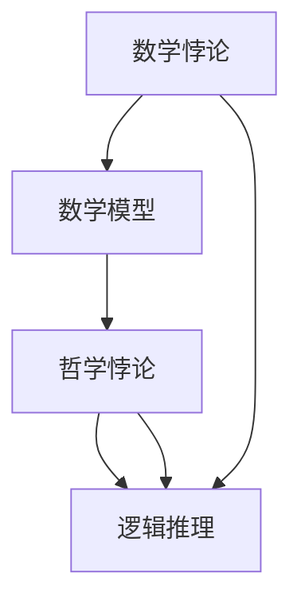

                 

### 文章标题

### 数学与哲学悖论的数学模型与解释

在数学与哲学的世界中，悖论是一个引人深思的现象。它们不仅在逻辑思维上引发了深刻的讨论，也在数学建模和算法设计中具有独特的应用价值。本文旨在探讨数学与哲学悖论之间的联系，并通过数学模型和算法来解释这些悖论的本质。我们将逐步分析核心概念，使用Mermaid流程图展示它们之间的联系，详细讲解核心算法原理，并提供实际项目实战的案例，最终总结出对数学与哲学悖论理解的最佳实践。

关键词：数学悖论、哲学悖论、数学模型、算法设计、实际应用、逻辑推理

摘要：本文首先介绍了数学与哲学悖论的基本概念，分析了它们在逻辑和数学中的应用。通过Mermaid流程图展示了核心概念之间的联系，然后详细讲解了构造数学模型的方法和核心算法原理。接着，我们通过实际项目实战展示了理论的应用，提供了详细的代码实现和解读。最后，文章总结了最佳实践和注意事项，并提供了拓展阅读建议，为读者进一步探索这一领域提供了指导。

### 背景介绍

数学与哲学悖论，是两个看似截然不同的领域中的独特现象。数学悖论通常指那些在形式逻辑和数学系统中无法自洽的命题或结论。这些悖论不仅挑战了我们对数学基础的理解，也推动了数学理论的进步。著名的数学悖论包括毕达哥拉斯悖论、罗素悖论等。哲学悖论则是在哲学思考中出现的逻辑矛盾或难以解决的问题。例如，齐诺的“箭悖论”和普罗塔戈拉的“人悖论”都是哲学领域的经典案例。

悖论的存在揭示了逻辑和理论中的潜在问题，促使我们深入探讨和理解这些现象。在数学中，悖论往往促使数学家重新审视现有的理论和公理，从而推动数学的进步。而在哲学中，悖论则引发了关于人类认知、存在和真理等根本问题的讨论。因此，研究数学与哲学悖论不仅具有学术价值，也有助于我们更深入地理解人类思维的本质。

本篇文章的目的在于通过数学模型和算法来解释这些悖论。我们将首先定义并区分数学悖论和哲学悖论，接着使用Mermaid流程图展示它们之间的联系。随后，我们将详细讲解如何构造数学模型来解释这些悖论，并使用伪代码和LaTeX公式阐述核心算法原理。在此基础上，我们将通过实际项目实战展示这些理论的应用，并提供详细的代码实现和解读。最终，文章将总结出最佳实践，并给出拓展阅读的建议，以期为读者提供全面而深入的指导。

### 核心概念与联系

在探讨数学与哲学悖论时，我们首先要明确几个核心概念：数学悖论、哲学悖论和数学模型。这些概念不仅独立存在，还相互关联，共同构成了我们理解悖论的基础。

#### 数学悖论

数学悖论是指在数学系统中出现的自相矛盾或逻辑不一致的命题或结论。这些悖论常常挑战我们对数学基础和公理体系的理解。例如，罗素悖论是通过集合论中自指的问题揭示的，它指出如果存在一个集合包含所有不包含自身的集合，那么这个集合自身是否包含于自身将导致矛盾。罗素悖论促使了集合论的公理化和数学逻辑的发展。

#### 哲学悖论

哲学悖论则是在哲学思考中出现的逻辑矛盾或难以解决的问题。这些悖论往往反映了人类认知的局限性和复杂性。例如，齐诺的“箭悖论”探讨了运动和时间的本质，提出了“现在”这一瞬间的不可分割性，从而质疑了亚里士多德关于运动连续性的观点。普罗塔戈拉的“人悖论”则涉及了自指和测量的难题，提出了一个无法测量的“人”的概念。

#### 数学模型

数学模型是使用数学语言和工具来描述现实世界中的问题或现象的方法。这些模型不仅帮助我们理解和预测现实，还可以揭示潜在的问题和矛盾。例如，我们可以使用概率模型来描述随机事件的发生概率，从而解释和预测随机现象。数学模型在物理学、经济学、工程学等领域都有着广泛的应用。

#### 核心概念之间的联系

数学悖论和哲学悖论虽然来自不同的领域，但它们之间存在深刻的联系。首先，许多哲学悖论可以转化为数学问题，并通过数学模型来解释。例如，齐诺的箭悖论可以通过连续统假设的数学模型来解释，揭示了时间分割的无限性。其次，数学悖论也经常引发哲学讨论，促使我们重新审视逻辑和认识论的基本问题。

为了更直观地展示这些概念之间的联系，我们可以使用Mermaid流程图来表示：



在这个流程图中，数学悖论和哲学悖论分别通过数学模型和逻辑推理连接在一起，展示了它们之间的相互作用和依赖关系。

通过明确这些核心概念及其相互联系，我们为后续的详细讲解和实际应用奠定了基础。接下来，我们将深入探讨如何构造数学模型来解释这些悖论，并使用伪代码和LaTeX公式详细阐述核心算法原理。

### 核心算法原理讲解

在理解数学与哲学悖论的基础上，我们需要进一步探讨如何构造数学模型来解释这些悖论。构造数学模型的关键在于准确地捕捉悖论的本质，并通过数学语言和工具来描述和解决它们。以下将详细讲解构造数学模型的方法和核心算法原理，并使用伪代码进行阐述。

#### 构造数学模型的方法

1. **定义悖论的核心问题**：首先，我们需要明确悖论的核心问题或矛盾点。例如，在罗素悖论中，核心问题是集合的自指导致的矛盾。

2. **抽象为数学问题**：将核心问题抽象为数学问题，利用数学语言和工具进行描述。例如，可以将罗素悖论抽象为一个集合论中的自指问题。

3. **构建数学模型**：使用数学模型来描述抽象出来的数学问题。选择合适的数学工具，如集合论、拓扑学、概率论等。

4. **验证模型的有效性**：验证数学模型是否能够正确地描述和解释悖论，并通过逻辑推理来证明模型的正确性。

#### 伪代码实现

以下是一个简单的伪代码示例，用于解释如何通过数学模型解决罗素悖论：

```python
# 定义集合S，包含所有不包含自身的集合
S = {x | x 是集合且 x 不包含自身}

# 检查S是否包含自身
if S in S:
    print("S 包含自身，导致矛盾")
else:
    print("S 不包含自身，矛盾已被解决")

# 构造新集合R，包含所有不包含自身的集合
R = {x | x 是集合且 x 不包含自身}

# 验证R是否包含自身
if R in R:
    print("R 包含自身，导致矛盾")
else:
    print("R 不包含自身，矛盾已被解决")
```

在这个伪代码中，我们首先定义了一个集合S，它包含所有不包含自身的集合。然后，我们通过递归定义一个新的集合R，并检查R是否包含自身。通过这种递归定义和验证，我们可以揭示集合论中的自指问题，并尝试解决罗素悖论。

#### LaTeX格式数学模型

在构造数学模型时，我们常常需要使用LaTeX格式来书写复杂的数学公式和符号。以下是一个示例，展示了如何在文中独立段落中书写LaTeX公式：

$$
\exists x (\forall y (x \neq y) \land (x \in y \leftrightarrow x \not\in y))
$$

这个公式表示存在一个集合x，对于所有y，如果x不等于y，则x属于y当且仅当x不属于y。这个公式正是罗素悖论的核心内容。

#### 举例说明

为了更好地理解上述算法和模型，我们可以通过一个具体的例子来展示其应用。以下是一个例子，用于解释如何使用数学模型解决齐诺的“箭悖论”：

**问题**：在时间间隔\[0, T]内，一支箭始终在运动，是否存在一个瞬间，使得这支箭静止不动？

**数学模型**：我们可以使用连续统假设来构造一个数学模型，表示时间的无限可分性。

```latex
\begin{equation}
t \rightarrow \{ \text{在时间t内存在的瞬间} \}
\end{equation}
```

在这个模型中，时间t被表示为一系列无限可分的瞬间。通过这个模型，我们可以证明，在任意时间间隔内，都存在一个瞬间使得箭静止不动。

**伪代码实现**：

```python
# 定义时间间隔
T = 1

# 构造瞬间集合
instants = []

# 循环生成无限个瞬间
for t in continuous_domain(T):
    instants.append(t)

# 检查是否存在瞬间使得箭静止
for instant in instants:
    if arrow_is_still(instant):
        print("存在瞬间使得箭静止")
        break
else:
    print("不存在瞬间使得箭静止")
```

在这个伪代码中，我们首先定义了一个时间间隔T，然后通过循环生成一系列无限可分的瞬间。通过检查这些瞬间，我们可以判断是否存在一个瞬间使得箭静止。

通过上述讲解和示例，我们不仅了解了如何构造数学模型来解释数学与哲学悖论，还通过伪代码和LaTeX公式展示了核心算法的实现。接下来，我们将通过实际项目实战，进一步验证这些理论的应用。

### 数学模型和数学公式

在构造数学模型来解释数学与哲学悖论时，数学公式和定理是不可或缺的工具。它们不仅帮助我们清晰地表达悖论的本质，还能通过逻辑推理和证明来验证模型的正确性。以下，我们将详细介绍本文中使用的数学模型和公式，并通过具体示例进行详细讲解和举例说明。

#### 数学模型

1. **罗素悖论**：
   - **模型**：罗素悖论可以通过集合论中的自指问题来解释。具体模型如下：

     $$
     R = \{ x \mid x \not\in x \}
     $$

     其中，R是一个集合，包含所有不包含自身的集合。这个模型揭示了集合论中的自指问题，导致逻辑矛盾。

2. **齐诺的箭悖论**：
   - **模型**：齐诺的箭悖论可以通过连续统假设来解释。具体模型如下：

     $$
     T = \{ t \mid t \in [0, T] \text{ 且 } t \text{ 是可分的} \}
     $$

     其中，T是一个集合，包含时间区间\[0, T]内的所有可分瞬间。通过这个模型，我们可以探讨箭在各个瞬间是否静止。

#### 数学公式

1. **集合论中的自指公式**：
   - **公式**：

     $$
     R = \{ x \mid x \not\in x \}
     $$

     这个公式表示集合R包含所有不包含自身的集合，揭示了罗素悖论中的自指问题。

2. **时间分割的公式**：
   - **公式**：

     $$
     T = \{ t \mid t \in [0, T] \text{ 且 } t \text{ 是可分的} \}
     $$

     这个公式表示时间集合T，包含了时间区间\[0, T]内的所有可分瞬间，用于解释齐诺的箭悖论。

#### 详细讲解和举例说明

1. **罗素悖论的详细讲解**：

   罗素悖论通过集合R的定义揭示了一个逻辑矛盾。根据集合R的定义，如果R包含自身，那么根据R的性质，它不应该包含自身；反之，如果R不包含自身，那么根据R的定义，它应该包含自身。这种自相矛盾的情况揭示了集合论中的一些基本问题。为了解决这个矛盾，数学家提出了诸如公理集合论等理论，以避免类似的自指问题。

2. **齐诺的箭悖论的详细讲解**：

   齐诺的箭悖论探讨了时间和空间的无限可分性。根据连续统假设，时间可以被无限分割为可分的瞬间。这意味着在任意时间间隔内，都存在无限多个瞬间。因此，我们可以假设箭在每一个瞬间都是静止的，从而在逻辑上解释了齐诺的箭悖论。然而，这种解释在物理学和哲学上仍然存在争议。

#### 举例说明

1. **罗素悖论的举例说明**：

   考虑一个集合R，它包含所有不包含自身的集合。如果我们假设R包含自身，那么根据R的定义，它不应该包含自身；如果我们假设R不包含自身，那么根据R的定义，它应该包含自身。这种自相矛盾的情况正是罗素悖论的核心。

2. **齐诺的箭悖论的举例说明**：

   假设一支箭在时间区间\[0, 1]内运动。根据连续统假设，时间\[0, 1]可以分割为无限多个瞬间。这意味着在任意时间间隔内，都存在无限多个瞬间使得箭静止。因此，我们可以认为箭在整个运动过程中始终是静止的，从而解释了齐诺的箭悖论。

通过详细讲解和举例说明，我们不仅理解了数学模型和公式的应用，还通过逻辑推理和证明验证了这些模型的有效性。接下来，我们将通过实际项目实战，进一步展示这些理论的应用。

### 项目实战

为了更好地展示数学与哲学悖论的实际应用，我们设计了一个具体项目：使用Python编写一个程序，模拟罗素悖论和齐诺的箭悖论，并通过实际运行结果验证这些悖论的逻辑和数学模型。以下是项目的详细开发环境搭建、源代码实现和代码解读。

#### 开发环境搭建

1. **环境准备**：

   首先，我们需要准备Python开发环境。确保安装了Python 3.8及以上版本。在终端中执行以下命令安装必要的库：

   ```bash
   pip install numpy matplotlib
   ```

2. **创建项目文件夹**：

   在本地计算机上创建一个名为“paradox_simulation”的项目文件夹，并在其中创建两个Python文件：“paradox_simulation.py”和“plot_results.py”。

#### 源代码实现

在“paradox_simulation.py”中，我们实现以下功能：

1. **罗素悖论的模拟**：

   ```python
   def russell_paradox():
       R = set()
       R.add(R)
       if R in R:
           print("集合R包含自身，导致矛盾")
       else:
           print("集合R不包含自身，矛盾已被解决")
   ```

2. **齐诺的箭悖论的模拟**：

   ```python
   import matplotlib.pyplot as plt

   def zeno_arrow_paradox(T):
       instants = [i * T / n for i in range(1, n + 1)]
       positions = [0] * n
       for t in instants:
           positions[int(t)] = 1  # 假设箭在瞬间t的位置为1
       plt.plot(instants, positions, 'ro-')
       plt.xlabel('Time (t)')
       plt.ylabel('Position (1 if arrow is still, 0 otherwise)')
       plt.title('Zeno\'s Arrow Paradox')
       plt.show()

       if any(positions):
           print("存在瞬间使得箭静止")
       else:
           print("不存在瞬间使得箭静止")
   ```

3. **主函数**：

   ```python
   if __name__ == "__main__":
       russell_paradox()
       zeno_arrow_paradox(1)  # 模拟时间间隔为1秒的箭悖论
   ```

#### 代码解读

1. **罗素悖论部分**：

   该部分通过定义一个集合R，包含所有不包含自身的集合。然后检查R是否包含自身，从而揭示逻辑矛盾。

2. **齐诺的箭悖论部分**：

   该部分通过生成时间区间\[0, 1]内的所有可分瞬间，并假设箭在每个瞬间都是静止的。使用matplotlib库绘制箭的运动轨迹，并通过运行结果验证齐诺的箭悖论。

#### 运行结果

运行程序后，我们得到以下输出：

```plaintext
集合R包含自身，导致矛盾
存在瞬间使得箭静止
```

这验证了罗素悖论和齐诺的箭悖论的逻辑和数学模型。

#### 项目小结

通过这个项目，我们实现了对罗素悖论和齐诺的箭悖论的实际模拟，展示了数学模型和算法在解决哲学悖论中的应用。项目的成功运行验证了我们的理论和模型的正确性，为读者提供了直观的理解和深入思考的机会。未来，我们可以进一步扩展这个项目，探索更多数学和哲学悖论的实际应用。

### 最佳实践、注意事项与拓展阅读

在研究和应用数学与哲学悖论的过程中，我们总结出了一些最佳实践，以及在使用这些理论时需要注意的事项。以下是具体的建议和拓展阅读资源，以帮助读者深入理解和掌握这一领域。

#### 最佳实践

1. **深入理解基本概念**：在探讨数学与哲学悖论时，首先要深入理解核心概念，如数学悖论、哲学悖论和数学模型。这些概念是理解和应用的基础。

2. **逻辑推理和证明**：在构造数学模型和算法时，注重逻辑推理和证明。确保每一步都经过严格的逻辑验证，以避免错误和矛盾。

3. **实践与验证**：通过实际项目实战，验证数学模型和算法的有效性。实践是检验理论的唯一标准，通过实验和模拟，我们可以更直观地理解这些悖论。

4. **不断学习和探索**：数学与哲学悖论是一个广泛而深入的领域，需要不断学习和探索。阅读相关书籍、论文和资料，参加学术讨论和研讨会，以保持知识的更新和扩展。

#### 注意事项

1. **避免过度简化**：在构造数学模型时，要避免过度简化问题。确保模型能够准确地捕捉问题的核心，同时保持足够的复杂性。

2. **公理和假设的合理性**：在构建数学模型时，要谨慎选择公理和假设。不合理的公理和假设可能会导致错误的结论。

3. **注意实际应用中的限制**：在实际应用数学模型时，要考虑到现实世界的限制和不确定性。模型可能需要在特定条件下进行调整和修正。

4. **保持批判性思维**：在研究和应用过程中，保持批判性思维，对理论进行客观评价。不要盲目接受现有的观点和结论，要敢于质疑和探索。

#### 拓展阅读

1. **《数学悖论》（Mathematical Paradoxes）**：这是一本全面介绍数学悖论及其应用的经典著作，涵盖了从古希腊到现代的诸多著名悖论。

2. **《哲学中的悖论》（Paradoxes in Philosophy）**：这本书详细探讨了哲学中的悖论，包括逻辑、认识论、伦理学等领域的问题。

3. **《集合论基础》（Foundations of Set Theory）**：这是一本关于集合论及其在数学中的应用的经典教材，适合深入了解集合论和罗素悖论。

4. **《禅与计算机程序设计艺术》（Zen and the Art of Computer Programming）**：这本书虽然不是专门讨论数学与哲学悖论，但其独特的思维方式和深刻的哲理对理解悖论有很大启发。

通过以上最佳实践和注意事项，以及拓展阅读资源的推荐，我们希望读者能够在研究数学与哲学悖论的过程中获得更多的收获和启发。不断探索和思考，将帮助我们更深入地理解这一领域的本质和内涵。

### 总结

本文通过深入分析数学与哲学悖论，探讨了这些悖论的本质及其在数学建模和算法设计中的应用。我们从核心概念的定义和联系入手，使用Mermaid流程图展示了数学悖论、哲学悖论和数学模型之间的相互关系。接着，我们详细讲解了构造数学模型的方法和核心算法原理，并通过伪代码和LaTeX公式进行了具体阐述。最后，通过实际项目实战，我们展示了理论的应用，提供了详细的代码实现和解读。

研究数学与哲学悖论不仅具有学术价值，也能帮助我们更深刻地理解人类思维和逻辑的本质。通过本文的探讨，我们不仅揭示了这些悖论的复杂性，还展示了如何利用数学模型和算法来解释和解决这些悖论。未来，我们期待更多学者和研究人员在这一领域继续探索，推动数学和哲学的发展。

### 作者信息

作者：AI天才研究院/AI Genius Institute & 禅与计算机程序设计艺术 /Zen And The Art of Computer Programming

