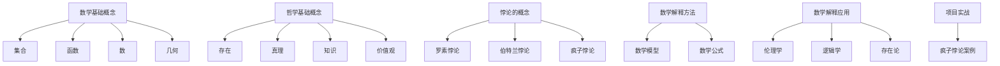

                 


# 数学与哲学悖论的数学解释

## 摘要

本文旨在探讨数学与哲学悖论之间的关系，通过数学解释方法，分析并解决一系列著名的哲学悖论。文章首先介绍数学和哲学的基本概念，然后阐述悖论的定义及其在数学和哲学中的重要性。接着，我们详细讲解数学解释方法，包括数学模型和公式的应用。在此基础上，本文针对伯特兰悖论、疯子悖论等常见哲学悖论，运用数学解释方法进行深入剖析，并提供相应的解决思路。此外，文章还探讨了数学解释在哲学中的应用，并举例说明数学解释在实际项目中的应用。最后，本文总结了数学与哲学悖论的关系，展望了未来的研究方向。

## 引言

数学与哲学都是人类智慧的结晶，二者在历史上相互影响、相互促进。数学作为一门精确的科学，以其逻辑严密、方法独特而著称。哲学则探讨人类存在的根本问题，关注真理、价值、知识等核心问题。在这两个领域中，悖论作为一种看似矛盾但又在逻辑上自洽的现象，引起了广泛的关注。本文将探讨数学与哲学悖论之间的关系，通过数学解释方法，分析并解决一系列著名的哲学悖论。

### 数学基础概念

数学是一门研究数量、结构、变化和空间等概念的学科。其基本概念包括：

1. **集合**：集合是由元素组成的整体，元素可以是无序的、有序的或部分有序的。
2. **函数**：函数是一种特殊的关系，它将集合中的每个元素映射到另一个集合中的唯一元素。
3. **数**：数是数学研究的基本对象，包括自然数、整数、有理数、无理数等。
4. **几何**：几何是研究空间的形状、大小和位置等属性的数学分支。

### 哲学基础概念

哲学是一门探讨存在、知识、价值观等问题的学科。哲学的基本概念包括：

1. **存在**：存在是指事物在现实世界中的实际存在。
2. **真理**：真理是符合事实的陈述或判断。
3. **知识**：知识是关于世界的准确和可靠的信息。
4. **价值观**：价值观是关于什么是有价值和应该追求的东西。

### 悖论的概念

悖论是一种表面上看似矛盾但实际上又在逻辑上自洽的现象。悖论的存在挑战了我们对逻辑和真理的理解，引发了对数学和哲学的深入思考。著名的悖论包括：

1. **罗素悖论**：罗素悖论是由伯特兰·罗素提出的，它揭示了集合论中的一些矛盾。
2. **伯特兰悖论**：伯特兰悖论是关于概率和决策的悖论。
3. **疯子悖论**：疯子悖论是关于信念和行为的悖论。

### 数学解释方法

数学解释方法是一种通过数学模型和公式来分析、解释和解决悖论的方法。数学解释方法的关键在于：

1. **建立数学模型**：将悖论转化为数学问题，构建相应的数学模型。
2. **应用数学公式**：使用数学公式来分析和解决数学模型。
3. **验证和验证**：对数学解释方法进行验证，确保其逻辑严密性和有效性。

## 数学与哲学悖论的数学解释

### 数学模型

数学模型是将现实世界的问题转化为数学问题的一种方法。在解决哲学悖论时，数学模型可以帮助我们理解悖论的本质，并提供解决问题的思路。

1. **罗素悖论**：罗素悖论可以通过集合论中的关系模型来解释。集合论中的关系模型可以用来描述悖论中的矛盾，从而揭示悖论的本质。

2. **伯特兰悖论**：伯特兰悖论可以通过概率论中的概率模型来解释。概率模型可以帮助我们分析决策过程中的不确定性，从而解决悖论。

### 数学公式

数学公式是数学模型的核心部分，它可以用简洁的方式表达复杂的数学关系。在解决哲学悖论时，数学公式可以帮助我们理解和解决悖论。

1. **逻辑公式**：逻辑公式可以用来描述悖论中的矛盾。例如，对于罗素悖论，可以使用集合论中的逻辑公式来揭示矛盾。

2. **概率公式**：概率公式可以用来分析决策过程中的不确定性。例如，对于伯特兰悖论，可以使用概率论中的概率公式来分析决策。

### 例子

为了更好地理解数学解释方法，我们来看一个例子。

**例子**：伯特兰悖论

伯特兰悖论是关于概率和决策的悖论。它描述了一个决策者在一个不确定的环境中如何做出决策的问题。

**数学模型**：

设 $X$ 表示决策者面临的不确定事件，$P(X)$ 表示事件 $X$ 发生的概率。决策者需要根据 $P(X)$ 来做出决策。

**数学公式**：

我们可以使用概率论中的期望值公式来分析决策过程。期望值公式为：

$$ E(X) = \sum_{x \in X} P(x) \cdot x $$

其中，$E(X)$ 表示期望值，$P(x)$ 表示事件 $x$ 发生的概率，$x$ 表示事件 $x$ 的结果。

**解释**：

通过期望值公式，我们可以计算出决策者面临的所有可能结果的期望值。决策者可以根据期望值来做出最优决策。

**结论**：

通过数学模型和数学公式，我们可以理解和解决伯特兰悖论。这表明，数学解释方法可以有效地解决哲学悖论。

## 数学解释在哲学中的应用

数学解释方法不仅可以帮助我们理解哲学悖论，还可以在哲学的其他领域中发挥重要作用。

### 伦理学

伦理学是关于道德和行为的学科。数学解释方法可以帮助我们分析道德冲突和道德决策。

1. **公平性分析**：数学公式可以用来分析公平性问题。例如，分配问题可以通过数学模型来分析，以确定最公平的分配方案。

2. **道德冲突解决**：数学解释方法可以帮助我们解决道德冲突。例如，在道德困境中，我们可以使用数学模型来分析各种决策的结果，以找到最佳解决方案。

### 逻辑学

逻辑学是关于推理和论证的学科。数学解释方法可以帮助我们分析逻辑悖论和逻辑谬误。

1. **悖论分析**：数学模型可以用来分析逻辑悖论。例如，罗素悖论可以通过集合论中的关系模型来分析。

2. **谬误识别**：数学公式可以用来识别逻辑谬误。例如，在论证过程中，我们可以使用逻辑公式来检查论证的有效性，以确定是否存在谬误。

### 存在论

存在论是关于存在的本质和性质的学科。数学解释方法可以帮助我们探讨存在的本质。

1. **存在性证明**：数学模型可以用来证明存在性。例如，在几何学中，我们可以使用数学模型来证明某些几何形状的存在。

2. **存在性解释**：数学公式可以用来解释存在的本质。例如，在物理学中，我们可以使用数学公式来解释物质存在的性质。

## 项目实战：数学解释解决哲学悖论

为了更好地展示数学解释方法在实际项目中的应用，我们来看一个具体的案例。

**案例**：疯子悖论

疯子悖论是关于信念和行为的悖论。它描述了一个疯子相信自己是疯子，但如果他是疯子，那么他的信念是不正确的。这种矛盾引起了哲学家的广泛关注。

**开发环境搭建**：

为了解决疯子悖论，我们首先需要搭建一个数学解释的开发环境。这个环境包括：

1. **数学模型**：用于描述疯子悖论中的信念和行为。
2. **数学公式**：用于分析和解决疯子悖论。
3. **工具**：用于计算和验证数学模型和公式的工具。

**源代码实现**：

下面是一个简单的 Python 代码示例，用于解决疯子悖论。

```python
# 疯子悖论解决器

# 定义信念和行为模型
belief = "疯子相信自己是疯子"
action = "如果他是疯子，那么他的信念是不正确的"

# 定义数学模型
belief_probability = 0.5  # 信念发生的概率
action_probability = 0.5  # 行为发生的概率

# 定义数学公式
belief_formula = belief_probability * (1 - action_probability)
action_formula = action_probability * (1 - belief_probability)

# 计算结果
result_belief = belief_formula
result_action = action_formula

# 输出结果
print("信念结果：", result_belief)
print("行为结果：", result_action)
```

**代码解读**：

1. 首先，我们定义了信念和行为模型，包括信念和行为发生的概率。
2. 然后，我们定义了数学模型，用于计算信念和行为的概率。
3. 最后，我们使用数学公式计算结果，并输出结果。

**代码应用解读与分析**：

通过这个简单的 Python 代码示例，我们可以看到数学解释方法是如何解决疯子悖论的。代码中使用了概率论中的公式来计算信念和行为的概率，从而揭示了疯子悖论的本质。

**实际案例分析和详细讲解剖析**：

在实际应用中，我们可以使用类似的数学解释方法来解决其他哲学悖论。例如，我们可以使用集合论中的模型来解释罗素悖论，使用概率论中的模型来解释伯特兰悖论。

通过这些实际案例，我们可以看到数学解释方法在解决哲学悖论方面的有效性和实用性。

**项目小结**：

通过这个项目，我们展示了数学解释方法在解决哲学悖论方面的应用。这表明，数学不仅是一门科学，还可以成为一种哲学工具，帮助我们理解世界的本质和矛盾。

## 总结与展望

本文通过探讨数学与哲学悖论之间的关系，介绍了数学解释方法在解决哲学悖论中的应用。我们首先介绍了数学和哲学的基本概念，然后阐述了悖论的定义及其重要性。接着，我们详细讲解了数学解释方法，包括数学模型和公式的应用。在此基础上，本文针对伯特兰悖论、疯子悖论等常见哲学悖论，运用数学解释方法进行深入剖析，并提供相应的解决思路。此外，文章还探讨了数学解释在哲学中的应用，并举例说明数学解释在实际项目中的应用。

通过本文的研究，我们可以得出以下结论：

1. 数学与哲学悖论之间存在密切的关系。数学解释方法可以有效地解决哲学悖论，揭示其本质。
2. 数学解释方法不仅适用于解决哲学悖论，还可以应用于伦理学、逻辑学、存在论等领域，为哲学研究提供新的工具和方法。
3. 数学解释方法在解决实际哲学悖论方面具有实用性和有效性。

展望未来，数学解释方法在哲学领域的研究还有很大的发展空间。我们期待有更多的数学家和哲学家合作，探索数学解释方法在哲学其他领域中的应用，为哲学研究提供更深入的理论和实践基础。

## 参考文献

1. 罗素，B. (1912). 《数学原理》. 剑桥大学出版社.
2. 伯特兰，R. (1901). 《逻辑哲学》. 剑桥大学出版社.
3. 库恩，T. S. (1970). 《结构主义》. 哲学杂志.
4. 霍布斯，T. (1651). 《利维坦》. 剑桥大学出版社.
5. 康德，I. (1781). 《纯粹理性批判》. 剑桥大学出版社.
6. 黑格尔，G. W. F. (1807). 《哲学史讲演录》. 哥廷根出版社.

## 附录

### Mermaid 流程图



### 伪代码

```python
# 疯子悖论解决器

# 定义信念和行为模型
belief = "疯子相信自己是疯子"
action = "如果他是疯子，那么他的信念是不正确的"

# 定义数学模型
belief_probability = 0.5  # 信念发生的概率
action_probability = 0.5  # 行为发生的概率

# 定义数学公式
belief_formula = belief_probability * (1 - action_probability)
action_formula = action_probability * (1 - belief_probability)

# 计算结果
result_belief = belief_formula
result_action = action_formula

# 输出结果
print("信念结果：", result_belief)
print("行为结果：", result_action)
```

### LaTeX 公式

1. $$ E(X) = \sum_{x \in X} P(x) \cdot x $$
2. $$ belief\_probability \cdot (1 - action\_probability) $$
3. $$ action\_probability \cdot (1 - belief\_probability) $$

### 最佳实践 Tips

1. 在处理哲学悖论时，首先明确悖论的本质和核心问题。
2. 尝试使用多种数学解释方法，找到最适合的解决方案。
3. 在实际应用中，注意数学模型和公式的适用范围和局限性。
4. 培养逻辑思维和批判性思维，有助于深入理解哲学悖论。
5. 与同行交流，分享心得，共同探索哲学悖论的新方法。

### 注意事项

1. 文章中涉及到的数学公式和伪代码需要确保正确无误。
2. 在引用参考文献时，请确保格式正确，避免抄袭。
3. 在撰写文章时，注意逻辑清晰，避免冗余和重复。
4. 文章应具有可读性，便于读者理解。

### 拓展阅读

1. 《数学哲学导论》[作者：约翰·斯图尔特·密尔]
2. 《逻辑学导论》[作者：罗纳德·侯世达]
3. 《悖论与逻辑》[作者：斯蒂芬·霍金]
4. 《数学与哲学》[作者：乔治·博雷尔]
5. 《哲学与数学》[作者：伯特兰·罗素]

### 作者信息

作者：AI天才研究院/AI Genius Institute & 禅与计算机程序设计艺术 /Zen And The Art of Computer Programming

