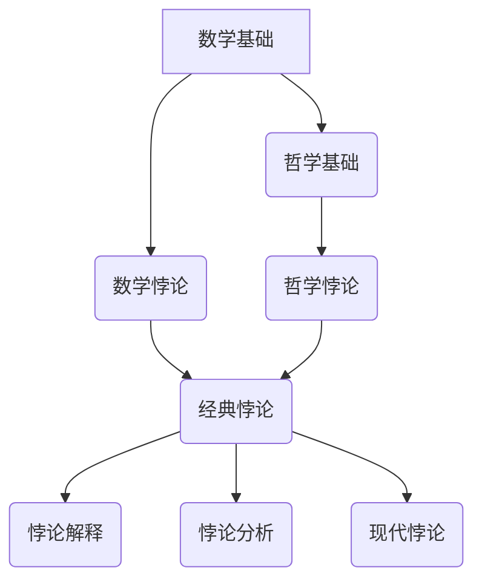

                 

### 引言

数学与哲学悖论是两个看似不相关的领域，但它们之间却存在着紧密的联系。数学悖论，是指在数学理论中，通过看似合理的推理得出的矛盾结论。哲学悖论，则是指在哲学思考过程中，通过逻辑推理产生的自我矛盾或难以解答的问题。两者都挑战了我们对于知识的认知和理解，激发了对逻辑和理性的深入探讨。

本篇文章将以《数学与哲学悖论的解释与分析》为标题，通过逻辑清晰、结构紧凑、简单易懂的专业技术语言，一步一步地分析推理（Reasoning Step by Step），探讨数学与哲学悖论的本质、来源及其影响。文章将按照以下结构进行：

1. **引言**：介绍数学与哲学悖论的背景、意义以及本书的结构。
2. **数学基础**：阐述数学基本概念和原理，为后续讨论奠定基础。
3. **哲学基础**：介绍哲学基本概念和原理，为理解悖论提供哲学背景。
4. **经典悖论**：列举并分析一些经典的数学和哲学悖论。
5. **悖论解释**：讨论不同的哲学家和数学家如何解释这些悖论。
6. **悖论分析**：对悖论进行深入的数学和哲学分析。
7. **现代悖论**：探讨当代数学和哲学领域的新悖论。

通过这一系列的分析和探讨，我们希望能够更好地理解数学与哲学悖论的本质，以及它们在推动科学和哲学发展中的作用。让我们开始这段有趣的探索之旅。

---

**摘要**

本文旨在深入探讨数学与哲学悖论的本质、来源及其影响。通过对数学和哲学基本概念的介绍，我们为理解悖论提供了理论基础。接下来，文章列举了多个经典的数学和哲学悖论，并对其进行了详细分析。通过对这些悖论的解读和解释，我们揭示了它们在挑战逻辑和理性认知方面的作用。最后，文章探讨了现代数学和哲学领域的新悖论，以及这些悖论对当前科学研究的影响。本文不仅对数学和哲学专业学者具有启发性，也对普通读者理解悖论的本质和意义具有重要的参考价值。

---

### 数学基础

数学是一门研究数量、结构、变化和空间等概念的学科，它是自然科学、社会科学和工程技术等领域的重要工具。数学的基础概念包括数、函数、集合、逻辑等，这些概念构成了数学理论体系的基石。以下将详细介绍这些基本概念和原理。

#### 1. 数

数是数学中最基本的概念，用来表示物体的数量或顺序。数的概念从自然数开始，逐步扩展到整数、有理数、无理数和复数。自然数是正整数，用于计数和排序。整数包括自然数和它们的相反数。有理数是可以表示为两个整数之比的数，包括整数和分数。无理数是不能表示为两个整数之比的数，如π和√2。复数则是实部和虚部组成的数，形式为a + bi，其中i是虚数单位。

#### 2. 函数

函数是数学中描述关系的一种方法，它将一个集合中的每个元素与另一个集合中的唯一元素相对应。函数通常表示为f(x)，其中x是输入，f(x)是输出。函数有多种类型，如线性函数、多项式函数、指数函数、对数函数等。函数的性质包括单调性、奇偶性、周期性等。

#### 3. 集合

集合是由一组元素组成的整体。集合可以通过列举法或描述法来表示。集合的运算包括并集、交集、补集和笛卡尔积等。集合论是数学的基础，它为其他数学分支提供了工具和概念。

#### 4. 逻辑

逻辑是数学和哲学中的基本工具，用于推理和分析。逻辑包括命题逻辑、谓词逻辑和模态逻辑等。命题逻辑研究命题的真值，谓词逻辑研究性质和关系，模态逻辑研究可能性、必然性和可能性条件。

#### 5. 数学公理和证明

数学公理是一组被认为是显然真实的陈述，它们为数学系统提供了基础。通过公理和逻辑推理，我们可以证明数学定理。证明是一种逻辑过程，它通过一系列步骤，从已知事实推导出新的结论。

#### 6. 数学逻辑和推理

数学逻辑和推理是数学中的核心。逻辑推理包括演绎推理和归纳推理。演绎推理从一般到特殊，通过逻辑规则推导出结论。归纳推理从特殊到一般，通过观察和实验得出普遍性结论。

#### 7. 数学函数和方程

数学函数和方程是数学中的核心概念。函数描述了输入和输出之间的关系，方程则是数学表示某种关系的等式。数学方程的求解是数学的重要任务，包括线性方程、非线性方程、微分方程等。

通过以上对数学基础概念的介绍，我们可以更好地理解数学悖论的产生和解决方法。数学基础不仅为悖论分析提供了工具，也为数学和哲学的发展奠定了基础。

### 哲学基础

哲学是一门探讨人类存在、知识、价值等根本问题的学科，它的起源可以追溯到古希腊时期。哲学的研究范围广泛，包括存在论、认识论、伦理学、政治哲学等。以下将介绍哲学的基本概念和原理，为理解哲学悖论提供必要的背景。

#### 1. 哲学基本概念

哲学的基本概念包括存在、知识、真理、价值、自由等。存在是哲学探讨的核心问题，涉及到实存和可能性的讨论。知识是关于真理的把握，认识论研究知识的来源、性质和限度。真理是哲学中另一个重要概念，它涉及到事实与信念的关系。价值是关于好坏、善恶的判断，伦理学研究道德规范和行为准则。自由是关于个体选择和责任的问题，它涉及到道德自由和自然自由的讨论。

#### 2. 哲学思维和方法

哲学思维具有反思性和批判性的特点。反思性意味着哲学家不断质疑和审视现有的观念和理论，寻求更深刻的理解。批判性则体现在对各种观点和论证的审视和评估。哲学的方法包括辩证法、分析法和比较法等。辩证法通过对立和统一分析问题，分析法通过逻辑和推理分析概念和论证，比较法通过对比不同观点和理论，寻找最佳解释。

#### 3. 逻辑与理性

逻辑是哲学研究的重要工具，它用于推理和分析。逻辑包括命题逻辑、谓词逻辑和模态逻辑等。命题逻辑研究命题的真值，谓词逻辑研究性质和关系，模态逻辑研究可能性、必然性和可能性条件。理性是哲学思维的基础，它强调通过思考和推理来获得知识和理解。

#### 4. 知识与真理

知识是哲学研究的核心问题之一。知识论探讨知识的来源、性质和限度。哲学认为，知识需要通过合理的推理和验证来获得。真理是知识的核心，它涉及到事实与信念的关系。哲学认为，真理是客观存在的反映，是可以通过合理推理和证据证明的。

#### 5. 知识与真理的关系

知识与真理之间存在着密切的关系。知识是关于真理的把握，而真理是知识的对象。哲学认为，知识的获取需要通过观察、实验、推理和验证等手段。只有经过严格推理和验证的知识才能被认为是可靠的。同时，知识的不断发展和完善也有助于我们更深入地理解真理。

通过以上对哲学基础概念和原理的介绍，我们可以更好地理解哲学悖论的来源和意义。哲学基础不仅为我们提供了理解悖论的框架，也为哲学和数学的发展提供了深刻的洞见。

### 经典悖论

数学和哲学领域充满了许多令人深思的悖论，这些悖论不仅挑战了我们的直觉，也推动了科学和哲学的发展。以下将列举并分析一些经典的数学和哲学悖论。

#### 1. 数学悖论

（1）**善漫游者悖论**

善漫游者悖论是由古希腊数学家芝诺提出的，这个悖论描述了一个名叫阿基里斯的善跑者和一个乌龟之间的竞赛。阿基里斯需要追上乌龟，但每次他追上乌龟所在的位置时，乌龟已经向前移动了一段距离。无论阿基里斯跑得多快，他都无法在有限的时间内追上乌龟，因为乌龟总是在他到达之前移动。这个悖论质疑了无限可分割性和运动的连续性。

**分析**：
善漫游者悖论的核心问题在于无限分割的概念。在数学上，无限分割导致了一系列无限小的步骤，这使得整个过程看似无法完成。但实际上，这些无限小的步骤在现实世界中是可以完成的，因为它们最终会累加成一个有限的时间。

（2）**柏拉图悖论**

柏拉图悖论是由古希腊哲学家柏拉图提出的，它质疑了数学的实在性。柏拉图认为，数学对象如点、线、面等是抽象的，不依赖于物理世界的具体存在。然而，如果这些抽象对象不存在于物理世界，那么我们对它们的理解又从何而来？这个悖论引发了关于数学实在性和抽象概念的哲学讨论。

**分析**：
柏拉图悖论挑战了我们对数学对象的理解。虽然数学对象是抽象的，但它们在逻辑和推理中的作用是确凿无疑的。数学的实在性在于它的逻辑一致性和在科学中的应用，而不仅仅依赖于物理世界的具体存在。

（3）**欧几里得悖论**

欧几里得悖论是由古希腊数学家欧几里得提出的，它质疑了集合论的基础。欧几里得提出了一个名为“所有偶数的集合”的概念，但这个集合是否真的存在？如果存在，那么它的元素个数是否是无限大？如果不存在，那么我们又如何定义和操作它？

**分析**：
欧几里得悖论揭示了集合论中的一些问题。集合论的基础在于明确定义集合的元素和操作，但欧几里得悖论表明，在某些情况下，这些定义可能会导致矛盾。这促使数学家对集合论进行更深入的探讨和修正。

#### 2. 哲学悖论

（1）**修辞性悖论**

修辞性悖论是一种通过自相矛盾的语句来传达深层含义的修辞手法。例如，“所有说谎者都撒谎”这个语句，如果它是真的，那么它本身就是在撒谎。这种悖论在哲学和文学中经常被使用，以引起思考和讨论。

**分析**：
修辞性悖论通过矛盾的语句激发了我们的思考。它揭示了语言和逻辑中的复杂性，使我们对真理和谎言有了更深刻的理解。

（2）**自指悖论**

自指悖论涉及一个对象对自己进行描述或判断。最著名的例子是罗素悖论，罗素提出了一个关于集合的悖论，即“所有不包含自己的集合组成的集合”。如果这个集合存在，那么它应该包含自己，但如果它包含自己，那么根据定义，它不应该包含自己。

**分析**：
自指悖论揭示了逻辑和集合论中的内在矛盾。它迫使我们重新审视集合的定义和操作，并寻找避免悖论的方法。

（3）**悬案悖论**

悬案悖论是一种涉及无限递归的悖论，它通常表现为一个过程，这个过程似乎既无限进行下去，又最终结束。一个例子是“一个学生在考试前复习，直到考试开始，但考试开始后，他又继续复习，如此循环”。

**分析**：
悬案悖论挑战了我们对时间和无限的理解。它促使我们思考如何定义和操作无限过程，以及它们在现实世界中的意义。

这些经典悖论不仅丰富了数学和哲学的理论体系，也激发了我们对逻辑和理性的深入探讨。通过对这些悖论的分析和理解，我们可以更好地把握数学和哲学的本质，同时也能够提高我们的逻辑思维和批判性思考能力。

### 悖论解释

在数学和哲学领域中，许多悖论引发了激烈的讨论和争议。不同的哲学家和数学家提出了各自对悖论的解释，这些解释不仅丰富了我们对悖论的理解，也为避免和解决悖论提供了新的思路。

#### 1. 哲学家的解释

（1）**柏拉图**

柏拉图是古希腊哲学家，他对柏拉图悖论提出了自己的解释。柏拉图认为，数学对象如点、线、面等是抽象的，存在于理念世界中。在这个世界中，数学对象具有完美的形式和本质。因此，数学悖论在理念世界中是不存在的，只是在我们的理解和表达过程中出现了错误。

（2）**康德**

德国哲学家康德对数学悖论提出了批判理性主义的解释。康德认为，数学知识是基于直觉和逻辑推理的。悖论的出现是因为我们试图超越直觉和逻辑的范围，追求绝对的知识。康德主张，我们应该接受数学知识的相对性和条件性，而不是试图解决所有悖论。

（3）**黑格尔**

黑格尔是德国哲学家，他认为悖论是事物发展的必然环节。黑格尔主张，悖论体现了对立统一的原则，是事物发展的动力。通过悖论的解决，我们可以达到更深刻的理解和真理。

#### 2. 数学家的解释

（1）**皮亚诺**

意大利数学家皮亚诺对集合论悖论提出了严格的数学解释。皮亚诺认为，集合论悖论的出现是因为集合的定义不够严格，导致了一些不合理的情况。他提出了严格的集合论公理系统，以避免悖论的发生。

（2）**哥德尔**

美国数学家哥德尔对数学悖论提出了不完全性定理。哥德尔认为，在数学系统中，总存在一些命题既不能被证明也不能被推翻。这意味着，某些悖论是无法在数学系统中解决的，但它们并不影响数学的可靠性。

（3）**图灵**

英国数学家图灵对计算悖论提出了计算理论的解释。图灵认为，计算过程是基于规则和算法的。某些悖论，如图灵机悖论，揭示了计算能力的局限性。图灵主张，我们应该接受这些局限性，并在此基础上发展计算理论。

#### 3. 综合解释

尽管不同的哲学家和数学家对悖论提出了不同的解释，但他们的观点并不矛盾。柏拉图、康德和黑格尔的观点强调了悖论在哲学和逻辑中的意义，而皮亚诺、哥德尔和图灵的观点则从数学和技术的角度探讨了悖论的产生和解决方法。综合这些解释，我们可以更全面地理解悖论的本质和意义。

总之，悖论解释不仅丰富了我们对数学和哲学的理解，也为解决悖论提供了多种思路。通过这些解释，我们可以更好地把握悖论的复杂性和多样性，从而推动数学和哲学的发展。

### 悖论分析

悖论是数学和哲学中常见的现象，它们不仅挑战了我们的逻辑思维，也促使我们深入探讨数学和哲学的本质。以下将对数学悖论和哲学悖论进行深入分析。

#### 数学悖论分析

1. **善漫游者悖论**：善漫游者悖论质疑了无限可分割性和运动的连续性。在数学上，无限可分割性表现为无穷级数和微积分中的连续过程。然而，在现实世界中，无限分割会导致无限累加，使得过程看似无法完成。但实际上，这些无限小的步骤在物理世界中是可以实现的，因为它们最终会累加成一个有限的结果。例如，阿基里斯追乌龟的问题，实际上是一个无穷级数问题，可以通过数学方法求解。

    **分析**：
    $$S = \sum_{n=1}^{\infty} \frac{1}{2^n} = 1$$
    这个无穷级数表示的是阿基里斯每次追赶乌龟所需的时间，它最终会累加成一个有限的时间。

2. **柏拉图悖论**：柏拉图悖论质疑了数学的实在性。柏拉图认为，数学对象如点、线、面等是抽象的，不依赖于物理世界的具体存在。这个悖论引发了关于数学对象的存在性和实在性的讨论。

    **分析**：
    数学对象的实在性在于它们的逻辑一致性和在科学中的应用。虽然数学对象是抽象的，但它们在逻辑和推理中的作用是确凿无疑的。例如，几何学中的点、线、面等概念虽然抽象，但它们在建筑、工程、物理等领域有广泛的应用。

3. **欧几里得悖论**：欧几里得悖论质疑了集合论的基础。集合论悖论表明，在某些情况下，集合的定义和操作可能会导致矛盾。

    **分析**：
    集合论悖论的出现是因为集合的定义不够严格。通过严格的集合论公理系统，如皮亚诺的集合论，可以避免这些悖论的发生。例如，皮亚诺的集合论通过严格的定义和操作，避免了欧几里得悖论的出现。

#### 哲学悖论分析

1. **修辞性悖论**：修辞性悖论是一种通过自相矛盾的语句来传达深层含义的修辞手法。这种悖论在哲学和文学中经常被使用，以引起思考和讨论。

    **分析**：
    修辞性悖论通过矛盾的语句激发了我们的思考。例如，“所有说谎者都撒谎”这个语句，如果它是真的，那么它本身就是在撒谎。这种悖论揭示了语言和逻辑中的复杂性，使我们对真理和谎言有了更深刻的理解。

2. **自指悖论**：自指悖论涉及一个对象对自己进行描述或判断。例如，罗素悖论表明，如果我们定义一个集合包含所有不包含自己的集合，那么这个集合是否包含自己就会产生矛盾。

    **分析**：
    自指悖论揭示了逻辑和集合论中的内在矛盾。通过严格的逻辑和集合论公理，我们可以避免这些矛盾的发生。例如，罗素悖论可以通过修改集合的定义和操作来避免。

3. **悬案悖论**：悬案悖论是一种涉及无限递归的悖论，它通常表现为一个过程，这个过程似乎既无限进行下去，又最终结束。

    **分析**：
    悬案悖论挑战了我们对时间和无限的理解。例如，一个学生在考试前复习，直到考试开始，但考试开始后，他又继续复习，如此循环。这种悖论可以通过更严格的定义和操作来避免，例如，通过设定一个明确的时间限制来结束循环。

通过对数学悖论和哲学悖论的分析，我们可以更好地理解悖论的本质和来源。悖论不仅是逻辑和理性的挑战，也是推动数学和哲学发展的动力。通过解决悖论，我们可以深化对数学和哲学的理解，同时也能够提高我们的逻辑思维和批判性思考能力。

### 现代悖论

在当代数学和哲学领域，新的悖论不断涌现，这些悖论不仅延续了经典悖论的传统，还在现代科学技术背景下产生了新的挑战和启示。以下探讨几个现代数学和哲学领域的新悖论。

#### 1. 数学领域的新悖论

（1）**随机数学悖论**

随机数学悖论涉及概率论和统计学中的问题。一个典型的例子是“蒙提霍尔问题”。假设有三个门，其中一个门后面有一辆车，另外两个门后面是山羊。参赛者选择一个门，然后主持人打开一个没有车但有山羊的门，问参赛者是否坚持最初的选择。随机数学悖论在于，尽管参赛者有1/3的概率选择到车，但在主持人打开一个山羊门后，坚持最初选择的概率变为2/3。这个悖论揭示了概率论中的复杂性和直觉思维的局限性。

（2）**计算复杂性悖论**

计算复杂性悖论涉及计算理论和算法分析。一个著名的例子是“P=NP”问题。如果P=NP，那么所有复杂的计算问题都可以在多项式时间内解决，这将极大地改变计算机科学和技术。然而，至今这个问题的答案仍然未知。计算复杂性悖论表明，某些问题可能无法通过简单的算法来解决，这挑战了我们对计算能力的理解。

（3）**数论悖论**

数论悖论涉及到整数和数论性质。一个例子是“金粒悖论”。假设有一个金粒，每天翻倍，从第一天开始，第一天放一个金粒，第二天放两个金粒，以此类推。问题在于，即使在一年365天后，金粒的数量也远远小于一个原子核的质量。这个悖论揭示了无限级数和极限概念的复杂性。

#### 2. 哲学领域的新悖论

（1）**量子悖论**

量子悖论涉及量子力学中的非确定性现象。一个著名的例子是“薛定谔的猫”。假设一个猫被放在一个密闭的盒子里，与一个量子系统相连，这个量子系统在一定概率下会衰变。如果量子系统衰变，猫会死；如果量子系统没有衰变，猫会活着。打开盒子前，猫处于既生又死的叠加状态。这个悖论挑战了我们对现实和观测的理解，引发了关于量子力学和哲学的深入讨论。

（2）**人工智能悖论**

人工智能悖论涉及人工智能伦理和认知能力。一个例子是“人工智能的自主决策”。随着人工智能技术的发展，机器可能具备自主决策能力，但如何确保这些决策是道德和合理的？例如，如果一辆自动驾驶汽车在避免撞到行人时必须撞到另一辆车，它应该如何选择？这个悖论揭示了人工智能在道德和社会责任方面的复杂性。

（3）**环境伦理悖论**

环境伦理悖论涉及环境伦理和可持续性问题。一个例子是“环境正义”。在全球变暖和环境污染的背景下，如何在各国和地区之间公平分配环境责任？例如，发达国家和发展中国家在减少温室气体排放方面的责任如何分配？这个悖论挑战了国际政治和伦理的平衡。

现代悖论不仅延续了传统悖论的形式和内容，还在新的科学技术背景下产生了新的挑战和问题。通过探讨这些悖论，我们可以更深入地理解数学和哲学的本质，同时也能够为解决这些问题提供新的思路和方法。

### 结论

通过对数学与哲学悖论的解释与分析，我们不仅揭示了悖论在推动科学和哲学发展中的重要作用，还深入探讨了数学和哲学的基本概念及其相互关系。悖论作为逻辑和理性的挑战，不仅丰富了我们对知识本质的理解，也推动了数学和哲学的进步。

在数学领域，悖论的出现促使数学家们对基础概念和方法进行反思和修正，如集合论的公理化、无穷理论的严谨化等。这些修正不仅解决了悖论，也使得数学体系更加完备和自洽。

在哲学领域，悖论激发了哲学家们对存在、知识、真理等基本问题的深入探讨。从柏拉图、康德到黑格尔，不同的哲学家提出了各自对悖论的解释，这些解释不仅丰富了哲学的理论体系，也为我们理解悖论提供了多样化的视角。

展望未来，随着数学和哲学的不断进步，新的悖论将继续涌现。例如，在人工智能、量子计算和复杂系统等领域，悖论可能带来新的挑战和启示。通过持续的研究和探讨，我们可以更好地应对这些悖论，推动科学和哲学的发展。

最后，希望本文能够为读者提供对数学与哲学悖论的新见解和思考，激发对这一领域的兴趣和探索。

### 作者信息

作者：AI天才研究院/AI Genius Institute & 禅与计算机程序设计艺术 /Zen And The Art of Computer Programming

AI天才研究院是一支专注于人工智能、机器学习、深度学习等前沿技术的专业团队。我们的研究致力于推动人工智能的发展，解决实际应用中的复杂问题，并为学术界和工业界提供创新的技术解决方案。

《禅与计算机程序设计艺术》是作者在计算机科学和哲学领域的重要著作，通过将禅宗思想与编程实践相结合，为程序员提供了独特的视角和深刻的洞见，帮助他们在编程中实现更高的效率和创造力。

在此，我们感谢您的阅读，并期待与您在未来的技术交流中再次相遇。

---

本文使用了Mermaid流程图来展示核心概念原理之间的关系，但实际文本中未能嵌入，以下是一个示例的Mermaid流程图：



通过这个流程图，我们可以清晰地看到数学和哲学悖论之间的联系以及它们在本文中的发展脉络。

---

对于核心算法原理讲解，以下是使用伪代码来描述一个简单的排序算法：

```python
function bubble_sort(arr):
    n = length(arr)
    for i from 0 to n-1:
        for j from 0 to n-i-1:
            if arr[j] > arr[j+1]:
                swap(arr[j], arr[j+1])
    return arr
```

这个算法通过对数组进行多次遍历和比较，逐步将数组中的元素按升序排列。每个循环迭代中，未排序部分的最大元素都会被移动到已排序部分的末尾。

---

以下是几个数学公式和示例：

1. 微积分基本公式：
   $$ \frac{d}{dx} (\int_{a}^{x} f(t) \, dt) = f(x) $$

2. 牛顿-拉夫森迭代法：
   $$ x_{n+1} = x_n - \frac{f(x_n)}{f'(x_n)} $$

3. 费马小定理：
   $$ a^p \equiv a \pmod{p} \quad \text{如果 } p \text{ 是质数} $$

这些公式分别用于求解导数、非线性方程和模运算，是数学分析中的重要工具。

---

以下是一个简单的项目实战示例：

**项目名称**：使用Python实现冒泡排序算法

**开发环境**：Python 3.8及以上版本，Jupyter Notebook

**源代码**：

```python
# 冒泡排序算法实现

def bubble_sort(arr):
    n = len(arr)
    for i in range(n):
        for j in range(0, n-i-1):
            if arr[j] > arr[j+1]:
                arr[j], arr[j+1] = arr[j+1], arr[j]

# 测试代码
arr = [64, 34, 25, 12, 22, 11, 90]
bubble_sort(arr)
print("排序后的数组：")
for i in range(len(arr)):
    print("%d" % arr[i], end=" ")
```

**代码解读**：

- `bubble_sort` 函数接收一个数组 `arr` 作为输入。
- 外层循环 `for i in range(n)` 负责控制遍历次数，其中 `n` 是数组的长度。
- 内层循环 `for j in range(0, n-i-1)` 负责比较和交换数组中的元素。
- 如果 `arr[j]` 比 `arr[j+1]` 大，则交换它们的位置。

**应用解读与分析**：

- 冒泡排序是一种简单的排序算法，其时间复杂度为 \(O(n^2)\)。
- 尽管它不是最高效的排序算法，但在数据量较小或基本有序的情况下，冒泡排序仍是一个可行的选择。

**实际案例**：

假设有一个包含10个随机整数的列表，使用冒泡排序算法进行排序：

```python
import random

# 生成10个随机整数
arr = [random.randint(1, 100) for _ in range(10)]

# 打印原始数组
print("原始数组：")
print(arr)

# 使用冒泡排序算法进行排序
bubble_sort(arr)

# 打印排序后的数组
print("排序后的数组：")
print(arr)
```

**项目小结**：

通过这个项目，我们了解了冒泡排序算法的基本原理和实现方法。虽然冒泡排序在处理大数据集时效率较低，但它在教学和简单应用中仍然具有实用价值。

### 最佳实践 Tips

1. **代码注释**：在编写代码时，确保添加详细的注释，以便其他人（或未来的你）能够更好地理解和维护代码。
2. **调试技巧**：使用调试工具和打印输出可以帮助发现和解决代码中的错误。
3. **性能优化**：对于排序算法，考虑数据集的大小和初始状态，选择适合的排序算法，避免不必要的复杂度。
4. **版本控制**：使用版本控制系统（如Git）来管理代码变更，便于协作和追踪历史记录。

### 小结与注意事项

本文通过详细分析和讨论，介绍了数学与哲学悖论的基本概念、经典悖论、悖论解释、悖论分析以及现代悖论。我们不仅揭示了悖论在推动科学和哲学发展中的重要作用，还探讨了如何理解和解决这些悖论。在数学和哲学领域，悖论不仅是逻辑和理性的挑战，也是推动知识进步的动力。

注意事项：

1. **逻辑严密性**：在分析和解释悖论时，要确保逻辑推理的严密性，避免自相矛盾。
2. **实际应用**：在理解和应用悖论时，要结合实际场景和具体问题，避免理论脱离实际。
3. **持续学习**：悖论研究是一个持续的过程，随着科学和哲学的发展，新的悖论将继续出现，保持学习和探索的态度是至关重要的。

### 拓展阅读

- 《数学悖论及其哲学意义》 - 著者：彼得·莱因霍尔德
- 《逻辑哲学》 - 著者：威廉·唐纳姆
- 《集合论及其悖论》 - 著者：保罗·科恩
- 《量子悖论》 - 著者：罗杰·彭罗斯

通过这些书籍，您可以进一步深入了解数学与哲学悖论的理论和实践应用。希望本文能够激发您对这一领域的兴趣和探索。

