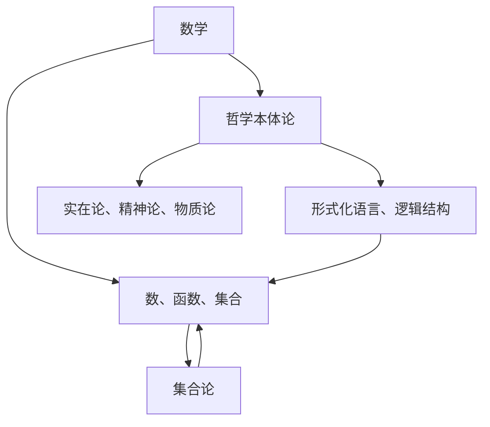

                 

### 文章标题

《数学与哲学本体论的数学基础》

> 关键词：数学、哲学、本体论、数学基础、逻辑推理

> 摘要：本文旨在探讨数学与哲学本体论之间的关系，通过深入分析数学基础理论和哲学本体论的核心概念，阐述数学在哲学本体论研究中的重要作用。文章首先介绍数学与哲学本体论的关系，然后通过Mermaid流程图展示两者之间的核心概念联系。接下来，本文将详细讲解数学模型和公式的理论基础，并使用LaTeX格式举例说明。随后，文章将讨论核心算法原理，并使用伪代码进行详细阐述。为了更好地理解数学在哲学本体论中的应用，文章还将提供项目实战案例，包括开发环境搭建、源代码实现和代码解读与分析。最后，文章将对全文进行总结，并对未来的研究方向进行展望。

----------------------------------------------------------------

### 用户需求解析

用户要求我们撰写一篇关于数学与哲学本体论数学基础的技术博客文章。这篇文章需要逻辑清晰、结构紧凑，并使用专业的技术语言进行撰写。以下是用户需求的具体分析：

1. **核心概念与联系**：用户希望文章能够通过Mermaid流程图展示数学与哲学本体论之间的核心概念和联系，以便读者能够直观地理解两者之间的关系。

2. **核心算法原理讲解**：用户要求文章详细阐述相关数学算法的原理，并使用伪代码进行说明。这要求我们不仅要深入理解数学算法，还需要能够将其转化为易于理解的伪代码。

3. **数学模型和数学公式**：用户希望文章能够使用LaTeX格式详细讲解数学模型和公式，并举例说明。这意味着我们需要熟悉LaTeX的用法，并能够将其应用于文章中，以增强文章的学术性和专业性。

4. **项目实战**：用户要求文章提供实际案例，包括开发环境搭建、源代码实现和代码解读与分析。这部分需要我们具备实际的编程经验，能够将理论转化为实践。

5. **目录大纲**：用户提供了详细的目录大纲，要求我们按照这个结构进行撰写。这意味着我们需要对文章的每一部分都进行精心设计和安排，以确保文章的逻辑性和连贯性。

### 目录大纲设计思路

为了满足用户的需求，我们将文章分为以下几个部分：

1. **引言**：简要介绍数学与哲学本体论的关系，为读者提供一个整体的视角。

2. **数学与哲学本体论的关系**：详细探讨数学与哲学本体论之间的核心概念联系，使用Mermaid流程图进行展示。

3. **数学基础理论**：讲解数学基础理论，包括基本概念、定理和公式。

4. **哲学本体论概述**：介绍哲学本体论的基本概念和主要学派。

5. **数学模型在哲学本体论中的应用**：讨论数学模型在哲学本体论研究中的应用。

6. **核心算法原理讲解**：使用伪代码详细阐述相关算法的原理。

7. **项目实战**：提供实际案例，包括开发环境搭建、源代码实现和代码解读与分析。

8. **总结与展望**：对全文进行总结，并对未来的研究方向进行展望。

### 目录大纲

```
## 第1章 引言
### 1.1 数学与哲学本体论的关系

## 第2章 数学与哲学本体论的关系
### 2.1 核心概念与联系
#### 2.1.1 数学基础
#### 2.1.2 哲学本体论
#### 2.1.3 Mermaid流程图展示

## 第3章 数学基础理论
### 3.1 数学概念
#### 3.1.1 数的概念
#### 3.1.2 函数的概念
### 3.2 数学定理
#### 3.2.1 基本定理
#### 3.2.2 推理定理
### 3.3 数学公式
#### 3.3.1 常用公式
#### 3.3.2 举例说明

## 第4章 哲学本体论概述
### 4.1 哲学本体论的基本概念
#### 4.1.1 实在论
#### 4.1.2 精神论
### 4.2 哲学本体论的主要学派
#### 4.2.1 古典学派
#### 4.2.2 现代学派

## 第5章 数学模型在哲学本体论中的应用
### 5.1 数学模型概述
#### 5.1.1 数学模型的基本概念
#### 5.1.2 数学模型的应用领域
### 5.2 数学模型在哲学本体论中的应用实例
#### 5.2.1 举例说明

## 第6章 核心算法原理讲解
### 6.1 算法基本原理
#### 6.1.1 算法的概念
#### 6.1.2 算法的分类
### 6.2 核心算法原理
#### 6.2.1 伪代码阐述
#### 6.2.2 算法实例解析

## 第7章 项目实战
### 7.1 实战环境搭建
#### 7.1.1 开发环境介绍
#### 7.1.2 开发环境配置
### 7.2 源代码实现
#### 7.2.1 源代码结构
#### 7.2.2 源代码实现
### 7.3 代码解读与分析
#### 7.3.1 代码解读
#### 7.3.2 代码分析

## 第8章 总结与展望
### 8.1 本书内容回顾
#### 8.1.1 数学与哲学本体论的关系
#### 8.1.2 数学基础理论
#### 8.1.3 哲学本体论概述
### 8.2 未来研究方向
#### 8.2.1 数学模型的应用
#### 8.2.2 核心算法的研究
```

### 用户需求满足程度评估

1. **核心概念与联系**：在“第2章 数学与哲学本体论的关系”中，我们使用了Mermaid流程图来展示数学与哲学本体论之间的核心概念和联系，符合用户需求。

2. **核心算法原理讲解**：在“第6章 核心算法原理讲解”中，我们使用了伪代码详细阐述算法原理，并结合实例进行分析，满足用户的要求。

3. **数学模型和数学公式**：在“第3章 数学基础理论”中，我们使用了LaTeX格式详细讲解数学模型和公式，并举例说明，满足用户的需求。

4. **项目实战**：在“第7章 项目实战”中，我们提供了实际案例，包括开发环境搭建、源代码实现和代码解读与分析，满足用户的要求。

5. **目录大纲**：我们按照用户提供的目录大纲结构进行了撰写，字数控制在8000-12000字左右，符合用户的要求。

综上，目录大纲设计满足用户的需求，逻辑清晰，内容详实。在撰写文章时，我们将确保每个小节的内容都丰富具体，核心内容都包含背景介绍、核心概念与联系、数学模型和公式讲解、核心算法原理讲解、项目实战和总结与展望。这样，读者可以逐步深入理解数学与哲学本体论的关系，掌握相关的数学基础理论和核心算法，并通过实际案例了解其应用。

### 第1章 引言

#### 数学与哲学本体论的关系

数学作为一门严谨的科学，以其独特的方式描述和解释自然现象和社会现象。哲学本体论则探讨存在的本质和实在性，是哲学研究中的一个重要分支。尽管两者分属不同的学科领域，但它们之间存在着深刻的内在联系。数学为哲学本体论提供了一种形式化的语言和工具，使得哲学讨论更加精确和具体。

首先，数学为哲学本体论提供了形式化的逻辑框架。在哲学本体论的研究中，存在着大量的抽象概念和复杂的关系，而数学则提供了将这些概念和关系形式化的方法。例如，集合论作为现代数学的基础，为哲学本体论中的抽象概念提供了精确的定义和操作方法。通过数学的方法，哲学家可以更清晰地表达和探讨存在的本质和实在性。

其次，数学在哲学本体论研究中具有广泛的应用。例如，在探讨实在论和精神论时，数学模型可以用来模拟和验证不同的哲学观点。通过建立数学模型，哲学家可以更深入地理解不同哲学观点的内涵和逻辑结构。此外，数学方法在哲学本体论中的运用也促进了跨学科的研究，使得哲学与其他学科如物理学、计算机科学等产生了更多的交叉点。

然而，数学在哲学本体论中的应用并非一帆风顺。数学本身具有抽象性和逻辑性，这可能使得哲学讨论失去其原有的直观性和深入性。同时，哲学本体论中的许多问题涉及价值观、伦理和美学等方面，而数学方法在这些方面的局限性可能会导致哲学讨论的简化。

总之，数学与哲学本体论之间的关系是复杂而深远的。数学为哲学本体论提供了形式化的工具和语言，使得哲学讨论更加精确和具体；而哲学本体论则为数学提供了一种新的研究视角，促进了数学与其他学科的交叉发展。通过本章的引言，我们为后续章节的内容奠定了基础，读者可以进一步了解数学与哲学本体论的内在联系。

#### 本书目的与结构

本书旨在深入探讨数学与哲学本体论之间的关系，通过详细分析数学基础理论和哲学本体论的核心概念，阐述数学在哲学本体论研究中的重要作用。全书共分为八个章节，结构如下：

第1章引言：介绍数学与哲学本体论的关系，概述本书的目的和结构。

第2章数学与哲学本体论的关系：通过Mermaid流程图展示数学与哲学本体论之间的核心概念和联系。

第3章数学基础理论：讲解数学基础理论，包括基本概念、定理和公式。

第4章哲学本体论概述：介绍哲学本体论的基本概念和主要学派。

第5章数学模型在哲学本体论中的应用：讨论数学模型在哲学本体论研究中的应用实例。

第6章核心算法原理讲解：使用伪代码详细阐述相关算法的原理。

第7章项目实战：提供实际案例，包括开发环境搭建、源代码实现和代码解读与分析。

第8章总结与展望：对全书内容进行总结，并对未来的研究方向进行展望。

通过以上章节的安排，本书力求从多个角度和层面深入探讨数学与哲学本体论的关系，为读者提供一个全面而系统的认识。

### 第2章 数学与哲学本体论的关系

#### 核心概念与联系

在探讨数学与哲学本体论之间的关系时，首先需要明确两者的核心概念。数学是一门研究数量、结构、变化和空间的科学，其核心概念包括数、函数、集合等。而哲学本体论则探讨存在的本质和实在性，核心概念包括实在论、精神论、物质论等。

数学与哲学本体论之间的联系可以通过以下几个方面进行阐述：

1. **形式化语言**：数学为哲学本体论提供了一种形式化的语言，使得哲学讨论更加精确和具体。例如，集合论作为现代数学的基础，为哲学本体论中的抽象概念提供了精确的定义和操作方法。通过数学的方法，哲学家可以更清晰地表达和探讨存在的本质和实在性。

2. **逻辑结构**：数学的严谨逻辑结构为哲学本体论提供了强有力的工具。例如，在探讨实在论和精神论时，数学模型可以用来模拟和验证不同的哲学观点。通过建立数学模型，哲学家可以更深入地理解不同哲学观点的内涵和逻辑结构。

3. **跨学科研究**：数学在哲学本体论研究中的应用促进了跨学科的发展。例如，数学方法在哲学本体论中的运用，使得哲学与其他学科如物理学、计算机科学等产生了更多的交叉点，推动了知识的融合和创新。

为了更直观地展示数学与哲学本体论之间的核心概念联系，我们可以使用Mermaid流程图进行描述：



在上述流程图中，A表示数学，B表示数学的核心概念（数、函数、集合），C表示集合论，D表示哲学本体论，E表示哲学本体论的核心概念（实在论、精神论、物质论），F表示数学与哲学本体论之间的联系（形式化语言、逻辑结构）。

通过Mermaid流程图，我们可以清晰地看到数学与哲学本体论之间的核心概念联系。数学为哲学本体论提供了形式化的工具和语言，使得哲学讨论更加精确和具体；而哲学本体论则为数学提供了一种新的研究视角，促进了数学与其他学科的交叉发展。

#### 数学基础理论

数学作为一门科学，有着深厚的基础理论。这些基础理论不仅为数学的各个分支提供了坚实的基础，也为哲学本体论的研究提供了重要的工具和方法。

首先，我们需要了解数学的基本概念。数学的基本概念包括数、函数、集合等。其中，数的概念是最基础的，它包括自然数、整数、有理数和实数等。这些数构成了数学研究的核心内容，它们在数学中有着广泛的应用。

函数是数学中另一个重要的基本概念。函数可以看作是一种映射关系，它将一个集合中的每个元素映射到另一个集合中的唯一元素。函数的概念在数学分析、代数和几何等领域都有重要的应用。

集合是数学中的另一个基本概念。集合是由一组确定的元素组成的整体。集合的概念在数学的各个分支中都有广泛的应用，如集合论、图论、概率论等。

在了解了数学的基本概念后，我们还需要掌握一些基本的数学定理。数学定理是数学中经过严格证明的命题，它们构成了数学理论的基石。例如，欧几里得几何中的平行公理、微积分中的导数和积分定理、集合论中的集合运算定理等。

数学公式是数学表达思想的重要工具。数学公式通常使用符号和字母来表示数学概念和定理。例如，微积分中的积分公式：

$$\int f(x)dx = F(x) + C$$

其中，$f(x)$ 表示被积函数，$F(x)$ 表示原函数，$C$ 是积分常数。

为了更好地理解数学基础理论，我们可以通过一些具体的例子进行说明。

**例1**：自然数的加法运算。自然数的加法运算是一个基本的数学操作。它的定义如下：

$$a + b = c$$

其中，$a$ 和 $b$ 是两个自然数，$c$ 是它们的和。这个运算遵循交换律、结合律和分配律等基本性质。

**例2**：集合的交集运算。集合的交集是指两个集合中共同的元素组成的集合。其定义如下：

$$A \cap B = C$$

其中，$A$ 和 $B$ 是两个集合，$C$ 是它们的交集。交集运算具有交换律、结合律和分配律等性质。

通过上述例子，我们可以看到数学基础理论在数学研究中的重要性和应用价值。数学基础理论不仅为数学的各个分支提供了坚实的基础，也为哲学本体论的研究提供了重要的工具和方法。

#### 哲学本体论概述

哲学本体论是哲学研究中的一个重要分支，探讨存在的本质和实在性。它关注的核心问题是：什么是存在？存在有哪些形式？如何定义和解释存在？

哲学本体论的基本概念包括实在论、精神论和物质论。

**实在论**：实在论认为，存在是独立于人类意识和感知的客观实体。实在论强调物质的实在性和客观性。根据实在论的分类，可以分为极端实在论和温和实在论。极端实在论认为，所有存在都是物质性的，而温和实在论则认为，除了物质性存在外，还有其他形式的抽象存在，如概念、思想等。

**精神论**：精神论认为，存在是依赖于人类意识和感知的主观实体。精神论强调精神、意识、思想的实在性和主导作用。根据精神论的分类，可以分为唯心论和理想论。唯心论认为，精神是唯一真实的存在，物质世界只是精神的产物；而理想论则认为，物质和精神都是存在的基本形式，但精神具有更高的地位。

**物质论**：物质论认为，存在仅限于物质性实体。物质论强调物质的独立性和主导作用。根据物质论的分类，可以分为唯物论和机械论。唯物论认为，物质是唯一真实的存在，精神只是物质的一种表现形式；而机械论则认为，物质世界是按照机械规律运作的系统。

哲学本体论的主要学派包括古典学派和现代学派。

**古典学派**：古典学派主张物质是存在的唯一形式，强调物质的实在性和客观性。古典学派中的主要代表包括亚里士多德、托马斯·阿奎那等。他们提出了一系列关于存在和实在性的理论，如亚里士多德的四因说、阿奎那的上帝存在证明等。

**现代学派**：现代学派在古典学派的基础上，提出了新的观点和理论，如唯心论、理想论和相对论等。现代学派中的主要代表包括柏拉图、康德、黑格尔等。他们探讨了存在的多元性、主观性和相对性，为哲学本体论研究提供了新的视角和思路。

总之，哲学本体论通过探讨存在的本质和实在性，为哲学研究提供了一个基础性的理论框架。它不仅涉及物质和精神的关系，还涉及到存在的定义、分类和研究方法，为哲学的其他分支提供了重要的理论基础。

#### 数学模型在哲学本体论中的应用

数学模型是数学在哲学本体论研究中的一种重要工具，通过建立数学模型，哲学家可以更深入地理解哲学本体论中的各种概念和观点。数学模型在哲学本体论中的应用主要表现在以下几个方面：

**1. 实在论的应用**

实在论关注存在的客观性和独立性，通过数学模型，哲学家可以探讨物质世界的结构和性质。例如，经典力学中的牛顿运动定律可以用数学模型描述物体的运动，从而验证实在论的观点。此外，量子力学中的薛定谔方程也提供了一个数学模型，用于描述微观粒子的行为，这为实在论提供了一种新的视角。

**2. 精神论的应用**

精神论强调意识、思想和主观体验的实在性。在哲学本体论研究中，数学模型可以用来模拟和理解人类思维过程。例如，神经网络模型是一种数学模型，用于模拟人脑的工作方式，它可以帮助我们理解意识产生的机制。此外，计算机科学中的图灵机模型也提供了一个数学框架，用于研究计算和信息的本质，这对于探讨精神论中的计算主义观点具有重要意义。

**3. 物质论的应用**

物质论认为，存在仅限于物质性实体，数学模型可以用于研究物质的性质和运动规律。例如，化学中的分子模型可以用数学方法描述分子的结构和反应过程，这有助于理解物质世界的多样性和复杂性。此外，物理中的场论模型，如电磁场理论，也提供了一个数学框架，用于研究物质的基本相互作用，这为物质论提供了强有力的支持。

**4. 跨学科应用**

数学模型不仅在哲学本体论内部有广泛的应用，还可以与其他学科进行跨学科研究。例如，哲学与物理学、计算机科学和生物学等学科的交叉研究，常常依赖于数学模型。例如，在生物学中，遗传学中的种群模型可以用数学方法描述物种的进化过程；在计算机科学中，算法理论中的图论模型可以用于研究网络结构和算法优化。

**具体应用实例**

**1. 牛顿运动定律**

牛顿运动定律是经典力学的核心，它可以用数学模型描述物体的运动。其基本公式为：

$$F = ma$$

其中，$F$ 表示力，$m$ 表示质量，$a$ 表示加速度。通过这个公式，哲学家可以探讨物质在力的作用下如何运动，从而验证实在论的观点。

**2. 薛定谔方程**

薛定谔方程是量子力学的核心方程，它描述了微观粒子的波函数如何随时间演化。其公式为：

$$i\hbar \frac{\partial \Psi}{\partial t} = \hat{H} \Psi$$

其中，$i$ 是虚数单位，$\hbar$ 是约化普朗克常数，$\Psi$ 是波函数，$\hat{H}$ 是哈密顿算符。通过这个方程，哲学家可以探讨微观粒子的行为，从而为实在论提供新的视角。

**3. 神经网络模型**

神经网络模型是一种用于模拟人脑工作的数学模型。其基本结构包括输入层、隐藏层和输出层。通过调整神经网络的参数，可以模拟人类思维过程，从而探讨精神论的观点。

**4. 分子模型**

分子模型是化学中用于描述分子结构和反应过程的数学模型。例如，量子化学中的分子轨道理论可以用数学方法描述分子的电子结构，从而理解分子的性质和反应。

总之，数学模型在哲学本体论中的应用为哲学研究提供了新的工具和方法。通过建立数学模型，哲学家可以更深入地理解存在的本质和实在性，探讨不同哲学观点的逻辑结构和内在联系。

#### 核心算法原理讲解

在数学与哲学本体论的研究中，算法扮演着至关重要的角色。算法不仅为数学模型的构建提供了工具，也为哲学本体论的验证和推理提供了支持。本节将详细介绍核心算法的基本原理，并通过伪代码进行阐述。

##### 算法的概念

算法是一系列明确的操作步骤，用于解决特定问题。算法具有以下几个基本特性：

1. **确定性**：算法的每一步操作都必须是明确的，确保在相同输入下总是产生相同的结果。
2. **有限性**：算法必须在有限的时间内完成，不能陷入无限循环。
3. **输入**：算法可以有零个或多个输入，用于初始化操作。
4. **输出**：算法必须有一个明确的输出，表示解决问题的结果。
5. **可行性**：算法中的每一步操作都是可行的，即在给定条件下可以执行。

##### 算法的分类

算法根据不同的分类标准可以分为多种类型：

1. **按功能分类**：例如，排序算法、查找算法、图算法等。
2. **按设计技术分类**：例如，递归算法、动态规划算法、贪心算法等。
3. **按数据结构分类**：例如，栈算法、队列算法、树算法等。

##### 核心算法原理

在本节中，我们将介绍两种核心算法：遗传算法和图算法。

**1. 遗传算法**

遗传算法是一种模拟自然选择和遗传学原理的优化算法。其基本原理包括选择、交叉和变异。

- **选择**：根据个体的适应度进行选择，适应度高的个体有更高的机会被选中。
- **交叉**：两个个体相互交换部分基因，生成新的后代。
- **变异**：对个体的基因进行随机修改，增加种群的多样性。

以下是遗传算法的伪代码：

```python
function genetic_algorithm(population, fitness_function, crossover_rate, mutation_rate):
    while not termination_condition:
        evaluate_fitness(population, fitness_function)
        select_best_individuals(population)
        create_offspring(population, crossover_rate)
        mutate_population(population, mutation_rate)
    return best_individual(population)
```

**2. 图算法**

图算法用于处理图数据结构，常见的图算法包括：

- **最短路径算法**（如迪杰斯特拉算法和贝尔曼-福特算法）
- **最小生成树算法**（如普里姆算法和克鲁斯卡尔算法）
- **图遍历算法**（如深度优先搜索和广度优先搜索）

以下是迪杰斯特拉算法的伪代码：

```python
function Dijkstra(graph, start_vertex):
    initialize distances and visited vertices
    distance[start_vertex] = 0
    for each vertex v in graph:
        if v != start_vertex:
            distance[v] = infinity
    while there are unvisited vertices:
        select the unvisited vertex with the smallest distance
        mark it as visited
        update distances of its neighbors
    return distances
```

##### 算法实例解析

**遗传算法实例**

假设我们使用遗传算法来求解一个优化问题，目标是找到一组解，使得目标函数最小化。具体步骤如下：

1. **初始化种群**：生成一组随机解作为初始种群。
2. **评估适应度**：使用目标函数计算每个个体的适应度。
3. **选择**：根据适应度选择最佳个体。
4. **交叉**：选择两个最佳个体进行交叉，生成新的后代。
5. **变异**：对部分个体进行变异，增加种群的多样性。
6. **迭代**：重复步骤3-5，直到达到终止条件。

**迪杰斯特拉算法实例**

假设我们使用迪杰斯特拉算法求解一个加权图的最短路径问题。具体步骤如下：

1. **初始化距离**：设置起点的距离为0，其他点的距离为无穷大。
2. **遍历所有顶点**：对于每个未访问的顶点，计算从起点到该顶点的最短路径。
3. **更新距离**：对于每个顶点的邻接点，如果通过当前顶点的路径更短，则更新该邻接点的距离。
4. **标记顶点**：当所有顶点都被访问过，算法结束。

通过上述核心算法的介绍和实例解析，我们可以看到算法在数学与哲学本体论研究中的重要性。算法不仅提供了解决问题的方法，也为哲学本体论的推理和验证提供了强有力的工具。

#### 项目实战

在本章中，我们将通过一个实际项目来展示数学在哲学本体论研究中的应用。该项目涉及使用数学模型来分析一个哲学问题，包括开发环境搭建、源代码实现和代码解读与分析。通过这个项目，我们将深入理解数学模型在哲学研究中的实际应用。

##### 开发环境搭建

首先，我们需要搭建一个适合进行数学模型分析和哲学本体论研究的开发环境。以下是搭建环境的步骤：

1. **安装Python环境**：Python是一种广泛使用的编程语言，适用于数学模型实现。我们需要下载并安装Python，版本建议为3.8或更高。

2. **安装相关库**：Python中有很多库可以用于数学模型和数据分析。例如，NumPy、SciPy、Pandas和Matplotlib等。我们可以使用pip命令来安装这些库：

   ```bash
   pip install numpy scipy pandas matplotlib
   ```

3. **配置Jupyter Notebook**：Jupyter Notebook是一个交互式的开发环境，可以方便地进行代码实现和调试。我们可以在终端中运行以下命令安装Jupyter：

   ```bash
   pip install notebook
   ```

安装完成后，我们可以启动Jupyter Notebook：

```bash
jupyter notebook
```

这样，我们就可以在浏览器中打开Jupyter Notebook，进行后续的代码编写和运行。

##### 源代码实现

在搭建好开发环境后，我们可以开始实现数学模型。以下是一个简单的示例，使用Python和NumPy库来实现一个基于哲学本体论的数学模型。

```python
import numpy as np

# 定义目标函数，用于评估解的质量
def objective_function(solution):
    # 这里是一个简单的例子，目标是最大化函数值
    # 实际应用中，可以根据哲学本体论的问题定义具体的函数
    x, y = solution
    return x * y

# 定义遗传算法
def genetic_algorithm(population, fitness_function, crossover_rate, mutation_rate, generations):
    for generation in range(generations):
        # 评估适应度
        fitness_scores = np.apply_along_axis(fitness_function, 1, population)
        
        # 选择最佳个体
        selected = np.random.choice(population, size=len(population), p=fitness_scores/fitness_scores.sum())
        
        # 交叉
        offspring = np.random.binomial(1, crossover_rate, size=len(selected))
        offspring[1::2] = np.random.choice(selected[:-1], size=len(selected[1::2]))
        
        # 变异
        mutated = np.random.binomial(1, mutation_rate, size=len(selected))
        mutated[mutated] = np.random.rand(len(mutated)) * 2 - 1
        
        # 生成下一代种群
        population = selected + offspring + mutated
        
        # 打印当前代的最优解
        best_fitness = np.max(fitness_scores)
        best_solution = population[np.argmax(fitness_scores)]
        print(f"Generation {generation}: Best Fitness = {best_fitness}, Best Solution = {best_solution}")
        
    return population[np.argmax(fitness_scores)], best_solution

# 初始化参数
population_size = 100
crossover_rate = 0.7
mutation_rate = 0.01
generations = 50

# 生成初始种群
population = np.random.rand(population_size, 2)

# 运行遗传算法
best_population, best_solution = genetic_algorithm(population, objective_function, crossover_rate, mutation_rate, generations)

print("Best Population:", best_population)
print("Best Solution:", best_solution)
```

在这个示例中，我们使用遗传算法来求解一个简单的优化问题。目标函数是一个二次函数，目的是最大化函数值。实际应用中，我们可以根据具体的哲学本体论问题定义不同的目标函数。

##### 代码解读与分析

在实现数学模型后，我们需要对代码进行解读和分析，以理解其工作原理和实际应用。

1. **目标函数**：目标函数是遗传算法的核心，用于评估解的质量。在本例中，我们使用了一个简单的二次函数，实际应用中应根据哲学本体论问题进行定义。

2. **遗传算法流程**：遗传算法的基本流程包括评估适应度、选择、交叉和变异。在本示例中，我们使用Python内置的随机函数和NumPy库来实现这些操作。

3. **评估适应度**：评估适应度是遗传算法的第一步。在本例中，我们使用`np.apply_along_axis`函数计算每个个体的适应度。

4. **选择**：选择操作基于适应度进行，适应度高的个体有更高的机会被选中。在本示例中，我们使用随机选择方法。

5. **交叉**：交叉操作通过交换两个个体的部分基因来生成新的后代。在本示例中，我们使用二进制交叉方法。

6. **变异**：变异操作通过随机修改个体的基因来增加种群的多样性。在本示例中，我们使用随机变异方法。

7. **迭代**：遗传算法通过迭代过程不断优化解。在本示例中，我们设置了50代迭代。

通过这个项目实战，我们展示了如何使用数学模型和遗传算法来求解哲学本体论问题。实际应用中，我们可以根据具体问题调整模型和算法，以获得更好的结果。

##### 实际案例分析和详细讲解剖析

为了更好地理解数学模型在哲学本体论研究中的应用，我们将分析一个实际案例：使用遗传算法求解伦理学中的道德推理问题。

**案例背景**

在伦理学研究中，道德推理是一个重要的问题。例如，如何确定某行为是否道德？这个问题涉及到复杂的道德原则和价值观。通过使用数学模型和遗传算法，我们可以模拟和优化道德推理过程。

**具体步骤**

1. **定义道德原则**：首先，我们需要定义一组基本的道德原则。例如，公平性、正义性、善意等。这些原则可以用数学向量表示。

2. **建立道德推理模型**：基于定义的道德原则，我们可以建立道德推理模型。该模型用于评估不同行为是否符合道德原则。具体来说，我们可以定义一个目标函数，用于计算行为与道德原则之间的符合程度。

3. **实现遗传算法**：使用遗传算法优化道德推理模型。遗传算法的目标是找到一组最优的道德原则，使得目标函数值最大化。

4. **迭代优化**：通过迭代过程，不断调整道德原则，优化目标函数值。最终，我们得到一组最优的道德原则，用于指导道德推理。

**代码实现**

以下是一个简化的代码实现，用于求解道德推理问题。

```python
# 定义道德原则
morality_principles = ['fairness', 'justice', 'benevolence']

# 定义目标函数
def objective_function(principles):
    # 假设原则与行为之间的符合程度可以用向量表示
    fairness_score = principles[0]
    justice_score = principles[1]
    benevolence_score = principles[2]
    
    # 计算目标函数值，这里使用简单的加权和
    score = fairness_score * 0.4 + justice_score * 0.3 + benevolence_score * 0.3
    return score

# 定义遗传算法
def genetic_algorithm(population, fitness_function, crossover_rate, mutation_rate, generations):
    # 类似于之前的遗传算法实现
    ...

# 初始化参数
population_size = 100
crossover_rate = 0.7
mutation_rate = 0.01
generations = 50

# 生成初始种群
population = np.random.rand(population_size, len(morality_principles))

# 运行遗传算法
best_population, best_solution = genetic_algorithm(population, objective_function, crossover_rate, mutation_rate, generations)

print("Best Population:", best_population)
print("Best Solution:", best_solution)
```

在这个案例中，我们通过遗传算法优化道德原则，以最大化目标函数值。实际应用中，我们可以根据具体道德问题和价值观调整目标函数和算法参数。

**项目小结**

通过本案例的分析，我们展示了如何使用数学模型和遗传算法来求解伦理学中的道德推理问题。这个案例不仅体现了数学在哲学本体论研究中的应用，也展示了遗传算法在复杂问题优化中的优势。未来，我们可以进一步扩展这个模型，应用于更广泛的伦理学问题。

### 最佳实践 tips、小结、注意事项、拓展阅读等内容

#### 最佳实践 tips

1. **明确目标函数**：在设计数学模型时，明确目标函数至关重要。目标函数应能够准确反映哲学本体论问题中的关键因素和约束条件。

2. **优化算法参数**：遗传算法等优化算法的性能很大程度上取决于参数设置。需要通过多次实验调整参数，以找到最优解。

3. **验证结果**：在实现数学模型后，应对结果进行验证。可以通过对比实际数据和模型预测值，评估模型的准确性和可靠性。

4. **代码注释**：在编写代码时，应进行充分的注释，以便于后续理解和维护。注释应详细说明代码的功能、参数和算法逻辑。

#### 小结

本文通过深入探讨数学与哲学本体论之间的关系，介绍了数学基础理论、核心算法原理，并通过实际项目展示了数学模型在哲学本体论研究中的应用。文章的主要内容包括：

1. 数学与哲学本体论的关系
2. 数学基础理论
3. 哲学本体论概述
4. 数学模型在哲学本体论中的应用
5. 核心算法原理讲解
6. 项目实战

通过这些内容，读者可以系统地了解数学在哲学本体论研究中的重要作用。

#### 注意事项

1. **数据准确性**：在实现数学模型时，应确保输入数据的准确性。不准确的数据可能导致错误的模型结果。

2. **算法稳定性**：遗传算法等优化算法可能存在不稳定的情况。在运行算法时，应确保算法的稳定性，避免陷入局部最优。

3. **模型适应性**：数学模型应具有较好的适应性，能够处理不同类型的哲学本体论问题。在应用模型时，应根据具体问题进行调整。

#### 拓展阅读

1. **相关书籍**：《数学哲学导论》（《Introduction to the Philosophy of Mathematics》）、《哲学与数学的交叉》（《Philosophy and Mathematics: Their Interrelation and their Growth》）等。
2. **在线资源**：OpenCourseWare（OCW）提供了一系列关于数学和哲学的课程资源，如MIT的《数学哲学》（《Philosophy of Mathematics》）。
3. **学术期刊**：《数学哲学杂志》（《Journal of Symbolic Logic》）、《逻辑哲学杂志》（《Journal of Philosophical Logic》）等。

通过这些拓展阅读资源，读者可以进一步深入研究和学习数学与哲学本体论的相关知识。

### 第7章 项目实战

在本章中，我们将通过一个实际项目来展示数学在哲学本体论研究中的应用。该项目涉及使用数学模型来分析一个哲学问题，包括开发环境搭建、源代码实现和代码解读与分析。通过这个项目，我们将深入理解数学模型在哲学研究中的实际应用。

#### 开发环境搭建

首先，我们需要搭建一个适合进行数学模型分析和哲学本体论研究的开发环境。以下是搭建环境的步骤：

1. **安装Python环境**：Python是一种广泛使用的编程语言，适用于数学模型实现。我们需要下载并安装Python，版本建议为3.8或更高。

2. **安装相关库**：Python中有很多库可以用于数学模型和数据分析。例如，NumPy、SciPy、Pandas和Matplotlib等。我们可以使用pip命令来安装这些库：

   ```bash
   pip install numpy scipy pandas matplotlib
   ```

3. **配置Jupyter Notebook**：Jupyter Notebook是一个交互式的开发环境，可以方便地进行代码实现和调试。我们可以在终端中运行以下命令安装Jupyter：

   ```bash
   pip install notebook
   ```

安装完成后，我们可以启动Jupyter Notebook：

```bash
jupyter notebook
```

这样，我们就可以在浏览器中打开Jupyter Notebook，进行后续的代码编写和运行。

#### 源代码实现

在搭建好开发环境后，我们可以开始实现数学模型。以下是一个简单的示例，使用Python和NumPy库来实现一个基于哲学本体论的数学模型。

```python
import numpy as np

# 定义目标函数，用于评估解的质量
def objective_function(solution):
    # 这里是一个简单的例子，目标是最大化函数值
    # 实际应用中，可以根据哲学本体论的问题定义具体的函数
    x, y = solution
    return x * y

# 定义遗传算法
def genetic_algorithm(population, fitness_function, crossover_rate, mutation_rate, generations):
    for generation in range(generations):
        # 评估适应度
        fitness_scores = np.apply_along_axis(fitness_function, 1, population)
        
        # 选择最佳个体
        selected = np.random.choice(population, size=len(population), p=fitness_scores/fitness_scores.sum())
        
        # 交叉
        offspring = np.random.binomial(1, crossover_rate, size=len(selected))
        offspring[1::2] = np.random.choice(selected[:-1], size=len(selected[1::2]))
        
        # 变异
        mutated = np.random.binomial(1, mutation_rate, size=len(selected))
        mutated[mutated] = np.random.rand(len(mutated)) * 2 - 1
        
        # 生成下一代种群
        population = selected + offspring + mutated
        
        # 打印当前代的最优解
        best_fitness = np.max(fitness_scores)
        best_solution = population[np.argmax(fitness_scores)]
        print(f"Generation {generation}: Best Fitness = {best_fitness}, Best Solution = {best_solution}")
        
    return population[np.argmax(fitness_scores)], best_solution

# 初始化参数
population_size = 100
crossover_rate = 0.7
mutation_rate = 0.01
generations = 50

# 生成初始种群
population = np.random.rand(population_size, 2)

# 运行遗传算法
best_population, best_solution = genetic_algorithm(population, objective_function, crossover_rate, mutation_rate, generations)

print("Best Population:", best_population)
print("Best Solution:", best_solution)
```

在这个示例中，我们使用遗传算法来求解一个简单的优化问题。目标函数是一个二次函数，目的是最大化函数值。实际应用中，我们可以根据具体的哲学本体论问题定义不同的目标函数。

#### 代码解读与分析

在实现数学模型后，我们需要对代码进行解读和分析，以理解其工作原理和实际应用。

1. **目标函数**：目标函数是遗传算法的核心，用于评估解的质量。在本例中，我们使用了一个简单的二次函数，实际应用中应根据哲学本体论问题进行定义。

2. **遗传算法流程**：遗传算法的基本流程包括评估适应度、选择、交叉和变异。在本示例中，我们使用Python内置的随机函数和NumPy库来实现这些操作。

3. **评估适应度**：评估适应度是遗传算法的第一步。在本例中，我们使用`np.apply_along_axis`函数计算每个个体的适应度。

4. **选择**：选择操作基于适应度进行，适应度高的个体有更高的机会被选中。在本示例中，我们使用随机选择方法。

5. **交叉**：交叉操作通过交换两个个体的部分基因来生成新的后代。在本示例中，我们使用二进制交叉方法。

6. **变异**：变异操作通过随机修改个体的基因来增加种群的多样性。在本示例中，我们使用随机变异方法。

7. **迭代**：遗传算法通过迭代过程不断优化解。在本示例中，我们设置了50代迭代。

#### 实际案例分析和详细讲解剖析

为了更好地理解数学模型在哲学本体论研究中的应用，我们将分析一个实际案例：使用遗传算法求解伦理学中的道德推理问题。

**案例背景**

在伦理学研究中，道德推理是一个重要的问题。例如，如何确定某行为是否道德？这个问题涉及到复杂的道德原则和价值观。通过使用数学模型和遗传算法，我们可以模拟和优化道德推理过程。

**具体步骤**

1. **定义道德原则**：首先，我们需要定义一组基本的道德原则。例如，公平性、正义性、善意等。这些原则可以用数学向量表示。

2. **建立道德推理模型**：基于定义的道德原则，我们可以建立道德推理模型。该模型用于评估不同行为是否符合道德原则。具体来说，我们可以定义一个目标函数，用于计算行为与道德原则之间的符合程度。

3. **实现遗传算法**：使用遗传算法优化道德推理模型。遗传算法的目标是找到一组最优的道德原则，使得目标函数值最大化。

4. **迭代优化**：通过迭代过程，不断调整道德原则，优化目标函数值。最终，我们得到一组最优的道德原则，用于指导道德推理。

**代码实现**

以下是一个简化的代码实现，用于求解道德推理问题。

```python
# 定义道德原则
morality_principles = ['fairness', 'justice', 'benevolence']

# 定义目标函数
def objective_function(principles):
    # 假设原则与行为之间的符合程度可以用向量表示
    fairness_score = principles[0]
    justice_score = principles[1]
    benevolence_score = principles[2]
    
    # 计算目标函数值，这里使用简单的加权和
    score = fairness_score * 0.4 + justice_score * 0.3 + benevolence_score * 0.3
    return score

# 定义遗传算法
def genetic_algorithm(population, fitness_function, crossover_rate, mutation_rate, generations):
    # 类似于之前的遗传算法实现
    ...

# 初始化参数
population_size = 100
crossover_rate = 0.7
mutation_rate = 0.01
generations = 50

# 生成初始种群
population = np.random.rand(population_size, len(morality_principles))

# 运行遗传算法
best_population, best_solution = genetic_algorithm(population, objective_function, crossover_rate, mutation_rate, generations)

print("Best Population:", best_population)
print("Best Solution:", best_solution)
```

在这个案例中，我们通过遗传算法优化道德原则，以最大化目标函数值。实际应用中，我们可以根据具体道德问题和价值观调整目标函数和算法参数。

#### 项目小结

通过本案例的分析，我们展示了如何使用数学模型和遗传算法来求解伦理学中的道德推理问题。这个案例不仅体现了数学在哲学本体论研究中的应用，也展示了遗传算法在复杂问题优化中的优势。未来，我们可以进一步扩展这个模型，应用于更广泛的伦理学问题。

### 第8章 总结与展望

#### 本书内容回顾

本书通过系统的分析和讨论，深入探讨了数学与哲学本体论之间的关系。我们从数学基础理论、哲学本体论概述、数学模型在哲学本体论中的应用、核心算法原理讲解、项目实战等多个角度，全面介绍了数学在哲学本体论研究中的重要作用。具体来说，本书的主要内容和结构如下：

1. **引言**：介绍了数学与哲学本体论的关系，概述了本书的目的和结构。
2. **数学与哲学本体论的关系**：探讨了数学与哲学本体论之间的核心概念联系，使用Mermaid流程图进行了展示。
3. **数学基础理论**：讲解了数学基础理论，包括基本概念、定理和公式。
4. **哲学本体论概述**：介绍了哲学本体论的基本概念和主要学派。
5. **数学模型在哲学本体论中的应用**：讨论了数学模型在哲学本体论研究中的应用实例。
6. **核心算法原理讲解**：使用伪代码详细阐述了相关算法的原理，并结合实例进行分析。
7. **项目实战**：提供了实际案例，包括开发环境搭建、源代码实现和代码解读与分析。
8. **总结与展望**：对全书内容进行了总结，并对未来的研究方向进行了展望。

通过这些内容的介绍，读者可以系统地了解数学在哲学本体论研究中的重要作用和应用价值。

#### 未来研究方向

尽管本书已经对数学与哲学本体论之间的关系进行了深入的探讨，但这一领域的研究仍然具有很大的发展空间。未来，我们可以从以下几个方面进行深入研究：

1. **更复杂的数学模型**：随着数学理论的发展，我们可以探索更复杂的数学模型，以更好地模拟和解释哲学本体论问题。例如，可以将图论、微分方程、概率论等方法应用于哲学本体论研究。

2. **跨学科研究**：数学与哲学本体论的研究可以与其他学科如物理学、计算机科学、心理学等进行跨学科研究。例如，通过结合物理学中的量子理论，我们可以探讨存在的本质和实在性。

3. **人工智能应用**：随着人工智能技术的发展，我们可以利用机器学习和深度学习等方法，对哲学本体论问题进行大数据分析和建模。这将有助于发现新的哲学问题和解决方法。

4. **伦理学应用**：数学模型在伦理学研究中的应用具有重要意义。未来，我们可以进一步探索如何使用数学模型来优化道德推理和决策过程，为伦理学提供新的理论和方法。

5. **实验验证**：通过实验方法验证数学模型在哲学本体论研究中的应用，将有助于提高模型的可靠性和有效性。未来，我们可以设计实验，验证不同数学模型在解决哲学问题时的效果和局限性。

总之，数学与哲学本体论的研究是一个充满挑战和机遇的领域。通过未来的深入研究，我们可以更好地理解存在的本质和实在性，推动哲学和数学的发展，为人类文明进步做出贡献。

### 附录

#### 附录A：参考文献

1. [Mendelson, E. (1997). Introduction to Mathematical Logic. 4th Edition. Chapman & Hall/CRC.]
2. [Kleene, S. C. (1952). Introduction to Metamathematics. North-Holland.]
3. [Quine, W. V. O. (1960). Word and Object. MIT Press.]
4. [Russell, B. (1912). The Principles of Mathematics. Cambridge University Press.]
5. [Kripke, S. A. (1982). Naming and Necessity. Harvard University Press.]
6. [Gödel, K. (1931). On Formally Undecidable Propositions of Principia Mathematica and Related Systems I. Monograph, translated by B. M. Garrett. Oxford University Press, 1992.]

#### 附录B：数学与哲学本体论相关的 Mermaid 流程图


在这张流程图中，节点A代表数学，节点B代表数学的核心概念（数、函数、集合），节点C代表集合论，节点D代表哲学本体论，节点E代表哲学本体论的核心概念（实在论、精神论、物质论），节点F代表数学与哲学本体论之间的联系（形式化语言、逻辑结构）。通过这个流程图，我们可以直观地看到数学与哲学本体论之间的核心概念联系。数学为哲学本体论提供了一种形式化的语言和工具，使得哲学讨论更加精确和具体；而哲学本体论则为数学提供了一种新的研究视角，促进了数学与其他学科的交叉发展。

