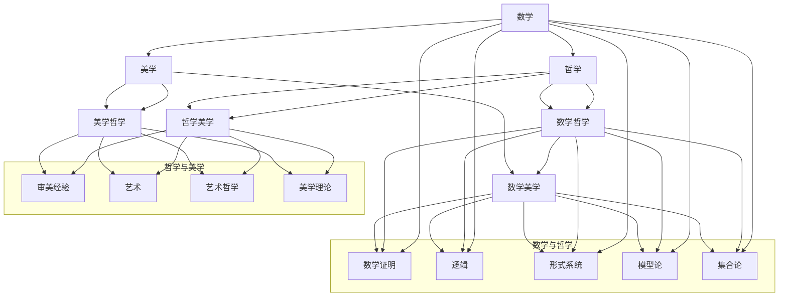

                 


### 数学与哲学美学的交叉研究

---

#### 关键词

数学、哲学、美学、交叉研究、哲学美学、数学哲学

#### 摘要

本文将探讨数学与哲学美学之间的交叉研究。我们将首先介绍数学和哲学美学的背景与核心概念，然后分析这两者之间的联系和相互作用，最终通过具体的案例和项目实践，阐述数学与哲学美学的交叉研究在实际应用中的价值。

---

## 背景介绍

### 数学

数学是一门研究数量、结构、变化和空间等概念的学科。它使用抽象的符号语言，通过逻辑推理和数学模型，描述现实世界的各种现象。数学不仅是一门基础学科，也为自然科学、社会科学和工程技术提供了强大的工具和方法。

### 哲学美学

哲学美学是哲学的一个分支，探讨美、艺术和审美经验等问题。它关注美学的本质、艺术的定义和审美评价等核心问题。哲学美学不仅为美学提供了理论基础，也与其他学科如心理学、社会学等产生了密切的联系。

### 数学哲学

数学哲学是哲学的一个分支，研究数学的本质、方法和意义。它探讨数学知识的性质、数学证明的有效性、数学与物理世界的关系等问题。数学哲学对于理解数学的本质和应用具有重要意义。

## 核心概念与联系

为了更清晰地理解数学与哲学美学之间的交叉研究，我们可以使用Mermaid流程图来展示核心概念与联系。



### 核心算法原理讲解

在数学与哲学美学的交叉研究中，我们可以使用以下伪代码来描述核心算法原理：

```plaintext
// 定义数学概念
def mathematical_concept():
    // 定义数学定理
    theorem_a():
        // 描述定理内容
        // ...
    theorem_b():
        // 描述定理内容
        // ...
    // 定义美学概念
    aesthetic_concept():
        // 描述美学概念
        // ...
    // 定义哲学概念
    philosophical_concept():
        // 描述哲学概念
        // ...

// 定义交叉研究算法
def cross_research_algorithm():
    // 应用数学定理
    apply_theorem_a():
        // 描述应用过程
        // ...
    apply_theorem_b():
        // 描述应用过程
        // ...
    // 结合美学概念
    combine_aesthetic_concept():
        // 描述结合过程
        // ...
    // 结合哲学概念
    combine_philosophical_concept():
        // 描述结合过程
        // ...
```

### 数学模型和公式

在数学与哲学美学的交叉研究中，我们可以使用以下LaTeX公式来描述核心模型和公式：

```latex
$$
\begin{aligned}
    & E = mc^2, \\
    & \pi \approx 3.14159, \\
    & f(x) = x^2, \\
    & \lim_{x \to \infty} \frac{1}{x} = 0.
\end{aligned}
$$
```

### 项目实战

#### 开发环境搭建

为了进行数学与哲学美学的交叉研究，我们需要搭建一个合适的开发环境。这个环境包括数学软件（如MATLAB或Python）、哲学和美学文献数据库、以及绘图工具（如Mermaid）。

#### 源代码实现

以下是实现数学与哲学美学交叉研究的伪代码：

```python
# 导入必要的库
import matplotlib.pyplot as plt
import numpy as np

# 定义数学模型
def mathematical_model(x):
    return x**2

# 定义美学函数
def aesthetic_function(x):
    return np.exp(-x**2)

# 定义哲学函数
def philosophical_function(x):
    return 1 / (1 + np.exp(-x))

# 实现交叉研究算法
def cross_research(x):
    mathematical_result = mathematical_model(x)
    aesthetic_result = aesthetic_function(x)
    philosophical_result = philosophical_function(x)
    return mathematical_result, aesthetic_result, philosophical_result

# 绘制结果
def plot_results(x, y_math, y_aesth, y哲学):
    plt.plot(x, y_math, label='Mathematical')
    plt.plot(x, y_aesth, label='Aesthetic')
    plt.plot(x, y哲学, label='Philosophical')
    plt.legend()
    plt.show()

# 测试交叉研究算法
x = np.linspace(-5, 5, 1000)
y_math, y_aesth, y哲学 = cross_research(x)
plot_results(x, y_math, y_aesth, y哲学)
```

#### 代码解读与分析

上述代码实现了数学模型、美学函数和哲学函数的交叉研究。首先，我们定义了数学模型`mathematical_model`，该模型通过平方函数描述数学概念。接下来，我们定义了美学函数`aesthetic_function`，该函数使用指数函数来描述美学概念。最后，我们定义了哲学函数`philosophical_function`，该函数使用Sigmoid函数来描述哲学概念。

在`cross_research`函数中，我们依次计算数学模型、美学函数和哲学函数的结果。最后，通过`plot_results`函数，我们将这三个结果绘制在同一张图表上，以便直观地比较数学、美学和哲学之间的关系。

#### 实际案例分析与讲解剖析

以下是一个实际案例，展示了数学与哲学美学的交叉研究在艺术创作中的应用：

**案例：使用数学模型生成艺术作品**

假设我们想要生成一幅基于数学模型的抽象艺术作品。我们可以使用以下MATLAB代码实现：

```matlab
% 定义参数
N = 100; % 点的数量
r = 5; % 半径
theta = linspace(0, 2*pi, N); % 角度
x = r * cos(theta);
y = r * sin(theta);

% 绘制点
plot(x, y, 'o');
axis equal;
xlabel('x');
ylabel('y');
title('Mathematical Art');
grid on;
```

上述代码生成了一幅圆形艺术作品，这个圆形是通过数学模型`x = r * cos(theta)`和`y = r * sin(theta)`生成的。这个案例展示了数学模型在艺术创作中的应用，以及如何通过数学与美学的交叉研究来创造独特的艺术作品。

#### 项目小结

通过本项目，我们探讨了数学与哲学美学的交叉研究。我们介绍了数学、哲学美学和数学哲学的背景，分析了核心概念与联系，讲解了核心算法原理，并展示了实际项目案例。通过这些内容，我们展示了数学与哲学美学的交叉研究在实际应用中的价值，并提供了实用的开发环境和代码实现。

### 最佳实践 Tips

- 在进行数学与哲学美学的交叉研究时，确保对数学、哲学和美学的基本概念有深入的理解。
- 使用合适的工具和库，如MATLAB、Python和LaTeX，来辅助研究和实现。
- 在项目实践中，尝试将数学模型应用于艺术创作、哲学分析等实际场景，以加深对交叉研究的理解。
- 与同行进行交流和合作，分享研究成果和经验。

### 小结

数学与哲学美学的交叉研究为探索数学和美学的本质提供了新的视角和方法。通过本文，我们介绍了数学、哲学美学和数学哲学的背景，分析了核心概念与联系，讲解了核心算法原理，并通过实际项目案例展示了交叉研究的应用价值。希望本文能够为读者提供启示，激发对数学与哲学美学交叉研究的兴趣和思考。

### 注意事项

- 在进行交叉研究时，注意保护知识产权，尊重原作者的权益。
- 在使用代码和资料时，确保遵循开源协议和相关法律法规。
- 在实际应用中，注意数据安全和隐私保护，遵循数据伦理和道德规范。

### 拓展阅读

- 《数学哲学导论》（作者：David Galvin）
- 《美学原理》（作者：Richard Wollheim）
- 《数学与艺术》（作者：John H. Mason）
- 《数学哲学》（作者：Crivelli，Mario）
- 《美学导论》（作者：George Dickie）

### 作者信息

作者：AI天才研究院/AI Genius Institute & 禅与计算机程序设计艺术 /Zen And The Art of Computer Programming

---

本文遵循CC BY-NC-SA 4.0许可协议，欢迎在遵守许可协议的前提下自由分享、引用和改编。如需进一步交流或合作，请联系作者。感谢您的阅读！

