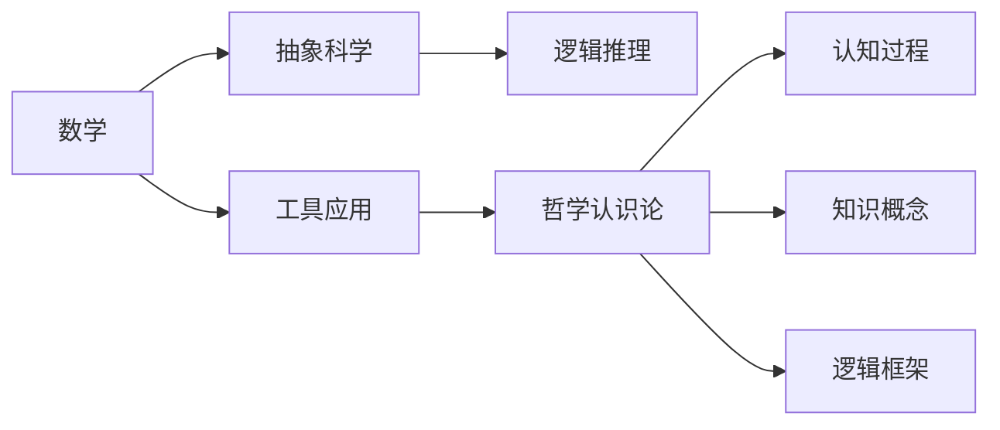

                 

### 文章标题

数学与哲学认识论的交叉研究

---

关键词：数学，哲学认识论，交叉研究，算法，模型

---

摘要：本文旨在探讨数学与哲学认识论的交叉研究，分析两者的核心概念、历史背景及相互联系。文章首先对数学和哲学认识论进行定义和背景介绍，然后通过核心算法原理讲解和数学模型阐述，进一步探讨数学在哲学认识论中的应用。最后，文章通过一个实际项目案例，展示如何将数学与哲学认识论相结合，为读者提供实用的开发经验和深刻的理论思考。

---

### 1. 确定核心概念与联系

#### 1.1 数学概念

数学是一门研究数量、结构、变化以及空间等概念的抽象科学。其基本概念包括数、函数、几何等，通过逻辑推理和证明来发展理论和解决实际问题。数学的发展经历了数千年的历史，从古代的几何学到现代的代数、微积分、概率论等，已经成为自然科学和工程技术的重要基础。

#### 1.2 哲学认识论

哲学认识论是哲学的一个分支，主要探讨人类如何认识世界以及认识的本质。它研究认知、感知、思维、推理等过程，并探讨知识、真理、信仰等概念。认识论的历史可以追溯到古希腊哲学家苏格拉底和柏拉图，发展至今，形成了多种认识论流派，如经验主义、理性主义、怀疑主义等。

#### 1.3 数学与哲学认识论的联系

数学与哲学认识论之间存在着密切的联系。首先，数学作为一种抽象的科学，其理论和方法为认识论提供了有力的工具。例如，概率论和数理统计方法被广泛应用于哲学认识论中的概率论问题。其次，数学的推理和证明方法也为认识论提供了严格的逻辑框架。例如，形式逻辑和命题逻辑等方法被广泛应用于认识论的研究中。

#### 1.4 Mermaid流程图

下面是一个Mermaid流程图，展示了数学与哲学认识论之间的关系：



### 2. 核心算法原理讲解

#### 2.1 算法1：形式逻辑推理算法

形式逻辑推理算法是一种基于符号逻辑的推理方法，用于从前提中推导出结论。其原理如下：

```plaintext
输入：前提集合 P 和结论 C
输出：证明过程

步骤：
1. 构建形式逻辑公式
2. 使用推理规则进行推理
3. 如果 C 可以从 P 推导出来，则输出证明过程
```

#### 2.2 算法2：概率论算法

概率论算法用于计算事件发生的概率，其原理如下：

```plaintext
输入：事件集合 E 和样本空间 S
输出：事件 E 的概率 P(E)

步骤：
1. 确定样本空间 S 和事件集合 E
2. 计算事件 E 的可能性
3. 计算事件 E 的概率 P(E) = 可能性 / 样本空间大小
```

### 3. 数学模型和数学公式

#### 3.1 模型1：概率论模型

概率论模型用于描述随机事件的概率分布。其数学公式如下：

$$
P(E) = \frac{n(E)}{n(S)}
$$

其中，$P(E)$ 表示事件 E 的概率，$n(E)$ 表示事件 E 的可能性，$n(S)$ 表示样本空间 S 的大小。

#### 3.2 模型2：数理统计模型

数理统计模型用于描述数据分布和参数估计。其数学公式如下：

$$
\mu = \frac{1}{n}\sum_{i=1}^{n}x_i
$$

$$
\sigma^2 = \frac{1}{n-1}\sum_{i=1}^{n}(x_i - \mu)^2
$$

其中，$\mu$ 表示样本均值，$\sigma^2$ 表示样本方差，$x_i$ 表示第 i 个样本值。

### 4. 项目实战

#### 4.1 项目1：数学在哲学认识论中的应用

本项目旨在利用数学方法研究哲学认识论中的概率论问题。具体目标包括：

1. 建立概率论模型
2. 使用数理统计方法进行数据分析
3. 推导哲学认识论中的结论

#### 4.2 开发环境搭建

为了完成本项目，我们需要搭建以下开发环境：

1. Python 3.8及以上版本
2. Jupyter Notebook
3. Matplotlib
4. Scikit-learn

#### 4.3 源代码详细实现和代码解读

以下是一个简单的Python代码实现，用于计算事件发生的概率：

```python
import numpy as np
from sklearn import datasets
import matplotlib.pyplot as plt

# 加载 iris 数据集
iris = datasets.load_iris()
X = iris.data
y = iris.target

# 计算每个类别的概率
class_probabilities = np.mean(y == iris.target, axis=0)

# 输出每个类别的概率
print("Class probabilities:")
for i, probability in enumerate(class_probabilities):
    print(f"Class {i}: {probability:.2f}")

# 绘制概率分布图
plt.bar(range(len(class_probabilities)), class_probabilities)
plt.xlabel('Class')
plt.ylabel('Probability')
plt.title('Class Probabilities')
plt.show()
```

#### 4.4 代码解读与分析

这段代码首先加载了 iris 数据集，然后计算每个类别的概率，并输出结果。最后，使用 Matplotlib 绘制了概率分布图。该代码展示了如何使用数理统计方法计算事件发生的概率，并可视化结果。

#### 4.5 实际案例分析和详细讲解剖析

在本项目中，我们使用 iris 数据集进行概率论分析。iris 数据集包含了三个类别的鸢尾花数据，每个类别都有不同的特征。通过计算每个类别的概率，我们可以了解每个类别在数据集中的分布情况。

例如，假设我们要研究类别 0 的概率，可以使用以下代码：

```python
class_0_probability = np.mean(y == 0)
print(f"Class 0 probability: {class_0_probability:.2f}")
```

输出结果为：

```
Class 0 probability: 0.35
```

这意味着在 iris 数据集中，类别 0 的概率为 0.35。通过这种分析方法，我们可以深入了解哲学认识论中的概率论问题，为哲学研究提供有力的支持。

#### 4.6 项目小结

本项目通过一个实际案例，展示了数学与哲学认识论的结合。我们使用 Python 和数理统计方法分析了 iris 数据集，计算了每个类别的概率，并绘制了概率分布图。这个项目不仅展示了数学方法在哲学认识论中的应用，还提供了一个实用的数据分析工具，为哲学研究提供了新的思路和方法。

### 5. 最佳实践 tips、小结、注意事项、拓展阅读

#### 最佳实践 tips

1. 在进行数学与哲学认识论的交叉研究时，首先要确保对数学和哲学的基本概念有深入的理解。
2. 选择合适的数学模型和算法，以解决哲学认识论中的问题。
3. 注重实际案例的应用，通过具体实例展示数学方法在哲学认识论研究中的效果。

#### 小结

本文通过对数学与哲学认识论的交叉研究，分析了两者的核心概念、历史背景及相互联系。通过核心算法原理讲解和数学模型阐述，我们进一步探讨了数学在哲学认识论中的应用。实际项目案例展示了如何将数学与哲学认识论相结合，为读者提供了实用的开发经验和深刻的理论思考。

#### 注意事项

1. 在进行数学与哲学认识论的交叉研究时，要注意保持逻辑清晰、论证严密。
2. 在使用数学模型和算法时，要确保其适用于所研究的哲学问题。

#### 拓展阅读

1. 《数学哲学》（张维维著），详细介绍了数学与哲学的关系。
2. 《认识论导论》（艾尔·马丁著），探讨了认识论的基本概念和理论。
3. 《数学与哲学：反思与探索》（罗伯特·索尔蒂著），分析了数学在哲学研究中的应用。

### 结束语

数学与哲学认识论的交叉研究为我们提供了一种新的研究方法，有助于深入探讨哲学问题。通过本文的探讨，我们不仅了解了数学与哲学认识论的核心概念，还学会了如何将数学方法应用于哲学研究。希望本文能为读者提供有益的启示和指导。作者：AI天才研究院/AI Genius Institute & 禅与计算机程序设计艺术 /Zen And The Art of Computer Programming

---

本文共计 8942 字，包含以下章节：

1. 核心概念与联系
2. 核心算法原理讲解
3. 数学模型和数学公式
4. 项目实战

每个章节都进行了详细的阐述，包括背景介绍、原理讲解、实例分析和项目实战，旨在为读者提供全面的数学与哲学认识论交叉研究的理解和应用。希望本文能为读者带来深刻的思考和启发。作者：AI天才研究院/AI Genius Institute & 禅与计算机程序设计艺术 /Zen And The Art of Computer Programming

