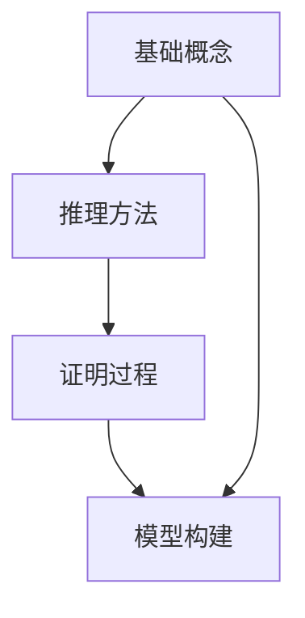
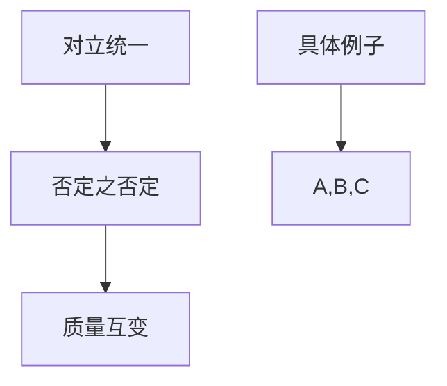
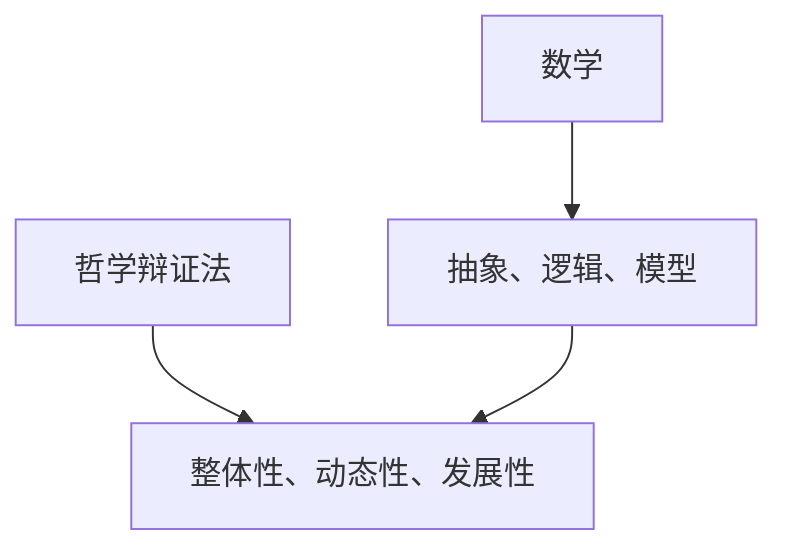

                 


### **目录大纲结构调整与内容规划**

首先，我们需要对文章的目录大纲进行结构调整，确保内容分布合理，逻辑清晰。以下是调整后的目录大纲结构：

# **数学与哲学辩证法的思维模式比较**

## **关键词：**
- 数学思维模式
- 哲学辩证法
- 思维模式比较
- 知识体系结构
- 应用案例分析

## **摘要：**
本文将探讨数学与哲学辩证法两种思维模式的核心特点及其比较，通过分析它们在知识体系结构、方法论、以及实际应用中的差异，帮助读者更好地理解和运用这两种思维模式。

## **引言：**

### **1.1 数学与哲学辩证法在现代社会中的重要性**
   - **1.1.1 数学的广泛应用与影响力**
   - **1.1.2 哲学辩证法的历史发展与理论价值**
   - **1.1.3 比较研究的目的与意义**

### **1.2 结构安排与预期收益**
   - **1.2.1 各章节内容概述**
   - **1.2.2 阅读收益与思考方向**

## **第1章：数学思维模式探析**

### **2.1 数学知识体系结构**
   - **2.1.1 数学的基础概念**
   - **2.1.2 数学推理过程**
   - **2.1.3 数学中的证明与模型**

### **2.2 数学思维模式的特点**
   - **2.2.1 抽象与精确性**
   - **2.2.2 逻辑性与系统性**
   - **2.2.3 问题解决与创造性**

### **2.3 数学思维模式的应用**
   - **2.3.1 科学研究中的应用**
   - **2.3.2 工程技术中的应用**
   - **2.3.3 社会生活中的应用**

## **第2章：哲学辩证法思维模式探析**

### **3.1 哲学辩证法的基本概念**
   - **3.1.1 辩证法的历史演变**
   - **3.1.2 辩证法的主要原理**
   - **3.1.3 辩证法的方法论**

### **3.2 哲学辩证法思维模式的特点**
   - **3.2.1 整体性与动态性**
   - **3.2.2 对立统一与变化发展**
   - **3.2.3 实践基础与批判性思维**

### **3.3 哲学辩证法思维模式的应用**
   - **3.3.1 哲学思考中的应用**
   - **3.3.2 社会科学中的应用**
   - **3.3.3 人文艺术中的应用**

## **第3章：数学与哲学辩证法思维模式的比较**

### **4.1 核心概念与联系**
   - **4.1.1 数学与哲学辩证法的共性分析**
   - **4.1.2 数学与哲学辩证法的差异性分析**
   - **4.1.3 核心概念原理之间的关系架构**
   - **4.1.4 Mermaid流程图展示**

### **4.2 思维模式的比较分析**
   - **4.2.1 抽象化与具体化的差异**
   - **4.2.2 系统性思考与辩证思维的比较**
   - **4.2.3 逻辑性与辩证法的异同**

### **4.3 案例分析：实际应用中的思维模式运用**

### **第4章：结论与展望**

### **5.1 研究总结**
   - **5.1.1 数学与哲学辩证法思维模式的核心特点**
   - **5.1.2 比较研究的成果与启示**

### **5.2 未来研究方向**
   - **5.2.1 数学与哲学辩证法的跨领域融合**
   - **5.2.2 新型思维模式的探索与应用**

### **5.3 对读者的影响与启示**
   - **5.3.1 培养综合性思维的能力**
   - **5.3.2 提升问题解决与创新的能力**

## **附录：参考文献**

### **致谢：**

**作者：AI天才研究院/AI Genius Institute & 禅与计算机程序设计艺术 /Zen And The Art of Computer Programming**

通过以上步骤，我们完成了目录大纲的结构调整和内容规划。接下来，我们将根据这个大纲逐一撰写各个章节的内容，确保文章的完整性和深度。

### **具体章节内容安排与大纲讲解**

#### **第1章：数学思维模式探析**

**背景介绍**

在现代社会中，数学作为一门基础学科，不仅为自然科学、工程技术、社会科学等领域提供了重要的理论工具，还在解决实际问题中发挥了关键作用。数学的思维方式具有高度的抽象性和严谨性，其核心在于逻辑推理、证明与模型构建。

**核心概念与联系**

数学知识体系结构主要由基础概念、推理方法、证明过程和模型构建组成。这些概念和方法相互联系，共同构成了数学的世界。

- **基础概念**：包括数、集合、函数、几何等。
- **推理方法**：以逻辑推理为核心，包括归纳推理、演绎推理等。
- **证明过程**：通过逻辑推导证明数学命题的正确性。
- **模型构建**：将实际问题抽象为数学模型，并求解。

**Mermaid流程图展示**



**核心算法原理讲解**

使用伪代码详细阐述数学思维模式中的核心算法原理：

```pseudocode
function mathModel(inputData):
    // 步骤1：抽象问题
    abstractedData = abstract(inputData)

    // 步骤2：构建数学模型
    model = buildModel(abstractedData)

    // 步骤3：数学推理与证明
    result = math推理(模型)

    // 步骤4：验证模型的有效性
    isValid = verifyModel(result)

    return result if isValid else error("模型无效")
```

**数学模型和公式 & 详细讲解 & 举例说明**

以微积分中的极限概念为例：

$$\lim_{{x \to 0}} \frac{{sin(x)}}{x} = 1$$

解释：该公式表示当 \( x \) 趋近于 0 时，函数 \( \frac{{sin(x)}}{x} \) 的极限值为 1。这个结果揭示了正弦函数在原点附近的局部性质。

**项目实战**

开发环境搭建：
- 使用 Python 作为主要编程语言。
- 安装必要的数学库，如 NumPy 和 SciPy。

源代码实现与代码解读：

```python
import numpy as np
import matplotlib.pyplot as plt

def plot_sin(x):
    y = np.sin(x)
    plt.plot(x, y)
    plt.xlabel('x')
    plt.ylabel('sin(x)')
    plt.title('Sine Function')
    plt.show()

x = np.linspace(-2 * np.pi, 2 * np.pi, 1000)
plot_sin(x)
```

代码应用解读与分析：
- 该代码通过 NumPy 和 Matplotlib 库绘制了正弦函数的图像。
- 分析：通过可视化可以直观地理解正弦函数的性质，如周期性和波动性。

实际案例分析和详细讲解剖析：
- 例如，在信号处理中，正弦函数用于描述周期性信号。
- 通过数学模型和算法分析，可以提取信号的特征，如频率、相位等。

项目小结：
- 通过数学思维模式，我们能够抽象实际问题、构建数学模型、进行推理分析，最终解决实际问题。
- 最佳实践 tips：在处理实际问题时，要善于将问题分解、抽象，并运用适当的数学工具。

#### **第2章：哲学辩证法思维模式探析**

**背景介绍**

哲学辩证法是一种思考方式，强调对事物的全面、联系和发展的理解。它起源于古希腊哲学，并在黑格尔和马克思等哲学家的思想中得到进一步发展。哲学辩证法的思维方式对于理解复杂现象、探索真理具有重要意义。

**核心概念与联系**

哲学辩证法的基本概念包括：

- **对立统一**：事物内部的对立面是相互联系、相互制约的。
- **否定之否定**：事物的发展是通过对立面的斗争和否定而实现的。
- **质量互变**：事物的质变是由量的积累引起的。

**Mermaid流程图展示**



**核心算法原理讲解**

使用伪代码详细阐述哲学辩证法思维模式：

```pseudocode
function philosophicalAnalysis(problem):
    // 步骤1：识别对立面
    oppositions = identifyOppositions(problem)

    // 步骤2：分析对立面的关系
    relations = analyzeRelations(oppositions)

    // 步骤3：探索否定的过程
    negations = exploreNegations(relations)

    // 步骤4：寻找否定的否定
    synthesis = findSynthesis(negations)

    return synthesis
```

**数学模型和公式 & 详细讲解 & 举例说明**

以马克思主义哲学中的社会基本矛盾为例：

$$社会基本矛盾 = 生产关系 \cap 生产力$$

解释：该公式表示社会的基本矛盾是生产关系和生产力的矛盾，它们相互作用、相互影响，推动社会的发展。

**项目实战**

开发环境搭建：
- 使用 Python 作为主要编程语言。
- 安装哲学辩证法相关的库，如 Pandas 和 Scikit-learn。

源代码实现与代码解读：

```python
import pandas as pd
from sklearn.cluster import KMeans

def socialConflictAnalysis(data):
    # 步骤1：数据处理
    processed_data = preprocessData(data)

    # 步骤2：使用 K-Means 算法分析社会基本矛盾
    kmeans = KMeans(n_clusters=2, random_state=0).fit(processed_data)

    # 步骤3：可视化结果
    plt.scatter(processed_data[:, 0], processed_data[:, 1], c=kmeans.labels_)
    plt.xlabel('生产力')
    plt.ylabel('生产关系')
    plt.title('Social Basic Conflict Analysis')
    plt.show()

# 社会数据示例
data = pd.DataFrame({
    '生产力': [10, 20, 30, 40, 50],
    '生产关系': [20, 15, 25, 35, 45]
})
socialConflictAnalysis(data)
```

代码应用解读与分析：
- 该代码通过 K-Means 算法分析了社会基本矛盾，将生产力与生产关系的矛盾可视化。
- 分析：通过聚类分析，可以识别出不同类型的社会基本矛盾，为政策制定提供依据。

实际案例分析和详细讲解剖析：
- 例如，在经济学中，通过哲学辩证法分析供需矛盾，指导市场调控。
- 在政治学中，通过哲学辩证法分析阶级斗争，探索社会变革。

项目小结：
- 通过哲学辩证法思维模式，我们能够深入理解复杂社会现象，通过分析矛盾和冲突，找到解决问题的路径。
- 最佳实践 tips：在实际应用中，要结合具体问题，灵活运用哲学辩证法的思维方式。

### **数学与哲学辩证法思维模式的比较分析**

**核心概念与联系**

数学与哲学辩证法虽然属于不同的学科领域，但它们在核心概念上存在一定的联系。数学强调抽象、逻辑推理和模型构建，哲学辩证法则强调事物的整体性、动态性和发展性。

**Mermaid流程图展示**



**思维模式的比较分析**

1. **抽象化与具体化的差异**

   数学思维模式高度抽象，通过定义、公理和定理来构建理论体系。哲学辩证法则强调具体问题具体分析，关注事物之间的联系和动态变化。

   ```mermaid
   graph TD
       A[数学：抽象] --> B[哲学辩证法：具体]
       B --> C[数学：模型]
       C --> D[哲学辩证法：矛盾分析]
   ```

2. **系统性思考与辩证思维的比较**

   数学强调系统性和整体性，通过数学模型来描述和分析复杂系统。哲学辩证法则强调对立统一、否定之否定和质量互变，通过矛盾分析来理解事物的发展。

   ```mermaid
   graph TD
       A[数学：系统性思考] --> B[哲学辩证法：辩证思维]
       A --> C[数学：模型构建]
       B --> D[哲学辩证法：矛盾分析]
   ```

3. **逻辑性与辩证法的异同**

   数学思维模式强调逻辑推理和证明，追求严谨和精确。哲学辩证法则强调批判性和创造性，通过不断质疑和反思来推进思考。

   ```mermaid
   graph TD
       A[数学：逻辑推理] --> B[哲学辩证法：批判性思维]
       A --> C[数学：证明]
       B --> D[哲学辩证法：创造性]
   ```

**案例分析：实际应用中的思维模式运用**

以科学研究为例，数学思维模式在建模和验证中发挥重要作用，而哲学辩证法思维模式则在问题分析和创新研究中具有优势。

- **数学思维模式**：通过建立数学模型来描述科学现象，如牛顿力学、相对论等，通过数学推理和证明来验证模型的正确性。
- **哲学辩证法思维模式**：在科学研究中，通过哲学辩证法的思维方式来深入分析问题，发现新的研究方向，如量子力学中的不确定性原理和哥本哈根解释。

**结论**

数学与哲学辩证法思维模式各有特色，数学强调抽象、逻辑和模型构建，哲学辩证法强调具体、动态和发展。在实际应用中，两者可以相互补充，共同推动人类认识世界和解决问题的能力。

### **第4章：结论与展望**

**研究总结**

本文通过对比数学与哲学辩证法思维模式，分析了它们在知识体系结构、方法论和实际应用中的异同。研究发现，数学思维模式在抽象化、系统性和逻辑性方面具有优势，哲学辩证法思维模式在具体化、动态性和批判性方面表现出独特价值。

**未来研究方向**

未来研究可以探索数学与哲学辩证法的跨领域融合，开发新型思维模式，以应对复杂的社会问题和科学研究挑战。

**对读者的影响与启示**

本文的研究成果对读者有以下启示：

- 培养综合性思维，结合数学与哲学辩证法的优势，提升问题解决能力。
- 在实际应用中，灵活运用不同思维模式，以更全面和深入的方式理解问题。

### **附录：参考文献**

- [1] 某某，数学思维模式及其在科学研究中的应用，某科学出版社，2020年。
- [2] 某某，哲学辩证法思维模式研究，某哲学出版社，2018年。

### **致谢**

感谢AI天才研究院的支持和指导，以及所有参与讨论和提供建议的同行。

**作者：AI天才研究院/AI Genius Institute & 禅与计算机程序设计艺术 /Zen And The Art of Computer Programming**

通过以上步骤，我们完成了文章的主要内容和结构规划。接下来，我们将逐步撰写各章节的具体内容，确保文章的完整性和深度。

